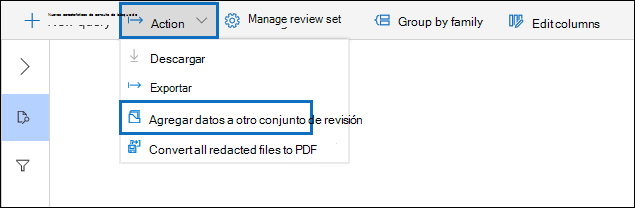
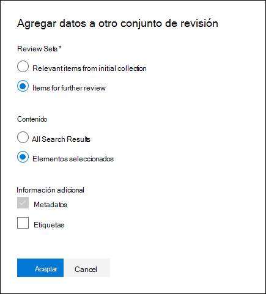

# Agregar datos a un conjunto de revisión desde otro conjunto de revisión

En algunos casos, puede ser necesario seleccionar documentos de un conjunto de revisión y trabajar con ellos de forma individual en otro conjunto de revisión. Esto es especialmente útil si ha seleccionado contenido en un conjunto de revisión y desea ejecutar análisis en el subconjunto de datos.

Siga el flujo de trabajo de este artículo para agregar contenido de un conjunto de revisión a otro.

## Antes de empezar

Antes de empezar, deberá crear un nuevo conjunto de revisión para agregar los datos a.  Se puede Agregar un nuevo conjunto de revisiones en la ficha **Review sets** del caso. Para obtener más información, vea [Create a Review Set](managing-review-sets.md#create-a-review-set).

## Paso 1: identificar el contenido que se va a agregar a otro conjunto de revisión

Puede agregar contenido de un conjunto de revisión a otro seleccionando documentos específicos en el conjunto de revisión de origen o seleccionando todos los elementos devueltos por el conjunto de revisión consulta. Si está agregando elementos seleccionados, seleccione los elementos, seleccione **acción**y, a continuación, seleccione **Agregar a otro conjunto de revisión**.

## Paso 2: especificar opciones para agregar a otro conjunto de revisión

En la página **Agregar a otro** control flotante opciones de definición de revisión, elija el conjunto de revisiones al que desea agregar los elementos. Elija si desea agregar **todos los resultados de búsqueda** o los **elementos seleccionados**.  **Información adicional** proporciona opciones para incluir todos los metadatos de los elementos y si desea incluir las etiquetas (activando la casilla de verificación **etiquetas** ) en el conjunto de revisión de origen cuando se agregan los documentos al nuevo conjunto de revisión.  

Después de hacer clic en **Aceptar**, se crea un nuevo trabajo (denominado **Agregar datos a otro conjunto de revisión**) para agregar el contenido a otro conjunto de revisión. Puede ir a la pestaña **trabajos** y supervisar el progreso de este trabajo. Para obtener más información, consulte [Manage Jobs](managing-jobs-ediscovery20.md).
