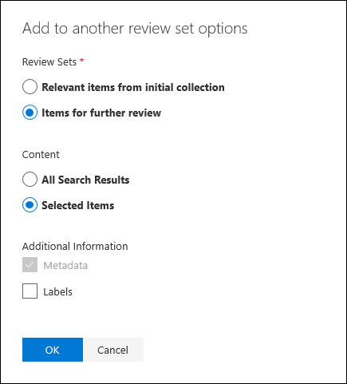

# Agregar datos a un conjunto de revisión desde otro conjunto de revisiónAdd data to a review set from another review set

En algunos casos, puede que sea necesario seleccionar documentos de un conjunto de revisión y trabajar con ellos individualmente en otro conjunto de revisión.In some cases, it may be necessary to select documents from one review set and work with them individually in another review set. Esto es especialmente útil si ha seleccionado contenido en un conjunto de revisión y quiere ejecutar un análisis en el subconjunto de datos.This is especially useful if you've culled content in a review set and want to run analytics on the subset of data.

Siga el flujo de trabajo de este artículo para agregar contenido de un conjunto de revisión a otro.Follow the workflow in this article to add content from one review set to another.

## Crear un conjunto de revisiónCreate a review set

Antes de empezar, deberá crear un conjunto de revisión para agregar los datos.Before you start, you'll need to create a review set to add the data to.  Se puede agregar un nuevo conjunto de revisión en la **pestaña Conjuntos de revisión** del caso.A new review set can be added on the **Review sets** tab of the case. Para obtener más información, vea [Create a review set](managing-review-sets.md#create-a-review-set).For more information, see [Create a review set](managing-review-sets.md#create-a-review-set).

## Paso 1: Identificar el contenido que se agregará a otro conjunto de revisiónStep 1: Identify content to add to another review set

Para agregar contenido de un conjunto de revisión a otro, seleccione documentos específicos en el conjunto de revisión de origen o seleccione todos los elementos devueltos por la consulta del conjunto de revisión.You can add content from one review set to another one by selecting specific documents in the source review set or by selecting all items returned by review set query. Si va a agregar elementos seleccionados, seleccione los elementos, **seleccione Acción** y, a continuación, seleccione Agregar a otro conjunto **de revisión**.If you're adding selected items, select the items, select **Action**, and then select **Add to another review set**.

## Paso 2: Especificar opciones para agregar a otro conjunto de revisiónStep 2: Specify options for adding to another review set

En la **página desplegable Agregar a otro** conjunto de revisión, elija el conjunto de revisión al que desea agregar los elementos.In the **Add to another review set options** flyout page, choose the review set you want to add the items to. Elija si desea agregar **Todos los resultados de búsqueda** o Elementos **seleccionados**.Choose whether to add **All search results** or **Selected items**.  **La** información adicional proporciona opciones para incluir todos los metadatos de  los elementos y si se deben incluir las etiquetas (seleccionando la casilla Etiquetas) del conjunto de revisión de origen cuando se agregan los documentos al nuevo conjunto de revisión.**Additional information** provides options to include all metadata from the items and whether to include the tags (by selecting the **Labels** check box) from the source review set when the documents are added to the new review set.  

Después de hacer clic **en Aceptar,** se crea un nuevo trabajo (denominado **Agregar datos** a otro conjunto de revisión) para agregar el contenido a otro conjunto de opiniones.After you click **Ok**, a new job (named **Adding data to another review set**) is created to add the content to another review set. Puede ir a la pestaña **Trabajos** y supervisar el progreso de este trabajo.You can go to the **Jobs** tab and monitor the progress of this job. Para obtener más información, vea [Administrar trabajos](managing-jobs-ediscovery20.md).For more information, see [Manage jobs](managing-jobs-ediscovery20.md).
