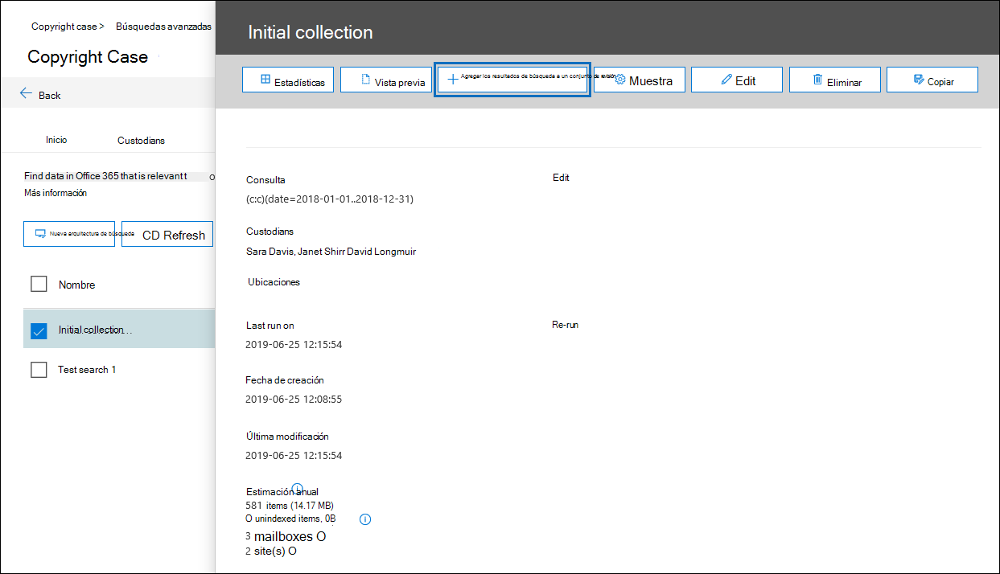
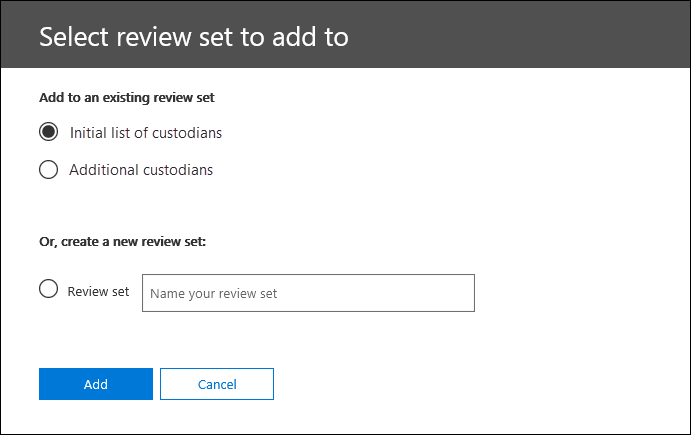

# Agregar los resultados de búsqueda a un conjunto de revisión

Cuando esté satisfecho con los resultados de una búsqueda y esté listo para revisar y analizar los resultados de la búsqueda, puede agregarlos a un conjunto de revisión en el caso. La copia de los datos originales en el conjunto de revisión también facilita el proceso de revisión y análisis al proporcionarle herramientas avanzadas de análisis como detección de temas, detección de casi duplicados y identificación de subprocesos de correo electrónico. También puede agregar datos de orígenes de datos que no sean de Office 365 a un conjunto de revisión, de modo que pueda revisar los datos además de los datos que recopila de Office 365. 

Cuando se agregan los resultados de una búsqueda a un conjunto de revisión (los conjuntos de revisión en un caso se enumeran en la ficha **Review sets** ), se producen las siguientes situaciones:

- La búsqueda se vuelve a ejecutar. Esto significa que los resultados de la búsqueda reales que se copien en el conjunto de revisión pueden ser diferentes de los resultados estimados que se devolvieron cuando se ejecutó la búsqueda por última vez.

- Todos los elementos de los resultados de la búsqueda se copian del origen de datos original en los servicios Live 365 de Office y se copian en una ubicación de almacenamiento seguro de Azure en la nube de Microsoft.

- Todos los elementos (incluido el contenido y los metadatos) se vuelven a indizar para que todos los datos del conjunto de revisión se puedan buscar por completo durante la revisión de los datos del caso. Al volver a indizar los datos, se producen búsquedas exhaustivas y rápidas al buscar en los datos del conjunto de revisión durante la investigación de caso.

Para agregar datos a un conjunto de revisión, haga clic en una búsqueda en la ficha **búsquedas** y, a continuación, haga clic en **Agregar resultados a revisión establecida** en la página de flotante.

Puede Agregar a un conjunto de revisiones existente o crear un nuevo conjunto de revisión.  Si agrega a un nuevo conjunto de revisiones, especifique el nombre y, a continuación, haga clic en **Agregar**.

Agregar datos a un conjunto de revisión es un proceso de ejecución prolongada. Este proceso incluye la recopilación de elementos de los orígenes de datos originales en Office 365 (por ejemplo, desde buzones y sitios), copiándolos en la ubicación de almacenamiento de Azure (este proceso de copia también se denomina *ingesta*) y, a continuación, vuelva a indizar los elementos. Puede realizar un seguimiento del progreso en la ficha **trabajos** o en la ficha **búsquedas** mediante la supervisión del estado en la columna **datos agregados a la configuración de revisión** . Una vez completado el procesamiento del conjunto de revisiones, haga clic en la pestaña **Review sets** en el caso y haga clic en el conjunto de revisión para iniciar el proceso de filtrado, revisión, etiquetado y exportación de datos en el conjunto de revisiones.

## Agregar un ejemplo a un conjunto de revisión

Si desea validar los resultados de una búsqueda más minuciosamente antes de agregarlos todos a un conjunto de revisión, puede Agregar una muestra de los resultados de la búsqueda a un conjunto de revisión en lugar de agregarlo todo.

Para agregar un ejemplo a un conjunto de revisión, haga clic en una búsqueda en la ficha **búsquedas** y haga clic en **muestra** en la página de flotante. En la página **parámetros de muestreo** , elija una de las siguientes opciones:

- **Nivel de confianza%** y **intervalo de confianza%** : los elementos agregados al conjunto de revisión estarán determinados por los parámetros estadísticos que establezca. Si normalmente usa un nivel de confianza y un intervalo para los resultados de muestreo, debe especificarlos en los cuadros desplegables. De lo contrario, use la configuración predeterminada.

- **Muestra aleatoria%** : los elementos agregados al conjunto de revisión se basan en una selección aleatoria del porcentaje especificado del número total de elementos devueltos por la búsqueda.

Después de seleccionar y configurar una de las opciones anteriores, elija un conjunto de revisiones para agregar el ejemplo y, a continuación, haga clic en **Enviar**. Una vez más, puede realizar un seguimiento del progreso en la ficha **trabajos** o en la ficha **búsquedas** mediante la supervisión del estado en la columna **datos agregados a la configuración de revisión** .

## Reconocimiento óptico de caracteres

Cuando se agregan resultados de búsqueda a un conjunto de revisión, la funcionalidad de reconocimiento óptico de caracteres (OCR) en eDiscovery avanzado extrae automáticamente el texto de las imágenes e incluye el texto de la imagen con los datos que se agregan a un conjunto de revisión. Puede ver el texto extraído en el visor de texto del archivo de imagen seleccionado en el conjunto de revisiones. Esto le permite realizar revisiones y análisis adicionales del texto de las imágenes. OCR es compatible con archivos sueltos, datos adjuntos de correo electrónico e imágenes incrustadas. Para obtener una lista de los formatos de archivo de imagen que se admiten para OCR, consulte [tipos de archivo admitidos en EDiscovery avanzado](supported-filetypes-ediscovery20.md#image).

Debe habilitar la funcionalidad de OCR para cada caso que cree en la exhibición avanzada de documentos electrónicos. Para obtener más información, vea [Configure Search and Analytics Settings](configure-search-and-analytics-settings-in-advanced-ediscovery.md#optical-character-recognition-ocr).
