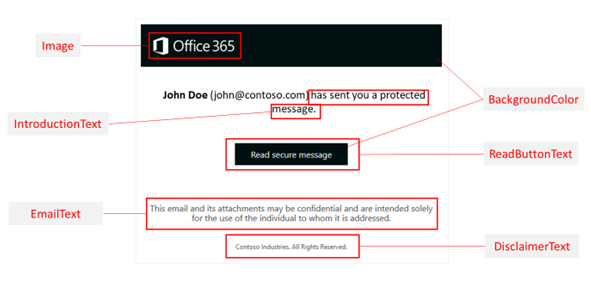

# <a name="add-your-organizations-brand-to-your-microsoft-365-for-business-message-encryption-encrypted-messages"></a><span data-ttu-id="49aeb-103">Agregar la marca de su organización a su Microsoft 365 cifrado de mensajes empresariales</span><span class="sxs-lookup"><span data-stu-id="49aeb-103">Add your organization's brand to your Microsoft 365 for business Message Encryption encrypted messages</span></span>

<span data-ttu-id="49aeb-104">Puede aplicar la personalización de marca de su empresa para personalizar la apariencia de los mensajes de correo electrónico de su organización y el portal de cifrado.</span><span class="sxs-lookup"><span data-stu-id="49aeb-104">You can apply your company branding to customize the look of your organization's email messages and the encryption portal.</span></span> <span data-ttu-id="49aeb-105">Deberá aplicar permisos de administrador global a su cuenta laboral o educativa antes de empezar.</span><span class="sxs-lookup"><span data-stu-id="49aeb-105">You'll need to apply global administrator permissions to your work or school account before you can get started.</span></span> <span data-ttu-id="49aeb-106">Una vez que tenga estos permisos, use los cmdlets Get-OMEConfiguration y Set-OMEConfiguration Windows PowerShell para personalizar estas partes de mensajes de correo electrónico cifrados:</span><span class="sxs-lookup"><span data-stu-id="49aeb-106">Once you have these permissions, use the Get-OMEConfiguration and Set-OMEConfiguration Windows PowerShell cmdlets to customize these parts of encrypted email messages:</span></span>
  
- <span data-ttu-id="49aeb-107">Texto introductorio</span><span class="sxs-lookup"><span data-stu-id="49aeb-107">Introductory text</span></span>

- <span data-ttu-id="49aeb-108">Disclaimer text</span><span class="sxs-lookup"><span data-stu-id="49aeb-108">Disclaimer text</span></span>

- <span data-ttu-id="49aeb-109">Dirección URL de la declaración de privacidad de su organización</span><span class="sxs-lookup"><span data-stu-id="49aeb-109">URL for Your organization's privacy statement</span></span>

- <span data-ttu-id="49aeb-110">Texto en el portal de OME</span><span class="sxs-lookup"><span data-stu-id="49aeb-110">Text in the OME portal</span></span>

- <span data-ttu-id="49aeb-111">Logotipo que aparece en el mensaje de correo electrónico y el portal de OME, o si se va a usar un logotipo en absoluto</span><span class="sxs-lookup"><span data-stu-id="49aeb-111">Logo that appears in the email message and OME portal, or whether to use a logo at all</span></span>

- <span data-ttu-id="49aeb-112">Color de fondo en el mensaje de correo electrónico y el portal de OME</span><span class="sxs-lookup"><span data-stu-id="49aeb-112">Background color in the email message and OME portal</span></span>

<span data-ttu-id="49aeb-113">También puede volver a la apariencia predeterminada en cualquier momento.</span><span class="sxs-lookup"><span data-stu-id="49aeb-113">You can also revert back to the default look and feel at any time.</span></span>

<span data-ttu-id="49aeb-114">Si desea tener más control, use Cifrado de mensajes avanzado de Office 365 para crear varias plantillas para los correos electrónicos cifrados que se originaron en su organización.</span><span class="sxs-lookup"><span data-stu-id="49aeb-114">If you'd like more control, use Office 365 Advanced Message Encryption to create multiple templates for encrypted emails originating from your organization.</span></span> <span data-ttu-id="49aeb-115">Use estas plantillas para controlar partes de la experiencia del usuario final.</span><span class="sxs-lookup"><span data-stu-id="49aeb-115">Use these templates to control parts of the end-user experience.</span></span> <span data-ttu-id="49aeb-116">Por ejemplo, especifique si los destinatarios pueden usar Cuentas de Google, Yahoo y Microsoft para iniciar sesión en el portal de cifrado.</span><span class="sxs-lookup"><span data-stu-id="49aeb-116">For example, specify whether recipients can use Google, Yahoo, and Microsoft Accounts to sign in to the encryption portal.</span></span> <span data-ttu-id="49aeb-117">Use plantillas para cumplir varios casos de uso, como:</span><span class="sxs-lookup"><span data-stu-id="49aeb-117">Use templates to fulfill several use cases, such as:</span></span>

- <span data-ttu-id="49aeb-118">Departamentos individuales, como Finanzas, Ventas, entre otros.</span><span class="sxs-lookup"><span data-stu-id="49aeb-118">Individual departments, such as Finance, Sales, and so on.</span></span>

- <span data-ttu-id="49aeb-119">Productos diferentes</span><span class="sxs-lookup"><span data-stu-id="49aeb-119">Different products</span></span>

- <span data-ttu-id="49aeb-120">Diferentes regiones geográficas o países</span><span class="sxs-lookup"><span data-stu-id="49aeb-120">Different geographical regions or countries</span></span>

- <span data-ttu-id="49aeb-121">Si desea permitir que se revoque el correo electrónico</span><span class="sxs-lookup"><span data-stu-id="49aeb-121">Whether you want to allow emails to be revoked</span></span>

- <span data-ttu-id="49aeb-122">Si desea que los correos electrónicos enviados a destinatarios externos expiren después de un número especificado de días.</span><span class="sxs-lookup"><span data-stu-id="49aeb-122">Whether you want emails sent to external recipients to expire after a specified number of days.</span></span>

<span data-ttu-id="49aeb-123">Una vez que haya creado las plantillas, puede aplicarlas a los correos electrónicos cifrados mediante Exchange reglas de flujo de correo.</span><span class="sxs-lookup"><span data-stu-id="49aeb-123">Once you've created the templates, you can apply them to encrypted emails by using Exchange mail flow rules.</span></span> <span data-ttu-id="49aeb-124">Si tienes Cifrado de mensajes avanzado de Office 365, puedes revocar cualquier correo electrónico que hayas marcado con estas plantillas.</span><span class="sxs-lookup"><span data-stu-id="49aeb-124">If you have Office 365 Advanced Message Encryption, you can revoke any email that you've branded by using these templates.</span></span>

## <a name="work-with-ome-branding-templates"></a><span data-ttu-id="49aeb-125">Trabajar con plantillas de personal de marca de OME</span><span class="sxs-lookup"><span data-stu-id="49aeb-125">Work with OME branding templates</span></span>

<span data-ttu-id="49aeb-126">Puede modificar varias características dentro de una plantilla de personal de marca.</span><span class="sxs-lookup"><span data-stu-id="49aeb-126">You can modify several features within a branding template.</span></span> <span data-ttu-id="49aeb-127">Puede modificar, pero no quitar, la plantilla predeterminada.</span><span class="sxs-lookup"><span data-stu-id="49aeb-127">You can modify, but not remove, the default template.</span></span> <span data-ttu-id="49aeb-128">Si tiene cifrado de mensajes avanzado, también puede crear, modificar y quitar plantillas personalizadas.</span><span class="sxs-lookup"><span data-stu-id="49aeb-128">If you have Advanced Message Encryption, you can also create, modify, and remove custom templates.</span></span> <span data-ttu-id="49aeb-129">Use Windows PowerShell para trabajar con una plantilla de personal de marca a la vez.</span><span class="sxs-lookup"><span data-stu-id="49aeb-129">Use Windows PowerShell to work with one branding template at a time.</span></span>

- <span data-ttu-id="49aeb-130">[Set-OMEConfiguration:](/powershell/module/exchange/set-omeconfiguration) modifique la plantilla de personalización de marca predeterminada o una plantilla de personalización de marca personalizada que haya creado.</span><span class="sxs-lookup"><span data-stu-id="49aeb-130">[Set-OMEConfiguration](/powershell/module/exchange/set-omeconfiguration) - Modify the default branding template or a custom branding template that you created.</span></span>
- <span data-ttu-id="49aeb-131">[New-OMEConfiguration:](/powershell/module/exchange/new-omeconfiguration) cree una nueva plantilla de personal de marca, solo cifrado de mensajes avanzado.</span><span class="sxs-lookup"><span data-stu-id="49aeb-131">[New-OMEConfiguration](/powershell/module/exchange/new-omeconfiguration) - Create a new branding template, Advanced Message Encryption only.</span></span>
- <span data-ttu-id="49aeb-132">[Remove-OMEConfiguration:](/powershell/module/exchange/remove-omeconfiguration) quitar una plantilla de personalización de marca personalizada, solo cifrado de mensajes avanzado.</span><span class="sxs-lookup"><span data-stu-id="49aeb-132">[Remove-OMEConfiguration](/powershell/module/exchange/remove-omeconfiguration) - Remove a custom branding template, Advanced Message Encryption only.</span></span> <span data-ttu-id="49aeb-133">No puede eliminar la plantilla de personal de marca predeterminada.</span><span class="sxs-lookup"><span data-stu-id="49aeb-133">You can't delete the default branding template.</span></span>
  
## <a name="modify-an-ome-branding-template"></a><span data-ttu-id="49aeb-134">Modificar una plantilla de personal de marca de OME</span><span class="sxs-lookup"><span data-stu-id="49aeb-134">Modify an OME branding template</span></span>

<span data-ttu-id="49aeb-135">Use Windows PowerShell para modificar una plantilla de personal de marca a la vez.</span><span class="sxs-lookup"><span data-stu-id="49aeb-135">Use Windows PowerShell to modify one branding template at a time.</span></span> <span data-ttu-id="49aeb-136">Si tiene cifrado de mensajes avanzado, también puede crear, modificar y quitar plantillas personalizadas.</span><span class="sxs-lookup"><span data-stu-id="49aeb-136">If you have Advanced Message Encryption, you can also create, modify, and remove custom templates.</span></span>

1. <span data-ttu-id="49aeb-137">Con una cuenta de trabajo o escuela que tenga permisos de administrador global en su organización, inicie una sesión Windows PowerShell y conéctese a Exchange Online.</span><span class="sxs-lookup"><span data-stu-id="49aeb-137">Using a work or school account that has global administrator permissions in your organization, start a Windows PowerShell session and connect to Exchange Online.</span></span> <span data-ttu-id="49aeb-138">Para obtener instrucciones, consulte [Conexión a Exchange Online PowerShell](/powershell/exchange/connect-to-exchange-online-powershell).</span><span class="sxs-lookup"><span data-stu-id="49aeb-138">For instructions, see [Connect to Exchange Online PowerShell](/powershell/exchange/connect-to-exchange-online-powershell).</span></span>

2. <span data-ttu-id="49aeb-139">Use el cmdlet Set-OMEConfiguration como se describe [en Set-OMEConfiguration](/powershell/module/exchange/Set-OMEConfiguration) o use el siguiente gráfico y tabla para obtener instrucciones.</span><span class="sxs-lookup"><span data-stu-id="49aeb-139">Use the Set-OMEConfiguration cmdlet as described in [Set-OMEConfiguration](/powershell/module/exchange/Set-OMEConfiguration) or use the following graphic and table for guidance.</span></span>



|<span data-ttu-id="49aeb-141">**Para personalizar esta característica de la experiencia de cifrado**</span><span class="sxs-lookup"><span data-stu-id="49aeb-141">**To customize this feature of the encryption experience**</span></span>|<span data-ttu-id="49aeb-142">**Use estos comandos**</span><span class="sxs-lookup"><span data-stu-id="49aeb-142">**Use these commands**</span></span>|
|:-----|:-----|
|<span data-ttu-id="49aeb-143">Color de fondo</span><span class="sxs-lookup"><span data-stu-id="49aeb-143">Background color</span></span>|`Set-OMEConfiguration -Identity "<OMEConfigurationName>" -BackgroundColor "<#RRGGBB hexadecimal color code or name value>"` <br/> <span data-ttu-id="49aeb-144">**Ejemplo:**</span><span class="sxs-lookup"><span data-stu-id="49aeb-144">**Example:**</span></span> <br/>  `Set-OMEConfiguration -Identity "Branding Template 1" -BackgroundColor "#ffffff"` <br/> <span data-ttu-id="49aeb-145">Para obtener más información acerca de los colores de fondo, vea la sección [Colores de fondo](#background-color-reference) más adelante en este artículo.</span><span class="sxs-lookup"><span data-stu-id="49aeb-145">For more information about background colors, see the [Background colors](#background-color-reference) section later in this article.</span></span>|
|<span data-ttu-id="49aeb-146">Logotipo</span><span class="sxs-lookup"><span data-stu-id="49aeb-146">Logo</span></span>|`Set-OMEConfiguration -Identity "<OMEConfigurationName>" -Image <Byte[]>` <br/> <span data-ttu-id="49aeb-147">**Ejemplo:**</span><span class="sxs-lookup"><span data-stu-id="49aeb-147">**Example:**</span></span> <br/>  `Set-OMEConfiguration -Identity "Branding Template 1" -Image (Get-Content "C:\Temp\contosologo.png" -Encoding byte)` <br/> <span data-ttu-id="49aeb-148">Formatos de archivo compatibles: .png, .jpg, .bmp o .tiff</span><span class="sxs-lookup"><span data-stu-id="49aeb-148">Supported file formats: .png, .jpg, .bmp, or .tiff</span></span>  <br/> <span data-ttu-id="49aeb-149">Tamaño óptimo del archivo de logotipo: menos de 40 KB</span><span class="sxs-lookup"><span data-stu-id="49aeb-149">Optimal size of logo file: less than 40 KB</span></span>  <br/> <span data-ttu-id="49aeb-150">Tamaño óptimo de la imagen del logotipo: 170 x 70 píxeles.</span><span class="sxs-lookup"><span data-stu-id="49aeb-150">Optimal size of logo image: 170x70 pixels.</span></span> <span data-ttu-id="49aeb-151">Si la imagen supera estas dimensiones, el servicio cambia el tamaño del logotipo para mostrarlo en el portal.</span><span class="sxs-lookup"><span data-stu-id="49aeb-151">If your image exceeds these dimensions, the service resizes your logo for display in the portal.</span></span> <span data-ttu-id="49aeb-152">El servicio no modifica el propio archivo gráfico.</span><span class="sxs-lookup"><span data-stu-id="49aeb-152">The service doesn't modify the graphic file itself.</span></span> <span data-ttu-id="49aeb-153">Para obtener mejores resultados, use el tamaño óptimo.</span><span class="sxs-lookup"><span data-stu-id="49aeb-153">For best results, use the optimal size.</span></span>|
|<span data-ttu-id="49aeb-154">Texto junto al nombre y la dirección de correo electrónico del remitente</span><span class="sxs-lookup"><span data-stu-id="49aeb-154">Text next to the sender's name and email address</span></span>|`Set-OMEConfiguration -Identity "<OMEConfigurationName>" -IntroductionText "<String up to 1024 characters>"` <br/> <span data-ttu-id="49aeb-155">**Ejemplo:**</span><span class="sxs-lookup"><span data-stu-id="49aeb-155">**Example:**</span></span> <br/>  `Set-OMEConfiguration -Identity "Branding Template 1" -IntroductionText "has sent you a secure message."`|
|<span data-ttu-id="49aeb-156">Texto que aparece en el botón "Leer mensaje"</span><span class="sxs-lookup"><span data-stu-id="49aeb-156">Text that appears on the "Read Message" button</span></span>|`Set-OMEConfiguration -Identity "<OMEConfigurationName>" -ReadButtonText "<String up to 1024 characters>"` <br/> <span data-ttu-id="49aeb-157">**Ejemplo:**</span><span class="sxs-lookup"><span data-stu-id="49aeb-157">**Example:**</span></span> <br/>  `Set-OMEConfiguration -Identity "OME Configuration" -ReadButtonText "Read Secure Message."`|
|<span data-ttu-id="49aeb-158">Texto que aparece debajo del botón "Leer mensaje"</span><span class="sxs-lookup"><span data-stu-id="49aeb-158">Text that appears below the "Read Message" button</span></span>|`Set-OMEConfiguration -Identity "<OMEConfigurationName>" -EmailText "<String up to 1024 characters>"` <br/> <span data-ttu-id="49aeb-159">**Ejemplo:**</span><span class="sxs-lookup"><span data-stu-id="49aeb-159">**Example:**</span></span> <br/>  `Set-OMEConfiguration -Identity "OME Configuration" -EmailText "Encrypted message from ContosoPharma secure messaging system."`|
|<span data-ttu-id="49aeb-160">Dirección URL del vínculo Declaración de privacidad</span><span class="sxs-lookup"><span data-stu-id="49aeb-160">URL for the Privacy Statement link</span></span>|`Set-OMEConfiguration -Identity "<OMEConfigurationName>" -PrivacyStatementURL "<URL>"` <br/> <span data-ttu-id="49aeb-161">**Ejemplo:**</span><span class="sxs-lookup"><span data-stu-id="49aeb-161">**Example:**</span></span> <br/>  `Set-OMEConfiguration -Identity "Branding Template 1" -PrivacyStatementURL "https://contoso.com/privacystatement.html"`|
|<span data-ttu-id="49aeb-162">Declaración de declinación de responsabilidades en el correo electrónico que contiene el mensaje cifrado</span><span class="sxs-lookup"><span data-stu-id="49aeb-162">Disclaimer statement in the email that contains the encrypted message</span></span>|`Set-OMEConfiguration -Identity "<OMEConfigurationName>" -DisclaimerText "<Disclaimer statement. String of up to 1024 characters.>"` <br/> <span data-ttu-id="49aeb-163">**Ejemplo:**</span><span class="sxs-lookup"><span data-stu-id="49aeb-163">**Example:**</span></span> <br/>  `Set-OMEConfiguration -Identity "Branding Template 1" -DisclaimerText "This message is confidential for the use of the addressee only."`|
|<span data-ttu-id="49aeb-164">Texto que aparece en la parte superior del portal de visualización de correo cifrado</span><span class="sxs-lookup"><span data-stu-id="49aeb-164">Text that appears at the top of the encrypted mail viewing portal</span></span>|`Set-OMEConfiguration -Identity "<OMEConfigurationName>" -PortalText "<Text for your portal. String of up to 128 characters.>"` <br/> <span data-ttu-id="49aeb-165">**Ejemplo:**</span><span class="sxs-lookup"><span data-stu-id="49aeb-165">**Example:**</span></span> <br/>  `Set-OMEConfiguration -Identity "OME Configuration" -PortalText "ContosoPharma secure email portal."`|
|<span data-ttu-id="49aeb-166">Para habilitar o deshabilitar la autenticación con un código de paso único para esta plantilla personalizada</span><span class="sxs-lookup"><span data-stu-id="49aeb-166">To enable or disable authentication with a one-time pass code for this custom template</span></span>|`Set-OMEConfiguration -Identity "<OMEConfigurationName>" -OTPEnabled <$true|$false>` <br/> <span data-ttu-id="49aeb-167">**Ejemplos:**</span><span class="sxs-lookup"><span data-stu-id="49aeb-167">**Examples:**</span></span> <br/><span data-ttu-id="49aeb-168">Para habilitar códigos de acceso únicos para esta plantilla personalizada</span><span class="sxs-lookup"><span data-stu-id="49aeb-168">To enable one-time passcodes for this custom template</span></span> <br/>  `Set-OMEConfiguration -Identity "Branding Template 1" -OTPEnabled $true` <br/> <span data-ttu-id="49aeb-169">Para deshabilitar los códigos de acceso únicos para esta plantilla personalizada</span><span class="sxs-lookup"><span data-stu-id="49aeb-169">To disable one-time passcodes for this custom template</span></span> <br/>  `Set-OMEConfiguration -Identity "Branding Template 1" -OTPEnabled $false`|
|<span data-ttu-id="49aeb-170">Para habilitar o deshabilitar la autenticación con identidades de Microsoft, Google o Yahoo para esta plantilla personalizada</span><span class="sxs-lookup"><span data-stu-id="49aeb-170">To enable or disable authentication with Microsoft, Google, or Yahoo identities for this custom template</span></span>|`Set-OMEConfiguration -Identity "<OMEConfigurationName>" -SocialIdSignIn <$true|$false>` <br/> <span data-ttu-id="49aeb-171">**Ejemplos:**</span><span class="sxs-lookup"><span data-stu-id="49aeb-171">**Examples:**</span></span> <br/><span data-ttu-id="49aeb-172">Para habilitar los IDs sociales para esta plantilla personalizada</span><span class="sxs-lookup"><span data-stu-id="49aeb-172">To enable social IDs for this custom template</span></span> <br/>  `Set-OMEConfiguration -Identity "Branding Template 1" -SocialIdSignIn $true` <br/> <span data-ttu-id="49aeb-173">Para deshabilitar los IDs sociales para esta plantilla personalizada</span><span class="sxs-lookup"><span data-stu-id="49aeb-173">To disable social IDs for this custom template</span></span> <br/>  `Set-OMEConfiguration -Identity "Branding Template 1" -SocialIdSignIn $false`|

## <a name="create-an-ome-branding-template-advanced-message-encryption"></a><span data-ttu-id="49aeb-174">Crear una plantilla de personal de marca de OME (cifrado de mensajes avanzado)</span><span class="sxs-lookup"><span data-stu-id="49aeb-174">Create an OME branding template (Advanced Message Encryption)</span></span>

<span data-ttu-id="49aeb-175">Si tiene Cifrado de mensajes avanzado de Office 365, puede crear plantillas de personalización de marca personalizadas para su organización mediante el cmdlet [New-OMEConfiguration.](/powershell/module/exchange/new-omeconfiguration)</span><span class="sxs-lookup"><span data-stu-id="49aeb-175">If you have Office 365 Advanced Message Encryption, you can create custom branding templates for your organization by using the [New-OMEConfiguration](/powershell/module/exchange/new-omeconfiguration) cmdlet.</span></span> <span data-ttu-id="49aeb-176">Una vez que haya creado la plantilla, modifique la plantilla mediante el cmdlet Set-OMEConfiguration como se describe en Modificar una plantilla de personal de [marca de OME](#modify-an-ome-branding-template).</span><span class="sxs-lookup"><span data-stu-id="49aeb-176">Once you've created the template, you modify the template by using the Set-OMEConfiguration cmdlet as described in [Modify an OME branding template](#modify-an-ome-branding-template).</span></span> <span data-ttu-id="49aeb-177">Puede crear varias plantillas.</span><span class="sxs-lookup"><span data-stu-id="49aeb-177">You can create multiple templates.</span></span>

<span data-ttu-id="49aeb-178">Para crear una nueva plantilla de personalización de marca personalizada:</span><span class="sxs-lookup"><span data-stu-id="49aeb-178">To create a new custom branding template:</span></span>

1. <span data-ttu-id="49aeb-179">Con una cuenta de trabajo o escuela que tenga permisos de administrador global en su organización, inicie una sesión Windows PowerShell y conéctese a Exchange Online.</span><span class="sxs-lookup"><span data-stu-id="49aeb-179">Using a work or school account that has global administrator permissions in your organization, start a Windows PowerShell session and connect to Exchange Online.</span></span> <span data-ttu-id="49aeb-180">Para obtener instrucciones, consulte [Conexión a Exchange Online PowerShell](/powershell/exchange/connect-to-exchange-online-powershell).</span><span class="sxs-lookup"><span data-stu-id="49aeb-180">For instructions, see [Connect to Exchange Online PowerShell](/powershell/exchange/connect-to-exchange-online-powershell).</span></span>

2. <span data-ttu-id="49aeb-181">Use el cmdlet [New-OMEConfiguration](/powershell/module/exchange/new-omeconfiguration) para crear una nueva plantilla.</span><span class="sxs-lookup"><span data-stu-id="49aeb-181">Use the [New-OMEConfiguration](/powershell/module/exchange/new-omeconfiguration) cmdlet to create a new template.</span></span>

   ```powershell
   New-OMEConfiguration -Identity "<OMEConfigurationName>"
   ```

   <span data-ttu-id="49aeb-182">Por ejemplo,</span><span class="sxs-lookup"><span data-stu-id="49aeb-182">For example,</span></span>

   ```powershell
   New-OMEConfiguration -Identity "Custom branding template"
   ```

## <a name="return-the-default-branding-template-to-its-original-values"></a><span data-ttu-id="49aeb-183">Devolver la plantilla de personal de marca predeterminada a sus valores originales</span><span class="sxs-lookup"><span data-stu-id="49aeb-183">Return the default branding template to its original values</span></span>

<span data-ttu-id="49aeb-184">Para quitar todas las modificaciones de la plantilla predeterminada, incluidas las personalizaciones de marca, y así sucesivamente, siga estos pasos:</span><span class="sxs-lookup"><span data-stu-id="49aeb-184">To remove all modifications from the default template, including brand customizations, and so on, complete these steps:</span></span>
  
1. <span data-ttu-id="49aeb-185">Con una cuenta de trabajo o escuela que tenga permisos de administrador global en su organización, inicie una sesión Windows PowerShell y conéctese a Exchange Online.</span><span class="sxs-lookup"><span data-stu-id="49aeb-185">Using a work or school account that has global administrator permissions in your organization, start a Windows PowerShell session and connect to Exchange Online.</span></span> <span data-ttu-id="49aeb-186">Para obtener instrucciones, consulte [Conexión a Exchange Online PowerShell](/powershell/exchange/connect-to-exchange-online-powershell).</span><span class="sxs-lookup"><span data-stu-id="49aeb-186">For instructions, see [Connect to Exchange Online PowerShell](/powershell/exchange/connect-to-exchange-online-powershell).</span></span>

2. <span data-ttu-id="49aeb-187">Use el cmdlet **Set-OMEConfiguration** tal como se describe [en Set-OMEConfiguration](/powershell/module/exchange/Set-OMEConfiguration).</span><span class="sxs-lookup"><span data-stu-id="49aeb-187">Use the **Set-OMEConfiguration** cmdlet as described in [Set-OMEConfiguration](/powershell/module/exchange/Set-OMEConfiguration).</span></span> <span data-ttu-id="49aeb-188">Para quitar las personalizaciones de marca de la organización de los valores DisclaimerText, EmailText y PortalText, establezca el valor en una cadena vacía, `""` .</span><span class="sxs-lookup"><span data-stu-id="49aeb-188">To remove your organization's branded customizations from the DisclaimerText, EmailText, and PortalText values, set the value to an empty string, `""`.</span></span> <span data-ttu-id="49aeb-189">Para todos los valores de imagen, como Logo, establezca el valor en  `"$null"` .</span><span class="sxs-lookup"><span data-stu-id="49aeb-189">For all image values, such as Logo, set the value to  `"$null"`.</span></span>

   <span data-ttu-id="49aeb-190">En la tabla siguiente se describen los valores predeterminados de la opción de personalización de cifrado.</span><span class="sxs-lookup"><span data-stu-id="49aeb-190">The following table describes the encryption customization option defaults.</span></span>

   |<span data-ttu-id="49aeb-191">Para revertir esta característica de la experiencia de cifrado al texto e imagen predeterminados</span><span class="sxs-lookup"><span data-stu-id="49aeb-191">To revert this feature of the encryption experience back to the default text and image</span></span>|<span data-ttu-id="49aeb-192">Use estos comandos</span><span class="sxs-lookup"><span data-stu-id="49aeb-192">Use these commands</span></span>|
   |:-----|:-----|
   |<span data-ttu-id="49aeb-193">Texto predeterminado que viene con mensajes de correo electrónico cifrados.</span><span class="sxs-lookup"><span data-stu-id="49aeb-193">Default text that comes with encrypted email messages.</span></span>  <span data-ttu-id="49aeb-194">El texto predeterminado aparece encima de las instrucciones para ver mensajes cifrados</span><span class="sxs-lookup"><span data-stu-id="49aeb-194">The default text appears above the instructions for viewing encrypted messages</span></span>|`Set-OMEConfiguration -Identity "<OMEConfigurationName>" -EmailText "<empty string>"` <br/> <span data-ttu-id="49aeb-195">**Ejemplo:**</span><span class="sxs-lookup"><span data-stu-id="49aeb-195">**Example:**</span></span> <br/>  `Set-OMEConfiguration -Identity "OME Configuration" -EmailText ""`|
   |<span data-ttu-id="49aeb-196">Declaración de declinación de responsabilidades en el correo electrónico que contiene el mensaje cifrado</span><span class="sxs-lookup"><span data-stu-id="49aeb-196">Disclaimer statement in the email that contains the encrypted message</span></span>|`Set-OMEConfiguration -Identity "<OMEConfigurationName>" DisclaimerText "<empty string>"` <br/> <span data-ttu-id="49aeb-197">**Ejemplo:**</span><span class="sxs-lookup"><span data-stu-id="49aeb-197">**Example:**</span></span> <br/>  `Set-OMEConfiguration -Identity "OME Configuration" -DisclaimerText ""`|
   |<span data-ttu-id="49aeb-198">Texto que aparece en la parte superior del portal de visualización de correo cifrado</span><span class="sxs-lookup"><span data-stu-id="49aeb-198">Text that appears at the top of the encrypted mail viewing portal</span></span>|`Set-OMEConfiguration -Identity "<OMEConfigurationName>" -PortalText "<empty string>"` <br/> <span data-ttu-id="49aeb-199">**Ejemplo de reversión al valor predeterminado:**</span><span class="sxs-lookup"><span data-stu-id="49aeb-199">**Example reverting back to default:**</span></span> <br/>  `Set-OMEConfiguration -Identity "OME Configuration" -PortalText ""`|
   |<span data-ttu-id="49aeb-200">Logotipo</span><span class="sxs-lookup"><span data-stu-id="49aeb-200">Logo</span></span>|`Set-OMEConfiguration -Identity "<OMEConfigurationName>" -Image <"$null">` <br/> <span data-ttu-id="49aeb-201">**Ejemplo de reversión al valor predeterminado:**</span><span class="sxs-lookup"><span data-stu-id="49aeb-201">**Example reverting back to default:**</span></span> <br/>  `Set-OMEConfiguration -Identity "OME configuration" -Image $null`|
   |<span data-ttu-id="49aeb-202">Color de fondo</span><span class="sxs-lookup"><span data-stu-id="49aeb-202">Background color</span></span>|`Set-OMEConfiguration -Identity "<OMEConfigurationName>" -BackgroundColor "$null">` <br/> <span data-ttu-id="49aeb-203">**Ejemplo de reversión al valor predeterminado:**</span><span class="sxs-lookup"><span data-stu-id="49aeb-203">**Example reverting back to default:**</span></span> <br/> `Set-OMEConfiguration -Identity "OME configuration" -BackgroundColor $null`|

## <a name="remove-a-custom-branding-template-advanced-message-encryption"></a><span data-ttu-id="49aeb-204">Quitar una plantilla de personalización de marca personalizada (cifrado de mensajes avanzado)</span><span class="sxs-lookup"><span data-stu-id="49aeb-204">Remove a custom branding template (Advanced Message Encryption)</span></span>

<span data-ttu-id="49aeb-205">Solo puede quitar o eliminar plantillas de personal de marca que haya realizado.</span><span class="sxs-lookup"><span data-stu-id="49aeb-205">You can only remove or delete branding templates that you've made.</span></span> <span data-ttu-id="49aeb-206">No puede quitar la plantilla de personal de marca predeterminada.</span><span class="sxs-lookup"><span data-stu-id="49aeb-206">You can't remove the default branding template.</span></span>

<span data-ttu-id="49aeb-207">Para quitar una plantilla de personalización de marca personalizada:</span><span class="sxs-lookup"><span data-stu-id="49aeb-207">To remove a custom branding template:</span></span>
  
1. <span data-ttu-id="49aeb-208">Con una cuenta de trabajo o escuela que tenga permisos de administrador global en su organización, inicie una sesión Windows PowerShell y conéctese a Exchange Online.</span><span class="sxs-lookup"><span data-stu-id="49aeb-208">Using a work or school account that has global administrator permissions in your organization, start a Windows PowerShell session and connect to Exchange Online.</span></span> <span data-ttu-id="49aeb-209">Para obtener instrucciones, consulte [Conexión a Exchange Online PowerShell](/powershell/exchange/connect-to-exchange-online-powershell).</span><span class="sxs-lookup"><span data-stu-id="49aeb-209">For instructions, see [Connect to Exchange Online PowerShell](/powershell/exchange/connect-to-exchange-online-powershell).</span></span>

2. <span data-ttu-id="49aeb-210">Use el cmdlet **Remove-OMEConfiguration** de la siguiente manera:</span><span class="sxs-lookup"><span data-stu-id="49aeb-210">Use the **Remove-OMEConfiguration** cmdlet as follows:</span></span>

   ```powershell
   Remove-OMEConfiguration -Identity ""<OMEConfigurationName>"
   ```

   <span data-ttu-id="49aeb-211">Por ejemplo,</span><span class="sxs-lookup"><span data-stu-id="49aeb-211">For example,</span></span>

   ```powershell
   Remove-OMEConfiguration -Identity "Branding template 1"
   ```

   <span data-ttu-id="49aeb-212">Para obtener más información, [vea Remove-OMEConfiguration](/powershell/module/exchange/remove-omeconfiguration).</span><span class="sxs-lookup"><span data-stu-id="49aeb-212">For more information, see [Remove-OMEConfiguration](/powershell/module/exchange/remove-omeconfiguration).</span></span>

## <a name="create-an-exchange-mail-flow-rule-that-applies-your-custom-branding-to-encrypted-emails"></a><span data-ttu-id="49aeb-213">Crear una regla Exchange flujo de correo electrónico que aplique la personalización de marca personalizada a los correos electrónicos cifrados</span><span class="sxs-lookup"><span data-stu-id="49aeb-213">Create an Exchange mail flow rule that applies your custom branding to encrypted emails</span></span>

<span data-ttu-id="49aeb-214">Después de modificar la plantilla predeterminada o crear nuevas plantillas de personalización de marca, puede crear reglas de flujo de correo Exchange aplicar la personalización de marca personalizada según determinadas condiciones.</span><span class="sxs-lookup"><span data-stu-id="49aeb-214">After you've either modified the default template or created new branding templates, you can create Exchange mail flow rules to apply your custom branding based on certain conditions.</span></span> <span data-ttu-id="49aeb-215">Esta regla aplicará la personalización de marca personalizada en los siguientes escenarios:</span><span class="sxs-lookup"><span data-stu-id="49aeb-215">Such a rule will apply custom branding in the following scenarios:</span></span>

- <span data-ttu-id="49aeb-216">Si el usuario final cifra manualmente el correo electrónico Outlook o Outlook en la web, anteriormente Outlook Web App</span><span class="sxs-lookup"><span data-stu-id="49aeb-216">If the email was manually encrypted by the end user using Outlook or Outlook on the web, formerly Outlook Web App</span></span>

- <span data-ttu-id="49aeb-217">Si el correo electrónico se cifra automáticamente mediante una Exchange de flujo de correo electrónico o una directiva de prevención de pérdida de datos</span><span class="sxs-lookup"><span data-stu-id="49aeb-217">If the email was automatically encrypted by an Exchange mail flow rule or Data Loss Prevention policy</span></span>

<span data-ttu-id="49aeb-218">Para obtener información sobre cómo crear una regla de flujo Exchange de correo que aplique cifrado, vea [Define mail flow rules to encrypt email messages in Office 365](define-mail-flow-rules-to-encrypt-email.md).</span><span class="sxs-lookup"><span data-stu-id="49aeb-218">For information on how to create an Exchange mail flow rule that applies encryption, see [Define mail flow rules to encrypt email messages in Office 365](define-mail-flow-rules-to-encrypt-email.md).</span></span>

1. <span data-ttu-id="49aeb-219">En un explorador web, con una cuenta de trabajo o escuela a la que se han concedido permisos de administrador global, [inicie sesión en Office 365](https://support.office.com/article/b9582171-fd1f-4284-9846-bdd72bb28426#ID0EAABAAA=Web_browser).</span><span class="sxs-lookup"><span data-stu-id="49aeb-219">In a web browser, using a work or school account that has been granted global administrator permissions, [sign in to Office 365](https://support.office.com/article/b9582171-fd1f-4284-9846-bdd72bb28426#ID0EAABAAA=Web_browser).</span></span>

2. <span data-ttu-id="49aeb-220">Elija el **icono** Administrador.</span><span class="sxs-lookup"><span data-stu-id="49aeb-220">Choose the **Admin** tile.</span></span>

3. <span data-ttu-id="49aeb-221">En el centro Microsoft 365 administración, elija **Centros de administración** \> **Exchange**.</span><span class="sxs-lookup"><span data-stu-id="49aeb-221">In the Microsoft 365 admin center, choose **Admin centers** \> **Exchange**.</span></span>

4. <span data-ttu-id="49aeb-222">En el EAC, vaya a **Flujo de correo** \> **Reglas** y **seleccione Nuevo** icono Nuevo  \> **regla**.</span><span class="sxs-lookup"><span data-stu-id="49aeb-222">In the EAC, go to **Mail flow** \> **Rules** and select **New**  \> **Create a new rule**.</span></span> <span data-ttu-id="49aeb-223">Para obtener más información acerca del uso del EAC, vea [Exchange centro de administración en Exchange Online](/exchange/exchange-admin-center).</span><span class="sxs-lookup"><span data-stu-id="49aeb-223">For more information about using the EAC, see [Exchange admin center in Exchange Online](/exchange/exchange-admin-center).</span></span>

5. <span data-ttu-id="49aeb-224">En **Nombre**, escriba un nombre para la regla, como Personal de marca para el departamento de ventas.</span><span class="sxs-lookup"><span data-stu-id="49aeb-224">In **Name**, type a name for the rule, such as Branding for sales department.</span></span>

6. <span data-ttu-id="49aeb-225">En **Aplicar esta regla si**, seleccione la condición El remitente se **encuentra** dentro de la organización y otras condiciones que desee de la lista de condiciones disponibles.</span><span class="sxs-lookup"><span data-stu-id="49aeb-225">In **Apply this rule if**, select the condition **The sender is located inside the organization** and other conditions you want from the list of available conditions.</span></span> <span data-ttu-id="49aeb-226">Por ejemplo, es posible que desee aplicar una plantilla de personal de marca determinada a:</span><span class="sxs-lookup"><span data-stu-id="49aeb-226">For example, you might want to apply a particular branding template to:</span></span>

   - <span data-ttu-id="49aeb-227">Todos los correos electrónicos cifrados enviados desde miembros del departamento de finanzas</span><span class="sxs-lookup"><span data-stu-id="49aeb-227">All encrypted emails sent from members of the finance department</span></span>
   - <span data-ttu-id="49aeb-228">Correos electrónicos cifrados enviados con una palabra clave determinada, como "Externo" o "Partner"</span><span class="sxs-lookup"><span data-stu-id="49aeb-228">Encrypted emails sent with a certain keyword such as "External" or "Partner"</span></span>
   - <span data-ttu-id="49aeb-229">Correos electrónicos cifrados enviados a un dominio determinado</span><span class="sxs-lookup"><span data-stu-id="49aeb-229">Encrypted emails sent to a particular domain</span></span>

7. <span data-ttu-id="49aeb-230">En **Hacer lo siguiente,** seleccione **Modificar la seguridad del** mensaje Aplicar \> **personalización de marca personalizada a los mensajes de OME**.</span><span class="sxs-lookup"><span data-stu-id="49aeb-230">From **Do the following**, select **Modify the message security** \> **Apply custom branding to OME messages**.</span></span> <span data-ttu-id="49aeb-231">A continuación, en la lista desplegable, seleccione una plantilla de personal de marca.</span><span class="sxs-lookup"><span data-stu-id="49aeb-231">Next, from the drop-down, select a branding template.</span></span>

8. <span data-ttu-id="49aeb-232">(Opcional) Puede configurar la regla de flujo de correo para aplicar cifrado y personalización de marca personalizada.</span><span class="sxs-lookup"><span data-stu-id="49aeb-232">(Optional) You can configure the mail flow rule to apply encryption and custom branding.</span></span> <span data-ttu-id="49aeb-233">En **Hacer lo siguiente,** seleccione **Modificar la seguridad del** mensaje y, a continuación, elija Aplicar Cifrado de mensajes de Office 365 y protección de **derechos**.</span><span class="sxs-lookup"><span data-stu-id="49aeb-233">From **Do the following**, select **Modify the message security**, and then choose **Apply Office 365 Message Encryption and rights protection**.</span></span> <span data-ttu-id="49aeb-234">Seleccione una plantilla RMS de la lista, elija **Guardar** y, a continuación, elija **Aceptar**.</span><span class="sxs-lookup"><span data-stu-id="49aeb-234">Select an RMS template from the list, choose **Save**, and then choose **OK**.</span></span>
  
   <span data-ttu-id="49aeb-235">La lista de plantillas incluye plantillas y opciones predeterminadas y todas las plantillas personalizadas que cree.</span><span class="sxs-lookup"><span data-stu-id="49aeb-235">The list of templates includes default templates and options and any custom templates you create.</span></span> <span data-ttu-id="49aeb-236">Si la lista está vacía, asegúrese de que ha configurado Cifrado de mensajes de Office 365 con las nuevas funcionalidades.</span><span class="sxs-lookup"><span data-stu-id="49aeb-236">If the list is empty, ensure that you have set up Office 365 Message Encryption with the new capabilities.</span></span> <span data-ttu-id="49aeb-237">Para obtener instrucciones, vea [Set up new Cifrado de mensajes de Office 365 capabilities](set-up-new-message-encryption-capabilities.md).</span><span class="sxs-lookup"><span data-stu-id="49aeb-237">For instructions, see [Set up new Office 365 Message Encryption capabilities](set-up-new-message-encryption-capabilities.md).</span></span> <span data-ttu-id="49aeb-238">Para obtener información sobre las plantillas predeterminadas, vea [Configuring and managing templates for Azure Information Protection](/information-protection/deploy-use/configure-policy-templates).</span><span class="sxs-lookup"><span data-stu-id="49aeb-238">For information about the default templates, see [Configuring and managing templates for Azure Information Protection](/information-protection/deploy-use/configure-policy-templates).</span></span> <span data-ttu-id="49aeb-239">Para obtener información acerca **de la opción No** reenviar, vea Do Not Forward option for [emails](/information-protection/deploy-use/configure-usage-rights#do-not-forward-option-for-emails).</span><span class="sxs-lookup"><span data-stu-id="49aeb-239">For information about the **Do Not Forward** option, see [Do Not Forward option for emails](/information-protection/deploy-use/configure-usage-rights#do-not-forward-option-for-emails).</span></span> <span data-ttu-id="49aeb-240">Para obtener información acerca de la **opción cifrar solo,** vea [Cifrar solo opción para correos electrónicos.](/information-protection/deploy-use/configure-usage-rights#encrypt-only-option-for-emails)</span><span class="sxs-lookup"><span data-stu-id="49aeb-240">For information about the **encrypt only** option, see [Encrypt Only option for emails](/information-protection/deploy-use/configure-usage-rights#encrypt-only-option-for-emails).</span></span>

   <span data-ttu-id="49aeb-241">Elija **Agregar acción** si desea especificar otra acción.</span><span class="sxs-lookup"><span data-stu-id="49aeb-241">Choose **add action** if you want to specify another action.</span></span>

## <a name="background-color-reference"></a><span data-ttu-id="49aeb-242">Referencia de color de fondo</span><span class="sxs-lookup"><span data-stu-id="49aeb-242">Background color reference</span></span>

<span data-ttu-id="49aeb-243">Los nombres de color que puede usar para el color de fondo son limitados.</span><span class="sxs-lookup"><span data-stu-id="49aeb-243">The color names that you can use for the background color are limited.</span></span> <span data-ttu-id="49aeb-244">En lugar de un nombre de color, puede usar un valor de código hexadecimal (#RRGGBB).</span><span class="sxs-lookup"><span data-stu-id="49aeb-244">Instead of a color name, you can use a hex code value (#RRGGBB).</span></span> <span data-ttu-id="49aeb-245">Puede usar un valor de código hexadecimal que corresponda a un nombre de color o puede usar un valor de código hexadecimal personalizado.</span><span class="sxs-lookup"><span data-stu-id="49aeb-245">You can use a hex code value that corresponds to a color name, or you can use a custom hex code value.</span></span> <span data-ttu-id="49aeb-246">Asegúrese de incluir el valor de código hexadecimal entre comillas (por ejemplo, `"#f0f8ff"` ).</span><span class="sxs-lookup"><span data-stu-id="49aeb-246">Be sure to enclose the hex code value in quotation marks (for example, `"#f0f8ff"`).</span></span>

<span data-ttu-id="49aeb-247">Los nombres de color de fondo disponibles y sus valores de código hexadecimal correspondientes se describen en la tabla siguiente.</span><span class="sxs-lookup"><span data-stu-id="49aeb-247">The available background color names and their corresponding hex code values are described in the following table.</span></span>

|<span data-ttu-id="49aeb-248">**Nombre del color**</span><span class="sxs-lookup"><span data-stu-id="49aeb-248">**Color name**</span></span>|<span data-ttu-id="49aeb-249">**Código de color**</span><span class="sxs-lookup"><span data-stu-id="49aeb-249">**Color code**</span></span>|
|---|---|
|`aliceblue`|<span data-ttu-id="49aeb-250">#f0f8ff</span><span class="sxs-lookup"><span data-stu-id="49aeb-250">#f0f8ff</span></span>|
|`antiquewhite`|<span data-ttu-id="49aeb-251">#faebd7</span><span class="sxs-lookup"><span data-stu-id="49aeb-251">#faebd7</span></span>|
|`aqua`|<span data-ttu-id="49aeb-252">#00ffff</span><span class="sxs-lookup"><span data-stu-id="49aeb-252">#00ffff</span></span>|
|`aquamarine`|<span data-ttu-id="49aeb-253">#7fffd4</span><span class="sxs-lookup"><span data-stu-id="49aeb-253">#7fffd4</span></span>|
|`azure`|<span data-ttu-id="49aeb-254">#f0ffff</span><span class="sxs-lookup"><span data-stu-id="49aeb-254">#f0ffff</span></span>|
|`beige`|<span data-ttu-id="49aeb-255">#f5f5dc</span><span class="sxs-lookup"><span data-stu-id="49aeb-255">#f5f5dc</span></span>|
|`bisque`|<span data-ttu-id="49aeb-256">#ffe4c4</span><span class="sxs-lookup"><span data-stu-id="49aeb-256">#ffe4c4</span></span>|
|`black`|<span data-ttu-id="49aeb-257">#000000</span><span class="sxs-lookup"><span data-stu-id="49aeb-257">#000000</span></span>|
|`blanchedalmond`|<span data-ttu-id="49aeb-258">#ffebcd</span><span class="sxs-lookup"><span data-stu-id="49aeb-258">#ffebcd</span></span>|
|`blue`|<span data-ttu-id="49aeb-259">#0000ff</span><span class="sxs-lookup"><span data-stu-id="49aeb-259">#0000ff</span></span>|
|`blueviolet`|<span data-ttu-id="49aeb-260">#8a2be2</span><span class="sxs-lookup"><span data-stu-id="49aeb-260">#8a2be2</span></span>|
|`brown`|<span data-ttu-id="49aeb-261">#a52a2a</span><span class="sxs-lookup"><span data-stu-id="49aeb-261">#a52a2a</span></span>|
|`burlywood`|<span data-ttu-id="49aeb-262">#deb887</span><span class="sxs-lookup"><span data-stu-id="49aeb-262">#deb887</span></span>|
|`cadetblue`|<span data-ttu-id="49aeb-263">#5f9ea0</span><span class="sxs-lookup"><span data-stu-id="49aeb-263">#5f9ea0</span></span>|
|`chartreuse`|<span data-ttu-id="49aeb-264">#7fff00</span><span class="sxs-lookup"><span data-stu-id="49aeb-264">#7fff00</span></span>|
|`chocolate`|<span data-ttu-id="49aeb-265">#d2691e</span><span class="sxs-lookup"><span data-stu-id="49aeb-265">#d2691e</span></span>|
|`coral`|<span data-ttu-id="49aeb-266">#ff7f50</span><span class="sxs-lookup"><span data-stu-id="49aeb-266">#ff7f50</span></span>|
|`cornflowerblue`|<span data-ttu-id="49aeb-267">#6495ed</span><span class="sxs-lookup"><span data-stu-id="49aeb-267">#6495ed</span></span>|
|`cornsilk`|<span data-ttu-id="49aeb-268">#fff8dc</span><span class="sxs-lookup"><span data-stu-id="49aeb-268">#fff8dc</span></span>|
|`crimson`|<span data-ttu-id="49aeb-269">#dc143c</span><span class="sxs-lookup"><span data-stu-id="49aeb-269">#dc143c</span></span>|
|`cyan`|<span data-ttu-id="49aeb-270">#00ffff</span><span class="sxs-lookup"><span data-stu-id="49aeb-270">#00ffff</span></span>|
|`darkblue`|<span data-ttu-id="49aeb-271">#00008b</span><span class="sxs-lookup"><span data-stu-id="49aeb-271">#00008b</span></span>|
|`darkcyan`|<span data-ttu-id="49aeb-272">#008b8b</span><span class="sxs-lookup"><span data-stu-id="49aeb-272">#008b8b</span></span>|
|`darkgoldenrod`|<span data-ttu-id="49aeb-273">#b8860b</span><span class="sxs-lookup"><span data-stu-id="49aeb-273">#b8860b</span></span>|
|`darkgray`|<span data-ttu-id="49aeb-274">#a9a9a9</span><span class="sxs-lookup"><span data-stu-id="49aeb-274">#a9a9a9</span></span>|
|`darkgreen`|<span data-ttu-id="49aeb-275">#006400</span><span class="sxs-lookup"><span data-stu-id="49aeb-275">#006400</span></span>|
|`darkkhaki`|<span data-ttu-id="49aeb-276">#bdb76b</span><span class="sxs-lookup"><span data-stu-id="49aeb-276">#bdb76b</span></span>|
|`darkmagenta`|<span data-ttu-id="49aeb-277">#8b008b</span><span class="sxs-lookup"><span data-stu-id="49aeb-277">#8b008b</span></span>|
|`darkolivegreen`|<span data-ttu-id="49aeb-278">#556b2f</span><span class="sxs-lookup"><span data-stu-id="49aeb-278">#556b2f</span></span>|
|`darkorange`|<span data-ttu-id="49aeb-279">#ff8c00</span><span class="sxs-lookup"><span data-stu-id="49aeb-279">#ff8c00</span></span>|
|`darkorchid`|<span data-ttu-id="49aeb-280">#9932cc</span><span class="sxs-lookup"><span data-stu-id="49aeb-280">#9932cc</span></span>|
|`darkred`|<span data-ttu-id="49aeb-281">#8b0000</span><span class="sxs-lookup"><span data-stu-id="49aeb-281">#8b0000</span></span>|
|`darksalmon`|<span data-ttu-id="49aeb-282">#e9967a</span><span class="sxs-lookup"><span data-stu-id="49aeb-282">#e9967a</span></span>|
|`darkseagreen`|<span data-ttu-id="49aeb-283">#8fbc8f</span><span class="sxs-lookup"><span data-stu-id="49aeb-283">#8fbc8f</span></span>|
|`darkslateblue`|<span data-ttu-id="49aeb-284">#483d8b</span><span class="sxs-lookup"><span data-stu-id="49aeb-284">#483d8b</span></span>|
|`darkslategray`|<span data-ttu-id="49aeb-285">#2f4f4f</span><span class="sxs-lookup"><span data-stu-id="49aeb-285">#2f4f4f</span></span>|
|`darkturquoise`|<span data-ttu-id="49aeb-286">#00ced1</span><span class="sxs-lookup"><span data-stu-id="49aeb-286">#00ced1</span></span>|
|`darkviolet`|<span data-ttu-id="49aeb-287">#9400d3</span><span class="sxs-lookup"><span data-stu-id="49aeb-287">#9400d3</span></span>|
|`deeppink`|<span data-ttu-id="49aeb-288">#ff1493</span><span class="sxs-lookup"><span data-stu-id="49aeb-288">#ff1493</span></span>|
|`deepskyblue`|<span data-ttu-id="49aeb-289">#00bfff</span><span class="sxs-lookup"><span data-stu-id="49aeb-289">#00bfff</span></span>|
|`dimgray`|<span data-ttu-id="49aeb-290">#696969</span><span class="sxs-lookup"><span data-stu-id="49aeb-290">#696969</span></span>|
|`dodgerblue`|<span data-ttu-id="49aeb-291">#1e90ff</span><span class="sxs-lookup"><span data-stu-id="49aeb-291">#1e90ff</span></span>|
|`firebrick`|<span data-ttu-id="49aeb-292">#b22222</span><span class="sxs-lookup"><span data-stu-id="49aeb-292">#b22222</span></span>|
|`floralwhite`|<span data-ttu-id="49aeb-293">#fffaf0</span><span class="sxs-lookup"><span data-stu-id="49aeb-293">#fffaf0</span></span>|
|`forestgreen`|<span data-ttu-id="49aeb-294">#228b22</span><span class="sxs-lookup"><span data-stu-id="49aeb-294">#228b22</span></span>|
|`fuchsia`|<span data-ttu-id="49aeb-295">#ff00ff</span><span class="sxs-lookup"><span data-stu-id="49aeb-295">#ff00ff</span></span>|
|`gainsboro`|<span data-ttu-id="49aeb-296">#dcdcdc</span><span class="sxs-lookup"><span data-stu-id="49aeb-296">#dcdcdc</span></span>|
|`ghostwhite`|<span data-ttu-id="49aeb-297">#f8f8ff</span><span class="sxs-lookup"><span data-stu-id="49aeb-297">#f8f8ff</span></span>|
|`gold`|<span data-ttu-id="49aeb-298">#ffd700</span><span class="sxs-lookup"><span data-stu-id="49aeb-298">#ffd700</span></span>|
|`goldenrod`|<span data-ttu-id="49aeb-299">#daa520</span><span class="sxs-lookup"><span data-stu-id="49aeb-299">#daa520</span></span>|
|`gray`|<span data-ttu-id="49aeb-300">#808080</span><span class="sxs-lookup"><span data-stu-id="49aeb-300">#808080</span></span>|
|`green`|<span data-ttu-id="49aeb-301">#008000</span><span class="sxs-lookup"><span data-stu-id="49aeb-301">#008000</span></span>|
|`greenyellow`|<span data-ttu-id="49aeb-302">#adff2f</span><span class="sxs-lookup"><span data-stu-id="49aeb-302">#adff2f</span></span>|
|`honeydew`|<span data-ttu-id="49aeb-303">#f0fff0</span><span class="sxs-lookup"><span data-stu-id="49aeb-303">#f0fff0</span></span>|
|`hotpink`|<span data-ttu-id="49aeb-304">#ff69b4</span><span class="sxs-lookup"><span data-stu-id="49aeb-304">#ff69b4</span></span>|
|`indianred`|<span data-ttu-id="49aeb-305">#cd5c5c</span><span class="sxs-lookup"><span data-stu-id="49aeb-305">#cd5c5c</span></span>|
|`indigo`|<span data-ttu-id="49aeb-306">#4b0082</span><span class="sxs-lookup"><span data-stu-id="49aeb-306">#4b0082</span></span>|
|`ivory`|<span data-ttu-id="49aeb-307">#fffff0</span><span class="sxs-lookup"><span data-stu-id="49aeb-307">#fffff0</span></span>|
|`khaki`|<span data-ttu-id="49aeb-308">#f0e68c</span><span class="sxs-lookup"><span data-stu-id="49aeb-308">#f0e68c</span></span>|
|`lavender`|<span data-ttu-id="49aeb-309">#e6e6fa</span><span class="sxs-lookup"><span data-stu-id="49aeb-309">#e6e6fa</span></span>|
|`lavenderblush`|<span data-ttu-id="49aeb-310">#fff0f5</span><span class="sxs-lookup"><span data-stu-id="49aeb-310">#fff0f5</span></span>|
|`lawngreen`|<span data-ttu-id="49aeb-311">#7cfc00</span><span class="sxs-lookup"><span data-stu-id="49aeb-311">#7cfc00</span></span>|
|`lemonchiffon`|<span data-ttu-id="49aeb-312">#fffacd</span><span class="sxs-lookup"><span data-stu-id="49aeb-312">#fffacd</span></span>|
|`lightblue`|<span data-ttu-id="49aeb-313">#add8e6</span><span class="sxs-lookup"><span data-stu-id="49aeb-313">#add8e6</span></span>|
|`lightcoral`|<span data-ttu-id="49aeb-314">#f08080</span><span class="sxs-lookup"><span data-stu-id="49aeb-314">#f08080</span></span>|
|`lightcyan`|<span data-ttu-id="49aeb-315">#e0ffff</span><span class="sxs-lookup"><span data-stu-id="49aeb-315">#e0ffff</span></span>|
|`lightgoldenrodyellow`|<span data-ttu-id="49aeb-316">#fafad2</span><span class="sxs-lookup"><span data-stu-id="49aeb-316">#fafad2</span></span>|
|`lightgray`|<span data-ttu-id="49aeb-317">#d3d3d3</span><span class="sxs-lookup"><span data-stu-id="49aeb-317">#d3d3d3</span></span>|
|`lightgrey`|<span data-ttu-id="49aeb-318">#d3d3d3</span><span class="sxs-lookup"><span data-stu-id="49aeb-318">#d3d3d3</span></span>|
|`lightgreen`|<span data-ttu-id="49aeb-319">#90ee90</span><span class="sxs-lookup"><span data-stu-id="49aeb-319">#90ee90</span></span>|
|`lightpink`|<span data-ttu-id="49aeb-320">#ffb6c1</span><span class="sxs-lookup"><span data-stu-id="49aeb-320">#ffb6c1</span></span>|
|`lightsalmon`|<span data-ttu-id="49aeb-321">#ffa07a</span><span class="sxs-lookup"><span data-stu-id="49aeb-321">#ffa07a</span></span>|
|`lightseagreen`|<span data-ttu-id="49aeb-322">#20b2aa</span><span class="sxs-lookup"><span data-stu-id="49aeb-322">#20b2aa</span></span>|
|`lightskyblue`|<span data-ttu-id="49aeb-323">#87cefa</span><span class="sxs-lookup"><span data-stu-id="49aeb-323">#87cefa</span></span>|
|`lightslategray`|<span data-ttu-id="49aeb-324">#778899</span><span class="sxs-lookup"><span data-stu-id="49aeb-324">#778899</span></span>|
|`lightsteelblue`|<span data-ttu-id="49aeb-325">#b0c4de</span><span class="sxs-lookup"><span data-stu-id="49aeb-325">#b0c4de</span></span>|
|`lightyellow`|<span data-ttu-id="49aeb-326">#ffffe0</span><span class="sxs-lookup"><span data-stu-id="49aeb-326">#ffffe0</span></span>|
|`lime`|<span data-ttu-id="49aeb-327">#00ff00</span><span class="sxs-lookup"><span data-stu-id="49aeb-327">#00ff00</span></span>|
|`limegreen`|<span data-ttu-id="49aeb-328">#32cd32</span><span class="sxs-lookup"><span data-stu-id="49aeb-328">#32cd32</span></span>|
|`linen`|<span data-ttu-id="49aeb-329">#faf0e6</span><span class="sxs-lookup"><span data-stu-id="49aeb-329">#faf0e6</span></span>|
|`magenta`|<span data-ttu-id="49aeb-330">#ff00ff</span><span class="sxs-lookup"><span data-stu-id="49aeb-330">#ff00ff</span></span>|
|`maroon`|<span data-ttu-id="49aeb-331">#800000</span><span class="sxs-lookup"><span data-stu-id="49aeb-331">#800000</span></span>|
|`mediumaquamarine`|<span data-ttu-id="49aeb-332">#66cdaa</span><span class="sxs-lookup"><span data-stu-id="49aeb-332">#66cdaa</span></span>|
|`mediumblue`|<span data-ttu-id="49aeb-333">#0000cd</span><span class="sxs-lookup"><span data-stu-id="49aeb-333">#0000cd</span></span>|
|`mediumorchid`|<span data-ttu-id="49aeb-334">#ba55d3</span><span class="sxs-lookup"><span data-stu-id="49aeb-334">#ba55d3</span></span>|
|`mediumpurple`|<span data-ttu-id="49aeb-335">#9370db</span><span class="sxs-lookup"><span data-stu-id="49aeb-335">#9370db</span></span>|
|`mediumseagreen`|<span data-ttu-id="49aeb-336">#3cb371</span><span class="sxs-lookup"><span data-stu-id="49aeb-336">#3cb371</span></span>|
|`mediumslateblue`|<span data-ttu-id="49aeb-337">#7b68ee</span><span class="sxs-lookup"><span data-stu-id="49aeb-337">#7b68ee</span></span>|
|`mediumspringgreen`|<span data-ttu-id="49aeb-338">#00fa9a</span><span class="sxs-lookup"><span data-stu-id="49aeb-338">#00fa9a</span></span>|
|`mediumturquoise`|<span data-ttu-id="49aeb-339">#48d1cc</span><span class="sxs-lookup"><span data-stu-id="49aeb-339">#48d1cc</span></span>|
|`mediumvioletred`|<span data-ttu-id="49aeb-340">#c71585</span><span class="sxs-lookup"><span data-stu-id="49aeb-340">#c71585</span></span>|
|`midnightblue`|<span data-ttu-id="49aeb-341">#191970</span><span class="sxs-lookup"><span data-stu-id="49aeb-341">#191970</span></span>|
|`mintcream`|<span data-ttu-id="49aeb-342">#f5fffa</span><span class="sxs-lookup"><span data-stu-id="49aeb-342">#f5fffa</span></span>|
|`mistyrose`|<span data-ttu-id="49aeb-343">#ffe4e1</span><span class="sxs-lookup"><span data-stu-id="49aeb-343">#ffe4e1</span></span>|
|`moccasin`|<span data-ttu-id="49aeb-344">#ffe4b5</span><span class="sxs-lookup"><span data-stu-id="49aeb-344">#ffe4b5</span></span>|
|`navajowhite`|<span data-ttu-id="49aeb-345">#ffdead</span><span class="sxs-lookup"><span data-stu-id="49aeb-345">#ffdead</span></span>|
|`navy`|<span data-ttu-id="49aeb-346">#000080</span><span class="sxs-lookup"><span data-stu-id="49aeb-346">#000080</span></span>|
|`oldlace`|<span data-ttu-id="49aeb-347">#fdf5e6</span><span class="sxs-lookup"><span data-stu-id="49aeb-347">#fdf5e6</span></span>|
|`olive`|<span data-ttu-id="49aeb-348">#808000</span><span class="sxs-lookup"><span data-stu-id="49aeb-348">#808000</span></span>|
|`olivedrab`|<span data-ttu-id="49aeb-349">#6b8e23</span><span class="sxs-lookup"><span data-stu-id="49aeb-349">#6b8e23</span></span>|
|`orange`|<span data-ttu-id="49aeb-350">#ffa500</span><span class="sxs-lookup"><span data-stu-id="49aeb-350">#ffa500</span></span>|
|`orangered`|<span data-ttu-id="49aeb-351">#ff4500</span><span class="sxs-lookup"><span data-stu-id="49aeb-351">#ff4500</span></span>|
|`orchid`|<span data-ttu-id="49aeb-352">#da70d6</span><span class="sxs-lookup"><span data-stu-id="49aeb-352">#da70d6</span></span>|
|`palegoldenrod`|<span data-ttu-id="49aeb-353">#eee8aa</span><span class="sxs-lookup"><span data-stu-id="49aeb-353">#eee8aa</span></span>|
|`palegreen`|<span data-ttu-id="49aeb-354">#98fb98</span><span class="sxs-lookup"><span data-stu-id="49aeb-354">#98fb98</span></span>|
|`paleturquoise`|<span data-ttu-id="49aeb-355">#afeeee</span><span class="sxs-lookup"><span data-stu-id="49aeb-355">#afeeee</span></span>|
|`palevioletred`|<span data-ttu-id="49aeb-356">#db7093</span><span class="sxs-lookup"><span data-stu-id="49aeb-356">#db7093</span></span>|
|`papayawhip`|<span data-ttu-id="49aeb-357">#ffefd5</span><span class="sxs-lookup"><span data-stu-id="49aeb-357">#ffefd5</span></span>|
|`peachpuff`|<span data-ttu-id="49aeb-358">#ffdab9</span><span class="sxs-lookup"><span data-stu-id="49aeb-358">#ffdab9</span></span>|
|`peru`|<span data-ttu-id="49aeb-359">#cd853f</span><span class="sxs-lookup"><span data-stu-id="49aeb-359">#cd853f</span></span>|
|`pink`|<span data-ttu-id="49aeb-360">#ffc0cb</span><span class="sxs-lookup"><span data-stu-id="49aeb-360">#ffc0cb</span></span>|
|`plum`|<span data-ttu-id="49aeb-361">#dda0dd</span><span class="sxs-lookup"><span data-stu-id="49aeb-361">#dda0dd</span></span>|
|`powderblue`|<span data-ttu-id="49aeb-362">#b0e0e6</span><span class="sxs-lookup"><span data-stu-id="49aeb-362">#b0e0e6</span></span>|
|`purple`|<span data-ttu-id="49aeb-363">#800080</span><span class="sxs-lookup"><span data-stu-id="49aeb-363">#800080</span></span>|
|`red`|<span data-ttu-id="49aeb-364">#ff0000</span><span class="sxs-lookup"><span data-stu-id="49aeb-364">#ff0000</span></span>|
|`rosybrown`|<span data-ttu-id="49aeb-365">#bc8f8f</span><span class="sxs-lookup"><span data-stu-id="49aeb-365">#bc8f8f</span></span>|
|`royalblue`|<span data-ttu-id="49aeb-366">#4169e1</span><span class="sxs-lookup"><span data-stu-id="49aeb-366">#4169e1</span></span>|
|`saddlebrown`|<span data-ttu-id="49aeb-367">#8b4513</span><span class="sxs-lookup"><span data-stu-id="49aeb-367">#8b4513</span></span>|
|`salmon`|<span data-ttu-id="49aeb-368">#fa8072</span><span class="sxs-lookup"><span data-stu-id="49aeb-368">#fa8072</span></span>|
|`sandybrown`|<span data-ttu-id="49aeb-369">#f4a460</span><span class="sxs-lookup"><span data-stu-id="49aeb-369">#f4a460</span></span>|
|`seagreen`|<span data-ttu-id="49aeb-370">#00ff00</span><span class="sxs-lookup"><span data-stu-id="49aeb-370">#00ff00</span></span>|
|`seashell`|<span data-ttu-id="49aeb-371">#fff5ee</span><span class="sxs-lookup"><span data-stu-id="49aeb-371">#fff5ee</span></span>|
|`sienna`|<span data-ttu-id="49aeb-372">#a0522d</span><span class="sxs-lookup"><span data-stu-id="49aeb-372">#a0522d</span></span>|
|`silver`|<span data-ttu-id="49aeb-373">#c0c0c0</span><span class="sxs-lookup"><span data-stu-id="49aeb-373">#c0c0c0</span></span>|
|`skyblue`|<span data-ttu-id="49aeb-374">#87ceeb</span><span class="sxs-lookup"><span data-stu-id="49aeb-374">#87ceeb</span></span>|
|`slateblue`|<span data-ttu-id="49aeb-375">#6a5acd</span><span class="sxs-lookup"><span data-stu-id="49aeb-375">#6a5acd</span></span>|
|`slategray`|<span data-ttu-id="49aeb-376">#708090</span><span class="sxs-lookup"><span data-stu-id="49aeb-376">#708090</span></span>|
|`snow`|<span data-ttu-id="49aeb-377">#fffafa</span><span class="sxs-lookup"><span data-stu-id="49aeb-377">#fffafa</span></span>|
|`springgreen`|<span data-ttu-id="49aeb-378">#00ff7f</span><span class="sxs-lookup"><span data-stu-id="49aeb-378">#00ff7f</span></span>|
|`steelblue`|<span data-ttu-id="49aeb-379">#4682b4</span><span class="sxs-lookup"><span data-stu-id="49aeb-379">#4682b4</span></span>|
|`tan`|<span data-ttu-id="49aeb-380">#d2b48c</span><span class="sxs-lookup"><span data-stu-id="49aeb-380">#d2b48c</span></span>|
|`teal`|<span data-ttu-id="49aeb-381">#008080</span><span class="sxs-lookup"><span data-stu-id="49aeb-381">#008080</span></span>|
|`thistle`|<span data-ttu-id="49aeb-382">#d8bfd8</span><span class="sxs-lookup"><span data-stu-id="49aeb-382">#d8bfd8</span></span>|
|`tomato`|<span data-ttu-id="49aeb-383">#ff6347</span><span class="sxs-lookup"><span data-stu-id="49aeb-383">#ff6347</span></span>|
|`turquoise`|<span data-ttu-id="49aeb-384">#40e0d0</span><span class="sxs-lookup"><span data-stu-id="49aeb-384">#40e0d0</span></span>|
|`violet`|<span data-ttu-id="49aeb-385">#ee82ee</span><span class="sxs-lookup"><span data-stu-id="49aeb-385">#ee82ee</span></span>|
|`wheat`|<span data-ttu-id="49aeb-386">#f5deb3</span><span class="sxs-lookup"><span data-stu-id="49aeb-386">#f5deb3</span></span>|
|`white`|<span data-ttu-id="49aeb-387">#ffffff</span><span class="sxs-lookup"><span data-stu-id="49aeb-387">#ffffff</span></span>|
|`whitesmoke`|<span data-ttu-id="49aeb-388">#f5f5f5</span><span class="sxs-lookup"><span data-stu-id="49aeb-388">#f5f5f5</span></span>|
|`yellow`|<span data-ttu-id="49aeb-389">#ffff00</span><span class="sxs-lookup"><span data-stu-id="49aeb-389">#ffff00</span></span>|
|`yellowgreen`|<span data-ttu-id="49aeb-390">#9acd32</span><span class="sxs-lookup"><span data-stu-id="49aeb-390">#9acd32</span></span>|