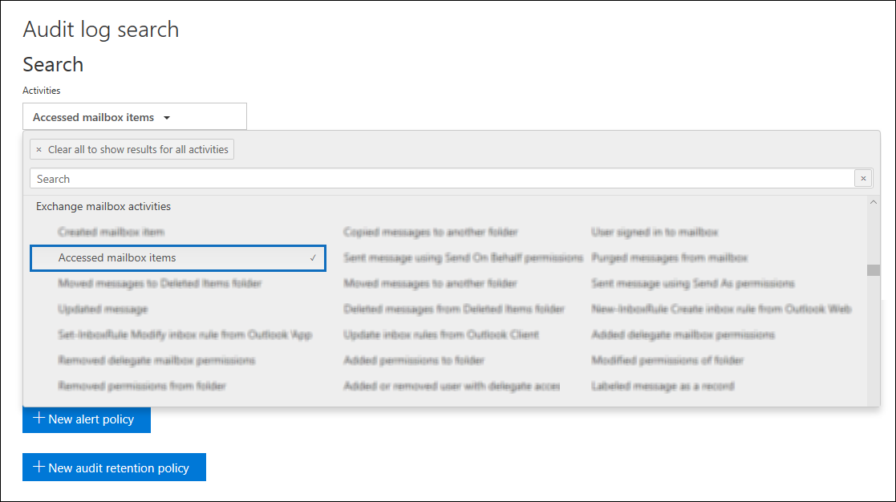

# Auditoría avanzada en Microsoft 365

La [funcionalidad de auditoría unificada](search-the-audit-log-in-security-and-compliance.md) en Microsoft 365 proporciona a las organizaciones la visibilidad de muchos tipos de actividades auditadas a través de los distintos servicios de Microsoft 365. Ahora, con el lanzamiento de la Auditoría avanzada en Microsoft 365, estamos agregando nuevas capacidades de auditoría que pueden ayudar a su organización con las investigaciones forenses y de cumplimiento.

> [!NOTE]
> Auditoría avanzada está disponible para organizaciones con una suscripción a Office 365 E5 o Microsoft 365 Enterprise E5. Además, se puede asignar a los usuarios una licencia al complemento Cumplimiento de Microsoft 365 E5 para cuando se requiera una licencia por usuario para las funciones de Auditoría avanzada, como es el caso de la conservación a largo plazo de los registros de auditoría y el acceso a eventos fundamentales para las investigaciones.

Este artículo ofrece una visión general de estas capacidades de auditoría avanzada.

## Retención a largo plazo de los registros de auditoría

La Auditoría avanzada conserva todos los registros de auditoría de Exchange, SharePoint y Azure Active Directory durante un año. Esto se logra mediante la directiva de retención de registros de auditoría predeterminada que conserva durante un año cualquier registro de auditoría que contenga el valor de **Exchange** ,**SharePoint** o **AzureActiveDirectory** para la propiedad de la **carga de trabajo** (que indica el servicio en el que se produjo la actividad). Esto puede ser de utilidad para las investigaciones forenses y de cumplimiento en curso. Para más información, vea la sección "Directiva predeterminada de retención de registros de auditoría" en [administrar las directivas de retención de registros de auditoría](audit-log-retention-policies.md#default-audit-log-retention-policy).

## Directivas de retención de registros de auditoría

Todos los registros de auditoría generados en otros servicios que no estén cubiertos por la directiva predeterminada de retención de registros de auditoría (descrita en la sección anterior) se conservarán durante 90 días. Sin embargo, ahora puede crear directivas de retención de registro personalizados de auditoría para conservar otros registros de auditoría de hasta un año. Puede crear una directiva para conservar registros de auditoría en función de uno o varios de los siguientes criterios:

- Las actividades auditadas se realizan en el servicio de Microsoft 365

- Especificar las actividades auditadas

- Ser el usuario que realiza la actividad auditada

También puede especificar el tiempo de retención de los registros de auditoría que coincidan con la directiva y el nivel de prioridad, de modo que ciertas políticas específicas tengan prioridad sobre otras. También debe tener en cuenta que cualquier directiva de retención de registros personalizados de auditoría tendrán prioridad sobre la directiva predeterminada de retención de auditorías en caso de que necesite conservar los registros de auditoría de Exchange, SharePoint o Azure Active Directory durante menos de un año para todos o algunos de los usuarios de su organización. Para obtener más información, vea [administrar directivas de retención de los registros de auditoría](audit-log-retention-policies.md).

## Acceso a eventos fundamentales para investigaciones

Los eventos de auditoría de alto valor relacionados con la seguridad y el cumplimiento son aquellos que pueden ayudarle a investigar las posibles infracciones u otras investigaciones forenses. El primero de estos eventos fundamentales que estamos lanzando es la acción de auditoría del buzón *MailItemsAccessed* Esta acción se activa cuando se obtiene acceso a los datos de correo electrónico a través de protocolos de correo y clientes de correo. La acción MailItemsAccess puede ayudar a los investigadores a identificar las vulneraciones de datos y determinar el ámbito de los mensajes que han estado en peligro. Si un atacante obtuvo acceso a los mensajes de correo electrónico, se desencadenará la acción MailItemsAccessed aunque no haya ninguna señal explícita de que se hayan leído realmente mensajes (es decir, el tipo de acceso como, por ejemplo, mediante enlace o sincronización, se graba en el registro de auditoría).

La nueva acción de buzón MailItemsAccessed reemplaza a MessageBind en el registro de auditoría de buzón de Exchange Online y proporciona las siguientes mejoras:

- MessageBind sólo era configurable para el tipo de inicio de sesión de usuario AuditAdmin; no se aplicaba a las acciones de los delegados o los propietarios. MailItemsAccessed se aplica a todos los tipos de inicio de sesión.

- MessageBind sólo cubre el acceso de un cliente de correo. No se aplicó a las actividades de sincronización. Los eventos MailItemsAccessed se desencadena con los tipos de acceso enlazar y sincronizar.

- Las acciones de MessageBind desencadenarían la creación de múltiples registros de auditoría cuando se accediera al mismo mensaje de correo electrónico, lo que daría lugar a un "ruido" de auditoría. En cambio, los eventos de MailItemsAccessed se agregan en menos registros de auditoría.

Para obtener información sobre los registros de auditoría de las actividades de MailItemsAccessed, vea [usar la auditoría avanzada para investigar cuentas comprometidas](mailitemsaccessed-forensics-investigations.md).

### Buscar registros de auditoría de MailItemsAccessed

Para buscar registros de auditoría de MailItemsAccessed, puede buscar la actividad **elementos del buzón a los que se ha accedido** en la lista desplegable **actividades de buzón de Exchange** en la [herramienta de búsqueda de registros de auditoría](search-the-audit-log-in-security-and-compliance.md) en el centro de seguridad y cumplimiento.

También puede ejecutar los comandos [Search-UnifiedAuditLog -Operations MailItemsAccessed](https://docs.microsoft.com/powershell/module/exchange/policy-and-compliance-audit/search-unifiedauditlog) o [Search-MailboxAuditLog -Operations MailItemsAccessed](https://docs.microsoft.com/powershell/module/exchange/policy-and-compliance-audit/search-mailboxauditlog) en Exchange Online PowerShell.

## Acceso de banda ancha a la API de Actividad de administración de Office 365

Las organizaciones que tienen acceso a registros de auditoría a través de la API de Actividad de administración de Office 365 se restringieron con límites en el nivel de publicador. Esto significa que para un publicador que extraía datos en nombre de múltiples clientes, el límite era compartido por todos esos clientes.

Con el lanzamiento de la Auditoría avanzada, estamos pasando de un límite de nivel de editor a un límite de nivel de espacio empresarial. El resultado es que cada organización obtendrá su propia cuota de ancho de banda totalmente asignada para acceder a los datos de auditoría. El ancho de banda no es un límite estático y predefinido, sino que se basa en una combinación de factores que incluyen el número de puestos en la organización y que las organizaciones E5 obtendrán más ancho de banda que las organizaciones que no son E5.

Se asigna inicialmente una línea base de 2000 solicitudes por minuto a todas las organizaciones. Este límite se incrementará de forma dinámica dependiendo del número de puestos de la organización y su suscripción de licencias. Las organizaciones E5 obtendrán aproximadamente el doble de ancho de banda que las organizaciones no son E5. También habrá un límite en el ancho de banda máximo para proteger el estado del servicio.

Para obtener más información, vea la sección "límite de la API" en la [referencia de la API de Actividad de administración de Office 365](https://docs.microsoft.com/office/office-365-management-api/office-365-management-activity-api-reference#api-throttling).

## Preguntas más frecuentes sobre las auditorías avanzadas

**¿Dónde puedo tener acceso a auditoría avanzada?**

Después de que se implemente la auditoría avanzada en la organización, podrá crear directivas de retención de registro de auditoría y buscar registros de auditoría MailItemsAccessed con la herramienta de búsqueda de registros de auditoría en el [Centro de seguridad y cumplimiento](https://protection.office.com). Estamos trabajando para implementar la auditoria avanzada en el [Centro de cumplimiento de Microsoft 365](https://compliance.microsoft.com) en las próximas semanas.

**¿Todos los usuarios necesitan una licencia de E5 para beneficiarse de las auditorías avanzadas?**

Para beneficiarse de las funciones de auditoría avanzada de nivel de usuario, es necesario que un usuario tenga asignada una licencia de E5. Hay algunas funciones que buscan la licencia adecuada para mostrar la característica para el usuario. Por ejemplo, si está intentando retener los registros de auditoría para un usuario al que no se le ha asignado una licencia E5 durante más de 90 días, el sistema devolverá un mensaje de error.

**¿Por qué no veo la auditoría avanzada en mi organización, incluso si tenemos una suscripción a E5 y los usuarios tienen asignadas las licencias E5?**

Es posible que las características de auditoría avanzada (como la capacidad de crear directivas de retención de registro de auditoría y el registro de registros de auditoría MailItemsAccessed) no estén disponibles en su organización, incluso con la licencia correcta. Si le sucede esto, se debe a que el paquete de auditoría avanzada aún no se ha implementado en la organización. Este es un problema de reposición de la licencia temporal que debería resolverse en las organizaciones afectadas en las próximas semanas. Para mitigar este problema, lleve a cabo los pasos siguientes para cada usuario de E5:

1. En el Centro de administración de Microsoft 365, vaya a **usuarios > usuarios activos** y seleccione un usuario.

2. En la página flotante de propiedades de usuario, haga clic en **licencias y aplicaciones**.

3. Expanda la sección **Aplicaciones** y realice una de las siguientes acciones:

   a. Si no está activada la casilla de **auditoría avanzada de Microsoft 365**, selecciónela y haga clic en **guardar cambios.** Se debe poder buscar en los registros de auditoría de las acciones MailItemsAccessed para este usuario durante 24 horas.

   b. Si está activada la casilla de **auditoría avanzada de Microsoft 365**, desactívela y haga clic en **guardar cambios.** Vea el paso 4.

4. Si ha desactivado la casilla de verificación del paso 3, espere 60 minutos y repita el paso 3a para habilitar la aplicación de auditoría avanzada de Microsoft 365.

**¿Qué ocurre si mi organización tenía la versión preliminar privada para la retención de registros de auditoría de un año?**

Las directivas de retención de auditoría del programa de versión preliminar se conservarán siempre y cuando no se reemplacen y se cambien con directivas de retención de auditoría personalizadas.

**¿Qué ocurre si mi organización desea retener registros de auditoría durante más de un año?**

Estamos estudiando opciones sobre cómo y si podemos ofrecer períodos de retención más largos para los registros de auditoría. Puede enviar comentarios sobre retenciones más largas de registros de auditoría en [Office 365 User Voice](https://office365.uservoice.com/forums/289138-office-365-security-compliance?category_id=137187).

**Mi organización tiene una suscripción a E5, ¿necesito hacer algo para obtener acceso a los registros de auditoría de eventos MailItemsAccessed?**

Para los clientes que cumplan los requisitos, no hay ninguna acción para obtener acceso a los eventos MailItemsAccessed. Sin embargo, tal y como se ha explicado anteriormente en este tema, la latencia provocada por el problema de reposición de licencias puede impedir que se devuelvan registros de auditoría para eventos MailItemsAccessed en una búsqueda de registros de auditoría. Si esto ocurre, siga las instrucciones de la sección Buscar registros de auditoría MailItemsAccessed.

**¿Están pensando en publicar otros eventos este año?**

Sí, tenemos previsto publicar nuevos eventos que son fundamentales para las investigaciones en los próximos meses. Publicaremos información sobre estos nuevos eventos en la [hoja de ruta de Microsoft 365](https://www.microsoft.com/microsoft-365/roadmap) a medida que se acerque la fecha de publicación.

**¿Están disponibles los nuevos eventos de la auditoría avanzada en la API de Actividad de administración de Office 365?**

Sí. Siempre que los registros de auditoría se generen para los usuarios con la licencia apropiada, podrá obtener acceso a estos registros a través de la API de Actividad de administración de Office 365.

**¿Un ancho de banda mayor significa una mayor latencia o un SLA mayor?**

En este momento, un ancho de banda alto ofrece una canalización más eficaz, especialmente para las organizaciones con un alto volumen de señales de auditoría y patrones de consumo significativos. Esto puede dar lugar a una mejor latencia. Sin embargo, no hay un SLA asociado con el ancho de banda alto. Se documentan las latencias estándar y no se modifican con la versión de la auditoría avanzada.
