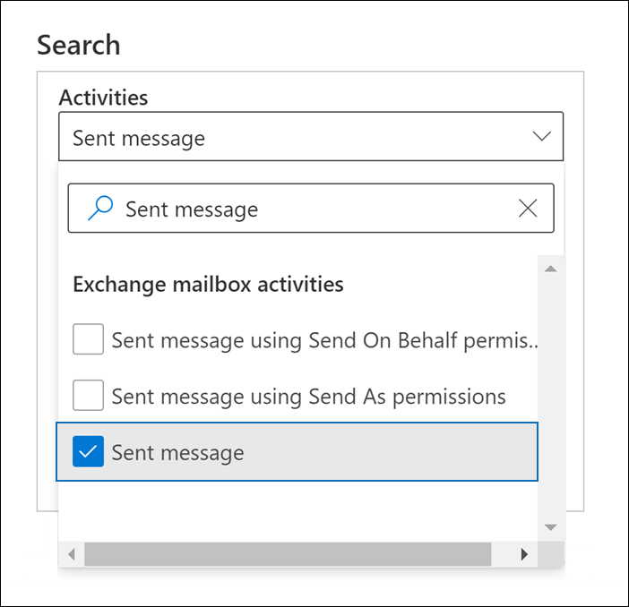
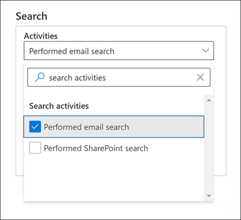
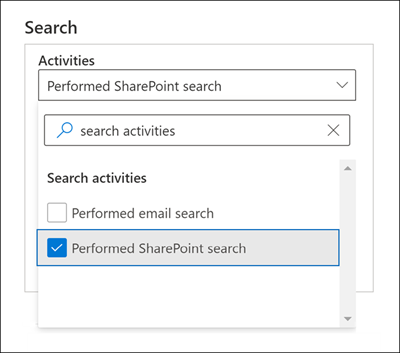

# Auditoría avanzada en Microsoft 365

La [funcionalidad de auditoría unificada](search-the-audit-log-in-security-and-compliance.md) en Microsoft 365 proporciona a las organizaciones la visibilidad de muchos tipos de actividades auditadas a través de los distintos servicios de Microsoft 365. La auditoría avanzada permite a las organizaciones dirigir investigaciones forenses y de cumplimiento incrementando la retención necesaria de registros de auditoría para dirigir una investigación, ofreciendo acceso a eventos fundamentales que ayuden a determinar el alcance del compromiso y agilizar el acceso a la API de Actividad de administración de Office 365.

> [!NOTE]
> Auditoría avanzada está disponible para organizaciones con una suscripción a Office 365 E5/A5/G5 o Microsoft 365 Enterprise E5/A5/G5. Además, se puede asignar a los usuarios una licencia al complemento Cumplimiento de Microsoft 365 E5/A5/G5 o eDiscovery E5/A5/G5 y auditoría para cuando se requiera una licencia por usuario para las funciones de Auditoría avanzada, como es el caso de la conservación a largo plazo de los registros de auditoría y el acceso a eventos fundamentales para las investigaciones. Para más información sobre licencias, vea: - [Requisitos de las licencias de Auditoría avanzada](auditing-solutions-overview.md#licensing-requirements) - [Instrucciones de licencias de Microsoft 365 para la seguridad y el cumplimiento](/office365/servicedescriptions/microsoft-365-service-descriptions/microsoft-365-tenantlevel-services-licensing-guidance/microsoft-365-security-compliance-licensing-guidance#advanced-audit).

Este artículo proporciona una descripción general de las funciones de Auditoría avanzada y muestra cómo configurar usuarios para Auditoría avanzada.

## Retención a largo plazo de los registros de auditoría

La auditoría avanzada conserva todos los registros de auditoría de Exchange, SharePoint y Azure Active Directory durante un año. Esto se logra mediante la directiva de retención de registros de auditoría predeterminada que conserva durante un año cualquier registro de auditoría que contenga el valor de **Exchange** ,**SharePoint** o **AzureActiveDirectory** para la propiedad de la **carga de trabajo** (que indica el servicio en el que se produjo la actividad). Retener registros de auditoría durante períodos más prolongados puede ser de ayuda para investigaciones en curso de cumplimiento y forenses. Para más información, vea la sección "Directiva predeterminada de retención de registros de auditoría" en [Administrar las directivas de retención de registros de auditoría](audit-log-retention-policies.md#default-audit-log-retention-policy).

También estamos publicando la posibilidad de retener registros de auditoría durante 10 años. La retención de los registros de auditoría de 10 años ofrece soporte a investigaciones de larga duración y ayuda a responder frente a obligaciones reglamentarias, jurídicas e internas.

> [!NOTE]
> La retención de los registros de auditoría durante 10 años necesitará una licencia adicional de complemento. Para más información, vea la sección [Preguntas más frecuentes sobre Auditoría avanzada](#faqs-for-advanced-audit) de este artículo.

### Directivas de retención de registros de auditoría

Todos los registros de auditoría generados en otros servicios que no estén cubiertos por la directiva predeterminada de retención de registros de auditoría (descrita en la sección anterior) se conservarán durante 90 días. Sin embargo, puede crear directivas de retención de registro personalizados de auditoría para conservar otros registros de auditoría durante periodos de tiempo de hasta 10 años. Puede crear una directiva para conservar registros de auditoría en función de uno o varios de los siguientes criterios:

- Las actividades auditadas se realizan en el servicio de Microsoft 365.

- Especificar las actividades auditadas.

- Ser el usuario que realiza la actividad auditada.

También puede especificar el tiempo de retención de los registros de auditoría que coincidan con la directiva y el nivel de prioridad, de modo que ciertas políticas específicas tengan prioridad sobre otras. También debe tener en cuenta que cualquier directiva de retención de registros personalizados de auditoría tendrá prioridad sobre la directiva predeterminada de retención de auditorías en caso de que necesite conservar los registros de auditoría de Exchange, SharePoint o Azure Active Directory durante menos de un año (o durante 10 años) para todos o algunos de los usuarios de su organización. Para obtener más información, vea [administrar directivas de retención de los registros de auditoría](audit-log-retention-policies.md).

## Acceso a eventos fundamentales para investigaciones

La Auditoría avanzada ayuda a las organizaciones a llevar a cabo investigaciones forenses y de cumplimiento mediante el acceso a eventos fundamentales, como cuando se obtuvo acceso a elementos de correo, o bien cuando se respondió a elementos de correo y se reenviaron, y cuándo y qué buscó un usuario en Exchange Online y SharePoint Online. Estos sucesos vitales pueden ayudarle a investigar posibles vulneraciones y determinar el alcance de la intromisión.  La Auditoría avanzada proporciona los siguientes eventos fundamentales:

- [MailItemsAccessed](#mailitemsaccessed)

- [Send](#send)

- [SearchQueryInitiatedExchange](#searchqueryinitiatedexchange)*

- [SearchQueryInitiatedSharePoint](#searchqueryinitiatedsharepoint)*

> [!NOTE]
> * En este momento, este evento no está disponible en los entornos de administración pública de Office 365 y Microsoft 365. Esto incluye los entornos GCC, GCC High y DoD.

### MailItemsAccessed

El evento MailItemsAccessed es una acción de edición del buzón de correo y se activa cuando se obtiene acceso a los datos de correo electrónico a través de protocolos de correo y clientes de correo. La acción MailItemsAccess puede ayudar a los investigadores a identificar las vulneraciones de datos y determinar el ámbito de los mensajes que han estado en peligro. Si un atacante obtuvo acceso a los mensajes de correo electrónico, se desencadenará la acción MailItemsAccessed aunque no haya ninguna señal explícita de que se hayan leído realmente mensajes (es decir, el tipo de acceso como, por ejemplo, mediante enlace o sincronización, se graba en el registro de auditoría).

La acción de buzón MailItemsAccessed reemplaza a MessageBind en el registro de auditoría de buzón de Exchange Online y proporciona las siguientes mejoras:

- MessageBind sólo era configurable para el tipo de inicio de sesión de usuario AuditAdmin; no se aplicaba a las acciones de los delegados o los propietarios. MailItemsAccessed se aplica a todos los tipos de inicio de sesión.

- MessageBind sólo cubre el acceso de un cliente de correo. No se aplicó a las actividades de sincronización. Los eventos MailItemsAccessed se desencadena con los tipos de acceso enlazar y sincronizar.

- Las acciones de MessageBind generarían la creación de diversos registros de auditoría cuando se accedía al mismo mensaje de correo electrónico, lo que producía “ruido” en la auditoría. Por el contrario, los eventos MailItemsAccessed se agregan a menos registros de auditoría.

Para obtener información sobre los registros de auditoría de las actividades de MailItemsAccessed, vea [usar la auditoría avanzada para investigar cuentas comprometidas](mailitemsaccessed-forensics-investigations.md).

Para buscar registros de auditoría de MailItemsAccessed, puede buscar la actividad **elementos del buzón a los que se ha accedido** en la lista desplegable **actividades de buzón de Exchange** en la [herramienta de búsqueda de registros de auditoría](search-the-audit-log-in-security-and-compliance.md) en el centro de cumplimiento de Microsoft 365.

También puede ejecutar los comandos [Search-UnifiedAuditLog -Operations MailItemsAccessed](/powershell/module/exchange/search-unifiedauditlog) o [Search-MailboxAuditLog -Operations MailItemsAccessed](/powershell/module/exchange/search-mailboxauditlog) en Exchange Online PowerShell.

### Enviar

El evento Enviar también es una acción de auditoría del buzón de correo y se activa cuando un usuario realiza una de las acciones siguientes:

- Envía un mensaje de correo electrónico

- Responde a un mensaje de correo electrónico

- Reenvía un mensaje de correo electrónico

Los investigadores pueden usar el evento Send para identificar correos enviados desde una cuenta en peligro. El registro de auditoría para un evento de Send contiene información sobre el mensaje, como cuándo se ha enviado el mensaje, el id. del InternetMessage, la línea de asunto y si el mensaje contiene datos adjuntos. Esta información de auditoría puede ayudar a que los investigadores identifiquen información acerca de los mensajes de correo electrónico enviados a través de una cuenta en peligro o por un atacante. Además, los investigadores pueden usar una herramienta de eDiscovery de Microsoft 365 para buscar el mensaje (con la línea de asunto o el id. de mensaje) para identificar los destinatarios a los que se envió el mensaje y el contenido real del mensaje enviado.

Para buscar registros de auditoría de Send, puede buscar la actividad de **Mensaje enviado** en la lista desplegable **Actividades de buzón de Exchange** de la [herramienta de búsqueda de registros de auditoría](search-the-audit-log-in-security-and-compliance.md) en el centro de cumplimiento de Microsoft 365.

También puede ejecutar los comandos [Search-UnifiedAuditLog -Operations Send](/powershell/module/exchange/search-unifiedauditlog) o [Search-MailboxAuditLog -Operations Send](/powershell/module/exchange/search-mailboxauditlog) en Exchange Online PowerShell.

### SearchQueryInitiatedExchange

El evento SearchQueryInitiatedExchange se activa cuando una persona usa Outlook para buscar elementos en un buzón. Los eventos se activan cuando se realizan búsquedas en los siguientes entornos de Outlook:

- Outlook (cliente de escritorio)

- Outlook en la Web (OWA)

- Outlook para iOS

- Outlook para Android

- Aplicación Correo para Windows 10

Los investigadores pueden usar el evento SearchQueryInitiatedExchange para determinar si un atacante que pueda haber puesto en peligro una cuenta ha buscado o intentado tener acceso a información confidencial en el buzón de correo. El registro de auditoría para un evento SearchQueryInitiatedExchange contiene información como el texto real de la consulta de búsqueda. El registro de auditoría también indica el entorno de Outlook en el que se ha realizado la búsqueda. Al observar las consultas de búsqueda que un atacante pudiera haber realizado, un investigador puede comprender mejor el porqué se buscaron esos datos de correo.

Para buscar registros de auditoría de SearchQueryInitiatedExchange, puede buscar la actividad de **Búsqueda de mensaje enviado** en la lista desplegable de **Actividades de búsqueda** de la [herramienta de búsqueda de registros de auditoría](search-the-audit-log-in-security-and-compliance.md) en el centro de cumplimiento.

También puede ejecutar [Search-UnifiedAuditLog -Operations SearchQueryInitiatedExchange](/powershell/module/exchange/search-unifiedauditlog) en Exchange Online PowerShell.

> [!NOTE]
> Debe habilitar el registro de SearchQueryInitiatedExchange para poder buscar este evento en el registro de auditoría. Para obtener instrucciones, consulte [Configurar Auditoría avanzada](set-up-advanced-audit.md#step-2-enable-crucial-events).

### SearchQueryInitiatedSharePoint

De forma similar a la búsqueda de elementos del buzón, el evento SearchQueryInitiatedSharePoint se activa cuando una persona busca elementos en SharePoint. Los eventos se activan cuando se realizan búsquedas en los siguientes sitios de tipos de SharePoint:

- Sitios principales

- Sitios de comunicación

- Sitios concentradores

- Sitios asociados con Microsoft Teams

Los investigadores pueden usar el evento SearchQueryInitiatedSharePoint para determinar si un atacante ha intentado encontrar información confidencial en SharePoint (y, posiblemente, haber accedido a ella). El registro de auditoría para un evento SearchQueryInitiatedSharePoint contendrá también el texto real de la consulta de búsqueda. El registro de auditoría también indica el tipo de sitio de SharePoint en el que se ha buscado. Al observar las consultas de búsqueda que un atacante pudiera haber realizado, un investigador puede comprender mejor la intención y el ámbito de búsqueda sobre los datos de archivo que se buscan.

Para buscar registros de auditoría de SearchQueryInitiatedSharePoint, puede buscar la actividad de **Búsqueda de SharePoint realizada** en la lista desplegable de **Actividades de búsqueda** de la [herramienta de búsqueda de registros de auditoría](search-the-audit-log-in-security-and-compliance.md) en el centro de cumplimiento.

También puede ejecutar [Search-UnifiedAuditLog -Operations SearchQueryInitiatedSharePoint](/powershell/module/exchange/search-unifiedauditlog) en Exchange Online PowerShell.

> [!NOTE]
> Debe habilitar el registro de SearchQueryInitiatedSharePoint para poder buscar este evento en el registro de auditoría. Para obtener instrucciones, consulte [Configurar Auditoría avanzada](set-up-advanced-audit.md#step-2-enable-crucial-events).

## Acceso de banda ancha a la API de Actividad de administración de Office 365

Las organizaciones que tienen acceso a registros de auditoría a través de la API de Actividad de administración de Office 365 se restringieron con límites en el nivel de publicador. Esto significa que para un publicador que extraía datos en nombre de múltiples clientes, el límite era compartido por todos esos clientes.

Con el lanzamiento de la Auditoría avanzada, estamos pasando de un límite de nivel de editor a un límite de nivel de espacio empresarial. El resultado es que cada organización obtendrá su propia cuota de ancho de banda totalmente asignada para acceder a los datos de auditoría. El ancho de banda no es un límite estático y predefinido, sino que se basa en una combinación de factores que incluyen el número de puestos en la organización y que las organizaciones E5/A5/G5 obtendrán más ancho de banda que las organizaciones que no son E5/A5/G5.

Se asigna inicialmente una línea base de 2000 solicitudes por minuto a todas las organizaciones. Este límite se incrementará de forma dinámica dependiendo del número de puestos de la organización y su suscripción de licencias. Las organizaciones E5/A5/G5 obtendrán, aproximadamente, el doble de ancho de banda que las organizaciones que no son E5/A5/G5. También habrá un límite en el ancho de banda máximo para proteger el estado del servicio.

Para obtener más información, vea la sección "límite de la API" en la [referencia de la API de Actividad de administración de Office 365](/office/office-365-management-api/office-365-management-activity-api-reference#api-throttling).

## Preguntas más frecuentes sobre las auditorías avanzadas

**¿Todos los usuarios necesitan una licencia de E5/A5/G5 para beneficiarse de la Auditoría avanzada?**

Para beneficiarse de las funciones de Auditoría avanzada de nivel de usuario, es necesario que un usuario tenga asignada una licencia de E5/A5/G5. Hay algunas funciones que buscan la licencia adecuada para mostrar la característica para el usuario. Por ejemplo, si está intentando retener los registros de auditoría para un usuario al que no se le ha asignado una licencia apropiada durante más de 90 días, el sistema devolverá un mensaje de error.

**Si mi organización tiene una suscripción a E5/A5/G5, ¿necesito hacer algo para tener acceso a los registros de auditoría de eventos fundamentales?**

Para los clientes que cumplan los requisitos y los usuarios a los que se les asigne la licencia adecuada, no hay ninguna acción que deban ejercer para acceder a los eventos de auditoría fundamentales.

**¿Qué ocurre con los datos de registro de auditoría de mi organización si creé una directiva de retención de registros de auditoría de 10 años cuando la característica se publicó para su disponibilidad general, pero antes de que la licencia del complemento necesaria estuviera disponible?**

Los datos de registro de auditoría cubiertos por una directiva de retención de registros de auditoría de 10 años que creó después de que la característica se publicara para que su disponibilidad general en el último trimestre de 2020 se conservarán durante 10 años. Esto incluye las directivas de retención de registros de auditoría de 10 años que se crearon antes de que se publicara la licencia del complemento necesaria para su compra. Pero, como la licencia del complemento de retención del registro de auditoría de 10 años ya está disponible, tendrá que comprar y asignar esas licencias de complemento para los usuarios cuyos datos de auditoría estén cubiertos por una directiva de retención de auditoría de 10 años.

**¿Están disponibles los nuevos eventos de Auditoría avanzada en la API de Actividad de administración de Office 365?**

Sí, siempre que los registros de auditoría se generen para los usuarios con la licencia apropiada, podrá obtener acceso a estos registros a través de la API de Actividad de administración de Office 365.

**¿Un ancho de banda mayor significa una mayor latencia o un SLA mayor?**

En este momento, un ancho de banda alto ofrece una canalización más eficaz, especialmente para las organizaciones con un alto volumen de señales de auditoría y patrones de consumo significativos. Más ancho de banda puede dar lugar a una mejor latencia. Sin embargo, no hay un SLA asociado con el ancho de banda alto. Se documentan las latencias estándar y no se modifican con la versión de la auditoría avanzada.
