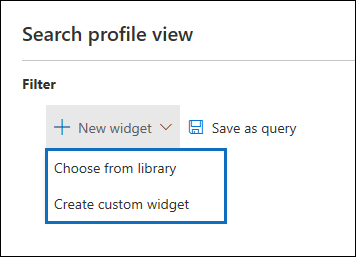

# Panel de eDiscovery avanzado para los conjuntos de revisión (versión preliminar)

En algunos casos de eDiscovery avanzado, puede tener un gran volumen de documentos y mensajes de correo electrónico que deben revisarse. Antes de iniciar el proceso de revisión, es posible que quiera analizar rápidamente su corpus para identificar tendencias o estadísticas clave que le ayudarán a desarrollar su estrategia de revisión. Para ello, puede usar el panel de exhibición de documentos electrónicos avanzado para revisar conjuntos para analizar rápidamente el corpus.

## Paso 1: crear un widget en el panel de la serie de revisión

1. En el centro de seguridad & cumplimiento, vaya a **ediscovery > Advanced eDiscovery** para mostrar la lista de casos de su organización.
  
2. Seleccione un caso existente.
  
3. Haga clic en la pestaña **revisar conjunto** y, a continuación, seleccione un conjunto de revisión.
  
4. En la lista desplegable de **resultados individuales** , haga clic en **vista de Perfil de búsqueda**. 

   

   Se muestra la página de **vista de Perfil de búsqueda** ; la primera vez que se muestra esta página, se muestran tres widgets predeterminados.

   
  
5. Haga clic en el **nuevo widget** y, a continuación, seleccione uno de los siguientes elementos:

   

   - **Elija de la biblioteca:** Muestra una biblioteca de widgets predeterminada. Haga clic en un widget y, a continuación, haga clic en **Agregar** para agregarlo a los widgets en la página de **vista de Perfil de búsqueda** .
  
   - **Crear widget personalizado:** Muestra una página de control flotante que puede usar para configurar un widget personalizado. 

6. Para crear un widget personalizado, haga lo siguiente en la página Agregar control flotante de **Widget** :

   

    a. Escriba un nombre para el widget, que se muestra en la barra de título del widget. El nombre de un widget es obligatorio, pero es útil identificar los datos del widget.

    b. Seleccione una propiedad en la lista desplegable **elegir Pivot** que se usará para los datos del widget. Los elementos de esta lista son las propiedades que se pueden buscar para los elementos del conjunto de revisión. Para obtener una descripción de estas propiedades, consulte [Document Metadata Fields in Advanced eDiscovery](document-metadata-fields-in-Advanced-eDiscovery.md). Las opciones dinámicas del widget se muestran en la columna **nombre de campo de búsqueda** en este tema.

    c. Seleccione un tipo de gráfico para mostrar los datos de la propiedad dinámica seleccionada.

  6. Haga clic en **Agregar** para crear el widget personalizado y mostrarlo en la página **vista de Perfil de búsqueda** .

## Paso 2: crear una consulta de búsqueda de conjunto de revisión

1. Haga clic en **...** en la barra de título widget y, a continuación, haga clic en **aplicar condición**.

   

2. En la página de control flotante, haga clic en un elemento de la clave del widget o del gráfico widget para crear un filtro.

   

3. Repita los pasos 1-2 para otros widgets varios widgets. 

4. Cuando haya terminado, haga clic en **Guardar como consulta** para guardar las condiciones como una nueva consulta de búsqueda para el conjunto de revisión.

   

5. Cierre la **vista Perfil de búsqueda** para volver a la vista de resultados de búsqueda.

   Si ha creado filtros visuales, la consulta resultante se aplica a los resultados de búsqueda que se muestran y se muestra la consulta de búsqueda que guardó en el paso 4 en **consultas guardadas**. Para obtener más información acerca de las consultas de set Set, consulte [consultar los datos de un conjunto de revisión](review-set-search.md).
