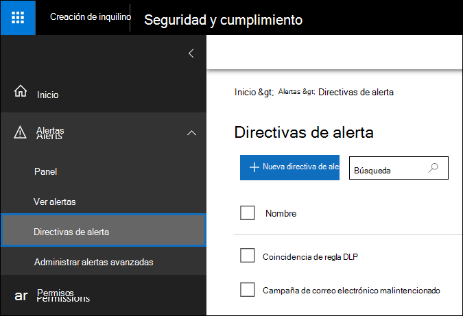
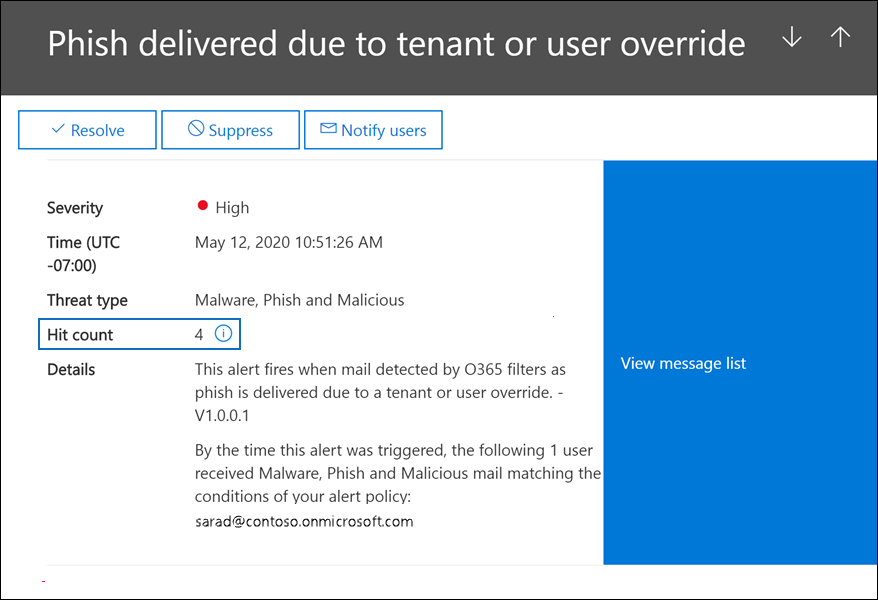
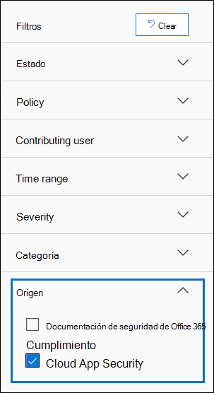

# <a name="alert-policies-in-the-security-and-compliance-center"></a>Directivas de alerta en el Centro de seguridad y cumplimiento

Puede usar las herramientas de directiva de alerta y panel de alertas de los centros de seguridad y cumplimiento de Microsoft 365 para crear directivas de alerta y, a continuación, ver las alertas generadas cuando los usuarios realizan actividades que coinciden con las condiciones de una directiva de alerta. Existen varias directivas de alerta predeterminadas que le ayudan a supervisar actividades como la asignación de privilegios de administrador en Exchange Online, ataques de malware, campañas de suplantación de identidad (phishing) y niveles inusuales de eliminaciones de archivos y uso compartido externo.

Las directivas de alerta te permiten clasificar las alertas que desencadena una directiva, aplicar la directiva a todos los usuarios de la organización, establecer un nivel de umbral para cuando se desencadena una alerta y decidir si quieres recibir notificaciones por correo electrónico cuando se desencadenan alertas. También hay una página Ver alertas en el centro de seguridad y cumplimiento donde puede ver y filtrar alertas, establecer un estado de alerta para ayudarle **a** administrar las alertas y, a continuación, descartar alertas después de haber resuelto o resuelto el incidente subyacente.

> [!NOTE]
> Las directivas de alerta están disponibles para las organizaciones con una suscripción de Microsoft 365 Enterprise, Office 365 Enterprise u Office 365 US Government E1/F1/G1, E3/F3/G3 o E5/G5. La funcionalidad avanzada solo está disponible para las organizaciones con una suscripción E5/G5, o para las organizaciones que tienen una suscripción E1/F1/G1 o E3/F3/G3 y Microsoft Defender para Office 365 P2 o un cumplimiento de Microsoft 365 E5 o una suscripción de complemento de exhibición de documentos electrónicos y auditoría de E5. La funcionalidad que requiere una suscripción de complemento o E5/G5 se resalta en este tema. Tenga en cuenta también que las directivas de alerta están disponibles en entornos gubernamentales de Office 365 GCC, GCC High y DoD US.

## <a name="how-alert-policies-work"></a>Cómo funcionan las directivas de alerta

Esta es una introducción rápida sobre cómo funcionan las directivas de alerta y las alertas que se desencadenan cuando la actividad de usuario o administrador coincide con las condiciones de una directiva de alerta.


1. Un administrador de su organización crea, configura y activa  una directiva de alerta mediante la página Directivas de alerta del Centro de seguridad y cumplimiento. También puede crear directivas de alerta con el cmdlet [New-ProtectionAlert](https://docs.microsoft.com/powershell/module/exchange/new-protectionalert) en PowerShell & Centro de seguridad y cumplimiento.

   Para crear directivas de alerta, debe tener asignada la función Administrar alertas o la función Configuración de la organización en el Centro de seguridad y cumplimiento.

   > [!NOTE]
   > La directiva tarda hasta 24 horas después de crear o actualizar una directiva de alertas. Esto se debe a que la directiva debe sincronizarse con el motor de detección de alertas.

2. Un usuario realiza una actividad que coincide con las condiciones de una directiva de alerta. En el caso de ataques de malware, los mensajes de correo electrónico infectados enviados a los usuarios de su organización desencadenan una alerta.

3. Microsoft 365 genera una alerta que se  muestra en la página Ver alertas en el Centro de & cumplimiento. Además, si las notificaciones por correo electrónico están habilitadas para la directiva de alerta, Microsoft envía una notificación a una lista de destinatarios. Las alertas que un administrador u otros usuarios pueden ver en la página Ver alertas viene determinada por los roles asignados al usuario. Para obtener más información, vea [los permisos RBAC necesarios para ver alertas.](#rbac-permissions-required-to-view-alerts)

4. Un administrador administra alertas en el centro de seguridad y cumplimiento. La administración de alertas consiste en asignar un estado de alerta para ayudar a realizar un seguimiento y administrar cualquier investigación.

## <a name="alert-policy-settings"></a>Configuración de directiva de alerta

Una directiva de alerta consta de un conjunto de reglas y condiciones que definen la actividad de usuario o administrador que genera una alerta, una lista de los usuarios que desencadenan la alerta si realizan la actividad y un umbral que define cuántas veces debe producirse la actividad antes de que se active una alerta. También se clasifica la directiva y se le asigna un nivel de gravedad. Estas dos opciones de configuración le ayudan a administrar las directivas de alerta (y las alertas que se desencadenan cuando se cumplen las condiciones de directiva), ya que puede filtrar esta configuración al administrar directivas y ver alertas en el Centro de seguridad y cumplimiento. Por ejemplo, puedes ver alertas que coinciden con las condiciones de la misma categoría o ver alertas con el mismo nivel de gravedad.

Para ver y crear directivas de alerta, vaya a las directivas de alertas y, a [https://protection.office.com](https://protection.office.com) continuación, seleccione **Directivas** \> **de alertas.**



Una directiva de alerta consta de las siguientes configuraciones y condiciones.

-  Actividad que realiza la alerta: se crea una directiva para realizar un seguimiento de una actividad o, en algunos casos, algunas actividades relacionadas, como compartir un archivo con un usuario externo al compartirlo, asignar permisos de acceso o crear un vínculo anónimo. Cuando un usuario realiza la actividad definida por la directiva, se desencadena una alerta en función de la configuración del umbral de alerta.

    > [!NOTE]
    > Las actividades de las que puede realizar un seguimiento dependen del plan Office 365 Enterprise u Office 365 Administración Pública de su organización. En general, las actividades relacionadas con las campañas de malware y los ataques de suplantación de identidad requieren una suscripción E5/G5 o una suscripción E1/F1/G1 o E3/F3/G3 con una suscripción de complemento de Defender para [Office 365](../security/office-365-security/office-365-atp.md) Plan 2.

- **Condiciones de actividad:** para la mayoría de las actividades, puede definir condiciones adicionales que deben cumplirse para desencadenar una alerta. Entre las condiciones comunes se incluyen las direcciones IP (para que se desencadene una alerta cuando el usuario realiza la actividad en un equipo con una dirección IP específica o dentro de un intervalo de direcciones IP), si se desencadena una alerta si un usuario o usuarios específicos realizan esa actividad y si la actividad se realiza en un nombre de archivo o dirección URL específicos. También puede configurar una condición que desencadena una alerta cuando cualquier usuario de la organización realiza la actividad. Las condiciones disponibles dependen de la actividad seleccionada.

- **Cuando se desencadena la alerta:** puedes configurar una configuración que defina la frecuencia con la que se puede producir una actividad antes de que se desencadene una alerta. Esto te permite configurar una directiva para generar una alerta cada vez que una actividad coincide con las condiciones de la directiva, cuando se supera un umbral determinado o cuando la aparición de la actividad que está siguiendo la alerta se vuelve inusual para la organización.

    

    Si selecciona la configuración en función de una actividad inusual, Microsoft establece un valor de línea base que define la frecuencia normal de la actividad seleccionada. El establecimiento de esta línea base tarda hasta siete días, durante los cuales no se generarán alertas. Una vez establecida la línea base, se desencadena una alerta cuando la frecuencia de la actividad que realiza el seguimiento de la directiva de alerta supera en gran parte el valor de línea base. Para las actividades relacionadas con la auditoría (como las actividades de archivos y carpetas), puede establecer una línea base basada en un único usuario o en función de todos los usuarios de la organización; para actividades relacionadas con malware, puede establecer una línea base basada en una sola familia de malware, un solo destinatario o todos los mensajes de la organización.

    > [!NOTE]
    > La capacidad de configurar directivas de alerta basadas en un umbral o en una actividad inusual requiere una suscripción E5/G5 o una suscripción E1/F1/G1 o E3/F3/G3 con Microsoft Defender para Office 365 P2, Cumplimiento de Microsoft 365 E5 o suscripción de complemento de auditoría y exhibición de documentos electrónicos de Microsoft 365. Las organizaciones con una suscripción E1/F1/G1 y E3/F3/G3 solo pueden crear directivas de alerta donde se desencadena una alerta cada vez que se produce una actividad.

- **Categoría de** alerta: para ayudarle con el seguimiento y la administración de las alertas generadas por una directiva, puede asignar una de las siguientes categorías a una directiva.

  - Prevención de pérdida de datos

  - Información de gobierno

  - Flujo de correo

  - Permissions

  - Administración de amenazas

  - Otros

  Cuando se produce una actividad que coincide con las condiciones de la directiva de alerta, la alerta que se genera se etiqueta con la categoría definida en esta configuración. Esto le permite realizar un seguimiento y administrar  las alertas que tienen la misma configuración de categoría en la página Ver alertas en el Centro de seguridad y cumplimiento, ya que puede ordenar y filtrar alertas según la categoría.

- **Gravedad de alerta:** de forma similar a la categoría de alerta, se asigna un atributo de gravedad **(bajo,** **medio,** alto **o** informativo) a las directivas de alerta. Al igual que la categoría de alerta, cuando se produce una actividad que coincide con las condiciones de la directiva de alerta, la alerta que se genera se etiqueta con el mismo nivel de gravedad que se establece para la directiva de alerta. De nuevo, esto te permite realizar un seguimiento y administrar las alertas que tienen la misma configuración de gravedad en la **página Ver alertas.** Por ejemplo, puedes filtrar la lista de alertas para que solo se muestren las alertas con una gravedad alta. 

    > [!TIP]
    > Al configurar una directiva de alerta, considere la posibilidad de asignar una gravedad más alta a las actividades que pueden tener consecuencias muy negativas, como la detección de malware después de la entrega a los usuarios, la visualización de datos confidenciales o clasificados, el uso compartido de datos con usuarios externos u otras actividades que pueden causar pérdida de datos o amenazas de seguridad. Esto puede ayudarte a dar prioridad a las alertas y a las acciones que llevas a cabo para investigar y resolver las causas subyacentes.

- **Notificaciones por correo** electrónico: puede configurar la directiva para que las notificaciones por correo electrónico se envíen (o no) a una lista de usuarios cuando se desencadene una alerta. También puedes establecer un límite de notificaciones diario para que, una vez alcanzado el número máximo de notificaciones, no se envíen más notificaciones para la alerta durante ese día. Además de las notificaciones por correo electrónico, usted u otros administradores pueden ver las alertas que desencadena una directiva en la página Ver **alertas.** Considera la posibilidad de habilitar las notificaciones por correo electrónico para las directivas de alerta de una categoría específica o que tengan una configuración de gravedad más alta.

## <a name="default-alert-policies"></a>Directivas de alerta predeterminadas

Microsoft proporciona directivas de alerta integradas que ayudan a identificar el abuso de permisos de administrador de Exchange, la actividad de malware, las posibles amenazas internas y externas, y los riesgos de gobierno de la información. En la **página Directivas de** alerta, los nombres de estas directivas integradas están en negrita y el tipo de directiva se define como **Sistema.** Estas directivas están activadas de forma predeterminada. Puedes desactivar estas directivas (o volver a activarla), configurar una lista de destinatarios a los que enviar notificaciones por correo electrónico y establecer un límite de notificaciones diario. No se pueden editar las demás opciones de configuración de estas directivas.

En la tabla siguiente se enumeran y describen las directivas de alerta predeterminadas disponibles y la categoría a la que está asignada cada directiva. La categoría se usa para determinar qué alertas puede ver un usuario en la página Ver alertas. Para obtener más información, vea [los permisos RBAC necesarios para ver alertas.](#rbac-permissions-required-to-view-alerts)

La tabla también indica el plan de Office 365 Enterprise y Office 365 Administración Pública necesario para cada uno de ellos. Algunas directivas de alerta predeterminadas están disponibles si su organización tiene la suscripción de complemento adecuada además de una suscripción E1/F1/G1 o E3/F3/G3.

| Directiva de alerta predeterminada | Descripción | Categoría | Suscripción empresarial |
|:-----|:-----|:-----|:-----|
|**Se detectó un clic de dirección URL potencialmente malintencionado**|Genera una alerta cuando un usuario protegido por Vínculos [seguros](../security/office-365-security/atp-safe-links.md) de su organización hace clic en un vínculo malintencionado. Este evento se desencadena cuando Microsoft Defender para Office 365 identifica los cambios en el veredicto de la dirección URL o cuando los usuarios reemplazan las páginas de vínculos seguros (según la directiva de vínculos seguros de Microsoft 365 para empresas de su organización). Esta directiva de alerta tiene una **configuración de** gravedad alta. Para los clientes de Defender para Office 365 P2, E5, G5, esta alerta desencadena automáticamente la investigación automatizada y la respuesta [en Office 365.](https://docs.microsoft.com/microsoft-365/security/office-365-security/office-365-air) Para obtener más información sobre los eventos que desencadenan esta alerta, vea [Configurar directivas de vínculos seguros.](../security/office-365-security/set-up-atp-safe-links-policies.md)|Administración de amenazas|Suscripción de complemento E5/G5 o Defender para Office 365 P2|
|**Resultado del envío de administrador completado**|Genera una alerta cuando un [envío de](../security/office-365-security/admin-submission.md) administrador completa el nuevo análisis de la entidad enviada. Se desencadenará una alerta cada vez que se represente un resultado de nuevo análisis desde un envío de administrador. Estas alertas están diseñadas para recordarle que debe revisar los resultados de envíos anteriores, enviar mensajes [notificados](https://protection.office.com/reportsubmission)por el usuario para obtener la comprobación de directivas más reciente y volver a examinar los veredictos, y ayudarle a determinar si las directivas de filtrado de su organización están teniendo el impacto previsto. Esta directiva tiene una **configuración de** gravedad baja.|Administración de amenazas|E1/F1, E3/F3 o E5|
|**El administrador activó la investigación manual del correo electrónico**|Genera una alerta cuando un administrador desencadena la investigación manual de un correo electrónico desde el Explorador de amenazas. Para obtener más información, vea [Ejemplo: un administrador de seguridad desencadena una investigación desde el Explorador de amenazas] ( https://docs.microsoft.com/microsoft-365/security/office-365-security/automated-investigation-response-office#example-a-security-administrator-triggers-an-investigation-from-threat-explorer) . Esta alerta notifica a su organización que se inició la investigación. La alerta proporciona información sobre quién la desencadenó e incluye un vínculo a la investigación. Esta directiva tiene una **configuración de gravedad** informativo.|Administración de amenazas| Suscripción de complemento E5/G5 o Microsoft Defender para Office 365 P2| 
|**Creación de reglas de reenvío o redireccionamiento**|Genera una alerta cuando alguien de su organización crea una regla de bandeja de entrada para su buzón que reenvía o redirige mensajes a otra cuenta de correo electrónico. Esta directiva solo realiza un seguimiento de las reglas de bandeja de entrada creadas con Outlook en la Web (anteriormente conocido como Outlook Web App) o Exchange Online PowerShell. Esta directiva tiene una **configuración de** gravedad baja. Para obtener más información acerca del uso de reglas de bandeja de entrada para reenviar y redirigir el correo electrónico en Outlook en la web, vea Usar reglas en Outlook en la web para reenviar automáticamente mensajes [a otra cuenta.](https://support.office.com/article/1433e3a0-7fb0-4999-b536-50e05cb67fed)|Administración de amenazas|E1/F1/G1, E3/F3/G3 o E5/G5|
|**Búsqueda de exhibición de documentos electrónicos iniciada o exportada**|Genera una alerta cuando alguien usa la herramienta de búsqueda de contenido en el Centro de seguridad y cumplimiento. Se desencadena una alerta cuando se realizan las siguientes actividades de búsqueda de contenido: <br/><br/>* Se inicia una búsqueda de contenido<br/>* Los resultados de una búsqueda de contenido se exportan<br/>* Se exporta un informe de búsqueda de contenido<br/><br/>Las alertas también se desencadenan cuando las actividades de búsqueda de contenido anteriores se realizan en asociación con un caso de exhibición de documentos electrónicos. Esta directiva tiene una **configuración de** gravedad media. Para obtener más información acerca de las actividades de búsqueda de contenido, vea Buscar actividades de exhibición de [documentos electrónicos en el registro de auditoría.](search-for-ediscovery-activities-in-the-audit-log.md#ediscovery-activities)|Administración de amenazas|E1/F1/G1, E3/F3/G3 o E5/G5|
|**Elevación del privilegio de administrador de Exchange**|Genera una alerta cuando a alguien se le asignan permisos administrativos en su organización de Exchange Online. Por ejemplo, cuando se agrega un usuario al grupo de roles Administración de la organización en Exchange Online. Esta directiva tiene una **configuración de** gravedad baja.|Permissions|E1/F1/G1, E3/F3/G3 o E5/G5|
|**Mensajes de correo electrónico que contienen malware quitado después de la entrega**|Genera una alerta cuando los mensajes que contienen malware se entregan a los buzones de la organización. Si se produce este evento, Microsoft quita los mensajes infectados de los buzones de Exchange Online mediante la purga automática [de hora cero.](../security/office-365-security/zero-hour-auto-purge.md) Esta directiva tiene una configuración **de gravedad informativo** y desencadena automáticamente la investigación y respuesta [automatizadas en Office 365.](https://docs.microsoft.com/microsoft-365/security/office-365-security/office-365-air)|Administración de amenazas|Suscripción de complemento E5/G5 o Microsoft Defender para Office 365 P2|
|**Mensajes de correo electrónico que contienen direcciones URL de suplantación de identidad eliminadas después de la entrega**|Genera una alerta cuando los mensajes que contienen suplantación de identidad se entregan a los buzones de la organización. Si se produce este evento, Microsoft quita los mensajes infectados de los buzones de Exchange Online mediante la purga automática [de hora cero.](../security/office-365-security/zero-hour-auto-purge.md) Esta directiva tiene una configuración **de gravedad informativo** y desencadena automáticamente la investigación y respuesta [automatizadas en Office 365.](https://docs.microsoft.com/microsoft-365/security/office-365-security/office-365-air)|Administración de amenazas|Suscripción de complemento E5/G5 o Defender para Office 365 P2|
|**Correo electrónico notificado por el usuario como malware o phishing**|Genera una alerta cuando los usuarios de su organización informan de mensajes como correo electrónico de suplantación de identidad mediante el complemento Mensaje de informe. Esta directiva tiene una **configuración de gravedad** informativo. Para obtener más información acerca de este complemento, vea [Usar el complemento](https://support.office.com/article/b5caa9f1-cdf3-4443-af8c-ff724ea719d2)Mensaje de informe . Para los clientes de Defender para Office 365 P2, E5, G5, esta alerta desencadena automáticamente la investigación automatizada y la respuesta [en Office 365.](https://docs.microsoft.com/microsoft-365/security/office-365-security/office-365-air)|Administración de amenazas|E1/F1/G1, E3/F3/G3 o E5/G5|
|**Se superó el límite de envío de correo electrónico**|Genera una alerta cuando alguien de su organización ha enviado más correo del permitido por la directiva de correo no deseado saliente. Esto suele indicar que el usuario está enviando demasiado correo electrónico o que la cuenta puede estar en peligro. Esta directiva tiene una **configuración de** gravedad media. Si obtiene una alerta generada por esta directiva de alerta, es una buena idea comprobar si la cuenta de usuario [está en peligro.](../security/office-365-security/responding-to-a-compromised-email-account.md)|Administración de amenazas|E1/F1/G1, E3/F3/G3 o E5/G5|
|**Formulario bloqueado debido a un posible intento de suplantación de identidad**|Genera una alerta cuando se ha restringido a alguien de su organización el uso compartido de formularios y la recopilación de respuestas mediante Microsoft Forms debido a un comportamiento de intento de suplantación de identidad repetido detectado. Esta directiva tiene una **configuración de gravedad** alta.|Administración de amenazas|E1, E3/F3 o E5|
|**Formulario marcado y confirmado como suplantación de identidad**|Genera una alerta cuando un formulario creado en Microsoft Forms desde dentro de su organización se ha identificado como posible suplantación de identidad mediante el uso de informes de abusos y microsoft lo confirma como suplantación de identidad. Esta directiva tiene una **configuración de** gravedad alta.|Administración de amenazas|E1, E3/F3 o E5|
|**Se han retrasado los mensajes**|Genera una alerta cuando Microsoft no puede entregar mensajes de correo electrónico a la organización local o a un servidor asociado mediante un conector. Cuando esto sucede, el mensaje se pone en cola en Office 365. Esta alerta se desencadena cuando hay 2.000 mensajes o más que se han puesto en cola durante más de una hora. Esta directiva tiene una **configuración de** gravedad alta.|Flujo de correo|E1/F1/G1, E3/F3/G3 o E5/G5|
|**Campaña de malware detectada después de la entrega**|Genera una alerta cuando se entrega un número inusualmente grande de mensajes que contienen malware a los buzones de la organización. Si se produce este evento, Microsoft quita los mensajes infectados de los buzones de Exchange Online. Esta directiva tiene una **configuración de** gravedad alta.|Administración de amenazas|Suscripción de complemento E5/G5 o Microsoft Defender para Office 365 P2|
|**Campaña de malware detectada y bloqueada**|Genera una alerta cuando alguien ha intentado enviar un número inusualmente grande de mensajes de correo electrónico que contienen un determinado tipo de malware a los usuarios de su organización. Si se produce este evento, Microsoft bloquea los mensajes infectados y no se entregan a los buzones. Esta directiva tiene una **configuración de** gravedad baja.|Administración de amenazas|Suscripción de complemento E5/G5 o Defender para Office 365 P2|
|**Campaña de malware detectada en SharePoint y OneDrive**|Genera una alerta cuando se detecta un volumen inusualmente alto de malware o virus en archivos ubicados en sitios de SharePoint o cuentas de OneDrive en su organización. Esta directiva tiene una **configuración de** gravedad alta.|Administración de amenazas|Suscripción de complemento E5/G5 o Defender para Office 365 P2|
|**Malware no recortado porque ZAP está deshabilitado**| Genera una alerta cuando Microsoft detecta la entrega de un mensaje de malware a un buzón porque la Zero-Hour purga automática para mensajes de suplantación de identidad está deshabilitada. Esta directiva tiene una **configuración de gravedad** informativo. |Administración de amenazas|Suscripción de complemento E5/G5 o Defender para Office 365 P2|
|**Phish delivered because a user's Junk Mail folder is disabled**|Genera una alerta cuando Microsoft detecta que la carpeta de correo no deseado de un usuario está deshabilitada, lo que permite la entrega de un mensaje de suplantación de identidad de confianza alta a un buzón. Esta directiva tiene una **configuración de gravedad** informativo.|Administración de amenazas|Suscripción de complemento E5/G5 o Defender para Office 365 P1 o P2|
|**Phish delivered due to an ETR override**|Genera una alerta cuando Microsoft detecta una regla de transporte de Exchange (ETR) que permitía la entrega de un mensaje de suplantación de identidad de confianza alta a un buzón. Esta directiva tiene una **configuración de gravedad** informativo. Para obtener más información acerca de las reglas de transporte de Exchange (reglas de flujo de correo), consulte Reglas de flujo de correo [(reglas de transporte) en Exchange Online](https://docs.microsoft.com/exchange/security-and-compliance/mail-flow-rules/mail-flow-rules).|Administración de amenazas|Suscripción de complemento E5/G5 o Defender para Office 365 P1 o P2|
|**Suplantación de identidad (phishing) entregada debido a una directiva de direcciones IP permitidos**|Genera una alerta cuando Microsoft detecta una directiva de direcciones IP permitidas que permitía la entrega de un mensaje de suplantación de identidad de confianza alta a un buzón. Esta directiva tiene una **configuración de gravedad** informativo. Para obtener más información acerca de la directiva de direcciones IP permitidos (filtrado de conexiones), vea Configurar la directiva de filtro de conexión [predeterminada - Office 365](https://docs.microsoft.com/microsoft-365/security/office-365-security/configure-the-connection-filter-policy).|Administración de amenazas|Suscripción de complemento E5/G5 o Defender para Office 365 P1 o P2|
|**Suplantación de identidad no recortada porque ZAP está deshabilitado**| Genera una alerta cuando Microsoft detecta la entrega de un mensaje de suplantación de identidad de confianza alta a un buzón porque Zero-Hour purga automática para mensajes de suplantación de identidad está deshabilitada. Esta directiva tiene una **configuración de gravedad** informativo.|Administración de amenazas|Suscripción de complemento E5/G5 o Defender para Office 365 P2|
|**Phish delivered due to tenant or user override**<sup>1</sup>|Genera una alerta cuando Microsoft detecta que un administrador o reemplazo de usuario permitió la entrega de un mensaje de suplantación de identidad a un buzón. Algunos ejemplos de invalidaciones son una regla de flujo de correo o bandeja de entrada que permite mensajes de un remitente o dominio específico, o una directiva contra correo no deseado que permite mensajes de dominios o remitentes específicos. Esta directiva tiene una **configuración de** gravedad alta.|Administración de amenazas|Suscripción de complemento E5/G5 o Defender para Office 365 P2|
|**Actividad de reenvío de correo electrónico sospechosa**|Genera una alerta cuando alguien de su organización ha enviado automáticamente correo electrónico a una cuenta externa sospechosa. Se trata de una advertencia anticipada para el comportamiento que puede indicar que la cuenta está en peligro, pero no lo suficientemente grave como para restringir al usuario. Esta directiva tiene una **configuración de** gravedad media. Aunque es raro, una alerta generada por esta directiva puede ser una anomalía. Es una buena idea comprobar si [la cuenta de usuario está en peligro.](../security/office-365-security/responding-to-a-compromised-email-account.md)|Administración de amenazas|E1/F1/G1, E3/F3/G3 o E5/G5|
|**Patrones de envío de correo electrónico sospechosos detectados**|Genera una alerta cuando alguien de su organización ha enviado correo electrónico sospechoso y corre el riesgo de que se le restringa el envío de correo electrónico. Se trata de una advertencia anticipada para el comportamiento que puede indicar que la cuenta está en peligro, pero no lo suficientemente grave como para restringir al usuario. Esta directiva tiene una **configuración de** gravedad media. Aunque es raro, una alerta generada por esta directiva puede ser una anomalía. Sin embargo, es una buena idea comprobar [si la cuenta de usuario está en peligro.](../security/office-365-security/responding-to-a-compromised-email-account.md)|Administración de amenazas|E1/F1/G1, E3/F3/G3 o E5/G5  |
|**Inquilino restringido para enviar correo electrónico**|Genera una alerta cuando la mayor parte del tráfico de correo electrónico de su organización se ha detectado como sospechoso y Microsoft ha restringido a su organización el envío de correo electrónico. Investigue las cuentas de usuario y administrador potencialmente comprometidas, los nuevos conectores o las retransmisiones abiertas y, a continuación, póngase en contacto con el soporte técnico de Microsoft para desbloquear su organización. Esta directiva tiene una **configuración de** gravedad alta. Para obtener más información acerca de por qué se bloquean las organizaciones, vea Corregir problemas de entrega de correo electrónico para el código de [error 5.7.7xx en Exchange Online.](https://go.microsoft.com/fwlink/?linkid=2022138)|Administración de amenazas|E1/F1/G1, E3/F3/G3 o E5/G5|
|**Actividad de archivos de usuario externo inusual**|Genera una alerta cuando los usuarios fuera de su organización realizan un número inusualmente grande de actividades en archivos de SharePoint o OneDrive. Esto incluye actividades como el acceso a archivos, la descarga de archivos y la eliminación de archivos. Esta directiva tiene una **configuración de** gravedad alta.|Información de gobierno|E5/G5, Microsoft Defender para Office 365 P2 o suscripción de complemento de Microsoft 365 E5|
|**Volumen inusual de uso compartido de archivos externos**|Genera una alerta cuando un número inusualmente grande de archivos en SharePoint o OneDrive se comparten con usuarios externos a la organización. Esta directiva tiene una **configuración de** gravedad media.|Información de gobierno|Suscripción de complemento E5/G5, Defender para Office 365 P2 o Microsoft 365 E5|
|**Volumen inusual de eliminación de archivos**|Genera una alerta cuando se elimina un número inusualmente grande de archivos en SharePoint o OneDrive en un breve período de tiempo. Esta directiva tiene una **configuración de** gravedad media.|Información de gobierno|Suscripción de complemento E5/G5, Defender para Office 365 P2 o Microsoft 365 E5|
|**Aumento inusual del correo electrónico notificado como suplantación de identidad**|Genera una alerta cuando hay un aumento significativo en el número de personas de la organización que usan el complemento Informar de mensajes en Outlook para notificar mensajes como correo de suplantación de identidad. Esta directiva tiene una **configuración de** gravedad alta. Para obtener más información acerca de este complemento, vea [Usar el complemento](https://support.office.com/article/b5caa9f1-cdf3-4443-af8c-ff724ea719d2)Mensaje de informe .|Administración de amenazas|Suscripción de complemento E5/G5 o Defender para Office 365 P2|
|**Suplantación de identidad de usuario entregada a la bandeja de entrada/carpeta**<sup>1,</sup><sup>2</sup>|Genera una alerta cuando Microsoft detecta que un administrador o reemplazo de usuario ha permitido la entrega de un mensaje de suplantación de identidad de usuario a la bandeja de entrada (u otra carpeta accesible para el usuario) de un buzón. Algunos ejemplos de invalidaciones son una regla de flujo de correo o bandeja de entrada que permite mensajes de un remitente o dominio específico, o una directiva contra correo no deseado que permite mensajes de dominios o remitentes específicos. Esta directiva tiene una **configuración de** gravedad media.|Administración de amenazas|Suscripción de complemento E5/G5 o Defender para Office 365 P2|
|**Usuario restringido para enviar correo electrónico**|Genera una alerta cuando alguien de su organización tiene restricciones para enviar correo saliente. Esto suele ocurrir cuando una cuenta está en peligro y el usuario aparece en la página **Usuarios** restringidos en el Centro de & cumplimiento. (Para obtener acceso a esta página, vaya a Administración **de amenazas > Revisar > Usuarios restringidos).** Esta directiva tiene una **configuración de** gravedad alta. Para obtener más información acerca de los usuarios restringidos, vea Quitar un usuario, un dominio o una dirección IP de una lista de bloqueados después de enviar correo [no deseado.](https://docs.microsoft.com/office365/securitycompliance/removing-user-from-restricted-users-portal-after-spam)|Administración de amenazas|E1/F1/G1, E3/F3/G3 o E5/G5|
|**Usuario restringido para compartir formularios y recopilar respuestas**|Genera una alerta cuando se ha restringido a alguien de su organización el uso compartido de formularios y la recopilación de respuestas mediante Microsoft Forms debido a un comportamiento de intento de suplantación de identidad repetido detectado. Esta directiva tiene una **configuración de** gravedad alta.|Administración de amenazas|E1, E3/F3 o E5|
|||||

> [!NOTE]
> <sup>1 Hemos</sup> eliminado temporalmente esta directiva de alerta predeterminada en función de los comentarios de los clientes. We're working to improve it, and will replace it with a new version in the near future. Hasta entonces, puedes crear una directiva de alerta personalizada para reemplazar esta funcionalidad mediante la siguiente configuración:<br/>&nbsp; * La actividad es el correo electrónico de suplantación de identidad detectado en el momento de la entrega<br/>&nbsp; * Mail is not ZAP'd<br/>&nbsp; * La dirección del correo es entrante<br/>&nbsp; * El estado de entrega de correo es Entregado<br/>&nbsp; * La tecnología de detección es retención de direcciones URL malintencionadas, detonación de direcciones URL, filtro de suplantación de identidad avanzado, filtro de suplantación de identidad general, suplantación de dominio, suplantación de usuario y suplantación de marca<br/><br/>&nbsp;&nbsp;&nbsp;Para obtener más información acerca de la protección contra suplantación de identidad en Office 365, vea Configurar directivas contra suplantación de identidad y protección contra [suplantación de identidad](../security/office-365-security/set-up-anti-phishing-policies.md).<br/><br/><sup>2 Para</sup> volver a crear esta directiva de alerta, siga las instrucciones de la nota al pie anterior, pero elija la suplantación de usuario como la única tecnología de detección.

La actividad inusual supervisada por algunas de las directivas integradas se basa en el mismo proceso que la configuración de umbral de alerta descrita anteriormente. Microsoft establece un valor de línea base que define la frecuencia normal de la actividad "habitual". Las alertas se desencadenan cuando la frecuencia de las actividades que realiza el seguimiento de la directiva de alerta integrada supera en gran parte el valor de línea base.

## <a name="viewing-alerts"></a>Visualización de alertas

Cuando una actividad realizada por los usuarios de la organización coincide con la  configuración de una directiva de alerta, se genera una alerta y se muestra en la página Ver alertas en el centro de seguridad y cumplimiento. Según la configuración de una directiva de alerta, también se envía una notificación por correo electrónico a una lista de usuarios especificados cuando se desencadena una alerta. Para cada alerta, el  panel de la página Ver alertas muestra el nombre de la directiva de alerta correspondiente, la gravedad y la categoría de la alerta (definida en la directiva de alerta) y el número de veces que se ha producido una actividad que generó la alerta. Este valor se basa en la configuración de umbral de la directiva de alerta. El panel también muestra el estado de cada alerta. Para obtener más información acerca del uso de la propiedad de estado para administrar alertas, vea [Administrar alertas.](#managing-alerts)

Para ver alertas, vaya a [https://protection.office.com](https://protection.office.com) y, a continuación, seleccione **alertas de** \> **vista de alertas.**


Puedes usar los siguientes filtros para ver un subconjunto de todas las alertas en la **página Ver alertas.**

- **Estado.** Use este filtro para mostrar las alertas asignadas a un estado determinado. El estado predeterminado es **Activo**. Usted u otros administradores pueden cambiar el valor de estado.

- **Directiva.** Use este filtro para mostrar alertas que coincidan con la configuración de una o más directivas de alerta. También puedes mostrar todas las alertas de todas las directivas de alerta.

- **Intervalo de tiempo.** Use este filtro para mostrar las alertas que se generaron dentro de un intervalo de fecha y hora específico.

- **Gravedad.** Usa este filtro para mostrar alertas que tienen asignada una gravedad específica.

- **Categoría.** Use este filtro para mostrar alertas de una o varias categorías de alertas.

- **Etiquetas.** Use este filtro para mostrar alertas de una o más etiquetas de usuario. Las etiquetas se reflejan en función de los buzones etiquetados o los usuarios que aparecen en las alertas. Vea [etiquetas de usuario en ATP de Office 356](..\security\office-365-security\user-tags.md) para obtener más información.

- **Origen.** Use este filtro para mostrar las alertas desencadenadas por las directivas de alerta en el Centro de seguridad y cumplimiento o las alertas desencadenadas por las directivas de Office 365 Cloud App Security, o ambas. Para obtener más información acerca de las alertas de Office 365 Cloud App Security, vea [Ver alertas de Cloud App Security.](#viewing-cloud-app-security-alerts)

> [!IMPORTANT]
> El filtrado y la ordenación por etiquetas de usuario se encuentra actualmente en versión preliminar pública.
> Es posible que se modifique sustancialmente antes de su lanzamiento comercial. Microsoft no ofrece ninguna garantía, expresa o implícita, con respecto a la información proporcionada al respecto.

## <a name="alert-aggregation"></a>Agregación de alertas

Cuando se producen varios eventos que coinciden con las condiciones de una directiva de alerta con un breve período de tiempo, se agregan a una alerta existente mediante un proceso denominado agregación *de alerta.* Cuando un evento desencadena una alerta, la alerta  se genera y se muestra en la página Ver alertas y se envía una notificación. Si se produce el mismo evento dentro del intervalo de agregación, Microsoft 365 agrega detalles sobre el nuevo evento a la alerta existente en lugar de desencadenar una nueva alerta. El objetivo de la agregación de alertas es ayudar a reducir la "fatiga" de las alertas y permitirte centrarse y tomar medidas en menos alertas para el mismo evento.

La duración del intervalo de agregación depende de su suscripción a Office 365 o Microsoft 365.

|Suscripción|Intervalo de agregación|
|:---------|:---------:|
|Office 365 o Microsoft 365 E5/G5|1 minuto|
|Defender para Office 365 Plan 2 |1 minuto|
|Complemento de cumplimiento E5 o complemento de detección y auditoría de E5|1 minuto|
|Office 365 o Microsoft 365 E1/F1/G1 o E3/F3/G3|15 minutos|
|Defender para Office 365 Plan 1 o Exchange Online Protection|15 minutos|
|||

Cuando se producen eventos que coinciden con la misma directiva de alerta dentro del intervalo de agregación, se agregan detalles sobre el evento posterior a la alerta original. Para todos los eventos, la información acerca de los eventos agregados se muestra en el campo de detalles y el número de veces que se produjo un evento con el intervalo de agregación se muestra en el campo actividad/recuento de resultados. Puede ver más información sobre todas las instancias de eventos agregados consultando la lista de actividades.

La siguiente captura de pantalla muestra una alerta con cuatro eventos agregados. La lista de actividades contiene información sobre los cuatro mensajes de correo electrónico relevantes para la alerta.



Tenga en cuenta lo siguiente sobre la agregación de alertas:

- Se detectó que las **alertas** [](#default-alert-policies) desencadenadas por el clic en una dirección URL potencialmente malintencionada no se agregan. Esto se debe a que las alertas desencadenadas por esta directiva son únicas para cada usuario y mensaje de correo electrónico.

- En este momento, la propiedad de alerta **de** recuento de resultados no indica el número de eventos agregados para todas las directivas de alerta. Para las alertas desencadenadas por estas directivas de  alerta, puede ver los eventos agregados haciendo clic en Ver lista de mensajes o Ver **actividad** en la alerta. We're working to make the number of aggregated events listed in the **Hit count** alert property available for all alert policies.

## <a name="rbac-permissions-required-to-view-alerts"></a>Permisos RBAC necesarios para ver alertas

Los permisos de control de acceso basado en roles (RBAC) asignados a los usuarios de la organización determinan qué alertas puede ver un usuario en la página Ver **alertas.** ¿Cómo se logra esto? Los roles de administración asignados a los usuarios (en función de su pertenencia a grupos de roles en el Centro de seguridad & y cumplimiento) determinan qué categorías de alerta puede ver un usuario en la página Ver **alertas.** Aquí le mostramos otros ejemplos:

- Los miembros del grupo de roles Administración de registros solo pueden ver las alertas generadas por directivas de alerta asignadas a la **categoría De gobierno de** información.

- Los miembros del grupo de roles Administrador de cumplimiento no pueden ver las alertas generadas por directivas de alerta asignadas a la **categoría administración de** amenazas.

- Los miembros del grupo de roles administrador de exhibición de documentos electrónicos no pueden ver ninguna alerta porque ninguno de los roles asignados proporciona permiso para ver alertas de ninguna categoría de alerta.

Este diseño (basado en permisos RBAC) le permite determinar qué alertas pueden ver (y administrar) los usuarios en roles de trabajo específicos de su organización.

En la tabla siguiente se enumeran los roles necesarios para ver alertas de las seis categorías de alertas diferentes. En la primera columna de las tablas se enumeran todos los roles del Centro de & cumplimiento.  Una marca de verificación indica que un usuario que tiene asignado ese rol puede ver alertas de la categoría de alerta correspondiente que aparece en la fila superior.

Para ver a qué categoría está asignada una directiva de alerta predeterminada, consulta la tabla de [directivas de alerta predeterminadas.](#default-alert-policies)

|Función|Información de gobierno|Prevención de pérdida de datos|Flujo de correo|Permissions|Administración de amenazas|Otros|
|:---------|:---------:|:---------:|:---------:|:---------:|:---------:|:---------:|
|Registros de auditoría|||||||
|Administración de casos|||||||
|Administrador de cumplimiento|||||||
|Búsqueda de cumplimiento|||||||
|Administración de dispositivos|||||||
|Administración de disposición|||||||
|Administración de cumplimiento de DLP|||||||
|Exportar|||||||
|Hold|||||||
|Administrar alertas|||||||
|Configuración de la organización|||||||
|Preview|||||||
|Administración de registros|||||||
|Administración de retención|||||||
|Revisar|||||||
|Descifrado de RMS|||||||
|Administración de roles|||||||
|Buscar y purgar|||||||
|Administrador de seguridad|||||||
|Lector de seguridad||||||
|Vista De garantía de servicio|||||||
|Administrador de revisión de supervisión|||||||
|View-Only registros de auditoría|||||||
|View-Only administración de dispositivos|||||||
|View-Only de cumplimiento de DLP|||||||
|View-Only administrar alertas|||||||
|Destinatarios con permiso de vista|||||||
|View-Only de registros|||||||
|View-Only administración de retención|||||||
|||||||

> [!TIP]
> Para ver los roles asignados a cada uno de los grupos de roles predeterminados, ejecute los siguientes comandos en PowerShell del Centro de seguridad & cumplimiento:
> 
> ```powershell
> $RoleGroups = Get-RoleGroup
> ```
> 
> ```powershell
> $RoleGroups | foreach {Write-Output -InputObject `r`n,$_.Name,"-----------------------"; Get-RoleGroup $_.Identity | Select-Object -ExpandProperty Roles}
> ```
> 
> También puede ver los roles asignados a un grupo de roles en el Centro de & cumplimiento. Vaya a la **página Permisos y** seleccione un grupo de roles. Los roles asignados se enumeran en la página desplegable.

## <a name="managing-alerts"></a>Administración de alertas

Una vez generadas y mostradas las alertas en la página Ver alertas en el Centro de seguridad y cumplimiento, puede realizar una triage, investigarlas y resolverlas.  Estas son algunas tareas que puedes realizar para administrar alertas.

- **Asignar un estado a las alertas.** Puede asignar uno de los siguientes estados a las alertas: **Activo** (el valor predeterminado), **Investigando,** Resuelto o **Descartado.** A continuación, puedes filtrar esta configuración para mostrar alertas con la misma configuración de estado. Esta configuración de estado puede ayudar a realizar un seguimiento del proceso de administración de alertas.

- **Ver detalles de alertas.** Puedes seleccionar una alerta para mostrar una página desplegable con detalles sobre la alerta. La información detallada depende de la directiva de alerta correspondiente, pero normalmente incluye lo siguiente: el nombre de la operación real que desencadenó la alerta (por ejemplo, un cmdlet), una descripción de la actividad que desencadenó la alerta, el usuario (o la lista de usuarios) que desencadenó la alerta y el nombre (y vínculo a) de la directiva de alerta correspondiente.

  - Nombre de la operación real que desencadenó la alerta, como un cmdlet o una operación de registro de auditoría.

  - Descripción de la actividad que desencadenó la alerta.

  - El usuario que desencadenó la alerta. Esto se incluye solo para las directivas de alerta configuradas para realizar un seguimiento de un solo usuario o una sola actividad.

  - El número de veces que se realizó el seguimiento de la actividad por la alerta. Es posible que este número no coincida con el número real de alertas relacionadas que aparecen en la página Ver alertas porque es posible que se hayan activado más alertas.

  - Un vínculo a una lista de actividades que incluye un elemento para cada actividad realizada que desencadenó la alerta. Cada entrada de esta lista identifica cuándo se produjo la actividad, el nombre de la operación real (como "FileDeleted") y el usuario que realizó la actividad, el objeto (como un archivo, un caso de exhibición de documentos electrónicos o un buzón) en el que se realizó la actividad y la dirección IP del equipo del usuario. Para las alertas relacionadas con malware, se vincula a una lista de mensajes.

  - Nombre (y vínculo a) de la directiva de alerta correspondiente.

- **Suprimir las notificaciones por correo electrónico.** Puedes desactivar (o suprimir) las notificaciones por correo electrónico de la página desplegable para una alerta. Al suprimir las notificaciones por correo electrónico, Microsoft no enviará notificaciones cuando las actividades o eventos que coincidan con las condiciones de la directiva de alerta. Sin embargo, las alertas se desencadenarán cuando las actividades realizadas por los usuarios coincidan con las condiciones de la directiva de alerta. También puedes desactivar las notificaciones por correo electrónico editando la directiva de alerta.

- **Resolver alertas.** Puedes marcar una alerta como resuelta en la página desplegable de una alerta (que establece el estado de la alerta en **Resuelto).** A menos que cambie el filtro, las alertas resueltas no se mostrarán en la **página Ver alertas.**

## <a name="viewing-cloud-app-security-alerts"></a>Visualización de alertas de Cloud App Security

Las alertas que desencadenan las directivas de Office 365 Cloud App Security ahora se muestran en la página Ver alertas en el Centro de seguridad y cumplimiento.  Esto incluye las alertas que desencadenan las directivas de actividad y las alertas desencadenadas por directivas de detección de anomalías en Office 365 Cloud App Security. Esto significa que puede ver todas las alertas en el Centro de seguridad y cumplimiento. Office 365 Cloud App Security solo está disponible para organizaciones con una suscripción a Office 365 Enterprise E5 u Office 365 ADMINISTRACIÓN PÚBLICA G5. Para obtener más información, vea [Información general sobre Cloud App Security.](https://docs.microsoft.com/cloud-app-security/what-is-cloud-app-security)

Las organizaciones que tienen Microsoft Cloud App Security como parte de una suscripción a Enterprise Mobility + Security E5 o como un servicio independiente también pueden ver alertas de Cloud App Security relacionadas con aplicaciones y servicios de Office 365 en el Centro de seguridad & Cumplimiento.

Para mostrar solo alertas de Cloud App Security en el Centro de seguridad y cumplimiento, use el filtro de **origen** y seleccione Cloud **App Security.**



De forma similar a una alerta desencadenada por una directiva de alerta en el Centro de seguridad y cumplimiento, puedes seleccionar una alerta de Cloud App Security para mostrar una página desplegable con detalles sobre la alerta. La alerta incluye un vínculo para ver los detalles y administrar la alerta en el portal de Cloud App Security y un vínculo a la directiva de Cloud App Security correspondiente que desencadenó la alerta. Consulta [Supervisar alertas en Cloud App Security.](https://docs.microsoft.com/cloud-app-security/monitor-alerts)


> [!IMPORTANT]
> Cambiar el estado de una alerta de Cloud App Security en el Centro de seguridad y cumplimiento no actualizará el estado de resolución de la misma alerta en el portal de Cloud App Security. Por ejemplo, si marca el estado  de la alerta como Resuelto en el centro de seguridad y cumplimiento, el estado de la alerta en el portal de Cloud App Security no cambia. Para resolver o descartar una alerta de Cloud App Security, administra la alerta en el portal de Cloud App Security.
