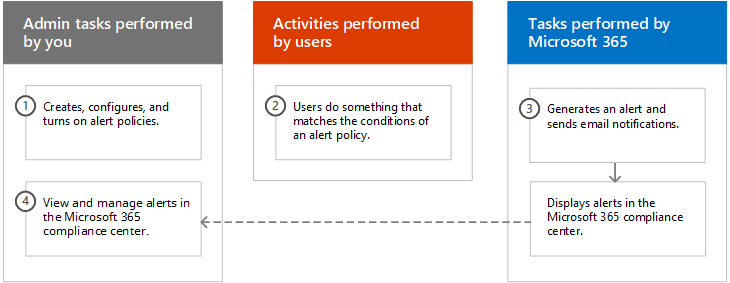
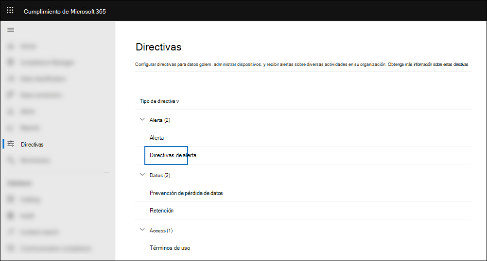
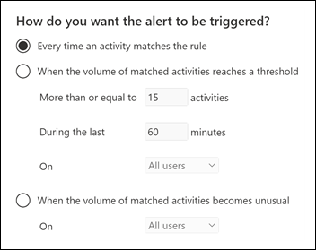

# <a name="alert-policies-in-the-microsoft-365-compliance-center"></a><span data-ttu-id="ddddb-103">Directivas de alerta en el Centro de cumplimiento de Microsoft 365</span><span class="sxs-lookup"><span data-stu-id="ddddb-103">Alert policies in the Microsoft 365 compliance center</span></span>

<span data-ttu-id="ddddb-104">Puede usar la directiva de alertas y las herramientas del panel de alertas en el Centro de cumplimiento de Microsoft 365 para crear directivas de alerta y, a continuación, ver las alertas generadas cuando los usuarios realizan actividades que coinciden con las condiciones de una directiva de alerta.</span><span class="sxs-lookup"><span data-stu-id="ddddb-104">You can use the alert policy and alert dashboard tools in the Microsoft 365 compliance center to create alert policies and then view the alerts generated when users perform activities that match the conditions of an alert policy.</span></span> <span data-ttu-id="ddddb-105">Hay varias directivas de alerta predeterminadas que le ayudan a supervisar actividades como asignar privilegios de administrador en Exchange Online, ataques de malware, campañas de suplantación de identidad (phishing) y niveles inusuales de eliminaciones de archivos y uso compartido externo.</span><span class="sxs-lookup"><span data-stu-id="ddddb-105">There are several default alert policies that help you monitor activities such as assigning admin privileges in Exchange Online, malware attacks, phishing campaigns, and unusual levels of file deletions and external sharing.</span></span>

<span data-ttu-id="ddddb-106">Las directivas de alerta le permiten clasificar las alertas que desencadena una directiva, aplicar la directiva a todos los usuarios de la organización, establecer un nivel de umbral para cuando se desencadena una alerta y decidir si se van a recibir notificaciones por correo electrónico cuando se desencadenan alertas.</span><span class="sxs-lookup"><span data-stu-id="ddddb-106">Alert policies let you categorize the alerts that are triggered by a policy, apply the policy to all users in your organization, set a threshold level for when an alert is triggered, and decide whether to receive email notifications when alerts are triggered.</span></span> <span data-ttu-id="ddddb-107">También hay una página Alertas en el centro de cumplimiento donde puede ver y filtrar alertas, establecer un estado de alerta para ayudarle **a** administrar alertas y, a continuación, descartar alertas después de haber resuelto o resuelto el incidente subyacente.</span><span class="sxs-lookup"><span data-stu-id="ddddb-107">There's also a **Alerts** page in the compliance center where you can view and filter alerts, set an alert status to help you manage alerts, and then dismiss alerts after you've addressed or resolved the underlying incident.</span></span>

> [!NOTE]
> <span data-ttu-id="ddddb-108">Las directivas de alerta están disponibles para organizaciones con una suscripción Microsoft 365 Enterprise, Office 365 Enterprise o Office 365 US Government E1/F1/G1, E3/F3/G3 o E5/G5.</span><span class="sxs-lookup"><span data-stu-id="ddddb-108">Alert policies are available for organizations with a Microsoft 365 Enterprise, Office 365 Enterprise, or Office 365 US Government E1/F1/G1, E3/F3/G3, or E5/G5 subscription.</span></span> <span data-ttu-id="ddddb-109">La funcionalidad avanzada solo está disponible para organizaciones con una suscripción A5/G5, o para organizaciones que tienen una suscripción E1/F1/G1 o E3/F3/G3 y Microsoft Defender para Office 365 P2 o Cumplimiento de Microsoft 365 E5 o una suscripción de complemento E5 eDiscovery and Audit.</span><span class="sxs-lookup"><span data-stu-id="ddddb-109">Advanced functionality is only available for organizations with an E5/G5 subscription, or for organizations that have an E1/F1/G1 or E3/F3/G3 subscription and a Microsoft Defender for Office 365 P2 or a Microsoft 365 E5 Compliance or an E5 eDiscovery and Audit add-on subscription.</span></span> <span data-ttu-id="ddddb-110">La funcionalidad que requiere una suscripción de E5/G5 o complemento se resalta en este tema.</span><span class="sxs-lookup"><span data-stu-id="ddddb-110">The functionality that requires an E5/G5 or add-on subscription is highlighted in this topic.</span></span> <span data-ttu-id="ddddb-111">Tenga en cuenta también que las directivas de alerta están disponibles en Office 365 GCC, GCC entornos gubernamentales de Estados Unidos de Alta y DoD.</span><span class="sxs-lookup"><span data-stu-id="ddddb-111">Also note that alert policies are available in Office 365 GCC, GCC High, and DoD US government environments.</span></span>

## <a name="how-alert-policies-work"></a><span data-ttu-id="ddddb-112">Cómo funcionan las directivas de alertas</span><span class="sxs-lookup"><span data-stu-id="ddddb-112">How alert policies work</span></span>

<span data-ttu-id="ddddb-113">Este es un resumen rápido de cómo funcionan las directivas de alertas y las alertas que se desencadenan cuando la actividad de usuario o administrador coincide con las condiciones de una directiva de alerta.</span><span class="sxs-lookup"><span data-stu-id="ddddb-113">Here's a quick overview of how alert policies work and the alerts that are triggers when user or admin activity matches the conditions of an alert policy.</span></span>



1. <span data-ttu-id="ddddb-115">Un administrador de la organización crea, configura y activa una directiva de alerta mediante la página **Directivas de** alerta del Centro de cumplimiento.</span><span class="sxs-lookup"><span data-stu-id="ddddb-115">An admin in your organization creates, configures, and turns on an alert policy by using the **Alert policies** page in the compliance center.</span></span> <span data-ttu-id="ddddb-116">También puede crear directivas de alerta mediante el cmdlet [New-ProtectionAlert](/powershell/module/exchange/new-protectionalert) en PowerShell del Centro de & seguridad.</span><span class="sxs-lookup"><span data-stu-id="ddddb-116">You can also create alert policies by using the [New-ProtectionAlert](/powershell/module/exchange/new-protectionalert) cmdlet in Security & Compliance Center PowerShell.</span></span>

   <span data-ttu-id="ddddb-117">Para crear directivas de alerta, debe tener asignado el rol Administrar alertas o el rol Configuración de la organización en el centro de cumplimiento.</span><span class="sxs-lookup"><span data-stu-id="ddddb-117">To create alert policies, you have to be assigned the Manage Alerts role or the Organization Configuration role in the compliance center.</span></span>

   > [!NOTE]
   > <span data-ttu-id="ddddb-118">La directiva tarda hasta 24 horas después de crear o actualizar una directiva de alertas.</span><span class="sxs-lookup"><span data-stu-id="ddddb-118">It takes up to 24 hours after creating or updating an alert policy before alerts can be triggered by the policy.</span></span> <span data-ttu-id="ddddb-119">Esto se debe a que la directiva debe sincronizarse con el motor de detección de alertas.</span><span class="sxs-lookup"><span data-stu-id="ddddb-119">This is because the policy has to be synced to the alert detection engine.</span></span>

2. <span data-ttu-id="ddddb-120">Un usuario realiza una actividad que coincide con las condiciones de una directiva de alerta.</span><span class="sxs-lookup"><span data-stu-id="ddddb-120">A user performs an activity that matches the conditions of an alert policy.</span></span> <span data-ttu-id="ddddb-121">En el caso de ataques de malware, los mensajes de correo electrónico infectados enviados a los usuarios de la organización desencadenan una alerta.</span><span class="sxs-lookup"><span data-stu-id="ddddb-121">In the case of malware attacks, infected email messages sent to users in your organization trigger an alert.</span></span>

3. <span data-ttu-id="ddddb-122">Microsoft 365 genera una alerta que se muestra en la página **Alertas** de Centro de cumplimiento de Microsoft 365.</span><span class="sxs-lookup"><span data-stu-id="ddddb-122">Microsoft 365 generates an alert that's displayed on the **Alerts** page in Microsoft 365 compliance center.</span></span> <span data-ttu-id="ddddb-123">Además, si las notificaciones por correo electrónico están habilitadas para la directiva de alerta, Microsoft envía una notificación a una lista de destinatarios.</span><span class="sxs-lookup"><span data-stu-id="ddddb-123">Also, if email notifications are enabled for the alert policy, Microsoft sends a notification to a list of recipients.</span></span> <span data-ttu-id="ddddb-124">Las alertas que un administrador u otros usuarios pueden ver en la página Alertas están determinadas por los roles asignados al usuario.</span><span class="sxs-lookup"><span data-stu-id="ddddb-124">The alerts that an admin or other users can see that on the Alerts page is determined by the roles assigned to the user.</span></span> <span data-ttu-id="ddddb-125">Para obtener más información, vea [RBAC permissions required to view alerts](#rbac-permissions-required-to-view-alerts).</span><span class="sxs-lookup"><span data-stu-id="ddddb-125">For more information, see [RBAC permissions required to view alerts](#rbac-permissions-required-to-view-alerts).</span></span>

4. <span data-ttu-id="ddddb-126">Un administrador administra alertas en el centro de cumplimiento.</span><span class="sxs-lookup"><span data-stu-id="ddddb-126">An admin manages alerts in the compliance center.</span></span> <span data-ttu-id="ddddb-127">La administración de alertas consiste en asignar un estado de alerta para ayudar a realizar un seguimiento y administrar cualquier investigación.</span><span class="sxs-lookup"><span data-stu-id="ddddb-127">Managing alerts consists of assigning an alert status to help track and manage any investigation.</span></span>

## <a name="alert-policy-settings"></a><span data-ttu-id="ddddb-128">Configuración de directiva de alerta</span><span class="sxs-lookup"><span data-stu-id="ddddb-128">Alert policy settings</span></span>

<span data-ttu-id="ddddb-129">Una directiva de alerta consta de un conjunto de reglas y condiciones que definen la actividad de usuario o administrador que genera una alerta, una lista de usuarios que desencadenan la alerta si realizan la actividad y un umbral que define cuántas veces debe producirse la actividad antes de que se desencadene una alerta.</span><span class="sxs-lookup"><span data-stu-id="ddddb-129">An alert policy consists of a set of rules and conditions that define the user or admin activity that generates an alert, a list of users who trigger the alert if they perform the activity, and a threshold that defines how many times the activity has to occur before an alert is triggered.</span></span> <span data-ttu-id="ddddb-130">También categoriza la directiva y le asigna un nivel de gravedad.</span><span class="sxs-lookup"><span data-stu-id="ddddb-130">You also categorize the policy and assign it a severity level.</span></span> <span data-ttu-id="ddddb-131">Estas dos configuraciones le ayudan a administrar las directivas de alerta (y las alertas que se desencadenan cuando se cumplen las condiciones de la directiva) porque puede filtrar esta configuración al administrar directivas y ver alertas en el centro de cumplimiento.</span><span class="sxs-lookup"><span data-stu-id="ddddb-131">These two settings help you manage alert policies (and the alerts that are triggered when the policy conditions are matched) because you can filter on these settings when managing policies and viewing alerts in the compliance center.</span></span> <span data-ttu-id="ddddb-132">Por ejemplo, puede ver alertas que coincidan con las condiciones de la misma categoría o ver alertas con el mismo nivel de gravedad.</span><span class="sxs-lookup"><span data-stu-id="ddddb-132">For example, you can view alerts that match the conditions from the same category or view alerts with the same severity level.</span></span>

<span data-ttu-id="ddddb-133">**Para ver y crear directivas de alerta:**</span><span class="sxs-lookup"><span data-stu-id="ddddb-133">**To view and create alert policies:**</span></span>

<span data-ttu-id="ddddb-134">Vaya a <https://compliance.microsoft.com> y, a continuación, **seleccione Directivas**  >  **directivas de alerta** de  >  **alerta.**</span><span class="sxs-lookup"><span data-stu-id="ddddb-134">Go to <https://compliance.microsoft.com> and then select **Policies** > **Alert** > **Alert policies**.</span></span> <span data-ttu-id="ddddb-135">Como alternativa, puede ir directamente a <https://compliance.microsoft.com/alertpolicies> .</span><span class="sxs-lookup"><span data-stu-id="ddddb-135">Alternatively, you can go directly to <https://compliance.microsoft.com/alertpolicies>.</span></span>



<span data-ttu-id="ddddb-137">Una directiva de alertas consta de las siguientes opciones de configuración y condiciones.</span><span class="sxs-lookup"><span data-stu-id="ddddb-137">An alert policy consists of the following settings and conditions.</span></span>

- <span data-ttu-id="ddddb-138">**Actividad que la alerta está rastreando.**</span><span class="sxs-lookup"><span data-stu-id="ddddb-138">**Activity the alert is tracking**.</span></span> <span data-ttu-id="ddddb-139">Se crea una directiva para realizar un seguimiento de una actividad o, en algunos casos, algunas actividades relacionadas, como compartir un archivo con un usuario externo al compartirlo, asignar permisos de acceso o crear un vínculo anónimo.</span><span class="sxs-lookup"><span data-stu-id="ddddb-139">You create a policy to track an activity or in some cases a few related activities, such a sharing a file with an external user by sharing it, assigning access permissions, or creating an anonymous link.</span></span> <span data-ttu-id="ddddb-140">Cuando un usuario realiza la actividad definida por la directiva, se desencadena una alerta en función de la configuración del umbral de alerta.</span><span class="sxs-lookup"><span data-stu-id="ddddb-140">When a user performs the activity defined by the policy, an alert is triggered based on the alert threshold settings.</span></span>

    > [!NOTE]
    > <span data-ttu-id="ddddb-141">Las actividades que se pueden realizar dependen del plan de administración Office 365 Enterprise organización o Office 365 del Gobierno de Estados Unidos.</span><span class="sxs-lookup"><span data-stu-id="ddddb-141">The activities that you can track depend on your organization's Office 365 Enterprise or Office 365 US Government plan.</span></span> <span data-ttu-id="ddddb-142">En general, las actividades relacionadas con campañas de malware y ataques de suplantación de identidad requieren una suscripción E5/G5 o una suscripción A1/F1/G1 o E3/F3/G3 con una suscripción de complemento de [Defender for Office 365](../security/office-365-security/defender-for-office-365.md) Plan 2.</span><span class="sxs-lookup"><span data-stu-id="ddddb-142">In general, activities related to malware campaigns and phishing attacks require an E5/G5 subscription or an E1/F1/G1 or E3/F3/G3 subscription with an [Defender for Office 365](../security/office-365-security/defender-for-office-365.md) Plan 2 add-on subscription.</span></span>

- <span data-ttu-id="ddddb-143">**Condiciones de actividad**.</span><span class="sxs-lookup"><span data-stu-id="ddddb-143">**Activity conditions**.</span></span> <span data-ttu-id="ddddb-144">Para la mayoría de las actividades, puede definir condiciones adicionales que deben cumplirse para desencadenar una alerta.</span><span class="sxs-lookup"><span data-stu-id="ddddb-144">For most activities, you can define additional conditions that must be met to trigger an alert.</span></span> <span data-ttu-id="ddddb-145">Entre las condiciones comunes se incluyen las direcciones IP (de modo que se desencadena una alerta cuando el usuario realiza la actividad en un equipo con una dirección IP específica o dentro de un intervalo de direcciones IP), si se desencadena una alerta si un usuario o usuarios específicos realizan esa actividad y si la actividad se realiza en un nombre de archivo o dirección URL específicos.</span><span class="sxs-lookup"><span data-stu-id="ddddb-145">Common conditions include IP addresses (so that an alert is triggered when the user performs the activity on a computer with a specific IP address or within an IP address range), whether an alert is triggered if a specific user or users perform that activity, and whether the activity is performed on a specific file name or URL.</span></span> <span data-ttu-id="ddddb-146">También puede configurar una condición que desencadena una alerta cuando cualquier usuario de la organización realiza la actividad.</span><span class="sxs-lookup"><span data-stu-id="ddddb-146">You can also configure a condition that triggers an alert when the activity is performed by any user in your organization.</span></span> <span data-ttu-id="ddddb-147">Las condiciones disponibles dependen de la actividad seleccionada.</span><span class="sxs-lookup"><span data-stu-id="ddddb-147">The available conditions are dependent on the selected activity.</span></span>

- <span data-ttu-id="ddddb-148">**Cuando se desencadena la alerta**.</span><span class="sxs-lookup"><span data-stu-id="ddddb-148">**When the alert is triggered**.</span></span> <span data-ttu-id="ddddb-149">Puede configurar una configuración que defina la frecuencia con la que puede producirse una actividad antes de que se desencadene una alerta.</span><span class="sxs-lookup"><span data-stu-id="ddddb-149">You can configure a setting that defines how often an activity can occur before an alert is triggered.</span></span> <span data-ttu-id="ddddb-150">Esto le permite configurar una directiva para generar una alerta cada vez que una actividad coincide con las condiciones de la directiva, cuando se supera un umbral determinado o cuando la aparición de la actividad que la alerta está rastreando se vuelve inusual para su organización.</span><span class="sxs-lookup"><span data-stu-id="ddddb-150">This allows you to set up a policy to generate an alert every time an activity matches the policy conditions, when a certain threshold is exceeded, or when the occurrence of the activity the alert is tracking becomes unusual for your organization.</span></span>

    

    <span data-ttu-id="ddddb-152">Si selecciona la configuración en función de la actividad inusual, Microsoft establece un valor de línea base que define la frecuencia normal de la actividad seleccionada.</span><span class="sxs-lookup"><span data-stu-id="ddddb-152">If you select the setting based on unusual activity, Microsoft establishes a baseline value that defines the normal frequency for the selected activity.</span></span> <span data-ttu-id="ddddb-153">Se tarda hasta siete días en establecer esta línea base, durante la cual no se generarán alertas.</span><span class="sxs-lookup"><span data-stu-id="ddddb-153">It takes up to seven days to establish this baseline, during which alerts won't be generated.</span></span> <span data-ttu-id="ddddb-154">Una vez establecida la línea base, se desencadena una alerta cuando la frecuencia de la actividad rastreada por la directiva de alerta supera en gran parte el valor de línea base.</span><span class="sxs-lookup"><span data-stu-id="ddddb-154">After the baseline is established, an alert is triggered when the frequency of the activity tracked by the alert policy greatly exceeds the baseline value.</span></span> <span data-ttu-id="ddddb-155">Para las actividades relacionadas con la auditoría (como las actividades de archivos y carpetas), puede establecer una línea base basada en un único usuario o en función de todos los usuarios de la organización; para actividades relacionadas con malware, puede establecer una línea base basada en una única familia de malware, un solo destinatario o todos los mensajes de la organización.</span><span class="sxs-lookup"><span data-stu-id="ddddb-155">For auditing-related activities (such as file and folder activities), you can establish a baseline based on a single user or based on all users in your organization; for malware-related activities, you can establish a baseline based on a single malware family, a single recipient, or all messages in your organization.</span></span>

    > [!NOTE]
    > <span data-ttu-id="ddddb-156">La capacidad de configurar directivas de alerta basadas en un umbral o en una actividad inusual requiere una suscripción E5/G5 o una suscripción E1/F1/G1 o E3/F3/G3 con Microsoft Defender para Office 365 P2, Cumplimiento de Microsoft 365 E5 o una suscripción de complemento de exhibición de documentos electrónicos y auditoría Microsoft 365.</span><span class="sxs-lookup"><span data-stu-id="ddddb-156">The ability to configure alert policies based on a threshold or based on unusual activity requires an E5/G5 subscription, or an E1/F1/G1 or E3/F3/G3 subscription with a Microsoft Defender for Office 365 P2, Microsoft 365 E5 Compliance, or Microsoft 365 eDiscovery and Audit add-on subscription.</span></span> <span data-ttu-id="ddddb-157">Las organizaciones con una suscripción A1/F1/G1 y E3/F3/G3 solo pueden crear directivas de alerta donde se desencadene una alerta cada vez que se produzca una actividad.</span><span class="sxs-lookup"><span data-stu-id="ddddb-157">Organizations with an E1/F1/G1 and E3/F3/G3 subscription can only create alert policies where an alert is triggered every time that an activity occurs.</span></span>

- <span data-ttu-id="ddddb-158">**Categoría de alerta**.</span><span class="sxs-lookup"><span data-stu-id="ddddb-158">**Alert category**.</span></span> <span data-ttu-id="ddddb-159">Para ayudar con el seguimiento y la administración de las alertas generadas por una directiva, puede asignar una de las siguientes categorías a una directiva.</span><span class="sxs-lookup"><span data-stu-id="ddddb-159">To help with tracking and managing the alerts generated by a policy, you can assign one of the following categories to a policy.</span></span>

  - <span data-ttu-id="ddddb-160">Prevención de pérdida de datos</span><span class="sxs-lookup"><span data-stu-id="ddddb-160">Data loss prevention</span></span>

  - <span data-ttu-id="ddddb-161">Información de gobierno</span><span class="sxs-lookup"><span data-stu-id="ddddb-161">Information governance</span></span>

  - <span data-ttu-id="ddddb-162">Flujo de correo</span><span class="sxs-lookup"><span data-stu-id="ddddb-162">Mail flow</span></span>

  - <span data-ttu-id="ddddb-163">Permisos</span><span class="sxs-lookup"><span data-stu-id="ddddb-163">Permissions</span></span>

  - <span data-ttu-id="ddddb-164">Administración de amenazas</span><span class="sxs-lookup"><span data-stu-id="ddddb-164">Threat management</span></span>

  - <span data-ttu-id="ddddb-165">Otros</span><span class="sxs-lookup"><span data-stu-id="ddddb-165">Others</span></span>

  <span data-ttu-id="ddddb-166">Cuando se produce una actividad que coincide con las condiciones de la directiva de alerta, la alerta generada se etiqueta con la categoría definida en esta configuración.</span><span class="sxs-lookup"><span data-stu-id="ddddb-166">When an activity occurs that matches the conditions of the alert policy, the alert that's generated is tagged with the category defined in this setting.</span></span> <span data-ttu-id="ddddb-167">Esto le permite realizar un seguimiento y administrar  alertas que tienen la misma configuración de categoría en la página Alertas del centro de cumplimiento, ya que puede ordenar y filtrar alertas según la categoría.</span><span class="sxs-lookup"><span data-stu-id="ddddb-167">This allows you to track and manage alerts that have the same category setting on the **Alerts** page in the compliance center because you can sort and filter alerts based on category.</span></span>

- <span data-ttu-id="ddddb-168">**Gravedad de alerta**.</span><span class="sxs-lookup"><span data-stu-id="ddddb-168">**Alert severity**.</span></span> <span data-ttu-id="ddddb-169">De forma similar a la categoría de alerta, se asigna un atributo de gravedad (**Low**, **Medium**, **High** o **Informational**) a las directivas de alerta.</span><span class="sxs-lookup"><span data-stu-id="ddddb-169">Similar to the alert category, you assign a severity attribute (**Low**, **Medium**, **High**, or **Informational**) to alert policies.</span></span> <span data-ttu-id="ddddb-170">Al igual que la categoría de alerta, cuando se produce una actividad que coincide con las condiciones de la directiva de alerta, la alerta generada se etiqueta con el mismo nivel de gravedad que se establece para la directiva de alerta.</span><span class="sxs-lookup"><span data-stu-id="ddddb-170">Like the alert category, when an activity occurs that matches the conditions of the alert policy, the alert that's generated is tagged with the same severity level that's set for the alert policy.</span></span> <span data-ttu-id="ddddb-171">De nuevo, esto le permite realizar un seguimiento y administrar alertas que tienen la misma configuración de gravedad en la página **Alertas.**</span><span class="sxs-lookup"><span data-stu-id="ddddb-171">Again, this allows you to track and manage alerts that have the same severity setting on the **Alerts** page.</span></span> <span data-ttu-id="ddddb-172">Por ejemplo, puede filtrar la lista de alertas para que solo se muestren alertas con una gravedad alta. </span><span class="sxs-lookup"><span data-stu-id="ddddb-172">For example, you can filter the list of alerts so that only alerts with a **High** severity are displayed.</span></span>

    > [!TIP]
    > <span data-ttu-id="ddddb-173">Al configurar una directiva de alerta, considere la posibilidad de asignar una mayor gravedad a actividades que puedan tener consecuencias muy negativas, como la detección de malware después de la entrega a los usuarios, la visualización de datos confidenciales o clasificados, el uso compartido de datos con usuarios externos u otras actividades que puedan provocar pérdida de datos o amenazas de seguridad.</span><span class="sxs-lookup"><span data-stu-id="ddddb-173">When setting up an alert policy, consider assigning a higher severity to activities that can result in severely negative consequences, such as detection of malware after delivery to users, viewing of sensitive or classified data, sharing data with external users, or other activities that can result in data loss or security threats.</span></span> <span data-ttu-id="ddddb-174">Esto puede ayudarle a priorizar las alertas y las acciones que lleve a cabo para investigar y resolver las causas subyacentes.</span><span class="sxs-lookup"><span data-stu-id="ddddb-174">This can help you prioritize alerts and the actions you take to investigate and resolve the underlying causes.</span></span>

- <span data-ttu-id="ddddb-175">**Notificaciones por correo electrónico**.</span><span class="sxs-lookup"><span data-stu-id="ddddb-175">**Email notifications**.</span></span> <span data-ttu-id="ddddb-176">Puede configurar la directiva para que las notificaciones de correo electrónico se envíen (o no se envíen) a una lista de usuarios cuando se desencadene una alerta.</span><span class="sxs-lookup"><span data-stu-id="ddddb-176">You can set up the policy so that email notifications are sent (or not sent) to a list of users when an alert is triggered.</span></span> <span data-ttu-id="ddddb-177">También puede establecer un límite de notificación diario para que, una vez alcanzado el número máximo de notificaciones, no se envíen más notificaciones para la alerta durante ese día.</span><span class="sxs-lookup"><span data-stu-id="ddddb-177">You can also set a daily notification limit so that once the maximum number of notifications has been reached, no more notifications are sent for the alert during that day.</span></span> <span data-ttu-id="ddddb-178">Además de las notificaciones por correo electrónico, usted u otros administradores pueden ver las alertas que desencadena una directiva en la página **Alertas.**</span><span class="sxs-lookup"><span data-stu-id="ddddb-178">In addition to email notifications, you or other administrators can view the alerts that are triggered by a policy on the **Alerts** page.</span></span> <span data-ttu-id="ddddb-179">Considere la posibilidad de habilitar las notificaciones de correo electrónico para directivas de alerta de una categoría específica o que tengan una configuración de gravedad mayor.</span><span class="sxs-lookup"><span data-stu-id="ddddb-179">Consider enabling email notifications for alert policies of a specific category or that have a higher severity setting.</span></span>

## <a name="default-alert-policies"></a><span data-ttu-id="ddddb-180">Directivas de alerta predeterminadas</span><span class="sxs-lookup"><span data-stu-id="ddddb-180">Default alert policies</span></span>

<span data-ttu-id="ddddb-181">Microsoft proporciona directivas de alerta integradas que ayudan a identificar Exchange de permisos de administrador, actividad de malware, posibles amenazas externas e internas y riesgos de gobierno de la información.</span><span class="sxs-lookup"><span data-stu-id="ddddb-181">Microsoft provides built-in alert policies that help identify Exchange admin permissions abuse, malware activity, potential external and internal threats, and information governance risks.</span></span> <span data-ttu-id="ddddb-182">En la **página Directivas de** alerta, los nombres de estas directivas integradas están en negrita y el tipo de directiva se define como **System**.</span><span class="sxs-lookup"><span data-stu-id="ddddb-182">On the **Alert policies** page, the names of these built-in policies are in bold and the policy type is defined as **System**.</span></span> <span data-ttu-id="ddddb-183">Estas directivas están activadas de forma predeterminada.</span><span class="sxs-lookup"><span data-stu-id="ddddb-183">These policies are turned on by default.</span></span> <span data-ttu-id="ddddb-184">Puedes desactivar estas directivas (o volver a activar), configurar una lista de destinatarios a los que enviar notificaciones por correo electrónico y establecer un límite de notificación diario.</span><span class="sxs-lookup"><span data-stu-id="ddddb-184">You can turn off these policies (or back on again), set up a list of recipients to send email notifications to, and set a daily notification limit.</span></span> <span data-ttu-id="ddddb-185">La otra configuración de estas directivas no se puede editar.</span><span class="sxs-lookup"><span data-stu-id="ddddb-185">The other settings for these policies can't be edited.</span></span>

<span data-ttu-id="ddddb-186">En la tabla siguiente se enumeran y describen las directivas de alerta predeterminadas disponibles y la categoría a la que se asigna cada directiva.</span><span class="sxs-lookup"><span data-stu-id="ddddb-186">The following table lists and describes the available default alert policies and the category each policy is assigned to.</span></span> <span data-ttu-id="ddddb-187">La categoría se usa para determinar qué alertas puede ver un usuario en la página Alertas.</span><span class="sxs-lookup"><span data-stu-id="ddddb-187">The category is used to determine which alerts a user can view on the Alerts page.</span></span> <span data-ttu-id="ddddb-188">Para obtener más información, vea [RBAC permissions required to view alerts](#rbac-permissions-required-to-view-alerts).</span><span class="sxs-lookup"><span data-stu-id="ddddb-188">For more information, see [RBAC permissions required to view alerts](#rbac-permissions-required-to-view-alerts).</span></span>

<span data-ttu-id="ddddb-189">En la tabla también se indica Office 365 Enterprise y Office 365 plan del Gobierno de Estados Unidos necesario para cada uno de ellos.</span><span class="sxs-lookup"><span data-stu-id="ddddb-189">The table also indicates the Office 365 Enterprise and Office 365 US Government plan required for each one.</span></span> <span data-ttu-id="ddddb-190">Algunas directivas de alerta predeterminadas están disponibles si su organización tiene la suscripción de complemento adecuada además de una suscripción E1/F1/G1 o E3/F3/G3.</span><span class="sxs-lookup"><span data-stu-id="ddddb-190">Some default alert policies are available if your organization has the appropriate add-on subscription in addition to an E1/F1/G1 or E3/F3/G3 subscription.</span></span>

| <span data-ttu-id="ddddb-191">Directiva de alerta predeterminada</span><span class="sxs-lookup"><span data-stu-id="ddddb-191">Default alert policy</span></span> | <span data-ttu-id="ddddb-192">Descripción</span><span class="sxs-lookup"><span data-stu-id="ddddb-192">Description</span></span> | <span data-ttu-id="ddddb-193">Categoría</span><span class="sxs-lookup"><span data-stu-id="ddddb-193">Category</span></span> | <span data-ttu-id="ddddb-194">Enterprise suscripción</span><span class="sxs-lookup"><span data-stu-id="ddddb-194">Enterprise subscription</span></span> |
|:-----|:-----|:-----|:-----|
|<span data-ttu-id="ddddb-195">**Se detectó un clic de dirección URL potencialmente malintencionado**</span><span class="sxs-lookup"><span data-stu-id="ddddb-195">**A potentially malicious URL click was detected**</span></span>|<span data-ttu-id="ddddb-196">Genera una alerta cuando un usuario protegido por [Caja fuerte vínculos de](../security/office-365-security/safe-links.md) la organización hace clic en un vínculo malintencionado.</span><span class="sxs-lookup"><span data-stu-id="ddddb-196">Generates an alert when a user protected by [Safe Links](../security/office-365-security/safe-links.md) in your organization clicks a malicious link.</span></span> <span data-ttu-id="ddddb-197">Este evento se desencadena cuando Microsoft Defender identifica los cambios de veredicto de url para Office 365 o cuando los usuarios invalidan las páginas de vínculos de Caja fuerte (según la directiva de vínculos de Microsoft 365 para empresas de Caja fuerte de la organización).</span><span class="sxs-lookup"><span data-stu-id="ddddb-197">This event is triggered when URL verdict changes are identified by Microsoft Defender for Office 365 or when users override the Safe Links pages (based on your organization's Microsoft 365 for business Safe Links policy).</span></span> <span data-ttu-id="ddddb-198">Esta directiva de alerta tiene **una configuración de** gravedad alta.</span><span class="sxs-lookup"><span data-stu-id="ddddb-198">This alert policy has a **High** severity setting.</span></span> <span data-ttu-id="ddddb-199">Para los clientes de Defender Office 365 P2, E5, G5, esta alerta desencadena automáticamente la investigación automatizada y la respuesta [en Office 365](../security/office-365-security/office-365-air.md).</span><span class="sxs-lookup"><span data-stu-id="ddddb-199">For Defender for Office 365 P2, E5, G5 customers, this alert automatically triggers [automated investigation and response in Office 365](../security/office-365-security/office-365-air.md).</span></span> <span data-ttu-id="ddddb-200">Para obtener más información sobre los eventos que desencadenan esta alerta, vea [Configurar Caja fuerte de vínculos](../security/office-365-security/set-up-safe-links-policies.md).</span><span class="sxs-lookup"><span data-stu-id="ddddb-200">For more information on events that trigger this alert, see [Set up Safe Links policies](../security/office-365-security/set-up-safe-links-policies.md).</span></span>|<span data-ttu-id="ddddb-201">Administración de amenazas</span><span class="sxs-lookup"><span data-stu-id="ddddb-201">Threat management</span></span>|<span data-ttu-id="ddddb-202">E5/G5 o Defender para una Office 365 de complemento P2</span><span class="sxs-lookup"><span data-stu-id="ddddb-202">E5/G5 or Defender for Office 365 P2 add-on subscription</span></span>|
|<span data-ttu-id="ddddb-203">**Resultado de envío de administrador completado**</span><span class="sxs-lookup"><span data-stu-id="ddddb-203">**Admin Submission result completed**</span></span>|<span data-ttu-id="ddddb-204">Genera una alerta cuando un [envío de](../security/office-365-security/admin-submission.md) administrador completa el nuevo análisis de la entidad enviada.</span><span class="sxs-lookup"><span data-stu-id="ddddb-204">Generates an alert when an [Admin Submission](../security/office-365-security/admin-submission.md) completes the rescan of the submitted entity.</span></span> <span data-ttu-id="ddddb-205">Se activará una alerta cada vez que se represente un resultado de nuevo análisis desde un envío de administrador.</span><span class="sxs-lookup"><span data-stu-id="ddddb-205">An alert will be triggered every time a rescan result is rendered from an Admin Submission.</span></span> <span data-ttu-id="ddddb-206">Estas alertas están diseñadas para recordarle que revise los resultados de envíos anteriores, envíe mensajes [notificados](https://protection.office.com/reportsubmission)por el usuario para obtener los últimos veredictos de comprobación de directivas y volver a examinar, y le ayudarán a determinar si las directivas de filtrado de su organización están teniendo el impacto previsto.</span><span class="sxs-lookup"><span data-stu-id="ddddb-206">These alerts are meant to remind you to [review the results of previous submissions](https://protection.office.com/reportsubmission), submit user reported messages to get the latest policy check and rescan verdicts, and help you determine if the filtering policies in your organization are having the intended impact.</span></span> <span data-ttu-id="ddddb-207">Esta directiva tiene una **configuración de gravedad informativo.**</span><span class="sxs-lookup"><span data-stu-id="ddddb-207">This policy has a **Informational** severity setting.</span></span>|<span data-ttu-id="ddddb-208">Administración de amenazas</span><span class="sxs-lookup"><span data-stu-id="ddddb-208">Threat management</span></span>|<span data-ttu-id="ddddb-209">E1/F1, E3/F3 o E5</span><span class="sxs-lookup"><span data-stu-id="ddddb-209">E1/F1, E3/F3, or E5</span></span>|
|<span data-ttu-id="ddddb-210">**Investigación manual de correo electrónico desencadenada por el administrador**</span><span class="sxs-lookup"><span data-stu-id="ddddb-210">**Admin triggered manual investigation of email**</span></span>|<span data-ttu-id="ddddb-211">Genera una alerta cuando un administrador desencadena la investigación manual de un correo electrónico desde el Explorador de amenazas.</span><span class="sxs-lookup"><span data-stu-id="ddddb-211">Generates an alert when an admin triggers the manual investigation of an email from Threat Explorer.</span></span> <span data-ttu-id="ddddb-212">Para obtener más información, vea [Ejemplo: un administrador de seguridad desencadena una investigación desde el Explorador de amenazas](../security/office-365-security/automated-investigation-response-office.md#example-a-security-administrator-triggers-an-investigation-from-threat-explorer).</span><span class="sxs-lookup"><span data-stu-id="ddddb-212">For more information, see [Example: A security administrator triggers an investigation from Threat Explorer](../security/office-365-security/automated-investigation-response-office.md#example-a-security-administrator-triggers-an-investigation-from-threat-explorer).</span></span> <span data-ttu-id="ddddb-213">Esta alerta notifica a la organización que se inició la investigación.</span><span class="sxs-lookup"><span data-stu-id="ddddb-213">This alert notifies your organization that the investigation was started.</span></span> <span data-ttu-id="ddddb-214">La alerta proporciona información sobre quién la desencadenó e incluye un vínculo a la investigación.</span><span class="sxs-lookup"><span data-stu-id="ddddb-214">The alert provides information about who triggered it and includes a link to the investigation.</span></span> <span data-ttu-id="ddddb-215">Esta directiva tiene una **configuración de gravedad informativo.**</span><span class="sxs-lookup"><span data-stu-id="ddddb-215">This policy has an **Informational** severity setting.</span></span>|<span data-ttu-id="ddddb-216">Administración de amenazas</span><span class="sxs-lookup"><span data-stu-id="ddddb-216">Threat management</span></span>| <span data-ttu-id="ddddb-217">E5/G5 o Microsoft Defender para una Office 365 de complemento P2</span><span class="sxs-lookup"><span data-stu-id="ddddb-217">E5/G5 or Microsoft Defender for Office 365 P2 add-on subscription</span></span>| 
|<span data-ttu-id="ddddb-218">**Creación de una regla de reenvío o redirección**</span><span class="sxs-lookup"><span data-stu-id="ddddb-218">**Creation of forwarding/redirect rule**</span></span>|<span data-ttu-id="ddddb-219">Genera una alerta cuando alguien de la organización crea una regla de bandeja de entrada para su buzón que reenvía o redirige mensajes a otra cuenta de correo electrónico.</span><span class="sxs-lookup"><span data-stu-id="ddddb-219">Generates an alert when someone in your organization creates an inbox rule for their mailbox that forwards or redirects messages to another email account.</span></span> <span data-ttu-id="ddddb-220">Esta directiva solo realiza un seguimiento de las reglas de bandeja de entrada que se crean Outlook en la Web (anteriormente conocidas como Outlook Web App) o Exchange Online PowerShell.</span><span class="sxs-lookup"><span data-stu-id="ddddb-220">This policy only tracks inbox rules that are created using Outlook on the web (formerly known as Outlook Web App) or Exchange Online PowerShell.</span></span> <span data-ttu-id="ddddb-221">Esta directiva tiene una **configuración de gravedad informativo.**</span><span class="sxs-lookup"><span data-stu-id="ddddb-221">This policy has a **Informational** severity setting.</span></span> <span data-ttu-id="ddddb-222">Para obtener más información acerca del uso de reglas de bandeja de entrada para reenviar y redirigir el correo electrónico en Outlook en la Web, vea Usar reglas en Outlook en la Web para reenviar automáticamente mensajes [a otra cuenta](https://support.office.com/article/1433e3a0-7fb0-4999-b536-50e05cb67fed).</span><span class="sxs-lookup"><span data-stu-id="ddddb-222">For more information about using inbox rules to forward and redirect email in Outlook on the web, see [Use rules in Outlook on the web to automatically forward messages to another account](https://support.office.com/article/1433e3a0-7fb0-4999-b536-50e05cb67fed).</span></span>|<span data-ttu-id="ddddb-223">Administración de amenazas</span><span class="sxs-lookup"><span data-stu-id="ddddb-223">Threat management</span></span>|<span data-ttu-id="ddddb-224">E1/F1/G1, E3/F3/G3 o E5/G5</span><span class="sxs-lookup"><span data-stu-id="ddddb-224">E1/F1/G1, E3/F3/G3, or E5/G5</span></span>|
|<span data-ttu-id="ddddb-225">**Búsqueda de exhibición de documentos electrónicos iniciada o exportada**</span><span class="sxs-lookup"><span data-stu-id="ddddb-225">**eDiscovery search started or exported**</span></span>|<span data-ttu-id="ddddb-226">Genera una alerta cuando alguien usa la herramienta de búsqueda de contenido en el Centro de seguridad y cumplimiento.</span><span class="sxs-lookup"><span data-stu-id="ddddb-226">Generates an alert when someone uses the Content search tool in the Security and compliance center.</span></span> <span data-ttu-id="ddddb-227">Cuando se realizan las siguientes actividades de búsqueda de contenido, se desencadena una alerta:</span><span class="sxs-lookup"><span data-stu-id="ddddb-227">An alert is triggered when the following content search activities are performed:</span></span> <br/><br/><span data-ttu-id="ddddb-228">\* Se inicia una búsqueda de contenido</span><span class="sxs-lookup"><span data-stu-id="ddddb-228">\* A content search is started</span></span><br/><span data-ttu-id="ddddb-229">\* Los resultados de una búsqueda de contenido se exportan</span><span class="sxs-lookup"><span data-stu-id="ddddb-229">\* The results of a content search are exported</span></span><br/><span data-ttu-id="ddddb-230">\* Se exporta un informe de búsqueda de contenido</span><span class="sxs-lookup"><span data-stu-id="ddddb-230">\* A content search report is exported</span></span><br/><br/><span data-ttu-id="ddddb-231">Las alertas también se desencadenan cuando las actividades de búsqueda de contenido anteriores se realizan en asociación con un caso de exhibición de documentos electrónicos.</span><span class="sxs-lookup"><span data-stu-id="ddddb-231">Alerts are also triggered when the previous content search activities are performed in association with an eDiscovery case.</span></span> <span data-ttu-id="ddddb-232">Esta directiva tiene una **configuración de gravedad informativo.**</span><span class="sxs-lookup"><span data-stu-id="ddddb-232">This policy has a **Informational** severity setting.</span></span> <span data-ttu-id="ddddb-233">Para obtener más información acerca de las actividades de búsqueda de contenido, vea [Buscar actividades de exhibición de documentos electrónicos en el registro de auditoría.](search-for-ediscovery-activities-in-the-audit-log.md#ediscovery-activities)</span><span class="sxs-lookup"><span data-stu-id="ddddb-233">For more information about content search activities, see [Search for eDiscovery activities in the audit log](search-for-ediscovery-activities-in-the-audit-log.md#ediscovery-activities).</span></span>|<span data-ttu-id="ddddb-234">Administración de amenazas</span><span class="sxs-lookup"><span data-stu-id="ddddb-234">Threat management</span></span>|<span data-ttu-id="ddddb-235">E1/F1/G1, E3/F3/G3 o E5/G5</span><span class="sxs-lookup"><span data-stu-id="ddddb-235">E1/F1/G1, E3/F3/G3, or E5/G5</span></span>|
|<span data-ttu-id="ddddb-236">**Elevación de Exchange privilegio de administrador**</span><span class="sxs-lookup"><span data-stu-id="ddddb-236">**Elevation of Exchange admin privilege**</span></span>|<span data-ttu-id="ddddb-237">Genera una alerta cuando alguien tiene asignados permisos administrativos en su Exchange Online organización.</span><span class="sxs-lookup"><span data-stu-id="ddddb-237">Generates an alert when someone is assigned administrative permissions in your Exchange Online organization.</span></span> <span data-ttu-id="ddddb-238">Por ejemplo, cuando se agrega un usuario al grupo de roles Administración de la organización en Exchange Online.</span><span class="sxs-lookup"><span data-stu-id="ddddb-238">For example, when a user is added to the Organization Management role group in Exchange Online.</span></span> <span data-ttu-id="ddddb-239">Esta directiva tiene una **configuración de** gravedad baja.</span><span class="sxs-lookup"><span data-stu-id="ddddb-239">This policy has a **Low** severity setting.</span></span>|<span data-ttu-id="ddddb-240">Permisos</span><span class="sxs-lookup"><span data-stu-id="ddddb-240">Permissions</span></span>|<span data-ttu-id="ddddb-241">E1/F1/G1, E3/F3/G3 o E5/G5</span><span class="sxs-lookup"><span data-stu-id="ddddb-241">E1/F1/G1, E3/F3/G3, or E5/G5</span></span>|
|<span data-ttu-id="ddddb-242">**Mensajes de correo electrónico que contienen malware quitados después de la entrega**</span><span class="sxs-lookup"><span data-stu-id="ddddb-242">**Email messages containing malware removed after delivery**</span></span>|<span data-ttu-id="ddddb-243">Genera una alerta cuando los mensajes que contienen malware se entregan a los buzones de la organización.</span><span class="sxs-lookup"><span data-stu-id="ddddb-243">Generates an alert when any messages containing malware are delivered to mailboxes in your organization.</span></span> <span data-ttu-id="ddddb-244">Si se produce este evento, Microsoft quita los mensajes infectados de los buzones de correo Exchange Online mediante la purga automática de hora [cero](../security/office-365-security/zero-hour-auto-purge.md).</span><span class="sxs-lookup"><span data-stu-id="ddddb-244">If this event occurs, Microsoft removes the infected messages from Exchange Online mailboxes using [Zero-hour auto purge](../security/office-365-security/zero-hour-auto-purge.md).</span></span> <span data-ttu-id="ddddb-245">Esta directiva tiene una **configuración de** gravedad informativo y desencadena automáticamente la investigación y respuesta [automatizadas en Office 365](../security/office-365-security/office-365-air.md).</span><span class="sxs-lookup"><span data-stu-id="ddddb-245">This policy has an **Informational** severity setting and automatically triggers [automated investigation and response in Office 365](../security/office-365-security/office-365-air.md).</span></span>|<span data-ttu-id="ddddb-246">Administración de amenazas</span><span class="sxs-lookup"><span data-stu-id="ddddb-246">Threat management</span></span>|<span data-ttu-id="ddddb-247">E5/G5 o Microsoft Defender para una Office 365 de complemento P2</span><span class="sxs-lookup"><span data-stu-id="ddddb-247">E5/G5 or Microsoft Defender for Office 365 P2 add-on subscription</span></span>|
|<span data-ttu-id="ddddb-248">**Mensajes de correo electrónico que contienen direcciones URL de cebo quitados después de la entrega**</span><span class="sxs-lookup"><span data-stu-id="ddddb-248">**Email messages containing phish URLs removed after delivery**</span></span>|<span data-ttu-id="ddddb-249">Genera una alerta cuando los mensajes que contienen phish se entregan a los buzones de la organización.</span><span class="sxs-lookup"><span data-stu-id="ddddb-249">Generates an alert when any messages containing phish are delivered to mailboxes in your organization.</span></span> <span data-ttu-id="ddddb-250">Si se produce este evento, Microsoft quita los mensajes infectados de los buzones de correo Exchange Online mediante la purga automática de hora [cero](../security/office-365-security/zero-hour-auto-purge.md).</span><span class="sxs-lookup"><span data-stu-id="ddddb-250">If this event occurs, Microsoft removes the infected messages from Exchange Online mailboxes using [Zero-hour auto purge](../security/office-365-security/zero-hour-auto-purge.md).</span></span> <span data-ttu-id="ddddb-251">Esta directiva tiene una **configuración de** gravedad informativo y desencadena automáticamente la investigación y respuesta [automatizadas en Office 365](../security/office-365-security/office-365-air.md).</span><span class="sxs-lookup"><span data-stu-id="ddddb-251">This policy has an **Informational** severity setting and automatically triggers [automated investigation and response in Office 365](../security/office-365-security/office-365-air.md).</span></span>|<span data-ttu-id="ddddb-252">Administración de amenazas</span><span class="sxs-lookup"><span data-stu-id="ddddb-252">Threat management</span></span>|<span data-ttu-id="ddddb-253">E5/G5 o Defender para una Office 365 de complemento P2</span><span class="sxs-lookup"><span data-stu-id="ddddb-253">E5/G5 or Defender for Office 365 P2 add-on subscription</span></span>|
|<span data-ttu-id="ddddb-254">**Correo electrónico notificado por el usuario como malware o cebo**</span><span class="sxs-lookup"><span data-stu-id="ddddb-254">**Email reported by user as malware or phish**</span></span>|<span data-ttu-id="ddddb-255">Genera una alerta cuando los usuarios de la organización informan de mensajes como correo electrónico de suplantación de identidad mediante el complemento Mensaje de informe.</span><span class="sxs-lookup"><span data-stu-id="ddddb-255">Generates an alert when users in your organization  report messages as phishing email using the Report Message add-in.</span></span> <span data-ttu-id="ddddb-256">Esta directiva tiene una **configuración de** gravedad baja.</span><span class="sxs-lookup"><span data-stu-id="ddddb-256">This policy has an **Low** severity setting.</span></span> <span data-ttu-id="ddddb-257">Para obtener más información acerca de este complemento, vea [Use the Report Message add-in](https://support.office.com/article/b5caa9f1-cdf3-4443-af8c-ff724ea719d2).</span><span class="sxs-lookup"><span data-stu-id="ddddb-257">For more information about this add-in, see [Use the Report Message add-in](https://support.office.com/article/b5caa9f1-cdf3-4443-af8c-ff724ea719d2).</span></span> <span data-ttu-id="ddddb-258">Para los clientes de Defender Office 365 P2, E5, G5, esta alerta desencadena automáticamente la investigación automatizada y la respuesta [en Office 365](../security/office-365-security/office-365-air.md).</span><span class="sxs-lookup"><span data-stu-id="ddddb-258">For Defender for Office 365 P2, E5, G5 customers, this alert automatically triggers [automated investigation and response in Office 365](../security/office-365-security/office-365-air.md).</span></span>|<span data-ttu-id="ddddb-259">Administración de amenazas</span><span class="sxs-lookup"><span data-stu-id="ddddb-259">Threat management</span></span>|<span data-ttu-id="ddddb-260">E1/F1/G1, E3/F3/G3 o E5/G5</span><span class="sxs-lookup"><span data-stu-id="ddddb-260">E1/F1/G1, E3/F3/G3, or E5/G5</span></span>|
|<span data-ttu-id="ddddb-261">**Límite de envío de correo electrónico superado**</span><span class="sxs-lookup"><span data-stu-id="ddddb-261">**Email sending limit exceeded**</span></span>|<span data-ttu-id="ddddb-262">Genera una alerta cuando alguien de la organización ha enviado más correo del permitido por la directiva de correo no deseado saliente.</span><span class="sxs-lookup"><span data-stu-id="ddddb-262">Generates an alert when someone in your organization has sent more mail than is allowed by the outbound spam policy.</span></span> <span data-ttu-id="ddddb-263">Esto suele indicar que el usuario envía demasiado correo electrónico o que la cuenta puede estar en peligro.</span><span class="sxs-lookup"><span data-stu-id="ddddb-263">This is usually an indication the user is sending too much email or that the account may be compromised.</span></span> <span data-ttu-id="ddddb-264">Esta directiva tiene una **configuración de** gravedad media.</span><span class="sxs-lookup"><span data-stu-id="ddddb-264">This policy has a **Medium** severity setting.</span></span> <span data-ttu-id="ddddb-265">Si obtiene una alerta generada por esta directiva de alerta, es buena idea comprobar si la cuenta de usuario [está en peligro.](../security/office-365-security/responding-to-a-compromised-email-account.md)</span><span class="sxs-lookup"><span data-stu-id="ddddb-265">If you get an alert generated by this alert policy, it's a good idea to [check whether the user account is compromised](../security/office-365-security/responding-to-a-compromised-email-account.md).</span></span>|<span data-ttu-id="ddddb-266">Administración de amenazas</span><span class="sxs-lookup"><span data-stu-id="ddddb-266">Threat management</span></span>|<span data-ttu-id="ddddb-267">E1/F1/G1, E3/F3/G3 o E5/G5</span><span class="sxs-lookup"><span data-stu-id="ddddb-267">E1/F1/G1, E3/F3/G3, or E5/G5</span></span>|
|<span data-ttu-id="ddddb-268">**Formulario bloqueado debido a un posible intento de suplantación de identidad**</span><span class="sxs-lookup"><span data-stu-id="ddddb-268">**Form blocked due to potential phishing attempt**</span></span>|<span data-ttu-id="ddddb-269">Genera una alerta cuando se ha restringido a alguien de la organización el uso compartido de formularios y la recopilación de respuestas mediante Microsoft Forms debido al comportamiento de intento de suplantación de identidad (phishing) repetido detectado.</span><span class="sxs-lookup"><span data-stu-id="ddddb-269">Generates an alert when someone in your organization has been restricted from sharing forms and collecting responses using Microsoft Forms due to detected repeated phishing attempt behavior.</span></span> <span data-ttu-id="ddddb-270">Esta directiva tiene una **configuración de gravedad alta.**</span><span class="sxs-lookup"><span data-stu-id="ddddb-270">This policy has a **High severity** setting.</span></span>|<span data-ttu-id="ddddb-271">Administración de amenazas</span><span class="sxs-lookup"><span data-stu-id="ddddb-271">Threat management</span></span>|<span data-ttu-id="ddddb-272">E1, E3/F3 o E5</span><span class="sxs-lookup"><span data-stu-id="ddddb-272">E1, E3/F3, or E5</span></span>|
|<span data-ttu-id="ddddb-273">**Formulario marcado y confirmado como suplantación de identidad**</span><span class="sxs-lookup"><span data-stu-id="ddddb-273">**Form flagged and confirmed as phishing**</span></span>|<span data-ttu-id="ddddb-274">Genera una alerta cuando microsoft ha identificado un formulario creado en Microsoft Forms desde dentro de su organización como posible suplantación de identidad mediante el uso indebido de informes y confirmado como suplantación de identidad por Parte de Microsoft.</span><span class="sxs-lookup"><span data-stu-id="ddddb-274">Generates an alert when a form created in Microsoft Forms from within your organization has been identified as potential phishing through Report Abuse and confirmed as phishing by Microsoft.</span></span> <span data-ttu-id="ddddb-275">Esta directiva tiene una **configuración de** gravedad alta.</span><span class="sxs-lookup"><span data-stu-id="ddddb-275">This policy has a **High** severity setting.</span></span>|<span data-ttu-id="ddddb-276">Administración de amenazas</span><span class="sxs-lookup"><span data-stu-id="ddddb-276">Threat management</span></span>|<span data-ttu-id="ddddb-277">E1, E3/F3 o E5</span><span class="sxs-lookup"><span data-stu-id="ddddb-277">E1, E3/F3, or E5</span></span>|
|<span data-ttu-id="ddddb-278">**Los mensajes se han retrasado**</span><span class="sxs-lookup"><span data-stu-id="ddddb-278">**Messages have been delayed**</span></span>|<span data-ttu-id="ddddb-279">Genera una alerta cuando Microsoft no puede entregar mensajes de correo electrónico a su organización local o a un servidor asociado mediante un conector.</span><span class="sxs-lookup"><span data-stu-id="ddddb-279">Generates an alert when Microsoft can't deliver email messages to your on-premises organization or a partner server by using a connector.</span></span> <span data-ttu-id="ddddb-280">Cuando esto sucede, el mensaje se pone en cola en Office 365.</span><span class="sxs-lookup"><span data-stu-id="ddddb-280">When this happens, the message is queued in Office 365.</span></span> <span data-ttu-id="ddddb-281">Esta alerta se desencadena cuando hay 2.000 mensajes o más que se han puesto en cola durante más de una hora.</span><span class="sxs-lookup"><span data-stu-id="ddddb-281">This alert is triggered when there are 2,000 messages or more that have been queued for more than an hour.</span></span> <span data-ttu-id="ddddb-282">Esta directiva tiene una **configuración de** gravedad alta.</span><span class="sxs-lookup"><span data-stu-id="ddddb-282">This policy has a **High** severity setting.</span></span>|<span data-ttu-id="ddddb-283">Flujo de correo</span><span class="sxs-lookup"><span data-stu-id="ddddb-283">Mail flow</span></span>|<span data-ttu-id="ddddb-284">E1/F1/G1, E3/F3/G3 o E5/G5</span><span class="sxs-lookup"><span data-stu-id="ddddb-284">E1/F1/G1, E3/F3/G3, or E5/G5</span></span>|
|<span data-ttu-id="ddddb-285">**Campaña de malware detectada después de la entrega**</span><span class="sxs-lookup"><span data-stu-id="ddddb-285">**Malware campaign detected after delivery**</span></span>|<span data-ttu-id="ddddb-286">Genera una alerta cuando un número inusualmente grande de mensajes que contienen malware se entregan a los buzones de la organización.</span><span class="sxs-lookup"><span data-stu-id="ddddb-286">Generates an alert when an unusually large number of messages containing malware are delivered to mailboxes in your organization.</span></span> <span data-ttu-id="ddddb-287">Si se produce este evento, Microsoft quita los mensajes infectados de Exchange Online buzones de correo.</span><span class="sxs-lookup"><span data-stu-id="ddddb-287">If this event occurs, Microsoft removes the infected messages from Exchange Online mailboxes.</span></span> <span data-ttu-id="ddddb-288">Esta directiva tiene una **configuración de** gravedad alta.</span><span class="sxs-lookup"><span data-stu-id="ddddb-288">This policy has a **High** severity setting.</span></span>|<span data-ttu-id="ddddb-289">Administración de amenazas</span><span class="sxs-lookup"><span data-stu-id="ddddb-289">Threat management</span></span>|<span data-ttu-id="ddddb-290">E5/G5 o Microsoft Defender para una Office 365 de complemento P2</span><span class="sxs-lookup"><span data-stu-id="ddddb-290">E5/G5 or Microsoft Defender for Office 365 P2 add-on subscription</span></span>|
|<span data-ttu-id="ddddb-291">**Campaña de malware detectada y bloqueada**</span><span class="sxs-lookup"><span data-stu-id="ddddb-291">**Malware campaign detected and blocked**</span></span>|<span data-ttu-id="ddddb-292">Genera una alerta cuando alguien ha intentado enviar un número inusualmente grande de mensajes de correo electrónico que contienen un determinado tipo de malware a los usuarios de la organización.</span><span class="sxs-lookup"><span data-stu-id="ddddb-292">Generates an alert when someone has attempted to send an unusually large number of email messages containing a certain type of malware to users in your organization.</span></span> <span data-ttu-id="ddddb-293">Si se produce este evento, Microsoft bloquea los mensajes infectados y no se entregan a los buzones.</span><span class="sxs-lookup"><span data-stu-id="ddddb-293">If this event occurs, the infected messages are blocked by Microsoft and not delivered to mailboxes.</span></span> <span data-ttu-id="ddddb-294">Esta directiva tiene una **configuración de** gravedad baja.</span><span class="sxs-lookup"><span data-stu-id="ddddb-294">This policy has a **Low** severity setting.</span></span>|<span data-ttu-id="ddddb-295">Administración de amenazas</span><span class="sxs-lookup"><span data-stu-id="ddddb-295">Threat management</span></span>|<span data-ttu-id="ddddb-296">E5/G5 o Defender para una Office 365 de complemento P2</span><span class="sxs-lookup"><span data-stu-id="ddddb-296">E5/G5 or Defender for Office 365 P2 add-on subscription</span></span>|
|<span data-ttu-id="ddddb-297">**Campaña de malware detectada en SharePoint y OneDrive**</span><span class="sxs-lookup"><span data-stu-id="ddddb-297">**Malware campaign detected in SharePoint and OneDrive**</span></span>|<span data-ttu-id="ddddb-298">Genera una alerta cuando se detecta un volumen inusualmente alto de malware o virus en archivos ubicados en SharePoint sitios o OneDrive cuentas de la organización.</span><span class="sxs-lookup"><span data-stu-id="ddddb-298">Generates an alert when an unusually high volume of malware or viruses is detected in files located in SharePoint sites or OneDrive accounts in your organization.</span></span> <span data-ttu-id="ddddb-299">Esta directiva tiene una **configuración de** gravedad alta.</span><span class="sxs-lookup"><span data-stu-id="ddddb-299">This policy has a **High** severity setting.</span></span>|<span data-ttu-id="ddddb-300">Administración de amenazas</span><span class="sxs-lookup"><span data-stu-id="ddddb-300">Threat management</span></span>|<span data-ttu-id="ddddb-301">E5/G5 o Defender para una Office 365 de complemento P2</span><span class="sxs-lookup"><span data-stu-id="ddddb-301">E5/G5 or Defender for Office 365 P2 add-on subscription</span></span>|
|<span data-ttu-id="ddddb-302">**Malware no zapped porque ZAP está deshabilitado**</span><span class="sxs-lookup"><span data-stu-id="ddddb-302">**Malware not zapped because ZAP is disabled**</span></span>| <span data-ttu-id="ddddb-303">Genera una alerta cuando Microsoft detecta la entrega de un mensaje de malware a un buzón porque Zero-Hour la purga automática de mensajes de suplantación de identidad está deshabilitada.</span><span class="sxs-lookup"><span data-stu-id="ddddb-303">Generates an alert when Microsoft detects delivery of a malware message to a mailbox because Zero-Hour Auto Purge for Phish messages is disabled.</span></span> <span data-ttu-id="ddddb-304">Esta directiva tiene una **configuración de gravedad informativo.**</span><span class="sxs-lookup"><span data-stu-id="ddddb-304">This policy has an **Informational** severity setting.</span></span> |<span data-ttu-id="ddddb-305">Administración de amenazas</span><span class="sxs-lookup"><span data-stu-id="ddddb-305">Threat management</span></span>|<span data-ttu-id="ddddb-306">E5/G5 o Defender para una Office 365 de complemento P2</span><span class="sxs-lookup"><span data-stu-id="ddddb-306">E5/G5 or Defender for Office 365 P2 add-on subscription</span></span>|
|<span data-ttu-id="ddddb-307">**Phish delivered because a user's Junk Mail folder is disabled**</span><span class="sxs-lookup"><span data-stu-id="ddddb-307">**Phish delivered because a user's Junk Mail folder is disabled**</span></span>|<span data-ttu-id="ddddb-308">Genera una alerta cuando Microsoft detecta que la carpeta correo no deseado de un usuario está deshabilitada, lo que permite la entrega de un mensaje de suplantación de identidad de elevada confianza en un buzón.</span><span class="sxs-lookup"><span data-stu-id="ddddb-308">Generates an alert when Microsoft detects a user’s Junk Mail folder is disabled, allowing delivery of a high confidence phishing message to a mailbox.</span></span> <span data-ttu-id="ddddb-309">Esta directiva tiene una **configuración de gravedad informativo.**</span><span class="sxs-lookup"><span data-stu-id="ddddb-309">This policy has an **Informational** severity setting.</span></span>|<span data-ttu-id="ddddb-310">Administración de amenazas</span><span class="sxs-lookup"><span data-stu-id="ddddb-310">Threat management</span></span>|<span data-ttu-id="ddddb-311">E5/G5 o Defender para una Office 365 de complemento P1 o P2</span><span class="sxs-lookup"><span data-stu-id="ddddb-311">E5/G5 or Defender for Office 365 P1 or P2 add-on subscription</span></span>|
|<span data-ttu-id="ddddb-312">**Phish delivered due to an ETR override**</span><span class="sxs-lookup"><span data-stu-id="ddddb-312">**Phish delivered due to an ETR override**</span></span>|<span data-ttu-id="ddddb-313">Genera una alerta cuando Microsoft detecta una regla de Exchange de transporte (ETR) que permitía la entrega de un mensaje de suplantación de identidad de elevada confianza en un buzón.</span><span class="sxs-lookup"><span data-stu-id="ddddb-313">Generates an alert when Microsoft detects an Exchange Transport Rule (ETR) that allowed delivery of a high confidence phishing message to a mailbox.</span></span> <span data-ttu-id="ddddb-314">Esta directiva tiene una **configuración de gravedad informativo.**</span><span class="sxs-lookup"><span data-stu-id="ddddb-314">This policy has an **Informational** severity setting.</span></span> <span data-ttu-id="ddddb-315">Para obtener más información sobre Exchange de transporte (reglas de flujo de correo), vea Reglas de flujo de correo [(reglas de transporte) en Exchange Online](/exchange/security-and-compliance/mail-flow-rules/mail-flow-rules).</span><span class="sxs-lookup"><span data-stu-id="ddddb-315">For more information about Exchange Transport Rules (Mail flow rules), see [Mail flow rules (transport rules) in Exchange Online](/exchange/security-and-compliance/mail-flow-rules/mail-flow-rules).</span></span>|<span data-ttu-id="ddddb-316">Administración de amenazas</span><span class="sxs-lookup"><span data-stu-id="ddddb-316">Threat management</span></span>|<span data-ttu-id="ddddb-317">E5/G5 o Defender para una Office 365 de complemento P1 o P2</span><span class="sxs-lookup"><span data-stu-id="ddddb-317">E5/G5 or Defender for Office 365 P1 or P2 add-on subscription</span></span>|
|<span data-ttu-id="ddddb-318">**Phish delivered due to an IP allow policy**</span><span class="sxs-lookup"><span data-stu-id="ddddb-318">**Phish delivered due to an IP allow policy**</span></span>|<span data-ttu-id="ddddb-319">Genera una alerta cuando Microsoft detecta una directiva de direcciones IP permitidas que permitía la entrega de un mensaje de suplantación de identidad de elevada confianza a un buzón.</span><span class="sxs-lookup"><span data-stu-id="ddddb-319">Generates an alert when Microsoft detects an IP allow policy that allowed delivery of a high confidence phishing message to a mailbox.</span></span> <span data-ttu-id="ddddb-320">Esta directiva tiene una **configuración de gravedad informativo.**</span><span class="sxs-lookup"><span data-stu-id="ddddb-320">This policy has an **Informational** severity setting.</span></span> <span data-ttu-id="ddddb-321">Para obtener más información acerca de la directiva de ip allow (filtrado de conexiones), vea [Configure the default connection filter policy - Office 365](../security/office-365-security/configure-the-connection-filter-policy.md).</span><span class="sxs-lookup"><span data-stu-id="ddddb-321">For more information about the IP allow policy (connection filtering), see [Configure the default connection filter policy - Office 365](../security/office-365-security/configure-the-connection-filter-policy.md).</span></span>|<span data-ttu-id="ddddb-322">Administración de amenazas</span><span class="sxs-lookup"><span data-stu-id="ddddb-322">Threat management</span></span>|<span data-ttu-id="ddddb-323">E5/G5 o Defender para una Office 365 de complemento P1 o P2</span><span class="sxs-lookup"><span data-stu-id="ddddb-323">E5/G5 or Defender for Office 365 P1 or P2 add-on subscription</span></span>|
|<span data-ttu-id="ddddb-324">**Phish no zapped porque ZAP está deshabilitado**</span><span class="sxs-lookup"><span data-stu-id="ddddb-324">**Phish not zapped because ZAP is disabled**</span></span>| <span data-ttu-id="ddddb-325">Genera una alerta cuando Microsoft detecta la entrega de un mensaje de suplantación de identidad de elevada confianza a un buzón porque Zero-Hour la purga automática de mensajes de suplantación de identidad está deshabilitada.</span><span class="sxs-lookup"><span data-stu-id="ddddb-325">Generates an alert when Microsoft detects delivery of a high confidence phishing message to a mailbox because Zero-Hour Auto Purge for Phish messages is disabled.</span></span> <span data-ttu-id="ddddb-326">Esta directiva tiene una **configuración de gravedad informativo.**</span><span class="sxs-lookup"><span data-stu-id="ddddb-326">This policy has an **Informational** severity setting.</span></span>|<span data-ttu-id="ddddb-327">Administración de amenazas</span><span class="sxs-lookup"><span data-stu-id="ddddb-327">Threat management</span></span>|<span data-ttu-id="ddddb-328">E5/G5 o Defender para una Office 365 de complemento P2</span><span class="sxs-lookup"><span data-stu-id="ddddb-328">E5/G5 or Defender for Office 365 P2 add-on subscription</span></span>|
|<span data-ttu-id="ddddb-329">**Phish delivered due to tenant or user override**<sup>1</sup></span><span class="sxs-lookup"><span data-stu-id="ddddb-329">**Phish delivered due to tenant or user override**<sup>1</sup></span></span>|<span data-ttu-id="ddddb-330">Genera una alerta cuando Microsoft detecta un administrador o una invalidación de usuario que permite la entrega de un mensaje de suplantación de identidad a un buzón.</span><span class="sxs-lookup"><span data-stu-id="ddddb-330">Generates an alert when Microsoft  detects an admin or user override allowed the delivery of a phishing message to a mailbox.</span></span> <span data-ttu-id="ddddb-331">Algunos ejemplos de invalidaciones incluyen una regla de flujo de correo o bandeja de entrada que permite mensajes de un remitente o dominio específico, o una directiva contra correo no deseado que permite mensajes de remitentes o dominios específicos.</span><span class="sxs-lookup"><span data-stu-id="ddddb-331">Examples of overrides include an inbox or mail flow rule that allows messages from a specific sender or domain, or an anti-spam policy that allows messages from specific senders or domains.</span></span> <span data-ttu-id="ddddb-332">Esta directiva tiene una **configuración de** gravedad alta.</span><span class="sxs-lookup"><span data-stu-id="ddddb-332">This policy has a **High** severity setting.</span></span>|<span data-ttu-id="ddddb-333">Administración de amenazas</span><span class="sxs-lookup"><span data-stu-id="ddddb-333">Threat management</span></span>|<span data-ttu-id="ddddb-334">E5/G5 o Defender para una Office 365 de complemento P2</span><span class="sxs-lookup"><span data-stu-id="ddddb-334">E5/G5 or Defender for Office 365 P2 add-on subscription</span></span>|
|<span data-ttu-id="ddddb-335">**Actividad de reenvío de correo electrónico sospechoso**</span><span class="sxs-lookup"><span data-stu-id="ddddb-335">**Suspicious email forwarding activity**</span></span>|<span data-ttu-id="ddddb-336">Genera una alerta cuando alguien de la organización ha enviado automáticamente correo electrónico a una cuenta externa sospechosa.</span><span class="sxs-lookup"><span data-stu-id="ddddb-336">Generates an alert when someone in your organization has autoforwarded email to a suspicious external account.</span></span> <span data-ttu-id="ddddb-337">Se trata de una advertencia anticipada para el comportamiento que puede indicar que la cuenta está en peligro, pero no lo suficientemente grave como para restringir al usuario.</span><span class="sxs-lookup"><span data-stu-id="ddddb-337">This is an early warning for behavior that may indicate the account is compromised, but not severe enough to restrict the user.</span></span> <span data-ttu-id="ddddb-338">Esta directiva tiene una **configuración de** gravedad alta.</span><span class="sxs-lookup"><span data-stu-id="ddddb-338">This policy has a **High** severity setting.</span></span> <span data-ttu-id="ddddb-339">Aunque es poco común, una alerta generada por esta directiva puede ser una anomalía.</span><span class="sxs-lookup"><span data-stu-id="ddddb-339">Although it's rare, an alert generated by this policy may be an anomaly.</span></span> <span data-ttu-id="ddddb-340">Es una buena idea comprobar si la cuenta [de usuario está en peligro.](../security/office-365-security/responding-to-a-compromised-email-account.md)</span><span class="sxs-lookup"><span data-stu-id="ddddb-340">It's a good idea to [check whether the user account is compromised](../security/office-365-security/responding-to-a-compromised-email-account.md).</span></span>|<span data-ttu-id="ddddb-341">Administración de amenazas</span><span class="sxs-lookup"><span data-stu-id="ddddb-341">Threat management</span></span>|<span data-ttu-id="ddddb-342">E1/F1/G1, E3/F3/G3 o E5/G5</span><span class="sxs-lookup"><span data-stu-id="ddddb-342">E1/F1/G1, E3/F3/G3, or E5/G5</span></span>|
|<span data-ttu-id="ddddb-343">**Patrones de envío de correo electrónico sospechosos detectados**</span><span class="sxs-lookup"><span data-stu-id="ddddb-343">**Suspicious email sending patterns detected**</span></span>|<span data-ttu-id="ddddb-344">Genera una alerta cuando alguien de la organización ha enviado correo electrónico sospechoso y corre el riesgo de que se le restringa el envío de correo electrónico.</span><span class="sxs-lookup"><span data-stu-id="ddddb-344">Generates an alert when someone in your organization has sent suspicious email and is at risk of being restricted from sending email.</span></span> <span data-ttu-id="ddddb-345">Se trata de una advertencia anticipada para el comportamiento que puede indicar que la cuenta está en peligro, pero no lo suficientemente grave como para restringir al usuario.</span><span class="sxs-lookup"><span data-stu-id="ddddb-345">This is an early warning for behavior that may indicate that the account is compromised, but not severe enough to restrict the user.</span></span> <span data-ttu-id="ddddb-346">Esta directiva tiene una **configuración de** gravedad media.</span><span class="sxs-lookup"><span data-stu-id="ddddb-346">This policy has a **Medium** severity setting.</span></span> <span data-ttu-id="ddddb-347">Aunque es poco común, una alerta generada por esta directiva puede ser una anomalía.</span><span class="sxs-lookup"><span data-stu-id="ddddb-347">Although it's rare, an alert generated by this policy may be an anomaly.</span></span> <span data-ttu-id="ddddb-348">Sin embargo, es una buena idea comprobar si la cuenta de usuario [está en peligro.](../security/office-365-security/responding-to-a-compromised-email-account.md)</span><span class="sxs-lookup"><span data-stu-id="ddddb-348">However, it's a good idea to [check whether the user account is compromised](../security/office-365-security/responding-to-a-compromised-email-account.md).</span></span>|<span data-ttu-id="ddddb-349">Administración de amenazas</span><span class="sxs-lookup"><span data-stu-id="ddddb-349">Threat management</span></span>|<span data-ttu-id="ddddb-350">E1/F1/G1, E3/F3/G3 o E5/G5</span><span class="sxs-lookup"><span data-stu-id="ddddb-350">E1/F1/G1, E3/F3/G3, or E5/G5</span></span>  |
|<span data-ttu-id="ddddb-351">**Inquilino restringido para enviar correo electrónico**</span><span class="sxs-lookup"><span data-stu-id="ddddb-351">**Tenant restricted from sending email**</span></span>|<span data-ttu-id="ddddb-352">Genera una alerta cuando la mayor parte del tráfico de correo electrónico de su organización se ha detectado como sospechoso y Microsoft ha restringido a su organización el envío de correo electrónico.</span><span class="sxs-lookup"><span data-stu-id="ddddb-352">Generates an alert when most of the email traffic from your organization has been detected as suspicious and Microsoft has restricted your organization from sending email.</span></span> <span data-ttu-id="ddddb-353">Investigue las cuentas de usuario y administrador potencialmente comprometidas, los nuevos conectores o las retransmisiones abiertas y, a continuación, póngase en contacto con el Soporte técnico de Microsoft para desbloquear su organización.</span><span class="sxs-lookup"><span data-stu-id="ddddb-353">Investigate any potentially compromised user and admin accounts, new connectors, or open relays, and then contact Microsoft Support to unblock your organization.</span></span> <span data-ttu-id="ddddb-354">Esta directiva tiene una **configuración de** gravedad alta.</span><span class="sxs-lookup"><span data-stu-id="ddddb-354">This policy has a **High** severity setting.</span></span> <span data-ttu-id="ddddb-355">Para obtener más información sobre por qué se bloquean las organizaciones, vea Corregir problemas de entrega de correo electrónico para el código de [error 5.7.7xx en Exchange Online](/Exchange/mail-flow-best-practices/non-delivery-reports-in-exchange-online/fix-error-code-5-7-700-through-5-7-750).</span><span class="sxs-lookup"><span data-stu-id="ddddb-355">For more information about why organizations are blocked, see [Fix email delivery issues for error code 5.7.7xx in Exchange Online](/Exchange/mail-flow-best-practices/non-delivery-reports-in-exchange-online/fix-error-code-5-7-700-through-5-7-750).</span></span>|<span data-ttu-id="ddddb-356">Administración de amenazas</span><span class="sxs-lookup"><span data-stu-id="ddddb-356">Threat management</span></span>|<span data-ttu-id="ddddb-357">E1/F1/G1, E3/F3/G3 o E5/G5</span><span class="sxs-lookup"><span data-stu-id="ddddb-357">E1/F1/G1, E3/F3/G3, or E5/G5</span></span>|
|<span data-ttu-id="ddddb-358">**Actividad de archivo de usuario externo inusual**</span><span class="sxs-lookup"><span data-stu-id="ddddb-358">**Unusual external user file activity**</span></span>|<span data-ttu-id="ddddb-359">Genera una alerta cuando se realiza un número inusualmente grande de actividades en archivos de SharePoint o OneDrive usuarios externos a la organización.</span><span class="sxs-lookup"><span data-stu-id="ddddb-359">Generates an alert when an unusually large number of activities are performed on files in SharePoint or OneDrive by users outside of your organization.</span></span> <span data-ttu-id="ddddb-360">Esto incluye actividades como el acceso a archivos, la descarga de archivos y la eliminación de archivos.</span><span class="sxs-lookup"><span data-stu-id="ddddb-360">This includes activities such as accessing files, downloading files, and deleting files.</span></span> <span data-ttu-id="ddddb-361">Esta directiva tiene una **configuración de** gravedad alta.</span><span class="sxs-lookup"><span data-stu-id="ddddb-361">This policy has a **High** severity setting.</span></span>|<span data-ttu-id="ddddb-362">Información de gobierno</span><span class="sxs-lookup"><span data-stu-id="ddddb-362">Information governance</span></span>|<span data-ttu-id="ddddb-363">E5/G5, Microsoft Defender para Office 365 P2 o Microsoft 365 E5 de complemento</span><span class="sxs-lookup"><span data-stu-id="ddddb-363">E5/G5, Microsoft Defender for Office 365 P2, or Microsoft 365 E5 add-on subscription</span></span>|
|<span data-ttu-id="ddddb-364">**Volumen inusual de uso compartido de archivos externos**</span><span class="sxs-lookup"><span data-stu-id="ddddb-364">**Unusual volume of external file sharing**</span></span>|<span data-ttu-id="ddddb-365">Genera una alerta cuando un número inusualmente grande de archivos SharePoint o OneDrive se comparten con usuarios externos a la organización.</span><span class="sxs-lookup"><span data-stu-id="ddddb-365">Generates an alert when an unusually large number of files in SharePoint or OneDrive are shared with users outside of your organization.</span></span> <span data-ttu-id="ddddb-366">Esta directiva tiene una **configuración de** gravedad media.</span><span class="sxs-lookup"><span data-stu-id="ddddb-366">This policy has a **Medium** severity setting.</span></span>|<span data-ttu-id="ddddb-367">Información de gobierno</span><span class="sxs-lookup"><span data-stu-id="ddddb-367">Information governance</span></span>|<span data-ttu-id="ddddb-368">E5/G5, Defender para Office 365 P2 o Microsoft 365 E5 de complemento</span><span class="sxs-lookup"><span data-stu-id="ddddb-368">E5/G5, Defender for Office 365 P2, or Microsoft 365 E5 add-on subscription</span></span>|
|<span data-ttu-id="ddddb-369">**Volumen inusual de eliminación de archivos**</span><span class="sxs-lookup"><span data-stu-id="ddddb-369">**Unusual volume of file deletion**</span></span>|<span data-ttu-id="ddddb-370">Genera una alerta cuando se elimina un número inusualmente grande de archivos SharePoint o OneDrive en un período de tiempo corto.</span><span class="sxs-lookup"><span data-stu-id="ddddb-370">Generates an alert when an unusually large number of files are deleted in SharePoint or OneDrive within a short time frame.</span></span> <span data-ttu-id="ddddb-371">Esta directiva tiene una **configuración de** gravedad media.</span><span class="sxs-lookup"><span data-stu-id="ddddb-371">This policy has a **Medium** severity setting.</span></span>|<span data-ttu-id="ddddb-372">Información de gobierno</span><span class="sxs-lookup"><span data-stu-id="ddddb-372">Information governance</span></span>|<span data-ttu-id="ddddb-373">E5/G5, Defender para Office 365 P2 o Microsoft 365 E5 de complemento</span><span class="sxs-lookup"><span data-stu-id="ddddb-373">E5/G5, Defender for Office 365 P2, or Microsoft 365 E5 add-on subscription</span></span>|
|<span data-ttu-id="ddddb-374">**Aumento inusual en el correo electrónico notificado como cebo**</span><span class="sxs-lookup"><span data-stu-id="ddddb-374">**Unusual increase in email reported as phish**</span></span>|<span data-ttu-id="ddddb-375">Genera una alerta cuando hay un aumento significativo en el número de personas de la organización que usan el complemento Mensaje de informe Outlook para notificar mensajes como correo de suplantación de identidad.</span><span class="sxs-lookup"><span data-stu-id="ddddb-375">Generates an alert when there's a significant increase in the number of people in your organization using the Report Message add-in in Outlook to report messages as phishing mail.</span></span> <span data-ttu-id="ddddb-376">Esta directiva tiene una **configuración de** gravedad media.</span><span class="sxs-lookup"><span data-stu-id="ddddb-376">This policy has a **Medium** severity setting.</span></span> <span data-ttu-id="ddddb-377">Para obtener más información acerca de este complemento, vea [Use the Report Message add-in](https://support.office.com/article/b5caa9f1-cdf3-4443-af8c-ff724ea719d2).</span><span class="sxs-lookup"><span data-stu-id="ddddb-377">For more information about this add-in, see [Use the Report Message add-in](https://support.office.com/article/b5caa9f1-cdf3-4443-af8c-ff724ea719d2).</span></span>|<span data-ttu-id="ddddb-378">Administración de amenazas</span><span class="sxs-lookup"><span data-stu-id="ddddb-378">Threat management</span></span>|<span data-ttu-id="ddddb-379">E5/G5 o Defender para una Office 365 de complemento P2</span><span class="sxs-lookup"><span data-stu-id="ddddb-379">E5/G5 or Defender for Office 365 P2 add-on subscription</span></span>|
|<span data-ttu-id="ddddb-380">**Suplantación de identidad de usuario entregada a la bandeja de entrada/carpeta**<sup>1,</sup><sup>2</sup></span><span class="sxs-lookup"><span data-stu-id="ddddb-380">**User impersonation phish delivered to inbox/folder**<sup>1,</sup><sup>2</sup></span></span>|<span data-ttu-id="ddddb-381">Genera una alerta cuando Microsoft detecta que un administrador o un reemplazo de usuario ha permitido la entrega de un mensaje de suplantación de identidad de usuario en la bandeja de entrada (u otra carpeta accesible para el usuario) de un buzón.</span><span class="sxs-lookup"><span data-stu-id="ddddb-381">Generates an alert when Microsoft detects that an admin or user override has allowed the delivery of a user impersonation phishing message to the inbox (or other user-accessible folder) of a mailbox.</span></span> <span data-ttu-id="ddddb-382">Algunos ejemplos de invalidaciones incluyen una regla de flujo de correo o bandeja de entrada que permite mensajes de un remitente o dominio específico, o una directiva contra correo no deseado que permite mensajes de remitentes o dominios específicos.</span><span class="sxs-lookup"><span data-stu-id="ddddb-382">Examples of overrides include an inbox or mail flow rule that allows messages from a specific sender or domain, or an anti-spam policy that allows messages from specific senders or domains.</span></span> <span data-ttu-id="ddddb-383">Esta directiva tiene una **configuración de** gravedad media.</span><span class="sxs-lookup"><span data-stu-id="ddddb-383">This policy has a **Medium** severity setting.</span></span>|<span data-ttu-id="ddddb-384">Administración de amenazas</span><span class="sxs-lookup"><span data-stu-id="ddddb-384">Threat management</span></span>|<span data-ttu-id="ddddb-385">E5/G5 o Defender para una Office 365 de complemento P2</span><span class="sxs-lookup"><span data-stu-id="ddddb-385">E5/G5 or Defender for Office 365 P2 add-on subscription</span></span>|
|<span data-ttu-id="ddddb-386">**El usuario no puede enviar correo electrónico**</span><span class="sxs-lookup"><span data-stu-id="ddddb-386">**User restricted from sending email**</span></span>|<span data-ttu-id="ddddb-387">Genera una alerta cuando alguien de la organización está restringido a enviar correo saliente.</span><span class="sxs-lookup"><span data-stu-id="ddddb-387">Generates an alert when someone in your organization is restricted from sending outbound mail.</span></span> <span data-ttu-id="ddddb-388">Esto suele ocurrir cuando una cuenta está en peligro  y el usuario aparece en la página Usuarios restringidos de la Centro de cumplimiento de Microsoft 365.</span><span class="sxs-lookup"><span data-stu-id="ddddb-388">This typically results when an account is compromised, and the user is listed on the **Restricted Users** page in the Microsoft 365 compliance center.</span></span> <span data-ttu-id="ddddb-389">(Para obtener acceso a esta página, vaya a **Administración de amenazas > Revisar > usuarios restringidos**).</span><span class="sxs-lookup"><span data-stu-id="ddddb-389">(To access this page, go to **Threat management > Review > Restricted Users**).</span></span> <span data-ttu-id="ddddb-390">Esta directiva tiene una **configuración de** gravedad alta.</span><span class="sxs-lookup"><span data-stu-id="ddddb-390">This policy has a **High** severity setting.</span></span> <span data-ttu-id="ddddb-391">Para obtener más información acerca de los usuarios restringidos, vea [Removing a user, domain, or IP address from a block list after sending spam email](/office365/securitycompliance/removing-user-from-restricted-users-portal-after-spam).</span><span class="sxs-lookup"><span data-stu-id="ddddb-391">For more information about restricted users, see [Removing a user, domain, or IP address from a block list after sending spam email](/office365/securitycompliance/removing-user-from-restricted-users-portal-after-spam).</span></span>|<span data-ttu-id="ddddb-392">Administración de amenazas</span><span class="sxs-lookup"><span data-stu-id="ddddb-392">Threat management</span></span>|<span data-ttu-id="ddddb-393">E1/F1/G1, E3/F3/G3 o E5/G5</span><span class="sxs-lookup"><span data-stu-id="ddddb-393">E1/F1/G1, E3/F3/G3, or E5/G5</span></span>|
|<span data-ttu-id="ddddb-394">**El usuario no puede compartir formularios y recopilar respuestas**</span><span class="sxs-lookup"><span data-stu-id="ddddb-394">**User restricted from sharing forms and collecting responses**</span></span>|<span data-ttu-id="ddddb-395">Genera una alerta cuando se ha restringido a alguien de la organización el uso compartido de formularios y la recopilación de respuestas mediante Microsoft Forms debido al comportamiento de intento de suplantación de identidad (phishing) repetido detectado.</span><span class="sxs-lookup"><span data-stu-id="ddddb-395">Generates an alert when someone in your organization has been restricted from sharing forms and collecting responses using Microsoft Forms due to detected repeated phishing attempt behavior.</span></span> <span data-ttu-id="ddddb-396">Esta directiva tiene una **configuración de** gravedad alta.</span><span class="sxs-lookup"><span data-stu-id="ddddb-396">This policy has a **High** severity setting.</span></span>|<span data-ttu-id="ddddb-397">Administración de amenazas</span><span class="sxs-lookup"><span data-stu-id="ddddb-397">Threat management</span></span>|<span data-ttu-id="ddddb-398">E1, E3/F3 o E5</span><span class="sxs-lookup"><span data-stu-id="ddddb-398">E1, E3/F3, or E5</span></span>|
|||||

> [!NOTE]
> <span data-ttu-id="ddddb-399"><sup>1</sup> Hemos quitado temporalmente esta directiva de alerta predeterminada en función de los comentarios de los clientes.</span><span class="sxs-lookup"><span data-stu-id="ddddb-399"><sup>1</sup> We've temporarily removed this default alert policy based on customer feedback.</span></span> <span data-ttu-id="ddddb-400">Estamos trabajando para mejorarlo y lo reemplazaremos por una nueva versión en un futuro próximo.</span><span class="sxs-lookup"><span data-stu-id="ddddb-400">We're working to improve it, and will replace it with a new version in the near future.</span></span> <span data-ttu-id="ddddb-401">Hasta entonces, puede crear una directiva de alerta personalizada para reemplazar esta funcionalidad mediante la siguiente configuración:</span><span class="sxs-lookup"><span data-stu-id="ddddb-401">Until then, you can create a custom alert policy to replace this functionality by using the following settings:</span></span><br/><span data-ttu-id="ddddb-402">&nbsp; \* La actividad es el correo electrónico de suplantación de identidad detectado en el momento de la entrega</span><span class="sxs-lookup"><span data-stu-id="ddddb-402">&nbsp; \* Activity is Phish email detected at time of delivery</span></span><br/><span data-ttu-id="ddddb-403">&nbsp; \* El correo no es ZAP'd</span><span class="sxs-lookup"><span data-stu-id="ddddb-403">&nbsp; \* Mail is not ZAP'd</span></span><br/><span data-ttu-id="ddddb-404">&nbsp; \* La dirección del correo es Entrante</span><span class="sxs-lookup"><span data-stu-id="ddddb-404">&nbsp; \* Mail direction is Inbound</span></span><br/><span data-ttu-id="ddddb-405">&nbsp; \* El estado de entrega de correo es Entregado</span><span class="sxs-lookup"><span data-stu-id="ddddb-405">&nbsp; \* Mail delivery status is Delivered</span></span><br/><span data-ttu-id="ddddb-406">&nbsp; \* La tecnología de detección es retención de URL malintencionada, detonación de url, filtro de phish avanzado, filtro de phishing general, suplantación de dominio, suplantación de usuario y suplantación de marca</span><span class="sxs-lookup"><span data-stu-id="ddddb-406">&nbsp; \* Detection technology is Malicious URL retention, URL detonation, Advanced phish filter, General phish filter, Domain impersonation, User impersonation, and Brand impersonation</span></span><br/><br/><span data-ttu-id="ddddb-407">&nbsp;&nbsp;&nbsp;Para obtener más información acerca de la suplantación de identidad en Office 365, vea Configurar directivas contra la suplantación de identidad y [contra la suplantación de identidad](../security/office-365-security/set-up-anti-phishing-policies.md).</span><span class="sxs-lookup"><span data-stu-id="ddddb-407">&nbsp;&nbsp;&nbsp;For more information about anti-phishing in Office 365, see [Set up anti-phishing and anti-phishing policies](../security/office-365-security/set-up-anti-phishing-policies.md).</span></span><br/><br/><span data-ttu-id="ddddb-408"><sup>2</sup> Para volver a crear esta directiva de alerta, siga las instrucciones de la nota al pie anterior, pero elija Suplantación de usuario como la única tecnología de detección.</span><span class="sxs-lookup"><span data-stu-id="ddddb-408"><sup>2</sup> To recreate this alert policy, follow the guidance in the previous footnote, but choose User impersonation as the only Detection technology.</span></span>

<span data-ttu-id="ddddb-409">La actividad inusual supervisada por algunas de las directivas integradas se basa en el mismo proceso que la configuración del umbral de alerta que se describió anteriormente.</span><span class="sxs-lookup"><span data-stu-id="ddddb-409">The unusual activity monitored by some of the built-in policies is based on the same process as the alert threshold setting that was previously described.</span></span> <span data-ttu-id="ddddb-410">Microsoft establece un valor de línea base que define la frecuencia normal de la actividad "habitual".</span><span class="sxs-lookup"><span data-stu-id="ddddb-410">Microsoft establishes a baseline value that defines the normal frequency for "usual" activity.</span></span> <span data-ttu-id="ddddb-411">A continuación, las alertas se desencadenan cuando la frecuencia de las actividades seguidas por la directiva de alerta integrada supera en gran parte el valor de línea base.</span><span class="sxs-lookup"><span data-stu-id="ddddb-411">Alerts are then triggered when the frequency of activities tracked by the built-in alert policy greatly exceeds the baseline value.</span></span>

## <a name="viewing-alerts"></a><span data-ttu-id="ddddb-412">Visualización de alertas</span><span class="sxs-lookup"><span data-stu-id="ddddb-412">Viewing alerts</span></span>

<span data-ttu-id="ddddb-413">Cuando una actividad realizada por los usuarios de la organización coincide con la  configuración de una directiva de alerta, se genera una alerta y se muestra en la página Alertas del centro de cumplimiento.</span><span class="sxs-lookup"><span data-stu-id="ddddb-413">When an activity performed by users in your organization matches the settings of an alert policy, an alert is generated and displayed on the **Alerts** page in the compliance center.</span></span> <span data-ttu-id="ddddb-414">Según la configuración de una directiva de alerta, también se envía una notificación por correo electrónico a una lista de usuarios especificados cuando se desencadena una alerta.</span><span class="sxs-lookup"><span data-stu-id="ddddb-414">Depending on the settings of an alert policy, an email notification is also sent to a list of specified users when an alert is triggered.</span></span> <span data-ttu-id="ddddb-415">Para cada alerta, el  panel de la página Alertas muestra el nombre de la directiva de alerta correspondiente, la gravedad y la categoría de la alerta (definida en la directiva de alerta) y el número de veces que se ha producido una actividad que ha generado la alerta.</span><span class="sxs-lookup"><span data-stu-id="ddddb-415">For each alert, the dashboard on the **Alerts** page displays the name of the corresponding alert policy, the severity and category for the alert (defined in the alert policy), and the number of times an activity has occurred that resulted in the alert being generated.</span></span> <span data-ttu-id="ddddb-416">Este valor se basa en la configuración de umbral de la directiva de alerta.</span><span class="sxs-lookup"><span data-stu-id="ddddb-416">This value is based on the threshold setting of the alert policy.</span></span> <span data-ttu-id="ddddb-417">El panel también muestra el estado de cada alerta.</span><span class="sxs-lookup"><span data-stu-id="ddddb-417">The dashboard also shows the status for each alert.</span></span> <span data-ttu-id="ddddb-418">Para obtener más información acerca del uso de la propiedad status para administrar alertas, vea [Managing alerts](#managing-alerts).</span><span class="sxs-lookup"><span data-stu-id="ddddb-418">For more information about using the status property to manage alerts, see [Managing alerts](#managing-alerts).</span></span>

<span data-ttu-id="ddddb-419">Para ver alertas, vaya <https://compliance.microsoft.com> a y, a continuación, seleccione **Alertas**.</span><span class="sxs-lookup"><span data-stu-id="ddddb-419">To view alerts, go to <https://compliance.microsoft.com> and then select **Alerts**.</span></span> <span data-ttu-id="ddddb-420">Como alternativa, puede ir directamente a <https://compliance.microsoft.com/compliancealerts> .</span><span class="sxs-lookup"><span data-stu-id="ddddb-420">Alternatively, you can go directly to <https://compliance.microsoft.com/compliancealerts>.</span></span>


<span data-ttu-id="ddddb-422">Puede usar los siguientes filtros para ver un subconjunto de todas las alertas en la página **Alertas.**</span><span class="sxs-lookup"><span data-stu-id="ddddb-422">You can use the following filters to view a subset of all the alerts on the **Alerts** page.</span></span>

- <span data-ttu-id="ddddb-423">**Estado.**</span><span class="sxs-lookup"><span data-stu-id="ddddb-423">**Status.**</span></span> <span data-ttu-id="ddddb-424">Use este filtro para mostrar las alertas que tienen asignado un estado determinado.</span><span class="sxs-lookup"><span data-stu-id="ddddb-424">Use this filter to show alerts that are assigned a particular status.</span></span> <span data-ttu-id="ddddb-425">El estado predeterminado es **Active**.</span><span class="sxs-lookup"><span data-stu-id="ddddb-425">The default status is **Active**.</span></span> <span data-ttu-id="ddddb-426">Usted u otros administradores pueden cambiar el valor de estado.</span><span class="sxs-lookup"><span data-stu-id="ddddb-426">You or other administrators can change the status value.</span></span>

- <span data-ttu-id="ddddb-427">**Directiva.**</span><span class="sxs-lookup"><span data-stu-id="ddddb-427">**Policy.**</span></span> <span data-ttu-id="ddddb-428">Use este filtro para mostrar alertas que coincidan con la configuración de una o más directivas de alerta.</span><span class="sxs-lookup"><span data-stu-id="ddddb-428">Use this filter to show alerts that match the setting of one or more alert policies.</span></span> <span data-ttu-id="ddddb-429">O puede mostrar todas las alertas de todas las directivas de alerta.</span><span class="sxs-lookup"><span data-stu-id="ddddb-429">Or you can display all alerts for all alert policies.</span></span>

- <span data-ttu-id="ddddb-430">**Intervalo de tiempo.**</span><span class="sxs-lookup"><span data-stu-id="ddddb-430">**Time range.**</span></span> <span data-ttu-id="ddddb-431">Use este filtro para mostrar las alertas que se generaron dentro de un intervalo de fecha y hora específico.</span><span class="sxs-lookup"><span data-stu-id="ddddb-431">Use this filter to show alerts that were generated within a specific date and time range.</span></span>

- <span data-ttu-id="ddddb-432">**Gravedad.**</span><span class="sxs-lookup"><span data-stu-id="ddddb-432">**Severity.**</span></span> <span data-ttu-id="ddddb-433">Use este filtro para mostrar alertas que tienen asignada una gravedad específica.</span><span class="sxs-lookup"><span data-stu-id="ddddb-433">Use this filter to show alerts that are assigned a specific severity.</span></span>

- <span data-ttu-id="ddddb-434">**Categoría.**</span><span class="sxs-lookup"><span data-stu-id="ddddb-434">**Category.**</span></span> <span data-ttu-id="ddddb-435">Use este filtro para mostrar alertas de una o más categorías de alertas.</span><span class="sxs-lookup"><span data-stu-id="ddddb-435">Use this filter to show alerts from one or more alert categories.</span></span>

- <span data-ttu-id="ddddb-436">**Etiquetas.**</span><span class="sxs-lookup"><span data-stu-id="ddddb-436">**Tags.**</span></span> <span data-ttu-id="ddddb-437">Use este filtro para mostrar alertas de una o varias etiquetas de usuario.</span><span class="sxs-lookup"><span data-stu-id="ddddb-437">Use this filter to show alerts from one or more user tags.</span></span> <span data-ttu-id="ddddb-438">Las etiquetas se reflejan en función de buzones etiquetados o usuarios que aparecen en las alertas.</span><span class="sxs-lookup"><span data-stu-id="ddddb-438">Tags are reflected based on tagged mailboxes or users that appear in the alerts.</span></span> <span data-ttu-id="ddddb-439">Consulta [Etiquetas de usuario en Office ATP 356](../security/office-365-security/user-tags.md) para obtener más información.</span><span class="sxs-lookup"><span data-stu-id="ddddb-439">See [User tags in Office 356 ATP](../security/office-365-security/user-tags.md) to learn more.</span></span>

- <span data-ttu-id="ddddb-440">**Source.**</span><span class="sxs-lookup"><span data-stu-id="ddddb-440">**Source.**</span></span> <span data-ttu-id="ddddb-441">Use este filtro para mostrar las alertas desencadenadas por directivas de alerta en el centro de cumplimiento o alertas desencadenadas por Office 365 Cloud App Security directivas o ambas.</span><span class="sxs-lookup"><span data-stu-id="ddddb-441">Use this filter to show alerts triggered by alert policies in the compliance center or alerts triggered by Office 365 Cloud App Security policies, or both.</span></span> <span data-ttu-id="ddddb-442">Para obtener más información acerca Office 365 Cloud App Security alertas, vea [Ver Cloud App Security alertas .](#viewing-cloud-app-security-alerts)</span><span class="sxs-lookup"><span data-stu-id="ddddb-442">For more information about Office 365 Cloud App Security alerts, see [Viewing Cloud App Security alerts](#viewing-cloud-app-security-alerts).</span></span>

> [!IMPORTANT]
> <span data-ttu-id="ddddb-443">El filtrado y ordenación por etiquetas de usuario se encuentra actualmente en versión preliminar pública.</span><span class="sxs-lookup"><span data-stu-id="ddddb-443">Filtering and sorting by user tags is currently in public preview.</span></span>
> <span data-ttu-id="ddddb-444">Puede modificarse considerablemente antes de su lanzamiento comercial.</span><span class="sxs-lookup"><span data-stu-id="ddddb-444">It may be substantially modified before it's commercially released.</span></span> <span data-ttu-id="ddddb-445">Microsoft no ofrece garantías, explícitas o implícitas, con respecto a la información proporcionada al respecto.</span><span class="sxs-lookup"><span data-stu-id="ddddb-445">Microsoft makes no warranties, express or implied, with respect to the information provided about it.</span></span>

## <a name="alert-aggregation"></a><span data-ttu-id="ddddb-446">Agregación de alertas</span><span class="sxs-lookup"><span data-stu-id="ddddb-446">Alert aggregation</span></span>

<span data-ttu-id="ddddb-447">Cuando se producen varios eventos que coinciden con las condiciones de una directiva de alertas con un breve período de tiempo, se agregan a una alerta existente mediante un proceso denominado agregación *de alertas*.</span><span class="sxs-lookup"><span data-stu-id="ddddb-447">When multiple events that match the conditions of an alert policy occur with a short period of time, they are added to an existing alert by a process called *alert aggregation*.</span></span> <span data-ttu-id="ddddb-448">Cuando un evento desencadena una alerta, la alerta se genera y se muestra en **la** página Alertas y se envía una notificación.</span><span class="sxs-lookup"><span data-stu-id="ddddb-448">When an event triggers an alert, the alert is generated and displayed on the **Alerts** page and a notification is sent.</span></span> <span data-ttu-id="ddddb-449">Si se produce el mismo evento dentro del intervalo de agregación, Microsoft 365 agrega detalles sobre el nuevo evento a la alerta existente en lugar de desencadenar una nueva alerta.</span><span class="sxs-lookup"><span data-stu-id="ddddb-449">If the same event occurs within the aggregation interval, then Microsoft 365 adds details about the new event to the existing alert instead of triggering a new alert.</span></span> <span data-ttu-id="ddddb-450">El objetivo de la agregación de alertas es ayudar a reducir la "fatiga" de alertas y permitir que te enfoques y tomes medidas en menos alertas para el mismo evento.</span><span class="sxs-lookup"><span data-stu-id="ddddb-450">The goal of alert aggregation is to help reduce alert "fatigue" and let you focus and take action on fewer alerts for the same event.</span></span>

<span data-ttu-id="ddddb-451">La longitud del intervalo de agregación depende de la Office 365 o Microsoft 365 suscripción.</span><span class="sxs-lookup"><span data-stu-id="ddddb-451">The length of the aggregation interval depends on your Office 365 or Microsoft 365 subscription.</span></span>

|<span data-ttu-id="ddddb-452">Suscripción </span><span class="sxs-lookup"><span data-stu-id="ddddb-452">Subscription</span></span>|<span data-ttu-id="ddddb-453">Intervalo de agregación</span><span class="sxs-lookup"><span data-stu-id="ddddb-453">Aggregation interval</span></span>|
|:---------|:---------:|
|<span data-ttu-id="ddddb-454">Office 365 o Microsoft 365 E5/G5</span><span class="sxs-lookup"><span data-stu-id="ddddb-454">Office 365 or Microsoft 365 E5/G5</span></span>|<span data-ttu-id="ddddb-455">1 minuto</span><span class="sxs-lookup"><span data-stu-id="ddddb-455">1 minute</span></span>|
|<span data-ttu-id="ddddb-456">Defender para Office 365 Plan 2</span><span class="sxs-lookup"><span data-stu-id="ddddb-456">Defender for Office 365 Plan 2</span></span> |<span data-ttu-id="ddddb-457">1 minuto</span><span class="sxs-lookup"><span data-stu-id="ddddb-457">1 minute</span></span>|
|<span data-ttu-id="ddddb-458">Complemento de cumplimiento E5 o complemento de detección y auditoría de E5</span><span class="sxs-lookup"><span data-stu-id="ddddb-458">E5 Compliance add-on or E5 Discovery and Audit add-on</span></span>|<span data-ttu-id="ddddb-459">1 minuto</span><span class="sxs-lookup"><span data-stu-id="ddddb-459">1 minute</span></span>|
|<span data-ttu-id="ddddb-460">Office 365 o Microsoft 365 E1/F1/G1 o E3/F3/G3</span><span class="sxs-lookup"><span data-stu-id="ddddb-460">Office 365 or Microsoft 365 E1/F1/G1 or E3/F3/G3</span></span>|<span data-ttu-id="ddddb-461">15 minutos</span><span class="sxs-lookup"><span data-stu-id="ddddb-461">15 minutes</span></span>|
|<span data-ttu-id="ddddb-462">Defender para Office 365 plan 1 o Exchange Online Protection</span><span class="sxs-lookup"><span data-stu-id="ddddb-462">Defender for Office 365 Plan 1 or Exchange Online Protection</span></span>|<span data-ttu-id="ddddb-463">15 minutos</span><span class="sxs-lookup"><span data-stu-id="ddddb-463">15 minutes</span></span>|
|||

<span data-ttu-id="ddddb-464">Cuando se producen eventos que coinciden con la misma directiva de alerta en el intervalo de agregación, se agregan detalles sobre el evento posterior a la alerta original.</span><span class="sxs-lookup"><span data-stu-id="ddddb-464">When events that match the same alert policy occur within the aggregation interval, details about the subsequent event are added to the original alert.</span></span> <span data-ttu-id="ddddb-465">Para todos los eventos, la información sobre los eventos agregados se muestra en el campo de detalles y el número de veces que se produjo un evento con el intervalo de agregación se muestra en el campo de recuento de actividad o éxito.</span><span class="sxs-lookup"><span data-stu-id="ddddb-465">For all events, information about aggregated events is displayed in the details field and the number of times an event occurred with the aggregation interval is displayed in the activity/hit count field.</span></span> <span data-ttu-id="ddddb-466">Puede ver más información sobre todas las instancias de eventos agregados mediante la visualización de la lista de actividades.</span><span class="sxs-lookup"><span data-stu-id="ddddb-466">You can view more information about all aggregated events instances by viewing the activity list.</span></span>

<span data-ttu-id="ddddb-467">La siguiente captura de pantalla muestra una alerta con cuatro eventos agregados.</span><span class="sxs-lookup"><span data-stu-id="ddddb-467">The following screenshot shows an alert with four aggregated events.</span></span> <span data-ttu-id="ddddb-468">La lista de actividades contiene información sobre los cuatro mensajes de correo electrónico relevantes para la alerta.</span><span class="sxs-lookup"><span data-stu-id="ddddb-468">The activity list contains information about the four email messages relevant to the alert.</span></span>


<span data-ttu-id="ddddb-470">Tenga en cuenta lo siguiente acerca de la agregación de alertas:</span><span class="sxs-lookup"><span data-stu-id="ddddb-470">Keep the following things in mind about alert aggregation:</span></span>

- <span data-ttu-id="ddddb-471">Las alertas desencadenadas por el clic en **Una dirección URL potencialmente** [](#default-alert-policies) malintencionada se detectaron no se agregan a la directiva de alerta predeterminada.</span><span class="sxs-lookup"><span data-stu-id="ddddb-471">Alerts triggered by the **A potentially malicious URL click was detected** [default alert policy](#default-alert-policies) are not aggregated.</span></span> <span data-ttu-id="ddddb-472">Esto se debe a que las alertas desencadenadas por esta directiva son únicas para cada usuario y mensaje de correo electrónico.</span><span class="sxs-lookup"><span data-stu-id="ddddb-472">This is because alerts triggered by this policy are unique to each user and email message.</span></span>

- <span data-ttu-id="ddddb-473">En este momento, la **propiedad de** alerta Recuento de accesos no indica el número de eventos agregados para todas las directivas de alerta.</span><span class="sxs-lookup"><span data-stu-id="ddddb-473">At this time, the **Hit count** alert property doesn't indicate the number of aggregated events for all alert policies.</span></span> <span data-ttu-id="ddddb-474">Para las alertas desencadenadas por estas directivas de alerta, puede ver los eventos agregados haciendo clic en **Ver** lista de mensajes o **Ver actividad** en la alerta.</span><span class="sxs-lookup"><span data-stu-id="ddddb-474">For alerts triggered by these alert policies, you can view the aggregated events by clicking **View message list** or **View activity** on the alert.</span></span> <span data-ttu-id="ddddb-475">Estamos trabajando para que el número de eventos agregados enumerados en la propiedad **de** alerta Recuento de impactos esté disponible para todas las directivas de alerta.</span><span class="sxs-lookup"><span data-stu-id="ddddb-475">We're working to make the number of aggregated events listed in the **Hit count** alert property available for all alert policies.</span></span>

## <a name="rbac-permissions-required-to-view-alerts"></a><span data-ttu-id="ddddb-476">Permisos RBAC necesarios para ver alertas</span><span class="sxs-lookup"><span data-stu-id="ddddb-476">RBAC permissions required to view alerts</span></span>

<span data-ttu-id="ddddb-477">Los permisos de control de acceso basado en roles (RBAC) asignados a los usuarios de la organización determinan qué alertas puede ver un usuario en la **página Alertas.**</span><span class="sxs-lookup"><span data-stu-id="ddddb-477">The Role Based Access Control (RBAC) permissions assigned to users in your organization determine which alerts a user can see on the **Alerts** page.</span></span> <span data-ttu-id="ddddb-478">¿Cómo se logra esto?</span><span class="sxs-lookup"><span data-stu-id="ddddb-478">How is this accomplished?</span></span> <span data-ttu-id="ddddb-479">Los roles de administración asignados a los usuarios (en función de su pertenencia a grupos de roles en el Centro de cumplimiento de Microsoft 365) determinan qué categorías de alerta puede ver un usuario en la página **Alertas.**</span><span class="sxs-lookup"><span data-stu-id="ddddb-479">The management roles assigned to users (based on their membership in role groups in the Microsoft 365 compliance center) determine which alert categories a user can see on the **Alerts** page.</span></span> <span data-ttu-id="ddddb-480">Estos son algunos ejemplos:</span><span class="sxs-lookup"><span data-stu-id="ddddb-480">Here are some examples:</span></span>

- <span data-ttu-id="ddddb-481">Los miembros del grupo de roles Administración de registros solo pueden ver las alertas generadas por las directivas de alerta a las que se asigna la **categoría Gobierno de** información.</span><span class="sxs-lookup"><span data-stu-id="ddddb-481">Members of the Records Management role group can view only the alerts that are generated by alert policies that are assigned the **Information governance** category.</span></span>

- <span data-ttu-id="ddddb-482">Los miembros del grupo de roles Administrador de cumplimiento no pueden ver las alertas generadas por las directivas de alerta a las que se asigna la **categoría Administración de** amenazas.</span><span class="sxs-lookup"><span data-stu-id="ddddb-482">Members of the Compliance Administrator  role group can't view alerts that are generated by alert policies that are assigned the **Threat management** category.</span></span>

- <span data-ttu-id="ddddb-483">Los miembros del grupo de roles administrador de exhibición de documentos electrónicos no pueden ver ninguna alerta porque ninguno de los roles asignados proporciona permiso para ver alertas de cualquier categoría de alerta.</span><span class="sxs-lookup"><span data-stu-id="ddddb-483">Members of the eDiscovery Manager role group can't view any alerts because none of the assigned roles provide permission to view alerts from any alert category.</span></span>

<span data-ttu-id="ddddb-484">Este diseño (basado en permisos RBAC) le permite determinar qué alertas pueden ver (y administrar) los usuarios en roles de trabajo específicos de la organización.</span><span class="sxs-lookup"><span data-stu-id="ddddb-484">This design (based on RBAC permissions) lets you determine which alerts can be  viewed (and managed) by users in specific job roles in your organization.</span></span>

<span data-ttu-id="ddddb-485">En la tabla siguiente se enumeran los roles necesarios para ver alertas de las seis categorías de alertas diferentes.</span><span class="sxs-lookup"><span data-stu-id="ddddb-485">The following table lists the roles that are required to view alerts from the six different alert categories.</span></span> <span data-ttu-id="ddddb-486">La primera columna de las tablas enumera todos los roles del Centro de cumplimiento de Microsoft 365.</span><span class="sxs-lookup"><span data-stu-id="ddddb-486">The first column in the tables lists all roles in the Microsoft 365 compliance center.</span></span>  <span data-ttu-id="ddddb-487">Una marca de verificación indica que un usuario que tiene asignado ese rol puede ver alertas de la categoría de alerta correspondiente que aparece en la fila superior.</span><span class="sxs-lookup"><span data-stu-id="ddddb-487">A check mark indicates that a user who is assigned that role can view alerts from the corresponding alert category listed in the top row.</span></span>

<span data-ttu-id="ddddb-488">Para ver a qué categoría está asignada una directiva de alerta predeterminada, vea la tabla [en Directivas de alerta predeterminadas](#default-alert-policies).</span><span class="sxs-lookup"><span data-stu-id="ddddb-488">To see which category a default alert policy is assigned to, see the table in [Default alert policies](#default-alert-policies).</span></span>

|<span data-ttu-id="ddddb-489">Rol</span><span class="sxs-lookup"><span data-stu-id="ddddb-489">Role</span></span>|<span data-ttu-id="ddddb-490">Información de gobierno</span><span class="sxs-lookup"><span data-stu-id="ddddb-490">Information governance</span></span>|<span data-ttu-id="ddddb-491">Prevención de pérdida de datos</span><span class="sxs-lookup"><span data-stu-id="ddddb-491">Data loss prevention</span></span>|<span data-ttu-id="ddddb-492">Flujo de correo</span><span class="sxs-lookup"><span data-stu-id="ddddb-492">Mail flow</span></span>|<span data-ttu-id="ddddb-493">Permisos</span><span class="sxs-lookup"><span data-stu-id="ddddb-493">Permissions</span></span>|<span data-ttu-id="ddddb-494">Administración de amenazas</span><span class="sxs-lookup"><span data-stu-id="ddddb-494">Threat management</span></span>|<span data-ttu-id="ddddb-495">Otros</span><span class="sxs-lookup"><span data-stu-id="ddddb-495">Others</span></span>|
|:---------|:---------:|:---------:|:---------:|:---------:|:---------:|:---------:|
|<span data-ttu-id="ddddb-496">Registros de auditoría</span><span class="sxs-lookup"><span data-stu-id="ddddb-496">Audit Logs</span></span>|||||||
|<span data-ttu-id="ddddb-497">Administración de casos</span><span class="sxs-lookup"><span data-stu-id="ddddb-497">Case Management</span></span>|||||||
|<span data-ttu-id="ddddb-498">Administrador de cumplimiento</span><span class="sxs-lookup"><span data-stu-id="ddddb-498">Compliance Administrator</span></span>|||||||
|<span data-ttu-id="ddddb-503">Búsqueda de cumplimiento</span><span class="sxs-lookup"><span data-stu-id="ddddb-503">Compliance Search</span></span>|||||||
|<span data-ttu-id="ddddb-504">Administración de dispositivos</span><span class="sxs-lookup"><span data-stu-id="ddddb-504">Device Management</span></span>|||||||
|<span data-ttu-id="ddddb-505">Administración de disposición</span><span class="sxs-lookup"><span data-stu-id="ddddb-505">Disposition Management</span></span>|||||||
|<span data-ttu-id="ddddb-506">Administración de cumplimiento de DLP</span><span class="sxs-lookup"><span data-stu-id="ddddb-506">DLP Compliance Management</span></span>|||||||
|<span data-ttu-id="ddddb-508">Exportar</span><span class="sxs-lookup"><span data-stu-id="ddddb-508">Export</span></span>|||||||
|<span data-ttu-id="ddddb-509">Hold</span><span class="sxs-lookup"><span data-stu-id="ddddb-509">Hold</span></span>|||||||
|<span data-ttu-id="ddddb-510">Administrar alertas</span><span class="sxs-lookup"><span data-stu-id="ddddb-510">Manage Alerts</span></span>|||||||
|<span data-ttu-id="ddddb-512">Configuración de la organización</span><span class="sxs-lookup"><span data-stu-id="ddddb-512">Organization Configuration</span></span>|||||||
|<span data-ttu-id="ddddb-514">Versión preliminar</span><span class="sxs-lookup"><span data-stu-id="ddddb-514">Preview</span></span>|||||||
|<span data-ttu-id="ddddb-515">Administración de registros</span><span class="sxs-lookup"><span data-stu-id="ddddb-515">Record Management</span></span>|||||||
|<span data-ttu-id="ddddb-517">Administración de retención</span><span class="sxs-lookup"><span data-stu-id="ddddb-517">Retention Management</span></span>|||||||
|<span data-ttu-id="ddddb-519">Revisar</span><span class="sxs-lookup"><span data-stu-id="ddddb-519">Review</span></span>|||||||
|<span data-ttu-id="ddddb-520">Descifrado de RMS</span><span class="sxs-lookup"><span data-stu-id="ddddb-520">RMS Decrypt</span></span>|||||||
|<span data-ttu-id="ddddb-521">Administración de roles</span><span class="sxs-lookup"><span data-stu-id="ddddb-521">Role Management</span></span>|||||||
|<span data-ttu-id="ddddb-523">Buscar y purgar</span><span class="sxs-lookup"><span data-stu-id="ddddb-523">Search And Purge</span></span>|||||||
|<span data-ttu-id="ddddb-524">Administrador de seguridad</span><span class="sxs-lookup"><span data-stu-id="ddddb-524">Security Administrator</span></span>|||||||
|<span data-ttu-id="ddddb-529">Lector de seguridad</span><span class="sxs-lookup"><span data-stu-id="ddddb-529">Security Reader</span></span>||||||
|<span data-ttu-id="ddddb-534">Vista Service Assurance</span><span class="sxs-lookup"><span data-stu-id="ddddb-534">Service Assurance View</span></span>|||||||
|<span data-ttu-id="ddddb-535">Administrador de revisión de supervisión</span><span class="sxs-lookup"><span data-stu-id="ddddb-535">Supervisory Review Administrator</span></span>|||||||
|<span data-ttu-id="ddddb-536">Registros de auditoría de solo vista</span><span class="sxs-lookup"><span data-stu-id="ddddb-536">View-Only Audit Logs</span></span>|||||||
|<span data-ttu-id="ddddb-537">View-Only administración de dispositivos</span><span class="sxs-lookup"><span data-stu-id="ddddb-537">View-Only Device Management</span></span>|||||||
|<span data-ttu-id="ddddb-538">View-Only de cumplimiento dlp</span><span class="sxs-lookup"><span data-stu-id="ddddb-538">View-Only DLP Compliance Management</span></span>|||||||
|<span data-ttu-id="ddddb-540">View-Only administrar alertas</span><span class="sxs-lookup"><span data-stu-id="ddddb-540">View-Only Manage Alerts</span></span>|||||||
|<span data-ttu-id="ddddb-542">Destinatarios con permiso de vista</span><span class="sxs-lookup"><span data-stu-id="ddddb-542">View-Only Recipients</span></span>|||||||
|<span data-ttu-id="ddddb-544">View-Only administración de registros</span><span class="sxs-lookup"><span data-stu-id="ddddb-544">View-Only Record Management</span></span>|||||||
|<span data-ttu-id="ddddb-546">View-Only administración de retención</span><span class="sxs-lookup"><span data-stu-id="ddddb-546">View-Only Retention Management</span></span>|||||||
|||||||

> [!TIP]
> <span data-ttu-id="ddddb-548">Para ver los roles asignados a cada uno de los grupos de roles predeterminados, ejecute los siguientes comandos en PowerShell del Centro de seguridad & cumplimiento:</span><span class="sxs-lookup"><span data-stu-id="ddddb-548">To view the roles that are assigned to each of the default role groups, run the following commands in Security & Compliance Center PowerShell:</span></span>
> 
> ```powershell
> $RoleGroups = Get-RoleGroup
> ```
> 
> ```powershell
> $RoleGroups | foreach {Write-Output -InputObject `r`n,$_.Name,"-----------------------"; Get-RoleGroup $_.Identity | Select-Object -ExpandProperty Roles}
> ```
>
> <span data-ttu-id="ddddb-549">También puede ver los roles asignados a un grupo de roles en el Centro de cumplimiento de Microsoft 365.</span><span class="sxs-lookup"><span data-stu-id="ddddb-549">You can also view the roles assigned to a role group in the Microsoft 365 compliance center.</span></span> <span data-ttu-id="ddddb-550">Vaya a la **página Permisos** y seleccione un grupo de roles.</span><span class="sxs-lookup"><span data-stu-id="ddddb-550">Go to the **Permissions** page, and select a role group.</span></span> <span data-ttu-id="ddddb-551">Los roles asignados se enumeran en la página desplegable.</span><span class="sxs-lookup"><span data-stu-id="ddddb-551">The assigned roles are listed on the flyout page.</span></span>

## <a name="managing-alerts"></a><span data-ttu-id="ddddb-552">Administración de alertas</span><span class="sxs-lookup"><span data-stu-id="ddddb-552">Managing alerts</span></span>

<span data-ttu-id="ddddb-553">Una vez generadas y mostradas las alertas en la página Alertas del centro de cumplimiento, puede realizar una triaje, investigar y resolverlas. </span><span class="sxs-lookup"><span data-stu-id="ddddb-553">After alerts have been generated and displayed on the **Alerts** page in the compliance center, you can triage, investigate, and resolve them.</span></span> <span data-ttu-id="ddddb-554">Estas son algunas tareas que puede realizar para administrar alertas.</span><span class="sxs-lookup"><span data-stu-id="ddddb-554">Here are some tasks you can perform to manage alerts.</span></span>

- <span data-ttu-id="ddddb-555">**Asignar un estado a las alertas.**</span><span class="sxs-lookup"><span data-stu-id="ddddb-555">**Assign a status to alerts.**</span></span> <span data-ttu-id="ddddb-556">Puede asignar uno de los siguientes estados a alertas: **Active** (el valor predeterminado), **Investigating**, **Resolved** o **Dismissed**.</span><span class="sxs-lookup"><span data-stu-id="ddddb-556">You can assign one of the following statuses to alerts: **Active** (the default value), **Investigating**, **Resolved**, or **Dismissed**.</span></span> <span data-ttu-id="ddddb-557">A continuación, puede filtrar esta configuración para mostrar alertas con la misma configuración de estado.</span><span class="sxs-lookup"><span data-stu-id="ddddb-557">Then, you can filter on this setting to display alerts with the same status setting.</span></span> <span data-ttu-id="ddddb-558">Esta configuración de estado puede ayudar a realizar un seguimiento del proceso de administración de alertas.</span><span class="sxs-lookup"><span data-stu-id="ddddb-558">This status setting can help track the process of managing alerts.</span></span>

- <span data-ttu-id="ddddb-559">**Ver detalles de alerta.**</span><span class="sxs-lookup"><span data-stu-id="ddddb-559">**View alert details.**</span></span> <span data-ttu-id="ddddb-560">Puede seleccionar una alerta para mostrar una página desplegable con detalles sobre la alerta.</span><span class="sxs-lookup"><span data-stu-id="ddddb-560">You can select an alert to display a flyout page with details about the alert.</span></span> <span data-ttu-id="ddddb-561">La información detallada depende de la directiva de alerta correspondiente, pero normalmente incluye lo siguiente:</span><span class="sxs-lookup"><span data-stu-id="ddddb-561">The detailed information depends on the corresponding alert policy, but it typically includes the following:</span></span>

  - <span data-ttu-id="ddddb-562">Nombre de la operación real que desencadenó la alerta, como un cmdlet o una operación de registro de auditoría.</span><span class="sxs-lookup"><span data-stu-id="ddddb-562">The name of the actual operation that triggered the alert, such as a cmdlet or an audit log operation.</span></span>

  - <span data-ttu-id="ddddb-563">Descripción de la actividad que desencadenó la alerta.</span><span class="sxs-lookup"><span data-stu-id="ddddb-563">A description of the activity that triggered the alert.</span></span>

  - <span data-ttu-id="ddddb-564">El usuario (o lista de usuarios) que desencadenó la alerta.</span><span class="sxs-lookup"><span data-stu-id="ddddb-564">The user (or list of users) who triggered the alert.</span></span> <span data-ttu-id="ddddb-565">Esto se incluye solo para las directivas de alerta configuradas para realizar un seguimiento de un único usuario o una sola actividad.</span><span class="sxs-lookup"><span data-stu-id="ddddb-565">This is included only for alert policies that are set up to track a single user or a single activity.</span></span>

  - <span data-ttu-id="ddddb-566">El número de veces que se realizó el seguimiento de la actividad por parte de la alerta.</span><span class="sxs-lookup"><span data-stu-id="ddddb-566">The number of times the activity tracked by the alert was performed.</span></span> <span data-ttu-id="ddddb-567">Es posible que este número no coincida con el número real de alertas relacionadas enumeradas en la página Alertas porque es posible que se hayan desencadenado más alertas.</span><span class="sxs-lookup"><span data-stu-id="ddddb-567">This number may not match that actual number of related alerts listed on the Alerts page because more alerts may have been triggered.</span></span>

  - <span data-ttu-id="ddddb-568">Un vínculo a una lista de actividades que incluye un elemento para cada actividad que se realizó que desencadenó la alerta.</span><span class="sxs-lookup"><span data-stu-id="ddddb-568">A link to an activity list that includes an item for each activity that was performed that triggered the alert.</span></span> <span data-ttu-id="ddddb-569">Cada entrada de esta lista identifica cuándo se produjo la actividad, el nombre de la operación real (como "FileDeleted"), el usuario que realizó la actividad, el objeto (como un archivo, un caso de exhibición de documentos electrónicos o un buzón) en el que se realizó la actividad y la dirección IP del equipo del usuario.</span><span class="sxs-lookup"><span data-stu-id="ddddb-569">Each entry in this list identifies when the activity occurred, the name of the actual operation (such as "FileDeleted"), the user who performed the activity, the object (such as a file, an eDiscovery case, or a mailbox) that the activity was performed on, and the IP address of the user's computer.</span></span> <span data-ttu-id="ddddb-570">Para las alertas relacionadas con malware, esto se vincula a una lista de mensajes.</span><span class="sxs-lookup"><span data-stu-id="ddddb-570">For malware-related alerts, this links to a message list.</span></span>

  - <span data-ttu-id="ddddb-571">Nombre (y vínculo) de la directiva de alerta correspondiente.</span><span class="sxs-lookup"><span data-stu-id="ddddb-571">The name (and link) of the corresponding alert policy.</span></span>

- <span data-ttu-id="ddddb-572">**Suprimir notificaciones de correo electrónico.**</span><span class="sxs-lookup"><span data-stu-id="ddddb-572">**Suppress email notifications.**</span></span> <span data-ttu-id="ddddb-573">Puedes desactivar (o suprimir) las notificaciones de correo electrónico de la página desplegable de una alerta.</span><span class="sxs-lookup"><span data-stu-id="ddddb-573">You can turn off (or suppress) email notifications from the flyout page for an alert.</span></span> <span data-ttu-id="ddddb-574">Al suprimir las notificaciones de correo electrónico, Microsoft no enviará notificaciones cuando se produzcan actividades o eventos que coincidan con las condiciones de la directiva de alertas.</span><span class="sxs-lookup"><span data-stu-id="ddddb-574">When you suppress email notifications, Microsoft won't send notifications when activities or events that match the conditions of the alert policy occur.</span></span> <span data-ttu-id="ddddb-575">Pero las alertas se desencadenarán cuando las actividades realizadas por los usuarios coincidan con las condiciones de la directiva de alerta.</span><span class="sxs-lookup"><span data-stu-id="ddddb-575">But alerts will be triggered when activities performed by users match the conditions of the alert policy.</span></span> <span data-ttu-id="ddddb-576">También puede desactivar las notificaciones de correo electrónico editando la directiva de alertas.</span><span class="sxs-lookup"><span data-stu-id="ddddb-576">You can also turn off email notifications by editing the alert policy.</span></span>

- <span data-ttu-id="ddddb-577">**Resolver alertas.**</span><span class="sxs-lookup"><span data-stu-id="ddddb-577">**Resolve alerts.**</span></span> <span data-ttu-id="ddddb-578">Puede marcar una alerta como resuelta en la página desplegable de una alerta (que establece el estado de la alerta en **Resuelto**).</span><span class="sxs-lookup"><span data-stu-id="ddddb-578">You can mark an alert as resolved on the flyout page for an alert (which sets the status of the alert to **Resolved**).</span></span> <span data-ttu-id="ddddb-579">A menos que cambie el filtro, las alertas resueltas no se muestran en la página **Alertas.**</span><span class="sxs-lookup"><span data-stu-id="ddddb-579">Unless you change the filter, resolved alerts aren't displayed on the **Alerts** page.</span></span>

## <a name="viewing-cloud-app-security-alerts"></a><span data-ttu-id="ddddb-580">Visualización de Cloud App Security alertas</span><span class="sxs-lookup"><span data-stu-id="ddddb-580">Viewing Cloud App Security alerts</span></span>

<span data-ttu-id="ddddb-581">Las alertas que se desencadenan Office 365 Cloud App Security directivas se muestran ahora en la página **Alertas** del Centro de cumplimiento.</span><span class="sxs-lookup"><span data-stu-id="ddddb-581">Alerts that are triggered by Office 365 Cloud App Security policies are now displayed on the **Alerts** page in the compliance center.</span></span> <span data-ttu-id="ddddb-582">Esto incluye alertas desencadenadas por directivas de actividad y alertas desencadenadas por directivas de detección de anomalías en Office 365 Cloud App Security.</span><span class="sxs-lookup"><span data-stu-id="ddddb-582">This includes alerts that are triggered by activity policies and alerts that are triggered by anomaly detection policies in Office 365 Cloud App Security.</span></span> <span data-ttu-id="ddddb-583">Esto significa que puede ver todas las alertas en el centro de cumplimiento.</span><span class="sxs-lookup"><span data-stu-id="ddddb-583">This means you can view all alerts in the compliance center.</span></span> <span data-ttu-id="ddddb-584">Office 365 Cloud App Security solo está disponible para organizaciones con una suscripción Office 365 Enterprise E5 o Office 365 us Government G5.</span><span class="sxs-lookup"><span data-stu-id="ddddb-584">Office 365 Cloud App Security is only available for organizations with an Office 365 Enterprise E5 or Office 365 US Government G5 subscription.</span></span> <span data-ttu-id="ddddb-585">Para obtener más información, vea [Overview of Cloud App Security](/cloud-app-security/what-is-cloud-app-security).</span><span class="sxs-lookup"><span data-stu-id="ddddb-585">For more information, see [Overview of Cloud App Security](/cloud-app-security/what-is-cloud-app-security).</span></span>

<span data-ttu-id="ddddb-586">Las organizaciones que Microsoft Cloud App Security como parte de una suscripción Enterprise Mobility + Security E5 o como un servicio independiente también pueden ver alertas de Cloud App Security relacionadas con aplicaciones y servicios de Microsoft 365 en el Centro de cumplimiento de Microsoft 365.</span><span class="sxs-lookup"><span data-stu-id="ddddb-586">Organizations that have Microsoft Cloud App Security as part of an Enterprise Mobility + Security E5 subscription or as a standalone service can also view Cloud App Security alerts that are related to Microsoft 365 apps and services in the Microsoft 365 compliance center.</span></span>

<span data-ttu-id="ddddb-587">Para mostrar solo Cloud App Security alertas en el centro de cumplimiento, use el filtro **Origen** y **seleccione Cloud App Security**.</span><span class="sxs-lookup"><span data-stu-id="ddddb-587">To display only Cloud App Security alerts in the compliance center, use the **Source** filter and select **Cloud App Security**.</span></span>


<span data-ttu-id="ddddb-589">De forma similar a una alerta desencadenada por una directiva de alerta en el centro de cumplimiento, puede seleccionar una alerta de Cloud App Security para mostrar una página desplegable con detalles sobre la alerta.</span><span class="sxs-lookup"><span data-stu-id="ddddb-589">Similar to an alert triggered by an alert policy in the compliance center, you can select a Cloud App Security alert to display a flyout page with details about the alert.</span></span> <span data-ttu-id="ddddb-590">La alerta incluye un vínculo para ver los detalles y administrar la alerta en el portal de Cloud App Security y un vínculo a la directiva de Cloud App Security correspondiente que desencadenó la alerta.</span><span class="sxs-lookup"><span data-stu-id="ddddb-590">The alert includes a link to view the details and manage the alert in the Cloud App Security portal and a link to the corresponding Cloud App Security policy that triggered the alert.</span></span> <span data-ttu-id="ddddb-591">Vea [Supervisar alertas en Cloud App Security](/cloud-app-security/monitor-alerts).</span><span class="sxs-lookup"><span data-stu-id="ddddb-591">See [Monitor alerts in Cloud App Security](/cloud-app-security/monitor-alerts).</span></span>


> [!IMPORTANT]
> <span data-ttu-id="ddddb-593">Al cambiar el estado de una Cloud App Security en el centro de cumplimiento, no se actualizará el estado de resolución de la misma alerta en el portal Cloud App Security cumplimiento.</span><span class="sxs-lookup"><span data-stu-id="ddddb-593">Changing the status of a Cloud App Security alert in the compliance center won't update the resolution status for the same alert in the Cloud App Security portal.</span></span> <span data-ttu-id="ddddb-594">Por ejemplo, si marca el estado de la alerta como **Resuelto** en el centro de cumplimiento, el estado de la alerta en el portal de Cloud App Security no cambia.</span><span class="sxs-lookup"><span data-stu-id="ddddb-594">For example, if you mark the status of the alert as **Resolved** in the compliance center, the status of the alert in the Cloud App Security portal is unchanged.</span></span> <span data-ttu-id="ddddb-595">Para resolver o descartar una alerta Cloud App Security, administre la alerta en el portal Cloud App Security cliente.</span><span class="sxs-lookup"><span data-stu-id="ddddb-595">To resolve or dismiss a Cloud App Security alert, manage the alert in the Cloud App Security portal.</span></span>
