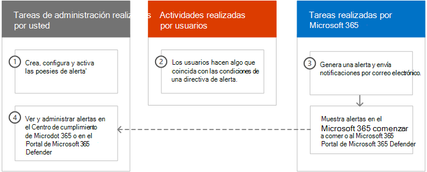
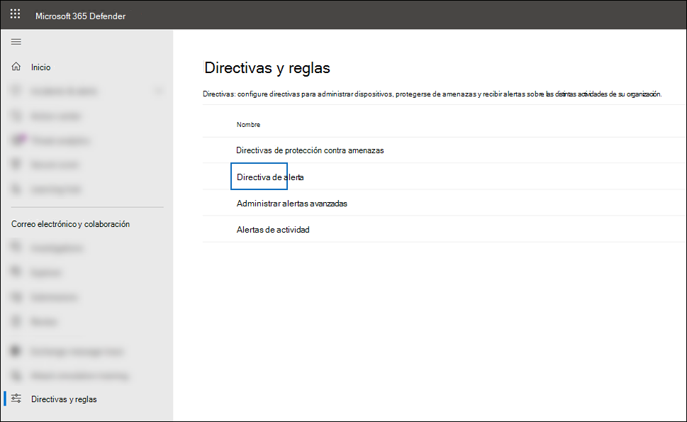

# <a name="alert-policies-in-microsoft-365"></a>Directivas de alerta en Microsoft 365

Puede usar directivas de alerta y el panel de alertas en el portal de cumplimiento Microsoft Purview o el portal de Microsoft 365 Defender para crear directivas de alerta y, a continuación, ver las alertas generadas cuando los usuarios realizan actividades que coinciden con las condiciones de una directiva de alerta. Hay varias directivas de alerta predeterminadas que le ayudan a supervisar actividades como la asignación de privilegios de administrador en Exchange Online, ataques de malware, campañas de phishing y niveles inusuales de eliminaciones de archivos y uso compartido externo.

> [!TIP]
> Vaya a la sección [Directivas de alerta predeterminadas](#default-alert-policies) de este artículo para obtener una lista y una descripción de las directivas de alerta disponibles.

Las directivas de alerta le permiten clasificar las alertas que desencadena una directiva, aplicar la directiva a todos los usuarios de la organización, establecer un umbral para cuándo se desencadena una alerta y decidir si se van a recibir notificaciones por correo electrónico cuando se desencadenan alertas. También hay una página **Alertas** en la que puede ver y filtrar alertas, establecer un estado de alerta para ayudarle a administrar las alertas y, a continuación, descartar alertas después de haber solucionado o solucionado el incidente subyacente.

> [!NOTE]
> Las directivas de alerta están disponibles para organizaciones con una suscripción Microsoft 365 Enterprise, Office 365 Enterprise o Office 365 US Government E1/F1/G1, E3/F3/G3 o E5/G5. La funcionalidad avanzada solo está disponible para organizaciones con una suscripción A5/G5, o para organizaciones que tienen una suscripción E1/F1/G1 o E3/F3/G3 y una Microsoft Defender para Office 365 P2 o una Cumplimiento de Microsoft 365 E5 o una suscripción de complemento E5 eDiscovery y Audit. En este tema se resalta la funcionalidad que requiere una suscripción de complemento o E5/G5. Tenga en cuenta también que las directivas de alerta están disponibles en Office 365 entornos gubernamentales de GCC, GCC High y DoD US.

## <a name="how-alert-policies-work"></a>Cómo funcionan las directivas de alerta

Esta es una introducción rápida al funcionamiento de las directivas de alertas y las alertas que se desencadenan cuando la actividad de usuario o administrador coincide con las condiciones de una directiva de alerta.



1. Un administrador de la organización crea, configura y activa una directiva de alertas mediante la página **Directivas de alerta** del portal de cumplimiento o del portal de Microsoft 365 Defender. También puede crear directivas de alerta mediante el cmdlet [New-ProtectionAlert](/powershell/module/exchange/new-protectionalert) en PowerShell de cumplimiento de seguridad &.

   Para crear directivas de alerta, debe tener asignado el rol Administrar alertas o el rol Configuración de la organización en el portal de cumplimiento o en el portal de Defender.

   > [!NOTE]
   > La directiva tarda hasta 24 horas en crear o actualizar una directiva de alertas antes de que la directiva pueda desencadenar alertas. Esto se debe a que la directiva debe sincronizarse con el motor de detección de alertas.

2. Un usuario realiza una actividad que coincide con las condiciones de una directiva de alerta. En el caso de ataques de malware, los mensajes de correo electrónico infectados enviados a los usuarios de su organización desencadenan una alerta.

3. Microsoft 365 genera una alerta que se muestra en la página **Alertas** en el portal de cumplimiento o en el portal de Defender. Además, si las notificaciones por correo electrónico están habilitadas para la directiva de alertas, Microsoft envía una notificación a una lista de destinatarios. Las alertas que un administrador u otros usuarios pueden ver que en la página Alertas están determinadas por los roles asignados al usuario. Para obtener más información, consulte [Permisos de RBAC necesarios para ver las alertas](#rbac-permissions-required-to-view-alerts).

4. Un administrador administra las alertas en el portal de cumplimiento Microsoft Purview. La administración de alertas consiste en asignar un estado de alerta para ayudar a realizar un seguimiento y administrar cualquier investigación.

## <a name="alert-policy-settings"></a>Configuración de la directiva de alerta

Una directiva de alerta consta de un conjunto de reglas y condiciones que definen la actividad de usuario o administrador que genera una alerta, una lista de usuarios que desencadenan la alerta si realizan la actividad y un umbral que define cuántas veces debe producirse la actividad antes de que se desencadene una alerta. También categoriza la directiva y le asigna un nivel de gravedad. Estas dos opciones de configuración le ayudan a administrar las directivas de alerta (y las alertas que se desencadenan cuando se coinciden las condiciones de directiva) porque puede filtrar esta configuración al administrar directivas y ver alertas en el portal de cumplimiento Microsoft Purview. Por ejemplo, puede ver alertas que coincidan con las condiciones de la misma categoría o ver alertas con el mismo nivel de gravedad.

Para ver y crear directivas de alertas:

### <a name="microsoft-purview-compliance-portal"></a>Portal de cumplimiento de Microsoft Purview.

Vaya al <a href="https://go.microsoft.com/fwlink/p/?linkid=2077149" target="_blank">portal de cumplimiento</a> y, a continuación, seleccione **Directivas** > **De alerta** > **de directivas**.


### <a name="microsoft-365-defender-portal"></a>Portal de Microsoft 365 Defender

Vaya al <a href="https://go.microsoft.com/fwlink/p/?linkid=2077139" target="_blank">portal de Microsoft 365 Defender</a> y, en **Correo electrónico & colaboración**, seleccione **Directivas & reglas** > **Directiva de alertas**. Como alternativa, puede ir directamente a <https://security.microsoft.com/alertpolicies>.



> [!NOTE]
> Debe tener asignado el rol Administrar alertas View-Only para ver las directivas de alerta en el portal de cumplimiento Microsoft Purview o en el portal de Microsoft 365 Defender. Debe tener asignado el rol Administrar alertas para crear y editar directivas de alertas. Para obtener más información vea [Permisos en el portal de cumplimiento de Microsoft Purview](microsoft-365-compliance-center-permissions.md).

Una directiva de alerta consta de las siguientes configuraciones y condiciones.

- **Actividad de seguimiento de la alerta**. Cree una directiva para realizar un seguimiento de una actividad o, en algunos casos, algunas actividades relacionadas, como compartir un archivo con un usuario externo, compartirlo, asignar permisos de acceso o crear un vínculo anónimo. Cuando un usuario realiza la actividad definida por la directiva, se desencadena una alerta en función de la configuración del umbral de alerta.

    > [!NOTE]
    > Las actividades que puede realizar dependen del Office 365 Enterprise de su organización o de Office 365 plan del Gobierno de EE. UU. En general, las actividades relacionadas con campañas de malware y ataques de phishing requieren una suscripción E5/G5 o una suscripción A1/F1/G1 o E3/F3/G3 con una suscripción de complemento [Defender para Office 365](../security/office-365-security/defender-for-office-365.md) Plan 2.

- **Condiciones de actividad**. Para la mayoría de las actividades, puede definir condiciones adicionales que se deben cumplir para desencadenar una alerta. Entre las condiciones comunes se incluyen las direcciones IP (para que se desencadene una alerta cuando el usuario realice la actividad en un equipo con una dirección IP específica o dentro de un intervalo de direcciones IP), si se desencadena una alerta si un usuario o usuarios específicos realizan esa actividad y si la actividad se realiza en un nombre de archivo o dirección URL específicos. También puede configurar una condición que desencadena una alerta cuando cualquier usuario de la organización realiza la actividad. Las condiciones disponibles dependen de la actividad seleccionada.

También puede definir etiquetas de usuario como condición de una directiva de alerta. Esto da como resultado las alertas desencadenadas por la directiva para incluir el contexto del usuario afectado. Puede usar etiquetas de usuario del sistema o etiquetas de usuario personalizadas. Para obtener más información, consulte [Etiquetas de usuario en Microsoft Defender para Office 365](/microsoft-365/security/office-365-security/user-tags).

- **Cuando se desencadena la alerta**. Puede configurar una configuración que defina la frecuencia con la que se puede producir una actividad antes de que se desencadene una alerta. Esto le permite configurar una directiva para generar una alerta cada vez que una actividad coincide con las condiciones de la directiva, cuando se supera un umbral determinado o cuando la aparición de la actividad que la alerta está realizando se vuelve inusual para su organización.

    

    Si selecciona la configuración en función de una actividad inusual, Microsoft establece un valor de línea base que define la frecuencia normal de la actividad seleccionada. El establecimiento de esta línea base tarda hasta siete días, durante los cuales no se generarán alertas. Una vez establecida la línea base, se desencadena una alerta cuando la frecuencia de la actividad a la que realiza el seguimiento la directiva de alerta supera en gran medida el valor de línea base. Para las actividades relacionadas con la auditoría (como las actividades de archivos y carpetas), puede establecer una línea base basada en un único usuario o en función de todos los usuarios de su organización; para las actividades relacionadas con malware, puede establecer una línea base basada en una sola familia de malware, un único destinatario o todos los mensajes de su organización.

    > [!NOTE]
    > La capacidad de configurar directivas de alerta en función de un umbral o en función de una actividad inusual requiere una suscripción E5/G5, o una suscripción E1/F1/G1 o E3/F3/G3 con una suscripción Microsoft Defender para Office 365 P2, Cumplimiento de Microsoft 365 E5 o complemento de eDiscovery y auditoría de Microsoft 365. Las organizaciones con una suscripción E1/F1/G1 y E3/F3/G3 solo pueden crear directivas de alerta donde se desencadena una alerta cada vez que se produce una actividad.

- **Categoría de alerta**. Para ayudar con el seguimiento y la administración de las alertas generadas por una directiva, puede asignar una de las siguientes categorías a una directiva.

  - Prevención de pérdida de datos

  - Administración del ciclo de vida de los datos

  - Flujo del correo

  - Permissions

  - Administración de amenazas

  - Otros

  Cuando se produce una actividad que coincide con las condiciones de la directiva de alertas, la alerta que se genera se etiqueta con la categoría definida en esta configuración. Esto le permite realizar un seguimiento y administrar las alertas que tienen la misma configuración de categoría en la página **Alertas** del portal de Microsoft Purview, ya que puede ordenar y filtrar alertas en función de la categoría.

- **Gravedad de la alerta**. De forma similar a la categoría de alerta, se asigna un atributo de gravedad (**Bajo**, **Medio**, **Alto** o **Informativo**) a las directivas de alerta. Al igual que la categoría de alerta, cuando se produce una actividad que coincide con las condiciones de la directiva de alerta, la alerta generada se etiqueta con el mismo nivel de gravedad que se establece para la directiva de alerta. De nuevo, esto le permite realizar un seguimiento y administrar las alertas que tienen la misma configuración de gravedad en la página **Alertas** . Por ejemplo, puede filtrar la lista de alertas para que solo se muestren las alertas con una gravedad **alta** .

    > [!TIP]
    > Al configurar una directiva de alertas, considere la posibilidad de asignar una gravedad mayor a las actividades que pueden dar lugar a consecuencias gravemente negativas, como la detección de malware después de la entrega a los usuarios, la visualización de datos confidenciales o clasificados, el uso compartido de datos con usuarios externos u otras actividades que pueden dar lugar a la pérdida de datos o a amenazas de seguridad. Esto puede ayudarle a priorizar las alertas y las acciones que realice para investigar y resolver las causas subyacentes.

- **Investigaciones automatizadas**. Algunas alertas desencadenarán investigaciones automatizadas para identificar posibles amenazas y riesgos que necesitan corrección o mitigación.  En la mayoría de los casos, estas alertas se desencadenan mediante la detección de correos electrónicos o actividades malintencionados, pero en algunos casos las alertas se desencadenan mediante acciones de administrador en el portal de seguridad.  Para obtener más información sobre las investigaciones automatizadas, consulte [Investigación y respuesta automatizadas (AIR) en Microsoft Defender para Office 365](../security/office-365-security/office-365-air.md).

- **Email notificaciones**. Puede configurar la directiva para que las notificaciones por correo electrónico se envíen (o no se envíen) a una lista de usuarios cuando se desencadene una alerta. También puede establecer un límite diario de notificaciones para que, una vez alcanzado el número máximo de notificaciones, no se envíen más notificaciones para la alerta durante ese día. Además de las notificaciones por correo electrónico, usted u otros administradores pueden ver las alertas desencadenadas por una directiva en la página **Alertas** . Considere la posibilidad de habilitar las notificaciones por correo electrónico para las directivas de alerta de una categoría específica o que tengan una configuración de gravedad más alta.

## <a name="default-alert-policies"></a>Directivas de alerta predeterminadas

Microsoft proporciona directivas de alertas integradas que ayudan a identificar el abuso de permisos de administrador de Exchange, la actividad de malware, las posibles amenazas externas e internas y los riesgos de administración del ciclo de vida de los datos. En la página **Directivas de alerta** , los nombres de estas directivas integradas están en negrita y el tipo de directiva se define como **Sistema**. Estas directivas están activadas de forma predeterminada. Puede desactivar estas directivas (o volver a activarlas), configurar una lista de destinatarios a los que enviar notificaciones por correo electrónico y establecer un límite diario de notificaciones. La otra configuración de estas directivas no se puede editar.

En la tabla siguiente se enumeran y describen las directivas de alerta predeterminadas disponibles y la categoría a la que se asigna cada directiva. La categoría se usa para determinar qué alertas puede ver un usuario en la página Alertas. Para obtener más información, consulte [Permisos de RBAC necesarios para ver las alertas](#rbac-permissions-required-to-view-alerts).

La tabla también indica el Office 365 Enterprise y Office 365 plan del Gobierno de EE. UU. necesario para cada uno de ellos. Algunas directivas de alerta predeterminadas están disponibles si su organización tiene la suscripción de complemento adecuada además de una suscripción E1/F1/G1 o E3/F3/G3.
 
| Directiva de alertas predeterminada | Descripción | Categoría | Investigación automatizada | Suscripción de empresa |
|:-----|:-----|:-----|:-----|:-----|
|**Se detectó un clic de dirección URL potencialmente malintencionado**|Genera una alerta cuando un usuario protegido por [vínculos seguros](/microsoft-365/security/office-365-security/safe-links) de su organización hace clic en un vínculo malintencionado. Esta alerta se genera cuando un usuario hace clic en un vínculo y este evento desencadena una identificación de cambio de veredicto de dirección URL Microsoft Defender para Office 365. Esta directiva de alerta tiene una configuración de gravedad **alta** para los clientes de Defender para Office 365 P2, E5 y G5. Esta alerta desencadena automáticamente la [investigación y la respuesta automatizadas en Office 365](/microsoft-365/security/office-365-security/office-365-air). Para obtener más información sobre los eventos que desencadenan esta alerta, consulte [Configuración de directivas de vínculos seguros](/microsoft-365/security/office-365-security/set-up-safe-links-policies).|Administración de amenazas|Sí|Suscripción del complemento E5/G5 o Defender para Office 365 P2|
|**Un usuario ha hecho clic en una dirección URL potencialmente malintencionada.**|Genera una alerta cuando un usuario protegido por [vínculos seguros](/microsoft-365/security/office-365-security/safe-links) de su organización hace clic en un vínculo malintencionado. Este evento se desencadena cuando el usuario hace clic en una dirección URL (que se identifica como malintencionada o pendiente de validación) e invalida la página de advertencia Vínculos seguros (en función de la directiva de vínculos seguros de Microsoft 365 para empresas de su organización) para continuar con la página o el contenido hospedados en la dirección URL. Esta directiva de alerta tiene una configuración de gravedad **alta** . Para los clientes de Defender para Office 365 P2, E5 y G5, esta alerta desencadena automáticamente la [investigación y la respuesta automatizadas en Office 365](/microsoft-365/security/office-365-security/office-365-air). Para obtener más información sobre los eventos que desencadenan esta alerta, consulte [Configuración de directivas de vínculos seguros](/microsoft-365/security/office-365-security/set-up-safe-links-policies).|Administración de amenazas|Sí|Suscripción del complemento E5/G5 o Defender para Office 365 P2|
|**Resultado de envío de administrador completado**|Genera una alerta cuando un [envío de Administración](../security/office-365-security/admin-submission.md) completa el análisis de la entidad enviada. Una alerta se desencadenará cada vez que se represente un resultado de nuevo análisis a partir de un envío de Administración. Estas alertas están pensadas para recordarle que [revise los resultados de envíos anteriores](https://compliance.microsoft.com/reportsubmission), envíe mensajes notificados por el usuario para obtener los veredictos de revisión y reescaneo más recientes de directivas y le ayuden a determinar si las directivas de filtrado de su organización están teniendo el impacto previsto. Esta directiva tiene una configuración de gravedad **informativa** .|Administración de amenazas|No|E1/F1, E3/F3 o E5|
|**Administración investigación manual desencadenada del correo electrónico**|Genera una alerta cuando un administrador desencadena la investigación manual de un correo electrónico desde el Explorador de amenazas. Para obtener más información, vea [Ejemplo: Un administrador de seguridad desencadena una investigación desde el Explorador de amenazas](../security/office-365-security/automated-investigation-response-office.md#example-a-security-administrator-triggers-an-investigation-from-threat-explorer). Esta alerta notifica a la organización que se inició la investigación. La alerta proporciona información sobre quién la desencadenó e incluye un vínculo a la investigación. Esta directiva tiene una configuración de gravedad **informativa** .|Administración de amenazas|Sí|Suscripción del complemento E5/G5 o Microsoft Defender para Office 365 P2|
|**Administración investigación de riesgo de usuario desencadenada**|Genera una alerta cuando un administrador desencadena la investigación de riesgo manual del usuario de un remitente de correo electrónico o de un destinatario desde el Explorador de amenazas. Para obtener más información, vea [Ejemplo: Un administrador de seguridad desencadena una investigación desde el Explorador de amenazas](../security/office-365-security/automated-investigation-response-office.md#example-a-security-administrator-triggers-an-investigation-from-threat-explorer), que muestra la activación manual relacionada de una investigación en un correo electrónico. Esta alerta notifica a su organización que se inició la investigación de riesgo del usuario. La alerta proporciona información sobre quién la desencadenó e incluye un vínculo a la investigación. Esta directiva tiene una configuración de gravedad **media** .|Administración de amenazas|Sí|Suscripción del complemento E5/G5 o Microsoft Defender para Office 365 P2|
|**Creación de una regla de reenvío o redirección**|Genera una alerta cuando alguien de su organización crea una regla de bandeja de entrada para su buzón de correo que reenvía o redirige mensajes a otra cuenta de correo electrónico. Esta directiva solo realiza un seguimiento de las reglas de bandeja de entrada que se crean mediante Outlook en la Web (anteriormente conocidas como Outlook Web App) o Exchange Online PowerShell. Esta directiva tiene una configuración de gravedad **informativa** . Para obtener más información sobre el uso de reglas de bandeja de entrada para reenviar y redirigir el correo electrónico en Outlook en la Web, vea [Usar reglas en Outlook en la Web para reenviar automáticamente mensajes a otra cuenta](https://support.office.com/article/1433e3a0-7fb0-4999-b536-50e05cb67fed).|Administración de amenazas|No|E1/F1/G1, E3/F3/G3 o E5/G5|
|**Búsqueda de eDiscovery iniciada o exportada**|Genera una alerta cuando alguien usa la herramienta de búsqueda de contenido en el portal de Microsoft Purview. Cuando se realizan las siguientes actividades de búsqueda de contenido, se desencadena una alerta: <br><br> <li> Se inicia una búsqueda de contenido <li> Los resultados de una búsqueda de contenido se exportan <li> Se exporta un informe de búsqueda de contenido <br><br> Las alertas también se desencadenan cuando las actividades de búsqueda de contenido anteriores se realizan en asociación con un caso de exhibición de documentos electrónicos. Esta directiva tiene una configuración de gravedad **informativa** . Para obtener más información sobre las actividades de búsqueda de contenido, vea [Buscar actividades de exhibición de documentos electrónicos en el registro de auditoría](search-for-ediscovery-activities-in-the-audit-log.md#ediscovery-activities).|Administración de amenazas|No|E1/F1/G1, E3/F3/G3 o E5/G5|
|**Elevación del privilegio de administrador de Exchange**|Genera una alerta cuando a alguien se le asignan permisos administrativos en la organización Exchange Online. Por ejemplo, cuando se agrega un usuario al grupo de roles Administración de la organización en Exchange Online. Esta directiva tiene una configuración de gravedad **baja** .|Permisos|No|E1/F1/G1, E3/F3/G3 o E5/G5|
|**Mensajes de correo electrónico que contienen archivos malintencionados quitados después de la entrega**|Genera una alerta cuando los mensajes que contienen un archivo malintencionado se entregan a los buzones de su organización. Si se produce este evento, Microsoft quita los mensajes infectados de Exchange Online buzones mediante [la purga automática de cero horas](../security/office-365-security/zero-hour-auto-purge.md). Esta directiva tiene una configuración de gravedad **informativa** y desencadena automáticamente la [investigación y la respuesta automatizadas en Office 365](../security/office-365-security/office-365-air.md). Para obtener más información sobre esta nueva directiva, consulte [Nuevas directivas de alerta en Microsoft Defender para Office 365](new-defender-alert-policies.md).|Administración de amenazas|Sí|Suscripción del complemento E5/G5 o Microsoft Defender para Office 365 P2|
|**Mensajes de correo electrónico que contienen direcciones URL malintencionadas quitados después de la entrega**|Genera una alerta cuando los mensajes que contienen una dirección URL malintencionada se entregan a los buzones de su organización. Si se produce este evento, Microsoft quita los mensajes infectados de Exchange Online buzones mediante [la purga automática de cero horas](../security/office-365-security/zero-hour-auto-purge.md). Esta directiva tiene una configuración de gravedad **informativa** y desencadena automáticamente la [investigación y la respuesta automatizadas en Office 365](../security/office-365-security/office-365-air.md). Para obtener más información sobre esta nueva directiva, consulte [Nuevas directivas de alerta en Microsoft Defender para Office 365](new-defender-alert-policies.md).|Administración de amenazas|Sí|Suscripción del complemento E5/G5 o Defender para Office 365 P2|
|**Email mensajes de una campaña quitados después de la entrega**|Genera una alerta cuando los mensajes asociados a una [campaña](../security/office-365-security/campaigns.md) se entregan a los buzones de su organización. Si se produce este evento, Microsoft quita los mensajes infectados de Exchange Online buzones mediante [la purga automática de cero horas](../security/office-365-security/zero-hour-auto-purge.md). Esta directiva tiene una configuración de gravedad **informativa** y desencadena automáticamente la [investigación y la respuesta automatizadas en Office 365](../security/office-365-security/office-365-air.md). Para obtener más información sobre esta nueva directiva, consulte [Nuevas directivas de alerta en Microsoft Defender para Office 365](new-defender-alert-policies.md).|Administración de amenazas|Sí|Suscripción del complemento E5/G5 o Defender para Office 365 P2|
|**Mensajes de correo electrónico quitados después de la entrega**|Genera una alerta cuando los mensajes malintencionados que no contienen una entidad malintencionada (url o archivo) o asociados a una campaña se entregan a los buzones de su organización. Si se produce este evento, Microsoft quita los mensajes infectados de Exchange Online buzones mediante [la purga automática de cero horas](../security/office-365-security/zero-hour-auto-purge.md). Esta directiva tiene una configuración de gravedad **informativa** y desencadena automáticamente la [investigación y la respuesta automatizadas en Office 365](../security/office-365-security/office-365-air.md). Para obtener más información sobre esta nueva directiva, consulte [Nuevas directivas de alerta en Microsoft Defender para Office 365](new-defender-alert-policies.md).|Administración de amenazas|Sí|Suscripción del complemento E5/G5 o Defender para Office 365 P2|
|**Mensajes que contienen entidad malintencionada que no se quitan después de la entrega**|Genera una alerta cuando cualquier mensaje que contiene contenido malintencionado (archivo, dirección URL, campaña, ninguna entidad) se entrega a los buzones de correo de la organización. Si se produce este evento, Microsoft intentó quitar los mensajes infectados de Exchange Online buzones mediante [la purga automática de cero horas](../security/office-365-security/zero-hour-auto-purge.md), pero el mensaje no se quitó debido a un error. Se recomienda una investigación adicional. Esta directiva tiene una configuración de gravedad **media** y desencadena automáticamente la [investigación y la respuesta automatizadas en Office 365](../security/office-365-security/office-365-air.md).|Administración de amenazas|Sí|Suscripción del complemento E5/G5 o Defender para Office 365 P2|
|**Correo electrónico notificado por el usuario como malware o cebo**|Genera una alerta cuando los usuarios de su organización notifican mensajes como correo electrónico de suplantación de identidad mediante el complemento Mensaje de informe. Esta directiva tiene una configuración de gravedad **baja** . Para obtener más información sobre este complemento, vea [Usar el complemento de mensaje](https://support.office.com/article/b5caa9f1-cdf3-4443-af8c-ff724ea719d2) de informe. Para los clientes de Defender para Office 365 P2, E5 y G5, esta alerta desencadena automáticamente la [investigación y la respuesta automatizadas en Office 365](../security/office-365-security/office-365-air.md).|Administración de amenazas|Sí|E1/F1/G1, E3/F3/G3 o E5/G5|
|**Email límite de envío superado**|Genera una alerta cuando alguien de su organización ha enviado más correo del permitido por la directiva de correo no deseado saliente. Esto suele ser una indicación de que el usuario envía demasiado correo electrónico o que la cuenta puede estar en peligro. Esta directiva tiene una configuración de gravedad **media** . Si recibe una alerta generada por esta directiva de alerta, es una buena idea [comprobar si la cuenta de usuario está en peligro](../security/office-365-security/responding-to-a-compromised-email-account.md).|Administración de amenazas|No|E1/F1/G1, E3/F3/G3 o E5/G5|
|**Formulario bloqueado debido a un posible intento de suplantación de identidad (phishing)**|Genera una alerta cuando a alguien de su organización se le ha restringido el uso compartido de formularios y la recopilación de respuestas mediante Microsoft Forms debido al comportamiento de intento de suplantación de identidad repetido detectado. Esta directiva tiene una configuración **de gravedad alta** .|Administración de amenazas|No|E1, E3/F3 o E5|
|**Formulario marcado y confirmado como suplantación de identidad (phishing)**|Genera una alerta cuando un formulario creado en Microsoft Forms desde dentro de la organización se ha identificado como posible suplantación de identidad (phishing) mediante el uso indebido de informes y Microsoft lo confirma como suplantación de identidad (phishing). Esta directiva tiene una configuración de gravedad **alta** .|Administración de amenazas|No|E1, E3/F3 o E5|
|**Los mensajes se han retrasado**|Genera una alerta cuando Microsoft no puede entregar mensajes de correo electrónico a la organización local o a un servidor asociado mediante un conector. Cuando esto sucede, el mensaje se pone en cola en Office 365. Esta alerta se desencadena cuando hay 2000 mensajes o más que se han puesto en cola durante más de una hora. Esta directiva tiene una configuración de gravedad **alta** .|Flujo del correo|No|E1/F1/G1, E3/F3/G3 o E5/G5|
|**Campaña de malware detectada después de la entrega**|Genera una alerta cuando se entrega un número inusualmente grande de mensajes que contienen malware a los buzones de su organización. Si se produce este evento, Microsoft quita los mensajes infectados de Exchange Online buzones. Esta directiva tiene una configuración de gravedad **alta** .|Administración de amenazas|No|Suscripción del complemento E5/G5 o Microsoft Defender para Office 365 P2|
|**Campaña de malware detectada y bloqueada**|Genera una alerta cuando alguien ha intentado enviar un número inusualmente grande de mensajes de correo electrónico que contienen un determinado tipo de malware a los usuarios de su organización. Si se produce este evento, Microsoft bloquea los mensajes infectados y no se entregan a los buzones. Esta directiva tiene una configuración de gravedad **baja** .|Administración de amenazas|No|Suscripción del complemento E5/G5 o Defender para Office 365 P2|
|**Campaña de malware detectada en SharePoint y OneDrive**|Genera una alerta cuando se detecta un volumen inusualmente alto de malware o virus en archivos ubicados en sitios de SharePoint o cuentas de OneDrive de su organización. Esta directiva tiene una configuración de gravedad **alta** .|Administración de amenazas|No|Suscripción del complemento E5/G5 o Defender para Office 365 P2|
|**Malware no zapped porque ZAP está deshabilitado**| Genera una alerta cuando Microsoft detecta la entrega de un mensaje de malware a un buzón porque Zero-Hour purga automática para mensajes phish está deshabilitada. Esta directiva tiene una configuración de gravedad **informativa** . |Administración de amenazas|No|Suscripción del complemento E5/G5 o Defender para Office 365 P2|
|**Phish entregado debido a una invalidación de ETR**|Genera una alerta cuando Microsoft detecta una regla de transporte de Exchange (ETR) que permite la entrega de un mensaje de suplantación de identidad de alta confianza a un buzón de correo. Esta directiva tiene una configuración de gravedad **informativa** . Para obtener más información sobre las reglas de transporte de Exchange (reglas de flujo de correo), vea [Reglas de flujo de correo (reglas de transporte) en Exchange Online](/exchange/security-and-compliance/mail-flow-rules/mail-flow-rules).|Administración de amenazas|No|E1/F1/G1, E3/F3/G3 o E5/G5|
|**Phish entregado debido a una directiva de ip permitida**|Genera una alerta cuando Microsoft detecta una directiva de ip permitida que permite la entrega de un mensaje de suplantación de identidad de alta confianza a un buzón de correo. Esta directiva tiene una configuración de gravedad **informativa** . Para obtener más información sobre la directiva de permitir IP (filtrado de conexiones), vea [Configurar la directiva de filtro de conexión predeterminada: Office 365](../security/office-365-security/configure-the-connection-filter-policy.md).|Administración de amenazas|No|E1/F1/G1, E3/F3/G3 o E5/G5|
|**Phish no zapped porque ZAP está deshabilitado**| Genera una alerta cuando Microsoft detecta la entrega de un mensaje de suplantación de identidad de alta confianza a un buzón de correo porque Zero-Hour purga automática para mensajes phish está deshabilitada. Esta directiva tiene una configuración de gravedad **informativa** .|Administración de amenazas|No|Suscripción del complemento E5/G5 o Defender para Office 365 P2|
|**Phish entregado debido a la invalidación de inquilino o usuario**<sup>1</sup>|Genera una alerta cuando Microsoft detecta una invalidación de usuario o administrador que permite la entrega de un mensaje de suplantación de identidad (phishing) a un buzón de correo. Algunos ejemplos de invalidaciones son una regla de flujo de correo o bandeja de entrada que permite mensajes de un remitente o dominio específico, o una directiva antispam que permite mensajes de remitentes o dominios específicos. Esta directiva tiene una configuración de gravedad **alta** .|Administración de amenazas|No|Suscripción del complemento E5/G5 o Defender para Office 365 P2|
|**Actividad de reenvío de correo electrónico sospechoso**|Genera una alerta cuando alguien de su organización tiene correo electrónico autoforwarded a una cuenta externa sospechosa. Se trata de una advertencia temprana para el comportamiento que puede indicar que la cuenta está en peligro, pero no lo suficientemente grave como para restringir al usuario. Esta directiva tiene una configuración de gravedad **alta** . Aunque es poco frecuente, una alerta generada por esta directiva puede ser una anomalía. Es una buena idea [comprobar si la cuenta de usuario está en peligro](../security/office-365-security/responding-to-a-compromised-email-account.md).|Administración de amenazas|No|E1/F1/G1, E3/F3/G3 o E5/G5|
|**Patrones de envío de correo electrónico sospechosos detectados**|Genera una alerta cuando alguien de su organización ha enviado un correo electrónico sospechoso y corre el riesgo de que se le restrinja el envío de correo electrónico. Se trata de una advertencia temprana para el comportamiento que puede indicar que la cuenta está en peligro, pero no lo suficientemente grave como para restringir al usuario. Esta directiva tiene una configuración de gravedad **media** . Aunque es poco frecuente, una alerta generada por esta directiva puede ser una anomalía. Sin embargo, es una buena idea [comprobar si la cuenta de usuario está en peligro](../security/office-365-security/responding-to-a-compromised-email-account.md).|Administración de amenazas|Sí|E1/F1/G1, E3/F3/G3 o E5/G5  |
|**La entrada de lista de permitidos o bloqueados de inquilinos está a punto de expirar**|Genera una alerta cuando se va a quitar una entrada de lista de permitidos o bloqueados de inquilinos. Este evento se desencadena tres días antes de la fecha de expiración, que se basa en el momento en que se creó o actualizó por última vez la entrada. Esta directiva de alerta tiene una configuración de gravedad **informativa** . Se trata de informar a los administradores de los próximos cambios en los filtros, ya que la opción permitir o bloquear podría desaparecer. En el caso de los bloques, puede ampliar la fecha de expiración para mantener el bloque en su lugar. Para permitir, debe volver a enviar el elemento para que nuestros analistas puedan echar otro vistazo. Sin embargo, si el permiso ya se ha calificado como falso positivo, la entrada solo expirará cuando se hayan actualizado los filtros del sistema para permitir la entrada de forma natural. Para obtener más información sobre los eventos que desencadenan esta alerta, consulte [Administrar la lista de permitidos o bloqueados de inquilinos](../security/office-365-security/tenant-allow-block-list.md).|Administración de amenazas|No|Suscripción del complemento E5/G5 o Defender para Office 365 P2|
|**Inquilino restringido al envío de correo electrónico**|Genera una alerta cuando la mayor parte del tráfico de correo electrónico de su organización se ha detectado como sospechoso y Microsoft ha restringido el envío de correo electrónico a su organización. Investigue las cuentas de usuario y administrador potencialmente en peligro, los nuevos conectores o las retransmisiones abiertas y, a continuación, póngase en contacto con Soporte técnico de Microsoft para desbloquear la organización. Esta directiva tiene una configuración de gravedad **alta** . Para obtener más información sobre por qué se bloquean las organizaciones, consulte [Corrección de problemas de entrega de correo electrónico para el código de error 5.7.7xx en Exchange Online](/Exchange/mail-flow-best-practices/non-delivery-reports-in-exchange-online/fix-error-code-5-7-700-through-5-7-750).|Administración de amenazas|No|E1/F1/G1, E3/F3/G3 o E5/G5|
|**Inquilino restringido al envío de correo electrónico no aprovisionado**|Genera una alerta cuando se envía demasiado correo electrónico desde dominios no registrados (también conocidos como dominios *no aprovisionados* ). Office 365 permite una cantidad razonable de correo electrónico de dominios no registrados, pero debe configurar todos los dominios que use para enviar correo electrónico como un dominio aceptado. Esta alerta indica que todos los usuarios de la organización ya no pueden enviar correo electrónico. Esta directiva tiene una configuración de gravedad **alta** . Para obtener más información sobre por qué se bloquean las organizaciones, consulte [Corrección de problemas de entrega de correo electrónico para el código de error 5.7.7xx en Exchange Online](/Exchange/mail-flow-best-practices/non-delivery-reports-in-exchange-online/fix-error-code-5-7-700-through-5-7-750).|Administración de amenazas|No|E1/F1/G1, E3/F3/G3 o E5/G5|
|**Actividad de archivo de usuario externo inusual**|Genera una alerta cuando los usuarios fuera de la organización realizan un número inusualmente grande de actividades en archivos de SharePoint o OneDrive. Esto incluye actividades como el acceso a archivos, la descarga de archivos y la eliminación de archivos. Esta directiva tiene una configuración de gravedad **alta** .|Administración del ciclo de vida de los datos|No|E5/G5, Microsoft Defender para Office 365 P2 o Microsoft 365 E5 suscripción de complemento|
|**Volumen inusual de uso compartido de archivos externos**|Genera una alerta cuando un número inusualmente grande de archivos en SharePoint o OneDrive se comparten con usuarios fuera de la organización. Esta directiva tiene una configuración de gravedad **media** .|Administración del ciclo de vida de los datos|No|E5/G5, Defender para Office 365 P2 o Microsoft 365 E5 suscripción de complemento|
|**Volumen inusual de eliminación de archivos**|Genera una alerta cuando se elimina un número inusualmente grande de archivos en SharePoint o OneDrive en un breve período de tiempo. Esta directiva tiene una configuración de gravedad **media** .|Administración del ciclo de vida de los datos|No|E5/G5, Defender para Office 365 P2 o Microsoft 365 E5 suscripción de complemento|
|**Aumento inusual en el correo electrónico notificado como cebo**|Genera una alerta cuando hay un aumento significativo en el número de personas de su organización mediante el complemento Mensaje de informe en Outlook para informar de mensajes como correo de suplantación de identidad. Esta directiva tiene una configuración de gravedad **media** . Para obtener más información sobre este complemento, vea [Usar el complemento de mensaje](https://support.office.com/article/b5caa9f1-cdf3-4443-af8c-ff724ea719d2) de informe.|Administración de amenazas|No|Suscripción del complemento E5/G5 o Defender para Office 365 P2|
|**Phish de suplantación de usuario entregado a la bandeja de entrada/carpeta**<sup>1,2</sup><sup></sup>|Genera una alerta cuando Microsoft detecta que un administrador o una invalidación de usuario ha permitido la entrega de un mensaje de suplantación de identidad de usuario a la bandeja de entrada (u otra carpeta accesible por el usuario) de un buzón. Algunos ejemplos de invalidaciones son una regla de flujo de correo o bandeja de entrada que permite mensajes de un remitente o dominio específico, o una directiva antispam que permite mensajes de remitentes o dominios específicos. Esta directiva tiene una configuración de gravedad **media** .|Administración de amenazas|No|Suscripción del complemento E5/G5 o Defender para Office 365 P2|
|**Usuario solicitado para liberar un mensaje en cuarentena**|Genera una alerta cuando un usuario solicita la liberación de un mensaje en cuarentena. Para solicitar la liberación de mensajes en cuarentena, se requiere el permiso **Permitir a los destinatarios solicitar que un mensaje se libere de la cuarentena** (_PermissionToRequestRelease_) en la directiva de cuarentena (por ejemplo, desde el grupo permisos preestablecidos **de acceso limitado** ). Para obtener más información, vea [Permitir que los destinatarios soliciten que se libere un mensaje del permiso de cuarentena](../security/office-365-security/quarantine-policies.md#allow-recipients-to-request-a-message-to-be-released-from-quarantine-permission). Esta directiva tiene una configuración de gravedad **informativa** .|Administración de amenazas|No| Microsoft Business Basic, Microsoft Business Standard, Microsoft Business Premium, E1/F1/G1, E3/F3/G3 o E5/G5|
|**Usuario restringido al envío de correo electrónico**|Genera una alerta cuando a alguien de su organización se le restringe el envío de correo saliente. Esto suele producirse cuando una cuenta está en peligro y el usuario aparece en la página **Usuarios restringidos** del portal de cumplimiento. (Para acceder a esta página, vaya a **Administración de amenazas > Revisar > Usuarios restringidos**). Esta directiva tiene una configuración de gravedad **alta** . Para obtener más información sobre los usuarios restringidos, consulte [Eliminación de un usuario, dominio o dirección IP de una lista de bloqueos después de enviar correo electrónico no deseado](/office365/securitycompliance/removing-user-from-restricted-users-portal-after-spam).|Administración de amenazas|Sí|E1/F1/G1, E3/F3/G3 o E5/G5|
|**El usuario no puede compartir formularios ni recopilar respuestas**|Genera una alerta cuando a alguien de su organización se le ha restringido el uso compartido de formularios y la recopilación de respuestas mediante Microsoft Forms debido al comportamiento de intento de suplantación de identidad repetido detectado. Esta directiva tiene una configuración de gravedad **alta** .|Administración de amenazas|No|E1, E3/F3 o E5|

> [!NOTE]
> <sup>1</sup> Hemos quitado temporalmente esta directiva de alerta predeterminada en función de los comentarios de los clientes. Estamos trabajando para mejorarlo y lo reemplazaremos por una nueva versión en un futuro próximo. Hasta entonces, puede crear una directiva de alertas personalizada para reemplazar esta funcionalidad mediante la siguiente configuración: <ul><li>La actividad es el correo electrónico de Phish detectado en el momento de la entrega</li> <li>El correo no es ZAP'd</li> <li>La dirección del correo es Entrante</li> <li>El estado de entrega del correo es Entregado</li> <li>La tecnología de detección es retención de direcciones URL malintencionadas, detonación de direcciones URL, filtro de phish avanzado, filtro de phish general, suplantación de dominio, suplantación de usuario y suplantación de marca</li></ul> Para obtener más información sobre la suplantación de identidad (phishing) en Office 365, consulte [Configuración de directivas contra suplantación de identidad (phishing) y contra suplantación de identidad (phishing).](../security/office-365-security/set-up-anti-phishing-policies.md)<br/><br/><sup>2</sup> Para volver a crear esta directiva de alertas, siga las instrucciones de la nota al pie anterior, pero elija Suplantación de usuario como la única tecnología de detección.

La actividad inusual supervisada por algunas de las directivas integradas se basa en el mismo proceso que la configuración del umbral de alerta que se describió anteriormente. Microsoft establece un valor de línea base que define la frecuencia normal para la actividad "habitual". A continuación, las alertas se desencadenan cuando la frecuencia de las actividades a las que realiza un seguimiento la directiva de alertas integrada supera considerablemente el valor de línea base.

<a name="viewing-alerts"></a>

## <a name="view-alerts"></a>Ver alertas

Cuando una actividad realizada por los usuarios de la organización coincide con la configuración de una directiva de alertas, se genera una alerta y se muestra en la página **Alertas** del portal de Microsoft Purview o del portal de Defender. En función de la configuración de una directiva de alerta, también se envía una notificación por correo electrónico a una lista de usuarios especificados cuando se desencadena una alerta. Para cada alerta, el panel de la página **Alertas** muestra el nombre de la directiva de alerta correspondiente, la gravedad y la categoría de la alerta (definida en la directiva de alerta) y el número de veces que se ha producido una actividad que ha provocado la generación de la alerta. Este valor se basa en la configuración de umbral de la directiva de alerta. El panel también muestra el estado de cada alerta. Para obtener más información sobre el uso de la propiedad status para administrar alertas, consulte [Administración de alertas](#manage-alerts).

Para ver las alertas:

### <a name="microsoft-purview-compliance-portal"></a>Portal de cumplimiento de Microsoft Purview.

 Vaya a y, a <https://compliance.microsoft.com> continuación, seleccione **Alertas**. O puede ir directamente a <https://compliance.microsoft.com/compliancealerts>.


### <a name="microsoft-365-defender-portal"></a>Portal de Microsoft 365 Defender

Vaya a <a href="https://go.microsoft.com/fwlink/p/?linkid=2077139" target="_blank">Microsoft 365 Defender portal</a> y, a continuación, seleccione **Incidentes & alertas** > **alertas**. O puede ir directamente a <https://security.microsoft.com/alerts>.


Puede usar los filtros siguientes para ver un subconjunto de todas las alertas en la página **Alertas** .

- **Estado.** Use este filtro para mostrar las alertas a las que se les asigna un estado determinado. El estado predeterminado es **Activo**. Usted u otros administradores pueden cambiar el valor de estado.

- **Política.** Use este filtro para mostrar alertas que coincidan con la configuración de una o varias directivas de alertas. O bien, puede mostrar todas las alertas de todas las directivas de alerta.

- **Intervalo de tiempo.** Use este filtro para mostrar las alertas generadas dentro de un intervalo de fecha y hora específico.

- **Severidad.** Use este filtro para mostrar las alertas a las que se les asigna una gravedad específica.

- **Categoría.** Use este filtro para mostrar alertas de una o varias categorías de alertas.

- **Etiquetas.** Use este filtro para mostrar alertas de una o varias etiquetas de usuario. Las etiquetas se reflejan en función de los buzones o usuarios etiquetados que aparecen en las alertas. Consulte [Etiquetas de usuario en ATP de Office 356](../security/office-365-security/user-tags.md) para obtener más información.

- **Fuente.** Use este filtro para mostrar las alertas desencadenadas por directivas de alerta en el portal de Microsoft Purview o alertas desencadenadas por directivas de Microsoft Defender for Cloud Apps, o ambas. Para obtener más información sobre las alertas de Defender para Cloud App Security, consulte [Visualización de alertas de Defender for Cloud Apps](#viewing-cloud-app-security-alerts).

> [!IMPORTANT]
> El filtrado y ordenación por etiquetas de usuario está actualmente en versión preliminar pública.
> Puede modificarse sustancialmente antes de su lanzamiento comercial. Microsoft no ofrece ninguna garantía, expresa o implícita, con respecto a la información proporcionada al respecto.

## <a name="alert-aggregation"></a>Agregación de alertas

Cuando se producen varios eventos que coinciden con las condiciones de una directiva de alertas con un breve período de tiempo, se agregan a una alerta existente mediante un proceso denominado *agregación de alertas*. Cuando un evento desencadena una alerta, la alerta se genera y se muestra en la página **Alertas** y se envía una notificación. Si el mismo evento se produce dentro del intervalo de agregación, Microsoft 365 agrega detalles sobre el nuevo evento a la alerta existente en lugar de desencadenar una nueva alerta. El objetivo de la agregación de alertas es ayudar a reducir la "fatiga" de la alerta y permitirle centrarse y tomar medidas en menos alertas para el mismo evento.

La longitud del intervalo de agregación depende de la Office 365 o la suscripción de Microsoft 365.

|Suscripción |Intervalo de agregación|
|:---------|:---------:|
|Office 365 o Microsoft 365 E5/G5|1 minuto|
|Defender para Office 365 Plan 2 |1 minuto|
|Complemento de cumplimiento E5 o complemento de detección y auditoría E5|1 minuto|
|Office 365 o Microsoft 365 E1/F1/G1 o E3/F3/G3|15 minutos|
|Defender para Office 365 Plan 1 o Exchange Online Protection|15 minutos|

Cuando se producen eventos que coinciden con la misma directiva de alertas dentro del intervalo de agregación, se agregan detalles sobre el evento posterior a la alerta original. Para todos los eventos, se muestra información sobre los eventos agregados en el campo de detalles y el número de veces que se produjo un evento con el intervalo de agregación en el campo de recuento de actividad o aciertos. Para ver más información sobre todas las instancias de eventos agregados, consulte la lista de actividades.

En la captura de pantalla siguiente se muestra una alerta con cuatro eventos agregados. La lista de actividades contiene información sobre los cuatro mensajes de correo electrónico relevantes para la alerta.


Tenga en cuenta lo siguiente sobre la agregación de alertas:

- Las alertas desencadenadas por el **clic de dirección URL potencialmente malintencionada se detectaron** que la [directiva de alertas predeterminada](#default-alert-policies) no se agrega. Esto se debe a que las alertas desencadenadas por esta directiva son únicas para cada usuario y mensaje de correo electrónico.

- En este momento, la propiedad de alerta **Número de aciertos** no indica el número de eventos agregados para todas las directivas de alerta. Para las alertas desencadenadas por estas directivas de alerta, puede ver los eventos agregados haciendo clic en **Ver lista de mensajes** o **Ver actividad** en la alerta. Estamos trabajando para que el número de eventos agregados enumerados en la propiedad de alerta **número de aciertos** esté disponible para todas las directivas de alerta.

## <a name="rbac-permissions-required-to-view-alerts"></a>Permisos de RBAC necesarios para ver alertas

Los permisos de Access Control basado en rol (RBAC) asignados a los usuarios de su organización determinan qué alertas puede ver un usuario en la página **Alertas**. ¿Cómo se logra esto? Los roles de administración asignados a los usuarios (en función de su pertenencia a grupos de roles en el portal de cumplimiento o en el portal de Microsoft 365 Defender) determinan qué categorías de alerta puede ver un usuario en la página **Alertas**. Estos son algunos ejemplos:

- Los miembros del grupo de roles Administración de registros solo pueden ver las alertas generadas por las directivas de alertas a las que se asigna la categoría **Administración del ciclo de vida de** datos.

- Los miembros del grupo de roles Administrador de cumplimiento no pueden ver las alertas generadas por las directivas de alertas a las que se asigna la categoría **Administración de amenazas** .

- Los miembros del grupo de rol Administrador de exhibición de documentos electrónicos no pueden ver ninguna alerta porque ninguno de los roles asignados proporciona permiso para ver las alertas de cualquier categoría de alerta.

Este diseño (basado en permisos de RBAC) le permite determinar qué alertas pueden ver (y administrar) los usuarios en roles de trabajo específicos de su organización.

En la tabla siguiente se enumeran los roles necesarios para ver las alertas de las seis categorías de alertas diferentes. En la primera columna de las tablas se enumeran todos los roles del portal de cumplimiento o del portal de Microsoft 365 Defender.  Una marca de verificación indica que un usuario al que se asigna ese rol puede ver las alertas de la categoría de alerta correspondiente que aparece en la fila superior.

Para ver a qué categoría se asigna una directiva de alerta predeterminada, consulte la tabla en [Directivas de alertas predeterminadas](#default-alert-policies).

|Rol|Administración del ciclo de vida de los datos|Prevención de pérdida de datos|Flujo del correo|Permissions|Administración de amenazas|Otros|
|:---------|:---------:|:---------:|:---------:|:---------:|:---------:|:---------:|
|Registros de auditoría|||||||
|Administración de casos|||||||
|Administrador de cumplimiento|||||||
|Búsqueda de cumplimiento|||||||
|Administración de dispositivos|||||||
|Administración de eliminación|||||||
|Administración de cumplimiento de DLP|||||||
|Export|||||||
|Hold|||||||
|Analista de Information Protection|||||||
|Investigador de protección de información|||||||
|Administrar alertas|||||||
|Configuración de la organización|||||||
|Preview|||||||
|Administración de registros|||||||
|Administración de retención|||||||
|Revisar|||||||
|Descifrado de RMS|||||||
|Administración de roles|||||||
|Buscar y purgar|||||||
|Administrador de seguridad|||||||
|Lector de seguridad||||||
|Vista de Service Assurance|||||||
|Administrador de revisión de supervisión|||||||
|Registros de auditoría de solo vista|||||||
|View-Only Administración de dispositivos|||||||
|View-Only administración de cumplimiento de DLP|||||||
|View-Only Administrar alertas|||||||
|Destinatarios con permiso de vista|||||||
|Administración de registros de View-Only|||||||
|Administración de retención de View-Only|||||||

> [!TIP]
> Para ver los roles asignados a cada uno de los grupos de roles predeterminados, ejecute los siguientes comandos en PowerShell de seguridad & cumplimiento:
>
> ```powershell
> $RoleGroups = Get-RoleGroup
> ```
>
> ```powershell
> $RoleGroups | foreach {Write-Output -InputObject `r`n,$_.Name,"-----------------------"; Get-RoleGroup $_.Identity | Select-Object -ExpandProperty Roles}
> ```
>
> También puede ver los roles asignados a un grupo de roles en el portal de cumplimiento o en el portal de Microsoft 365 Defender. Vaya a la página **Permisos** y seleccione un grupo de roles. Los roles asignados aparecen en la página de control flotante.

<a name="manage-alerts"></a>

## <a name="manage-alerts"></a>Administrar alertas

Después de generar y mostrar alertas en la página **Alertas** del portal de Microsoft Purview, puede evaluarlas, investigarlas y resolverlas. Los mismos [permisos de RBAC](#rbac-permissions-required-to-view-alerts) que proporcionan a los usuarios acceso a las alertas también les ofrecen la capacidad de administrar alertas.

Estas son algunas tareas que puede realizar para administrar alertas.

- **Asigne un estado a las alertas.** Puede asignar uno de los siguientes estados a las alertas: **Active** (el valor predeterminado), **Investigating**, **Resolved** o **Dismissed**. A continuación, puede filtrar por esta configuración para mostrar alertas con la misma configuración de estado. Esta configuración de estado puede ayudar a realizar un seguimiento del proceso de administración de alertas.

- **Ver los detalles de la alerta.** Puede seleccionar una alerta para mostrar una página de control flotante con detalles sobre la alerta. La información detallada depende de la directiva de alerta correspondiente, pero normalmente incluye lo siguiente:

  - Nombre de la operación real que desencadenó la alerta, como un cmdlet o una operación de registro de auditoría.

  - Descripción de la actividad que desencadenó la alerta.

  - Usuario (o lista de usuarios) que desencadenó la alerta. Esto solo se incluye para las directivas de alertas que están configuradas para realizar un seguimiento de un único usuario o de una sola actividad.

  - Número de veces que se realizó el seguimiento de la actividad por la alerta. Es posible que este número no coincida con el número real de alertas relacionadas enumeradas en la página Alertas porque es posible que se hayan desencadenado más alertas.

  - Vínculo a una lista de actividades que incluye un elemento para cada actividad que se realizó que desencadenó la alerta. Cada entrada de esta lista identifica cuándo se produjo la actividad, el nombre de la operación real (como "FileDeleted"), el usuario que realizó la actividad, el objeto (como un archivo, un caso de exhibición de documentos electrónicos o un buzón) en el que se realizó la actividad y la dirección IP del equipo del usuario. Para las alertas relacionadas con malware, este vínculo a una lista de mensajes.

  - Nombre (y vínculo) de la directiva de alerta correspondiente.

- **Suprima las notificaciones por correo electrónico.** Puede desactivar (o suprimir) las notificaciones por correo electrónico de la página de control flotante de una alerta. Al suprimir las notificaciones por correo electrónico, Microsoft no enviará notificaciones cuando se produzcan actividades o eventos que coincidan con las condiciones de la directiva de alertas. Pero las alertas se desencadenarán cuando las actividades realizadas por los usuarios coincidan con las condiciones de la directiva de alertas. También puede desactivar las notificaciones por correo electrónico editando la directiva de alertas.

- **Resolución de alertas.** Puede marcar una alerta como resuelta en la página de control flotante de una alerta (que establece el estado de la alerta en **Resuelto**). A menos que cambie el filtro, las alertas resueltas no se muestran en la página **Alertas** .

<a name="viewing-cloud-app-security-alerts"></a>

## <a name="view-defender-for-cloud-apps-alerts"></a>Visualización de alertas de Defender for Cloud Apps

Las alertas desencadenadas por las directivas de seguridad de Defender for Cloud Apps ahora se muestran en la página **Alertas** del portal de Microsoft Purview. Esto incluye alertas desencadenadas por directivas de actividad y alertas desencadenadas por directivas de detección de anomalías en Defender for Cloud Apps Security. Esto significa que puede ver todas las alertas en el portal de Microsoft Purview. Defender para Cloud App Security solo está disponible para organizaciones con una suscripción Office 365 Enterprise E5 o Office 365 US Government G5. Para obtener más información, consulte [Introducción a Defender for Cloud Apps](/cloud-app-security/what-is-cloud-app-security).

Las organizaciones que tienen Microsoft Defender for Cloud Apps como parte de una suscripción Enterprise Mobility + Security E5 o como un servicio independiente también pueden ver alertas de Defender for Cloud Apps relacionadas con aplicaciones y servicios de Microsoft 365 en el portal de cumplimiento o el Microsoft 365 Defender portal.

Para mostrar solo las alertas de Defender for Cloud Apps en el portal de Microsoft Purview o en el portal de Defender, use el filtro **Origen** y seleccione **Defender for Cloud Apps**.


De forma similar a una alerta desencadenada por una directiva de alertas en el portal de Microsoft Purview, puede seleccionar una alerta de Defender for Cloud Apps para mostrar una página de control flotante con detalles sobre la alerta. La alerta incluye un vínculo para ver los detalles y administrar la alerta en el portal de Defender for Cloud Apps y un vínculo a la directiva de Defender for Cloud Apps correspondiente que desencadenó la alerta. Consulte [Supervisión de alertas en Defender for Cloud Apps](/cloud-app-security/monitor-alerts).


> [!IMPORTANT]
> Al cambiar el estado de una alerta de Defender for Cloud Apps en el portal de Microsoft Purview, no se actualizará el estado de resolución de la misma alerta en el portal de Defender for Cloud Apps. Por ejemplo, si marca el estado de la alerta como **Resuelto** en el portal de Microsoft Purview, el estado de la alerta en el portal de Defender for Cloud Apps no cambia. Para resolver o descartar una alerta de Defender for Cloud Apps, administre la alerta en el portal de Defender for Cloud Apps.
