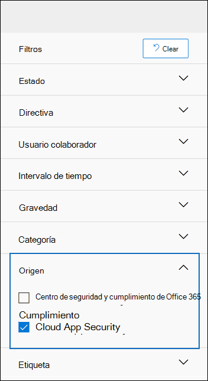

# <a name="alert-policies-in-the-security-and-compliance-center"></a>Directivas de alerta en el Centro de seguridad y cumplimiento

Puede usar la Directiva de alertas y las herramientas del panel de alertas en los centros de seguridad y cumplimiento de Microsoft 365 para crear directivas de alerta y, a continuación, ver las alertas generadas cuando los usuarios realizan actividades que cumplen las condiciones de una directiva de alertas. Hay varias directivas de alerta predeterminadas que le ayudarán a supervisar actividades como la asignación de privilegios de administrador en Exchange Online, los ataques de malware, las campañas de suplantación de identidad (phishing) y los niveles inusuales de eliminaciones de archivos y uso compartido externo.

Las directivas de alerta permiten clasificar las alertas desencadenadas por una directiva, aplicar la Directiva a todos los usuarios de la organización, establecer un nivel de umbral para cuando se desencadene una alerta y decidir si se recibirán notificaciones por correo electrónico cuando se desencadenen alertas. También hay una página **Ver alertas** en el centro de seguridad y cumplimiento donde puede ver y filtrar las alertas, establecer un estado de alerta que le ayude a administrar las alertas y, a continuación, descartar las alertas después de resolver o resolver el incidente subyacente.

> [!NOTE]
> Las directivas de alerta están disponibles para las organizaciones con una suscripción de Microsoft 365 Enterprise, Office 365 Enterprise o Office 365 US Government E1/F1/G1, E3/G3 o E5/G5. La funcionalidad avanzada solo está disponible para las organizaciones con una suscripción a E5/G5 o para organizaciones con una suscripción a E1/F1/G1 o E3/G3 y Microsoft defender para Office 365 P2 o un cumplimiento de Microsoft 365 E5 o una suscripción a la exhibición de documentos electrónicos de E5 y de auditoría. En este tema se resalta la funcionalidad que requiere una suscripción a E5/G5 o un complemento. Además, tenga en cuenta que las directivas de alerta están disponibles en los entornos de Office 365 GCC, GCC High y DoD estadounidense Government.

## <a name="how-alert-policies-work"></a>Cómo funcionan las directivas de alertas

A continuación, se presenta una introducción rápida sobre cómo funcionan las directivas de alertas y las alertas que se desencadenan cuando la actividad de usuario o de administrador cumpla las condiciones de una directiva de alerta.


1. Un administrador de su organización crea, configura y activa una directiva de alertas mediante la página **directivas de alerta** en el centro de seguridad y cumplimiento. También puede crear directivas de alerta con el cmdlet **New-ProtectionAlert** en el PowerShell del centro de cumplimiento de & de seguridad. Para crear directivas de alerta, debe tener asignado el rol administrar alertas o la configuración de la organización en el centro de seguridad y cumplimiento.

   > [!NOTE]
   > Tarda hasta 24 horas después de crear o actualizar una directiva de alerta antes de que la directiva pueda desencadenar alertas. Esto se debe a que la Directiva se debe sincronizar con el motor de detección de alertas.

2. Un usuario realiza una actividad que coincide con las condiciones de una directiva de alerta. En el caso de ataques de malware, los mensajes de correo electrónico infectados que se envían a los usuarios de su organización activan una alerta.

3. Microsoft 365 genera una alerta que se muestra en la página **Ver alertas** del centro de seguridad & cumplimiento. Además, si las notificaciones de correo electrónico están habilitadas para la Directiva de alertas, Microsoft envía una notificación a una lista de destinatarios. Las alertas que un administrador u otros usuarios pueden ver que en la página ver alertas está determinada por los roles asignados al usuario. Para obtener más información, consulte la sección [permisos de RBAC necesarios para ver alertas](#rbac-permissions-required-to-view-alerts) .

4. Un administrador administra alertas en el centro de seguridad y cumplimiento. La administración de alertas consiste en asignar un estado de alerta para ayudar a realizar un seguimiento y administrar cualquier investigación.

## <a name="alert-policy-settings"></a>Configuración de la Directiva de alerta

Una directiva de alertas consiste en un conjunto de reglas y condiciones que definen la actividad de usuario o de administrador que genera una alerta, una lista de los usuarios que desencadenan la alerta si realizan la actividad y un umbral que define cuántas veces tiene que producirse la actividad antes de que se desencadene una alerta. También puede clasificar la Directiva y asignarle un nivel de gravedad. Estas dos opciones de configuración ayudan a administrar las directivas de alerta (y las alertas que se desencadenan cuando se cumplen las condiciones de la Directiva) porque se puede filtrar en estas opciones cuando se administran directivas y se ven alertas en el centro de seguridad y cumplimiento. Por ejemplo, puede ver las alertas que coinciden con las condiciones de la misma categoría o ver alertas con el mismo nivel de gravedad.

Para ver y crear directivas de alerta, vaya a [https://protection.office.com](https://protection.office.com) y, a continuación, seleccione directivas de alertas de **alertas** \> **Alert policies**.


Una directiva de alertas consta de los siguientes valores y condiciones.

- **Actividad en la que se realiza el seguimiento de la alerta** : puede crear una directiva para realizar un seguimiento de una actividad o, en algunos casos, varias actividades relacionadas, como compartir un archivo con un usuario externo mediante su uso compartido, la asignación de permisos de acceso o la creación de un vínculo anónimo. Cuando un usuario realiza la actividad definida por la Directiva, se activa una alerta en función de la configuración del umbral de alerta.

    > [!NOTE]
    > Las actividades que puede realizar el seguimiento dependen del plan Office 365 Enterprise u Office 365 US Government de su organización. En general, las actividades relacionadas con las campañas de malware y los ataques de suplantación de identidad requieren una suscripción a E5/G5 o una suscripción a E1/F1/G1 o E3/G3 con una suscripción para el complemento de [defender para Office 365](../security/office-365-security/office-365-atp.md) plan 2.

- **Condiciones de actividad** : para la mayoría de las actividades, puede definir condiciones adicionales que deben cumplirse para desencadenar una alerta. Las condiciones comunes incluyen las direcciones IP (por lo que se desencadena una alerta cuando el usuario realiza la actividad en un equipo con una dirección IP específica o dentro de un intervalo de direcciones IP), si se activa una alerta si un usuario o usuarios específicos realizan dicha actividad y si la actividad se realiza en un nombre de archivo o dirección URL específicos. También puede configurar una condición que desencadene una alerta cuando un usuario de la organización realice la actividad. Las condiciones disponibles dependen de la actividad seleccionada.

- **Cuando se activa la alerta** , puede configurar una opción que defina la frecuencia con la que se puede producir una actividad antes de que se desencadene una alerta. Esto le permite configurar una directiva para generar una alerta cada vez que una actividad coincida con las condiciones de la Directiva, cuando se supere un umbral determinado o cuando la actividad en la que se realiza el seguimiento de la alerta sea inusual para la organización.

    

    Si selecciona la configuración en función de una actividad inusual, Microsoft establece un valor de línea base que define la frecuencia normal para la actividad seleccionada. El establecimiento de esta línea base tarda hasta siete días en el que no se generarán alertas. Una vez establecida la línea base, se desencadena una alerta cuando la frecuencia de la actividad a la que se realiza el seguimiento por parte de la Directiva de alerta supera en gran medida el valor de línea base. Para actividades relacionadas con la auditoría (como actividades de archivos y carpetas), puede establecer una línea base basada en un único usuario o en función de todos los usuarios de la organización; para actividades relacionadas con el malware, puede establecer una línea base en una única familia de malware, un solo destinatario o todos los mensajes de la organización.

    > [!NOTE]
    > La capacidad de configurar directivas de alerta basadas en un umbral o en una actividad inusual requiere una suscripción a E5/G5, o una suscripción a E1/F1/G1 o E3/G3 con Microsoft defender para Office 365 P2, el cumplimiento de Microsoft 365 E5 o la suscripción a Microsoft 365 eDiscovery y de auditoría. Las organizaciones con una suscripción a E1/F1/G1 y E3/G3 solo pueden crear directivas de alerta en las que se desencadene una alerta cada vez que se produzca una actividad.

- **Categoría de alerta** : para ayudar con el seguimiento y la administración de las alertas generadas por una directiva, puede asignar una de las siguientes categorías a una directiva.

  - Prevención de pérdida de datos

  - Gobierno de la información

  - Flujo de correo

  - Permisos

  - Administración de amenazas

  - Otros

  Cuando se produce una actividad que coincide con las condiciones de la Directiva de alertas, la alerta que se genera se etiqueta con la categoría definida en esta configuración. Esto le permite realizar un seguimiento y administrar las alertas que tienen la misma configuración de categoría en la página **Ver alertas** en el centro de seguridad y cumplimiento porque puede ordenar y filtrar las alertas basándose en la categoría.

- **Gravedad** de la alerta: similar a la categoría de alerta, asigna un atributo de gravedad (**bajo**, **medio**, **alto** o **informativo**) a las directivas de alerta. Al igual que la categoría de alerta, cuando se produce una actividad que coincide con las condiciones de la Directiva de alerta, la alerta que se genera se etiqueta con el mismo nivel de gravedad que se ha establecido para la Directiva de alerta. De nuevo, esto le permite realizar un seguimiento y administrar las alertas que tienen la misma configuración de gravedad en la página **Ver alertas** . Por ejemplo, puede filtrar la lista de alertas para que solo se muestren las alertas con una gravedad **alta** .

    > [!TIP]
    > Al configurar una directiva de alerta, considere la posibilidad de asignar una gravedad más alta a las actividades que puedan dar como resultado consecuencias negativas, como la detección de malware tras la entrega a los usuarios, la visualización de datos confidenciales o clasificados, el uso compartido de datos con usuarios externos u otras actividades que puedan provocar la pérdida de datos o las amenazas de seguridad. Esto puede ayudarle a priorizar las alertas y las acciones que realiza para investigar y resolver las causas subyacentes.

- **Notificaciones de correo electrónico** : puede configurar la Directiva para que las notificaciones de correo electrónico se envíen (o no se envíen) a una lista de usuarios cuando se desencadene una alerta. También puede establecer un límite de notificación diario para que una vez que se haya alcanzado el número máximo de notificaciones, no se envíen más notificaciones para la alerta durante ese día. Además de las notificaciones de correo electrónico, usted u otros administradores pueden ver las alertas que activa una directiva en la página **Ver alertas** . Considere la posibilidad de habilitar notificaciones de correo electrónico para directivas de alerta de una categoría específica o que tengan una configuración de gravedad más alta.

## <a name="default-alert-policies"></a>Directivas de alertas predeterminadas

Microsoft proporciona directivas de alerta integradas que ayudan a identificar los permisos de administrador de Exchange, la actividad de malware, las posibles amenazas externas e internas y los riesgos del gobierno de la información. En la página **directivas de alerta** , los nombres de estas directivas integradas están en negrita y el tipo de Directiva se define como **sistema**. Estas directivas están activadas de forma predeterminada. Puede desactivar estas directivas (o volver a iniciarla), configurar una lista de destinatarios a los que enviar notificaciones por correo electrónico y establecer un límite de notificación diario. No se pueden editar las demás opciones de configuración de estas directivas.

En la tabla siguiente se enumeran y describen las directivas de alertas predeterminadas disponibles y la categoría a la que está asignada cada Directiva. La categoría se usa para determinar qué alertas puede ver un usuario en la página ver alertas. Para obtener más información, consulte la sección [permisos de RBAC necesarios para ver alertas](#rbac-permissions-required-to-view-alerts) .

La tabla también indica el plan Office 365 Enterprise y Office 365 US Government, que se requiere para cada uno. Algunas directivas de alerta predeterminadas están disponibles si su organización tiene la suscripción complementaria correspondiente además de una suscripción a E1/F1/G1 o E3/G3.

| Directiva de alertas predeterminada | Description | Categoría | Suscripción de Office 365 Enterprise |
|:-----|:-----|:-----|:-----|
|**Se ha detectado un clic en una dirección URL potencialmente malintencionada**|Genera una alerta cuando un usuario protegido mediante [vínculos a prueba](../security/office-365-security/atp-safe-links.md) de errores de la organización hace clic en un vínculo malintencionado. Este evento se desencadena cuando Microsoft defender para Office 365 identifica los cambios en la dirección URL o cuando los usuarios invalidan las páginas de vínculos seguros (en función de la Directiva de vínculos seguros de Microsoft 365 de la organización). Esta directiva de alerta tiene una configuración de gravedad **alta** . Para defender para Office 365 P2, E5, G5 clientes, esta alerta activa automáticamente la [investigación y la respuesta automatizadas en Office 365](https://docs.microsoft.com/microsoft-365/security/office-365-security/office-365-air). Para obtener más información acerca de los eventos que desencadenan esta alerta, consulte [configurar directivas de vínculos seguros](../security/office-365-security/set-up-atp-safe-links-policies.md).|Administración de amenazas|Suscripción complementaria E5/G5 o defender para Office 365 P2|
|**Resultado de envío de administración completado**|Genera una alerta cuando un [envío del administrador](../security/office-365-security/admin-submission.md) completa el nuevo análisis de la entidad enviada. Se desencadenará una alerta cada vez que se represente un resultado de nuevo análisis a partir de un envío de administración. Estas alertas están destinadas a recordarle que debe [revisar los resultados de](https://protection.office.com/reportsubmission)los envíos anteriores, enviar mensajes de usuario notificados para obtener la comprobación de la directiva más reciente y volver a examinar los veredictos, y determinar si las directivas de filtrado de su organización tienen el impacto previsto. Esta directiva tiene una configuración de gravedad **baja** .|Administración de amenazas|E1/F1, E3 o E5|
|**El administrador ha activado la investigación manual del correo electrónico**|Genera una alerta cuando un administrador desencadena la investigación manual de un correo electrónico desde el explorador de amenazas. Para obtener más información, consulte [ejemplo: un administrador de seguridad desencadena una investigación desde el explorador de amenazas] ( https://docs.microsoft.com/microsoft-365/security/office-365-security/automated-investigation-response-office#example-a-security-administrator-triggers-an-investigation-from-threat-explorer) . Esta alerta notifica a su organización que se ha iniciado la investigación. La alerta proporciona información sobre quién la ha desencadenado e incluye un vínculo a la investigación. Esta directiva tiene una configuración de gravedad **informativa** .|Administración de amenazas| Suscripción complementaria E5/G5 o Microsoft defender para Office 365 P2| 
|**Creación de una regla de reenvío/redireccionamiento**|Genera una alerta cuando una persona de la organización crea una regla de bandeja de entrada para su buzón que reenvía o redirige los mensajes a otra cuenta de correo electrónico. Esta directiva solo realiza un seguimiento de las reglas de la bandeja de entrada que se crean con Outlook en la web (anteriormente conocido como Outlook Web App) o Exchange Online PowerShell. Esta directiva tiene una configuración de gravedad **baja** . Para obtener más información sobre el uso de reglas de la bandeja de entrada para reenviar y redirigir correo electrónico en Outlook en la web, vea [usar reglas en Outlook en la web para reenviar mensajes automáticamente a otra cuenta](https://support.office.com/article/1433e3a0-7fb0-4999-b536-50e05cb67fed).|Administración de amenazas|E1/F1/G1, E3/G3 o E5/G5|
|**búsqueda de exhibición de documentos electrónicos iniciada o exportada**|Genera una alerta cuando alguien usa la herramienta de búsqueda de contenido en el centro de seguridad y cumplimiento. Se desencadena una alerta cuando se realizan las siguientes actividades de búsqueda de contenido: <br/><br/>* Se inicia una búsqueda de contenido<br/>* Se exportan los resultados de una búsqueda de contenido<br/>* Se exporta un informe de búsqueda de contenido<br/><br/>También se desencadenan alertas cuando las actividades de búsqueda de contenido anteriores se realizan en asociación con un caso de exhibición de documentos electrónicos. Esta directiva tiene una configuración de gravedad **media** . Para obtener más información acerca de las actividades de búsqueda de contenido, vea [buscar actividades de eDiscovery en el registro de auditoría](search-for-ediscovery-activities-in-the-audit-log.md#ediscovery-activities).|Administración de amenazas|E1/F1/G1, E3/G3 o E5/G5|
|**Privilegio de administración de elevación de Exchange**|Genera una alerta cuando se asignan permisos administrativos a un usuario en la organización de Exchange Online. Por ejemplo, cuando se agrega un usuario al grupo de funciones de administración de la organización en Exchange Online. Esta directiva tiene una configuración de gravedad **baja** .|Permisos|E1/F1/G1, E3/G3 o E5/G5|
|**Mensajes de correo electrónico que contienen malware quitados después de la entrega**|Genera una alerta cuando se entregan mensajes con malware a los buzones de la organización. Si se produce este evento, Microsoft quita los mensajes infectados de los buzones de correo de Exchange online mediante la [purga automática de cero horas](../security/office-365-security/zero-hour-auto-purge.md). Esta directiva tiene una configuración de gravedad **informativa** y desencadena automáticamente [investigación y respuesta automatizada en Office 365](https://docs.microsoft.com/microsoft-365/security/office-365-security/office-365-air).|Administración de amenazas|Suscripción complementaria E5/G5 o Microsoft defender para Office 365 P2|
|**Mensajes de correo electrónico que contienen direcciones URL de phish quitadas después de la entrega**|Genera una alerta cuando se entregan mensajes con phish a los buzones de la organización. Si se produce este evento, Microsoft quita los mensajes infectados de los buzones de correo de Exchange online mediante la [purga automática de cero horas](../security/office-365-security/zero-hour-auto-purge.md). Esta directiva tiene una configuración de gravedad **informativa** y desencadena automáticamente [investigación y respuesta automatizada en Office 365](https://docs.microsoft.com/microsoft-365/security/office-365-security/office-365-air).|Administración de amenazas|Suscripción complementaria E5/G5 o defender para Office 365 P2|
|**Correo electrónico notificado por el usuario como malware o phish**|Genera una alerta cuando los usuarios de la organización informen de mensajes como correo electrónico de suplantación de identidad mediante el complemento de mensajes de informe. Esta directiva tiene una configuración de gravedad **informativa** . Para obtener más información sobre este complemento, vea [use the Report Message Add-in](https://support.office.com/article/b5caa9f1-cdf3-4443-af8c-ff724ea719d2). Para defender para Office 365 P2, E5, G5 clientes, esta alerta activa automáticamente la [investigación y la respuesta automatizadas en Office 365](https://docs.microsoft.com/microsoft-365/security/office-365-security/office-365-air).|Administración de amenazas|E1/F1/G1, E3/G3 o E5/G5|
|**Límite de envío de correo electrónico superado**|Genera una alerta cuando una persona de la organización ha enviado más correo del que permite la Directiva de correo no deseado saliente. Suele ser una indicación de que el usuario está enviando demasiado correo electrónico o que la cuenta puede estar en peligro. Esta directiva tiene una configuración de gravedad **media** . Si recibe una alerta generada por esta directiva de alerta, es aconsejable [comprobar si la cuenta de usuario está comprometida](../security/office-365-security/responding-to-a-compromised-email-account.md).|Administración de amenazas|E1/F1/G1, E3/G3 o E5/G5|
|**Los mensajes se han retrasado**|Genera una alerta cuando Microsoft no puede entregar mensajes de correo electrónico a su organización local o a un servidor asociado mediante un conector. Cuando esto ocurre, el mensaje se coloca en la cola en Office 365. Esta alerta se desencadena cuando hay 2.000 mensajes o más que se han puesto en cola durante más de una hora. Esta directiva tiene una configuración de gravedad **alta** .|Flujo de correo|E1/F1/G1, E3/G3 o E5/G5|
|**Campaña de malware detectada tras la entrega**|Genera una alerta cuando se entrega un número inusualmente grande de mensajes que contienen malware a los buzones de la organización. Si se produce este evento, Microsoft quita los mensajes infectados de los buzones de correo de Exchange Online. Esta directiva tiene una configuración de gravedad **alta** .|Administración de amenazas|Suscripción complementaria E5/G5 o Microsoft defender para Office 365 P2|
|**Campaña de malware detectada y bloqueada**|Genera una alerta cuando alguien intenta enviar un número inusualmente elevado de mensajes de correo electrónico que contienen un determinado tipo de malware a los usuarios de la organización. Si se produce este evento, Microsoft bloquea los mensajes infectados y no se entregan a los buzones de correo. Esta directiva tiene una configuración de gravedad **baja** .|Administración de amenazas|Suscripción complementaria E5/G5 o defender para Office 365 P2|
|**Campaña de malware detectada en SharePoint y OneDrive**|Genera una alerta cuando se detecta un volumen inusualmente alto de malware o virus en los archivos ubicados en los sitios de SharePoint o en las cuentas de OneDrive de la organización. Esta directiva tiene una configuración de gravedad **alta** .|Administración de amenazas|Suscripción complementaria E5/G5 o defender para Office 365 P2|
|**Phish entregado debido a un inquilino o un reemplazo de usuario**<sup>1</sup>|Genera una alerta cuando Microsoft detecta una omisión de administrador o usuario que permitió la entrega de un mensaje de suplantación de identidad (phishing) a un buzón. Algunos ejemplos de invalidaciones son una regla de bandeja de entrada o de flujo de correo que permite mensajes de un remitente o dominio específicos, o una directiva contra correo no deseado que permite mensajes de determinados remitentes o dominios. Esta directiva tiene una configuración de gravedad **alta** .|Administración de amenazas|Suscripción complementaria E5/G5 o defender para Office 365 P2|
|**Actividad de reenvío de correo sospechoso**|Genera una alerta cuando una persona de la organización tiene un correo electrónico de reenvío automático a una cuenta externa sospechosa. Se trata de una advertencia temprana para el comportamiento que puede indicar que la cuenta está en peligro, pero no es lo suficientemente grave como para restringir al usuario. Esta directiva tiene una configuración de gravedad **media** . Aunque es raro, una alerta generada por esta Directiva puede ser una anomalía. Es una buena idea [comprobar si la cuenta de usuario está comprometida](../security/office-365-security/responding-to-a-compromised-email-account.md).|Administración de amenazas|E1/F1/G1, E3/G3 o E5/G5|
|**Patrones de envío de correo electrónico sospechosos detectados**|Genera una alerta cuando alguien de la organización ha enviado correo electrónico sospechoso y su riesgo de enviar correo electrónico está restringido. Se trata de una advertencia temprana para el comportamiento que puede indicar que la cuenta está en peligro, pero no lo suficientemente grave como para restringir al usuario. Esta directiva tiene una configuración de gravedad **media** . Aunque es raro, una alerta generada por esta Directiva puede ser una anomalía. Sin embargo, es una buena idea [comprobar si la cuenta de usuario está comprometida](../security/office-365-security/responding-to-a-compromised-email-account.md).|Administración de amenazas|E1/F1/G1, E3/G3 o E5/G5  |
|**Espacio empresarial restringido al enviar correo electrónico**|Genera una alerta cuando la mayor parte del tráfico de correo electrónico de la organización se detecta como sospechoso y Microsoft ha restringido el envío de correo electrónico a la organización. Investigue las cuentas de usuario y de administrador potencialmente comprometidas, los nuevos conectores o las retransmisiones abiertas y, a continuación, póngase en contacto con el soporte técnico de Microsoft para desbloquear la organización. Esta directiva tiene una configuración de gravedad **alta** . Para obtener más información sobre por qué se bloquean las organizaciones, vea [corregir problemas de entrega de correo electrónico para el código de error 5.7.7 XX en Exchange Online](https://go.microsoft.com/fwlink/?linkid=2022138).|Administración de amenazas|E1/F1/G1, E3/G3 o E5/G5|
|**Actividad de archivo de usuario externo inusual**|Genera una alerta cuando un número inusualmente grande de actividades se realizan en archivos de SharePoint o en OneDrive por usuarios externos a la organización. Esto incluye actividades como obtener acceso a archivos, descargar archivos y eliminar archivos. Esta directiva tiene una configuración de gravedad **alta** .|Gobierno de la información|E5/G5, Microsoft defender para Office 365 P2 o la suscripción complementaria Microsoft 365 E5|
|**Volumen inusual de uso compartido de archivos externos**|Genera una alerta cuando se comparte un número inusualmente grande de archivos en SharePoint o OneDrive con usuarios fuera de la organización. Esta directiva tiene una configuración de gravedad **media** .|Gobierno de la información|E5/G5, defender para Office 365 P2 o la suscripción complementaria Microsoft 365 E5|
|**Volumen inusual de eliminación de archivo**|Genera una alerta cuando se elimina un número inusualmente grande de archivos en SharePoint o OneDrive en un breve período de tiempo. Esta directiva tiene una configuración de gravedad **media** .|Gobierno de la información|E5/G5, defender para Office 365 P2 o la suscripción complementaria Microsoft 365 E5|
|**Aumento inusual de correo electrónico notificado como phish**|Genera una alerta cuando hay un aumento significativo en el número de personas de la organización mediante el complemento de mensajes de informe en Outlook para notificar los mensajes como phishing mail. Esta directiva tiene una configuración de gravedad **alta** . Para obtener más información sobre este complemento, vea [use the Report Message Add-in](https://support.office.com/article/b5caa9f1-cdf3-4443-af8c-ff724ea719d2).|Administración de amenazas|Suscripción complementaria E5/G5 o defender para Office 365 P2|
|**Suplantación de usuario phish entregada a la bandeja de entrada/carpeta**<sup>1,</sup><sup>2</sup>|Genera una alerta cuando Microsoft detecta que una invalidación de usuario o administrador ha permitido la entrega de un mensaje de suplantación de identidad de usuario a la bandeja de entrada (o a otra carpeta de acceso del usuario) de un buzón. Algunos ejemplos de invalidaciones son una regla de bandeja de entrada o de flujo de correo que permite mensajes de un remitente o dominio específicos, o una directiva contra correo no deseado que permite mensajes de determinados remitentes o dominios. Esta directiva tiene una configuración de gravedad **media** .|Administración de amenazas|Suscripción complementaria E5/G5 o defender para Office 365 P2|
|**El usuario restringió el envío de correo electrónico**|Genera una alerta cuando una persona de la organización tiene restringido el envío de correo saliente. Normalmente, esto se produce cuando una cuenta se ve comprometida y el usuario aparece en la página **usuarios restringidos** del centro de seguridad & cumplimiento. (Para obtener acceso a esta página, vaya a **Administración de amenazas > revise > usuarios restringidos**). Esta directiva tiene una configuración de gravedad **alta** . Para obtener más información acerca de los usuarios restringidos, consulte [quitar un usuario, un dominio o una dirección IP de una lista de bloqueados después de enviar correo no deseado](https://docs.microsoft.com/office365/securitycompliance/removing-user-from-restricted-users-portal-after-spam).|Administración de amenazas|E1/F1/G1, E3/G3 o E5/G5|
|||||

> [!NOTE]
> <sup>1</sup> hemos eliminado temporalmente esta directiva de alertas predeterminada en función de los comentarios de los clientes. Estamos trabajando para mejorarlo y lo reemplazaremos por una nueva versión en un futuro próximo. Hasta entonces, puede crear una directiva de alerta personalizada para reemplazar esta funcionalidad con la siguiente configuración:<br/>&nbsp; * Activity es el correo electrónico de phish detectado en el momento de la entrega<br/>&nbsp; * El correo no es ZAP<br/>&nbsp; * La dirección de correo es entrante<br/>&nbsp; * El estado de entrega de correo se entrega<br/>&nbsp; * La tecnología de detección es la retención de URL malintencionada, la detonación de dirección URL, el filtro de phish avanzado, el filtro de phish general, la suplantación de dominio, la suplantación de usuarios y la suplantación de marca<br/><br/>&nbsp;&nbsp;&nbsp;Para obtener más información acerca de anti-phishing en Office 365, consulte [set up anti-phishing and anti-phishing Policies](../security/office-365-security/set-up-anti-phishing-policies.md).<br/><br/><sup>2</sup> para volver a crear esta directiva de alerta, siga las instrucciones de la nota al pie anterior, pero elija suplantación del usuario como la única tecnología de detección.

La actividad inusual supervisada por algunas de las directivas integradas se basa en el mismo proceso que la configuración del umbral de alerta que se describió anteriormente. Microsoft establece un valor de línea base que define la frecuencia normal para la actividad "normal". A continuación, se desencadenan alertas cuando la frecuencia de las actividades a las que hace referencia la Directiva de alerta integrada supera en gran medida el valor de línea base.

## <a name="viewing-alerts"></a>Ver alertas

Cuando una actividad realizada por los usuarios de la organización coincide con la configuración de una directiva de alerta, se genera una alerta y se muestra en la página **Ver alertas** del centro de seguridad y cumplimiento. En función de la configuración de una directiva de alerta, también se envía una notificación por correo electrónico a una lista de los usuarios especificados cuando se desencadena una alerta. Para cada alerta, el panel de la página **Ver alertas** muestra el nombre de la Directiva de alerta correspondiente, la gravedad y la categoría de la alerta (definida en la Directiva de alerta) y el número de veces que se ha producido una actividad que resultó en la generación de la alerta. Este valor se basa en la configuración de umbral de la Directiva de alerta. El panel también muestra el estado de cada alerta. Para obtener más información acerca del uso de la propiedad status para administrar las alertas, consulte la sección [Administrar alertas](#managing-alerts) .

Para ver las alertas, vaya a [https://protection.office.com](https://protection.office.com) y, a continuación, seleccione **alertas** \> **Ver alertas**.


Puede usar los siguientes filtros para ver un subconjunto de todas las alertas en la página **Ver alertas** .

- **Estatus.** Use este filtro para mostrar las alertas que tienen asignado un estado determinado. El estado predeterminado es **activo**. Usted u otros administradores pueden cambiar el valor de estado.

- **Normativa.** Use este filtro para mostrar alertas que coinciden con el valor de una o más directivas de alerta. O puede mostrar todas las alertas de todas las directivas de alerta.

- **Intervalo de tiempo.** Use este filtro para mostrar las alertas que se generaron en un intervalo de fechas y horas específico.

- **Gravedad.** Use este filtro para mostrar las alertas que tienen asignada una gravedad específica.

- **Categoría.** Use este filtro para mostrar alertas de una o varias categorías de alertas.

- **Códigos.** Use este filtro para mostrar alertas de una o varias etiquetas de usuario. Las etiquetas se reflejan en función de los buzones etiquetados o de los usuarios que aparecen en las alertas. Vea [etiquetas de usuario en Office 356 ATP](..\security\office-365-security\user-tags.md) para obtener más información.

- **Orígenes.** Use este filtro para mostrar las alertas desencadenadas por las directivas de alertas en el centro de seguridad y cumplimiento o en las alertas desencadenadas por las directivas de seguridad de aplicaciones de nube de Office 365 o ambas. Para obtener más información sobre las alertas de seguridad de la aplicación de nube de Office 365, consulte la sección [visualización de alertas de Cloud App Security](#viewing-cloud-app-security-alerts) .

> [!IMPORTANT]
> El filtrado y la ordenación por etiquetas de usuario se encuentra actualmente en versión preliminar pública.
> Se puede modificar de forma sustancial antes de que se publique comercialmente. Microsoft no ofrece ninguna garantía, expresa o implícita, con respecto a la información que se proporciona a continuación.

## <a name="alert-aggregation"></a>Agregación de alertas

Cuando se producen varios eventos que cumplen las condiciones de una directiva de alerta con un breve período de tiempo, se agregan a una alerta existente mediante un proceso denominado *agregación de alertas*. Cuando un evento desencadena una alerta, la alerta se genera y se muestra en la página **Ver alertas** y se envía una notificación. Si se produce el mismo evento en el intervalo de agregación, Microsoft 365 agrega detalles sobre el nuevo evento a la alerta existente en lugar de desencadenar una nueva alerta. El objetivo de la agregación de alertas es ayudar a reducir la "fatiga" de la alerta y dejarle focalizar y emprender acciones en menos alertas para el mismo evento.

La duración del intervalo de agregación depende de la suscripción a Office 365 o Microsoft 365.

|Suscripción|Intervalo de agregación|
|:---------|:---------:|
|Office 365 o Microsoft 365 E5/G5|1 minuto|
|Defender para Office 365 plan 2 |1 minuto|
|Complemento de cumplimiento E5 o complemento de detección y auditoría de E5|1 minuto|
|Office 365 o Microsoft 365 E1/F1/G1 o E3/F3/G3|15 minutos|
|Defender para Office 365 plan 1 o Exchange Online Protection|15 minutos|
|||

Cuando se producen eventos que coinciden con la misma directiva de alerta en el intervalo de agregación, se agregan detalles sobre el siguiente evento a la alerta original. Para todos los eventos, la información sobre los eventos agregados se muestra en el campo de detalles y el número de veces que se ha producido un evento con el intervalo de agregación se muestra en el campo Activity/Count hit. Puede ver más información acerca de todas las instancias de eventos agregados viendo la lista de actividades.

En la siguiente captura de pantalla se muestra una alerta con cuatro eventos agregados. La lista de actividades contiene información sobre los cuatro mensajes de correo electrónico que son relevantes para la alerta.


Tenga en cuenta lo siguiente en cuanto a la agregación de alertas:

- Alertas desencadenadas por la **dirección URL potencialmente malintencionada haga clic en se ha detectado** que la [Directiva de alerta predeterminada](#default-alert-policies) no se agrega. Esto se debe a que las alertas desencadenadas por esta Directiva son únicas para cada usuario y mensaje de correo electrónico.

- En este momento, la propiedad de alerta de **recuento de visitas** no indica el número de eventos agregados para todas las directivas de alerta. Para las alertas desencadenadas por estas directivas de alertas, puede ver los eventos agregados haciendo clic en **Ver lista de mensajes** o **ver actividad** en la alerta. Estamos trabajando en hacer que el número de eventos agregados que aparecen en la propiedad de alerta de **recuento de visitas** esté disponible para todas las directivas de alerta.

## <a name="rbac-permissions-required-to-view-alerts"></a>Permisos de RBAC necesarios para ver las alertas

Los permisos de control de acceso basado en roles (RBAC) que se asignan a los usuarios de la organización determinan las alertas que puede ver un usuario en la página **Ver alertas** . ¿Cómo se consigue? Las funciones de administración asignadas a los usuarios (según su pertenencia a grupos de roles en el centro de seguridad & cumplimiento) determinan las categorías de alertas que puede ver un usuario en la página **Ver alertas** . Aquí le mostramos otros ejemplos:

- Los miembros del grupo de roles de administración de registros solo pueden ver las alertas generadas por las directivas de alertas que tienen asignada la categoría **gobierno de información** .

- Los miembros del grupo de roles de administrador de cumplimiento no pueden ver alertas generadas por las directivas de alerta asignadas a la categoría **Administración de amenazas** .

- Los miembros del grupo de roles eDiscovery Manager no pueden ver las alertas porque ninguno de los roles asignados proporciona permisos para ver las alertas de cualquier categoría de alerta.

Este diseño (basado en los permisos RBAC) le permite determinar qué alertas pueden ver (y administrar) los usuarios de roles de trabajo específicos de su organización.

En la siguiente tabla se enumeran las funciones necesarias para ver las alertas de las seis categorías de alertas diferentes. En la primera columna de la tabla se enumeran todos los roles del centro de seguridad & cumplimiento.  Una marca de verificación indica que un usuario que tiene asignada esa función puede ver alertas de la categoría de alerta correspondiente que aparece en la fila superior.

Para ver a qué categoría se asigna una directiva de alerta predeterminada, consulte la tabla de la sección [directivas de alertas predeterminadas](#default-alert-policies) .

|Role|Gobierno de la información|Prevención de pérdida de datos|Flujo de correo|Permisos|Administración de amenazas|Otros|
|:---------|:---------:|:---------:|:---------:|:---------:|:---------:|:---------:|
|Registros de auditoría|||||||
|Administración de casos|||||||
|Administrador de cumplimiento|||||||
|Búsqueda de cumplimiento|||||||
|Administración de dispositivos|||||||
|Administración de disposición|||||||
|Administración de cumplimiento de DLP|||||||
|Export|||||||
|Hold|||||||
|Administrar alertas|||||||
|Configuración de la organización|||||||
|Preview|||||||
|Administración de registros|||||||
|Administración de retención|||||||
|Revisar|||||||
|Descifrado de RMS|||||||
|Administración de funciones|||||||
|Búsqueda y depuración|||||||
|Administrador de seguridad|||||||
|Lector de seguridad||||||
|Vista de garantía del servicio|||||||
|Administrador de revisión de supervisión|||||||
|View-Only registros de auditoría|||||||
|Administración de dispositivos View-Only|||||||
|View-Only la administración de cumplimiento de DLP|||||||
|View-Only administrar alertas|||||||
|Destinatarios con permiso de vista|||  ||||
|Administración de registros de View-Only|||||||
|Administración de la retención de View-Only|||||||
|||||||

> [!TIP]
> Para ver los roles asignados a cada uno de los grupos de roles predeterminados, ejecute los siguientes comandos en el PowerShell del centro de cumplimiento de & de seguridad:
> 
> ```powershell
> $RoleGroups = Get-RoleGroup
> ```
> 
> ```powershell
> $RoleGroups | foreach {Write-Output -InputObject `r`n,$_.Name,"-----------------------"; Get-RoleGroup $_.Identity | Select-Object -ExpandProperty Roles}
> ```
> 
> También puede ver las funciones asignadas a un grupo de funciones en el centro de seguridad & cumplimiento. Vaya a la página de **permisos** y seleccione un grupo de roles. Los roles asignados se enumeran en la página de flotante.

## <a name="managing-alerts"></a>Administración de alertas

Una vez que se han generado y mostrado las alertas en la página **Ver alertas** del centro de seguridad y cumplimiento, puede clasificarlas, investigarlas y resolverlas. Estas son algunas de las tareas que puede realizar para administrar las alertas.

- **Asigne un estado a alertas.** Puede asignar uno de los siguientes Estados a Alerts: **Active** (el valor predeterminado), **investigando**, **resuelto** o **desechado**. A continuación, puede filtrar según esta configuración para que se muestren las alertas con la misma configuración de estado. Esta configuración de estado puede ayudar a realizar un seguimiento del proceso de administración de alertas.

- **Ver detalles de alertas.** Puede seleccionar una alerta para mostrar una página de control flotante con detalles sobre la alerta. La información detallada depende de la Directiva de alerta correspondiente, pero normalmente incluye lo siguiente: nombre de la operación real que ha desencadenado la alerta (por ejemplo, un cmdlet), una descripción de la actividad que desencadenó la alerta, el usuario (o la lista de usuarios) que desencadenó la alerta y el nombre (y vincular a) de la correspondiente directiva de alertas.

  - Nombre de la operación real que desencadenó la alerta, como un cmdlet o una operación de registro de auditoría.

  - Descripción de la actividad que desencadenó la alerta.

  - El usuario que desencadenó la alerta. Esto solo se incluye para las directivas de alerta que se configuran para realizar el seguimiento de un único usuario o de una actividad única.

  - El número de veces que se ha realizado la actividad de la que se realizó el seguimiento en la alerta. Este número puede no coincidir con el número real de alertas relacionadas que aparecen en la página ver alertas porque es posible que se hayan desencadenado más alertas.

  - Un vínculo a una lista de actividades que incluye un elemento para cada actividad que haya realizado la activación de la alerta. Cada entrada de esta lista identifica Cuándo se produjo la actividad, el nombre de la operación real (por ejemplo, "FileDeleted") y el usuario que realizó la actividad, el objeto (por ejemplo, un archivo, un caso de exhibición de documentos electrónicos o un buzón) en el que se realizó la actividad y la dirección IP del equipo del usuario. Para las alertas relacionadas con el malware, se vincula a una lista de mensajes.

  - El nombre (y vincular a) de la Directiva de alerta correspondiente.

- **Suprimir notificaciones de correo electrónico.** Puede desactivar (o suprimir) las notificaciones de correo electrónico de la página de control flotante para una alerta. Cuando se suprimen las notificaciones de correo electrónico, Microsoft no enviará notificaciones cuando se realicen actividades o eventos que cumplan las condiciones de la Directiva de alertas. Pero las alertas se desencadenarán cuando las actividades realizadas por los usuarios cumplan las condiciones de la Directiva de alertas. También puede desactivar las notificaciones de correo electrónico editando la Directiva de alertas.

- **Resolver las alertas.** Puede marcar una alerta como resuelta en la página de control flotante para una alerta (que establece el estado de la alerta como **resuelto**). A menos que cambie el filtro, las alertas resueltas no se mostrarán en la página **Ver alertas** .

## <a name="viewing-cloud-app-security-alerts"></a>Visualización de alertas de Cloud App Security

Las alertas que se desencadenan con Office 365 Cloud App Security Policies ahora se muestran en la página **Ver alertas** del centro de seguridad y cumplimiento. Esto incluye las alertas que se desencadenan por las directivas y alertas de actividad que se desencadenan con las directivas de detección de anomalías en Office 365 Cloud App Security. Esto significa que puede ver todas las alertas en el centro de seguridad y cumplimiento. Office 365 Cloud App Security solo está disponible para organizaciones con una suscripción de Office 365 Enterprise E5 o Office 365 US Government G5. Para obtener más información, consulte [Overview of Cloud App Security](https://docs.microsoft.com/cloud-app-security/what-is-cloud-app-security).

Las organizaciones que tienen Microsoft Cloud App Security como parte de una suscripción a Enterprise Mobility + Security E5 o como un servicio independiente también pueden ver las alertas de Cloud App Security relacionadas con los servicios y las aplicaciones de Office 365 en el centro de seguridad & cumplimiento.

Para mostrar solo alertas de Cloud App Security en el centro de seguridad y cumplimiento, use el filtro de **origen** y seleccione **Cloud App Security**.



Similar a una alerta desencadenada por una directiva de alerta en el centro de seguridad y cumplimiento, puede seleccionar una alerta de Cloud App Security para mostrar una página de control flotante con detalles sobre la alerta. La alerta incluye un vínculo para ver los detalles y administrar la alerta en Cloud App Security portal y un vínculo a la Directiva de seguridad de la aplicación de nube correspondiente que activó la alerta. Consulte [supervisar alertas en Cloud App Security](https://docs.microsoft.com/cloud-app-security/monitor-alerts).


> [!IMPORTANT]
> Si se cambia el estado de una alerta de Cloud App Security en el centro de seguridad y cumplimiento, no se actualizará el estado de resolución de la misma alerta en Cloud App Security portal. Por ejemplo, si marca el estado de la alerta como **resuelto** en el centro de seguridad y cumplimiento, el estado de la alerta en Cloud App Security Portal no cambia. Para resolver o descartar una alerta de Cloud App Security, administre la alerta en Cloud App Security portal.
