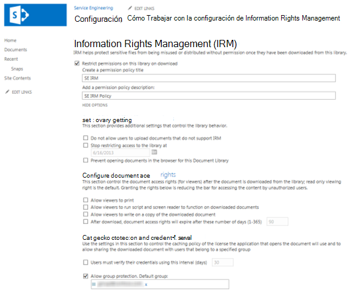
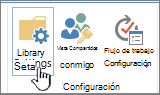

# Aplicar Information Rights Management (IRM) a una lista o bibliotecaApply Information Rights Management (IRM) to a list or library

Puede usar Information Rights Management (IRM) para ayudar a controlar y proteger los archivos que se descargan de listas o bibliotecas.You can use Information Rights Management (IRM) to help control and protect files that are downloaded from lists or libraries. Esta característica solo se admite en la nube global de Microsoft.This feature is only supported in the Microsoft global cloud. IRM no es compatible con listas y bibliotecas de SharePoint en implementaciones de nube nacionales.IRM is not supported for SharePoint lists and libraries in national cloud deployments.
  
## Preparación del administrador antes de aplicar IRMAdministrator preparations before applying IRM

- El servicio Azure Rights Management (Azure RMS) de Azure Information Protection y el equivalente local, Active Directory Rights Management Services (AD RMS), admiten Information Rights Management para los sitios.The Azure Rights Management service (Azure RMS) from Azure Information Protection, and the on-premises equivalent, Active Directory Rights Management Services (AD RMS), support Information Rights Management for sites. No se requieren instalaciones independientes o adicionales.No separate or additional installations are required.

- Antes de aplicar IRM a una lista o biblioteca, debe habilitar IRM para el sitio.Before you apply IRM to a list or library, you need to enable IRM for your site. Necesitará permisos de administrador para habilitar IRM.You'll need administrator permissions to enable IRM.

- Para aplicar IRM a una lista o biblioteca, debe tener permisos de administrador para esa lista o biblioteca.To apply IRM to a list or library, you must have administrator permissions for that list or library.

- Si usa SharePoint Online, es posible que los usuarios experimente tiempos de espera al descargar archivos protegidos por IRM más grandes.If you're using SharePoint Online, your users might experience timeouts when downloading larger IRM-protected files. Para evitar tiempos de espera, use los programas de Office para aplicar la protección de IRM y almacene archivos más grandes en una biblioteca de SharePoint que no use IRM.To avoid timeouts, use your Office programs to apply IRM protection, and store larger files in a SharePoint library that doesn't use IRM.

> [!NOTE]
> Si usa SharePoint Server 2013, un administrador del servidor debe instalar protectores en todos los servidores cliente web para cada tipo de archivo que las personas de su organización quieran proteger mediante IRM.If you're using SharePoint Server 2013, a server administrator must install protectors on all front-end Web servers for every file type that the people in your organization want to protect by using IRM.
  
## Aplicar IRM a una lista o bibliotecaApply IRM to a list or library

  
1. Vaya a la lista o biblioteca para la que desea configurar IRM.Go to the list or library for which you want to configure IRM.

2. En la cinta de opciones, seleccione la **pestaña** Biblioteca y, a continuación, seleccione **Configuración de biblioteca.**On the ribbon, select the **Library** tab, and then select **Library Settings**. (Si está trabajando en una  lista, seleccione la pestaña Lista y, a continuación, seleccione **Configuración de lista).**(If you're working in a list, select the **List** tab, and then select **List Settings**).
    
    
  
3. En **Permisos y administración,** seleccione **Information Rights Management**.Under **Permissions and Management**, select **Information Rights Management**. Si no aparece el vínculo Information Rights Management, es posible que IRM no esté habilitado para el sitio.If the Information Rights Management link doesn't appear, IRM might not be enabled for your site. Póngase en contacto con el administrador del servidor para ver si puede habilitar IRM para su sitio.Contact your server administrator to see if you can enable IRM for your site. El **vínculo Information Rights Management** no aparece para las bibliotecas de imágenes.The **Information Rights Management** link doesn't appear for picture libraries.

4. En la página Configuración de  Information **Rights Management,** active la casilla Restringir permisos a los documentos de esta biblioteca al descargarlos para aplicar permisos restringidos a los documentos que los usuarios descargan de esta lista o biblioteca.On the **Information Rights Management Settings** page, select the **Restrict permission to documents in this library on download** check box to apply restricted permission to documents users download from this list or library.

5. En el **cuadro Crear un título de directiva de** permisos, escriba un nombre descriptivo para la directiva.In the **Create a permission policy title** box, enter a descriptive name for the policy. Use un nombre que le ayude a identificar esta directiva desde otras directivas.Use a name that helps you identify this policy from other policies. Por ejemplo, use **Confidencial de** la compañía para aplicar permisos restringidos a una lista o biblioteca que contenga documentos confidenciales de la empresa.For example, use **Company Confidential** to apply restricted permissions to a list or library that contains confidential company documents.

6. En el **cuadro Agregar una** descripción de directiva de permisos, escriba una descripción que se mostrará a las personas que usen esta lista o biblioteca que explique cómo deben controlar los documentos de esta lista o biblioteca.In the **Add a permission policy description** box, type a description that will appear to people who use this list or library that explains how they should handle the documents in this list or library. Por ejemplo, puede  escribir Analizar el contenido de este documento solo con otros empleados si desea restringir el acceso a la información de estos documentos a los empleados internos.For example, you can type **Discuss the contents of this document only with other employees** if you want to restrict access to the information in these documents to internal employees. 

7. Para aplicar restricciones adicionales a los documentos de esta lista o biblioteca, seleccione **Mostrar opciones** y realice una de las siguientes acciones:To apply additional restrictions to the documents in this list or library, select **Show Options**, and do any of the following:

|**Para ello:****To do this:**|**Haga lo siguiente:****Do this:**|
|:-----|:-----|
|Permitir que los usuarios impriman documentos de esta lista o bibliotecaAllow people to print documents from this list or library|Active la **casilla Permitir que los visores impriman.**Select the **Allow viewers to print** check box.|
|Permitir que las personas con al menos el permiso Ver elementos ejecuten código incrustado o macros en un documento.Allow people with at least the View Items permission to run embedded code or macros on a document.|Active la **casilla Permitir que los visores ejecuten scripts y lectores de pantalla para que funcionen en documentos descargados.** Si selecciona esta opción, los usuarios podrían ejecutar código para extraer el contenido de un documento.Select the **Allow viewers to run script and screen reader to function on downloaded documents** check box.If you select this option, users could run code to extract the contents of a document.           |
|Seleccione esta opción si desea restringir el acceso al contenido a un período de tiempo especificado.Select this option if you want to restrict access to content to a specified period of time. Si seleccionas esta opción, las licencias de emisión de los usuarios para acceder al contenido expirarán después del número de días especificado y los usuarios tendrán que volver al servidor para comprobar sus credenciales y descargar una nueva copia.If you select this option, people's issuance licenses to access the content will expire after the specified number of days, and people will be required to return to the server to verify their credentials and download a new copy.|Active la casilla Después de la descarga, los derechos de acceso al documento expirarán después de este número de días **(1-365)** y, a continuación, especifique el número de días durante los que desea que el documento se pueda ver.Select the **After download, document access rights will expire after these number of days (1-365)** check box, and then specify the number of days for which you want the document to be viewable.|
| Impedir que los usuarios carguen documentos que no admitan IRM en esta lista o biblioteca.Prevent people from uploading documents that do not support IRM to this list or library. Si selecciona esta opción, los usuarios no podrán cargar ninguno de los siguientes tipos de archivo: tipos de archivo que no tienen instalados los protectores IRM correspondientes en todos los servidores front-end web.If you select this option, people will not be able to upload any of the following file types: File types that do not have corresponding IRM protectors installed on all of the front-end web servers. Tipos de archivo que SharePoint Server 2010 no puede descifrar.File types that SharePoint Server 2010 cannot decrypt. Tipos de archivo que están protegidos por IRM en otro programa.File types that are IRM protected in another program.|Active la **casilla No permitir a los usuarios cargar documentos que no admitan IRM.**Select the **Do not allow users to upload documents that do not support IRM** check box.|
|Quite los permisos restringidos de esta lista o biblioteca en una fecha específica.Remove restricted permissions from this list or library on a specific date.|Active la **casilla Dejar de restringir el acceso** a la biblioteca en la casilla de verificación y, a continuación, seleccione la fecha que desee.Select the **Stop restricting access to the library at** check box, and then select the date that you want.|
|Controlar el intervalo en que las credenciales se almacenan en caché para el programa con licencia para abrir el documento.Control the interval that credentials are cached for the program that is licensed to open the document.|Seleccione la casilla Usuarios debe comprobar sus credenciales con esta casilla de intervalo **(días)** y, a continuación, escriba el intervalo de almacenamiento en caché de credenciales en el número de días.Select the **Users must verify their credentials using this interval (days)** check box, then enter the interval for caching credentials in number of days.|
|Permitir la protección de grupos para que los usuarios puedan compartir con miembros del mismo grupo.Allow group protection so that users can share with members of the same group.|Seleccione **Permitir protección de** grupo y escriba el nombre del grupo para compartir.Select **Allow group protection**, and enter the group's name for sharing.|

8. Cuando termine de seleccionar las opciones que desee, seleccione **Aceptar**.After you finish selecting the options you want, select **OK**.
  
## ¿Qué es Information Rights Management?What is Information Rights Management?

Information Rights Management (IRM) permite limitar las acciones que los usuarios pueden realizar en los archivos que se han descargado de listas o bibliotecas.Information Rights Management (IRM) enables you to limit the actions that users can take on files that have been downloaded from lists or libraries. IRM cifra los archivos descargados y limita el conjunto de usuarios y programas que pueden descifrarlos.IRM encrypts the downloaded files and limits the set of users and programs that are allowed to decrypt these files. IRM también puede limitar los derechos de los usuarios con permiso para leer archivos, de modo que no puedan realizar acciones como, por ejemplo, imprimir copias o copiar el texto de los mismos.IRM can also limit the rights of the users who are allowed to read files, so that they cannot take actions such as print copies of the files or copy text from them.
  
Puede usar IRM en listas o bibliotecas para limitar la difusión de contenido confidencial.You can use IRM on lists or libraries to limit the dissemination of sensitive content. Por ejemplo, si va a crear una biblioteca de documentos para compartir información sobre los próximos productos con representantes de marketing seleccionados, puede usar IRM para evitar que estas personas compartan este contenido con otros empleados de la empresa.For example, if you are creating a document library to share information about upcoming products with selected marketing representatives, you can use IRM to prevent these individuals from sharing this content with other employees in the company.
  
En un sitio, se aplica IRM a una lista o biblioteca completa, en lugar de a archivos individuales.On a site, you apply IRM to an entire list or library, rather than to individual files. Esto facilita garantizar un nivel coherente de protección para todo un conjunto de documentos o archivos.This makes it easier to ensure a consistent level of protection for an entire set of documents or files. Por lo tanto, IRM puede ayudar a su organización a aplicar directivas corporativas que rigen el uso y la difusión de información confidencial o de propiedad.IRM can thus help your organization to enforce corporate policies that govern the use and dissemination of confidential or proprietary information.
  
> [!NOTE]
> La información de esta página sobre Information Rights Management reemplaza los términos que hacen referencia a "Information Rights Management" en cualquier contrato de términos de licencia de Microsoft SharePoint Server 2013 y SharePoint Server 2016.The information on this page regarding Information Rights Management supersedes any terms that reference 'Information Rights Management' in any Microsoft SharePoint Server 2013 and SharePoint Server 2016 license term agreements. 
  
### Cómo IRM puede ayudar a proteger el contenidoHow IRM can help protect content

IRM ayuda a proteger el contenido restringido de las siguientes maneras:IRM helps to protect restricted content in the following ways:
  
- Ayuda a evitar que un visor autorizado copie, modifique, imprima, envíe faxes o copie y pega el contenido para uso no autorizadoHelps to prevent an authorized viewer from copying, modifying, printing, faxing, or copying and pasting the content for unauthorized use
    
- Ayuda a evitar que un visor autorizado copie el contenido mediante la característica Pantalla de impresión de Microsoft WindowsHelps to prevent an authorized viewer from copying the content by using the Print Screen feature in Microsoft Windows
    
- Ayuda a evitar que un visor no autorizado vea el contenido si se envía por correo electrónico después de descargarlo del servidor.Helps to prevent an unauthorized viewer from viewing the content if it is sent in e-mail after it is downloaded from the server
    
- Restringe el acceso al contenido a un período de tiempo especificado, tras el cual los usuarios deben confirmar sus credenciales y volver a descargar el contenido.Restricts access to content to a specified period of time, after which users must confirm their credentials and download the content again
    
- Ayuda a aplicar directivas corporativas que rigen el uso y la difusión de contenido dentro de la organizaciónHelps to enforce corporate policies that govern the use and dissemination of content within your organization
    
### Cómo IRM no puede ayudar a proteger el contenidoHow IRM cannot help protect content

IRM no puede proteger el contenido restringido de lo siguiente:IRM cannot protect restricted content from the following:
  
- Eliminación, robo, captura o transmisión por programas malintencionados como troyanos, registradores de pulsaciones de teclas y determinados tipos de spywareErasure, theft, capture, or transmission by malicious programs such as Trojan horses, keystroke loggers, and certain types of spyware
    
- Pérdida o daños debido a las acciones de virus del equipoLoss or corruption because of the actions of computer viruses
    
- Copia o reestipado manual del contenido de la pantalla en una pantallaManual copying or retyping of content from the display on a screen
    
- Fotografía digital o de películas de contenido que se muestra en una pantallaDigital or film photography of content that is displayed on a screen
    
- Copiar mediante el uso de programas de captura de pantalla de tercerosCopying through the use of third-party screen-capture programs
    
- Copia de metadatos de contenido (valores de columna) mediante el uso de programas de captura de pantalla de terceros o la acción de copiar y pegarCopying of content metadata (column values) through the use of third-party screen-capture programs or copy-and-paste action
  
## Cómo funciona IRM para listas y bibliotecasHow IRM works for lists and libraries

La protección de IRM se aplica a los archivos en el nivel de lista o biblioteca.IRM protection is applied to files at the list or library level. Cuando IRM está habilitado para una biblioteca, rights management se aplica a todos los archivos de esa biblioteca.When IRM is enabled for a library, rights management applies to all of the files in that library. Cuando IRM está habilitado para una lista, rights management solo se aplica a los archivos adjuntos a elementos de lista, no a los elementos de lista reales.When IRM is enabled for a list, rights management applies only to files that are attached to list items, not the actual list items.
  
Cuando los usuarios descargan archivos en una lista o biblioteca habilitada para IRM, los archivos se cifran para que solo los usuarios autorizados puedan verlos.When people download files in an IRM-enabled list or library, the files are encrypted so that only authorized people can view them. Cada archivo administrado con derechos también contiene una licencia de emisión que impone restricciones a las personas que ven el archivo.Each rights-managed file also contains an issuance license that imposes restrictions on the people who view the file. Las restricciones típicas incluyen hacer que un archivo de solo lectura, deshabilitar la copia de texto, impedir que los usuarios guarden una copia local e impedir que los usuarios impriman el archivo.Typical restrictions include making a file read-only, disabling the copying of text, preventing people from saving a local copy, and preventing people from printing the file. Los programas cliente que pueden leer tipos de archivo compatibles con IRM usan la licencia de emisión dentro del archivo administrado con derechos para aplicar estas restricciones.Client programs that can read IRM-supported file types use the issuance license within the rights-managed file to enforce these restrictions. Este es el modo en que un archivo administrado con derechos conserva su protección incluso después de descargarlo del servidor.This is how a rights-managed file retains its protection even after it is downloaded from the server.
  
Los tipos de restricciones que se aplican a un archivo cuando se descarga de una lista o biblioteca se basan en los permisos individuales del usuario en el sitio que contiene el archivo.The types of restrictions that are applied to a file when it is downloaded from a list or library are based on the individual user's permissions on the site that contains the file. En la tabla siguiente se explica cómo se corresponden los permisos de los sitios con los permisos de IRM.The following table explains how the permissions on sites correspond to IRM permissions.
  
|**Permisos****Permissions**|**Permisos de IRM****IRM Permissions**|
|:-----|:-----|
|Administrar permisos, administrar sitio webManage Permissions, Manage Web Site|**Control total** (definido por el programa cliente): este permiso generalmente permite a un usuario leer, editar, copiar, guardar y modificar permisos de contenido administrado con derechos.**Full control** (as defined by the client program): This permission generally allows a user to read, edit, copy, save, and modify permissions of rights-managed content.|
|Editar elementos, administrar listas, agregar y personalizar páginasEdit Items, Manage Lists, Add and Customize Pages|**Editar,** **copiar** y **guardar:** un usuario puede  imprimir un archivo solo si la casilla Permitir a los usuarios imprimir documentos está activada en la página Configuración de Information Rights Management para la lista o biblioteca.**Edit**, **Copy**, and **Save**: A user can print a file only if the **Allow users to print documents** check box is selected on the Information Rights Management Settings page for the list or library.|
|Ver elementosView Items|**Lectura:** Un usuario puede leer el documento, pero no puede copiar ni modificar su contenido.**Read**: A user can read the document, but cannot copy or modify its content. Un usuario solo puede  imprimir si la casilla Permitir a los usuarios imprimir documentos está activada en la página Configuración de Information Rights Management de la lista o biblioteca.A user can print only if the **Allow users to print documents** check box is selected on the Information Rights Management Settings page for the list or library.|
|OtrosOther|Ningún otro permiso corresponde directamente a los permisos de IRM.No other permissions correspond directly to IRM permissions.|
   
Al habilitar IRM para una lista o biblioteca en SharePoint Server 2013, solo puede proteger los tipos de archivo de esa lista o biblioteca para la que está instalado un protector en todos los servidores front-end web.When you enable IRM for a list or library in SharePoint Server 2013, you can only protect file types in that list or library for which a protector is installed on all front-end web servers. Un protector es un programa que controla el cifrado y descifrado de archivos administrados con derechos de un formato de archivo específico.A protector is a program that controls the encryption and decryption of rights-managed files of a specific file format. SharePoint incluye protectores para los siguientes tipos de archivo:SharePoint includes protectors for the following file types:
  
- Microsoft Office formularios de InfoPathMicrosoft Office InfoPath forms
    
- Formatos de archivo 97-2003 para los siguientes Microsoft Office: Word, Excel y PowerPointThe 97-2003 file formats for the following Microsoft Office programs: Word, Excel, and PowerPoint
    
- Formatos Office Open XML para los siguientes Microsoft Office: Word, Excel y PowerPointThe Office Open XML Formats for the following Microsoft Office programs: Word, Excel, and PowerPoint
    
- Formato de especificación de papel XML (XPS)The XML Paper Specification (XPS) format
    
Si su organización planea usar IRM para proteger cualquier otro tipo de archivo además de los enumerados anteriormente, el administrador del servidor debe instalar protectores para estos formatos de archivo adicionales.If your organization plans to use IRM to protect any other file types in addition to those listed above, your server administrator must install protectors for these additional file formats.
  

