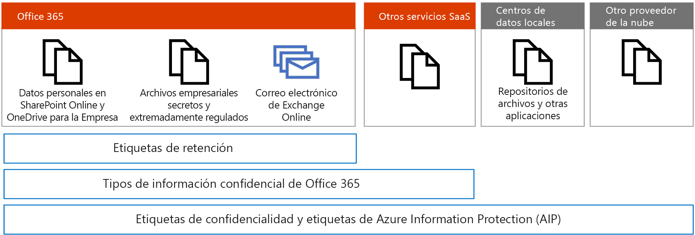
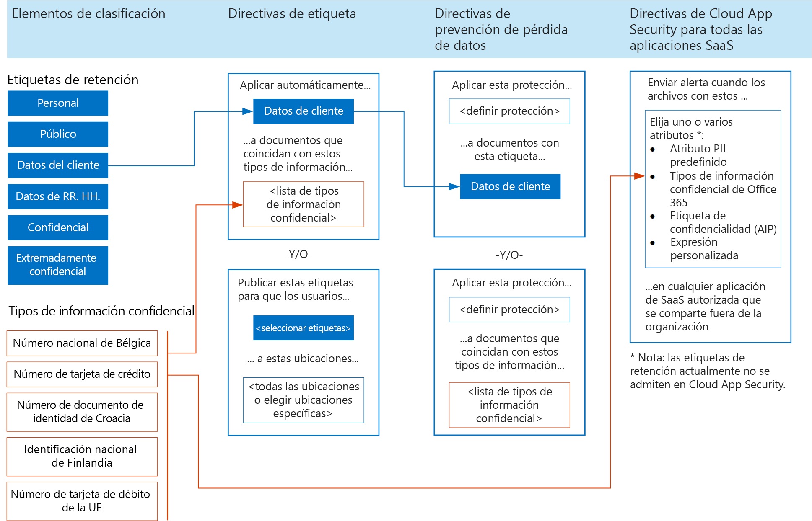
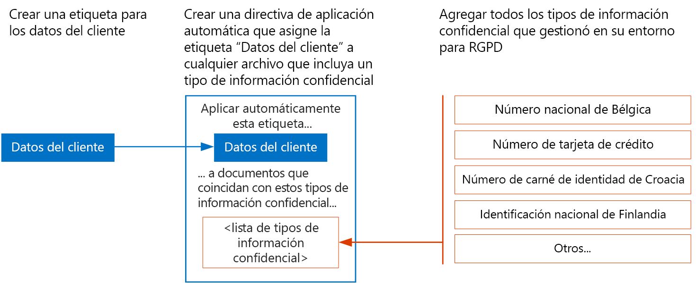

# Aplicación de etiquetas a datos personalesApply labels to personal data

 Use este tema si utiliza las etiquetas de clasificación como parte de su plan de protección de RGPD.Use this topic if you're using classification labels as part of your GDPR protection plan. 

Si utiliza etiquetas para la protección de datos personales de Microsoft 365, Microsoft recomienda que empiece con las [etiquetas de retención](retention.md#retention-labels).If you're using labels for protection of personal data in Microsoft 365, Microsoft recommends you start with [retention labels](retention.md#retention-labels). Con las etiquetas de retención, puede:With retention labels, you can:
- Usar el Gobierno de datos avanzado para aplicar automáticamente etiquetas con tipos de información confidencial u otros criterios.Use Advanced Data Governance to automatically apply labels based on sensitive information types or other criteria.
- Usar etiquetas de retención con la prevención de pérdida de datos para aplicar la protección.Use retention labels with data loss prevention to apply protection. 
- Usar etiquetas con eDiscovery y Búsqueda de contenido.Use labels with eDiscovery and Content Search. 

Cloud App Security actualmente no admite etiquetas de retención, pero puede usar tipos de información confidencial de Microsoft 365 con Cloud App Security para supervisar los datos personales que residen en otras aplicaciones SaaS.Cloud App Security doesn't currently support retention labels, but you can use Microsoft 365 sensitive information types with Cloud App Security to monitor personal data that resides in other SaaS apps.

Actualmente se recomiendan las [etiquetas de confidencialidad](sensitivity-labels.md) para la aplicación de etiquetas a archivos locales y en otros proveedores y servicios en la nube.[Sensitivity labels](sensitivity-labels.md) are currently recommended for applying labels to files on premises and in other cloud services and providers. Estas también se recomiendan para los archivos de Microsoft 365 que requieren el cifrado de Azure Information Protection (AIP) para la protección de datos, como archivos de secreto comercial.These are also recommended for files in Microsoft 365 that require Azure Information Protection encryption for data protection, such as trade secret files.

En este momento, no se recomienda usar Azure Information Protection para aplicar el cifrado a archivos en Microsoft 365 con datos que están sujetos al RGPD.At this time, using Azure Information Protection to apply encryption is not recommended for files in Microsoft 365 with data that is subject to the GDPR. Los servicios de Microsoft 365 actualmente no pueden leer archivos cifrados AIP.Microsoft 365 services currently cannot read into AIP-encrypted files. Por ello, el servicio no puede encontrar datos confidenciales en dichos archivos.Therefore, the service can't find sensitive data in these files.

Pueden aplicarse etiquetas de confidencialidad a correo en Exchange Online que funcionan con la prevención de pérdida de datos de Microsoft 365.Retention labels can be applied to mail in Exchange Online and these labels work with Microsoft 365 data loss prevention. 

En la ilustración:In the illustration:

-   Use las etiquetas de retención para los datos personales y archivos secretos empresariales muy regulados en SharePoint Online y OneDrive para la Empresa.Use retention labels for personal data and for highly regulated and trade secret files in SharePoint Online and OneDrive for Business.
-   Los tipos de información confidencial de Microsoft 365 pueden usarse en Microsoft 365 y con Cloud App Security para supervisar datos personales que residen en otras aplicaciones SaaS.Microsoft 365 sensitive information types can be used within Microsoft 365 and with Cloud App Security to monitor personal data that resides in other SaaS apps.
-   Use las etiquetas de confidencialidad para archivos secretos empresariales muy regulados, correo electrónico de Exchange Online, archivos en otros servicios SaaS, archivos en centros de datos locales y archivos de otros proveedores en la nube.Use sensitivity labels for highly regulated and trade secret files, Exchange Online email, files in other SaaS services, files in on-premises datacenters, and files in other cloud providers.

## Uso de etiquetas de retención y tipos de información confidencial en Microsoft 365 para la protección de informaciónUse retention labels and sensitive information types across Microsoft 365 for information protection

En la ilustración siguiente se muestra cómo pueden aprovecharse las etiquetas de retención y los tipos de información confidencial en las directivas de etiquetas, de prevención de pérdida de datos y de Cloud App Security.The following illustration shows how retention labels and sensitive information types can be used in label policies, data loss prevention policies, and with Cloud App Security policies.

Por motivos de accesibilidad, en la tabla siguiente se incluyen los mismos ejemplos que en la ilustración.For accessibility, the following table provides the same examples in the illustration.

<table>
<thead>
<tr class="header">
<th align="left"><strong>Elementos de clasificación</strong><strong>Classification elements</strong></th>
<th align="left"><strong>Directivas de etiqueta: 2 ejemplos</strong><strong>Label policies — 2 examples</strong></th>
<th align="left"><strong>Directivas de prevención de pérdida de datos: 2 ejemplos</strong><strong>Data loss prevention policies — 2 examples</strong></th>
<th align="left"><strong>Directivas de Cloud App Security para todas las aplicaciones SaaS: 1 ejemplo</strong><strong>Cloud App Security policies for all SaaS apps — 1 example</strong></th>
</tr>
</thead>
<tbody>
<tr class="odd">
<td align="left">Etiquetas de retención.Retention labels. Ejemplos: personal, público, datos de clientes, datos de recursos humanos, confidencial, extremadamente confidencialExamples: Personal, Public, Customer data, HR data, Confidential, Highly confidential</td>
<td align="left">
Auto apply this label .Auto apply this label . .. ..

Datos de clienteCustomer data

.. .. .. to documents that match these sensitive information types .to documents that match these sensitive information types . .. ..

&lt;lista de ejemplos de información confidencial disponibles&gt;&lt;list of example sensitive information types&gt;
</td>
<td align="left">
Apply this protection .Apply this protection . .. ..

&lt;definir la protección&gt;&lt;define protection&gt;

.. .. .. to documents with this label .to documents with this label . .. ..

Datos de clienteCustomer data
</td>
<td align="left">
Alert when files with these attributes .Alert when files with these attributes . .. ..

Elija uno o varios atributos: atributo PII predefinido, tipo de información confidencial de Microsoft 365, etiqueta de confidencialidad (AIP), expresión personalizada.Choose one or more attributes: predefined PII attribute, Microsoft 365 sensitive information type, sensitivity label (AIP), custom expression

.. .. .. en cualquier aplicación de SaaS autorizada se comparten fuera de la organizaciónin any sanctioned SaaS app are shared outside the organization

Nota: las etiquetas de retención actualmente no se admiten en Cloud App Security.Note: Retention labels are currently not supported in Cloud App Security.</td>
</tr>
<tr class="even">
<td align="left">Sensitive information types.Sensitive information types. Examples: Belgium National Number, Credit Card Number, Croatia Identity Cart Number, Finland National IDExamples: Belgium National Number, Credit Card Number, Croatia Identity Cart Number, Finland National ID</td>
<td align="left">
Publish these labels for users to manually apply .Publish these labels for users to manually apply . .. ..

&lt;seleccionar etiquetas&gt;&lt;select labels&gt;

.. .. .. to these locations .to these locations . .. ..

&lt;todas las ubicaciones o elegir ubicaciones específicas&gt;&lt;all locations or choose specific locations&gt;
</td>
<td align="left">
Apply this protection .Apply this protection . .. ..

&lt;definir la protección&gt;&lt;define protection&gt;

.. .. .. to documents that match these sensitive information types&gt;to documents that match these sensitive information types&gt;
</td>
<td align="left"></td>
</tr>
</tbody>
</table>

## Asignar prioridades a las directivas de etiqueta de aplicación automáticaPrioritize auto-apply label policies

For personal data that is subject to GDPR, Microsoft recommends auto-applying labels by using the sensitive information types you curated for your environment.For personal data that is subject to GDPR, Microsoft recommends auto-applying labels by using the sensitive information types you curated for your environment. It is important that auto-apply label policies are well designed and tested to ensure the intended behavior occurs.It is important that auto-apply label policies are well designed and tested to ensure the intended behavior occurs.

The order that auto-apply policies are created and whether users are also applying these labels affect the result.The order that auto-apply policies are created and whether users are also applying these labels affect the result. So, it's important to carefully plan the roll-out. Here's what you need to know.So, it's important to carefully plan the roll-out. Here's what you need to know.

### Una etiqueta de cada vezOne label at a time

Solo puede aplicar una etiqueta a un documento.You can only assign one label to a document.

### Las directivas de aplicación automática antiguas tienen prioridadOlder auto-apply policies win

If there are multiple rules that assign an auto-apply label and content meets the conditions of multiple rules, the label for the oldest rule is assigned.If there are multiple rules that assign an auto-apply label and content meets the conditions of multiple rules, the label for the oldest rule is assigned. For this reason, it's important to plan the label policies carefully before configuring them.For this reason, it's important to plan the label policies carefully before configuring them. If an organization requires a change to the priority of the label policies, they'll need to delete and recreate them.If an organization requires a change to the priority of the label policies, they'll need to delete and recreate them.

### Las etiquetas de usuario aplicadas manualmente tienen prioridad sobre las etiquetas aplicadas automáticamenteManual user-applied labels trump auto-applied labels

Manual user applied labels trump auto-applied labels.Manual user applied labels trump auto-applied labels. Auto-apply policies can't replace a label that is already applied by a user.Auto-apply policies can't replace a label that is already applied by a user. Users can replace labels that are auto-applied.Users can replace labels that are auto-applied.

### Las etiquetas asignadas automáticamente pueden actualizarseAuto-assigned labels can be updated

Las directivas de etiqueta más recientes o las actualizaciones de directivas existentes pueden actualizar etiquetas asignadas automáticamente.Auto-assigned labels can be updated by either newer label policies or by updates to existing policies.

Asegúrese de que su plan para implementar etiquetas incluye:Be sure your plan for implementing labels includes:

- Dar prioridad al orden en que se crean las directivas de aplicación automática.Prioritizing the order that auto-apply policies are created.

- Allowing enough time for labels to be automatically applied before rolling these out for users to manually apply.Allowing enough time for labels to be automatically applied before rolling these out for users to manually apply. It can take up to seven days for the labels to be applied to all content that matches the conditions.It can take up to seven days for the labels to be applied to all content that matches the conditions.

### Prioridad de ejemplo para crear directivas de aplicación automáticaExample priority for creating the auto-apply policies

<table>
<thead>
<tr class="header">
<th align="left"><strong>Etiquetas</strong><strong>Labels</strong></th>
<th align="left"><strong>Orden de prioridad para crear directivas de aplicación automática</strong><strong>Priority order to create auto-apply policies</strong></th>
</tr>
</thead>
<tbody>
<tr class="odd">
<td align="left">Recursos humanos: datos de empleadoHuman Resources — Employee Data</td>
<td align="left">11</td>
</tr>
<tr class="even">
<td align="left">Datos de clienteCustomer Data</td>
<td align="left">22</td>
</tr>
<tr class="odd">
<td align="left">Extremadamente confidencialHighly Confidential</td>
<td align="left">33</td>
</tr>
<tr class="even">
<td align="left">Recursos humanos: datos de sueldoHuman Resources — Salary Data</td>
<td align="left">44</td>
</tr>
<tr class="odd">
<td align="left">ConfidencialConfidential</td>
<td align="left">55</td>
</tr>
<tr class="even">
<td align="left">PúblicoPublic</td>
<td align="left">66</td>
</tr>
<tr class="odd">
<td align="left">PersonalPersonal</td>
<td align="left">Directiva que no es de aplicación automáticaNo auto-apply policy</td>
</tr>
</tbody>
</table>

## Crear etiquetas y aplicar directivas de etiqueta automáticamenteCreate labels and auto-apply label policies

Cree etiquetas y directivas en el centro de seguridad o el centro de cumplimiento.Create labels and policies in the security center or the compliance center.

<table>
<thead>
<tr class="header">
<th align="left"><strong>Paso</strong><strong>Step</strong></th>
<th align="left"><strong>Descripción</strong><strong>Description</strong></th>
</tr>
</thead>
<tbody>
<tr class="odd">
<td align="left">
Conceda permisos a los miembros de su equipo de cumplimiento.Give permissions to members of your compliance team.
</td>
<td align="left">
Members of your compliance team who will create labels need permissions to use the security center and/or the compliance center.Members of your compliance team who will create labels need permissions to use the security center and/or the compliance center. Go to Permissions in the security center or the compliance center and modify the members of the Compliance Administrator group.Go to Permissions in the security center or the compliance center and modify the members of the Compliance Administrator group.

Vea <a href="https://docs.microsoft.com/microsoft-365/security/office-365-security/grant-access-to-the-security-and-compliance-center">Proporcionar acceso a los usuarios al centro de seguridad y/o el centro de cumplimiento</a>.See <a href="https://docs.microsoft.com/microsoft-365/security/office-365-security/grant-access-to-the-security-and-compliance-center">Give users access to the security center and/or the compliance center</a>.
</td>
</tr>
<tr class="even">
<td align="left">
Crear etiquetas de retención.Create retention labels.
</td>
<td align="left">Vaya a Clasificaciones en el centro de seguridad o el centro de cumplimiento, elija Etiquetas de retención y cree las etiquetas para su entorno.Go to Classifications in the Security center or the Compliance center, choose Retention labels, and create the labels for your environment.</td>
</tr>
<tr class="odd">
<td align="left">
Cree directivas de aplicación automática para etiquetas.Create auto-apply policies for labels.
</td>
<td align="left">Go to Classification in security center or the compliance center, choose Label policies, and create the policies for auto-applying labels.Go to Classification in security center or the compliance center, choose Label policies, and create the policies for auto-applying labels. Be sure to create these policies in the prioritized order.Be sure to create these policies in the prioritized order.</td>
</tr>
</tbody>
</table>

La siguiente ilustración muestra cómo crear una etiqueta de aplicación automática para la etiqueta Datos de cliente.The following illustration shows how to create an auto-apply label for the Customer data label.

En la ilustración:In the illustration:

- Se crea la etiqueta "Datos de cliente".The "Customer data" label is created.

- Se listan los tipos de información confidencial deseados para RGPD: número nacional de Bélgica, número de tarjeta de crédito, número de carnet de identidad de Croacia, documento de identidad nacional de FinlandiaThe desired sensitive information types for GDPR are listed: Belgium National Number, Credit Card Number, Croatia Identity Card Number, Finland National ID.

- Crear una directiva de aplicación automática asigna la etiqueta "Datos de cliente" a cualquier archivo que contenga uno de los tipos de información confidencial que añada a la directiva.Create an auto-apply policy assigns the label "Customer data" to any file that includes one of the sensitive information types that you add to the policy.
