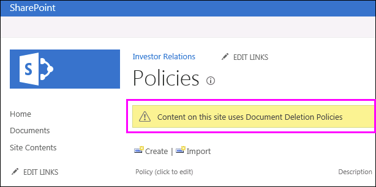
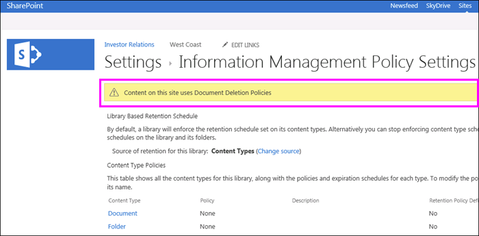

# Aplicar o quitar una directiva de eliminación de documentos de un sitioApply or remove a document deletion policy for a site

Las organizaciones suelen estar sujetas a normas de cumplimiento, leyes u otras regulaciones que las obligan a conservar sus documentos durante un período de tiempo.Organizations are often subject to compliance, legal, or other regulations that require them to retain documents for a certain period of time. Sin embargo, conservar los documentos durante más tiempo de lo necesario puede exponer a la organización a riesgos de carácter legal.However, retaining documents for longer than required can expose the organization to legal risk. Por este motivo, es posible que su organización haya creado una directiva de eliminación de&mdash;documentos para el sitio, por ejemplo, puede que sea necesario que los documentos generales de negocio se eliminen cinco años después de su creación.For this reason, your organization may have created a document deletion policy for your site&mdash;for example, general business documents might be required to be deleted five years after they were created.
  
Dependiendo de la organización, una directiva de eliminación de documentos puede ser:Depending on your organization, a document deletion policy might be:
  
- **Obligatorio** El propietario de un sitio no puede optar por una directiva obligatoria, que se aplica automáticamente al sitio.**Mandatory** A site owner can't opt out of a mandatory policy, which is automatically applied to the site. 
    
- **Predeterminada** Una directiva predeterminada se aplica automáticamente a un sitio, pero el propietario de dicho sitio puede:**Default** A default policy is automatically applied to a site, but a site owner can: 
    
  - Elegir otra directiva, si la hay.Choose another policy if available.
    
  - No participar en la Directiva en su totalidad si no es relevante para el contenido del sitio.Opt out of the policy entirely if it isn't relevant to the content in the site.
    
- **Ni obligatoria ni predeterminada** En este caso, no se aplica ninguna directiva al sitio automáticamente, y el propietario debe aplicarla de forma manual.**Neither mandatory nor default** In this case, no policy is automatically applied to the site, and the site owner needs to take action to apply one. 
    
Una directiva de eliminación de documentos puede contener más de&mdash;una regla por ejemplo, una regla puede decir eliminar documentos un año después de su creación, pero otra regla puede decir eliminar documentos un año después de que se modificaron por última vez.A document deletion policy may contain more than one rule&mdash;for example, one rule might say delete documents one year after they were created, but another rule might say delete documents one year after they were last modified. Si una directiva contiene más de una regla, puede seleccionar la que se ajuste mejor al sitio.If a policy contains more than one rule, you can select the rule that best applies to your site. La regla de eliminación se aplicará a todas las bibliotecas del sitio.The delete rule will be applied to all libraries within the site. Solo puede haber una directiva y una regla activas en un sitio al mismo tiempo.Only one policy and one rule can be active in a site at one time. Al igual que una directiva, una regla se puede establecer como predeterminada para que se aplique automáticamente cuando se aplica la Directiva.Like a policy, a rule can be set as default, so that it's applied automatically when the policy is applied.
  
Por último, las directivas de eliminación de documentos son heredadas. Cuando se selecciona una directiva o regla para un sitio, todos los subsitios heredan esa selección, a menos que el propietario de un subsitio interrumpa la herencia seleccionando una directiva o regla distinta. Cuando seleccione una directiva o regla, tenga en cuenta el contenido de los subsitios del sitio.Finally, document deletion policies are inherited. When you select a policy or rule for your site, that selection is inherited by all subsites, although an owner of a subsite can break inheritance by selecting a different policy or rule. When you select a policy or rule, consider the content of any subsites below your site.
  
## Ver las directivas de eliminación de documentos disponibles en una colección de sitiosView the document deletion policies available in a site collection

Su organización puede asignar distintas directivas a colecciones de sitios diferentes. En el nivel de colección de sitios, el propietario de una colección de sitios puede ver todas las directivas de eliminación de documentos disponibles para esa colección concreta. Las directivas pueden estar disponibles para la plantilla de la colección de sitios (y, por tanto, para todas las colecciones de sitios creadas a partir de esta plantilla) o para esta colección de sitios específica.Your organization may assign different policies to different site collections. At the site collection level, an owner of a site collection can view all of the document deletion policies that are available to that site collection. The policies may have been made available to the site collection template (and therefore all site collections created from this template) or to this specific site collection.
  
1. En el sitio de nivel superior de la colección de sitios, en la esquina superior derecha, elija **configuración** del \> **sitio**[icono de engranaje].In the top-level site in the site collection, in the upper-right corner, choose **Settings** [gear icon] \> **Site Settings**.
    
2. En **directivas de eliminación de documentos**de administración \> de la colección de **sitios** .Under **Site Collection Administration** \> **Document Deletion Policies**.
    
    > [!NOTE]
    > El vínculo **directivas de eliminación de documentos** no aparecerá a menos que se hayan asignado directivas a la colección de sitios.The **Document Deletion Policies** link won't appear unless policies have been assigned to the site collection. Además, el vínculo no aparece inmediatamente después de que las directivas se hayan asignado al sitio: puede tardar hasta 24 horas desde el momento en que se asignan las directivas cuando aparece el vínculo **directivas de eliminación de documentos** .Also, the link doesn't appear immediately after policies have been assigned to the site — it can take up to 24 hours from when the policies are assigned to when the **Document Deletion Policies** link appears. 
  
3. En esta página, puede ver lo siguiente:On this page you can view:
    
  - Las directivas asignadas actualmente y las reglas asociadas. Seleccione una directiva para ver las reglas en el panel derecho.The currently assigned policies and the associated rules. Select a policy to view the rules in the right pane.
    
  - Si existe una directiva predeterminada, se muestra **Sí** en la columna **Predeterminada**.The default policy, if any, displays **Yes** in the **Default** column. 
    
  - Si la directiva se ha asignado como **Obligatoria**, se muestra un mensaje debajo de la lista.A message is displayed below the list if the policy has been assigned as **Mandatory**.
    
Esta lista es solo para consulta, para que el propietario de la colección de sitios pueda ver todas las directivas y reglas disponibles. Para aplicar una directiva, consulte la sección siguiente.This list is view only, for the site collection owner to see all of the available policies and rules. To apply a policy, see the next section.
  

  
## Aplicar o quitar una directiva de eliminación de documentos de un sitioApply or remove a document deletion policy for a site

Como propietario del sitio o propietario de la colección de sitios, su organización puede haber creado directivas que puede aplicar al sitio o anular por completo.As a site owner or site collection owner, your organization may have created policies that you can either apply to your site or opt out of entirely.
  
1. En la esquina superior derecha, elija **configuración** del \> **sitio**[icono de engranaje].In the upper-right corner, choose **Settings** [gear icon] \> **Site Settings**.
    
2. En **directivas de eliminación de documentos**de administración \> del **sitio** .Under **Site Administration** \> **Document Deletion Policies**.
    
    > [!NOTE]
    > El vínculo **directivas de eliminación de documentos** no aparecerá a menos que se hayan asignado directivas a la colección de sitios.The **Document Deletion Policies** link won't appear unless policies have been assigned to the site collection. Además, el vínculo no aparece inmediatamente después de que las directivas se hayan asignado al sitio: puede tardar hasta 24 horas desde el momento en que se asignan las directivas cuando aparece el vínculo **directivas de eliminación de documentos** .Also, the link doesn't appear immediately after policies have been assigned to the site — it can take up to 24 hours from when the policies are assigned to when the **Document Deletion Policies** link appears. 
  
3. Realice una de las acciones siguientes:Do one of the following:
    
  - **Para aplicar una directiva** Seleccione una directiva \> Seleccione una regla en esa directiva \> **Guardar**.**To apply a policy** Select a policy \> select a rule in that policy \> **Save**.
    
    Solo puede haber una directiva y una regla activas en un sitio al mismo tiempo. Su organización puede proporcionar varias directivas y reglas para elegir o solo una directiva o regla.Only one policy and one rule can be active in a site at one time. Your organization may provide several policies and rules to choose from, or only one policy or rule.
    
    
  
  - **Para dejar de participar en una directiva** Elija **no participar: Nota eliminar** \> **Guardar**.**To opt out of a policy** Choose **Opt-Out: Do Note Delete** \> **Save**.
    
    Como propietario de un sitio, puede rechazar una directiva de eliminación de documentos si determina que la Directiva no se aplica al contenido de su sitio.As a site owner, you can opt out of a document deletion policy if you determine that the policy isn't applicable to the content in your site. Sin embargo, no puede optar por no participar en una directiva que se haya marcado como **obligatoria**.However, you can't opt out of a policy that has been marked as **Mandatory**.
    
    
  
## Las directivas de eliminación de documentos invalidan otras directivasDocument deletion policies override other policies

Un sitio puede usar otras directivas para la retención y eliminación de contenido:A site may use other policies for retaining and deleting content:
  
- Directivas de tipo de contenido para la colección de sitios.Content type policies for the site collection.
    
- Directivas de administración de la información para una lista o biblioteca.Information management policies for a list or library.
    
Si aplica una directiva de eliminación de documentos a un sitio que ya usa directivas de tipo de contenido o directivas de administración de información para una lista o biblioteca, dichas directivas se ignorarán mientras la directiva de eliminación de documentos esté activa.If you apply a document deletion policy to a site that already uses content type policies or information management policies for a list or library, those policies are ignored while the document deletion policy is in effect. Si se omiten otras directivas, verá el mensaje "el contenido de este sitio usa directivas de eliminación de documentos".If other policies are ignored, you'll see the message "Content on this site uses Document Deletion Policies".
  
Esto quiere decir que debe configurar un sitio de forma que solo utilice directivas creadas para contenido estructurado (directivas de administración de información y directivas de tipo de contenido) o contenido no estructurado (directivas de eliminación de documentos), pero no ambos.This means you should plan for a site to use only policies meant for structured content (information management policies and content type policies) or unstructured content (document deletion policies), not both. Si opta por no usar una directiva de eliminación de documentos, la advertencia no se mostrará y otros tipos de directivas seguirán funcionando.If you opt out of a document deletion policy, the warning won't be displayed and other types of policies will continue to work.
  
Las directivas del sitio no se verán afectadas por las directivas de eliminación de documentos.Site policies are not affected by document deletion policies.
  
### Determinar si se están ignorando las directivas de tipo de contenidoDetermine if content type policies are being ignored

Si el sitio estaba usando directivas de tipo de contenido y ahora ve este mensaje, esas directivas ya no se aplicarán.If your site was using content type policies and you now see this message, those policies are no longer in effect. Para restaurar las directivas de tipo de contenido, puede quitar la Directiva de eliminación de documentos del sitio, tal como se ha descrito anteriormente, si hay una opción de cancelación disponible.To restore the content type policies, you can remove the document deletion policy from your site, as described earlier, if there's an opt-out option available. Si no existe la opción de no participar, la Directiva de eliminación de documentos es obligatoria y deberá ponerse en contacto con el responsable de cumplimiento de su organización.If there's no option to opt out, the document deletion policy is mandatory, and you need to contact the compliance officer in your organization.
  
1. En la esquina superior derecha, elija **configuración** del \> **sitio**[icono de engranaje].In the upper-right corner, choose **Settings** [gear icon] \> **Site Settings**.
    
2. En **plantillas de directiva de tipo de contenido**de administración \> de **sitio** .Under **Site Administration** \> **Content Type Policy Templates**.
    
    
  
### Determinar si se están ignorando las directivas de administración de informaciónDetermine if information management policies are being ignored

Si el sitio estaba usando directivas de administración de la información y ahora ve este mensaje, esas directivas ya no se aplicarán.If your site was using information management policies and you now see this message, those policies are no longer in effect. Para restaurar las directivas de administración de la información, puede quitar la Directiva de eliminación de documentos del sitio, como se ha descrito anteriormente, si hay una opción de cancelación disponible.To restore the information management policies, you can remove the document deletion policy from your site, as described earlier, if there's an opt-out option available. Si no existe la opción de no participar, la Directiva de eliminación de documentos es obligatoria y deberá ponerse en contacto con el responsable de cumplimiento de su organización.If there's no option to opt out, the document deletion policy is mandatory, and you need to contact the compliance officer in your organization.
  
- Para una lista o biblioteca, en la biblioteca \> de la \> ficha **biblioteca** de la cinta de **Opciones Configuración** \> de la **Directiva** **permisos y** \> administración de información de administración.For a list or library, on the Ribbon \> **Library** tab \> **Library Settings** \> under **Permissions and Management** \> **Information Management Policy Settings**.
    
    
  
## Vea tambiénSee also

[Overview of document deletion policies](document-deletion-policies.md) (Información general sobre las directivas de eliminación de documentos)[Overview of document deletion policies](document-deletion-policies.md)
  
[Crear una directiva de eliminación de documentosCreate a document deletion policy](create-a-document-deletion-policy.md)

