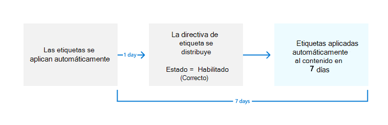

# <a name="automatically-apply-a-retention-label-to-retain-or-delete-content"></a>Aplicar una etiqueta de retención automáticamente para conservar o eliminar contenido

>*[Instrucciones de licencias de Microsoft 365 para la seguridad y el cumplimiento](/office365/servicedescriptions/microsoft-365-service-descriptions/microsoft-365-tenantlevel-services-licensing-guidance/microsoft-365-security-compliance-licensing-guidance).*

> [!NOTE]
> Este escenario no se admite para [registros normativos](records-management.md#records) o etiquetas predeterminadas para una estructura de organización, como un conjunto de documentos o una biblioteca en SharePoint, o una carpeta en Exchange. Estos escenarios requieren una [directiva de etiqueta de retención publicada](create-apply-retention-labels.md).

Una de las características más útiles de las [etiquetas de retención](retention.md) es la capacidad de aplicarlas automáticamente a contenido que coincida con las condiciones especificadas. En ese caso, los usuarios de su organización no necesitan aplicar las etiquetas de retención. Microsoft 365 lo hace automáticamente.
  
Las etiquetas de retención auto aplicadas son poderosas porque:
  
- No es necesario formar a los usuarios para que conozcan todas las clasificaciones.
    
- No es necesario depender de los usuarios para clasificar todo el contenido correctamente.
    
- Los usuarios ya no necesitan conocer las directivas de gobierno de datos; en su lugar, pueden centrarse en su trabajo.
    
Puede aplicar etiquetas de retención al contenido automáticamente cuando ese contenido aún no tiene aplicada una etiqueta de retención y contiene información confidencial, palabras clave o propiedades que permiten búsquedas, o una coincidencia para [clasificadores entrenables](classifier-get-started-with.md). Ahora en versión preliminar, también puede aplicar automáticamente una etiqueta de retención a los datos adjuntos en la nube que se almacenan en SharePoint o OneDrive.

> [!TIP]
> Use las propiedades que se pueden buscar para identificar [Grabaciones de reuniones de Teams](#microsoft-teams-meeting-recordings) y [elementos que tienen aplicada una etiqueta de confidencialidad](#identify-files-and-emails-that-have-a-sensitivity-label).

Los procesos para aplicar automáticamente una etiqueta de retención se basan en estas condiciones:


Utilice las siguientes instrucciones para los dos pasos de administrador.

> [!NOTE]
> Las directivas automáticas emplean etiquetado del lado del servicio con condiciones para aplicar etiquetas de retención a los elementos automáticamente. También puede aplicar automáticamente una etiqueta de retención con una directiva de etiqueta al hacer lo siguiente: 
>
> - Puede aplicar fácilmente una etiqueta de retención a un modelo de comprensión mediante documentos en SharePoint Syntex.
> - Aplicar una etiqueta de retención predeterminada para SharePoint y Outlook
> - Aplicar una etiqueta de retención al correo electrónico mediante el uso de reglas de Outlook
>
> Para estos escenarios, consulte [Publicar etiquetas de retención y aplicarlas en aplicaciones](create-apply-retention-labels.md).

## <a name="before-you-begin"></a>Antes de empezar

El administrador global de su organización tiene permisos totales para crear y modificar etiquetas de retención y las directivas de las mismas. Si no inicia sesión como administrador global, consulte la información de permisos para la [administración de registros](get-started-with-records-management.md#permissions) o la [gobernanza de la información](get-started-with-information-governance.md#permissions-for-retention-policies-and-retention-labels), en función de la solución que use.

Asegúrese de que ha [creado las etiquetas de retención](file-plan-manager.md#create-retention-labels) que desea aplicar a los elementos.

## <a name="how-to-create-an-auto-apply-retention-label-policy"></a>Cómo crear una directiva de etiqueta de retención que se aplique de forma automática

Antes de crear la directiva de etiqueta de retención, decida si será **adaptable** o **estática**. Para obtener más información, vea [Ámbitos de directivas adaptables o estáticas para retención](retention.md#adaptive-or-static-policy-scopes-for-retention). Si decide usar una directiva adaptable, debe crear uno o más ámbitos adaptables antes de crear la directiva de etiqueta de retención. Luego deberá seleccionarlos durante el proceso de creación de directivas de etiqueta de retención. Para obtener instrucciones, vea [Información de configuración para ámbitos adaptables](retention-settings.md#configuration-information-for-adaptive-scopes).

Cuando se crea una directiva de aplicación automática, se selecciona una etiqueta de retención para aplicarla automáticamente a contenido, en función de las condiciones especificadas.

1. En el [Centro de cumplimiento de Microsoft 365](https://compliance.microsoft.com/), desplácese hasta una de las siguientes locaciones:
    
    - Si utiliza la administración de registros:
        - **Soluciones** > **Administración de registros** > > pestaña **Directivas de etiquetas** > **Aplicar automáticamente una etiqueta**
    
    - Si usa el gobierno de la información:
        - **Soluciones** > **Gobierno de información** > pestaña de **Directivas de etiquetas** > **Aplicar etiqueta automáticamente**
    
    ¿No encuentra inmediatamente la solución en el panel de navegación? Primero, seleccione **Mostrar todo**.

2. Escriba un nombre y una descripción para esta directiva de etiquetado automático y, a continuación, seleccione **Siguiente**.

3. Para **Elegir el tipo de contenido al que desea aplicar esta etiqueta**, seleccione una de las condiciones disponibles. Para obtener más información sobre las opciones, vea la sección [Configurar condiciones para etiquetas automáticas de retención](#configuring-conditions-for-auto-apply-retention-labels) de esta página.

4. En la página **Elegir el tipo de directiva de retención que desea crear**, seleccione **Adaptable** o **Estática**, en función de lo que haya elegido en las instrucciones de [Antes de empezar](#before-you-begin). Si aún no ha creado ámbitos adaptables, podrá seleccionar **Adaptable**, pero no habrá ámbitos adaptables que seleccionar, por lo tanto no podrá finalizar el asistente con esta opción.

5. Según el ámbito seleccionado:
    
    - Si ha elegido **Adaptable**: en la página **Elegir ámbitos y ubicaciones de directivas adaptables**, seleccione **Agregar ámbitos** y seleccione uno o varios ámbitos adaptables que se hayan creado. A continuación, seleccione una o más ubicaciones. Las ubicaciones que podrá seleccionar dependen de los [tipos de ámbito](retention-settings.md#configuration-information-for-adaptive-scopes) que se hayan agregado. Por ejemplo, si solo ha agregado un tipo de ámbito de **Usuario**, podrá seleccionar **correo de Exchange** pero no **sitios de SharePoint**. 
    
    - Si ha elegido **Estático**: en la página **Elegir ubicaciones**, active o desactive cualquiera de las ubicaciones. Para cada ubicación, puede dejar de forma predeterminada [aplicar la directiva a toda la ubicación](retention-settings.md#a-policy-that-applies-to-entire-locations), o [especificar lo que se incluye y excluye](retention-settings.md#a-policy-with-specific-inclusions-or-exclusions)
    
    Para obtener información sobre las opciones de ubicación, vea [Ubicaciones](retention-settings.md#locations).

6. Siga las indicaciones del asistente para seleccionar una etiqueta de retención y, a continuación, revise y envíe las opciones de configuración.

Para editar una directiva de etiqueta de retención existente (el tipo de directiva es **aplicar automáticamente**), selecciónela y, a continuación, seleccione la opción **Editar** para iniciar la configuración de **Editar directiva de retención**.

Después de etiquetar el contenido con una directiva de la etiqueta de aplicación automática, la etiqueta aplicada no se puede quitar o cambiar automáticamente cambiando el contenido o la directiva, o mediante una nueva directiva de etiqueta de aplicación automática. Para obtener más información, consulte [Solo una etiqueta de retención a la vez](retention.md#only-one-retention-label-at-a-time).

> [!NOTE]
> Una directiva de etiqueta de retención de aplicación automática nunca reemplazará una etiqueta de retención existente que se aplique al contenido. Si quiere volver a etiquetar el contenido mediante las condiciones que configure, deberá quitar manualmente la etiqueta de retención actual del contenido existente.

### <a name="configuring-conditions-for-auto-apply-retention-labels"></a>Configurar las condiciones para la aplicación automática de etiquetas de retención

Puede aplicar etiquetas de retención al contenido automáticamente cuando éste contiene:

- [Tipos específicos de información confidencial](#auto-apply-labels-to-content-with-specific-types-of-sensitive-information)

- [Palabras clave específicas o propiedades que permiten búsquedas que coinciden con una consulta que usted creó](#auto-apply-labels-to-content-with-keywords-or-searchable-properties)

- [Una coincidencia para clasificadores que se pueden entrenar](#auto-apply-labels-to-content-by-using-trainable-classifiers)

O bien, puede aplicar automáticamente etiquetas de retención a los [datos adjuntos de nube](#auto-apply-labels-to-cloud-attachments) recién compartidos.

Cuando configure etiquetas de retención para que se apliquen automáticamente en función de información confidencial, palabras clave o propiedades de búsqueda, o clasificadores entrenables, utilice la siguiente tabla para identificar cuándo se pueden aplicar automáticamente las etiquetas de retención.

Exchange:

|Condición|Elementos en tránsito (enviados o recibidos) |Elementos existentes (datos en reposo)|
|:-----|:-----|:-----|
|Tipos de información confidencial: integrado| Sí | No |
|Tipos de información confidencial: personalizado| Sí | No |
|Palabras clave específicas o propiedades que se pueden buscar| Sí |Sí |
|Clasificadores que se pueden entrenar| Sí | Sí (solo los últimos seis meses) |

SharePoint y OneDrive:

|Condición|Elementos nuevos o modificados |Elementos existentes |
|:-----|:-----|:-----|
|Tipos de información confidencial: integrado| Sí | Sí |
|Tipos de información confidencial: personalizado| Sí | No |
|Palabras clave específicas o propiedades que se pueden buscar| Sí |Sí |
|Clasificadores que se pueden entrenar| Sí | Sí (solo los últimos seis meses) |

Además, los elementos de SharePoint que están en borrador o que nunca se han publicado no se admiten para este escenario.

#### <a name="auto-apply-labels-to-content-with-specific-types-of-sensitive-information"></a>Aplicar automáticamente etiquetas a los contenidos con tipos específicos de información sensible

> [!IMPORTANT]
> En el caso de los correos electrónicos que se aplican automáticamente mediante la identificación de información confidencial, se incluyen automáticamente todos los buzones, incluidos los buzones de Microsoft 365 grupos.
> 
> Aunque los buzones de grupo normalmente se incluirían seleccionando la ubicación **Grupos de Microsoft 365**, para esta configuración de directiva específica, la ubicación de grupos solo incluye sitios de SharePoint conectados a un grupo de Microsoft 365.

Al crear directivas de etiquetas de retención de aplicación automática para información confidencial, verá la misma lista de plantillas de directiva que cuando se crea una directiva de prevención de pérdida de datos (DLP). Cada plantilla está preconfigurada para buscar determinados tipos de información confidencial. En el siguiente ejemplo, los tipos de información confidencial son de la categoría **Privacidad**, y **la plantilla de datos de información personal identificable (PII) de Estados Unidos** :


Para obtener más información sobre los tipos de información de confidencialidad, consulte [Obtener información sobre los tipos de información confidencial](sensitive-information-type-learn-about.md#learn-about-sensitive-information-types). Actualmente, los [tipos de información confidencial basados en coincidencias de datos exactas](sit-learn-about-exact-data-match-based-sits.md#learn-about-exact-data-match-based-sensitive-information-types) y la [creación de huella digital de documento](document-fingerprinting.md) no están admitidos en este escenario.

Después de seleccionar una plantilla de política, puede añadir o eliminar cualquier tipo de información sensible, y puede cambiar el nivel de confianza y el recuento de instancias. En la captura de pantalla del ejemplo anterior, estas opciones se han cambiado para que se aplique automáticamente una etiqueta de retención sólo cuando:
  
- El tipo de información confidencial que se detecta tiene una precisión de coincidencia (o [nivel de confianza](sensitive-information-type-learn-about.md#more-on-confidence-levels)) de al menos **Confianza media** para dos de los tipos de información confidencial y **Confianza alta** para uno. Muchos tipos de información confidencial se definen con varios patrones, donde un patrón con una mayor precisión de coincidencia requiere que se encuentren más evidencias (como palabras clave, fechas o direcciones), mientras que un patrón con una precisión de coincidencia inferior requiere menos evidencia. Cuanto menor sea el nivel de confianza, más fácil será que el contenido coincida con la condición, pero con el potencial de que se produzcan más falsos positivos.

- El contenido tiene entre 1 y 9 instancias de cualquiera de estos tres tipos de información confidencial. El valor predeterminado para **a** es **Cualquiera**.

Para obtener más información sobre estas opciones, consulte las siguientes instrucciones de la documentación DLP: [Ajustar las reglas para que sea más o menos fácil que coincidan](data-loss-prevention-policies.md#tuning-rules-to-make-them-easier-or-harder-to-match).

> [!IMPORTANT]
> Los tipos de información confidencial tienen dos formas diferentes de definir los parámetros máximos de recuento de instancias únicas. Para obtener más información, consulte [Valores admitidos de recuento de instancias para SIT](create-a-custom-sensitive-information-type.md#instance-count-supported-values-for-sit).

Que debe tener en cuenta al usar tipos de información confidencial para aplicar las etiquetas de retención automáticamente:

- Si usa tipos personalizados de información confidencial, estos no pueden etiquetar automáticamente los elementos existentes en SharePoint y OneDrive.

- En el caso de los correos electrónicos, no puede seleccionar destinatarios específicos para incluirlos o excluirlos; solo se admite la configuración **Todos los destinatarios** y, solo para esta configuración, incluye buzones de grupos de Microsoft 365. 

#### <a name="auto-apply-labels-to-content-with-keywords-or-searchable-properties"></a>Aplicar automáticamente etiquetas a contenido con palabras clave o propiedades que se puedan buscar

Puede aplicar etiquetas automáticamente al contenido mediante una consulta que contenga palabras, frases o valores de propiedades que permiten búsquedas específicos. Puede restringir la consulta con operadores de búsqueda como Y, O y NO.


Para obtener más información sobre la sintaxis de consulta que usa el Lenguaje de consultas de palabras clave (KQL), vea [Referencia de la sintaxis del Lenguaje de consultas de palabras clave (KQL)](/sharepoint/dev/general-development/keyword-query-language-kql-syntax-reference).

Las directivas de aplicación automática basadas en consultas usan el mismo índice de búsqueda que la búsqueda de contenido en eDiscovery para identificar el contenido. Para obtener más información sobre las propiedades utilizables en búsqueda que puede usar, vea [Consultas de palabras clave y condiciones de búsqueda para la Búsqueda de contenido](keyword-queries-and-search-conditions.md).

Aspectos que debe tener en cuenta al usar palabras clave o propiedades utilizables en búsqueda para las etiquetas de retención de aplicación automática:

- Para SharePoint, las propiedades rastreadas y las propiedades personalizadas no son compatibles con estas consultas de KQL y solo debe usar propiedades administradas predefinidas para documentos. Sin embargo, puede usar las asignaciones en el nivel de espacio empresarial con las propiedades administradas predefinidas que se habilitan como refinadores de forma predeterminada (RefinableDate00-19, RefinableString00-99, RefinableInt00-49, RefinableDecimals00-09 y RefinableDouble00-09). Para obtener más información, vea [Información general de propiedades administradas y rastreadas en SharePoint Server](/SharePoint/technical-reference/crawled-and-managed-properties-overview) y para obtener instrucciones, consulte [Crear una nueva propiedad administrada](/sharepoint/manage-search-schema#create-a-new-managed-property).

- Si asigna una propiedad personalizada a una de las propiedades de refinador, espere 24 horas antes de usarla en la consulta de KQL para una etiqueta de retención.

- Aunque se puede cambiar el nombre de las propiedades administradas de SharePoint mediante alias, no los use para las consultas de KQL en las etiquetas. Siempre debe especificar el nombre real de la propiedad administrada, por ejemplo, "RefinableString01".

- Para buscar valores que contengan espacios o caracteres especiales, use comillas dobles (`" "`) en la frase. Por ejemplo, `subject:"Financial Statements"`.

- Use la propiedad *DocumentLink* en lugar de *Path* para hacer coincidir un elemento basándose en su URL. 

- No se admiten las búsquedas con caracteres comodín de sufijo (como `*cat`) o las búsquedas con caracteres comodín de subcadena (como `*cat*`). Sin embargo, se admiten las búsquedas comodín de prefijo (como `cat*`).

- Tenga en cuenta que los elementos parcialmente indexados pueden causar que no se etiqueten los elementos que espera, o que se etiqueten elementos que esperaba excluir de la etiquetación cuando use el operador NOT. Para obtener más información, consulte [Elementos parcialmente indexados en la Búsqueda de contenido](partially-indexed-items-in-content-search.md).


Consultas de ejemplos:

| Carga de trabajo | Ejemplo |
|:-----|:-----|
|Exchange   | `subject:"Financial Statements"` |
|Exchange   | `recipients:garthf@contoso.com` |
|SharePoint | `contenttype:document` |
|SharePoint | `site:https://contoso.sharepoint.com/sites/teams/procurement AND contenttype:document`|
|Exchange o SharePoint | `"customer information" OR "private"`|

Ejemplos más complejos:

La siguiente consulta para SharePoint identifica documentos de Word u hojas de cálculo de Excel cuando contienen las palabras clave **contraseña**, **contraseñas** o **clave**:

```
(password OR passwords OR pw) AND (filetype:doc* OR filetype:xls*)
```

La siguiente consulta para Exchange identifica cualquier documento de Word o PDF que contenga la palabra **nda** o la frase **acuerdo de no divulgación** cuando estos documentos se adjuntan a un correo electrónico:

```
(nda OR "non disclosure agreement") AND (attachmentnames:.doc* OR attachmentnames:.pdf)
```

La siguiente consulta para SharePoint identifica documentos que contienen un número de tarjeta de crédito: 

```
sensitivetype:"credit card number"
```

La siguiente consulta contiene algunas de las palabras clave típicas para identificar documentos o correos electrónicos que incluyan contenido legal válido:

```
ACP OR (Attorney Client Privilege*) OR (AC Privilege)
```

La siguiente consulta contiene palabras clave típicas para identificar documentos o correos electrónicos para recursos humanos: 

```
(resume AND staff AND employee AND salary AND recruitment AND candidate)
```

Tenga en cuenta que este último ejemplo usa el procedimiento recomendado para incluir siempre operadores entre palabras clave. Usar un espacio entre palabras clave (o dos expresiones propiedad:valor) es igual que usar AND. Al ir agregando los operadores, resulta más fácil ver que esta consulta de ejemplo identifica solo contenido que incluya todas las palabras clave, y no contenido con solo alguna de ellas. Si su intención es identificar el contenido que incluya alguna de las palabras clave, especifique OR en lugar de AND. Como se muestra en este ejemplo, al especificar siempre los operadores, es más fácil interpretarlos correctamente. 

##### <a name="microsoft-teams-meeting-recordings"></a>Grabaciones de reuniones de Microsoft Teams

> [!NOTE]
> La posibilidad de conservar y eliminar las grabaciones de reuniones de Teams no funcionará antes de guardar las grabaciones en OneDrive o SharePoint. Para más información, consulte [Usar OneDrive para la Empresa y SharePoint Online o Stream para las grabaciones de reuniones](/MicrosoftTeams/tmr-meeting-recording-change).

Para identificar las grabaciones de reuniones de Microsoft Teams almacenadas en cuentas de OneDrive de los usuarios o en SharePoint, especifique lo siguiente para el **Editor de consultas de palabras clave**:

```
ProgID:Media AND ProgID:Meeting
```

La mayoría de las veces, las grabaciones de reuniones se guardan en OneDrive. Pero, en el caso de las reuniones de canal, las grabaciones se guardan en SharePoint.

##### <a name="identify-files-and-emails-that-have-a-sensitivity-label"></a>Identificar los archivos y correos electrónicos que tienen una etiqueta de confidencialidad

Para identificar archivos en los correos electrónicos de SharePoint o OneDrive y Exchange que tienen aplicada una [etiqueta de confidencialidad](sensitivity-labels.md), especifique lo siguiente para el **Editor de consultas de palabras clave**:

```
InformationProtectionLabelId:<GUID>
```

Para buscar el GUID, use el cmdlet [Get-Label](/powershell/module/exchange/get-label) de [PowerShell del Centro de seguridad y cumplimiento](/powershell/exchange/scc-powershell):

````powershell
Get-Label | Format-Table -Property DisplayName, Name, Guid
````

#### <a name="auto-apply-labels-to-content-by-using-trainable-classifiers"></a>Aplicar automáticamente etiquetas al contenido con clasificadores que se pueden entrenar

Al elegir la opción de un clasificador que se puede entrenar, puede seleccionar uno o varios de los clasificadores entrenados previamente o personalizados:


> [!CAUTION]
> Estamos desaprobando el clasificador **de lenguaje ofensivo** entrenado previamente porque ha estado produciendo un gran número de falsos positivos. No use este clasificador y, si lo usa actualmente, le recomendamos que desactive los procesos empresariales y, en su lugar, use los clasificadores preentrenados **de acoso dirigido**, **blasfemias** y **amenazas**.

Para aplicar una etiqueta automáticamente usando esta opción, los buzones y sitios de SharePoint deben tener al menos 10 MB de datos.

Para más información sobre los clasificadores que se pueden entrenar, consulte [Información sobre los clasificadores que se pueden entrenar (versión preliminar)](classifier-learn-about.md).

> [!TIP]
> Si usa clasificadores que se pueden entrenar para Exchange, consulte [Cómo volver a entrenar a un clasificador en el explorador de contenido (versión preliminar)](classifier-how-to-retrain-content-explorer.md).

Que debe tener en cuenta al usar clasificadores que se pueden entrenar para aplicar las etiquetas de retención automáticamente:

- No puede etiquetar automáticamente los elementos de SharePoint y OneDrive que tengan más de seis meses.

#### <a name="auto-apply-labels-to-cloud-attachments"></a>Aplicar etiquetas automáticamente a datos adjuntos en la nube

> [!NOTE]
> Esta opción se está implementando gradualmente en versión preliminar y está sujeta a cambios.

Es posible que tenga que usar esta opción si tiene que capturar y conservar todas las copias de los archivos del inquilino que los usuarios envían a través de comunicaciones. Use esta opción junto con las directivas de retención para los propios servicios de comunicación, Exchange y Teams.

> [!IMPORTANT]
> Al seleccionar una etiqueta que se usará para aplicar automáticamente etiquetas de retención para datos adjuntos en la nube, asegúrese de que la configuración de retención de etiquetas **Iniciar el período de retención basado en** es **Cuando se etiquetaron los elementos**.

Los datos adjuntos en la nube, a veces también conocidos como datos adjuntos modernos, son un mecanismo de uso compartido que usa vínculos incrustados a archivos almacenados en la nube. Admiten el almacenamiento centralizado para contenido compartido con ventajas colaborativas, como el control de versiones. Los datos adjuntos en la nube no son copias adjuntas de un archivo o un vínculo de texto de dirección URL a un archivo. Es posible que le resulte útil consultar las listas de comprobación visuales de los datos adjuntos en la nube admitidos en [Outlook](/office365/troubleshoot/retention/cannot-retain-cloud-attachments#cloud-attachments-in-outlook) y [Teams](/office365/troubleshoot/retention/cannot-retain-cloud-attachments#cloud-attachments-in-teams).

Al elegir la opción de aplicar una etiqueta de retención a los datos adjuntos de la nube, para fines de cumplimiento, se crea una copia de ese archivo en el momento de compartir. A continuación, la etiqueta de retención seleccionada se aplica a la copia que se puede identificar mediante eDiscovery. Los usuarios no conocen la copia almacenada en la biblioteca de conservación de documentos. La etiqueta de retención no se aplica al mensaje en sí ni al archivo original.

Si el archivo se modifica y se comparte de nuevo, se guarda una nueva copia del archivo como una nueva versión en la biblioteca de conservación de documentos. Para obtener más información, incluido el motivo por el que debe usar la configuración de etiqueta **Cuándo se etiquetaron los elementos**, consulte [Cómo funciona la retención con archivos adjuntos en la nube](retention-policies-sharepoint.md#how-retention-works-with-cloud-attachments).

Los datos adjuntos en la nube admitidos para esta opción son archivos como documentos, vídeos e imágenes que se almacenan en SharePoint y OneDrive. Para Teams, se admiten datos adjuntos en la nube compartidos en mensajes de chat y canales estándar y privados. No se admiten los datos adjuntos en la nube compartidos en invitaciones a reuniones y aplicaciones distintas de Teams o Outlook. Los usuarios deben compartir los datos adjuntos de la nube. No se admiten los datos adjuntos en la nube enviados a través de bots.

Aunque no es necesario para esta opción, se recomienda asegurarse de que el control de versiones está habilitado para los sitios de SharePoint y las cuentas de OneDrive para que la versión compartida se pueda capturar con precisión. Si el control de versiones no está habilitado, se conservará la última versión disponible. No se admiten los documentos en borrador o que nunca se han publicado.

Al seleccionar una etiqueta que se usará para aplicar automáticamente etiquetas de retención para datos adjuntos en la nube, asegúrese de que la configuración de retención de etiquetas **Iniciar el período de retención en función de** es **Cuando se etiquetaron los elementos**. 

Al configurar las ubicaciones para esta opción, puede seleccionar:

- **SharePoint** para archivos compartidos almacenados en sitios de comunicación de SharePoint, sitios de grupo que no están conectados por grupos de Microsoft 365 y sitios clásicos. 
- **Grupos de Microsoft 365** para los archivos compartidos que se almacenan en sitios de grupo conectados por grupos de Microsoft 365.
- **Cuentas de OneDrive** para los archivos compartidos almacenados en OneDrive de los usuarios.

Tendrá que crear directivas de retención independientes si desea conservar o eliminar los archivos originales, los mensajes de correo electrónico o los mensajes de Teams.

> [!NOTE]
> Si desea que los datos adjuntos en la nube retenidos expiren al mismo tiempo que los mensajes que los contienen, configure la etiqueta de retención para que tenga la misma retención y, a continuación, elimine las acciones y los intervalos que las directivas de retención para Exchange y Teams.

Para tener en cuenta al aplicar automáticamente etiquetas de retención a datos adjuntos en la nube:

- Solo los datos adjuntos de nube recién compartidos se etiquetarán automáticamente para la retención.

- No se admiten los datos adjuntos en la nube compartidos fuera de Teams y Outlook.

- Los siguientes elementos no se admiten como datos adjuntos en la nube que se pueden conservar:
    - Sitios, páginas, listas, formularios, carpetas, conjuntos de documentos y páginas de OneNote de SharePoint.
    - Archivos compartidos por usuarios que no tienen acceso a esos archivos.
    - Archivos que se eliminan antes de que se envíen los datos adjuntos en la nube. Esto puede ocurrir si un usuario copia y pega datos adjuntos previamente compartidos desde otro mensaje, sin confirmar primero que el archivo sigue estando disponible. O bien, alguien reenvía un mensaje antiguo cuando se elimina el archivo.
    - Archivos compartidos por invitados o usuarios externos a la organización.
    - Archivos en borradores de mensajes de correo electrónico y mensajes que no se envían.
    - Archivos vacíos.

## <a name="how-long-it-takes-for-retention-labels-to-take-effect"></a>Tiempo que tardan las etiquetas de retención en aplicarse

Al aplicar automáticamente etiquetas de retención basadas en información confidencial, palabras clave o propiedades que permiten búsquedas, o clasificadores entrenables, las etiquetas de retención pueden tardar hasta siete días en aplicarse:
  


Si las etiquetas que esperaba no aparecen después de siete días, compruebe el **Estado** de la directiva de aplicación automática seleccionándola en la página **Directivas de etiqueta** en el Centro de cumplimiento. Si ve el estado como **Desactivado (error)** y, en los detalles de las ubicaciones, un mensaje indica que se está tardando más de lo esperado en implementar la directiva (para SharePoint) o en probar la implementación de la directiva (para OneDrive), pruebe a ejecutar el comando [Set-RetentionCompliancePolicy](/powershell/module/exchange/set-retentioncompliancepolicy) en PowerShell para volver a intentar la distribución de la directiva:

1. [Conéctese al Centro de seguridad y cumplimiento de PowerShell](/powershell/exchange/connect-to-scc-powershell).

2. Ejecute el siguiente comando:
    
    ```PowerShell
    Set-RetentionCompliancePolicy -Identity <policy name> -RetryDistribution
    ```

## <a name="updating-retention-labels-and-their-policies"></a>Actualización de las etiquetas de retención y de sus directivas

En el caso de las directivas de etiquetas de retención de aplicación automática configuradas para información confidencial, palabras clave o propiedades que se pueden buscar, o una coincidencia para clasificadores entrenables: cuando ya se aplica una etiqueta de retención de la directiva al contenido, se aplicará automáticamente un cambio en la configuración de la etiqueta seleccionada y la directiva a este contenido además del contenido que se haya identificado recientemente.

En el caso de las directivas de etiquetas de retención de aplicación automática configuradas para datos adjuntos en la nube: dado que esta directiva se aplica a los archivos recién compartidos en lugar de a los archivos existentes, un cambio en la configuración de la etiqueta y directiva seleccionadas se aplicará automáticamente solo al contenido recién compartido.

Después de crear y guardar la etiqueta o la directiva, no se pueden cambiar algunas opciones de configuración, entre las que se incluyen:
- Los nombres de las etiquetas de retención y sus directivas, el tipo de ámbito (adaptable o estático) y la configuración de retención, excepto el período de retención. Sin embargo, no se puede cambiar el período de retención cuando el período de retención se basa en cuándo se etiquetaron los elementos.
- La opción de marcar los elementos como un registro.

### <a name="deleting-retention-labels"></a>Eliminar etiquetas de retención

Puede eliminar las etiquetas de retención que no estén actualmente incluidas en ninguna directiva de etiquetas de retención, que no estén configuradas para la retención basada en eventos o que marquen elementos como registros normativos.

En el caso de las etiquetas de retención que sí puede eliminar, si fueron aplicadas a los elementos, se producirá un error en la eliminación y aparece un vínculo al explorador de contenido para identificar los elementos etiquetados.

Sin embargo, podría tomarle hasta dos días al explorador de contenido mostrar los elementos que están etiquetados. En este escenario, es posible que la etiqueta de retención se elimine sin mostrarle el vínculo al explorador de contenido.

## <a name="locking-the-policy-to-prevent-changes"></a>Bloquear la directiva para impedir que se realicen cambios

Si necesita asegurarse de que nadie pueda inhabilitar la directiva, eliminar la directiva o hacer que sea menos restrictiva, consulte [Usar el Bloqueo de conservación para restringir los cambios en directivas de retención y directivas de etiquetas de retención](retention-preservation-lock.md).

## <a name="next-steps"></a>Siguientes pasos

Para ayudarle a realizar un seguimiento de las etiquetas aplicadas desde las directivas de etiquetado automático:

- [Supervisar las etiquetas de retención](retention.md#monitoring-retention-labels)
- [Usar la Búsqueda de contenido para encontrar todo el contenido relacionado con una etiqueta de retención específica](retention.md#using-content-search-to-find-all-content-with-a-specific-retention-label)
- [Auditoría de acciones de retención](retention.md#auditing-retention-actions)

Consulte [Usar las etiquetas de retención para administrar el ciclo de vida de los documentos almacenados en SharePoint](auto-apply-retention-labels-scenario.md) para obtener un escenario de ejemplo que usa una directiva de etiqueta de retención de aplicación automática con propiedades administradas en SharePoint y una retención basada en eventos para iniciar el período de retención.
