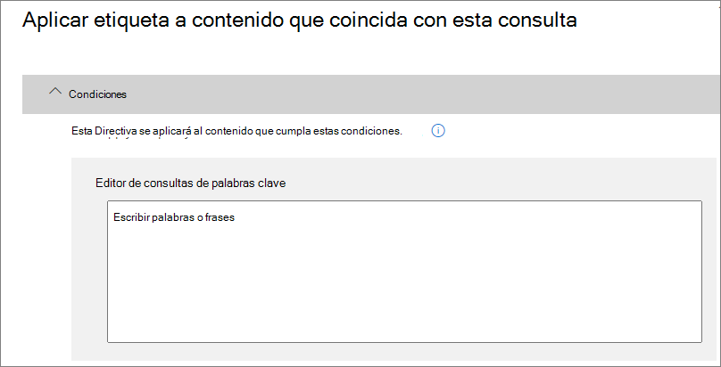

# Aplicar una etiqueta de retención automáticamente para conservar o eliminar contenido

>*[Instrucciones de licencias de Microsoft 365 para la seguridad y el cumplimiento](https://aka.ms/ComplianceSD).*

Una de las características más eficaces de las [etiquetas de retención](retention.md) es la capacidad de aplicarlas automáticamente al contenido que coincide con condiciones especificadas. En este caso, no es necesario que las personas de la organización apliquen las etiquetas de retención. Microsoft 365 realiza el trabajo por ellos.
  
Las etiquetas de retención auto aplicadas son poderosas porque:
  
- No es necesario formar a los usuarios para que conozcan todas las clasificaciones.
    
- No es necesario depender de los usuarios para clasificar todo el contenido correctamente.
    
- Los usuarios ya no necesitan conocer las directivas de gobierno de datos; en su lugar, pueden centrarse en su trabajo.
    
Las etiquetas de retención se pueden aplicar a contenido automáticamente cuando dicho contenido contiene información confidencial, palabras clave o propiedades que permiten búsquedas, o una coincidencia para [clasificadores que se puedan entrenar](classifier-getting-started-with.md).

Los procesos para aplicar automáticamente una etiqueta de retención se basan en estas condiciones:

Utilice las siguientes instrucciones para los dos pasos de administrador.

> [!NOTE]
> Las directivas automáticas emplean etiquetado del lado del servicio con condiciones para aplicar etiquetas de retención automáticamente. También puede aplicar automáticamente una etiqueta de retención con una directiva de etiqueta al hacer lo siguiente: 
>
> - Aplique una etiqueta de retención predeterminada a una biblioteca de SharePoint, carpeta o conjunto de documentos para que el contenido sin etiquetar de ese contenedor se etiquete automáticamente
>- Aplicar automáticamente una etiqueta de retención al correo electrónico mediante el uso de reglas
>
> Para estos escenarios, consulte [Crear y aplicar etiquetas de retención en aplicaciones](create-apply-retention-labels.md).

## Antes de empezar

El administrador global de su organización tiene permisos totales para crear y modificar etiquetas de retención y las directivas de las mismas. Si no va a iniciar sesión como administrador global, consulte [Permisos necesarios para crear y administrar directivas de retención y etiquetas de retención](get-started-with-retention.md#permissions-required-to-create-and-manage-retention-policies-and-retention-labels).

## Cómo aplicar automáticamente una etiqueta de retención

En primer lugar, cree la etiqueta de retención. A continuación, cree una directiva automática para aplicar dicha etiqueta. Si ya ha creado la etiqueta de retención, consulte [Crear una directiva automática](#step-2-create-an-auto-apply-policy).

Las instrucciones de navegación dependerán de si está usando o no la [administración de registros](records-management.md). Se proporcionan instrucciones para ambos escenarios.

### Paso 1: Cree una etiqueta de retención

1. En el [Centro de cumplimiento de Microsoft 365](https://compliance.microsoft.com/), desplácese hasta una de las siguientes ubicaciones:
    
    - Si utiliza la administración de registros:
        - **Soluciones** > **Administración de registros** > pestaña**Plan de archivos** tab > **+ Crear una etiqueta** > **Etiqueta de retención**
        
    - Si no está utilizando la administración de registros:
       - **Soluciones** > **Gobierno de información** > pestaña**Etiquetas** > + **Crear una etiqueta**
    
    ¿No ve su opción inmediatamente? Primero seleccione **Mostrar todo**. 

2. Siga las instrucciones del asistente. Si utiliza la administración de registros:
    
    - Para obtener información sobre los descriptores del plan de archivos, consulte [Usar plan de archivos para administrar etiquetas de retención](file-plan-manager.md) 
    
    - Para utilizar la etiqueta de retención para declarar el contenido como un registro, active la casilla de verificación**Utilizar la etiqueta para clasificar el contenido como "Registro"**.

Para editar una etiqueta existente, selecciónela y después seleccione **Editar etiqueta** para iniciar el mismo asistente que le permite cambiar las descripciones de las etiquetas y cualquier [configuración elegible](#updating-retention-labels-and-their-policies) del paso 2. Como alternativa, seleccione cualquiera de las opciones disponibles de **Editar** para ir directamente a la página correspondiente y actualizar.

### Paso 2: Cree una directiva de aplicación automática

Cuando se crea una directiva de aplicación automática, se selecciona una etiqueta de retención para aplicarla automáticamente a contenido, en función de las condiciones especificadas.

1. En el [Centro de cumplimiento de Microsoft 365](https://compliance.microsoft.com/), desplácese hasta una de las siguientes locaciones:
    
    - Si utiliza la administración de registros:**Gobierno de información**:
        - **Soluciones** > **Administración de registros ** > pestaña**Directivas de etiquetas **>** Aplicar automáticamente etiquetas**
    
    - Si no está utilizando la administración de registros:
        - **Soluciones** > **Gobierno de información** > pestaña**Directivas de etiquetas** > **Aplicar automáticamente etiquetas**
    
    ¿No ve su opción inmediatamente? Primero seleccione **Mostrar todo**. 

2. Siga las instrucciones del asistente.
    
    Para obtener información sobre la configuración de las condiciones que aplican automáticamente la etiqueta de retención, consulte la sección [Configuración de las condiciones para la aplicación automática de etiquetas de retención en](#configuring-conditions-for-auto-apply-retention-labels) esta página.
    
    Para obtener información sobre las ubicaciones compatibles con las etiquetas de retención, vea la sección [Etiquetas de retención y ubicaciones](retention.md#retention-label-policies-and-locations).

Para editar una directiva de etiqueta de aplicación automática existente, selecciónela y después seleccione **Editar directiva** para iniciar el mismo asistente que le permite cambiar la descripción de la directiva y las [configuraciones elegibles](#updating-retention-labels-and-their-policies) del paso 2. Como alternativa, seleccione cualquiera de las opciones disponibles de **Editar** para ir directamente a la página correspondiente y actualizar.

### Configurar las condiciones para la aplicación automática de etiquetas de retención

Puede aplicar etiquetas de retención al contenido automáticamente cuando éste contiene:

- [Tipos específicos de información confidencial](#auto-apply-labels-to-content-with-specific-types-of-sensitive-information)

- [Palabras clave específicas o propiedades que permiten búsquedas que coinciden con una consulta que usted creó](#auto-apply-labels-to-content-with-keywords-or-searchable-properties)

- [Una coincidencia para clasificadores que se pueden entrenar](#auto-apply-labels-to-content-by-using-trainable-classifiers)

#### Aplicar automáticamente etiquetas a los contenidos con tipos específicos de información sensible

Al crear etiquetas de retención de aplicación automática para información confidencial, verá la misma lista de plantillas de directiva que cuando se crea una directiva de prevención de pérdida de datos (DLP). Cada plantilla de directiva está preconfigurada para buscar determinados tipos de información confidencial. Por ejemplo, la plantilla que se muestra aquí busca números de ITIN, SSN y pasaporte de Estados Unidos. Para obtener más información sobre DLP, vea [Información general sobre directivas de prevención de pérdida de datos](data-loss-prevention-policies.md).
  

  
Después de seleccionar una plantilla de directiva, puede agregar o quitar los tipos de información confidencial, así como cambiar el recuento de instancias y la precisión de coincidencia. En el ejemplo que se muestra aquí, solo se aplicará automáticamente una etiqueta de retención cuando:
  
- El contenido tenga entre 1 y 9 instancias de alguno de estos tres tipos de información confidencial. Puede eliminar el valor **máximo** para que cambie a **cualquiera**.
    
- El tipo de información confidencial que se detecta tiene una precisión de coincidencia (o nivel de confianza) de al menos 75. Muchos tipos de información confidencial se definen con varios patrones, donde un patrón con una mayor precisión de coincidencia requiere más pruebas para ser encontrado (por ejemplo, palabras clave, fechas o direcciones), mientras que un patrón con una precisión de coincidencia inferior requiere menos pruebas. Cuanto menor sea la precisión de coincidencia **mín**, más fácil será que el contenido coincida con la condición. 
    
Para obtener más información acerca de estas opciones, vea [Ajustar reglas para que sea más o menos fáciles que coincidan](data-loss-prevention-policies.md#tuning-rules-to-make-them-easier-or-harder-to-match).
    

  
#### Aplicar automáticamente etiquetas a contenido con palabras clave o propiedades que se puedan buscar

Puede aplicar etiquetas automáticamente al contenido mediante una consulta que contenga palabras, frases o valores de propiedades que permiten búsquedas específicos. Puede restringir la consulta con operadores de búsqueda como Y, O y NO.

Para obtener más información sobre la sintaxis de consulta que usa el Lenguaje de consultas de palabras clave (KQL), vea [Referencia de la sintaxis del Lenguaje de consultas de palabras clave (KQL)](https://docs.microsoft.com/sharepoint/dev/general-development/keyword-query-language-kql-syntax-reference).

Las etiquetas basadas en consultas usan el índice de búsqueda para identificar contenido. Para obtener más información sobre las propiedades que permiten búsquedas que puede usar, vea:

- [Consultas de palabras clave y condiciones de búsqueda para la búsqueda de contenido](keyword-queries-and-search-conditions.md).
- [Información general sobre las propiedades administradas y rastreadas en SharePoint Server](https://docs.microsoft.com/SharePoint/technical-reference/crawled-and-managed-properties-overview)

> [!NOTE]
> Aunque las propiedades administradas de SharePoint admiten alias, no los utilice cuando configure las etiquetas de retención. Siempre debe especificar el nombre real de la propiedad administrada, por ejemplo, "RefinableString01".

Consultas de ejemplos:

| Carga de trabajo | Ejemplo |
|:-----|:-----|
|Exchange   | `subject:"Quarterly Financials"` |
|Exchange   | `recipients:garthf@contoso.com` |
|SharePoint | `contenttype:contract` |
|SharePoint | `site:https://contoso.sharepoint.com/sites/teams/procurement AND contenttype:contract`|

#### Aplicar automáticamente etiquetas al contenido con clasificadores que se pueden entrenar

Si elige la opción para un clasificador que se puede entrenar, puede seleccionar uno de los clasificadores integrado o un clasificador personalizado. Los clasificadores integrados incluyen **Currículum**, **Código fuente**, **Código fuente**, **Acoso selectivo**, **Amenazas**:

> [!CAUTION]
> Estamos desaprobando el clasificador incorporado de **Lenguaje ofensivo** porque ha estado produciendo un alto número de falsos positivos. No use este clasificador incorporado y si lo está usando actualmente, debería mover sus procesos de negocios fuera de él. Recomendamos que usen los clasificadores integrados de**Acoso selectivo**, **Blasfemias**, **Amenazas**

Para aplicar una etiqueta automáticamente usando esta opción, los buzones y sitios de SharePoint Online deben tener al menos 10 MB de datos.

Para obtener más información sobre los clasificadores que se pueden entrenar, consulte [Introducción al entrenamiento de clasificadores (vista previa)](classifier-getting-started-with.md).

Para obtener un ejemplo de configuración, consulte [cómo preparar y usar un clasificador integrado](classifier-using-a-ready-to-use-classifier.md#how-to-verify-that-a-built-in-classifier-will-meet-your-needs).

## Tiempo que tardan las etiquetas de retención en aplicarse

Si aplica automáticamente las etiquetas de retención, puede tardar hasta siete días en aplicar las etiquetas de retención a todo el contenido existente que coincida con las condiciones.
  

  
## Actualización de las etiquetas de retención y de sus directivas

Si edita una etiqueta de retención o una directiva de aplicación automática y la etiqueta de retención ya se aplica al contenido, la configuración actualizada se aplicará automáticamente a este contenido, además de al contenido recién identificado.

Después de crear y guardar la etiqueta o la directiva, no se pueden cambiar algunas opciones de configuración, entre las que se incluyen:
- La configuración de retención excepto el período de retención, a menos que haya configurado la etiqueta para conservar o eliminar el contenido en función de cuándo se creó.
- La opción para clasificar como un registro.

## Pasos siguientes

Consulte [Usar las etiquetas de retención para administrar el ciclo de vida de los documentos almacenados en SharePoint](auto-apply-retention-labels-scenario.md) para obtener un escenario de ejemplo que usa una directiva de aplicación automática con propiedades administradas en SharePoint y una retención basada en eventos para iniciar el período de retención.
