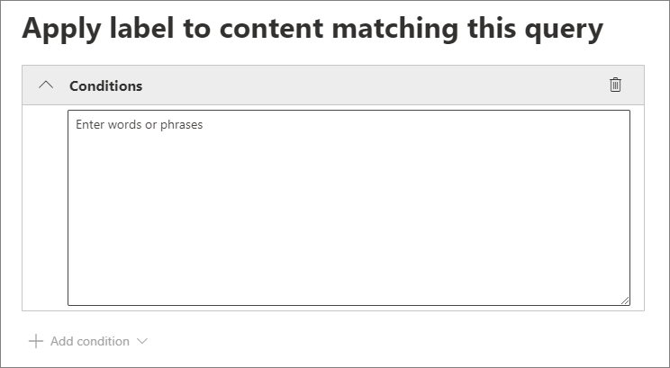

# <a name="automatically-apply-a-retention-label-to-retain-or-delete-content"></a><span data-ttu-id="5df73-103">Aplicar una etiqueta de retención automáticamente para conservar o eliminar contenido</span><span class="sxs-lookup"><span data-stu-id="5df73-103">Automatically apply a retention label to retain or delete content</span></span>

><span data-ttu-id="5df73-104">*[Instrucciones de licencias de Microsoft 365 para la seguridad y el cumplimiento](/office365/servicedescriptions/microsoft-365-service-descriptions/microsoft-365-tenantlevel-services-licensing-guidance/microsoft-365-security-compliance-licensing-guidance).*</span><span class="sxs-lookup"><span data-stu-id="5df73-104">*[Microsoft 365 licensing guidance for security & compliance](/office365/servicedescriptions/microsoft-365-service-descriptions/microsoft-365-tenantlevel-services-licensing-guidance/microsoft-365-security-compliance-licensing-guidance).*</span></span>

> [!NOTE]
> <span data-ttu-id="5df73-105">Este escenario no es compatible con los [registros normativos](records-management.md#records).</span><span class="sxs-lookup"><span data-stu-id="5df73-105">This scenario is not supported for [regulatory records](records-management.md#records).</span></span>

<span data-ttu-id="5df73-106">Una de las características más eficaces de las [etiquetas de retención](retention.md) es la capacidad de aplicarlas automáticamente al contenido que coincide con condiciones especificadas.</span><span class="sxs-lookup"><span data-stu-id="5df73-106">One of the most powerful features of [retention labels](retention.md) is the ability to apply them automatically to content that matches specified conditions.</span></span> <span data-ttu-id="5df73-107">En este caso, no es necesario que las personas de la organización apliquen las etiquetas de retención.</span><span class="sxs-lookup"><span data-stu-id="5df73-107">In this case, people in your organization don't need to apply the retention labels.</span></span> <span data-ttu-id="5df73-108">Microsoft 365 realiza el trabajo por ellos.</span><span class="sxs-lookup"><span data-stu-id="5df73-108">Microsoft 365 does the work for them.</span></span>
  
<span data-ttu-id="5df73-109">Las etiquetas de retención auto aplicadas son poderosas porque:</span><span class="sxs-lookup"><span data-stu-id="5df73-109">Auto-applying retention labels are powerful because:</span></span>
  
- <span data-ttu-id="5df73-110">No es necesario formar a los usuarios para que conozcan todas las clasificaciones.</span><span class="sxs-lookup"><span data-stu-id="5df73-110">You don't need to train your users on all of your classifications.</span></span>
    
- <span data-ttu-id="5df73-111">No es necesario depender de los usuarios para clasificar todo el contenido correctamente.</span><span class="sxs-lookup"><span data-stu-id="5df73-111">You don't need to rely on users to classify all content correctly.</span></span>
    
- <span data-ttu-id="5df73-112">Los usuarios ya no necesitan conocer las directivas de gobierno de datos; en su lugar, pueden centrarse en su trabajo.</span><span class="sxs-lookup"><span data-stu-id="5df73-112">Users no longer need to know about data governance policies - they can focus on their work.</span></span>
    
<span data-ttu-id="5df73-113">Las etiquetas de retención se pueden aplicar a contenido automáticamente cuando dicho contenido contiene información confidencial, palabras clave o propiedades que permiten búsquedas, o una coincidencia para [clasificadores que se puedan entrenar](classifier-get-started-with.md).</span><span class="sxs-lookup"><span data-stu-id="5df73-113">You can apply retention labels to content automatically when that content contains sensitive information, keywords or searchable properties, or a match for [trainable classifiers](classifier-get-started-with.md).</span></span>

> [!TIP]
> <span data-ttu-id="5df73-114">Según las publicaciones recientes, en la versión preliminar, puede utilizar las propiedades que permiten búsquedas para identificar las [grabaciones de reuniones de Teams](#microsoft-teams-meeting-recordings).</span><span class="sxs-lookup"><span data-stu-id="5df73-114">Recently released, use searchable properties to identify [Teams meeting recordings](#microsoft-teams-meeting-recordings).</span></span>

<span data-ttu-id="5df73-115">Los procesos para aplicar automáticamente una etiqueta de retención se basan en estas condiciones:</span><span class="sxs-lookup"><span data-stu-id="5df73-115">The processes to automatically apply a retention label based on these conditions:</span></span>


<span data-ttu-id="5df73-117">Utilice las siguientes instrucciones para los dos pasos de administrador.</span><span class="sxs-lookup"><span data-stu-id="5df73-117">Use the following instructions for the two admin steps.</span></span>

> [!NOTE]
> <span data-ttu-id="5df73-118">Las directivas automáticas emplean etiquetado del lado del servicio con condiciones para aplicar etiquetas de retención automáticamente.</span><span class="sxs-lookup"><span data-stu-id="5df73-118">Auto-policies use service-side labeling with conditions to automatically apply retention labels.</span></span> <span data-ttu-id="5df73-119">También puede aplicar automáticamente una etiqueta de retención con una directiva de etiqueta al hacer lo siguiente:</span><span class="sxs-lookup"><span data-stu-id="5df73-119">You can also automatically apply a retention label with a label policy when you do the following:</span></span> 
>
> - <span data-ttu-id="5df73-120">Puede aplicar fácilmente una etiqueta de retención a un modelo de comprensión mediante documentos en SharePoint Syntex.</span><span class="sxs-lookup"><span data-stu-id="5df73-120">Apply a retention label to a document understanding model in SharePoint Syntex</span></span>
> - <span data-ttu-id="5df73-121">Aplicar una etiqueta de retención predeterminada para SharePoint y Outlook</span><span class="sxs-lookup"><span data-stu-id="5df73-121">Apply a default retention label for SharePoint and Outlook</span></span>
>- <span data-ttu-id="5df73-122">Aplicar una etiqueta de retención al correo electrónico mediante el uso de reglas de Outlook</span><span class="sxs-lookup"><span data-stu-id="5df73-122">Apply a retention label to email by using Outlook rules</span></span>
>
> <span data-ttu-id="5df73-123">Para estos escenarios, consulte [Crear y aplicar etiquetas de retención en aplicaciones](create-apply-retention-labels.md).</span><span class="sxs-lookup"><span data-stu-id="5df73-123">For these scenarios, see [Create and apply retention labels in apps](create-apply-retention-labels.md).</span></span>

## <a name="before-you-begin"></a><span data-ttu-id="5df73-124">Antes de empezar</span><span class="sxs-lookup"><span data-stu-id="5df73-124">Before you begin</span></span>

<span data-ttu-id="5df73-125">El administrador global de su organización tiene permisos totales para crear y modificar etiquetas de retención y las directivas de las mismas.</span><span class="sxs-lookup"><span data-stu-id="5df73-125">The global admin for your organization has full permissions to create and edit retention labels and their policies.</span></span> <span data-ttu-id="5df73-126">Si no va a iniciar sesión como administrador global, consulte [Permisos necesarios para crear y administrar directivas de retención y etiquetas de retención](get-started-with-retention.md#permissions-required-to-create-and-manage-retention-policies-and-retention-labels).</span><span class="sxs-lookup"><span data-stu-id="5df73-126">If you aren't signing in as a global admin, see [Permissions required to create and manage retention policies and retention labels](get-started-with-retention.md#permissions-required-to-create-and-manage-retention-policies-and-retention-labels).</span></span>

## <a name="how-to-auto-apply-a-retention-label"></a><span data-ttu-id="5df73-127">Cómo aplicar automáticamente una etiqueta de retención</span><span class="sxs-lookup"><span data-stu-id="5df73-127">How to auto-apply a retention label</span></span>

<span data-ttu-id="5df73-128">En primer lugar, cree la etiqueta de retención.</span><span class="sxs-lookup"><span data-stu-id="5df73-128">First, create your retention label.</span></span> <span data-ttu-id="5df73-129">A continuación, cree una directiva automática para aplicar dicha etiqueta.</span><span class="sxs-lookup"><span data-stu-id="5df73-129">Then create an auto-policy to apply that label.</span></span> <span data-ttu-id="5df73-130">Si ya ha creado la etiqueta de retención, consulte [Crear una directiva automática](#step-2-create-an-auto-apply-policy).</span><span class="sxs-lookup"><span data-stu-id="5df73-130">If you have already created your retention label, skip to [creating an auto-policy](#step-2-create-an-auto-apply-policy).</span></span>

<span data-ttu-id="5df73-131">Las instrucciones de navegación dependerán de si está usando o no la [administración de registros](records-management.md).</span><span class="sxs-lookup"><span data-stu-id="5df73-131">Navigation instructions depend on whether you're using [records management](records-management.md) or not.</span></span> <span data-ttu-id="5df73-132">Se proporcionan instrucciones para ambos escenarios.</span><span class="sxs-lookup"><span data-stu-id="5df73-132">Instructions are provided for both scenarios.</span></span>

### <a name="step-1-create-a-retention-label"></a><span data-ttu-id="5df73-133">Paso 1: Cree una etiqueta de retención</span><span class="sxs-lookup"><span data-stu-id="5df73-133">Step 1: Create a retention label</span></span>

1. <span data-ttu-id="5df73-134">En el [Centro de cumplimiento de Microsoft 365](https://compliance.microsoft.com/), desplácese hasta una de las siguientes ubicaciones:</span><span class="sxs-lookup"><span data-stu-id="5df73-134">In the [Microsoft 365 compliance center](https://compliance.microsoft.com/), navigate to one of the following locations:</span></span>
    
    - <span data-ttu-id="5df73-135">Si utiliza la administración de registros:</span><span class="sxs-lookup"><span data-stu-id="5df73-135">If you are using records management:</span></span>
        - <span data-ttu-id="5df73-136">**Soluciones** > **Administración de registros** > pestaña **Plan de archivos** tab > **+ Crear una etiqueta** > **Etiqueta de retención**</span><span class="sxs-lookup"><span data-stu-id="5df73-136">**Solutions** > **Records management** > **File plan** tab > **+ Create a label** > **Retention label**</span></span>
        
    - <span data-ttu-id="5df73-137">Si no está utilizando la administración de registros:</span><span class="sxs-lookup"><span data-stu-id="5df73-137">If you are not using records management:</span></span>
       - <span data-ttu-id="5df73-138">**Soluciones** > **Gobierno de información** > pestaña **Etiquetas** > + **Crear una etiqueta**</span><span class="sxs-lookup"><span data-stu-id="5df73-138">**Solutions** > **Information governance** > **Labels** tab > + **Create a label**</span></span>
    
    <span data-ttu-id="5df73-139">¿No ve su opción inmediatamente?</span><span class="sxs-lookup"><span data-stu-id="5df73-139">Don't immediately see your option?</span></span> <span data-ttu-id="5df73-140">Primero seleccione **Mostrar todo**.</span><span class="sxs-lookup"><span data-stu-id="5df73-140">First select **Show all**.</span></span> 

2. <span data-ttu-id="5df73-141">Siga las instrucciones del asistente.</span><span class="sxs-lookup"><span data-stu-id="5df73-141">Follow the prompts in the wizard.</span></span> <span data-ttu-id="5df73-142">Si utiliza la administración de registros:</span><span class="sxs-lookup"><span data-stu-id="5df73-142">If you are using records management:</span></span>
    
    - <span data-ttu-id="5df73-143">Para obtener información sobre los descriptores del plan de archivos, consulte [Usar plan de archivos para administrar etiquetas de retención](file-plan-manager.md) </span><span class="sxs-lookup"><span data-stu-id="5df73-143">For information about the file plan descriptors, see [Use file plan to manage retention labels](file-plan-manager.md)</span></span>
    
    - <span data-ttu-id="5df73-144">Para usar la etiqueta de retención para declarar registros, seleccione **Marcar elementos como registros** o **Marcar elementos como registros normativos**.</span><span class="sxs-lookup"><span data-stu-id="5df73-144">To use the retention label to declare records, select **Mark items as records**, or **Mark items as regulatory records**.</span></span> <span data-ttu-id="5df73-145">Para obtener más información, vea [Configurar etiquetas de retención para declarar registros](declare-records.md#configuring-retention-labels-to-declare-records).</span><span class="sxs-lookup"><span data-stu-id="5df73-145">For more information, see [Configuring retention labels to declare records](declare-records.md#configuring-retention-labels-to-declare-records).</span></span>

3. <span data-ttu-id="5df73-146">Después de crear la etiqueta y ver las opciones para publicar la etiqueta, aplique la etiqueta automáticamente o simplemente guárdela: seleccione **Aplicar esta etiqueta automáticamente a un tipo de contenido específico** y luego, seleccione **Finalizado** para iniciar el Asistente para la creación de etiquetas automáticas, que lo llevará directamente al paso 2 del procedimiento siguiente.</span><span class="sxs-lookup"><span data-stu-id="5df73-146">After you have created the label and you see the options to publish the label, auto-apply the label, or just save the label: Select **Auto-apply this label to a specific type of content**, and then select **Done** to start the Create auto-labeling wizard that takes you directly to step 2 in the following procedure.</span></span>

<span data-ttu-id="5df73-147">Para editar una etiqueta existente, selecciónela y después seleccione la opción **Editar etiqueta** para iniciar el Asistente de edición de etiquetas de retención, el cual le permite cambiar las descripciones de las etiquetas, así como cualquier [configuración que cumpla con los requisitos](#updating-retention-labels-and-their-policies) del paso 2.</span><span class="sxs-lookup"><span data-stu-id="5df73-147">To edit an existing label, select it, and then select the **Edit label** option to start the Edit retention wizard that lets you change the label descriptions and any [eligible settings](#updating-retention-labels-and-their-policies) from step 2.</span></span>

### <a name="step-2-create-an-auto-apply-policy"></a><span data-ttu-id="5df73-148">Paso 2: Cree una directiva de aplicación automática</span><span class="sxs-lookup"><span data-stu-id="5df73-148">Step 2: Create an auto-apply policy</span></span>

<span data-ttu-id="5df73-149">Cuando se crea una directiva de aplicación automática, se selecciona una etiqueta de retención para aplicarla automáticamente a contenido, en función de las condiciones especificadas.</span><span class="sxs-lookup"><span data-stu-id="5df73-149">When you create an auto-apply policy, you select a retention label to automatically apply to content, based on the conditions that you specify.</span></span>

1. <span data-ttu-id="5df73-150">En el [Centro de cumplimiento de Microsoft 365](https://compliance.microsoft.com/), desplácese hasta una de las siguientes locaciones:</span><span class="sxs-lookup"><span data-stu-id="5df73-150">In the [Microsoft 365 compliance center](https://compliance.microsoft.com/), navigate to one of the following locations:</span></span>
    
    - <span data-ttu-id="5df73-151">Si utiliza la administración de registros:**Gobierno de información**:</span><span class="sxs-lookup"><span data-stu-id="5df73-151">If you are using records management: **Information governance**:</span></span>
        - <span data-ttu-id="5df73-152">**Soluciones** > **Administración de registros** > pestaña de **Directivas de etiquetas** > **Aplicar etiqueta automáticamente**</span><span class="sxs-lookup"><span data-stu-id="5df73-152">**Solutions** > **Records management** > **Label policies** tab > **Auto-apply a label**</span></span>
    
    - <span data-ttu-id="5df73-153">Si no está utilizando la administración de registros:</span><span class="sxs-lookup"><span data-stu-id="5df73-153">If you are not using records management:</span></span>
        - <span data-ttu-id="5df73-154">**Soluciones** > **Gobierno de información** > pestaña de **Directivas de etiquetas** > **Aplicar etiqueta automáticamente**</span><span class="sxs-lookup"><span data-stu-id="5df73-154">**Solutions** > **Information governance** > **Label policies** tab > **Auto-apply a label**</span></span>
    
    <span data-ttu-id="5df73-155">¿No ve su opción inmediatamente?</span><span class="sxs-lookup"><span data-stu-id="5df73-155">Don't immediately see your option?</span></span> <span data-ttu-id="5df73-156">Primero seleccione **Mostrar todo**.</span><span class="sxs-lookup"><span data-stu-id="5df73-156">First select **Show all**.</span></span> 

2. <span data-ttu-id="5df73-157">Siga las indicaciones del Asistente para la creación de etiquetas automáticas.</span><span class="sxs-lookup"><span data-stu-id="5df73-157">Follow the prompts in the Create auto-labeling wizard.</span></span>
    
    <span data-ttu-id="5df73-158">Para obtener información sobre la configuración de las condiciones que aplican automáticamente la etiqueta de retención, consulte la sección [Configuración de las condiciones para la aplicación automática de etiquetas de retención en](#configuring-conditions-for-auto-apply-retention-labels) esta página.</span><span class="sxs-lookup"><span data-stu-id="5df73-158">For information about configuring the conditions that automatically apply the retention label, see the [Configuring conditions for auto-apply retention labels](#configuring-conditions-for-auto-apply-retention-labels) section on this page.</span></span>
    
    <span data-ttu-id="5df73-159">Para obtener información sobre las ubicaciones compatibles con las etiquetas de retención, vea la sección [Etiquetas de retención y ubicaciones](retention.md#retention-label-policies-and-locations).</span><span class="sxs-lookup"><span data-stu-id="5df73-159">For information about the locations supported by retention labels, see the [Retention labels and locations](retention.md#retention-label-policies-and-locations) section.</span></span>

<span data-ttu-id="5df73-160">Para editar una directiva existente de aplicación automática, selecciónela para iniciar el Asistente para editar directivas de retención, el cual le permite cambiar la etiqueta de retención seleccionada, así como cualquier [configuración que cumpla con los requisitos](#updating-retention-labels-and-their-policies) del paso 2.</span><span class="sxs-lookup"><span data-stu-id="5df73-160">To edit an existing auto-apply policy, select it to start the Edit retention policy wizard that lets you change the selected retention label and any [eligible settings](#updating-retention-labels-and-their-policies) from step 2.</span></span>

<span data-ttu-id="5df73-161">Después de etiquetar el contenido con una directiva de la etiqueta de aplicación automática, la etiqueta aplicada no se puede quitar o cambiar automáticamente cambiando el contenido o la directiva, o una nueva directiva de etiqueta de aplicación automática.</span><span class="sxs-lookup"><span data-stu-id="5df73-161">After content is labeled by using an auto-apply label policy, the applied label can't be automatically removed or changed by changing the content or the policy, or by a new auto-apply label policy.</span></span> <span data-ttu-id="5df73-162">Para obtener más información, vea [Solo una etiqueta de retención al mismo tiempo](retention.md#only-one-retention-label-at-a-time).</span><span class="sxs-lookup"><span data-stu-id="5df73-162">For more information, see [Only one retention label at a time](retention.md#only-one-retention-label-at-a-time).</span></span>

### <a name="configuring-conditions-for-auto-apply-retention-labels"></a><span data-ttu-id="5df73-163">Configurar las condiciones para la aplicación automática de etiquetas de retención</span><span class="sxs-lookup"><span data-stu-id="5df73-163">Configuring conditions for auto-apply retention labels</span></span>

<span data-ttu-id="5df73-164">Puede aplicar etiquetas de retención al contenido automáticamente cuando éste contiene:</span><span class="sxs-lookup"><span data-stu-id="5df73-164">You can apply retention labels to content automatically when that content contains:</span></span>

- [<span data-ttu-id="5df73-165">Tipos específicos de información confidencial</span><span class="sxs-lookup"><span data-stu-id="5df73-165">Specific types of sensitive information</span></span>](#auto-apply-labels-to-content-with-specific-types-of-sensitive-information)

- [<span data-ttu-id="5df73-166">Palabras clave específicas o propiedades que permiten búsquedas que coinciden con una consulta que usted creó</span><span class="sxs-lookup"><span data-stu-id="5df73-166">Specific keywords or searchable properties that match a query you create</span></span>](#auto-apply-labels-to-content-with-keywords-or-searchable-properties)

- [<span data-ttu-id="5df73-167">Una coincidencia para clasificadores que se pueden entrenar</span><span class="sxs-lookup"><span data-stu-id="5df73-167">A match for trainable classifiers</span></span>](#auto-apply-labels-to-content-by-using-trainable-classifiers)

#### <a name="auto-apply-labels-to-content-with-specific-types-of-sensitive-information"></a><span data-ttu-id="5df73-168">Aplicar automáticamente etiquetas a los contenidos con tipos específicos de información sensible</span><span class="sxs-lookup"><span data-stu-id="5df73-168">Auto-apply labels to content with specific types of sensitive information</span></span>

> [!WARNING]
> <span data-ttu-id="5df73-169">Actualmente, esta configuración tiene una limitación conocida, por la que todos los correos electrónicos sin etiqueta siempre tienen la etiqueta de retención seleccionada aplicada cuando hay una coincidencia para los tipos de información confidencial seleccionados.</span><span class="sxs-lookup"><span data-stu-id="5df73-169">This configuration currently has a known limitation where all unlabeled emails always have the selected retention label applied when there is a match for your chosen sensitive information types.</span></span> <span data-ttu-id="5df73-170">Por ejemplo, incluso si especifica el ámbito de la directiva de aplicación automática para usuarios específicos o para seleccionar ubicaciones distintas de Exchange para la directiva, la etiqueta siempre se aplicará a los correos electrónicos sin etiqueta cuando haya una coincidencia.</span><span class="sxs-lookup"><span data-stu-id="5df73-170">For example, even if you scope your auto-apply policy to specific users, or select locations other than Exchange for the policy, the label is always applied to unlabeled emails when there is a match.</span></span>

<span data-ttu-id="5df73-171">Al crear directivas de etiquetas de retención de aplicación automática para información confidencial, verá la misma lista de plantillas de directiva que cuando se crea una directiva de prevención de pérdida de datos (DLP).</span><span class="sxs-lookup"><span data-stu-id="5df73-171">When you create auto-apply retention label policies for sensitive information, you see the same list of policy templates as when you create a data loss prevention (DLP) policy.</span></span> <span data-ttu-id="5df73-172">Cada plantilla está preconfigurada para buscar determinados tipos de información confidencial.</span><span class="sxs-lookup"><span data-stu-id="5df73-172">Each template is preconfigured to look for specific types of sensitive information.</span></span> <span data-ttu-id="5df73-173">Por ejemplo, la plantilla que se muestra aquí busca los números de ITIN, SSN y pasaporte de Estados Unidos de la categoría **Privacidad** y de la **Plantilla de datos de identificación personal (PII) de Estados Unidos**:</span><span class="sxs-lookup"><span data-stu-id="5df73-173">For example, the template shown here looks for U.S. ITIN, SSN, and passport numbers from the **Privacy** category, and **U.S Personally Identifiable Information (PII) Data** template:</span></span>


<span data-ttu-id="5df73-175">Para obtener más información sobre los tipos de información confidencial, consulte [Definiciones de entidad del tipo de información confidencial](sensitive-information-type-entity-definitions.md).</span><span class="sxs-lookup"><span data-stu-id="5df73-175">To learn more about the sensitivity information types, see [Sensitive information type entity definitions](sensitive-information-type-entity-definitions.md).</span></span> <span data-ttu-id="5df73-176">Actualmente, las [coincidencias exactas de datos](create-custom-sensitive-information-types-with-exact-data-match-based-classification.md) y la [creación de huella digital de documento](document-fingerprinting.md) no son compatibles con este escenario.</span><span class="sxs-lookup"><span data-stu-id="5df73-176">Currently, [exact data matches](create-custom-sensitive-information-types-with-exact-data-match-based-classification.md) and [document fingerprinting](document-fingerprinting.md) are not supported for this scenario.</span></span>

<span data-ttu-id="5df73-p114">Después de seleccionar una plantilla de directiva, puede agregar o quitar los tipos de información confidencial, así como cambiar el recuento de instancias y la precisión de coincidencia. En el recorte de pantalla de ejemplo que se muestra a continuación, solo se aplicará la etiqueta de retención automáticamente cuando:</span><span class="sxs-lookup"><span data-stu-id="5df73-p114">After you select a policy template, you can add or remove any types of sensitive information, and you can change the instance count and match accuracy. In the example screenshot shown next, a retention label will be auto-applied only when:</span></span>
  
- <span data-ttu-id="5df73-179">El tipo de información confidencial que se detecta tiene una precisión de coincidencia (o nivel de confianza) de al menos 75.</span><span class="sxs-lookup"><span data-stu-id="5df73-179">The type of sensitive information that's detected has a match accuracy (or confidence level) of at least 75.</span></span> <span data-ttu-id="5df73-180">Muchos tipos de información confidencial se definen con varios patrones, donde un patrón con una mayor precisión de coincidencia requiere más pruebas para ser encontrado (por ejemplo, palabras clave, fechas o direcciones), mientras que un patrón con una precisión de coincidencia inferior requiere menos pruebas.</span><span class="sxs-lookup"><span data-stu-id="5df73-180">Many sensitive information types are defined with multiple patterns, where a pattern with a higher match accuracy requires more evidence to be found (such as keywords, dates, or addresses), while a pattern with a lower match accuracy requires less evidence.</span></span> <span data-ttu-id="5df73-181">Cuanto menor sea la precisión de coincidencia **mín**, más fácil será que el contenido coincida con la condición.</span><span class="sxs-lookup"><span data-stu-id="5df73-181">The lower the **min** match accuracy, the easier it is for content to match the condition.</span></span>

- <span data-ttu-id="5df73-182">El contenido tenga entre 1 y 9 instancias de cualquiera de estos tres tipos de información confidencial.</span><span class="sxs-lookup"><span data-stu-id="5df73-182">The content contains between 1 and 9 instances of any of these three sensitive information types.</span></span> <span data-ttu-id="5df73-183">Puede eliminar el valor **hasta** para cambiarlo a **Cualquiera**.</span><span class="sxs-lookup"><span data-stu-id="5df73-183">You can delete the **to** value so that it changes to **Any**.</span></span>

<span data-ttu-id="5df73-184">Para obtener más información sobre estas opciones, consulte las siguientes instrucciones de la documentación DLP: [Ajustar las reglas para que sea más o menos fácil que coincidan](data-loss-prevention-policies.md#tuning-rules-to-make-them-easier-or-harder-to-match).</span><span class="sxs-lookup"><span data-stu-id="5df73-184">For more information about these options, see the following guidance from the DLP documentation [Tuning rules to make them easier or harder to match](data-loss-prevention-policies.md#tuning-rules-to-make-them-easier-or-harder-to-match).</span></span>
    


<span data-ttu-id="5df73-186">Que debe tener en cuenta al usar tipos de información confidencial para aplicar las etiquetas de retención automáticamente:</span><span class="sxs-lookup"><span data-stu-id="5df73-186">To consider when using sensitive information types to auto-apply retention labels:</span></span>

- <span data-ttu-id="5df73-187">Se pueden usar etiquetas automáticamente para los elementos nuevos y modificados.</span><span class="sxs-lookup"><span data-stu-id="5df73-187">New and modified items can be auto-labeled.</span></span>

#### <a name="auto-apply-labels-to-content-with-keywords-or-searchable-properties"></a><span data-ttu-id="5df73-188">Aplicar automáticamente etiquetas a contenido con palabras clave o propiedades que se puedan buscar</span><span class="sxs-lookup"><span data-stu-id="5df73-188">Auto-apply labels to content with keywords or searchable properties</span></span>

<span data-ttu-id="5df73-p117">Puede aplicar etiquetas automáticamente al contenido mediante una consulta que contenga palabras, frases o valores de propiedades que permiten búsquedas específicos. Puede restringir la consulta con operadores de búsqueda como Y, O y NO.</span><span class="sxs-lookup"><span data-stu-id="5df73-p117">You can auto-apply labels to content by using a query that contains specific words, phrases, or values of searchable properties. You can refine your query by using search operators such as AND, OR, and NOT.</span></span>



<span data-ttu-id="5df73-192">Para obtener más información sobre la sintaxis de consulta que usa el Lenguaje de consultas de palabras clave (KQL), vea [Referencia de la sintaxis del Lenguaje de consultas de palabras clave (KQL)](/sharepoint/dev/general-development/keyword-query-language-kql-syntax-reference).</span><span class="sxs-lookup"><span data-stu-id="5df73-192">For more information about the query syntax that uses Keyword Query Language (KQL), see [Keyword Query Language (KQL) syntax reference](/sharepoint/dev/general-development/keyword-query-language-kql-syntax-reference).</span></span>

<span data-ttu-id="5df73-193">Las directivas de aplicación automática basadas en consultas usan el mismo índice de búsqueda que la búsqueda de contenido en eDiscovery para identificar el contenido.</span><span class="sxs-lookup"><span data-stu-id="5df73-193">Query-based auto-apply policies use the same search index as eDiscovery content search to identify content.</span></span> <span data-ttu-id="5df73-194">Para obtener más información sobre las propiedades utilizables en búsqueda que puede usar, vea [Consultas de palabras clave y condiciones de búsqueda para la Búsqueda de contenido](keyword-queries-and-search-conditions.md).</span><span class="sxs-lookup"><span data-stu-id="5df73-194">For more information about the searchable properties that you can use, see [Keyword queries and search conditions for Content Search](keyword-queries-and-search-conditions.md).</span></span>

<span data-ttu-id="5df73-195">Aspectos que debe tener en cuenta al usar palabras clave o propiedades utilizables en búsqueda para las etiquetas de retención de aplicación automática:</span><span class="sxs-lookup"><span data-stu-id="5df73-195">Some things to consider when using keywords or searchable properties to auto-apply retention labels:</span></span>

- <span data-ttu-id="5df73-196">Los elementos nuevos, modificados y existentes se etiquetarán automáticamente para SharePoint, OneDrive y Exchange.</span><span class="sxs-lookup"><span data-stu-id="5df73-196">New, modified, and existing items will be auto-labeled for SharePoint, OneDrive, and Exchange.</span></span>

- <span data-ttu-id="5df73-197">Para SharePoint, las propiedades rastreadas y las propiedades personalizadas no son compatibles con estas consultas KQL y solo debe usar propiedades administradas predefinidas.</span><span class="sxs-lookup"><span data-stu-id="5df73-197">For SharePoint, crawled properties and custom properties aren't supported for these KQL queries and you must use only predefined managed properties.</span></span> <span data-ttu-id="5df73-198">Sin embargo, puede usar las asignaciones en el nivel de espacio empresarial con las propiedades administradas predefinidas que se habilitan como refinadores de forma predeterminada (RefinableDate00-19, RefinableString00-99, RefinableInt00-49, RefinableDecimals00-09 y RefinableDouble00-09).</span><span class="sxs-lookup"><span data-stu-id="5df73-198">However, you can use mappings at the tenant level with the predefined managed properties that are enabled as refiners by default (RefinableDate00-19, RefinableString00-99, RefinableInt00-49, RefinableDecimals00-09, and RefinableDouble00-09).</span></span> <span data-ttu-id="5df73-199">Para obtener más información, vea [Información general de propiedades administradas y rastreadas en SharePoint Server](/SharePoint/technical-reference/crawled-and-managed-properties-overview) y para obtener instrucciones, consulte [Crear una nueva propiedad administrada](/sharepoint/manage-search-schema#create-a-new-managed-property).</span><span class="sxs-lookup"><span data-stu-id="5df73-199">For more information, see [Overview of crawled and managed properties in SharePoint Server](/SharePoint/technical-reference/crawled-and-managed-properties-overview), and for instructions, see [Create a new managed property](/sharepoint/manage-search-schema#create-a-new-managed-property).</span></span>

- <span data-ttu-id="5df73-200">Si asigna una propiedad personalizada a una de las propiedades de refinador, espere 24 horas antes de usarla en la consulta de KQL para una etiqueta de retención.</span><span class="sxs-lookup"><span data-stu-id="5df73-200">If you map a custom property to one of the refiner properties, wait 24 hours before you use it in your KQL query for a retention label.</span></span>

- <span data-ttu-id="5df73-201">Aunque se puede cambiar el nombre de las propiedades administradas de SharePoint mediante alias, no los use para las consultas de KQL en las etiquetas.</span><span class="sxs-lookup"><span data-stu-id="5df73-201">Although SharePoint managed properties can be renamed by using aliases, don't use these for KQL queries in your labels.</span></span> <span data-ttu-id="5df73-202">Siempre debe especificar el nombre real de la propiedad administrada, por ejemplo, "RefinableString01".</span><span class="sxs-lookup"><span data-stu-id="5df73-202">Always specify the actual name of the managed property, for example, "RefinableString01".</span></span>

- <span data-ttu-id="5df73-203">Para buscar valores que contengan espacios o caracteres especiales, use comillas dobles (`" "`) en la frase. Por ejemplo, `subject:"Financial Statements"`.</span><span class="sxs-lookup"><span data-stu-id="5df73-203">To search for values that contain spaces or special characters, use double quotation marks (`" "`) to contain the phrase; for example, `subject:"Financial Statements"`.</span></span>

- <span data-ttu-id="5df73-204">Use la propiedad *DocumentLink* en lugar de *Path* para hacer coincidir un elemento basándose en su URL.</span><span class="sxs-lookup"><span data-stu-id="5df73-204">Use the *DocumentLink* property instead of *Path* to match an item based on its URL.</span></span> 

- <span data-ttu-id="5df73-205">No se admiten las búsquedas con caracteres comodín de sufijo (como `*cat`) o las búsquedas con caracteres comodín de subcadena (como `*cat*`).</span><span class="sxs-lookup"><span data-stu-id="5df73-205">Suffix wildcard searches ( such as `*cat`) or substring wildcard searches (such as `*cat*`) aren't supported.</span></span> <span data-ttu-id="5df73-206">Sin embargo, se admiten las búsquedas comodín de prefijo (como `cat*`).</span><span class="sxs-lookup"><span data-stu-id="5df73-206">However, prefix wildcard searches (such as `cat*`) are supported.</span></span>

- <span data-ttu-id="5df73-207">Tenga en cuenta que los elementos parcialmente indexados pueden causar que no se etiquete los elementos que espera, o que se etiquete los elementos que esperaba excluir de la etiquetación cuando use el operador NOT.</span><span class="sxs-lookup"><span data-stu-id="5df73-207">Be aware that partially indexed items can be responsible for not labeling items that you're expecting, or labeling items that you're expecting to be excluded from labeling when you use the NOT operator.</span></span> <span data-ttu-id="5df73-208">Para más información, vea [Elementos parcialmente indexados en la Búsqueda de contenido](partially-indexed-items-in-content-search.md).</span><span class="sxs-lookup"><span data-stu-id="5df73-208">For more information, see [Partially indexed items in Content Search](partially-indexed-items-in-content-search.md).</span></span>


<span data-ttu-id="5df73-209">Consultas de ejemplos:</span><span class="sxs-lookup"><span data-stu-id="5df73-209">Examples queries:</span></span>

| <span data-ttu-id="5df73-210">Carga de trabajo</span><span class="sxs-lookup"><span data-stu-id="5df73-210">Workload</span></span> | <span data-ttu-id="5df73-211">Ejemplo</span><span class="sxs-lookup"><span data-stu-id="5df73-211">Example</span></span> |
|:-----|:-----|
|<span data-ttu-id="5df73-212">Exchange</span><span class="sxs-lookup"><span data-stu-id="5df73-212">Exchange</span></span>   | `subject:"Financial Statements"` |
|<span data-ttu-id="5df73-213">Exchange</span><span class="sxs-lookup"><span data-stu-id="5df73-213">Exchange</span></span>   | `recipients:garthf@contoso.com` |
|<span data-ttu-id="5df73-214">SharePoint</span><span class="sxs-lookup"><span data-stu-id="5df73-214">SharePoint</span></span> | `contenttype:document` |
|<span data-ttu-id="5df73-215">SharePoint</span><span class="sxs-lookup"><span data-stu-id="5df73-215">SharePoint</span></span> | `site:https://contoso.sharepoint.com/sites/teams/procurement AND contenttype:document`|
|<span data-ttu-id="5df73-216">Exchange o SharePoint</span><span class="sxs-lookup"><span data-stu-id="5df73-216">Exchange or SharePoint</span></span> | `"customer information" OR "private"`|

<span data-ttu-id="5df73-217">Ejemplos más complejos:</span><span class="sxs-lookup"><span data-stu-id="5df73-217">More complex examples:</span></span>

<span data-ttu-id="5df73-218">La siguiente consulta para SharePoint identifica documentos de Word u hojas de cálculo de Excel cuando contienen las palabras clave **contraseña**, **contraseñas** o **clave**:</span><span class="sxs-lookup"><span data-stu-id="5df73-218">The following query for SharePoint identifies Word documents or Excel spreadsheets when those files contain the keywords **password**, **passwords**, or **pw**:</span></span>

```
(password OR passwords OR pw) AND (filetype:doc* OR filetype:xls*)
```

<span data-ttu-id="5df73-219">La siguiente consulta para Exchange identifica cualquier documento de Word o PDF que contenga la palabra **nda** o la frase **acuerdo de no divulgación** cuando estos documentos se adjuntan a un correo electrónico:</span><span class="sxs-lookup"><span data-stu-id="5df73-219">The following query for Exchange identifies any Word document or PDF that contains the word **nda** or the phrase **non disclosure agreement** when those documents are attached to an email:</span></span>

```
(nda OR "non disclosure agreement") AND (attachmentnames:.doc* OR attachmentnames:.pdf)
```

<span data-ttu-id="5df73-220">La siguiente consulta para SharePoint identifica documentos que contienen un número de tarjeta de crédito:</span><span class="sxs-lookup"><span data-stu-id="5df73-220">The following query for SharePoint identifies documents that contain a credit card number:</span></span> 

```
sensitivetype:"credit card number"
```

<span data-ttu-id="5df73-221">La siguiente consulta contiene algunas de las palabras clave típicas para identificar documentos o correos electrónicos que incluyan contenido legal válido:</span><span class="sxs-lookup"><span data-stu-id="5df73-221">The following query contains some typical keywords to help identify documents or emails that contain legal content:</span></span>

```
ACP OR (Attorney Client Privilege*) OR (AC Privilege)
```

<span data-ttu-id="5df73-222">La siguiente consulta contiene palabras clave típicas para identificar documentos o correos electrónicos para recursos humanos:</span><span class="sxs-lookup"><span data-stu-id="5df73-222">The following query contains typical keywords to help identify documents or emails for human resources:</span></span> 

```
(resume AND staff AND employee AND salary AND recruitment AND candidate)
```

<span data-ttu-id="5df73-223">Tenga en cuenta que este último ejemplo usa el procedimiento recomendado para incluir siempre operadores entre palabras clave.</span><span class="sxs-lookup"><span data-stu-id="5df73-223">Note that this final example uses the best practice of always including  operators between keywords.</span></span> <span data-ttu-id="5df73-224">Usar un espacio entre palabras clave (o dos expresiones propiedad:valor) es igual que usar AND.</span><span class="sxs-lookup"><span data-stu-id="5df73-224">A space between keywords (or two property:value expressions) is the same as using AND.</span></span> <span data-ttu-id="5df73-225">Al ir agregando los operadores, resulta más fácil ver que esta consulta de ejemplo identifica solo contenido que incluya todas las palabras clave, y no contenido con solo alguna de ellas.</span><span class="sxs-lookup"><span data-stu-id="5df73-225">By always adding operators, it's easier to see that this example query will identify only content that contains all these keywords, instead of content that contains any of the keywords.</span></span> <span data-ttu-id="5df73-226">Si su intención es identificar el contenido que incluya alguna de las palabras clave, especifique OR en lugar de AND.</span><span class="sxs-lookup"><span data-stu-id="5df73-226">If your intention is to identify content that contains any of the keywords, specify OR instead of AND.</span></span> <span data-ttu-id="5df73-227">Como se muestra en este ejemplo, al especificar siempre los operadores, es más fácil interpretarlos correctamente.</span><span class="sxs-lookup"><span data-stu-id="5df73-227">As this example shows, when you always specify the operators, it's easier to correctly interpret the query.</span></span> 

##### <a name="microsoft-teams-meeting-recordings"></a><span data-ttu-id="5df73-228">Grabaciones de reuniones de Microsoft Teams</span><span class="sxs-lookup"><span data-stu-id="5df73-228">Microsoft Teams meeting recordings</span></span>

> [!NOTE]
> <span data-ttu-id="5df73-229">La posibilidad de conservar y eliminar las grabaciones de reuniones de Teams no funcionará antes de guardar las grabaciones en OneDrive o SharePoint.</span><span class="sxs-lookup"><span data-stu-id="5df73-229">The ability to retain and delete Teams meeting recordings won't work before recordings are saved to OneDrive or SharePoint.</span></span> <span data-ttu-id="5df73-230">Para más información, consulte [Usar OneDrive para la Empresa y SharePoint Online o Stream para las grabaciones de reuniones](/MicrosoftTeams/tmr-meeting-recording-change).</span><span class="sxs-lookup"><span data-stu-id="5df73-230">For more information, see [Use OneDrive for Business and SharePoint Online or Stream for meeting recordings](/MicrosoftTeams/tmr-meeting-recording-change).</span></span>

<span data-ttu-id="5df73-231">Para identificar las grabaciones de reuniones de Microsoft Teams almacenadas en cuentas de OneDrive de los usuarios o en SharePoint, especifique lo siguiente para el **Editor de consultas de palabras clave**:</span><span class="sxs-lookup"><span data-stu-id="5df73-231">To identify Microsoft Teams meeting recordings that are stored in users' OneDrive accounts or in SharePoint, specify the following for the **Keyword query editor**:</span></span>

``` 
ProgID:Media AND ProgID:Meeting
```

<span data-ttu-id="5df73-p125">La mayoría de las veces, las grabaciones de reuniones se guardan en OneDrive. Pero, en el caso de las reuniones de canal, las grabaciones se guardan en SharePoint.</span><span class="sxs-lookup"><span data-stu-id="5df73-p125">Most of the time, meeting recordings are saved to OneDrive. But for channel meetings, they are saved in SharePoint.</span></span>


#### <a name="auto-apply-labels-to-content-by-using-trainable-classifiers"></a><span data-ttu-id="5df73-234">Aplicar automáticamente etiquetas al contenido con clasificadores que se pueden entrenar</span><span class="sxs-lookup"><span data-stu-id="5df73-234">Auto-apply labels to content by using trainable classifiers</span></span>

<span data-ttu-id="5df73-235">Si elige la opción para un clasificador que se puede entrenar, puede seleccionar uno de los clasificadores integrado o un clasificador personalizado.</span><span class="sxs-lookup"><span data-stu-id="5df73-235">When you choose the option for a trainable classifier, you can select one of the built-in classifiers, or a custom classifier.</span></span> <span data-ttu-id="5df73-236">Los clasificadores integrados incluyen **Currículum**, **Código fuente**, **Código fuente**, **Acoso selectivo**, **Amenazas**:</span><span class="sxs-lookup"><span data-stu-id="5df73-236">The built-in classifiers include **Resumes**, **SourceCode**, **Targeted Harassment**, **Profanity**, and **Threat**:</span></span>


> [!CAUTION]
> <span data-ttu-id="5df73-238">Estamos desaprobando el clasificador incorporado de **Lenguaje ofensivo** porque ha estado produciendo un alto número de falsos positivos.</span><span class="sxs-lookup"><span data-stu-id="5df73-238">We are deprecating the **Offensive Language** built-in classifier because it has been producing a high number of false positives.</span></span> <span data-ttu-id="5df73-239">No use este clasificador incorporado y si lo está usando actualmente, debería mover sus procesos de negocios fuera de él.</span><span class="sxs-lookup"><span data-stu-id="5df73-239">Don't use this built-in classifier and if you are currently using it, you should move your business processes off it.</span></span> <span data-ttu-id="5df73-240">Recomendamos que usen los clasificadores integrados de **Acoso selectivo**, **Blasfemias**, **Amenazas**</span><span class="sxs-lookup"><span data-stu-id="5df73-240">We recommend using the **Targeted Harassment**, **Profanity**, and **Threat** built-in classifiers instead.</span></span>

<span data-ttu-id="5df73-241">Para aplicar una etiqueta automáticamente usando esta opción, los buzones y sitios de SharePoint deben tener al menos 10 MB de datos.</span><span class="sxs-lookup"><span data-stu-id="5df73-241">To automatically apply a label by using this option, SharePoint sites and mailboxes must have at least 10 MB of data.</span></span>

<span data-ttu-id="5df73-242">Para más información sobre los clasificadores que se pueden entrenar, consulte [Información sobre los clasificadores que se pueden entrenar (versión preliminar)](classifier-learn-about.md).</span><span class="sxs-lookup"><span data-stu-id="5df73-242">For more information about trainable classifiers, see [Learn about trainable classifiers](classifier-learn-about.md).</span></span>

> [!TIP]
> <span data-ttu-id="5df73-243">Si usa clasificadores que se pueden entrenar para Exchange, consulte [Cómo volver a entrenar a un clasificador en el explorador de contenido (versión preliminar)](classifier-how-to-retrain-content-explorer.md).</span><span class="sxs-lookup"><span data-stu-id="5df73-243">If you use trainable classifiers for Exchange, see [How to retrain a classifier in content explorer](classifier-how-to-retrain-content-explorer.md).</span></span>

<span data-ttu-id="5df73-244">Que debe tener en cuenta al usar clasificadores que se pueden entrenar para aplicar las etiquetas de retención automáticamente:</span><span class="sxs-lookup"><span data-stu-id="5df73-244">To consider when using trainable classifiers to auto-apply retention labels:</span></span>

- <span data-ttu-id="5df73-245">Se pueden usar etiquetas automáticamente para los elementos nuevos y modificados, y los elementos existentes de los últimos seis meses.</span><span class="sxs-lookup"><span data-stu-id="5df73-245">New and modified items can be auto-labeled, and existing items from the last six months.</span></span>

## <a name="how-long-it-takes-for-retention-labels-to-take-effect"></a><span data-ttu-id="5df73-246">Tiempo que tardan las etiquetas de retención en aplicarse</span><span class="sxs-lookup"><span data-stu-id="5df73-246">How long it takes for retention labels to take effect</span></span>

<span data-ttu-id="5df73-247">Si aplica automáticamente las etiquetas de retención, puede tardar hasta siete días en aplicar las etiquetas de retención a todo el contenido existente que coincida con las condiciones.</span><span class="sxs-lookup"><span data-stu-id="5df73-247">When you auto-apply retention labels, it can take up to seven days for the retention labels to be applied to all existing content that matches the conditions.</span></span>
  


<span data-ttu-id="5df73-249">Si las etiquetas que esperaba no aparecen después de siete días, compruebe el **Estado** de la directiva de aplicación automática seleccionándola en la página **Directivas de etiqueta** en el Centro de cumplimiento.</span><span class="sxs-lookup"><span data-stu-id="5df73-249">If the expected labels don't appear after seven days, check the **Status** of the auto-apply policy by selecting it from the **Label policies** page in the compliance center.</span></span> <span data-ttu-id="5df73-250">Si ve el estado como **Desactivado (error)** y, en los detalles de las ubicaciones, un mensaje indica que se está tardando más de lo esperado en implementar la directiva (para SharePoint) o en probar la implementación de la directiva (para OneDrive), pruebe a ejecutar el comando [Set-RetentionCompliancePolicy](/powershell/module/exchange/set-retentioncompliancepolicy) en PowerShell para volver a intentar la distribución de la directiva:</span><span class="sxs-lookup"><span data-stu-id="5df73-250">If you see the status of **Off (Error)** and in the details for the locations see a message that it's taking longer than expected to deploy the policy (for SharePoint) or to try redeploying the policy (for OneDrive), try running the [Set-RetentionCompliancePolicy](/powershell/module/exchange/set-retentioncompliancepolicy) PowerShell command to retry the policy distribution:</span></span>

1. <span data-ttu-id="5df73-251">[Conéctese al Centro de seguridad y cumplimiento de PowerShell](/powershell/exchange/connect-to-scc-powershell).</span><span class="sxs-lookup"><span data-stu-id="5df73-251">[Connect to Security & Compliance Center PowerShell](/powershell/exchange/connect-to-scc-powershell).</span></span>

2. <span data-ttu-id="5df73-252">Ejecute el siguiente comando:</span><span class="sxs-lookup"><span data-stu-id="5df73-252">Run the following command:</span></span>
    
    ``` PowerShell
    Set-RetentionCompliancePolicy -Identity <policy name> -RetryDistribution
   ```

## <a name="updating-retention-labels-and-their-policies"></a><span data-ttu-id="5df73-253">Actualización de las etiquetas de retención y de sus directivas</span><span class="sxs-lookup"><span data-stu-id="5df73-253">Updating retention labels and their policies</span></span>

<span data-ttu-id="5df73-254">Si edita una etiqueta de retención o una directiva de aplicación automática y la etiqueta de retención ya se aplica al contenido, la configuración actualizada se aplicará automáticamente a este contenido, además de al contenido recién identificado.</span><span class="sxs-lookup"><span data-stu-id="5df73-254">When you edit a retention label or auto-apply policy, and the retention label is already applied to content, your updated settings will automatically be applied to this content in addition to content that's newly identified.</span></span>

<span data-ttu-id="5df73-255">Después de crear y guardar la etiqueta o la directiva, no se pueden cambiar algunas opciones de configuración, entre las que se incluyen:</span><span class="sxs-lookup"><span data-stu-id="5df73-255">Some settings can't be changed after the label or policy is created and saved, which include:</span></span>
- <span data-ttu-id="5df73-256">El nombre de la etiqueta de retención, la directiva de retención, y la configuración de retención, excepto el período de retención.</span><span class="sxs-lookup"><span data-stu-id="5df73-256">The retention label and policy name, and the retention settings except the retention period.</span></span> <span data-ttu-id="5df73-257">Sin embargo, no se puede cambiar el período de retención cuando el período de retención se basa en la etiqueta de los elementos.</span><span class="sxs-lookup"><span data-stu-id="5df73-257">However, you can't change the retention period when the retention period is based on when items were labeled.</span></span>
- <span data-ttu-id="5df73-258">La opción de marcar los elementos como un registro.</span><span class="sxs-lookup"><span data-stu-id="5df73-258">The option to mark items as a record.</span></span>

### <a name="deleting-retention-labels"></a><span data-ttu-id="5df73-259">Eliminar etiquetas de retención</span><span class="sxs-lookup"><span data-stu-id="5df73-259">Deleting retention labels</span></span>

<span data-ttu-id="5df73-260">Puede eliminar las etiquetas de retención que no estén actualmente incluidas en ninguna directiva de etiquetas de retención, que no estén configuradas para la retención basada en eventos o que marquen elementos como registros normativos.</span><span class="sxs-lookup"><span data-stu-id="5df73-260">You can delete retention labels that aren't currently included in any retention label policies, that aren't configured for event-based retention, or mark items as regulatory records.</span></span>

<span data-ttu-id="5df73-261">En el caso de las etiquetas de retención que sí puede eliminar, si fueron aplicadas a los elementos, se producirá un error en la eliminación y aparece un vínculo al explorador de contenido para identificar los elementos etiquetados.</span><span class="sxs-lookup"><span data-stu-id="5df73-261">For retention labels that you can delete, if they have been applied to items, the deletion fails and you see a link to content explorer to identify the labeled items.</span></span>

<span data-ttu-id="5df73-262">Sin embargo, podría tomarle hasta dos días al explorador de contenido mostrar los elementos que están etiquetados.</span><span class="sxs-lookup"><span data-stu-id="5df73-262">However, it can take up to two days for content explorer to show the items that are labeled.</span></span> <span data-ttu-id="5df73-263">En este escenario, es posible que la etiqueta de retención se elimine sin mostrarle el vínculo al explorador de contenido.</span><span class="sxs-lookup"><span data-stu-id="5df73-263">In this scenario, the retention label might be deleted without showing you the link to content explorer.</span></span>

## <a name="locking-the-policy-to-prevent-changes"></a><span data-ttu-id="5df73-264">Bloquear la directiva para impedir que se realicen cambios</span><span class="sxs-lookup"><span data-stu-id="5df73-264">Locking the policy to prevent changes</span></span>

<span data-ttu-id="5df73-265">Si necesita asegurarse de que nadie pueda inhabilitar la directiva, eliminar la directiva o hacer que sea menos restrictiva, consulte [Usar el Bloqueo de conservación para restringir los cambios en directivas de retención y directivas de etiquetas de retención](retention-preservation-lock.md).</span><span class="sxs-lookup"><span data-stu-id="5df73-265">If you need to ensure that no one can turn off the policy, delete the policy, or make it less restrictive, see [Use Preservation Lock to restrict changes to retention policies and retention label policies](retention-preservation-lock.md).</span></span>

## <a name="next-steps"></a><span data-ttu-id="5df73-266">Siguientes pasos</span><span class="sxs-lookup"><span data-stu-id="5df73-266">Next steps</span></span>

<span data-ttu-id="5df73-267">Consulte [Usar las etiquetas de retención para administrar el ciclo de vida de los documentos almacenados en SharePoint](auto-apply-retention-labels-scenario.md) para obtener un escenario de ejemplo que usa una directiva de etiqueta de retención de aplicación automática con propiedades administradas en SharePoint y una retención basada en eventos para iniciar el período de retención.</span><span class="sxs-lookup"><span data-stu-id="5df73-267">See [Use retention labels to manage the lifecycle of documents stored in SharePoint](auto-apply-retention-labels-scenario.md) for an example scenario that uses an auto-apply retention label policy with managed properties in SharePoint, and event-based retention to start the retention period.</span></span>