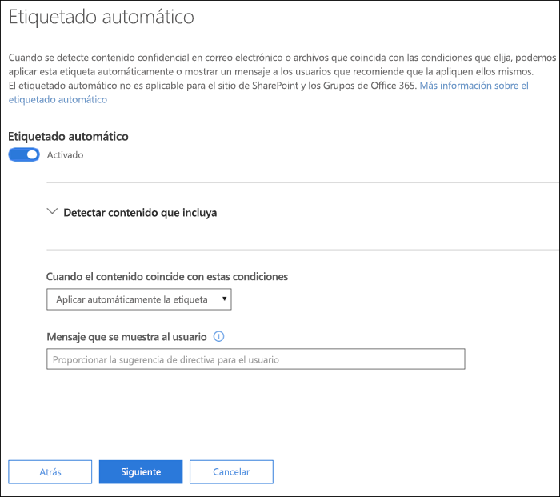
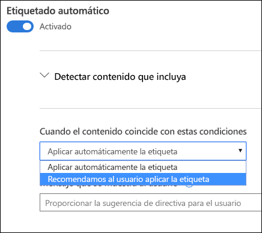

# Aplicar automáticamente una etiqueta de confidencialidad al contenidoApply a sensitivity label to content automatically

Al crear una etiqueta de confidencialidad, puede asignar automáticamente esa etiqueta a contenido con información confidencial, o bien puede solicitar a los usuarios que apliquen la etiqueta recomendada.When you create a sensitivity label, you can automatically assign that label to content containing sensitive information, or you can prompt users to apply the label that you recommend.

La capacidad de aplicar automáticamente etiquetas de confidencialidad al contenido es importante por estos motivos:The ability to apply sensitivity labels to content automatically is important because:

- No es necesario proporcionar aprendizaje a los usuarios para que conozcan todas las clasificaciones.You don't need to train your users on all of your classifications.

- No es necesario depender de los usuarios para clasificar todo el contenido correctamente.You don't need to rely on users to classify all content correctly.

- Los usuarios ya no necesitan conocer las directivas de gobierno de datos; en su lugar, pueden centrarse en su trabajo.Users no longer need to know about your policies - they can instead focus on their work.

Para obtener información sobre los requisitos de licencia, vea [Etiquetas de confidencialidad en las aplicaciones de Office](sensitivity-labels-office-apps.md).For information about license requirements, see [Sensitivity labels in Office apps](sensitivity-labels-office-apps.md).

La configuración de etiquetado automático está disponible cuando se crea una etiqueta de confidencialidad en el Centro de cumplimiento de Microsoft 365, Centro de seguridad de Microsoft 365 o el Centro de seguridad y cumplimiento de Office 365 en **Clasificación** > **Etiquetas de confidencialidad**. The auto-labeling settings are available when you create a sensitivity label in the Microsoft 365 compliance center, Microsoft 365 security center, or Office 365 Security & Compliance Center under **Classification** > **Sensitivity labels**.

## Aplicar una etiqueta de confidencialidad automáticamente basándose en condiciones específicasApply a sensitivity label automatically based on conditions

Una de las características más eficaces de las etiquetas de confidencialidad es la capacidad de aplicarlas automáticamente al contenido que coincide con determinadas condiciones.One of the most powerful features of sensitivity labels is the ability to apply them automatically to content that matches certain conditions. In this case, people in your organization don't need to apply the sensitivity labels - Office 365 does the work for them. En este caso, no es necesario que las personas de la organización apliquen las etiquetas de confidencialidad: Office 365 realiza el trabajo por ellos.One of the most powerful features of sensitivity labels is the ability to apply them automatically to content that matches certain conditions. In this case, people in your organization don't need to apply the sensitivity labels - Office 365 does the work for them.

Puede aplicar etiquetas de confidencialidad a contenido automáticamente cuando ese contenido contenga tipos específicos de información confidencial. Al configurar una etiqueta de confidencialidad para que se aplique automáticamente, verá la misma lista de tipos de información confidencial que al crear una directiva de prevención de pérdida de datos (DLP). Puede, por ejemplo, aplicar automáticamente la etiqueta “Extremadamente confidencial” a cualquier contenido con información de identificación personal (DCP) de clientes, como números de tarjeta de crédito o números del seguro social.You can choose to apply sensitivity labels to content automatically when that content contains specific types of sensitive information. When you configure a sensitivity label to be applied automatically, you see the same list of sensitive information types as when you create a data loss prevention (DLP) policy. So you can, for example, automatically apply a Highly Confidential label to any content that contains customers' personally identifiable information (PII), such as credit card numbers or social security numbers.

Después de seleccionar los tipos de información confidencial, puede restringir la condición al cambiar el recuento de instancias o la precisión de coincidencia.After you choose your sensitive informaton types, you can refine your condition by changing the instance count or match accuracy. For more information, see Tuning rules to make them easier or harder to match. Para obtener más información, vea [Ajustar reglas para hacer más fácil o más difícil la coincidencia](data-loss-prevention-policies.md#tuning-rules-to-make-them-easier-or-harder-to-match).For more information on these options, see [Tuning rules to make them easier or harder to match](data-loss-prevention-policies.md#tuning-rules-to-make-them-easier-or-harder-to-match).

Además, puede elegir si una condición debe detectar todos los tipos de información confidencial o solo uno de ellos.Further, you can choose whether a condition must detect all sensitive information types, or just one of them. Y para hacer que las condiciones sean más flexibles o complejas, puede agregar grupos y usar operadores lógicos entre los grupos.Further, you can choose whether a condition must detect all of the sensitive infromation types, or just one of them. And to make your conditions more flexible or complex, you can add groups and use logical operators between the groups. For more information, see Grouping and logical operators. Para obtener más información, vea [Operadores lógicos y de agrupación](data-loss-prevention-policies.md#grouping-and-logical-operators).For more information, see [Grouping and logical operators](data-loss-prevention-policies.md#grouping-and-logical-operators).

Al aplicar automáticamente una etiqueta de confidencialidad, el usuario verá una notificación en la aplicación de Office. Puede seleccionar **Aceptar** para cerrar la notificación.When a sensitivity label is automatically applied, the user sees a notification in their Office app. They can choose **OK** to dismiss the notification.

## Recomendación para que el usuario aplique una etiqueta de confidencialidadRecommend that the user apply a sensitivity label

Si lo prefiere, puede recomendar a los usuarios que apliquen la etiqueta.If you prefer, you can recommend to your users that they apply the label. Con esta opción, los usuarios pueden aceptar la clasificación y cualquier protección asociada, o descartar la recomendación si la etiqueta no es adecuada para su documento o correo electrónico.With this option, your users can accept the classification and any associated protection, or dismiss the recommendation if the label is not suitable for their document or email.

Las etiquetas recomendadas se admiten en Word, PowerPoint y Excel (y es necesario que esté instalado el cliente de etiquetado unificado de Azure Information Protection).Note that recommended labels are supported in Word, PowerPoint, and Excel (and require that the Azure Information Protection unified labeling client is installed). We're working on support for recommended labels in Outlook.

Este es un ejemplo de un mensaje que se muestra al configurar una condición para aplicar una etiqueta como acción recomendada con una sugerencia de directiva personalizada. Puede elegir el texto que se muestra en la sugerencia de directiva.Here's an example of a prompt when you configure a condition to apply a label as a recommended action, with a custom policy tip. You can choose what text is displayed in the policy tip.

## Forma de aplicar etiquetas recomendadas o automáticasHow automatic or recommended labels are applied

- El etiquetado automático se aplica a Word, Excel y PowerPoint al guardar un documento, y a Outlook al enviar un correo electrónico.Automatic labeling applies to Word, Excel, and PowerPoint when you save a document, and to Outlook when you send an email. Estas condiciones detectan información confidencial en el texto de cuerpo de los documentos y correos electrónicos, y en los encabezados y pies de página, pero no en la línea de asunto o los datos adjuntos de correo electrónico.Automatic labeling applies to Word, Excel, and PowerPoint when documents are saved, and to Outlook when emails are sent. These conditions detect sensitive information in the body text in documents and emails, and to headers and footers -- but not in the subject line or attachments of email.

- No puede usar la clasificación automática para documentos y mensajes de correo electrónico que se etiquetaron previamente de forma manual o de forma automática con una clasificación más alta.You cannot use automatic classification for documents and emails that were previously manually labeled, or previously automatically labeled with a higher classification. Remember, a document or email can have only a single sensitivity label applied to it (in addition to a single retention label). Recuerde, solo se puede aplicar una etiqueta de confidencialidad a un documento o correo electrónico, (además de una sola etiqueta de retención).Remember, you can only apply a single sensitivity label to a document or email (in addition to a single retention label).

- La clasificación recomendada se aplica a Word, Excel y PowerPoint al guardar documentos.Recommended classification applies to Word, Excel, and PowerPoint when you save documents.

- No puede usar la clasificación recomendada para documentos que anteriormente se etiquetaron con una clasificación más alta.You can't use recommended classification for documents that were previously labeled with a higher classification. Cuando el contenido ya está etiquetado con una clasificación más alta, el usuario no verá el mensaje con la recomendación y la sugerencia de directiva.You cannot use recommended classification for documents that were previously labeled with a higher classification. In this case, when the content's already labeled with a higher classification, the user won't see the prompt with the recommendation and policy tip.

## Forma en que se evalúan varias condiciones cuando se aplican en más de una etiquetaHow multiple conditions are evaluated when they apply to more than one label

Las etiquetas se ordenan para su evaluación según la posición que especifique en la directiva: la primera etiqueta colocada tiene la posición inferior (menor confidencialidad) y la última etiqueta colocada tiene la posición superior (mayor confidencialidad). Para obtener más información sobre la prioridad, vea [Prioridad de etiqueta (el orden importa)](sensitivity-labels.md#label-priority-order-matters).The labels are ordered for evaluation according to their position that you specify in the policy: The label positioned first has the lowest position (least sensitive) and the label positioned last has the highest position (most sensitive). For more information on priority, see [Label priority (order matters)](sensitivity-labels.md#label-priority-order-matters).

## No configure una etiqueta principal para que se aplique o recomiende automáticamenteDon't configure a parent label to be applied automatically or recommended

Recuerde, no se puede aplicar una etiqueta principal (una etiqueta con subetiquetas) al contenido.Remember, a parent label (a label with sublabels) can't be applied to content. Asegúrese de no configurar una etiqueta principal para que se aplique o recomiende automáticamente, ya que la etiqueta principal no se aplicará al contenido en las aplicaciones de Office que usan el cliente de etiquetado unificado de Azure Information Protection.Make sure that you don't configure a parent label to be auto-applied or recommended, because the parent label won't be applied to content in Office apps that use the Azure Information Protection unified labeling client. Para obtener más información sobre las etiquetas principales y las subetiquetas, consulte [Subetiquetas (agrupación de etiquetas)](sensitivity-labels.md#sublabels-grouping-labels).For more information on parent labels and sublabels, see [Sublabels (grouping labels)](sensitivity-labels.md#sublabels-grouping-labels).
