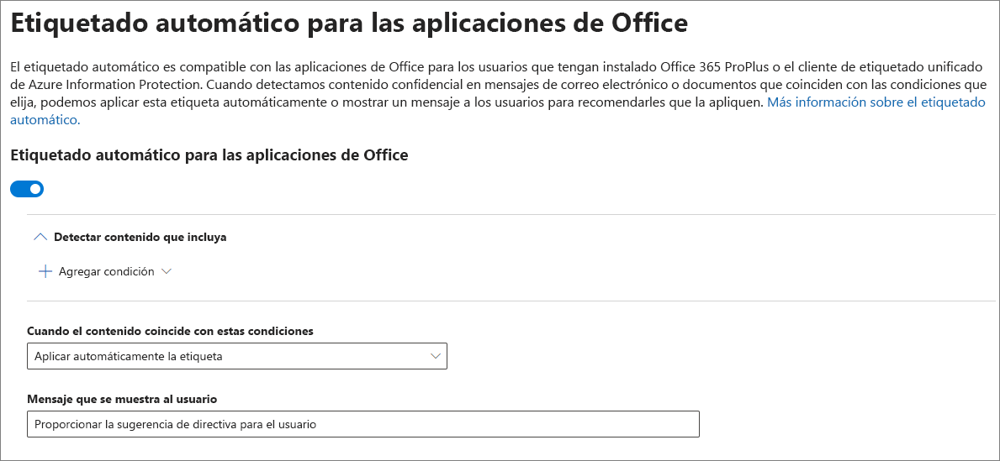

# Aplicar automáticamente una etiqueta de confidencialidad al contenido

Al crear una etiqueta de confidencialidad, puede asignar automáticamente esa etiqueta a contenido con información confidencial, o bien puede solicitar a los usuarios que apliquen la etiqueta recomendada.

La capacidad de aplicar automáticamente etiquetas de confidencialidad al contenido es importante por estos motivos:

- No es necesario proporcionar aprendizaje a los usuarios para que conozcan todas las clasificaciones.

- No es necesario depender de los usuarios para clasificar todo el contenido correctamente.

- Los usuarios ya no necesitan conocer las directivas de gobierno de datos; en su lugar, pueden centrarse en su trabajo.

Para obtener información sobre los requisitos de licencia, consulte [Requisitos de suscripción y licencias para las etiquetas de confidencialidad](sensitivity-labels-office-apps.md#subscription-and-licensing-requirements-for-sensitivity-labels).

La configuración de etiquetado automático está disponible cuando se crea una etiqueta de confidencialidad en el Centro de cumplimiento de Microsoft 365, Centro de seguridad de Microsoft 365 o el Centro de seguridad y cumplimiento de Office 365 en **Clasificación** > **Etiquetas de confidencialidad**. 

## Aplicar una etiqueta de confidencialidad automáticamente basándose en condiciones específicas

Una de las características más eficaces de las etiquetas de confidencialidad es la capacidad de aplicarlas automáticamente al contenido que coincide con determinadas condiciones. En este caso, no es necesario que las personas de la organización apliquen las etiquetas de confidencialidad: Office 365 realiza el trabajo por ellos.

Puede aplicar etiquetas de confidencialidad a contenido automáticamente cuando ese contenido contenga tipos específicos de información confidencial. Al configurar una etiqueta de confidencialidad para que se aplique automáticamente, verá la misma lista de tipos de información confidencial que al crear una directiva de prevención de pérdida de datos (DLP). Puede, por ejemplo, aplicar automáticamente la etiqueta “Extremadamente confidencial” a cualquier contenido con información de identificación personal (DCP) de clientes, como números de tarjeta de crédito o números del seguro social.

Después de seleccionar los tipos de información confidencial, puede restringir la condición al cambiar el recuento de instancias o la precisión de coincidencia. Para obtener más información, vea [Ajustar reglas para hacer más fácil o más difícil la coincidencia](data-loss-prevention-policies.md#tuning-rules-to-make-them-easier-or-harder-to-match).

Además, puede elegir si una condición debe detectar todos los tipos de información confidencial o solo uno de ellos. Y para hacer que las condiciones sean más flexibles o complejas, puede agregar grupos y usar operadores lógicos entre los grupos. Para obtener más información, vea [Operadores lógicos y de agrupación](data-loss-prevention-policies.md#grouping-and-logical-operators).

Al aplicar automáticamente una etiqueta de confidencialidad, el usuario verá una notificación en la aplicación de Office. Puede seleccionar **Aceptar** para cerrar la notificación.

## Recomendación para que el usuario aplique una etiqueta de confidencialidad

Si lo prefiere, puede recomendar a los usuarios que apliquen la etiqueta. Con esta opción, los usuarios pueden aceptar la clasificación y cualquier protección asociada, o descartar la recomendación si la etiqueta no es adecuada para su documento o correo electrónico.

Las etiquetas recomendadas se admiten en Word, PowerPoint y Excel (y es necesario que esté instalado el cliente de etiquetado unificado de Azure Information Protection).

Este es un ejemplo de un mensaje que se muestra al configurar una condición para aplicar una etiqueta como acción recomendada con una sugerencia de directiva personalizada. Puede elegir el texto que se muestra en la sugerencia de directiva.

## Forma de aplicar etiquetas recomendadas o automáticas

- El etiquetado automático se aplica a Word, Excel y PowerPoint al guardar un documento, y a Outlook al enviar un correo electrónico. Estas condiciones detectan información confidencial en el texto de cuerpo de los documentos y correos electrónicos, y en los encabezados y pies de página, pero no en la línea de asunto o los datos adjuntos de correo electrónico.

- No puede usar la clasificación automática para documentos y mensajes de correo electrónico que se etiquetaron previamente de forma manual o de forma automática con una clasificación más alta. Recuerde, solo se puede aplicar una etiqueta de confidencialidad a un documento o correo electrónico, (además de una sola etiqueta de retención).

- La clasificación recomendada se aplica a Word, Excel y PowerPoint al guardar documentos.

- No puede usar la clasificación recomendada para documentos que anteriormente se etiquetaron con una clasificación más alta. Cuando el contenido ya está etiquetado con una clasificación más alta, el usuario no verá el mensaje con la recomendación y la sugerencia de directiva.

## Forma en que se evalúan varias condiciones cuando se aplican en más de una etiqueta

Las etiquetas se ordenan para su evaluación según la posición que especifique en la directiva: la primera etiqueta colocada tiene la posición inferior (menor confidencialidad) y la última etiqueta colocada tiene la posición superior (mayor confidencialidad). Para obtener más información sobre la prioridad, vea [Prioridad de etiqueta (el orden importa)](sensitivity-labels.md#label-priority-order-matters).

## No configure una etiqueta principal para que se aplique o recomiende automáticamente

Recuerde, no se puede aplicar una etiqueta principal (una etiqueta con subetiquetas) al contenido. Asegúrese de no configurar una etiqueta principal para que se aplique o recomiende automáticamente, ya que la etiqueta principal no se aplicará al contenido en las aplicaciones de Office que usan el cliente de etiquetado unificado de Azure Information Protection. Para obtener más información sobre las etiquetas principales y las subetiquetas, consulte [Subetiquetas (agrupación de etiquetas)](sensitivity-labels.md#sublabels-grouping-labels).
