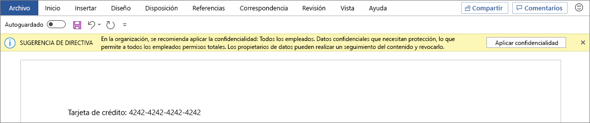

# <a name="apply-a-sensitivity-label-to-content-automatically"></a>Aplicar automáticamente una etiqueta de confidencialidad al contenido

>*[Instrucciones de licencias de Microsoft 365 para la seguridad y el cumplimiento](/office365/servicedescriptions/microsoft-365-service-descriptions/microsoft-365-tenantlevel-services-licensing-guidance/microsoft-365-security-compliance-licensing-guidance).*

> [!NOTE]
> Para obtener información sobre cómo aplicar automáticamente una etiqueta de confidencialidad en Azure Purview, consulte [Etiquetado en Azure Purview](/azure/purview/create-sensitivity-label).

Cuando crea una etiqueta de confidencialidad, puede asignar automáticamente dicha etiqueta a archivos o correos electrónicos cuando se cumplan las condiciones especificadas.

La capacidad de aplicar automáticamente etiquetas de confidencialidad al contenido es importante por estos motivos:

- No es necesario enseñar a los usuarios cuándo usar cada una de las clasificaciones.

- No es necesario depender de los usuarios para clasificar todo el contenido correctamente.

- Los usuarios ya no necesitan conocer las directivas de gobierno de datos; en su lugar, pueden centrarse en su trabajo.

Hay dos métodos diferentes para aplicar automáticamente una etiqueta de confidencialidad en contenido de Microsoft 365:

- **Etiquetado del lado del cliente cuando los usuarios editan documentos o redactan mensajes de correo electrónico (y responden a ellos o los reenvían)**: use una etiqueta configurada para el etiquetado automático para archivos o correos electrónicos (Word, Excel, PowerPoint y Outlook).

    Este método permite recomendar una etiqueta a los usuarios, así como aplicar una etiqueta automáticamente. Pero en ambos casos, el usuario decide si acepta o rechaza la etiqueta, para ayudar a garantizar el etiquetado correcto del contenido. Este etiquetado del lado del cliente tiene un retraso mínimo para los documentos porque la etiqueta se puede aplicar incluso antes de que se guarde el documento. Sin embargo, no todas las aplicaciones cliente son compatibles con el etiquetado automático. Esta funcionalidad es compatible con el etiquetado integrado con [algunas versiones de Office](sensitivity-labels-office-apps.md#support-for-sensitivity-label-capabilities-in-apps), y también con el cliente de etiquetado unificado de Azure Information Protection.

    Para obtener instrucciones de configuración, consulte [Cómo configurar el etiquetado automático en aplicaciones de Office](#how-to-configure-auto-labeling-for-office-apps) en esta página.

- **Etiquetas del lado de servicio cuando el contenido ya está guardado (en SharePoint o en OneDrive) o enviado por correo electrónico (procesado por Exchange Online)**: use una directiva de etiquetado automático.
    
    También se conoce a este método como etiquetado automático para datos en reposo (documentos en SharePoint y OneDrive) y datos en tránsito (correo electrónico enviado o recibido por Exchange). En el caso de Exchange, no incluye correos electrónicos en reposo (buzones).
    
    Ya que este etiquetado lo aplican los servicios en lugar de las aplicaciones, no tiene que preocuparse por qué aplicaciones tienen los usuarios y qué versión. Por lo tanto, esta funcionalidad está disponible inmediatamente en toda la organización y es adecuada para aplicar las etiquetas a cualquier escala. Las directivas de etiquetado automático no admiten el etiquetado recomendado, ya que el usuario no interactúa con el proceso de etiquetado. En su lugar, el administrador ejecuta las directivas en el modo de simulación para ayudarle a garantizar el etiquetado correcto del contenido antes de aplicar la etiqueta.

    Vea las instrucciones de configuración en [Cómo configurar directivas de etiquetado automático para SharePoint, OneDrive y Exchange](#how-to-configure-auto-labeling-policies-for-sharepoint-onedrive-and-exchange) en esta página.
    
    Específico para el etiquetado automático para SharePoint y OneDrive:
    
    - Son compatibles los archivos de Office para Word (.docx), PowerPoint (.pptx) y Excel (.xlsx).
        - Estos archivos se pueden etiquetar automáticamente en reposo antes o después de que se creen las políticas de etiquetado automático. Los archivos no se pueden etiquetar automáticamente si forman parte de una sesión abierta (el archivo está abierto).
        - Actualmente, los datos adjuntos a elementos de lista no son compatibles y no se etiquetarán automáticamente.
    - Máximo 25 000 archivos etiquetados automáticamente en su espacio empresarial por día
    - Máximo de 100 directivas de etiquetado automático por espacio empresarial, cada una con un máximo de 100 sitios (SharePoint o OneDrive) cuando se especifican individualmente. También puede especificar todos los sitios, y esta configuración está exenta del máximo de 100 sitios.
    - Los valores ya existentes para modificados, modificados por y la fecha no se cambian como resultado de las directivas de etiquetado automático tanto para el modo de simulación y como cuando se aplican etiquetas.
    - Cuando la etiqueta aplica el cifrado de, el [issuer Management y el propietario de Rights Management](/azure/information-protection/configure-usage-rights#rights-management-issuer-and-rights-management-owner) es la cuenta en la que se modificó por última vez el archivo. Si esta cuenta ya no está en Azure Active Directory, no se aplicará la etiqueta porque no se pueden establecer estos valores.

    Específico para el etiquetado automático para Exchange:
    
    - A diferencia del etiquetado manual o el etiquetado automático con las aplicaciones de Office, tanto los datos adjuntos de PDF como los datos adjuntos de Office también se analizan en función de las condiciones que especifique en la directiva de etiquetado automático. Cuando haya una coincidencia, el correo electrónico se etiquetará, pero no los datos adjuntos.
        - En el caso de los archivos PDF, si la etiqueta aplica cifrado, estos archivos se cifran mediante el [Cifrado de mensajes de Office 365 (OME)](ome.md) cuando el espacio empresarial está [habilitado para los datos adjuntos de PDF](ome-faq.yml#are-pdf-file-attachments-supported-).
        - Para estos archivos de Office, son compatibles Word, PowerPoint y Excel. Si la etiqueta aplica cifrado, se cifran mediante el [Cifrado de mensajes de Office 365 (OME)](ome.md).
    - Si tiene reglas de flujo de correo de Exchange o directivas de prevención de pérdida de datos (DLP) que aplican el cifrado IRM: cuando estas reglas o directivas y una directiva de etiquetado automático identifican contenido, se aplica la etiqueta. Si esa etiqueta aplica el cifrado, la configuración de IRM de las reglas de flujo de correo de Exchange o de las directivas DLP se pasa por alto. Sin embargo, si esa etiqueta no aplica el cifrado, la configuración de IRM de las reglas de flujo de correo o de las directivas DLP se aplica además de la etiqueta.
    - El correo electrónico que tiene cifrado IRM sin etiqueta se reemplazará por una etiqueta con cualquier configuración de cifrado cuando haya una coincidencia mediante el etiquetado automático.
    - El correo electrónico entrante se etiquetará cuando haya una coincidencia con las condiciones de etiquetado automático. Si esta etiqueta está configurada para [cifrado](encryption-sensitivity-labels.md), ese cifrado siempre se aplica cuando el remitente es de su organización. De forma predeterminada, ese cifrado no se aplica cuando el remitente está fuera de la organización, pero se puede aplicar configurando **opciones adicionales para el** de correo electrónico y especificando un propietario de Rights Management.
    - Cuando la etiqueta aplica el cifrado, el emisor de [propietario de Rights Management y Rights Management ](/azure/information-protection/configure-usage-rights#rights-management-issuer-and-rights-management-owner) es la persona que envía el correo electrónico cuando el remitente es de su propia organización. Cuando el remitente está fuera de la organización, puede especificar un propietario de Rights Management para el correo electrónico entrante etiquetado y cifrado por la directiva.
    - Si la etiqueta está configurada para aplicar [marcas dinámicas](sensitivity-labels-office-apps.md#dynamic-markings-with-variables), tenga en cuenta que, para el correo electrónico entrante, esta configuración puede dar lugar a que se muestren los nombres de personas ajenas a la organización.

## <a name="compare-auto-labeling-for-office-apps-with-auto-labeling-policies"></a>Comparar el etiquetado automático de las aplicaciones de Office con las directivas de etiquetado automático

Use la siguiente tabla para ayudarle a identificar las diferencias en el comportamiento de los dos métodos de etiquetado automático complementarios:

|Característica o comportamiento|Configuración de etiqueta: etiquetado automático para archivos y mensajes de correo electrónico  |Directiva: etiquetado automático|
|:-----|:-----|:-----|
|Dependencia de la aplicación|Sí ([versiones mínimas](sensitivity-labels-office-apps.md#support-for-sensitivity-label-capabilities-in-apps)) |No\* |
|Restringir por ubicación|No |Sí |
|Condiciones: clasificadores que se pueden entrenar|Sí |No |
|Condiciones: opciones de uso compartido y opciones adicionales para el correo electrónico|No |Sí |
|Condiciones: excepciones|No |Sí (solo correo electrónico) |
|Recomendaciones, información sobre herramientas de directiva y sustituciones de usuarios|Sí |No |
|Modo de simulación|No |Sí |
|Datos adjuntos de Exchange verificados por condiciones|No | Sí|
|Aplicar marcas visuales |Sí |Sí (solo correo electrónico) |
|Reemplazar el cifrado IRM aplicado sin una etiqueta|Sí, si el usuario tiene el uso mínimo adecuado de exportar |Sí (solo correo electrónico) |
|Etiquetar correo electrónico entrante|No |Sí|
|Asignar un propietario de Rights Management para los correos electrónicos enviados desde otra organización |No |Sí|
|En el caso de los correos electrónicos, reemplace la etiqueta ya existente que tenga la misma o menor prioridad. |No |Sí (configurable)|

El etiquetado automático \* no está disponible actualmente en todas las regiones debido a una dependencia del backend de Azure. Si su cuenta empresarial no admite esta funcionalidad, la pestaña de **Etiquetado automático** no está visible en el centro de cumplimiento. Para obtener más información, vea [Disponibilidad de dependencia de Azure por país.](/troubleshoot/azure/general/dependency-availability-by-country)

## <a name="how-multiple-conditions-are-evaluated-when-they-apply-to-more-than-one-label"></a>Forma en que se evalúan varias condiciones cuando se aplican en más de una etiqueta

Las etiquetas se ordenan para su evaluación según la posición que especifique en la directiva: la primera etiqueta colocada tiene la posición inferior (menor confidencialidad) y la última etiqueta colocada tiene la posición superior (mayor confidencialidad). Para obtener más información sobre la prioridad, vea [Prioridad de etiqueta (el orden importa)](sensitivity-labels.md#label-priority-order-matters).

## <a name="dont-configure-a-parent-label-to-be-applied-automatically-or-recommended"></a>No configure una etiqueta principal para que se aplique o recomiende automáticamente

Recuerde, no se puede aplicar una etiqueta principal (una etiqueta con subetiquetas) al contenido. Asegúrese de que no configura una etiqueta principal para que se aplique automáticamente o se recomiende en las aplicaciones de Office y no seleccione una etiqueta principal para una directiva de etiquetado automático. Si lo hace, la etiqueta principal no se aplicará al contenido.

Para usar el etiquetado automático con subetiquetas, asegúrese de que publica la etiqueta principal y la subetiqueta.

Para obtener más información sobre las etiquetas principales y las subetiquetas, consulte [Subetiquetas (agrupación de etiquetas)](sensitivity-labels.md#sublabels-grouping-labels).

## <a name="will-an-existing-label-be-overridden"></a>¿Se invalidará una etiqueta ya existente?

> [!NOTE]
> Una configuración agregada recientemente para las directivas de etiquetado automático de correo electrónico le permite especificar que una etiqueta de confidencialidad coincidente siempre invalidará una etiqueta existente.

Comportamiento predeterminado si el etiquetado automático invalidará una etiqueta existente:

- Cuando el contenido se ha etiquetado manualmente, esa etiqueta no se reemplazará por el etiquetado automático.

- El etiquetado automático reemplazará una [etiqueta de confidencialidad de menor prioridad](sensitivity-labels.md#label-priority-order-matters) que se aplicó automáticamente, pero no una etiqueta de prioridad más alta.
    
    > [!TIP]
    > Por ejemplo, la etiqueta de confidencialidad en la parte superior de la lista del centro de cumplimiento se denomina **Público** con un criterio de ordenación (prioridad) de 0, y la etiqueta de confidencialidad de la parte inferior de la lista se denomina **Extremadamente confidencial** con un criterio de ordenación (prioridad de 4). La etiqueta **Extremadamente confidencial** puede invalidar la etiqueta **Público** pero no al revés.

Solo para las directivas de etiquetado automático de correo electrónico, puede seleccionar una configuración para invalidar siempre una etiqueta de confidencialidad existente, independientemente de cómo se haya aplicado.

|Etiqueta ya existente |Reemplazar por la configuración de etiqueta: etiquetado automático para archivos y correos electrónicos  |Invalidar con directiva: etiquetado automático|
|:-----|:-----|:-----|
|Aplicado manualmente, cualquier prioridad|Word, Excel, PowerPoint: No <br /><br> Outlook: No  |SharePoint y OneDrive: no <br /><br> Exchange: no de forma predeterminada, pero configurable |
|Etiqueta aplicada automáticamente o predeterminada de la directiva, prioridad más baja |Word, Excel, PowerPoint: Sí <br /><br> Outlook: Sí | SharePoint y OneDrive: Sí <br /><br> Exchange: Sí |
|Etiqueta aplicada automáticamente o predeterminada de la directiva, prioridad más alta |Word, Excel, PowerPoint: No <br /><br> Outlook: No |SharePoint y OneDrive: no <br /><br> Exchange: no de forma predeterminada, pero configurable |

La configuración configurable para las directivas de etiquetado automático de correo electrónico se encuentra en la página **Configuración adicional para el correo electrónico**. Esta página se muestra después de seleccionar una etiqueta de confidencialidad para una directiva de etiquetado automático que incluye la ubicación de Exchange.

## <a name="how-to-configure-auto-labeling-for-office-apps"></a>Cómo configurar el etiquetado automático para las aplicaciones de Office

Para el etiquetado integrado en las aplicaciones de Office, compruebe las[ versiones mínimas necesarias ](sensitivity-labels-office-apps.md#support-for-sensitivity-label-capabilities-in-apps) para el etiquetado automático en las aplicaciones de Office.

El cliente de etiquetado unificado de Azure Information Protection solo admite el etiquetado automático para los tipos de información confidencial integrados y personalizados, y no admite clasificadores entrenables ni tipos de información confidencial que usan Coincidencia exacta de datos (EDM) o entidades con nombre.

Los ajustes de etiquetado automático para las aplicaciones de Office están disponibles al [crear o editar una etiqueta de confidencialidad](create-sensitivity-labels.md). Asegúrese de que **Archivos y mensajes de correo electrónico** está seleccionada para el ámbito de la etiqueta:


A medida que se desplace por la configuración, verá la página **Etiquetado automático para archivos y mensajes de correo electrónico**, en la que puede elegir entre una lista de tipos de información confidencial o clasificadores que se pueden entrenar:


Cuando esta etiqueta de confidencialidad se aplica automáticamente, el usuario ve una notificación en su aplicación de Office. Por ejemplo:


### <a name="configuring-sensitive-info-types-for-a-label"></a>Configuración de tipos de información confidencial para una etiqueta

Al seleccionar la opción **Tipos de información confidencial**, verá la misma lista de tipos de información confidencial que al crear una directiva de prevención de pérdida de datos (DLP). Por ejemplo, puede aplicar automáticamente una etiqueta de Extremadamente confidencial a cualquier contenido que contenga información personal de los clientes, como números de tarjeta de crédito, números del seguro social o números de pasaporte:


De forma similar a cuando configure directivas DLP, puede restringir la condición cambiando el recuento de instancias y la precisión de la coincidencia. Por ejemplo:


Para obtener más información sobre estas opciones, consulte las siguientes instrucciones de la documentación DLP: [Ajustar las reglas para que sea más o menos fácil que coincidan](data-loss-prevention-policies.md#tuning-rules-to-make-them-easier-or-harder-to-match).

> [!IMPORTANT]
> Los tipos de información confidencial tienen dos formas diferentes de definir los parámetros máximos de recuento de instancias únicas. Para obtener más información, consulte [Valores admitidos de recuento de instancias para SIT](create-a-custom-sensitive-information-type.md#instance-count-supported-values-for-sit).

De forma similar a la configuración de la directiva DLP, también puede elegir si una condición debe detectar todos los tipos de información confidencial o solo uno de ellos. Y para que las condiciones sean más flexibles o complejas, puede agregar [grupos y usar operadores lógicos entre los grupos](data-loss-prevention-policies.md).

> [!NOTE]
> El etiquetado automático basado en tipos personalizados de información confidencial solo se aplica al contenido recién creado o modificado en OneDrive y SharePoint, no al contenido existente. Esta limitación también se aplica a las directivas de etiquetado automático.

#### <a name="custom-sensitive-information-types-with-exact-data-match"></a>Tipo de información confidencial personalizado con coincidencia exacta de datos

Puede configurar una etiqueta de confidencialidad para que use [tipos de información confidencial basados en coincidencias exactas de datos](sit-learn-about-exact-data-match-based-sits.md#learn-about-exact-data-match-based-sensitive-information-types) para tipos de información confidencial personalizados. Sin embargo, actualmente, también debe especificar al menos un tipo de información confidencial que no use la EDM. Por ejemplo, uno de los tipos de información confidencial incorporados, como el **Número de tarjeta de crédito**.

Si configura una etiqueta de confidencialidad solo con la EDM para sus condiciones de tipo de información confidencial, el ajuste de etiquetado automático se desactiva automáticamente para la etiqueta.

### <a name="configuring-trainable-classifiers-for-a-label"></a>Configurar clasificadores capacitados para una etiqueta

Si usa esta opción con Aplicaciones de Microsoft 365 para Windows versión 2106 o inferior, o Aplicaciones de Microsoft 365 para Mac versión 16.50 o inferior, cerciórese de haber publicado en su espacio empresarial al menos otra etiqueta de confidencialidad que esté configurada para el etiquetado automático y la [opción tipos de información confidencial](#configuring-sensitive-info-types-for-a-label). Este requisito no es necesario cuando se usan versiones posteriores en estas plataformas.

Cuando seleccione la opción **Clasificadores que se pueden entrenar**, seleccione uno o más de los clasificadores que se pueden entrenar preentrenados o personalizados:


> [!CAUTION]
> Estamos desaprobando el clasificador preentrenado de **Lenguaje ofensivo** porque ha estado produciendo un alto número de falsos positivos. No use este clasificador y, si lo está usando actualmente, le recomendamos que lo abandone para los procesos empresariales y que, en su lugar, use los clasificadores preentrenados de **Acoso dirigido**, **Lenguaje soez** y **Amenazas**.

Para más información sobre estos clasificadores, consulte [Más información sobre clasificadores que se pueden entrenar (versión preliminar)](classifier-learn-about.md).

### <a name="recommend-that-the-user-applies-a-sensitivity-label"></a>Recomendación para que el usuario aplique una etiqueta de confidencialidad

Si lo prefiere, puede recomendarle a los usuarios que apliquen la etiqueta. Con esta opción, los usuarios pueden aceptar la clasificación y cualquier protección asociada, o descartar la recomendación si la etiqueta no es adecuada para su contenido.


Este es un ejemplo de un mensaje de un cliente de etiquetado unificado de Azure Information Protection que se muestra al configurar una condición para que se aplique una etiqueta como acción recomendada con una sugerencia de directiva personalizada. Puede elegir el texto que se muestra en la sugerencia de directiva.



### <a name="when-automatic-or-recommended-labels-are-applied"></a>Cuándo se aplican etiquetas automáticas o recomendadas

La implementación de etiquetado automático y recomendado en las aplicaciones de Office depende de si está usando el etiquetado que está integrado en Office o el cliente de etiquetado unificado de Azure Information Protection. Sin embargo, en ambos casos:

- No puede usar el etiquetado automático para documentos y mensajes de correo electrónico que se etiquetaron previamente de forma manual o de forma automática con una confidencialidad más alta. Recuerde, solo se puede aplicar una etiqueta de confidencialidad a un documento o correo electrónico, (además de una sola etiqueta de retención).

- No puede usar el etiquetado recomendado para documentos o correos electrónicos que anteriormente se etiquetaron con una confidencialidad más alta. Cuando el contenido ya está etiquetado con una confidencialidad más alta, el usuario no verá el mensaje con la recomendación y la sugerencia de directiva.

Específico para las etiquetas integradas:

- No todas las aplicaciones de Office admiten el etiquetado automático (y recomendado). Para obtener más información, consulte [Compatibilidad con las capacidades de las etiquetas de confidencialidad en aplicaciones](sensitivity-labels-office-apps.md#support-for-sensitivity-label-capabilities-in-apps)

- Para las etiquetas recomendadas en las versiones de escritorio de Word, el contenido confidencial que desencadenó la recomendación está marcado para que los usuarios puedan revisar y quitar el contenido confidencial en lugar de aplicar la etiqueta de confidencialidad recomendada.

- Para obtener más información sobre cómo se aplican estas etiquetas en las aplicaciones de Office, capturas de pantalla de ejemplo, y cómo se detecta la información confidencial, consulte [Aplicar o recomendar automáticamente etiquetas de confidencialidad a sus archivos y correos electrónicos en Office](https://support.microsoft.com/office/automatically-apply-or-recommend-sensitivity-labels-to-your-files-and-emails-in-office-622e0d9c-f38c-470a-bcdb-9e90b24d71a1).

Específico del cliente de etiquetado unificado de Azure Information Protection:

- El etiquetado automático y recomendado se aplica a Word, Excel y PowerPoint al guardar un documento, y a Outlook al enviar un correo electrónico.

- Para que Outlook sea compatible con el etiquetado recomendado, en primer lugar debe configurar una [configuración de directiva avanzada](/azure/information-protection/rms-client/clientv2-admin-guide-customizations#enable-recommended-classification-in-outlook).

- La información confidencial se detecta en el texto del cuerpo de los documentos y correos electrónicos, y en los encabezados y pies de página, pero no en la línea de asunto o en los datos adjuntos de correo electrónico.

## <a name="how-to-configure-auto-labeling-policies-for-sharepoint-onedrive-and-exchange"></a>Cómo configurar directivas de etiquetado automático para SharePoint, OneDrive y Exchange

Asegúrese de tener en cuenta los requisitos previos antes de configurar las directivas de etiquetado automático.

### <a name="prerequisites-for-auto-labeling-policies"></a>Requisitos previos para las directivas de etiquetado automático

- Modo de simulación:
  - La auditoría de Microsoft 365 debe estar activada. Si necesita activar la auditoría o no está seguro de si ya fue activada, consulte [Activar o desactivar la Búsqueda en el registro de auditoría](turn-audit-log-search-on-or-off.md).
  - Para ver el contenido del archivo o correo electrónico en la vista de origen, debe tener el rol de **Visor de contenido de clasificación de los datos**, que se incluye en el grupo de roles **Visor de contenido del explorador de contenido**, o en los grupos de roles de **Information Protection** y **Investigadores de Information Protection** (actualmente en versión preliminar). Si no tiene este rol, no verá el panel de vista previa cuando seleccione un elemento de la pestaña **Elementos coincidentes**. Los administradores globales no tienen este rol de forma predeterminada.

- Para etiquetar automáticamente archivos en SharePoint y OneDrive:
  - Tiene [etiquetas de confidencialidad habilitadas para los archivos de Office en SharePoint y OneDrive](sensitivity-labels-sharepoint-onedrive-files.md).
  - En el momento en el que se ejecuta la directiva de etiquetado automático, el archivo no debe estar abierto por otro proceso o usuario. Un archivo desprotegido para edición entra en esta categoría.

- Si tiene previsto usar [tipos de información confidencial personalizados](sensitive-information-type-learn-about.md) en lugar de los tipos de confidencialidad integrados:
  - Los tipos de información de confidencialidad personalizados solo se aplican al contenido que se agrega o modifica en SharePoint o OneDrive después de aplicar los tipos de información de confidencialidad creados.
  - Para probar los nuevos tipos de información confidencial, créelos antes de crear su directiva de etiquetado automático y, después, cree nuevos documentos con datos de ejemplo para probarlos.

- [Crear y publicar](create-sensitivity-labels.md) una o más etiquetas de confidencialidad (para al menos un usuario) que pueda seleccionar para las directivas de etiquetado automático. Para estas etiquetas:
  - No importa que la opción de etiquetado automático en aplicaciones de Office esté activada o desactivada, ya que la configuración de la etiqueta es complementaria a las directivas de etiquetado automático, como se explica en la introducción.
  - Si las etiquetas que quiere usar para el etiquetado automático están configuradas para usar marcas visuales (encabezados, pies de página, marcas de agua), tenga en cuenta que no se aplican a los documentos.
  - Si las etiquetas aplican [cifrado](encryption-sensitivity-labels.md):
    - Cuando la directiva de etiquetado automático incluye ubicaciones para SharePoint o OneDrive, la etiqueta debe estar configurada para la configuración **Asignar permisos ahora**.
    - Cuando la directiva de etiquetado automático solo es para Exchange, la etiqueta se puede configurar para **Asignar permisos ahora** o **Permitir a los usuarios asignar permisos** (para las opciones No reenviar o Solo cifrar).

### <a name="learn-about-simulation-mode"></a>Más información sobre el modo de simulación

El modo de simulación es único en las directivas de etiquetado automático y se integra en el flujo de trabajo. No puede etiquetar automáticamente documentos y mensajes de correo electrónico hasta que la directiva haya ejecutado al menos una simulación.

El modo de simulación admite hasta 1 000 000 de archivos coincidentes. Si más de este número de archivos coinciden con una directiva de etiquetado automático, no se puede activar la directiva para aplicar las etiquetas. En este caso, debe volver a configurar la directiva de etiquetado automático para que coincidan menos archivos y volver a ejecutar la simulación. Este máximo de 1 000 000 de archivos coincidentes solo se aplica al modo de simulación y no a una directiva de etiquetado automático que ya está aplicando etiquetas de confidencialidad.

Flujo de trabajo para una directiva de etiquetado automático:

1. Crear y configurar una directiva de etiquetado automático.

2. Ejecute la directiva en modo simulación, que puede tardar 12 horas en completarse. La simulación completada desencadena una notificación por correo electrónico que se envía al usuario configurado para recibir [alertas de actividad](alert-policies.md).

3. Revise los resultados y, si es necesario, perfeccione su directiva. Por ejemplo, es posible que deba editar las reglas de directiva para reducir falsos positivos o quitar algunos sitios para que el número de archivos coincidentes no supere 1 000 000. Vuelva a ejecutar el modo de simulación y espere a que se complete de nuevo.

4. Si es necesario, repita el paso 3.

5. Implementar en producción

La implementación simulada se ejecuta como el parámetro WhatIf para PowerShell. Puede ver los resultados indicados como si la directiva de etiquetado automático aplicara la etiqueta seleccionada utilizando las reglas definidas. Si es necesario, puede refinar las reglas mayor precisión y volver a ejecutar la simulación. Sin embargo, como el etiquetado automático para Exchange se aplica a los correos electrónicos enviados y recibidos, en lugar de a los mensajes de correo electrónico almacenados en los buzones, no espere que los resultados de la simulación sean coherentes, salvo que pueda enviar y recibir exactamente los mismos mensajes de correo electrónico.

El modo de simulación también le permite aumentar gradualmente el ámbito de la directiva de etiquetado automático antes de la implementación. Por ejemplo, puede empezar con una única ubicación, como un sitio de SharePoint, con una única biblioteca de documentos. Después, con cambios iterativos, aumente el ámbito a varios sitios y a otra ubicación, como OneDrive.

Por último, puede usar el modo de simulación para ofrecer una aproximación del tiempo necesario para ejecutar la directiva de etiquetado automático, para ayudarle a planear y programar cuándo ejecutarla sin el modo de simulación.

#### <a name="deleted-onedrive-accounts-and-simulation-results"></a>Cuentas de OneDrive eliminadas y resultados de la simulación

Espere posibles discrepancias de visualización en los resultados de la simulación cuando las cuentas de OneDrive eliminadas aún estén en la [fase de retención del proceso de eliminación](/onedrive/retention-and-deletion#the-onedrive-deletion-process). Por ejemplo, un empleado abandona la organización y su administrador tiene acceso temporal a los archivos de OneDrive de ese usuario.

En este escenario, si se especificó la cuenta de OneDrive mediante una dirección URL en la directiva de etiquetado automático, los archivos coincidentes de la cuenta de OneDrive eliminada se incluirán en los resultados de la simulación.

Sin embargo, si no se especificó la cuenta de OneDrive mediante una dirección URL, pero se incluyó con la configuración predeterminada **Todos**:
- Cuando la ubicación de SharePoint se incluye en la directiva, los archivos coincidentes de la cuenta de OneDrive eliminada se muestran como elementos de SharePoint en los resultados de la simulación.
- Cuando la ubicación de SharePoint no se incluye en la directiva, los archivos coincidentes de la cuenta de OneDrive eliminada no se incluyen en los resultados de la simulación.

En todos los casos, los archivos coincidentes se etiquetan hasta que la cuenta de OneDrive se elimine permanentemente. Las discrepancias de visualización enumeradas solo se aplican a los resultados de la simulación.

### <a name="creating-an-auto-labeling-policy"></a>Creación de una directiva de etiquetado automático

1. En el <a href="https://go.microsoft.com/fwlink/p/?linkid=2077149" target="_blank">Centro de cumplimiento de Microsoft 365</a>, desplácese hasta las etiquetas de confidencialidad:

    - **Soluciones** > **Protección de la información**

    Si no ve esta opción inmediatamente, primero seleccione **Mostrar todo**.

2. Seleccione la pestaña **Etiquetado automático**:

    

    > [!NOTE]
    > Si no ve la pestaña **Etiquetado automático**, esta funcionalidad no está disponible actualmente en su región debido a una dependencia de Azure de back-end. Para obtener más información, consulte [Disponibilidad de dependencias de Azure por país](/troubleshoot/azure/general/dependency-availability-by-country).

3. Seleccione **+ Crear directiva de etiquetado automático**. Esto inicia la configuración de Nueva directiva:

    

4. En la página **Elegir la información a la que quiere aplicar esta etiqueta**: seleccione una de las plantillas, como **Finanzas** o **Privacidad**. Puede refinar la búsqueda con la lista desplegable **Mostrar opciones para**. O bien, seleccione **directiva personalizada** si las plantillas no satisfacen sus necesidades. Seleccione **Siguiente**.

5. En la página **Cambiar el nombre de la directiva de etiquetado automático**: proporcione un nombre único y, opcionalmente, una descripción que ayude a identificar la etiqueta aplicada automáticamente, las ubicaciones y las condiciones que identifican el contenido que se va a etiquetar.

6. En la página **Elegir ubicaciones en las que quiere aplicar la etiqueta**: seleccione y especifique las ubicaciones de Exchange, SharePoint y OneDrive. Si no desea mantener el valor predeterminado de **Todo** incluido para las ubicaciones elegidas, seleccione el enlace para elegir instancias específicas para incluir o seleccione el enlace para elegir las instancias específicas para excluir. Después, seleccione **Siguiente**.

    
    
    Si cambia la configuración predeterminada mediante **Incluido** o **Excluido**:
    
    - Para la ubicación de **Exchange**, la directiva se aplica según la dirección del remitente de los destinatarios especificados. La mayoría de las veces, querrá mantener el valor predeterminado de **Todo** incluido con **Ninguno** excluido. Esta configuración es adecuada incluso si está probando un subconjunto de usuarios. En lugar de especificar aquí el subconjunto de usuarios, use las reglas avanzadas del paso siguiente para configurar las condiciones para incluir o excluir destinatarios en su organización. De lo contrario, al cambiar la configuración predeterminada aquí:
        -  Si cambia el valor predeterminado de **Todo** incluido y, en su lugar, elige usuarios o grupos específicos, el correo electrónico enviado desde fuera de la organización estará exento de la directiva. 
        -  Si mantiene el valor predeterminado de **Todo** incluido, pero especifica usuarios o grupos que excluir, el correo electrónico que envíen estos usuarios excluidos estará exento de la directiva, pero no del correo electrónico que reciban.
    
    - Para las cuentas de OneDrive, consulte [Obtener una lista de todas las direcciones URL de OneDrive de usuarios de su organización](/onedrive/list-onedrive-urls) para ayudarle a especificar cuentas individuales de OneDrive que se incluirán o excluirán.

7. Para la página **Configurar reglas comunes o avanzadas**: mantenga el valor predeterminado de las **Reglas comunes** para definir reglas que identifiquen el contenido que se va a etiquetar en todas las ubicaciones seleccionadas. Si necesita reglas diferentes por ubicación, incluidas más opciones para Exchange, seleccione **Reglas avanzadas**. Luego, seleccione **Siguiente**.

    Las reglas usan condiciones que incluyen tipos de información confidencial y opciones de uso compartido:
    - En el caso de los tipos de información confidencial, puede seleccionar tipos de información integrados y personalizados.
    - En las opciones de uso compartido, puede elegir **solo con las personas de mi organización** o **con personas ajenas a mi organización**.

    Si la única ubicación es **Exchange** y ha seleccionado **Reglas avanzadas**, hay otras condiciones que puede seleccionar:
    - La dirección IP del remitente es
    - El dominio del destinatario es
    - El destinatario es
    - La extensión del archivo adjunto es
    - Los datos adjuntos están protegidos con contraseña
    - No se pudo digitalizar algún contenido de los datos adjuntos del correo
    - No se pudo completar el análisis de algún contenido de los datos adjuntos del correo
    - El encabezado coincide con patrones
    - El asunto coincide con patrones
    - La dirección del destinatario contiene palabras
    - La dirección del destinatario coincide con patrones
    - La dirección del remitente coincide con patrones
    - El dominio del remitente es
    - El destinatario es un miembro de
    - El remitente es

    Para cada una de estas condiciones, puede especificar excepciones.

8. En función de las opciones anteriores, ahora tendrá la oportunidad de crear nuevas reglas mediante condiciones y excepciones.

    Las opciones de configuración para los tipos de información confidencial son las mismas que las seleccionadas para el etiquetado automático para las aplicaciones de Office. Si necesita más información, consulte [Configuración de tipos de información confidencial para una etiqueta](#configuring-sensitive-info-types-for-a-label).

    Cuando haya definido todas las reglas que necesita y confirmado que su estado está activo, seleccione **Siguiente** para continuar y elegir una etiqueta de aplicación automática.

9. En la página **Elegir una etiqueta para aplicarla automáticamente**: seleccione **+ Elegir una etiqueta**, seleccione una etiqueta del panel **Elegir una etiqueta de confidencialidad** y seleccione **Siguiente**.

10. Si la directiva incluye la ubicación de Exchange: especifique configuraciones opcionales en la página **Configuración adicional para el correo electrónico** página:
    
    - **Reemplazar automáticamente las etiquetas ya existentes que tienen la misma prioridad o una prioridad inferior**: aplicable a los correos electrónicos entrantes y salientes, al seleccionar esta configuración, se garantiza que siempre se aplicará una etiqueta de confidencialidad coincidente. Si no selecciona esta configuración, no se aplicará una etiqueta de confidencialidad coincidente a los correos electrónicos que tengan una etiqueta de confidencialidad ya existente con una [mayor prioridad](sensitivity-labels.md#label-priority-order-matters) o que se etiquetaron manualmente.
    
    - **Aplicar el cifrado al correo electrónico recibido de fuera de la organización**: al seleccionar esta opción, debe asignar un [propietario Administrador de derechos](/azure/information-protection/configure-usage-rights#rights-management-issuer-and-rights-management-owner) para asegurarse de que una persona autorizada de su organización tenga control total del [uso de derechos](/azure/information-protection/configure-usage-rights#usage-rights-and-descriptions) para los correos electrónicos enviados desde fuera de su organización y su etiquetas de directiva con cifrado. Este rol podría ser necesario para quitar más adelante el cifrado o asignar diferentes derechos de uso para los usuarios de su organización.
        
        Para **Asignar un propietario de Rights Management**, especifique un único usuario mediante una dirección de correo electrónico que sea propiedad de su organización. No especifique un contacto de correo, un buzón compartido ni ningún tipo de grupo, ya que no se admiten para este rol.

10. En la página **Decidir si quiere probar la directiva ahora o más tarde**: seleccione **Ejecutar directiva en modo de simulación** si ya está listo para ejecutar la directiva de etiquetado automático en el modo de simulación. De lo contrario, seleccione **Dejar directiva desactivada**. A continuación, seleccione **Siguiente**:

    

11. En la página **Resumen**: Revise la configuración de la directiva de etiquetado automático, realice los cambios que sean necesarios y finalice la configuración.

Ahora, en la página de **Protección de la información** > **Etiquetado automático**, verá su directiva de etiquetado automático en la sección **Simulación** o **Desactivado**, en función de si ha elegido ejecutarla en el modo simulación o no. Seleccione su directiva para ver los detalles de la configuración y el estado (por ejemplo, **Simulación de directiva aún en ejecución**). Para las directivas en el modo de simulación, seleccione la pestaña **Elementos coincidentes** para ver los correos electrónicos o documentos que coinciden con las reglas especificadas.

Puede modificar la directiva directamente desde esta interfaz:

- Para una directiva en la sección **Desactivado**, seleccione el botón **Editar directiva**.

- Para las directivas en la sección **Simulación**, seleccione la opción **Editar directiva** en la parte superior de la página, en cualquiera de las pestañas:

    

    Cuando esté listo para ejecutar la directiva sin simulación, seleccione la opción **Activar directiva**.

Las directivas de etiquetado automático se ejecutan continuamente hasta que se eliminan. Por ejemplo, los archivos nuevos y modificados se incluirán en la configuración de directivas actual.

### <a name="monitoring-your-auto-labeling-policy"></a>Supervisión de la directiva de etiquetado automático

Después de activar la directiva de etiquetado automático, puede ver el progreso del etiquetado de los archivos en las ubicaciones de SharePoint y OneDrive elegidas. Los correos electrónicos no se incluyen en el progreso de etiquetado porque se etiquetan automáticamente a medida que se envían.

El progreso del etiquetado incluye los archivos que va a etiquetar la directiva, los archivos etiquetados en los últimos 7 días y el total de archivos etiquetados. Debido al máximo de etiquetado de 25 000 archivos al día, esta información le proporciona visibilidad del progreso del etiquetado actual de la directiva y de cuántos archivos aún deben etiquetarse.

La primera vez que active la directiva, verá inicialmente un valor de 0 para que los archivos se etiqueten hasta que se recuperen los datos más recientes. Esta información de progreso se actualiza cada 48 horas, por lo que puede esperar ver los datos más actuales cada dos días. Al seleccionar una directiva de etiquetado automático, puede ver más detalles sobre la directiva en un panel desplegable, que incluye el progreso del etiquetado de los 10 sitios principales. La información de este panel desplegable puede estar más actualizada que la información de directiva agregada que se muestra en la página principal **Etiquetado automático**.

También puede ver los resultados de la directiva de etiquetado automático con el [explorador de contenido](data-classification-content-explorer.md) cuando tenga los [permisos](data-classification-content-explorer.md#permissions) correspondientes:

- El grupo de roles **Visor de listas del explorador de contenido** le permite ver la etiqueta de un archivo, pero no el contenido del archivo.
- El grupo de roles **Visor de contenido del Explorador de contenido** y los grupos de roles **Information Protection** y **Investigadores de Information Protection** (actualmente en versión preliminar) le permiten ver el contenido del archivo.

> [!TIP]
> También puede utilizar el explorador de contenidos para identificar las ubicaciones que tienen documentos con información confidencial, pero que no están etiquetados. Con esta información, considere la posibilidad de agregar estas ubicaciones a la directiva de etiquetado automático e incluir los tipos de información confidencial identificados como reglas.

### <a name="use-powershell-for-auto-labeling-policies"></a>Usar PowerShell para las directivas de etiquetado automático

Puede usar el [Centro de seguridad y cumplimiento de PowerShell](/powershell/exchange/scc-powershell) para crear y configurar directivas de etiquetado automático. Esto significa que puede redactar por completo la creación y mantenimiento de las políticas de etiquetado automático, lo que también ofrece un método más eficaz para especificar múltiples direcciones URL para las ubicaciones de OneDrive y SharePoint.

Antes de ejecutar los comandos de PowerShell, primero debe [conectarse a PowerShell del Centro de seguridad y cumplimiento](/powershell/exchange/connect-to-scc-powershell).

Crear una nueva directiva de etiquetado automático:

```powershell
New-AutoSensitivityLabelPolicy -Name <AutoLabelingPolicyName> -SharePointLocation "<SharePointSiteLocation>" -ApplySensitivityLabel <Label> -Mode TestWithoutNotifications
```

Este comando crea una directiva de etiquetado automático para un sitio de SharePoint que especifique. Para una ubicación de OneDrive use en su lugar el parámetro *OneDriveLocation*.

Para agregar más sitios a una directiva de etiquetado automático existente:

```powershell
$spoLocations = @("<SharePointSiteLocation1>","<SharePointSiteLocation2>")
Set-AutoSensitivityLabelPolicy -Identity <AutoLabelingPolicyName> -AddSharePointLocation $spoLocations -ApplySensitivityLabel <Label> -Mode TestWithoutNotifications
```

Este comando especifica la nueva URL de SharePoint en una variable que luego se agrega a una directiva de etiquetado automático existente. Para agregar ubicaciones de OneDrive en su lugar, use el parámetro *AddOneDriveLocation* con una variable diferente, como *$OneDriveLocations*.

Crear una nueva regla de directiva de etiquetado automático:

```powershell
New-AutoSensitivityLabelRule -Policy <AutoLabelingPolicyName> -Name <AutoLabelingRuleName> -ContentContainsSensitiveInformation @{"name"= "a44669fe-0d48-453d-a9b1-2cc83f2cba77"; "mincount" = "2"} -Workload SharePoint
```

Para una directiva de etiquetado automático existente, este comando crea una nueva regla de directiva para detectar el tipo de información confidencial del **número de la seguridad social de los Estados Unidos (SSN)**, que tiene un identificador de entidad a44669fe-0d48-453d-a9b1-2cc83f2cba77. Para encontrar los ID de la entidad para otros tipos de información confidencial, consulte [Definiciones de entidad de tipos de información confidencial](sensitive-information-type-entity-definitions.md).

Para obtener más información sobre los cmdlets de PowerShell que son compatibles con las directivas de etiquetado automático, los parámetros disponibles y algunos ejemplos, vea la ayuda del cmdlet siguiente:

- [Get-AutoSensitivityLabelPolicy](/powershell/module/exchange/get-autosensitivitylabelpolicy)
- [New-AutoSensitivityLabelPolicy](/powershell/module/exchange/new-autosensitivitylabelpolicy)
- [New-AutoSensitivityLabelRule](/powershell/module/exchange/new-autosensitivitylabelrule)
- [Remove-AutoSensitivityLabelPolicy](/powershell/module/exchange/remove-autosensitivitylabelpolicy)
- [Remove-AutoSensitivityLabelRule](/powershell/module/exchange/remove-autosensitivitylabelrule)
- [Set-AutoSensitivityLabelPolicy](/powershell/module/exchange/set-autosensitivitylabelpolicy)
- [Set-AutoSensitivityLabelRule](/powershell/module/exchange/set-autosensitivitylabelrule)

## <a name="tips-to-increase-labeling-reach"></a>Sugerencias para aumentar el alcance del etiquetado

Aunque el etiquetado automático es una de las formas más eficaces de clasificar, etiquetar y proteger los archivos de Office que posee su organización, compruebe si es posible que pueda complementarlo con cualquiera de estos métodos adicionales para aumentar el alcance del etiquetado:

- Con SharePoint Syntex, puede [aplicar una etiqueta de confidencialidad a un modelo de comprensión de documentos](/microsoft-365/contentunderstanding/apply-a-sensitivity-label-to-a-model), para que los documentos identificados en una biblioteca de SharePoint se etiqueten automáticamente.

- Cuando use el cliente de etiquetado unificado [Azure Information Protection](/azure/information-protection/rms-client/aip-clientv2):

  - Para los archivos de almacenes de datos locales, como recursos compartidos de red y bibliotecas de SharePoint Server: use el [analizador](/azure/information-protection/deploy-aip-scanner) de para detectar información confidencial en estos archivos y etiquetarlos correctamente. Si tiene previsto migrar o cargar estos archivos en SharePoint en Microsoft 365, use el detector para etiquetar los archivos antes de moverlos a la nube.

  - Si ha usado otra solución de etiquetado antes de usar etiquetas de confidencialidad: use PowerShell y [una configuración avanzada para reutilizar etiquetas](/azure/information-protection/rms-client/clientv2-admin-guide-customizations#migrate-labels-from-secure-islands-and-other-labeling-solutions) de estas soluciones.

- Fomente el [etiquetado manual](https://support.microsoft.com/office/apply-sensitivity-labels-to-your-files-and-email-in-office-2f96e7cd-d5a4-403b-8bd7-4cc636bae0f9) después de dar a los usuarios aprendizaje sobre qué etiquetas de confidencialidad se aplicarán. Cuando esté seguro de que los usuarios entienden qué etiqueta aplicar, considere la posibilidad de configurar una etiqueta predeterminada y un etiquetado obligatorio como [configuración de directiva](sensitivity-labels.md#what-label-policies-can-do).

Además, plantéese [marcar nuevos archivos como confidenciales de forma predeterminada](/sharepoint/sensitive-by-default) en SharePoint para evitar que los invitados accedan a los archivos recién agregados hasta que al menos una directiva DLP examine el contenido del archivo.
