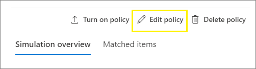

# <a name="apply-a-sensitivity-label-to-content-automatically"></a><span data-ttu-id="caf66-103">Aplicar automáticamente una etiqueta de confidencialidad al contenido</span><span class="sxs-lookup"><span data-stu-id="caf66-103">Apply a sensitivity label to content automatically</span></span>

><span data-ttu-id="caf66-104">*[Instrucciones de licencias de Microsoft 365 para la seguridad y el cumplimiento](/office365/servicedescriptions/microsoft-365-service-descriptions/microsoft-365-tenantlevel-services-licensing-guidance/microsoft-365-security-compliance-licensing-guidance).*</span><span class="sxs-lookup"><span data-stu-id="caf66-104">*[Microsoft 365 licensing guidance for security & compliance](/office365/servicedescriptions/microsoft-365-service-descriptions/microsoft-365-tenantlevel-services-licensing-guidance/microsoft-365-security-compliance-licensing-guidance).*</span></span>

> [!NOTE]
> <span data-ttu-id="caf66-105">Para obtener información sobre cómo aplicar automáticamente una etiqueta de confidencialidad en Azure Purview (versión preliminar), consulte [Etiquetar automáticamente el contenido en Azure Purview](/azure/purview/create-sensitivity-label).</span><span class="sxs-lookup"><span data-stu-id="caf66-105">For information about automatically applying a sensitivity label in Azure Purview (preview), see [Automatically label your content in Azure Purview](/azure/purview/create-sensitivity-label).</span></span>

<span data-ttu-id="caf66-106">Cuando crea una etiqueta de confidencialidad, puede asignar automáticamente dicha etiqueta a archivos o correos electrónicos cuando se cumplan las condiciones especificadas.</span><span class="sxs-lookup"><span data-stu-id="caf66-106">When you create a sensitivity label, you can automatically assign that label to files and emails when it matches conditions that you specify.</span></span>

<span data-ttu-id="caf66-107">La capacidad de aplicar automáticamente etiquetas de confidencialidad al contenido es importante por estos motivos:</span><span class="sxs-lookup"><span data-stu-id="caf66-107">This ability to apply sensitivity labels to content automatically is important because:</span></span>

- <span data-ttu-id="caf66-108">No es necesario enseñar a los usuarios cuándo usar cada una de las clasificaciones.</span><span class="sxs-lookup"><span data-stu-id="caf66-108">You don't need to train your users when to use each of your classifications.</span></span>

- <span data-ttu-id="caf66-109">No es necesario depender de los usuarios para clasificar todo el contenido correctamente.</span><span class="sxs-lookup"><span data-stu-id="caf66-109">You don't need to rely on users to classify all content correctly.</span></span>

- <span data-ttu-id="caf66-110">Los usuarios ya no necesitan conocer las directivas de gobierno de datos; en su lugar, pueden centrarse en su trabajo.</span><span class="sxs-lookup"><span data-stu-id="caf66-110">Users no longer need to know about your policies—they can instead focus on their work.</span></span>

<span data-ttu-id="caf66-111">Si el contenido se ha etiquetado manualmente, dicha etiqueta nunca se reemplazará por el etiquetado automático.</span><span class="sxs-lookup"><span data-stu-id="caf66-111">When content has been manually labeled, that label will never be replaced by automatic labeling.</span></span> <span data-ttu-id="caf66-112">Sin embargo, el etiquetado automático puede reemplazar una [etiqueta de menor prioridad](sensitivity-labels.md#label-priority-order-matters) que se aplicó automáticamente.</span><span class="sxs-lookup"><span data-stu-id="caf66-112">However, automatic labeling can replace a [lower priority label](sensitivity-labels.md#label-priority-order-matters) that was automatically applied.</span></span>

<span data-ttu-id="caf66-113">Hay dos métodos diferentes para aplicar automáticamente una etiqueta de confidencialidad en contenido de Microsoft 365:</span><span class="sxs-lookup"><span data-stu-id="caf66-113">There are two different methods for automatically applying a sensitivity label to content in Microsoft 365:</span></span>

- <span data-ttu-id="caf66-114">**Etiquetado del lado del cliente cuando los usuarios editan documentos o redactan mensajes de correo electrónico (y responden a ellos o los reenvían)**: use una etiqueta configurada para el etiquetado automático para archivos o correos electrónicos (Word, Excel, PowerPoint y Outlook).</span><span class="sxs-lookup"><span data-stu-id="caf66-114">**Client-side labeling when users edit documents or compose (also reply or forward) emails**: Use a label that's configured for auto-labeling for files and emails (includes Word, Excel, PowerPoint, and Outlook).</span></span> 
    
    <span data-ttu-id="caf66-115">Este método permite recomendar una etiqueta a los usuarios, así como aplicar una etiqueta automáticamente.</span><span class="sxs-lookup"><span data-stu-id="caf66-115">This method supports recommending a label to users, as well as automatically applying a label.</span></span> <span data-ttu-id="caf66-116">Pero en ambos casos, el usuario decide si acepta o rechaza la etiqueta, para ayudar a garantizar el etiquetado correcto del contenido.</span><span class="sxs-lookup"><span data-stu-id="caf66-116">But in both cases, the user decides whether to accept or reject the label, to help ensure the correct labeling of content.</span></span> <span data-ttu-id="caf66-117">Este etiquetado del lado del cliente tiene un retraso mínimo para los documentos porque la etiqueta se puede aplicar incluso antes de que se guarde el documento.</span><span class="sxs-lookup"><span data-stu-id="caf66-117">This client-side labeling has minimal delay for documents because the label can be applied even before the document is saved.</span></span> <span data-ttu-id="caf66-118">Sin embargo, no todas las aplicaciones cliente son compatibles con el etiquetado automático.</span><span class="sxs-lookup"><span data-stu-id="caf66-118">However, not all client apps support auto-labeling.</span></span> <span data-ttu-id="caf66-119">Esta funcionalidad es compatible con el cliente de etiquetado unificado de Azure Information Protection y [algunas versiones de Office](sensitivity-labels-office-apps.md#support-for-sensitivity-label-capabilities-in-apps).</span><span class="sxs-lookup"><span data-stu-id="caf66-119">This capability is supported by the Azure Information Protection unified labeling client, and [some versions of Office](sensitivity-labels-office-apps.md#support-for-sensitivity-label-capabilities-in-apps).</span></span> 
    
    <span data-ttu-id="caf66-120">Para obtener instrucciones de configuración, consulte [Cómo configurar el etiquetado automático en aplicaciones de Office](#how-to-configure-auto-labeling-for-office-apps) en esta página.</span><span class="sxs-lookup"><span data-stu-id="caf66-120">For configuration instructions, see [How to configure auto-labeling for Office apps](#how-to-configure-auto-labeling-for-office-apps) on this page.</span></span>

- <span data-ttu-id="caf66-121">**Etiquetas del lado de servicio cuando el contenido ya está guardado (en SharePoint o en OneDrive) o enviado por correo electrónico (procesado por Exchange Online)**: use una directiva de etiquetado automático.</span><span class="sxs-lookup"><span data-stu-id="caf66-121">**Service-side labeling when content is already saved (in SharePoint or OneDrive) or emailed (processed by Exchange Online)**: Use an auto-labeling policy.</span></span> 
    
    <span data-ttu-id="caf66-122">También se conoce a este método como etiquetado automático para datos en reposo (documentos en SharePoint y OneDrive) y datos en tránsito (correo electrónico enviado o recibido por Exchange).</span><span class="sxs-lookup"><span data-stu-id="caf66-122">You might also hear this method referred to as auto-labeling for data at rest (documents in SharePoint and OneDrive) and data in transit (email that is sent or received by Exchange).</span></span> <span data-ttu-id="caf66-123">En el caso de Exchange, no incluye correos electrónicos en reposo (buzones).</span><span class="sxs-lookup"><span data-stu-id="caf66-123">For Exchange, it doesn't include emails at rest (mailboxes).</span></span>
    
    <span data-ttu-id="caf66-124">Ya que este etiquetado lo aplican los servicios en lugar de las aplicaciones, no tiene que preocuparse por qué aplicaciones tienen los usuarios y qué versión.</span><span class="sxs-lookup"><span data-stu-id="caf66-124">Because this labeling is applied by services rather than by applications, you don't need to worry about what apps users have and what version.</span></span> <span data-ttu-id="caf66-125">Por lo tanto, esta funcionalidad está disponible inmediatamente en toda la organización y es adecuada para aplicar las etiquetas a cualquier escala.</span><span class="sxs-lookup"><span data-stu-id="caf66-125">As a result, this capability is immediately available throughout your organization and suitable for labeling at scale.</span></span> <span data-ttu-id="caf66-126">Las directivas de etiquetado automático no admiten el etiquetado recomendado, ya que el usuario no interactúa con el proceso de etiquetado.</span><span class="sxs-lookup"><span data-stu-id="caf66-126">Auto-labeling policies don't support recommended labeling because the user doesn't interact with the labeling process.</span></span> <span data-ttu-id="caf66-127">En su lugar, el administrador ejecuta las directivas en el modo de simulación para ayudarle a garantizar el etiquetado correcto del contenido antes de aplicar la etiqueta.</span><span class="sxs-lookup"><span data-stu-id="caf66-127">Instead, the administrator runs the policies in simulation mode to help ensure the correct labeling of content before actually applying the label.</span></span>
    
    <span data-ttu-id="caf66-128">Vea las instrucciones de configuración en [Cómo configurar directivas de etiquetado automático para SharePoint, OneDrive y Exchange](#how-to-configure-auto-labeling-policies-for-sharepoint-onedrive-and-exchange) en esta página.</span><span class="sxs-lookup"><span data-stu-id="caf66-128">For configuration instructions, see [How to configure auto-labeling policies for SharePoint, OneDrive, and Exchange](#how-to-configure-auto-labeling-policies-for-sharepoint-onedrive-and-exchange) on this page.</span></span>
    
    <span data-ttu-id="caf66-129">Específico para el etiquetado automático para SharePoint y OneDrive:</span><span class="sxs-lookup"><span data-stu-id="caf66-129">Specific to auto-labeling for SharePoint and OneDrive:</span></span>
    - <span data-ttu-id="caf66-130">Son compatibles los archivos de Office para Word, PowerPoint y Excel.</span><span class="sxs-lookup"><span data-stu-id="caf66-130">Office files for Word, PowerPoint, and Excel are supported.</span></span> <span data-ttu-id="caf66-131">El formato Open XML es compatible (como .docx y .xlsx), pero el formato de Microsoft Office 97-2003 (como .doc y .xls) no lo es.</span><span class="sxs-lookup"><span data-stu-id="caf66-131">Open XML format is supported (such as .docx and .xlsx) but not Microsoft Office 97-2003 format (such as .doc and .xls).</span></span>
        - <span data-ttu-id="caf66-132">Estos archivos se pueden etiquetar automáticamente en reposo antes o después de que se creen las políticas de etiquetado automático.</span><span class="sxs-lookup"><span data-stu-id="caf66-132">These files can be auto-labeled at rest before or after the auto-labeling policies are created.</span></span> <span data-ttu-id="caf66-133">Tenga en cuenta que los archivos no se pueden etiquetar automáticamente si forman parte de una sesión abierta (el archivo está abierto).</span><span class="sxs-lookup"><span data-stu-id="caf66-133">Note that files cannot be auto-labeled if they are part of an open session (the file is open).</span></span>
    - <span data-ttu-id="caf66-134">Máximo 25 000 archivos etiquetados automáticamente en su espacio empresarial por día</span><span class="sxs-lookup"><span data-stu-id="caf66-134">Maximum of 25,000 automatically labeled files in your tenant per day.</span></span>
    - <span data-ttu-id="caf66-135">Máximo de 10 directivas de etiquetado automático por espacio empresarial, cada una con un máximo de 10 sitios (SharePoint o OneDrive).</span><span class="sxs-lookup"><span data-stu-id="caf66-135">Maximum of 10 auto-labeling policies per tenant, each targeting up to 10 sites (SharePoint or OneDrive).</span></span>
    - <span data-ttu-id="caf66-136">Los valores existentes para modificado, modificado por y la fecha no se cambian como resultado de las directivas de etiquetado automático, tanto en el modo de simulación como al aplicar las etiquetas.</span><span class="sxs-lookup"><span data-stu-id="caf66-136">Existing values for modified, modified by, and the date are not changed as a result of auto-labeling policies—for both simulation mode and when labels are applied.</span></span>
    - <span data-ttu-id="caf66-137">Cuando la etiqueta aplica el cifrado de, el [issuer Management y el propietario de Rights Management](/azure/information-protection/configure-usage-rights#rights-management-issuer-and-rights-management-owner) es la cuenta en la que se modificó por última vez el archivo.</span><span class="sxs-lookup"><span data-stu-id="caf66-137">When the label applies encryption, the [Rights Management issuer and Rights Management owner](/azure/information-protection/configure-usage-rights#rights-management-issuer-and-rights-management-owner) is the account that last modified the file.</span></span>

    <span data-ttu-id="caf66-138">Específico para el etiquetado automático para Exchange:</span><span class="sxs-lookup"><span data-stu-id="caf66-138">Specific to auto-labeling for Exchange:</span></span>
    - <span data-ttu-id="caf66-139">A diferencia de las etiquetas manuales o el etiquetado automático con las aplicaciones de Office, los datos adjuntos de Office (archivos de Word, Excel y PowerPoint) y los datos adjuntos de PDF también se analizan en función de las condiciones que especifique en la directiva de etiquetado automático.</span><span class="sxs-lookup"><span data-stu-id="caf66-139">Unlike manual labeling or auto-labeling with Office apps, Office attachments (Word, Excel, and PowerPoint files) and PDF attachments are also scanned for the conditions you specify in your auto-labeling policy.</span></span> <span data-ttu-id="caf66-140">Cuando haya una coincidencia, el correo electrónico se etiquetará, pero no los datos adjuntos.</span><span class="sxs-lookup"><span data-stu-id="caf66-140">When there is a match, the email is labeled but not the attachment.</span></span>
        - <span data-ttu-id="caf66-141">Para estos archivos de Office, el formato Open XML es compatible (como .docx y .xlsx), pero el formato de Microsoft Office 97-2003 (como .doc y .xls) no lo es.</span><span class="sxs-lookup"><span data-stu-id="caf66-141">For these Office files, Open XML format is supported (such as .docx and .xlsx) but not Microsoft Office 97-2003 format (such as .doc and .xls).</span></span>
    - <span data-ttu-id="caf66-142">Si tiene reglas de flujo de correo de Exchange o directivas de prevención de pérdida de datos (DLP) que aplican el cifrado IRM: cuando estas reglas o directivas y una directiva de etiquetado automático identifican contenido, se aplica la etiqueta.</span><span class="sxs-lookup"><span data-stu-id="caf66-142">If you have Exchange mail flow rules or data loss prevention (DLP) policies that apply IRM encryption: When content is identified by these rules or policies and an auto-labeling policy, the label is applied.</span></span> <span data-ttu-id="caf66-143">Si esa etiqueta aplica el cifrado, la configuración de IRM de las reglas de flujo de correo de Exchange o de las directivas DLP se pasa por alto.</span><span class="sxs-lookup"><span data-stu-id="caf66-143">If that label applies encryption, the IRM settings from the Exchange mail flow rules or DLP policies are ignored.</span></span> <span data-ttu-id="caf66-144">Sin embargo, si esa etiqueta no aplica el cifrado, la configuración de IRM de las reglas de flujo de correo o de las directivas DLP se aplica además de la etiqueta.</span><span class="sxs-lookup"><span data-stu-id="caf66-144">However, if that label doesn't apply encryption, the IRM settings from the mail flow rules or DLP policies are applied in addition to the label.</span></span>
    - <span data-ttu-id="caf66-145">El correo electrónico con cifrado IRM sin etiqueta se reemplazará por una etiqueta con una configuración de cifrado cuando haya una coincidencia al usar etiquetado automático.</span><span class="sxs-lookup"><span data-stu-id="caf66-145">Email that has IRM encryption with no label will be replaced by a label with any encryption settings when there is a match by using auto-labeling.</span></span>
    - <span data-ttu-id="caf66-146">El correo electrónico entrante se etiquetará cuando haya una coincidencia con las condiciones de etiquetado automático.</span><span class="sxs-lookup"><span data-stu-id="caf66-146">Incoming email is labeled when there is a match with your auto-labeling conditions.</span></span> <span data-ttu-id="caf66-147">Sin embargo, si la etiqueta está configurada para el cifrado, no se aplica el cifrado.</span><span class="sxs-lookup"><span data-stu-id="caf66-147">However, if the label is configured for encryption, that encryption isn't applied.</span></span>
    - <span data-ttu-id="caf66-148">Cuando la etiqueta aplica cifrado, el [emisor de la administración de derechos y el propietario la administración de derechos](/azure/information-protection/configure-usage-rights#rights-management-issuer-and-rights-management-owner) es la persona que envía el correo electrónico.</span><span class="sxs-lookup"><span data-stu-id="caf66-148">When the label applies encryption, the [Rights Management issuer and Rights Management owner](/azure/information-protection/configure-usage-rights#rights-management-issuer-and-rights-management-owner) is the person who sends the email.</span></span>
    

## <a name="compare-auto-labeling-for-office-apps-with-auto-labeling-policies"></a><span data-ttu-id="caf66-149">Comparar el etiquetado automático de las aplicaciones de Office con las directivas de etiquetado automático</span><span class="sxs-lookup"><span data-stu-id="caf66-149">Compare auto-labeling for Office apps with auto-labeling policies</span></span>

<span data-ttu-id="caf66-150">Use la siguiente tabla para ayudarle a identificar las diferencias en el comportamiento de los dos métodos de etiquetado automático complementarios:</span><span class="sxs-lookup"><span data-stu-id="caf66-150">Use the following table to help you identify the differences in behavior for the two complementary automatic labeling methods:</span></span>

|<span data-ttu-id="caf66-151">Característica o comportamiento</span><span class="sxs-lookup"><span data-stu-id="caf66-151">Feature or behavior</span></span>|<span data-ttu-id="caf66-152">Configuración de etiqueta: etiquetado automático para archivos y mensajes de correo electrónico</span><span class="sxs-lookup"><span data-stu-id="caf66-152">Label setting: Auto-labeling for files and emails</span></span>  |<span data-ttu-id="caf66-153">Directiva: etiquetado automático</span><span class="sxs-lookup"><span data-stu-id="caf66-153">Policy: Auto-labeling</span></span>|
|:-----|:-----|:-----|
|<span data-ttu-id="caf66-154">Dependencia de la aplicación</span><span class="sxs-lookup"><span data-stu-id="caf66-154">App dependency</span></span>|[<span data-ttu-id="caf66-155">Sí</span><span class="sxs-lookup"><span data-stu-id="caf66-155">Yes</span></span>](sensitivity-labels-office-apps.md#support-for-sensitivity-label-capabilities-in-apps) |<span data-ttu-id="caf66-156">No\*</span><span class="sxs-lookup"><span data-stu-id="caf66-156">No \*</span></span> |
|<span data-ttu-id="caf66-157">Restringir por ubicación</span><span class="sxs-lookup"><span data-stu-id="caf66-157">Restrict by location</span></span>|<span data-ttu-id="caf66-158">No</span><span class="sxs-lookup"><span data-stu-id="caf66-158">No</span></span> |<span data-ttu-id="caf66-159">Sí</span><span class="sxs-lookup"><span data-stu-id="caf66-159">Yes</span></span> |
|<span data-ttu-id="caf66-160">Condiciones: clasificadores que se pueden entrenar</span><span class="sxs-lookup"><span data-stu-id="caf66-160">Conditions: Trainable classifiers</span></span>|<span data-ttu-id="caf66-161">Sí</span><span class="sxs-lookup"><span data-stu-id="caf66-161">Yes</span></span> |<span data-ttu-id="caf66-162">No</span><span class="sxs-lookup"><span data-stu-id="caf66-162">No</span></span> |
|<span data-ttu-id="caf66-163">Condiciones: opciones de uso compartido y opciones adicionales para el correo electrónico</span><span class="sxs-lookup"><span data-stu-id="caf66-163">Conditions: Sharing options and additional options for email</span></span>|<span data-ttu-id="caf66-164">No</span><span class="sxs-lookup"><span data-stu-id="caf66-164">No</span></span> |<span data-ttu-id="caf66-165">Sí</span><span class="sxs-lookup"><span data-stu-id="caf66-165">Yes</span></span> |
|<span data-ttu-id="caf66-166">Recomendaciones, información sobre herramientas de directiva y sustituciones de usuarios</span><span class="sxs-lookup"><span data-stu-id="caf66-166">Recommendations, policy tooltip, and user overrides</span></span>|<span data-ttu-id="caf66-167">Sí</span><span class="sxs-lookup"><span data-stu-id="caf66-167">Yes</span></span> |<span data-ttu-id="caf66-168">No</span><span class="sxs-lookup"><span data-stu-id="caf66-168">No</span></span> |
|<span data-ttu-id="caf66-169">Modo de simulación</span><span class="sxs-lookup"><span data-stu-id="caf66-169">Simulation mode</span></span>|<span data-ttu-id="caf66-170">No</span><span class="sxs-lookup"><span data-stu-id="caf66-170">No</span></span> |<span data-ttu-id="caf66-171">Sí</span><span class="sxs-lookup"><span data-stu-id="caf66-171">Yes</span></span> |
|<span data-ttu-id="caf66-172">Datos adjuntos de Exchange verificados por condiciones</span><span class="sxs-lookup"><span data-stu-id="caf66-172">Exchange attachments checked for conditions</span></span>|<span data-ttu-id="caf66-173">No</span><span class="sxs-lookup"><span data-stu-id="caf66-173">No</span></span> | <span data-ttu-id="caf66-174">Sí</span><span class="sxs-lookup"><span data-stu-id="caf66-174">Yes</span></span>|
|<span data-ttu-id="caf66-175">Aplicar marcas visuales</span><span class="sxs-lookup"><span data-stu-id="caf66-175">Apply visual markings</span></span> |<span data-ttu-id="caf66-176">Sí</span><span class="sxs-lookup"><span data-stu-id="caf66-176">Yes</span></span> |<span data-ttu-id="caf66-177">Sí (solo correo electrónico)</span><span class="sxs-lookup"><span data-stu-id="caf66-177">Yes (email only)</span></span> |
|<span data-ttu-id="caf66-178">Reemplazar el cifrado IRM aplicado sin una etiqueta</span><span class="sxs-lookup"><span data-stu-id="caf66-178">Override IRM encryption applied without a label</span></span>|<span data-ttu-id="caf66-179">Sí, si el usuario tiene el uso mínimo adecuado de exportar</span><span class="sxs-lookup"><span data-stu-id="caf66-179">Yes if the user has the minimum usage right of Export</span></span> |<span data-ttu-id="caf66-180">Sí (solo correo electrónico)</span><span class="sxs-lookup"><span data-stu-id="caf66-180">Yes (email only)</span></span> |
|<span data-ttu-id="caf66-181">Etiquetar correo electrónico entrante</span><span class="sxs-lookup"><span data-stu-id="caf66-181">Label incoming email</span></span>|<span data-ttu-id="caf66-182">No</span><span class="sxs-lookup"><span data-stu-id="caf66-182">No</span></span> |<span data-ttu-id="caf66-183">Sí (no se aplicó cifrado)</span><span class="sxs-lookup"><span data-stu-id="caf66-183">Yes (encryption not applied)</span></span> |

<span data-ttu-id="caf66-184">\*El etiquetado automático no está disponible actualmente en todas las regiones.</span><span class="sxs-lookup"><span data-stu-id="caf66-184">\* Auto-labeling isn't currently available in all regions.</span></span> <span data-ttu-id="caf66-185">Si su espacio empresarial no es compatible con esta funcionalidad, la pestaña etiquetado automático no se puede ver en el centro de etiquetado de administración.</span><span class="sxs-lookup"><span data-stu-id="caf66-185">If your tenant can't support this functionality, the Auto-labeling tab isn't visible in the admin labeling center.</span></span>

## <a name="how-multiple-conditions-are-evaluated-when-they-apply-to-more-than-one-label"></a><span data-ttu-id="caf66-186">Forma en que se evalúan varias condiciones cuando se aplican en más de una etiqueta</span><span class="sxs-lookup"><span data-stu-id="caf66-186">How multiple conditions are evaluated when they apply to more than one label</span></span>

<span data-ttu-id="caf66-p111">Las etiquetas se ordenan para su evaluación según la posición que especifique en la directiva: la primera etiqueta colocada tiene la posición inferior (menor confidencialidad) y la última etiqueta colocada tiene la posición superior (mayor confidencialidad). Para obtener más información sobre la prioridad, vea [Prioridad de etiqueta (el orden importa)](sensitivity-labels.md#label-priority-order-matters).</span><span class="sxs-lookup"><span data-stu-id="caf66-p111">The labels are ordered for evaluation according to their position that you specify in the policy: The label positioned first has the lowest position (least sensitive) and the label positioned last has the highest position (most sensitive). For more information on priority, see [Label priority (order matters)](sensitivity-labels.md#label-priority-order-matters).</span></span>

## <a name="dont-configure-a-parent-label-to-be-applied-automatically-or-recommended"></a><span data-ttu-id="caf66-189">No configure una etiqueta principal para que se aplique o recomiende automáticamente</span><span class="sxs-lookup"><span data-stu-id="caf66-189">Don't configure a parent label to be applied automatically or recommended</span></span>

<span data-ttu-id="caf66-190">Recuerde, no se puede aplicar una etiqueta principal (una etiqueta con subetiquetas) al contenido.</span><span class="sxs-lookup"><span data-stu-id="caf66-190">Remember, you can't apply a parent label (a label with sublabels) to content.</span></span> <span data-ttu-id="caf66-191">Asegúrese de que no configura una etiqueta principal para que se aplique automáticamente o se recomiende en las aplicaciones de Office y no seleccione una etiqueta principal para una directiva de etiquetado automático.</span><span class="sxs-lookup"><span data-stu-id="caf66-191">Make sure that you don't configure a parent label to be auto-applied or recommended in Office apps, and don't select a parent label for an auto-labeling policy.</span></span> <span data-ttu-id="caf66-192">Si lo hace, la etiqueta principal no se aplicará al contenido.</span><span class="sxs-lookup"><span data-stu-id="caf66-192">If you do, the parent label won't be applied to content.</span></span>

<span data-ttu-id="caf66-193">Para usar el etiquetado automático con subetiquetas, asegúrese de que publica la etiqueta principal y la subetiqueta.</span><span class="sxs-lookup"><span data-stu-id="caf66-193">To use automatic labeling with sublabels, make sure you publish both the parent label and the sublabel.</span></span>

<span data-ttu-id="caf66-194">Para obtener más información sobre las etiquetas principales y las subetiquetas, consulte [Subetiquetas (agrupación de etiquetas)](sensitivity-labels.md#sublabels-grouping-labels).</span><span class="sxs-lookup"><span data-stu-id="caf66-194">For more information on parent labels and sublabels, see [Sublabels (grouping labels)](sensitivity-labels.md#sublabels-grouping-labels).</span></span>

## <a name="how-to-configure-auto-labeling-for-office-apps"></a><span data-ttu-id="caf66-195">Cómo configurar el etiquetado automático para las aplicaciones de Office</span><span class="sxs-lookup"><span data-stu-id="caf66-195">How to configure auto-labeling for Office apps</span></span>

<span data-ttu-id="caf66-196">El etiquetado automático en las aplicaciones de Office para Windows es compatible con el cliente de etiquetado unificado de Azure Information Protection.</span><span class="sxs-lookup"><span data-stu-id="caf66-196">Automatic labeling in Office apps for Windows is supported by the Azure Information Protection unified labeling client.</span></span> <span data-ttu-id="caf66-197">Para las etiquetas incorporadas en las aplicaciones de Office, esta funcionalidad se encuentra en [diferentes fases de disponibilidad en las distintas aplicaciones](sensitivity-labels-office-apps.md#support-for-sensitivity-label-capabilities-in-apps).</span><span class="sxs-lookup"><span data-stu-id="caf66-197">For built-in labeling in Office apps, this capability is in [different stages of availability for different apps](sensitivity-labels-office-apps.md#support-for-sensitivity-label-capabilities-in-apps).</span></span>

<span data-ttu-id="caf66-198">Los ajustes de etiquetado automático para las aplicaciones de Office están disponibles al [crear o editar una etiqueta de confidencialidad](create-sensitivity-labels.md).</span><span class="sxs-lookup"><span data-stu-id="caf66-198">The auto-labeling settings for Office apps are available when you [create or edit a sensitivity label](create-sensitivity-labels.md).</span></span> <span data-ttu-id="caf66-199">Asegúrese de que **Archivos y mensajes de correo electrónico** está seleccionada para el ámbito de la etiqueta:</span><span class="sxs-lookup"><span data-stu-id="caf66-199">Make sure **Files & emails** is selected for the label's scope:</span></span> 


<span data-ttu-id="caf66-201">A medida que se desplace por el asistente, verá la página **Etiquetado automático para archivos y mensajes de correo electrónico**, en la que puede elegir entre una lista de tipos de información confidencial o clasificadores que se pueden entrenar:</span><span class="sxs-lookup"><span data-stu-id="caf66-201">As you move through the wizard, you see the **Auto-labeling for files and emails** page where you can choose from a list of sensitive info types or trainable classifiers:</span></span>


<span data-ttu-id="caf66-203">Cuando esta etiqueta de confidencialidad se aplica automáticamente, el usuario ve una notificación en su aplicación de Office.</span><span class="sxs-lookup"><span data-stu-id="caf66-203">When this sensitivity label is automatically applied, the user sees a notification in their Office app.</span></span> <span data-ttu-id="caf66-204">Por ejemplo:</span><span class="sxs-lookup"><span data-stu-id="caf66-204">For example:</span></span>


### <a name="configuring-sensitive-info-types-for-a-label"></a><span data-ttu-id="caf66-206">Configuración de tipos de información confidencial para una etiqueta</span><span class="sxs-lookup"><span data-stu-id="caf66-206">Configuring sensitive info types for a label</span></span>

<span data-ttu-id="caf66-207">Si selecciona la opción **tipos de información confidencial**, verá la misma lista de tipos de información confidencial que cuando crea una directiva de prevención de pérdida de datos (DLP).</span><span class="sxs-lookup"><span data-stu-id="caf66-207">When you select the **Sensitive info types** option, you see the same list of sensitive information types as when you create a data loss prevention (DLP) policy.</span></span> <span data-ttu-id="caf66-208">Por ejemplo, puede aplicar automáticamente una etiqueta extremadamente confidencial a cualquier contenido que incluya información personal de los clientes, como los números de tarjeta de crédito, de la seguridad social o de pasaporte:</span><span class="sxs-lookup"><span data-stu-id="caf66-208">So you can, for example, automatically apply a Highly Confidential label to any content that contains customers' personal information, such as credit card numbers, social security numbers, or passport numbers:</span></span>


<span data-ttu-id="caf66-210">De forma similar a cuando configure directivas DLP, puede restringir la condición cambiando el recuento de instancias y la precisión de la coincidencia.</span><span class="sxs-lookup"><span data-stu-id="caf66-210">Similarly to when you configure DLP policies, you can then refine your condition by changing the instance count and match accuracy.</span></span> <span data-ttu-id="caf66-211">Por ejemplo:</span><span class="sxs-lookup"><span data-stu-id="caf66-211">For example:</span></span>


<span data-ttu-id="caf66-213">Para obtener más información sobre estas opciones, consulte las siguientes instrucciones de la documentación DLP: [Ajustar las reglas para que sea más o menos fácil que coincidan](data-loss-prevention-policies.md#tuning-rules-to-make-them-easier-or-harder-to-match).</span><span class="sxs-lookup"><span data-stu-id="caf66-213">You can learn more about these configuration options from the DLP documentation: [Tuning rules to make them easier or harder to match](data-loss-prevention-policies.md#tuning-rules-to-make-them-easier-or-harder-to-match).</span></span>

<span data-ttu-id="caf66-214">Además, de la misma manera que ocurre con la configuración de directiva DLP, puede elegir si una condición debe detectar todos los tipos de información confidencial o solo uno de ellos.</span><span class="sxs-lookup"><span data-stu-id="caf66-214">Also similarly to DLP policy configuration, you can choose whether a condition must detect all sensitive information types, or just one of them.</span></span> <span data-ttu-id="caf66-215">Y para hacer que las condiciones sean más flexibles o complejas, puede agregar [grupos y usar operadores lógicos entre los grupos](data-loss-prevention-policies.md#grouping-and-logical-operators).</span><span class="sxs-lookup"><span data-stu-id="caf66-215">And to make your conditions more flexible or complex, you can add [groups and use logical operators between the groups](data-loss-prevention-policies.md#grouping-and-logical-operators).</span></span>

### <a name="configuring-trainable-classifiers-for-a-label"></a><span data-ttu-id="caf66-216">Configurar clasificadores capacitados para una etiqueta</span><span class="sxs-lookup"><span data-stu-id="caf66-216">Configuring trainable classifiers for a label</span></span>

<span data-ttu-id="caf66-217">Esta opción está disponible actualmente en versión preliminar.</span><span class="sxs-lookup"><span data-stu-id="caf66-217">This option is currently in preview.</span></span> <span data-ttu-id="caf66-218">Si usa esta opción, asegúrese de haber publicado en su espacio empresarial al menos otra etiqueta de confidencialidad que esté configurada para la etiqueta automática y la opción [tipos de información confidencial](#configuring-sensitive-info-types-for-a-label).</span><span class="sxs-lookup"><span data-stu-id="caf66-218">If you use this option, make sure you have published in your tenant at least one other sensitivity label that's configured for auto-labeling and the [sensitive info types option](#configuring-sensitive-info-types-for-a-label).</span></span>

<span data-ttu-id="caf66-219">Cuando seleccione la opción **Clasificadores**, seleccione uno o más de los clasificadores capacitados incorporados de Microsoft.</span><span class="sxs-lookup"><span data-stu-id="caf66-219">When you select the **Trainable classifiers** option, select one or more of the built-in trainable classifiers from Microsoft.</span></span> <span data-ttu-id="caf66-220">Si ha creado sus propios clasificadores capacitados personalizados, estos también están disponibles para seleccionar:</span><span class="sxs-lookup"><span data-stu-id="caf66-220">If you've created your own custom trainable classifiers, these are also available to select:</span></span>


> [!CAUTION]
> <span data-ttu-id="caf66-222">Estamos desaprobando el clasificador incorporado de **Lenguaje ofensivo** porque ha estado produciendo un alto número de falsos positivos.</span><span class="sxs-lookup"><span data-stu-id="caf66-222">We are deprecating the **Offensive Language** built-in classifier because it has been producing a high number of false positives.</span></span> <span data-ttu-id="caf66-223">No use este clasificador incorporado y si lo está usando actualmente, debería mover sus procesos de negocios fuera de él.</span><span class="sxs-lookup"><span data-stu-id="caf66-223">Don't use this built-in classifier and if you are currently using it, you should move your business processes off it.</span></span> <span data-ttu-id="caf66-224">Recomendamos que usen los clasificadores integrados de **Acoso selectivo**, **Blasfemias**, **Amenazas**</span><span class="sxs-lookup"><span data-stu-id="caf66-224">We recommend using the **Targeted Harassment**, **Profanity**, and **Threat** built-in classifiers instead.</span></span>

<span data-ttu-id="caf66-225">Para más información sobre estos clasificadores, consulte [Más información sobre clasificadores que se pueden entrenar (versión preliminar)](classifier-learn-about.md).</span><span class="sxs-lookup"><span data-stu-id="caf66-225">For more information about these classifiers, see [Learn about trainable classifiers](classifier-learn-about.md).</span></span>

<span data-ttu-id="caf66-226">Durante el periodo de previsualización para esta opción, las siguientes aplicaciones soportan clasificadores capacitados para etiquetas de confidencialidad:</span><span class="sxs-lookup"><span data-stu-id="caf66-226">During the preview period for this option, the following apps support trainable classifiers for sensitivity labels:</span></span>

- <span data-ttu-id="caf66-227">Aplicaciones de Microsoft 365 para empresas ([anteriormente Office 365 ProPlus](/deployoffice/name-change)) para Windows, que ahora se implementan en el [Canal actual](/deployoffice/overview-update-channels#current-channel-overview) en la versión 2006 y posteriores:</span><span class="sxs-lookup"><span data-stu-id="caf66-227">Microsoft 365 Apps for enterprise ([formerly Office 365 ProPlus](/deployoffice/name-change)) for Windows, now rolling out to the [Current Channel](/deployoffice/overview-update-channels#current-channel-overview) in version 2006 and later:</span></span>
    - <span data-ttu-id="caf66-228">Word</span><span class="sxs-lookup"><span data-stu-id="caf66-228">Word</span></span>
    - <span data-ttu-id="caf66-229">Excel</span><span class="sxs-lookup"><span data-stu-id="caf66-229">Excel</span></span>
    - <span data-ttu-id="caf66-230">PowerPoint</span><span class="sxs-lookup"><span data-stu-id="caf66-230">PowerPoint</span></span>

- <span data-ttu-id="caf66-231">Office para las aplicaciones web, cuando se han [habilitado las etiquetas de confidencialidad para los archivos de Office en SharePoint y OneDrive](sensitivity-labels-sharepoint-onedrive-files.md):</span><span class="sxs-lookup"><span data-stu-id="caf66-231">Office for the web apps, when you have [enabled sensitivity labels for Office files in SharePoint and OneDrive](sensitivity-labels-sharepoint-onedrive-files.md):</span></span>
    - <span data-ttu-id="caf66-232">Word</span><span class="sxs-lookup"><span data-stu-id="caf66-232">Word</span></span>
    - <span data-ttu-id="caf66-233">Excel</span><span class="sxs-lookup"><span data-stu-id="caf66-233">Excel</span></span>
    - <span data-ttu-id="caf66-234">PowerPoint</span><span class="sxs-lookup"><span data-stu-id="caf66-234">PowerPoint</span></span>
    - <span data-ttu-id="caf66-235">Outlook</span><span class="sxs-lookup"><span data-stu-id="caf66-235">Outlook</span></span>

### <a name="recommend-that-the-user-applies-a-sensitivity-label"></a><span data-ttu-id="caf66-236">Recomendación para que el usuario aplique una etiqueta de confidencialidad</span><span class="sxs-lookup"><span data-stu-id="caf66-236">Recommend that the user applies a sensitivity label</span></span>

<span data-ttu-id="caf66-237">Si lo prefiere, puede recomendar a los usuarios que apliquen la etiqueta.</span><span class="sxs-lookup"><span data-stu-id="caf66-237">If you prefer, you can recommend to your users that they apply the label.</span></span> <span data-ttu-id="caf66-238">Con esta opción, los usuarios pueden aceptar la clasificación y cualquier protección asociada, o descartar la recomendación si la etiqueta no es adecuada para su contenido.</span><span class="sxs-lookup"><span data-stu-id="caf66-238">With this option, your users can accept the classification and any associated protection, or dismiss the recommendation if the label isn't suitable for their content.</span></span>


<span data-ttu-id="caf66-240">Este es un ejemplo de un mensaje de un cliente de etiquetado unificado de Azure Information Protection que se muestra al configurar una condición para que se aplique una etiqueta como acción recomendada con una sugerencia de directiva personalizada. </span><span class="sxs-lookup"><span data-stu-id="caf66-240">Here's an example of a prompt from the Azure Information Protection unified labeling client when you configure a condition to apply a label as a recommended action, with a custom policy tip.</span></span> <span data-ttu-id="caf66-241">Puede elegir el texto que se muestra en la sugerencia de directiva.</span><span class="sxs-lookup"><span data-stu-id="caf66-241">You can choose what text is displayed in the policy tip.</span></span>


### <a name="when-automatic-or-recommended-labels-are-applied"></a><span data-ttu-id="caf66-243">Cuándo se aplican etiquetas automáticas o recomendadas</span><span class="sxs-lookup"><span data-stu-id="caf66-243">When automatic or recommended labels are applied</span></span>

<span data-ttu-id="caf66-244">La implementación de etiquetado automático y recomendado en las aplicaciones de Office depende de si está usando el etiquetado que está integrado en Office o el cliente de etiquetado unificado de Azure Information Protection.</span><span class="sxs-lookup"><span data-stu-id="caf66-244">The implementation of automatic and recommended labeling in Office apps depend on whether you're using labeling that's built into Office, or the Azure Information Protection unified labeling client.</span></span> <span data-ttu-id="caf66-245">Sin embargo, en ambos casos:</span><span class="sxs-lookup"><span data-stu-id="caf66-245">In both cases, however:</span></span>

- <span data-ttu-id="caf66-246">No puede usar el etiquetado automático para documentos y mensajes de correo electrónico que se etiquetaron previamente de forma manual o de forma automática con una confidencialidad más alta.</span><span class="sxs-lookup"><span data-stu-id="caf66-246">You can't use automatic labeling for documents and emails that were previously manually labeled, or previously automatically labeled with a higher sensitivity.</span></span> <span data-ttu-id="caf66-247">Recuerde, solo se puede aplicar una etiqueta de confidencialidad a un documento o correo electrónico, (además de una sola etiqueta de retención).</span><span class="sxs-lookup"><span data-stu-id="caf66-247">Remember, you can only apply a single sensitivity label to a document or email (in addition to a single retention label).</span></span>

- <span data-ttu-id="caf66-248">No puede usar el etiquetado recomendado para documentos o correos electrónicos que anteriormente se etiquetaron con una confidencialidad más alta.</span><span class="sxs-lookup"><span data-stu-id="caf66-248">You can't use recommended labeling for documents or emails that were previously labeled with a higher sensitivity.</span></span> <span data-ttu-id="caf66-249">Cuando el contenido ya está etiquetado con una confidencialidad más alta, el usuario no verá el mensaje con la recomendación y la sugerencia de directiva.</span><span class="sxs-lookup"><span data-stu-id="caf66-249">When the content's already labeled with a higher sensitivity, the user won't see the prompt with the recommendation and policy tip.</span></span>

<span data-ttu-id="caf66-250">Específico para las etiquetas integradas:</span><span class="sxs-lookup"><span data-stu-id="caf66-250">Specific to built-in labeling:</span></span>

- <span data-ttu-id="caf66-251">No todas las aplicaciones de Office admiten el etiquetado automático (y recomendado).</span><span class="sxs-lookup"><span data-stu-id="caf66-251">Not all Office apps support automatic (and recommended) labeling.</span></span> <span data-ttu-id="caf66-252">Para obtener más información, consulte [Compatibilidad con las capacidades de las etiquetas de confidencialidad en aplicaciones](sensitivity-labels-office-apps.md#support-for-sensitivity-label-capabilities-in-apps)</span><span class="sxs-lookup"><span data-stu-id="caf66-252">For more information, see [Support for sensitivity label capabilities in apps](sensitivity-labels-office-apps.md#support-for-sensitivity-label-capabilities-in-apps).</span></span>

- <span data-ttu-id="caf66-253">Para las etiquetas recomendadas en las versiones de escritorio de Word, el contenido confidencial que desencadenó la recomendación está marcado para que los usuarios puedan revisar y quitar el contenido confidencial en lugar de aplicar la etiqueta de confidencialidad recomendada.</span><span class="sxs-lookup"><span data-stu-id="caf66-253">For recommended labels in the desktop versions of Word, the sensitive content that triggered the recommendation is flagged so that users can review and remove the sensitive content instead of applying the recommended sensitivity label.</span></span>

- <span data-ttu-id="caf66-254">Para obtener más información sobre cómo se aplican estas etiquetas en las aplicaciones de Office, capturas de pantalla de ejemplo, y cómo se detecta la información confidencial, consulte [Aplicar o recomendar automáticamente etiquetas de confidencialidad a sus archivos y correos electrónicos en Office](https://support.office.com/es-ES/article/automatically-apply-or-recommend-sensitivity-labels-to-your-files-and-emails-in-office-622e0d9c-f38c-470a-bcdb-9e90b24d71a1).</span><span class="sxs-lookup"><span data-stu-id="caf66-254">For details about how these labels are applied in Office apps, example screenshots, and how sensitive information is detected, see [Automatically apply or recommend sensitivity labels to your files and emails in Office](https://support.office.com/es-ES/article/automatically-apply-or-recommend-sensitivity-labels-to-your-files-and-emails-in-office-622e0d9c-f38c-470a-bcdb-9e90b24d71a1).</span></span>

<span data-ttu-id="caf66-255">Específico del cliente de etiquetado unificado de Azure Information Protection:</span><span class="sxs-lookup"><span data-stu-id="caf66-255">Specific to the Azure Information Protection unified labeling client:</span></span>

-  <span data-ttu-id="caf66-256">El etiquetado automático y recomendado se aplica a Word, Excel y PowerPoint al guardar un documento, y a Outlook al enviar un correo electrónico.</span><span class="sxs-lookup"><span data-stu-id="caf66-256">Automatic and recommended labeling applies to Word, Excel, and PowerPoint when you save a document, and to Outlook when you send an email.</span></span>

- <span data-ttu-id="caf66-257">Para que Outlook sea compatible con el etiquetado recomendado, en primer lugar debe configurar una [configuración de directiva avanzada](/azure/information-protection/rms-client/clientv2-admin-guide-customizations#enable-recommended-classification-in-outlook).</span><span class="sxs-lookup"><span data-stu-id="caf66-257">For Outlook to support recommended labeling, you must first configure an [advanced policy setting](/azure/information-protection/rms-client/clientv2-admin-guide-customizations#enable-recommended-classification-in-outlook).</span></span>

- <span data-ttu-id="caf66-258">La información confidencial se detecta en el texto del cuerpo de los documentos y correos electrónicos, y en los encabezados y pies de página, pero no en la línea de asunto o en los datos adjuntos de correo electrónico.</span><span class="sxs-lookup"><span data-stu-id="caf66-258">Sensitive information can be detected in the body text in documents and emails, and to headers and footers—but not in the subject line or attachments of email.</span></span>

## <a name="how-to-configure-auto-labeling-policies-for-sharepoint-onedrive-and-exchange"></a><span data-ttu-id="caf66-259">Cómo configurar directivas de etiquetado automático para SharePoint, OneDrive y Exchange</span><span class="sxs-lookup"><span data-stu-id="caf66-259">How to configure auto-labeling policies for SharePoint, OneDrive, and Exchange</span></span>

<span data-ttu-id="caf66-260">Asegúrese de tener en cuenta los requisitos previos antes de configurar las directivas de etiquetado automático.</span><span class="sxs-lookup"><span data-stu-id="caf66-260">Make sure you're aware of the prerequisites before you configure auto-labeling policies.</span></span> 

### <a name="prerequisites-for-auto-labeling-policies"></a><span data-ttu-id="caf66-261">Requisitos previos para las directivas de etiquetado automático</span><span class="sxs-lookup"><span data-stu-id="caf66-261">Prerequisites for auto-labeling policies</span></span>

- <span data-ttu-id="caf66-262">Modo de simulación:</span><span class="sxs-lookup"><span data-stu-id="caf66-262">Simulation mode:</span></span>
    - <span data-ttu-id="caf66-263">Se debe activar la auditoría de Microsoft 365.</span><span class="sxs-lookup"><span data-stu-id="caf66-263">Auditing for Microsoft 365 must be turned on.</span></span> <span data-ttu-id="caf66-264">Si necesita activar la auditoría o no está seguro de si la auditoría ya está activada, consulte [Activar o desactivar la búsqueda de registros de auditoría](turn-audit-log-search-on-or-off.md).</span><span class="sxs-lookup"><span data-stu-id="caf66-264">If you need to turn on auditing or you're not sure whether auditing is already on, see [Turn audit log search on or off](turn-audit-log-search-on-or-off.md).</span></span>
    - <span data-ttu-id="caf66-265">Para ver el contenido de los archivos en la vista de origen, debe tener el rol de **Visor de contenido en el explorador de contenido**.</span><span class="sxs-lookup"><span data-stu-id="caf66-265">To view file contents in the source view, you must have the **Content Explorer Content Viewer** role.</span></span> <span data-ttu-id="caf66-266">Los administradores globales no tienen este rol de forma predeterminada.</span><span class="sxs-lookup"><span data-stu-id="caf66-266">Global admins don't have this role by default.</span></span> <span data-ttu-id="caf66-267">Si no tiene este permiso, no verá el panel de vista previa cuando seleccione un elemento en la pestaña **Elementos coincidentes**.</span><span class="sxs-lookup"><span data-stu-id="caf66-267">If you don't have this permission, you don't see the preview pane when you select an item from the **Matched Items** tab.</span></span>

- <span data-ttu-id="caf66-268">Para etiquetar automáticamente archivos en SharePoint y OneDrive:</span><span class="sxs-lookup"><span data-stu-id="caf66-268">To auto-label files in SharePoint and OneDrive:</span></span>
    - <span data-ttu-id="caf66-269">Tiene [etiquetas de confidencialidad habilitadas para los archivos de Office en SharePoint y OneDrive](sensitivity-labels-sharepoint-onedrive-files.md).</span><span class="sxs-lookup"><span data-stu-id="caf66-269">You have [enabled sensitivity labels for Office files in SharePoint and OneDrive](sensitivity-labels-sharepoint-onedrive-files.md).</span></span>
    - <span data-ttu-id="caf66-270">En el momento en el que se ejecuta la directiva de etiquetado automático, el archivo no debe estar abierto por otro proceso o usuario.</span><span class="sxs-lookup"><span data-stu-id="caf66-270">At the time the auto-labeling policy runs, the file mustn't be open by another process or user.</span></span> <span data-ttu-id="caf66-271">Un archivo desprotegido para edición entra en esta categoría.</span><span class="sxs-lookup"><span data-stu-id="caf66-271">A file that's checked out for editing falls into this category.</span></span>

- <span data-ttu-id="caf66-272">Si tiene previsto usar [tipos de información confidencial personalizados](sensitive-information-type-learn-about.md) en lugar de los tipos de confidencialidad integrados:</span><span class="sxs-lookup"><span data-stu-id="caf66-272">If you plan to use [custom sensitive information types](sensitive-information-type-learn-about.md) rather than the built-in sensitivity types:</span></span> 
    - <span data-ttu-id="caf66-273">Los tipos de información de confidencialidad personalizados se evalúan para el contenido que se agrega a OneDrive o SharePoint, después de que han sido guardados.</span><span class="sxs-lookup"><span data-stu-id="caf66-273">Custom sensitivity information types are evaluated for content that is added to SharePoint or OneDrive after the custom sensitivity information types are saved.</span></span> 
    - <span data-ttu-id="caf66-274">Para probar los nuevos tipos de información confidencial, créelos antes de crear su directiva de etiquetado automático y, después, cree nuevos documentos con datos de ejemplo para probarlos.</span><span class="sxs-lookup"><span data-stu-id="caf66-274">To test new custom sensitive information types, create them before you create your auto-labeling policy, and then create new documents with sample data for testing.</span></span>

- <span data-ttu-id="caf66-275">[Crear y publicar](create-sensitivity-labels.md) una o más etiquetas de confidencialidad (para al menos un usuario) que pueda seleccionar para las directivas de etiquetado automático.</span><span class="sxs-lookup"><span data-stu-id="caf66-275">One or more sensitivity labels [created and published](create-sensitivity-labels.md) (to at least one user) that you can select for your auto-labeling policies.</span></span> <span data-ttu-id="caf66-276">Para estas etiquetas:</span><span class="sxs-lookup"><span data-stu-id="caf66-276">For these labels:</span></span>
    - <span data-ttu-id="caf66-277">No importa que la opción de etiquetado automático en aplicaciones de Office esté activada o desactivada, ya que la configuración de la etiqueta es complementaria a las directivas de etiquetado automático, como se explica en la introducción.</span><span class="sxs-lookup"><span data-stu-id="caf66-277">It doesn't matter if the auto-labeling in Office apps label setting is turned on or off, because that label setting supplements auto-labeling policies, as explained in the introduction.</span></span>
    - <span data-ttu-id="caf66-278">Si las etiquetas que quiere usar para el etiquetado automático están configuradas para usar marcas visuales (encabezados, pies de página, marcas de agua), tenga en cuenta que no se aplican a los documentos.</span><span class="sxs-lookup"><span data-stu-id="caf66-278">If the labels you want to use for auto-labeling are configured to use visual markings (headers, footers, watermarks), note that these are not applied to documents.</span></span>
    - <span data-ttu-id="caf66-279">Si las etiquetas aplican [cifrado](encryption-sensitivity-labels.md), deben configurarse para la configuración **Asignar permisos ahora**.</span><span class="sxs-lookup"><span data-stu-id="caf66-279">If the labels apply [encryption](encryption-sensitivity-labels.md), they must be configured for the **Assign permissions now** setting.</span></span>

### <a name="learn-about-simulation-mode"></a><span data-ttu-id="caf66-280">Más información sobre el modo de simulación</span><span class="sxs-lookup"><span data-stu-id="caf66-280">Learn about simulation mode</span></span>

<span data-ttu-id="caf66-281">El modo de simulación es único en las directivas de etiquetado automático y se integra en el flujo de trabajo.</span><span class="sxs-lookup"><span data-stu-id="caf66-281">Simulation mode is unique to auto-labeling policies and woven into the workflow.</span></span> <span data-ttu-id="caf66-282">No puede etiquetar automáticamente documentos y mensajes de correo electrónico hasta que la directiva haya ejecutado al menos una simulación.</span><span class="sxs-lookup"><span data-stu-id="caf66-282">You can't automatically label documents and emails until your policy has run at least one simulation.</span></span>

<span data-ttu-id="caf66-283">Flujo de trabajo para una directiva de etiquetado automático:</span><span class="sxs-lookup"><span data-stu-id="caf66-283">Workflow for an auto-labeling policy:</span></span>

1. <span data-ttu-id="caf66-284">Crear y configurar una directiva de etiquetado automático.</span><span class="sxs-lookup"><span data-stu-id="caf66-284">Create and configure an auto-labeling policy.</span></span>

2. <span data-ttu-id="caf66-285">Ejecute la directiva en modo simulación, que puede tardar 48 horas en completarse.</span><span class="sxs-lookup"><span data-stu-id="caf66-285">Run the policy in simulation mode, which can take 48 hours to complete.</span></span>

3. <span data-ttu-id="caf66-286">Revise los resultados y, si es necesario, perfeccione su directiva.</span><span class="sxs-lookup"><span data-stu-id="caf66-286">Review the results, and if necessary, refine your policy.</span></span> <span data-ttu-id="caf66-287">Vuelva a ejecutar el modo de simulación y espere a que se complete de nuevo.</span><span class="sxs-lookup"><span data-stu-id="caf66-287">Rerun simulation mode and wait for it to complete again.</span></span>

4. <span data-ttu-id="caf66-288">Si es necesario, repita el paso 3.</span><span class="sxs-lookup"><span data-stu-id="caf66-288">Repeat step 3 as needed.</span></span>

5. <span data-ttu-id="caf66-289">Implementar en producción</span><span class="sxs-lookup"><span data-stu-id="caf66-289">Deploy in production.</span></span>

<span data-ttu-id="caf66-290">La implementación simulada se ejecuta como el parámetro WhatIf para PowerShell.</span><span class="sxs-lookup"><span data-stu-id="caf66-290">The simulated deployment runs like the WhatIf parameter for PowerShell.</span></span> <span data-ttu-id="caf66-291">Puede ver los resultados indicados como si la directiva de etiquetado automático aplicara la etiqueta seleccionada utilizando las reglas definidas.</span><span class="sxs-lookup"><span data-stu-id="caf66-291">You see results reported as if the auto-labeling policy had applied your selected label, using the rules that you defined.</span></span> <span data-ttu-id="caf66-292">Si es necesario, puede refinar las reglas mayor precisión y volver a ejecutar la simulación.</span><span class="sxs-lookup"><span data-stu-id="caf66-292">You can then refine your rules for accuracy if needed, and rerun the simulation.</span></span> <span data-ttu-id="caf66-293">Sin embargo, como el etiquetado automático para Exchange se aplica a los correos electrónicos enviados y recibidos, en lugar de a los mensajes de correo electrónico almacenados en los buzones, no espere que los resultados de la simulación sean coherentes, salvo que pueda enviar y recibir exactamente los mismos mensajes de correo electrónico.</span><span class="sxs-lookup"><span data-stu-id="caf66-293">However, because auto-labeling for Exchange applies to emails that are sent and received, rather than emails stored in mailboxes, don't expect results for email in a simulation to be consistent unless you're able to send and receive the exact same email messages.</span></span>

<span data-ttu-id="caf66-294">El modo de simulación también le permite aumentar gradualmente el ámbito de la directiva de etiquetado automático antes de la implementación.</span><span class="sxs-lookup"><span data-stu-id="caf66-294">Simulation mode also lets you gradually increase the scope of your auto-labeling policy before deployment.</span></span> <span data-ttu-id="caf66-295">Por ejemplo, puede empezar con una única ubicación, como un sitio de SharePoint, con una única biblioteca de documentos.</span><span class="sxs-lookup"><span data-stu-id="caf66-295">For example, you might start with a single location, such as a SharePoint site, with a single document library.</span></span> <span data-ttu-id="caf66-296">Después, con cambios iterativos, aumente el ámbito a varios sitios y a otra ubicación, como OneDrive.</span><span class="sxs-lookup"><span data-stu-id="caf66-296">Then, with iterative changes, increase the scope to multiple sites, and then to another location, such as OneDrive.</span></span>

<span data-ttu-id="caf66-297">Por último, puede usar el modo de simulación para ofrecer una aproximación del tiempo necesario para ejecutar la directiva de etiquetado automático, para ayudarle a planear y programar cuándo ejecutarla sin el modo de simulación.</span><span class="sxs-lookup"><span data-stu-id="caf66-297">Finally, you can use simulation mode to provide an approximation of the time needed to run your auto-labeling policy, to help you plan and schedule when to run it without simulation mode.</span></span>

### <a name="creating-an-auto-labeling-policy"></a><span data-ttu-id="caf66-298">Creación de una directiva de etiquetado automático</span><span class="sxs-lookup"><span data-stu-id="caf66-298">Creating an auto-labeling policy</span></span>

1. <span data-ttu-id="caf66-299">En el [Centro de cumplimiento de Microsoft 365](https://compliance.microsoft.com/), desplácese hasta las etiquetas de confidencialidad:</span><span class="sxs-lookup"><span data-stu-id="caf66-299">In the [Microsoft 365 compliance center](https://compliance.microsoft.com/), navigate to sensitivity labels:</span></span>
    
    - <span data-ttu-id="caf66-300">**Soluciones** > **Protección de la información**</span><span class="sxs-lookup"><span data-stu-id="caf66-300">**Solutions** > **Information protection**</span></span>
    
    <span data-ttu-id="caf66-301">Si no ve esta opción inmediatamente, primero seleccione **Mostrar todo**.</span><span class="sxs-lookup"><span data-stu-id="caf66-301">If you don't immediately see this option, first select **Show all**.</span></span>

2. <span data-ttu-id="caf66-302">Seleccione la pestaña **Etiquetado automático**:</span><span class="sxs-lookup"><span data-stu-id="caf66-302">Select the **Auto-labeling** tab:</span></span>
    
    
    
    > [!NOTE]
    > <span data-ttu-id="caf66-304">Si no ve la pestaña **Etiquetado automático**, esta función no se encuentra disponible en su región.</span><span class="sxs-lookup"><span data-stu-id="caf66-304">If you don't see the **Auto-labeling** tab, this functionality isn't currently available in your region.</span></span>

3. <span data-ttu-id="caf66-305">Seleccione **+ Crear directiva de etiquetado automático**.</span><span class="sxs-lookup"><span data-stu-id="caf66-305">Select **+ Create auto-labeling policy**.</span></span> <span data-ttu-id="caf66-306">Se iniciará el asistente de Nueva Directiva:</span><span class="sxs-lookup"><span data-stu-id="caf66-306">This starts the New policy wizard:</span></span>
    
    

4. <span data-ttu-id="caf66-308">En la página **Elegir la información a la que quiere aplicar esta etiqueta**: seleccione una de las plantillas, como **Finanzas** o **Privacidad**.</span><span class="sxs-lookup"><span data-stu-id="caf66-308">For the page **Choose info you want this label applied to**: Select one of the templates, such as **Financial** or **Privacy**.</span></span> <span data-ttu-id="caf66-309">Puede refinar la búsqueda con la lista desplegable **Mostrar opciones para**.</span><span class="sxs-lookup"><span data-stu-id="caf66-309">You can refine your search by using the **Show options for** dropdown.</span></span> <span data-ttu-id="caf66-310">O bien, seleccione **directiva personalizada** si las plantillas no satisfacen sus necesidades.</span><span class="sxs-lookup"><span data-stu-id="caf66-310">Or, select **Custom policy** if the templates don't meet your requirements.</span></span> <span data-ttu-id="caf66-311">Seleccione **Siguiente**.</span><span class="sxs-lookup"><span data-stu-id="caf66-311">Select **Next**.</span></span>

5. <span data-ttu-id="caf66-312">En la página **Cambiar el nombre de la directiva de etiquetado automático**: proporcione un nombre único y, opcionalmente, una descripción que ayude a identificar la etiqueta aplicada automáticamente, las ubicaciones y las condiciones que identifican el contenido que se va a etiquetar.</span><span class="sxs-lookup"><span data-stu-id="caf66-312">For the page **Name your auto-labeling policy**: Provide a unique name, and optionally a description to help identify the automatically applied label, locations, and conditions that identify the content to label.</span></span>

6. <span data-ttu-id="caf66-313">En la página **Elegir ubicaciones en las que quiere aplicar la etiqueta**: seleccione y especifique las ubicaciones de Exchange, sitios de SharePoint y OneDrive.</span><span class="sxs-lookup"><span data-stu-id="caf66-313">For the page **Choose locations where you want to apply the label**: Select and specify locations for Exchange, SharePoint sites, and OneDrive.</span></span> <span data-ttu-id="caf66-314">Después, seleccione **Siguiente**.</span><span class="sxs-lookup"><span data-stu-id="caf66-314">Then select **Next**.</span></span>
    
    
    
    <span data-ttu-id="caf66-316">Debe especificar los sitios individuales de SharePoint y las cuentas de OneDrive.</span><span class="sxs-lookup"><span data-stu-id="caf66-316">You must specify individual SharePoint sites and OneDrive accounts.</span></span> <span data-ttu-id="caf66-317">Para OneDrive, la dirección URL de la cuenta de OneDrive de un usuario tiene el siguiente formato: `https://<tenant name>-my.sharepoint.com/personal/<user_name>_<tenant name>_com`</span><span class="sxs-lookup"><span data-stu-id="caf66-317">For OneDrive, the URL for a user's OneDrive account is in the following format: `https://<tenant name>-my.sharepoint.com/personal/<user_name>_<tenant name>_com`</span></span>
    
    <span data-ttu-id="caf66-318">Por ejemplo, para un usuario en el espacio empresarial de Contoso con un nombre de usuario "rsimone": `https://contoso-my.sharepoint.com/personal/rsimone_contoso_onmicrosoft_com`</span><span class="sxs-lookup"><span data-stu-id="caf66-318">For example, for a user in the contoso tenant that has a user name of "rsimone": `https://contoso-my.sharepoint.com/personal/rsimone_contoso_onmicrosoft_com`</span></span>
    
    <span data-ttu-id="caf66-319">Para comprobar la sintaxis de su espacio empresarial e identificar las direcciones URL de los usuarios, consulte [Obtener una lista de todas las URL de OneDrive de usuario en su organización](/onedrive/list-onedrive-urls).</span><span class="sxs-lookup"><span data-stu-id="caf66-319">To verify the syntax for your tenant and identify URLs for users, see [Get a list of all user OneDrive URLs in your organization](/onedrive/list-onedrive-urls).</span></span>

7. <span data-ttu-id="caf66-320">En la página **Configurar reglas comunes o avanzadas**: mantenga el valor predeterminado de **Reglas comunes** para definir las reglas que identifican el contenido que se debe etiquetar en todas las ubicaciones seleccionadas.</span><span class="sxs-lookup"><span data-stu-id="caf66-320">For the **Set up common or advanced rules** page: Keep the default of **Common rules** to define rules that identify content to label across all your selected locations.</span></span> <span data-ttu-id="caf66-321">Si necesita distintas reglas dependiendo de la ubicación, seleccione **Reglas avanzadas**.</span><span class="sxs-lookup"><span data-stu-id="caf66-321">If you need different rules per location, select **Advanced rules**.</span></span> <span data-ttu-id="caf66-322">Después, seleccione **Siguiente**.</span><span class="sxs-lookup"><span data-stu-id="caf66-322">Then select **Next**.</span></span>
    
    <span data-ttu-id="caf66-323">Las reglas usan condiciones que incluyen tipos de información confidencial y opciones de uso compartido:</span><span class="sxs-lookup"><span data-stu-id="caf66-323">The rules use conditions that include sensitive information types and sharing options:</span></span>
    - <span data-ttu-id="caf66-324">En el caso de los tipos de información confidencial, puede seleccionar tipos de información integrados y personalizados.</span><span class="sxs-lookup"><span data-stu-id="caf66-324">For sensitive information types, you can select both built-in and custom sensitive information types.</span></span>
    - <span data-ttu-id="caf66-325">En las opciones de uso compartido, puede elegir **solo con las personas de mi organización** o **con personas ajenas a mi organización**.</span><span class="sxs-lookup"><span data-stu-id="caf66-325">For the shared options, you can choose **only with people inside my organization** or **with people outside my organization**.</span></span>
    
    <span data-ttu-id="caf66-326">Si la única ubicación es **Exchange** o si selecciona **Reglas avanzadas**, hay condiciones adicionales que puede seleccionar:</span><span class="sxs-lookup"><span data-stu-id="caf66-326">If your only location is **Exchange**, or if you select **Advanced rules**, there are additional conditions that you can select:</span></span>
    - <span data-ttu-id="caf66-327">La dirección IP del remitente es</span><span class="sxs-lookup"><span data-stu-id="caf66-327">Sender IP address is</span></span>
    - <span data-ttu-id="caf66-328">El dominio del destinatario es</span><span class="sxs-lookup"><span data-stu-id="caf66-328">Recipient domain is</span></span>
    - <span data-ttu-id="caf66-329">El destinatario es</span><span class="sxs-lookup"><span data-stu-id="caf66-329">Recipient is</span></span>
    - <span data-ttu-id="caf66-330">La extensión del archivo adjunto es</span><span class="sxs-lookup"><span data-stu-id="caf66-330">Attachment's file extension is</span></span>
    - <span data-ttu-id="caf66-331">Los datos adjuntos están protegidos con contraseña</span><span class="sxs-lookup"><span data-stu-id="caf66-331">Attachment is password protected</span></span>
    - <span data-ttu-id="caf66-332">No se pudo digitalizar algún contenido de los datos adjuntos del correo</span><span class="sxs-lookup"><span data-stu-id="caf66-332">Any email attachment's content could not be scanned</span></span>
    - <span data-ttu-id="caf66-333">No se pudo completar el análisis de algún contenido de los datos adjuntos del correo</span><span class="sxs-lookup"><span data-stu-id="caf66-333">Any email attachment's content didn't complete scanning</span></span>

8. <span data-ttu-id="caf66-334">En función de las opciones anteriores, ahora tendrá la oportunidad de crear nuevas reglas mediante condiciones y excepciones.</span><span class="sxs-lookup"><span data-stu-id="caf66-334">Depending on your previous choices, you'll now have an opportunity to create new rules by using conditions and exceptions.</span></span>
    
    <span data-ttu-id="caf66-335">Las opciones de configuración para los tipos de información confidencial son las mismas que las seleccionadas para el etiquetado automático para las aplicaciones de Office.</span><span class="sxs-lookup"><span data-stu-id="caf66-335">The configuration options for sensitive information types are the same as those you select for auto-labeling for Office apps.</span></span> <span data-ttu-id="caf66-336">Si necesita más información, consulte [Configuración de tipos de información confidencial para una etiqueta](#configuring-sensitive-info-types-for-a-label).</span><span class="sxs-lookup"><span data-stu-id="caf66-336">If you need more information, see [Configuring sensitive info types for a label](#configuring-sensitive-info-types-for-a-label).</span></span>
    
    <span data-ttu-id="caf66-337">Cuando haya definido todas las reglas que necesita y confirmado que su estado está activo, seleccione **Siguiente** para continuar y elegir una etiqueta de aplicación automática.</span><span class="sxs-lookup"><span data-stu-id="caf66-337">When you have defined all the rules you need, and confirmed their status is on, select **Next** to move on to choosing a label to auto-apply.</span></span>

11. <span data-ttu-id="caf66-338">En la página **Elegir una etiqueta para aplicarla automáticamente**: seleccione **+ Elegir una etiqueta**, seleccione una etiqueta del panel **Elegir una etiqueta de confidencialidad** y seleccione **Siguiente**.</span><span class="sxs-lookup"><span data-stu-id="caf66-338">For the **Choose a label to auto-apply** page: Select **+ Choose a label**, select a label from the **Choose a sensitivity label** pane, and then select **Next**.</span></span>

12. <span data-ttu-id="caf66-339">En la página **Decidir si quiere probar la directiva ahora o más tarde**: seleccione **Ejecutar directiva en modo de simulación** si ya está listo para ejecutar la directiva de etiquetado automático ahora, en el modo de simulación.</span><span class="sxs-lookup"><span data-stu-id="caf66-339">For the **Decide if you want to test out the policy now or later** page: Select **Run policy in simulation mode** if you're ready to run the auto-labeling policy now, in simulation mode.</span></span> <span data-ttu-id="caf66-340">En caso contrario, seleccione **Dejar la directiva desactivada**.</span><span class="sxs-lookup"><span data-stu-id="caf66-340">Otherwise, select **Leave policy turned off**.</span></span> <span data-ttu-id="caf66-341">Seleccione **Siguiente**:</span><span class="sxs-lookup"><span data-stu-id="caf66-341">Select **Next**:</span></span> 
    
    

13. <span data-ttu-id="caf66-343">En la página **Resumen**: revise la configuración de la directiva de etiquetado automático, realice los cambios que sean necesarios y finalice el asistente.</span><span class="sxs-lookup"><span data-stu-id="caf66-343">For the **Summary** page: Review the configuration of your auto-labeling policy and make any changes that needed, and complete the wizard.</span></span>

<span data-ttu-id="caf66-344">Ahora, en la página de **Protección de la información** > **Etiquetado automático**, verá su directiva de etiquetado automático en la sección **Simulación** o **Desactivado**, en función de si ha elegido ejecutarla en el modo simulación o no.</span><span class="sxs-lookup"><span data-stu-id="caf66-344">Now on the **Information protection** > **Auto-labeling** page, you see your auto-labeling policy in the **Simulation** or **Off** section, depending on whether you chose to run it in simulation mode or not.</span></span> <span data-ttu-id="caf66-345">Seleccione su directiva para ver los detalles de la configuración y el estado (por ejemplo, **Simulación de directiva aún en ejecución**).</span><span class="sxs-lookup"><span data-stu-id="caf66-345">Select your policy to see the details of the configuration and status (for example, **Policy simulation is still running**).</span></span> <span data-ttu-id="caf66-346">Para las directivas en el modo de simulación, seleccione la pestaña **Elementos coincidentes** para ver los correos electrónicos o documentos que coinciden con las reglas especificadas.</span><span class="sxs-lookup"><span data-stu-id="caf66-346">For policies in simulation mode, select the **Matched items** tab to see which emails or documents matched the rules that you specified.</span></span>

<span data-ttu-id="caf66-347">Puede modificar la directiva directamente desde esta interfaz:</span><span class="sxs-lookup"><span data-stu-id="caf66-347">You can modify your policy directly from this interface:</span></span>

- <span data-ttu-id="caf66-348">Para una directiva en la sección **Desactivado**, seleccione el botón **Editar directiva**.</span><span class="sxs-lookup"><span data-stu-id="caf66-348">For a policy in the **Off** section, select the **Edit policy** button.</span></span>

- <span data-ttu-id="caf66-349">Para las directivas en la sección **Simulación**, seleccione la opción **Editar directiva** en la parte superior de la página, en cualquiera de las pestañas:</span><span class="sxs-lookup"><span data-stu-id="caf66-349">For policy in the **Simulation** section, select the **Edit policy** option at the top of the page, from either tab:</span></span>
    
    
    
    <span data-ttu-id="caf66-351">Cuando esté listo para ejecutar la directiva sin simulación, seleccione la opción **Activar directiva**.</span><span class="sxs-lookup"><span data-stu-id="caf66-351">When you're ready to run the policy without simulation, select the **Turn on policy** option.</span></span>

<span data-ttu-id="caf66-352">Las directivas automáticas se ejecutan de forma continua hasta que se eliminan.</span><span class="sxs-lookup"><span data-stu-id="caf66-352">Your auto-policies run continuously until they are deleted.</span></span> <span data-ttu-id="caf66-353">Por ejemplo, los documentos nuevos y modificados se incluirán en la configuración de directivas actual.</span><span class="sxs-lookup"><span data-stu-id="caf66-353">For example, new and modified documents will be included with the current policy settings.</span></span>

<span data-ttu-id="caf66-354">También puede ver los resultados de la directiva de etiquetado automático con el [explorador de contenido](data-classification-content-explorer.md) cuando tenga los [permisos](data-classification-content-explorer.md#permissions) correspondientes:</span><span class="sxs-lookup"><span data-stu-id="caf66-354">You can also see the results of your auto-labeling policy by using [content explorer](data-classification-content-explorer.md) when you have the appropriate [permissions](data-classification-content-explorer.md#permissions):</span></span>
- <span data-ttu-id="caf66-355">**El Visor de listas del explorador de contenido** le permite ver la etiqueta de un archivo, pero no el contenido del archivo.</span><span class="sxs-lookup"><span data-stu-id="caf66-355">**Content Explorer List Viewer** lets you see a file's label but not the file's contents.</span></span>
- <span data-ttu-id="caf66-356">**El Visor de contenido del explorador de contenido** le permite ver el contenido del archivo.</span><span class="sxs-lookup"><span data-stu-id="caf66-356">**Content Explorer Content Viewer** lets you see the file's contents.</span></span>

> [!TIP]
> <span data-ttu-id="caf66-357">También puede utilizar el explorador de contenidos para identificar las ubicaciones que tienen documentos con información confidencial, pero que no están etiquetados.</span><span class="sxs-lookup"><span data-stu-id="caf66-357">You can also use content explorer to identify locations that have documents with sensitive information, but are unlabeled.</span></span> <span data-ttu-id="caf66-358">Con esta información, considere la posibilidad de agregar estas ubicaciones a la directiva de etiquetado automático e incluir los tipos de información confidencial identificados como reglas.</span><span class="sxs-lookup"><span data-stu-id="caf66-358">Using this information, consider adding these locations to your auto-labeling policy, and include the identified sensitive information types as rules.</span></span>

### <a name="use-powershell-for-auto-labeling-policies"></a><span data-ttu-id="caf66-359">Usar PowerShell para las directivas de etiquetado automático</span><span class="sxs-lookup"><span data-stu-id="caf66-359">Use PowerShell for auto-labeling policies</span></span>

<span data-ttu-id="caf66-360">Puede usar el [Centro de seguridad y cumplimiento de PowerShell](/powershell/exchange/scc-powershell) para crear y configurar directivas de etiquetado automático.</span><span class="sxs-lookup"><span data-stu-id="caf66-360">You can use [Security & Compliance Center PowerShell](/powershell/exchange/scc-powershell) to create and configure auto-labeling policies.</span></span> <span data-ttu-id="caf66-361">Esto significa que puede redactar por completo la creación y mantenimiento de las políticas de etiquetado automático, lo que también ofrece un método más eficaz para especificar múltiples direcciones URL para las ubicaciones de OneDrive y SharePoint.</span><span class="sxs-lookup"><span data-stu-id="caf66-361">This means you can fully script the creation and maintenance of your auto-labeling policies, which also provides a more efficient method of specifying multiple URLs for OneDrive and SharePoint locations.</span></span>

<span data-ttu-id="caf66-362">Antes de ejecutar los comandos de PowerShell, primero debe [conectarse a PowerShell del Centro de seguridad y cumplimiento](/powershell/exchange/connect-to-scc-powershell).</span><span class="sxs-lookup"><span data-stu-id="caf66-362">Before you run the commands in PowerShell, you must first [connect to Security & Compliance Center PowerShell](/powershell/exchange/connect-to-scc-powershell).</span></span>

<span data-ttu-id="caf66-363">Crear una nueva directiva de etiquetado automático:</span><span class="sxs-lookup"><span data-stu-id="caf66-363">To create a new auto-labeling policy:</span></span> 

```powershell
New-AutoSensitivityLabelPolicy -Name <AutoLabelingPolicyName> -SharePointLocation "<SharePointSiteLocation>" -ApplySensitivityLabel <Label> -Mode TestWithoutNotifications
```
<span data-ttu-id="caf66-364">Este comando crea una directiva de etiquetado automático para un sitio de SharePoint que especifique.</span><span class="sxs-lookup"><span data-stu-id="caf66-364">This command creates an auto-labeling policy for a SharePoint site that you specify.</span></span> <span data-ttu-id="caf66-365">Para una ubicación de OneDrive use en su lugar el parámetro *OneDriveLocation*.</span><span class="sxs-lookup"><span data-stu-id="caf66-365">For a OneDrive location, use the *OneDriveLocation* parameter, instead.</span></span> 

<span data-ttu-id="caf66-366">Para agregar sitios adicionales a una directiva de etiquetado automático existente:</span><span class="sxs-lookup"><span data-stu-id="caf66-366">To add additional sites to an existing auto-labeling policy:</span></span>

```powershell
$spoLocations = @("<SharePointSiteLocation1>","<SharePointSiteLocation2>")
Set-AutoSensitivityLabelPolicy -Identity <AutoLabelingPolicyName> -AddSharePointLocation $spoLocations -ApplySensitivityLabel <Label> -Mode TestWithoutNotifications
```

<span data-ttu-id="caf66-367">Este comando especifica la URL de SharePoint adicional en una variable que luego se agrega a una directiva de etiquetado automático existente.</span><span class="sxs-lookup"><span data-stu-id="caf66-367">This command specifies the additional SharePoint URLs in a variable that is then added to an existing auto-labeling policy.</span></span> <span data-ttu-id="caf66-368">Para agregar ubicaciones de OneDrive en su lugar, use el parámetro *AddOneDriveLocation* con una variable diferente, como *$OneDriveLocations*.</span><span class="sxs-lookup"><span data-stu-id="caf66-368">To add OneDrive locations instead, use the *AddOneDriveLocation* parameter with a different variable, such as *$OneDriveLocations*.</span></span>

<span data-ttu-id="caf66-369">Crear una nueva regla de directiva de etiquetado automático:</span><span class="sxs-lookup"><span data-stu-id="caf66-369">To create a new auto-labeling policy rule:</span></span>

```powershell
New-AutoSensitivityLabelRule -Policy <AutoLabelingPolicyName> -Name <AutoLabelingRuleName> -ContentContainsSensitiveInformation @{"name"= "a44669fe-0d48-453d-a9b1-2cc83f2cba77"; "mincount" = "2"} -Workload SharePoint
```

<span data-ttu-id="caf66-370">Para una directiva de etiquetado automático existente, este comando crea una nueva regla de directiva para detectar el tipo de información confidencial del **número de la seguridad social de los Estados Unidos (SSN)**, que tiene un identificador de entidad a44669fe-0d48-453d-a9b1-2cc83f2cba77.</span><span class="sxs-lookup"><span data-stu-id="caf66-370">For an existing auto-labeling policy, this command creates a new policy rule to detect the sensitive information type of **U.S. social security number (SSN)**, which has an entity ID of a44669fe-0d48-453d-a9b1-2cc83f2cba77.</span></span> <span data-ttu-id="caf66-371">Para encontrar los ID de la entidad para otros tipos de información confidencial, consulte [Definiciones de entidad de tipos de información confidencial](sensitive-information-type-entity-definitions.md).</span><span class="sxs-lookup"><span data-stu-id="caf66-371">To find the entity IDs for other sensitive information types, refer to [Sensitive information type entity definitions](sensitive-information-type-entity-definitions.md).</span></span>

<span data-ttu-id="caf66-372">Para obtener más información sobre los cmdlets de PowerShell que son compatibles con las directivas de etiquetado automático, los parámetros disponibles y algunos ejemplos, vea la ayuda del cmdlet siguiente:</span><span class="sxs-lookup"><span data-stu-id="caf66-372">For more information about the PowerShell cmdlets that support auto-labeling policies, their available parameters and some examples, see the following cmdlet help:</span></span>

- [<span data-ttu-id="caf66-373">Get-AutoSensitivityLabelPolicy</span><span class="sxs-lookup"><span data-stu-id="caf66-373">Get-AutoSensitivityLabelPolicy</span></span>](/powershell/module/exchange/get-autosensitivitylabelpolicy)
- [<span data-ttu-id="caf66-374">New-AutoSensitivityLabelPolicy</span><span class="sxs-lookup"><span data-stu-id="caf66-374">New-AutoSensitivityLabelPolicy</span></span>](/powershell/module/exchange/new-autosensitivitylabelpolicy)
- [<span data-ttu-id="caf66-375">New-AutoSensitivityLabelRule</span><span class="sxs-lookup"><span data-stu-id="caf66-375">New-AutoSensitivityLabelRule</span></span>](/powershell/module/exchange/new-autosensitivitylabelrule)
- [<span data-ttu-id="caf66-376">Remove-AutoSensitivityLabelPolicy</span><span class="sxs-lookup"><span data-stu-id="caf66-376">Remove-AutoSensitivityLabelPolicy</span></span>](/powershell/module/exchange/remove-autosensitivitylabelpolicy)
- [<span data-ttu-id="caf66-377">Remove-AutoSensitivityLabelRule</span><span class="sxs-lookup"><span data-stu-id="caf66-377">Remove-AutoSensitivityLabelRule</span></span>](/powershell/module/exchange/remove-autosensitivitylabelrule)
- [<span data-ttu-id="caf66-378">Set-AutoSensitivityLabelPolicy</span><span class="sxs-lookup"><span data-stu-id="caf66-378">Set-AutoSensitivityLabelPolicy</span></span>](/powershell/module/exchange/set-autosensitivitylabelpolicy)
- [<span data-ttu-id="caf66-379">Set-AutoSensitivityLabelRule</span><span class="sxs-lookup"><span data-stu-id="caf66-379">Set-AutoSensitivityLabelRule</span></span>](/powershell/module/exchange/set-autosensitivitylabelrule)