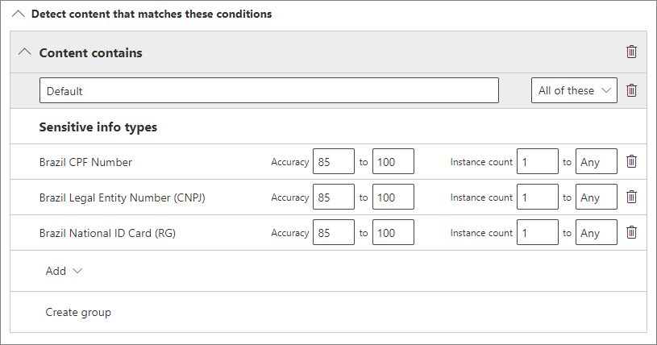

# Aplicar automáticamente una etiqueta de confidencialidad al contenido

>*[Instrucciones de licencias de Microsoft 365 para la seguridad y el cumplimiento](https://aka.ms/ComplianceSD).*

Cuando crea una etiqueta de confidencialidad, puede asignar automáticamente dicha etiqueta al contenido cuando se cumplan las condiciones especificadas.

La capacidad de aplicar automáticamente etiquetas de confidencialidad al contenido es importante por estos motivos:

- No es necesario enseñar a los usuarios cuándo usar cada una de las clasificaciones.

- No es necesario depender de los usuarios para clasificar todo el contenido correctamente.

- Los usuarios ya no necesitan conocer las directivas de gobierno de datos; en su lugar, pueden centrarse en su trabajo.

Hay dos métodos diferentes para aplicar automáticamente una etiqueta de confidencialidad:

- **Etiquetado del lado del cliente cuando los usuarios editan documentos o redactan mensajes de correo electrónico (y responden a ellos o los reenvían)**: use una etiqueta configurada para el etiquetado automático para las aplicaciones de Office (Word, Excel, PowerPoint y Outlook). 
    
    Este método permite recomendar una etiqueta a los usuarios, así como aplicar una etiqueta automáticamente. Pero en ambos casos, el usuario decide si acepta o rechaza la etiqueta, para ayudar a garantizar el etiquetado correcto del contenido. Este etiquetado del lado del cliente tiene un retraso mínimo para los documentos porque la etiqueta se puede aplicar incluso antes de que se guarde el documento. Sin embargo, no todas las aplicaciones cliente son compatibles con el etiquetado automático. Esta funcionalidad es compatible con el cliente de etiquetado unificado de Azure Information Protection y [algunas versiones de Office](sensitivity-labels-office-apps.md#support-for-sensitivity-label-capabilities-in-apps). 
    
    Para obtener instrucciones de configuración, consulte [Cómo configurar el etiquetado automático en aplicaciones de Office](#how-to-configure-auto-labeling-for-office-apps) en esta página.

- **Etiquetas del lado de servicio cuando el contenido ya está guardado (en SharePoint o en OneDrive) o enviado por correo electrónico (procesado por Exchange Online)**: use una directiva de etiquetado automático. 
    
    Este método se conoce como clasificación automática con etiquetas de confidencialidad. También se conoce como etiquetado automático para datos en reposo (documentos en SharePoint y OneDrive) y datos en tránsito (correo electrónico enviado o recibido por Exchange). En el caso de Exchange, no incluye correos electrónicos en reposo (buzones). 
    
    Ya que este etiquetado lo aplican los servicios en lugar de las aplicaciones, no tiene que preocuparse por qué aplicaciones tienen los usuarios y qué versión. Por lo tanto, esta funcionalidad está disponible inmediatamente en toda la organización y es adecuada para aplicar las etiquetas a cualquier escala. Las directivas de etiquetado automático no admiten el etiquetado recomendado, ya que el usuario no interactúa con el proceso de etiquetado. En su lugar, el administrador ejecuta las directivas en el modo de simulación para ayudarle a garantizar el etiquetado correcto del contenido antes de aplicar la etiqueta.
    
    Vea las instrucciones de configuración en [Cómo configurar directivas de etiquetado automático para SharePoint, OneDrive y Exchange](#how-to-configure-auto-labeling-policies-for-sharepoint-onedrive-and-exchange) en esta página.
    
    Específico para el etiquetado automático para SharePoint y OneDrive:
    - Máximo de 25 000 archivos etiquetados automáticamente (Word, PowerPoint o Excel) en su espacio empresarial por día
    - Máximo de 10 colecciones de sitios entre todas las directivas
    - Máximo de 10 directivas en su espacio empresarial
    - La fecha de modificación no se cambia como resultado de las directivas de etiquetado automático, tanto en el modo de simulación como al aplicar las etiquetas.

    Específico para el etiquetado automático para Exchange:
    - A diferencia de las etiquetas manuales o el etiquetado automático con las aplicaciones de Office, los datos adjuntos de Office también se analizan en función de las condiciones que especifique en la directiva de etiquetado automático. Cuando haya una coincidencia, el correo electrónico se etiquetará, pero no los datos adjuntos.
    - Si tiene reglas de flujo de correo de Exchange o directivas de prevención de pérdida de datos (DLP) que aplican el cifrado IRM: cuando estas reglas o directivas y una directiva de etiquetado automático identifican contenido, se aplica la etiqueta. Si esa etiqueta aplica el cifrado, la configuración de IRM de las reglas de flujo de correo de Exchange o de las directivas DLP se pasa por alto. Sin embargo, si esa etiqueta no aplica el cifrado, la configuración de IRM de las reglas de flujo de correo o de las directivas DLP se aplica además de la etiqueta.
    - El correo electrónico con cifrado IRM sin etiqueta se reemplazará por una etiqueta con una configuración de cifrado cuando haya una coincidencia al usar etiquetado automático.
    - El correo electrónico entrante se etiquetará cuando haya una coincidencia con las condiciones de etiquetado automático. Sin embargo, si la etiqueta está configurada para el cifrado, no se aplica el cifrado.
    

## Comparar el etiquetado automático de las aplicaciones de Office con las directivas de etiquetado automático

Use la siguiente tabla para ayudarle a identificar las diferencias en el comportamiento de los dos métodos de etiquetado automático complementarios:

|Característica o comportamiento|Configuración de etiqueta: etiquetado automático para aplicaciones de Office |Directiva: etiquetado automático|
|:-----|:-----|:-----|:-----|
|Dependencia de la aplicación|[Sí](sensitivity-labels-office-apps.md#support-for-sensitivity-label-capabilities-in-apps) |No |
|Restringir por ubicación|No |Sí |
|Condiciones: clasificadores que se pueden entrenar|Sí |No |
|Condiciones: opciones de uso compartido y opciones adicionales para el correo electrónico|No |Sí |
|Recomendaciones, información sobre herramientas de directiva y sustituciones de usuarios|Sí |No |
|Modo de simulación|No |Sí |
|Datos adjuntos de Exchange verificados por condiciones|No | Sí|
|Aplicar marcas visuales |Sí |Sí (solo correo electrónico) |
|Reemplazar el cifrado IRM aplicado sin una etiqueta|Sí, si el usuario tiene el uso mínimo adecuado de exportar |Sí (solo correo electrónico) |
|Etiquetar correo electrónico entrante|No |Sí (no se aplicó cifrado) |

> [!NOTE]
> Si el contenido se ha etiquetado manualmente, dicha etiqueta nunca se reemplazará por el etiquetado automático. Sin embargo, las directivas de etiquetado automático pueden reemplazar una [etiqueta de prioridad más baja](sensitivity-labels.md#label-priority-order-matters) que se aplicó con el etiquetado automático para las aplicaciones de Office.

## Forma en que se evalúan varias condiciones cuando se aplican en más de una etiqueta

Las etiquetas se ordenan para su evaluación según la posición que especifique en la directiva: la primera etiqueta colocada tiene la posición inferior (menor confidencialidad) y la última etiqueta colocada tiene la posición superior (mayor confidencialidad). Para obtener más información sobre la prioridad, vea [Prioridad de etiqueta (el orden importa)](sensitivity-labels.md#label-priority-order-matters).

## No configure una etiqueta principal para que se aplique o recomiende automáticamente

Recuerde, no se puede aplicar una etiqueta principal (una etiqueta con subetiquetas) al contenido. Asegúrese de que no configura una etiqueta principal para que se aplique automáticamente o se recomiende en las aplicaciones de Office y no seleccione una etiqueta principal para una directiva de etiquetado automático. Si lo hace, la etiqueta principal no se aplicará al contenido.

Para usar el etiquetado automático con subetiquetas, asegúrese de que publica la etiqueta principal y la subetiqueta.

Para obtener más información sobre las etiquetas principales y las subetiquetas, consulte [Subetiquetas (agrupación de etiquetas)](sensitivity-labels.md#sublabels-grouping-labels).

## Cómo configurar el etiquetado automático para las aplicaciones de Office

El etiquetado automático en las aplicaciones de Office para Windows es compatible con el cliente de etiquetado unificado de Azure Information Protection. Para las etiquetas integradas en las aplicaciones de Office, esta funcionalidad está [en versión preliminar para algunas aplicaciones](sensitivity-labels-office-apps.md#support-for-sensitivity-label-capabilities-in-apps).

Los ajustes de etiquetado automático para las aplicaciones de Office están disponibles al [crear o editar una etiqueta de confidencialidad](create-sensitivity-labels.md). Puede elegir aplicar etiquetas de confidencialidad al contenido automáticamente cuando se detecta información confidencial. Elija de una lista de tipos de información confidencial o clasificadores capacitados:

> [!NOTE]
> La opción de los **Clasificadores capacitados** se está desplegando actualmente a los inquilinos en vista pública. If you don't see this option, try again in a few days.

Cuando esta etiqueta de confidencialidad se aplica automáticamente, el usuario ve una notificación en su aplicación de Office. Por ejemplo:

### Configuración de tipos de información confidencial para una etiqueta

Si selecciona la opción **tipos de información confidencial**, verá la misma lista de tipos de información confidencial que cuando crea una directiva de prevención de pérdida de datos (DLP). Por ejemplo, puede aplicar automáticamente una etiqueta de altamente confidencial a cualquier contenido que incluya información de identificación personal (PII) de los clientes, como números de tarjeta de crédito o números de la seguridad social:

Después de seleccionar los tipos de información confidencial, puede restringir la condición al cambiar el recuento de instancias o la precisión de coincidencia. Para obtener más información, vea [Ajustar reglas para hacer más fácil o más difícil la coincidencia](data-loss-prevention-policies.md#tuning-rules-to-make-them-easier-or-harder-to-match).

Además, puede elegir si una condición debe detectar todos los tipos de información confidencial o solo uno de ellos. Y para hacer que las condiciones sean más flexibles o complejas, puede agregar grupos y usar operadores lógicos entre los grupos. Para obtener más información, vea [Operadores lógicos y de agrupación](data-loss-prevention-policies.md#grouping-and-logical-operators).

### Configurar clasificadores capacitados para una etiqueta

Cuando seleccione la opción**Clasificadores**, seleccione uno o más de los clasificadores capacitados incorporados de Microsoft. Si ha creado sus propios clasificadores capacitados personalizados, estos también están disponibles para seleccionar:

> [!CAUTION]
> Estamos desaprobando el clasificador incorporado de **Lenguaje ofensivo** porque ha estado produciendo un alto número de falsos positivos. No use este clasificador incorporado y si lo está usando actualmente, debería mover sus procesos de negocios fuera de él. Recomendamos que usen los clasificadores integrados de**Acoso selectivo**, **Blasfemias**, **Amenazas**

Para más información sobre estos clasificadores, consulte [Introducción al entrenamiento de clasificadores (versión preliminar)](classifier-getting-started-with.md).

Durante el periodo de previsualización, las siguientes aplicaciones soportan clasificadores capacitados para etiquetas de sensibilidad:

- Microsoft 365 Apps para empresas (antes Office 365 ProPlus) para Windows, de [Office Insider](https://office.com/insider):
    - Word
    - Excel
    - PowerPoint

- Office para las aplicaciones web, cuando se han [habilitado las etiquetas de confidencialidad para los archivos de Office en SharePoint y OneDrive](sensitivity-labels-sharepoint-onedrive-files.md):
    - Word
    - Excel
    - PowerPoint
    - Outlook

### Recomendación para que el usuario aplique una etiqueta de confidencialidad

Si lo prefiere, puede recomendar a los usuarios que apliquen la etiqueta. Con esta opción, los usuarios pueden aceptar la clasificación y cualquier protección asociada, o descartar la recomendación si la etiqueta no es adecuada para su contenido.

Este es un ejemplo de un mensaje de un cliente de etiquetado unificado de Azure Information Protection que se muestra al configurar una condición para que se aplique una etiqueta como acción recomendada con una sugerencia de directiva personalizada.  Puede elegir el texto que se muestra en la sugerencia de directiva.

### Cuándo se aplican etiquetas automáticas o recomendadas

La implementación de etiquetado automático y recomendado en las aplicaciones de Office depende de si está usando el etiquetado que está integrado en Office o el cliente de etiquetado unificado de Azure Information Protection. Sin embargo, en ambos casos:

- No puede usar el etiquetado automático para documentos y mensajes de correo electrónico que se etiquetaron previamente de forma manual o de forma automática con una confidencialidad más alta. Recuerde, solo se puede aplicar una etiqueta de confidencialidad a un documento o correo electrónico, (además de una sola etiqueta de retención).

- No puede usar el etiquetado recomendado para documentos o correos electrónicos que anteriormente se etiquetaron con una confidencialidad más alta. Cuando el contenido ya está etiquetado con una confidencialidad más alta, el usuario no verá el mensaje con la recomendación y la sugerencia de directiva.

Específico para las etiquetas integradas:

- No todas las aplicaciones de Office admiten el etiquetado automático (y recomendado). Para obtener más información, consulte [Compatibilidad con las capacidades de las etiquetas de confidencialidad en aplicaciones](sensitivity-labels-office-apps.md#support-for-sensitivity-label-capabilities-in-apps)

- Para las etiquetas recomendadas en las versiones de escritorio de Word, el contenido confidencial que desencadenó la recomendación está marcado para que los usuarios puedan revisar y quitar el contenido confidencial en lugar de aplicar la etiqueta de confidencialidad recomendada.

- Para obtener más información sobre cómo se aplican estas etiquetas en las aplicaciones de Office, capturas de pantalla de ejemplo, y cómo se detecta la información confidencial, consulte [Aplicar o recomendar automáticamente etiquetas de confidencialidad a sus archivos y correos electrónicos en Office](https://support.office.com/es-ES/article/automatically-apply-or-recommend-sensitivity-labels-to-your-files-and-emails-in-office-622e0d9c-f38c-470a-bcdb-9e90b24d71a1).

Específico del cliente de etiquetado unificado de Azure Information Protection:

-  El etiquetado automático y recomendado se aplica a Word, Excel y PowerPoint al guardar un documento, y a Outlook al enviar un correo electrónico.

- Para que Outlook sea compatible con el etiquetado recomendado, en primer lugar debe configurar una [configuración de directiva avanzada](https://docs.microsoft.com/azure/information-protection/rms-client/clientv2-admin-guide-customizations#enable-recommended-classification-in-outlook).

- La información confidencial se detecta en el texto del cuerpo de los documentos y correos electrónicos, y en los encabezados y pies de página, pero no en la línea de asunto o en los datos adjuntos de correo electrónico.

## Cómo configurar directivas de etiquetado automático para SharePoint, OneDrive y Exchange

Asegúrese de tener en cuenta los requisitos previos antes de configurar las directivas de etiquetado automático. 

### Requisitos previos para las directivas de etiquetado automático

- Modo de simulación:
    - Se debe activar la auditoría de Microsoft 365. Si necesita activar la auditoría o no está seguro de si la auditoría ya está activada, consulte [Activar o desactivar la búsqueda de registros de auditoría](turn-audit-log-search-on-or-off.md).
    - Para ver el contenido del archivo en la vista de origen (no es compatible con los mensajes de correo electrónico), debe tener el rol de **visor de contenido del explorador de contenido** si no es un administrador global. Si no tiene este permiso, no verá el panel de vista previa cuando seleccione un elemento de la pestaña **Elementos coincidentes**.

- Para etiquetar automáticamente archivos en SharePoint y OneDrive:
    - [Habilitar etiquetas de confidencialidad para los archivos de Office en SharePoint y OneDrive (versión preliminar)](sensitivity-labels-sharepoint-onedrive-files.md)
    - En el momento en el que se ejecuta la directiva de etiquetado automático, el archivo no debe estar abierto por otro proceso o usuario.

- Si tiene previsto usar [tipos de información confidencial personalizados](custom-sensitive-info-types.md) en lugar de los tipos de confidencialidad integrados: 
    - Se evalúan los tipos de información de confidencialidad personalizados para el contenido que se crea después de guardar los tipos de información de confidencialidad personalizados. 
    - Para probar los nuevos tipos de información confidencial, créelos antes de crear su directiva de etiquetado automático y, después, cree nuevos documentos con datos de ejemplo para probarlos.

- [Crear y publicar](create-sensitivity-labels.md) una o más etiquetas de confidencialidad (para al menos un usuario) que pueda seleccionar para las directivas de etiquetado automático. Para estas etiquetas:
    - No importa que la opción de etiquetado automático en aplicaciones de Office esté activada o desactivada, ya que la configuración de la etiqueta es complementaria a las directivas de etiquetado automático, como se explica en la introducción. 
    - Si las etiquetas que quiere usar para el etiquetado automático están configuradas para usar marcas visuales (encabezados, pies de página, marcas de agua), tenga en cuenta que no se aplican a los documentos.
    - Si las etiquetas aplican el cifrado, deben configurarse para la configuración **Asignar permisos ahora**.

### Más información sobre el modo de simulación

El modo de simulación es único en las directivas de etiquetado automático y se integra en el flujo de trabajo. No puede etiquetar automáticamente documentos y mensajes de correo electrónico hasta que la directiva haya ejecutado al menos una simulación.

Flujo de trabajo para una directiva de etiquetado automático:

1. Crear y configurar una directiva de etiquetado automático

2. Ejecutar la directiva en modo de simulación y esperar al menos 24 horas

3. Revisar los resultados y, si es necesario, afinar la directiva, volver a ejecutar el modo de simulación y esperar al menos 24 horas

4. Si es necesario, repetir el paso 3.

5. Implementar en producción

La implementación simulada se ejecuta como el parámetro WhatIf para PowerShell. Puede ver los resultados indicados como si la directiva de etiquetado automático aplicara la etiqueta seleccionada utilizando las reglas definidas. Si es necesario, puede refinar las reglas mayor precisión y volver a ejecutar la simulación. Sin embargo, como el etiquetado automático para Exchange se aplica a los correos electrónicos enviados y recibidos, en lugar de a los mensajes de correo electrónico almacenados en los buzones, no espere que los resultados de la simulación sean coherentes, salvo que pueda enviar y recibir exactamente los mismos mensajes de correo electrónico.

El modo de simulación también le permite aumentar gradualmente el ámbito de la directiva de etiquetado automático antes de la implementación. Por ejemplo, puede empezar con una única ubicación, como un sitio de SharePoint, con una única biblioteca de documentos. Después, con cambios iterativos, aumente el ámbito a varios sitios y a otra ubicación, como OneDrive.

Por último, puede usar el modo de simulación para ofrecer una aproximación del tiempo necesario para ejecutar la directiva de etiquetado automático, para ayudarle a planear y programar cuándo ejecutarla sin el modo de simulación.

### Creación de una directiva de etiquetado automático

1. En el [Centro de cumplimiento de Microsoft 365](https://compliance.microsoft.com/), desplácese hasta las etiquetas de confidencialidad:
    
    - **Soluciones** > **Protección de la información**
    
    Si no ve esta opción inmediatamente, primero seleccione **Mostrar todo**.

2. Seleccione la pestaña **Etiquetado automático**:
    
    
    

3. Seleccione **+ Crear directiva**.

4. En la página **Elegir la información a la que quiere aplicar esta etiqueta**: seleccione una de las plantillas, como **Finanzas** o **Privacidad**. Puede refinar la búsqueda con la lista desplegable **Mostrar opciones para**. O bien, seleccione **directiva personalizada** si las plantillas no satisfacen sus necesidades. Seleccione **Siguiente**.

5. En la página **Cambiar el nombre de la directiva de etiquetado automático**: proporcione un nombre único y, opcionalmente, una descripción que ayude a identificar la etiqueta aplicada automáticamente, las ubicaciones y las condiciones que identifican el contenido que se va a etiquetar.

6. En la página **Elegir ubicaciones en las que quiere aplicar la etiqueta**: seleccione y especifique las ubicaciones de Exchange, sitios de SharePoint y OneDrive. Después, seleccione **Siguiente**.
    
    Para OneDrive, debe especificar cuentas individuales. La dirección URL de OneDrive de un usuario tiene el siguiente formato: `https://<tenant name>-my.sharepoint.com/personal/<user_name>_<tenant name>_com`
    
    Por ejemplo, para un usuario en el espacio empresarial de Contoso con un nombre de usuario "rsimone": `https://contoso-my.sharepoint.com/personal/rsimone_contoso_onmicrosoft_com`
    
    Para comprobar la sintaxis de su espacio empresarial e identificar las direcciones URL de los usuarios, consulte [Obtener una lista de todas las URL de OneDrive de usuario en su organización](https://docs.microsoft.com/onedrive/list-onedrive-urls).

7. Para la página **Definir la configuración de la directiva**: conserve el valor predeterminado de **Buscar contenido que contenga** para definir las reglas que identifican el contenido que se debe etiquetar en todas las ubicaciones seleccionadas. Si necesita distintas reglas dependiendo de la ubicación, seleccione **Configuración avanzada**. Después, seleccione **Siguiente**.
    
    Las reglas usan condiciones que incluyen tipos de información confidencial y opciones de uso compartido:
    - En el caso de los tipos de información confidencial, puede seleccionar tipos de información integrados y personalizados.
    - En las opciones de uso compartido, puede elegir **solo con las personas de mi organización** o **con personas ajenas a mi organización**.
    
    Si la única ubicación es **Exchange** o si selecciona **Configuración avanzada**, hay otras condiciones que puede seleccionar:
    - La dirección IP del remitente es
    - El dominio del destinatario es
    - El destinatario es
    - La extensión del archivo adjunto es
    - Los datos adjuntos están protegidos con contraseña
    - No se pudo digitalizar algún contenido de los datos adjuntos del correo
    - No se pudo completar el análisis de algún contenido de los datos adjuntos del correo

8. Para la página **Configurar las reglas para definir qué contenido se etiqueta**: seleccione **+ Crear regla** y seleccione **Siguiente**.

9. En la página **Crear regla**, asigne un nombre y una definición a la regla, con los tipos de información confidencial o la opción de uso compartido y seleccione **Guardar**.
    
    Las opciones de configuración para los tipos de información confidencial son las mismas que las seleccionadas para el etiquetado automático para las aplicaciones de Office. Si necesita más información, consulte [Configuración de tipos de información confidencial para una etiqueta](#configuring-sensitive-info-types-for-a-label).

10. De nuevo en la página **Configurar reglas para definir qué contenido se etiqueta**: vuelva a seleccionar **+ Crear regla** si necesita otra regla para identificar el contenido que se va a etiquetar y repita el paso anterior. Cuando haya definido todas las reglas que necesita y confirmado que su estado es activado, seleccione **Siguiente**.

11. En la página **Elegir una etiqueta para aplicarla automáticamente**: seleccione **+ Elegir una etiqueta**, seleccione una etiqueta del panel **Elegir una etiqueta de confidencialidad** y seleccione **Siguiente**.

12. Para la página **Decida si quiere ejecutar la simulación de directivas ahora o más tarde**: seleccione **Ejecutar directiva en modo de simulación** si ya está listo para ejecutar la directiva de etiquetado automático ahora, en modo de simulación. En caso contrario, seleccione **Dejar la directiva desactivada**. Seleccione **Siguiente**. 

13. En la página **Resumen**: revise la configuración de la directiva de etiquetado automático, realice los cambios que sean necesarios y finalice el asistente.
    
    A diferencia del etiquetado automático para las aplicaciones de Office, no hay ninguna opción de publicación independiente. Sin embargo, al igual que con las etiquetas de publicación, espere hasta 24 horas para que la directiva de etiquetado automático se replique en toda la organización.

Ahora, en la página de **Protección de la información**, pestaña de **Etiquetado automático**, verá su directiva de etiquetado automático en la sección **Simulación** o **Desactivado**, en función de si ha elegido ejecutarla en el modo simulación o no. Seleccione su directiva para ver los detalles de la configuración y el estado (por ejemplo, **Simulación de directiva aún en ejecución**). Para las directivas en el modo de simulación, seleccione la pestaña **Elementos coincidentes** para ver los correos electrónicos o documentos que coinciden con las reglas especificadas.

Puede modificar la directiva directamente desde esta interfaz:

- Para una directiva en la sección **Desactivado**, seleccione el botón **Editar directiva**.

- Para las directivas en la sección **Simulación**, seleccione la opción **Editar** en la parte superior de la página, en cualquiera de las pestañas:
    
    
    
    Cuando esté listo para ejecutar la directiva sin simulación, seleccione la opción **Activar directiva**.

También puede ver los resultados de la directiva de etiquetado automático con el [explorador de contenido](data-classification-content-explorer.md) cuando tenga los [permisos](data-classification-content-explorer.md#permissions) correspondientes:
- **El visor de listas del explorador de contenido** le permite ver la etiqueta de un archivo, pero no el contenido del archivo.
- **El visor de contenido del explorador de contenido** le permite ver el contenido del archivo.

> [!TIP]
> También puede utilizar el explorador de contenidos para identificar las ubicaciones que tienen documentos con información confidencial, pero que no están etiquetados. Con esta información, considere la posibilidad de agregar estas ubicaciones a la directiva de etiquetado automático e incluir los tipos de información confidencial identificados como reglas.

