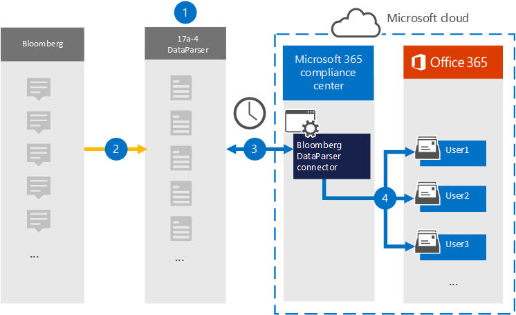

# Configurar un conector para archivar datos de Bloomberg (versión preliminar)Set up a connector to archive Bloomberg data (preview)

Use [Bloomberg DataParser](https://www.17a-4.com/Bloomberg-dataparser/) de 17a-4 LLC para importar y archivar datos de Bloomberg a buzones de usuario de su Microsoft 365 organización.Use the [Bloomberg DataParser](https://www.17a-4.com/Bloomberg-dataparser/) from 17a-4 LLC to import and archive data from Bloomberg to user mailboxes in your Microsoft 365 organization. DataParser incluye un conector de Bloomberg configurado para capturar elementos de un origen de datos de terceros e importar esos elementos a Microsoft 365.The DataParser includes a Bloomberg connector that's configured to capture items from a third-party data source and import those items to Microsoft 365. El conector DataParser de Bloomberg convierte los datos de Bloomberg en un formato de mensaje de correo electrónico y, a continuación, importa esos elementos a buzones de usuario en Microsoft 365.The Bloomberg DataParser connector converts Bloomberg data to an email message format and then imports those items to user mailboxes in Microsoft 365.

Una vez que los datos de Bloomberg se almacenan en buzones de usuario, puede aplicar Microsoft 365 características de cumplimiento como retención por juicio, exhibición de documentos electrónicos, directivas de retención y etiquetas de retención y cumplimiento de comunicaciones.After Bloomberg data is stored in user mailboxes, you can apply Microsoft 365 compliance features such as Litigation Hold, eDiscovery, retention policies and retention labels, and communication compliance. El uso de un conector de Bloomberg para importar y archivar datos en Microsoft 365 puede ayudar a su organización a cumplir con las directivas gubernamentales y reglamentarias.Using a Bloomberg connector to import and archive data in Microsoft 365 can help your organization stay compliant with government and regulatory policies.

## Información general sobre el archivado de datos de BloombergOverview of archiving Bloomberg data

En la siguiente introducción se explica el proceso de uso de un conector de datos para archivar datos de Bloomberg en Microsoft 365.The following overview explains the process of using a data connector to archive Bloomberg data in Microsoft 365.

1. Su organización trabaja con 17a-4 para configurar el DataParser de Bloomberg.Your organization works with 17a-4 to set up and configure the Bloomberg DataParser.

2. El DataParser recopila los elementos de Bloomberg de forma regular.On a regular basis, Bloomberg items are collected by the DataParser. DataParser también convierte el contenido de un mensaje en un formato de mensaje de correo electrónico.The DataParser also converts the content of a message to an email message format.

3. El conector DataParser de Bloomberg que crea en el Centro de cumplimiento de Microsoft 365 se conecta a DataParser y transfiere los mensajes a una ubicación Azure Storage segura en la nube de Microsoft.The Bloomberg DataParser connector that you create in the Microsoft 365 compliance center connects to DataParser and transfers the messages to a secure Azure Storage location in the Microsoft cloud.

4. Se crea una subcarpeta en la carpeta Bandeja de entrada denominada **Bloomberg DataParser** en los buzones de usuario y los elementos de Bloomberg se importan a esa carpeta.A subfolder in the Inbox folder named **Bloomberg DataParser** is created in the user mailboxes, and the Bloomberg items are imported to that folder. El conector determina a qué buzón se importarán los elementos mediante el valor de la *propiedad Email.*The connector determines which mailbox to import items to by using the value of the *Email* property. Cada elemento de Bloomberg contiene esta propiedad, que se rellena con la dirección de correo electrónico de cada participante.Every Bloomberg item contains this property, which is populated with the email address of every participant.

## Antes de configurar un conectorBefore you set up a connector

- Crear una cuenta dataParser para conectores de Microsoft.Create a DataParser account for Microsoft connectors. Para ello, póngase en [contacto con 17a-4 LLC](https://www.17a-4.com/contact/).To do this, contact [17a-4 LLC](https://www.17a-4.com/contact/). Debe iniciar sesión en esta cuenta al crear el conector en el paso 1.You need to sign into this account when you create the connector in Step 1.

- El usuario que crea el conector DataParser de Bloomberg en el paso 1 (y lo completa en el paso 3) debe estar asignado al rol De exportación de importación de buzones en Exchange Online.The user who creates the Bloomberg DataParser connector in Step 1 (and completes it in Step 3) must be assigned to the Mailbox Import Export role in Exchange Online. Este rol es necesario para agregar conectores en la **página Conectores de datos** de la Centro de cumplimiento de Microsoft 365.This role is required to add connectors on the **Data connectors** page in the Microsoft 365 compliance center. De forma predeterminada, este rol no se asigna a un grupo de roles en Exchange Online.By default, this role is not assigned to a role group in Exchange Online. Puede agregar el rol Exportación de importación de buzones al grupo de roles Administración de la organización en Exchange Online.You can add the Mailbox Import Export role to the Organization Management role group in Exchange Online. O bien, puede crear un grupo de roles, asignar el rol Importación de buzones de correo Exportar y, a continuación, agregar los usuarios adecuados como miembros.Or you can create a role group, assign the Mailbox Import Export role, and then add the appropriate users as members. Para obtener más información, vea  las secciones [Crear](/Exchange/permissions-exo/role-groups#create-role-groups) grupos de roles o Modificar grupos de roles en el artículo "Administrar grupos de roles en Exchange Online".For more information, see the [Create role groups](/Exchange/permissions-exo/role-groups#create-role-groups) or [Modify role groups](/Exchange/permissions-exo/role-groups#modify-role-groups) sections in the article "Manage role groups in Exchange Online".

## Paso 1: Configurar un conector DataParser de BloombergStep 1: Set up a Bloomberg DataParser connector

El primer paso es obtener acceso a la página Conectores de datos de la Centro de cumplimiento de Microsoft 365 y crear un conector de 17a-4 para los datos de Bloomberg.The first step is to access to the Data connectors page in the Microsoft 365 compliance center and create a 17a-4 connector for Bloomberg data.

1. Vaya a <https://compliance.microsoft.com> y, a continuación, haga clic **en Conectores de datos**  >  **Bloomberg DataParser**.Go to <https://compliance.microsoft.com> and then click **Data connectors** > **Bloomberg DataParser**.

2. En la página de descripción del producto **DataParser de Bloomberg,** haga clic **en Agregar conector**.On the **Bloomberg DataParser** product description page, click **Add connector**.

3. En la **página Términos de** servicio, haga clic **en Aceptar**.On the **Terms of service** page, click **Accept**.

4. Escriba un nombre único que identifique el conector y, a continuación, haga clic en **Siguiente**.Enter a unique name that identifies the connector and then click **Next**.

5. Inicia sesión en tu cuenta de 17a-4 y completa los pasos del Asistente para la conexión de Bloomberg DataParser.Sign in to your 17a-4 account and complete the steps in the Bloomberg DataParser connection wizard.

## Paso 2: Configurar el conector DataParser de BloombergStep 2: Configure the Bloomberg DataParser connector

Trabaje con la compatibilidad de 17a-4 para configurar el conector DataParser de Bloomberg.Work with 17a-4 Support to configure the Bloomberg DataParser connector.

## Paso 3: Asignar usuariosStep 3: Map users

El conector DataParser de Bloomberg asignará automáticamente a los usuarios a sus Microsoft 365 de correo electrónico antes de importar datos a Microsoft 365.The Bloomberg DataParser connector will automatically map users to their Microsoft 365 email addresses before importing data to Microsoft 365.

## Paso 4: Supervisar el conector DataParser de BloombergStep 4: Monitor the Bloomberg DataParser connector

Después de crear un conector DataParser de Bloomberg, puede ver el estado del conector en el Centro de cumplimiento de Microsoft 365.After you create a Bloomberg DataParser connector, you can view the connector status in the Microsoft 365 compliance center.

1. Vaya a <https://compliance.microsoft.com> y haga clic en **Conectores de datos** en la navegación izquierda.Go to <https://compliance.microsoft.com> and click **Data connectors** in the left nav.

2. Haga **clic** en la pestaña Conectores y, a continuación, seleccione el conector DataParser de Bloomberg que creó para mostrar la página desplegable, que contiene las propiedades e información sobre el conector.Click the **Connectors** tab and then select the Bloomberg DataParser connector that you created to display the flyout page, which contains the properties and information about the connector.

3. En **Estado del conector con origen,** haga clic en el vínculo Descargar **registro** para abrir (o guardar) el registro de estado del conector.Under **Connector status with source**, click the **Download log** link to open (or save) the status log for the connector. Este registro contiene datos que se han importado a la nube de Microsoft.This log contains data that has been imported to the Microsoft cloud.

## Problemas conocidosKnown issues

En este momento, no se admite la importación de datos adjuntos o elementos de más de 10 MB.At this time, we don't support importing attachments or items that are larger than 10 MB. La compatibilidad con elementos más grandes estará disponible en una fecha posterior.Support for larger items will be available at a later date.
