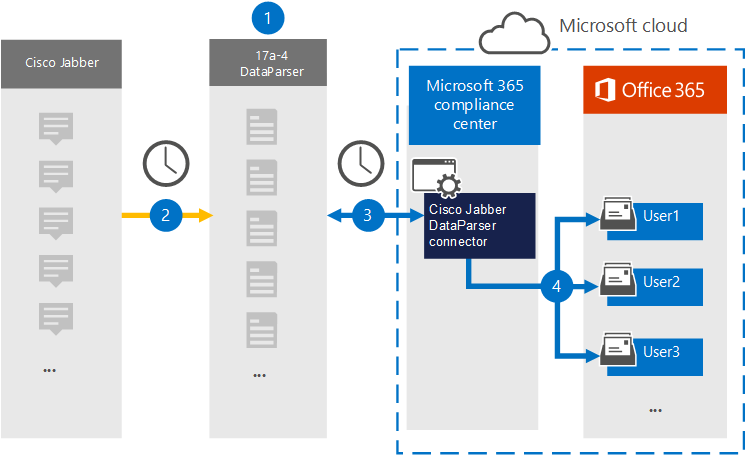

# Configuración de un conector para archivar datos de Cisco Jabber

[!include[Purview banner](../includes/purview-rebrand-banner.md)]

Utilice el [Cisco Jabber DataParser](https://www.17a-4.com/jabber-dataparser/) de 17a-4 LLC para importar y archivar los datos del Cisco Jabber a los buzones de usuario en su organización Microsoft 365. DataParser incluye un conector Cisco Jabber que está configurado para capturar elementos de un origen de datos de terceros e importar esos elementos a Microsoft 365. El conector DataParser del Jabber de Cisco convierte los datos del Cisco Jabber a un formato de mensaje de correo electrónico y luego importa esos elementos a los buzones de usuario en Microsoft 365.

Después de que los datos del Cisco Jabber se almacenan en buzones de usuario, puede aplicar Microsoft Purview características tales como suspensión por juicio, exhibición de documentos electrónicos, directivas de retención y etiquetas de retención, y cumplimiento de la comunicación. El uso de un conector Cisco Jabber para importar y archivar datos en Microsoft 365 puede ayudar a su organización a cumplir con las directivas gubernamentales y reglamentarias.

## Introducción al archivado de datos de Cisco Jabber

La siguiente información general explica el proceso de uso de un conector de datos para archivar los datos del Cisco Jabber en Microsoft 365.

1. Su organización trabaja con 17a-4 para configurar y configurar el DataParser del Jabber de Cisco.

2. Regularmente, los elementos del Cisco Jabber son recopilados por el DataParser. DataParser también convierte el contenido de un mensaje en un formato de mensaje de correo electrónico.

3. El conector DataParser del Jabber de Cisco que usted crea en el portal de cumplimiento Microsoft Purview conecta con DataParser y transfiere los mensajes a una ubicación segura Azure Storage en la nube de Microsoft.

4. Una subcarpeta en la carpeta bandeja de entrada denominada **Cisco Jabber DataParser** se crea en los buzones de usuario, y los elementos del Jabber de Cisco se importan a esa carpeta. El conector determina a qué buzón se van a importar elementos mediante el valor de la propiedad *Email* . Cada elemento del Jabber de Cisco contiene esta propiedad, que se rellena con la dirección de correo electrónico de cada participante.

## Antes de configurar un conector

- Cree una cuenta de DataParser para los conectores de Microsoft. Para ello, póngase en contacto con [17a-4 LLC](https://www.17a-4.com/contact/). Debe iniciar sesión en esta cuenta al crear el conector en el paso 1.

- El usuario que crea el conector DataParser del Jabber de Cisco en el paso 1 (y lo completa en el paso 3) debe ser asignado el rol de Admin del conector de datos. Este rol es necesario para agregar conectores en la página **Conectores de datos** del portal de cumplimiento. Este rol se agrega de forma predeterminada a varios grupos de roles. Para obtener una lista de estos grupos de roles, consulte la sección "Roles en los centros de seguridad y cumplimiento" de [Permisos en el Centro de cumplimiento de & seguridad](../security/office-365-security/permissions-in-the-security-and-compliance-center.md#roles-in-the-security--compliance-center). Como alternativa, un administrador de la organización puede crear un grupo de roles personalizado, asignar el rol Admin conector de datos y, a continuación, agregar los usuarios adecuados como miembros. Para obtener instrucciones, consulte la sección "Crear un grupo de roles personalizado" en [Permisos en el portal de cumplimiento Microsoft Purview](microsoft-365-compliance-center-permissions.md#create-a-custom-role-group).

- Este conector de datos 17a-4 está disponible en entornos de GCC en la nube Microsoft 365 us Government. Las aplicaciones y servicios de terceros pueden implicar almacenar, transmitir y procesar los datos de clientes de su organización en sistemas de terceros que están fuera de la infraestructura de Microsoft 365 y, por lo tanto, no están cubiertos por los compromisos de protección de datos y Microsoft Purview. Microsoft no hace ninguna representación de que el uso de este producto para conectarse a aplicaciones de terceros implica que esas aplicaciones de terceros son compatibles con FEDRAMP.

## Paso 1: Configurar un conector DataParser de Cisco Jabber

El primer paso es acceder a la página De los conectores de datos en el portal de cumplimiento y crear un conector 17a-4 para los datos del Jabber de Cisco.

1. Vaya a <https://compliance.microsoft.com> y haga clic en **Conectores** >  de **datosCisco Jabber DataParser**.

2. En la página de descripción del producto **DataParser del Jabber de Cisco** , haga clic en **Agregar conector**.

3. En la página **Términos de servicio** , haga clic en **Aceptar**.

4. Escriba un nombre único que identifique el conector y, a continuación, haga clic en **Siguiente**.

5. Inicie sesión en su cuenta 17a-4 y complete los pasos en el asistente de conexión de DataParser del Jabber de Cisco.

## Paso 2: Configurar el conector DataParser del Jabber de Cisco

Trabaje con el soporte técnico 17a-4 para configurar el conector DataParser del Jabber de Cisco.

## Paso 3: Asignar usuarios

El conector DataParser del Jabber de Cisco asignará automáticamente a los usuarios a sus direcciones de correo electrónico Microsoft 365 antes de importar datos a Microsoft 365.

## Paso 4: Supervisión del conector DataParser de Cisco Jabber

Después de crear un conector DataParser de Cisco Jabber, puede ver el estado del conector en el portal de cumplimiento.

1. Vaya a <https://compliance.microsoft.com> y haga clic en **Conectores de datos** en el panel de navegación izquierdo.

2. Haga clic en la pestaña **Conectores** y después seleccione el conector DataParser del Jabber de Cisco que creó para mostrar la página de control flotante, que contiene las propiedades y la información sobre el conector.

3. En **Estado del conector con origen**, haga clic en el vínculo **Descargar registro** para abrir (o guardar) el registro de estado del conector. Este registro contiene información sobre los datos que se han importado a la nube de Microsoft. Para obtener más información, consulte [Visualización de registros de administración para conectores de datos](data-connector-admin-logs.md).

## Problemas conocidos

En este momento, no se admiten la importación de datos adjuntos o elementos que superen los 10 MB. La compatibilidad con elementos más grandes estará disponible en una fecha posterior.
