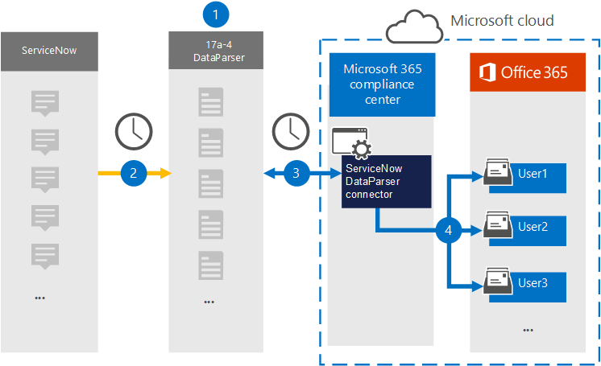

# Configuración de un conector para archivar datos de ServiceNow

Use [ServiceNow DataParser](https://www.17a-4.com/dataparser/) de 17a-4 LLC para importar y archivar datos de ServiceNow en buzones de usuario de su organización de Microsoft 365. DataParser incluye un conector de ServiceNow configurado para capturar elementos de un origen de datos de terceros e importarlos a Microsoft 365. El conector DataParser de ServiceNow convierte los datos de ServiceNow en un formato de mensaje de correo electrónico y, a continuación, los importa a buzones de usuario en Microsoft 365.

Una vez que los datos de ServiceNow se almacenan en buzones de usuario, puede aplicar características de Microsoft Purview como suspensión por juicio, exhibición de documentos electrónicos, directivas de retención y etiquetas de retención y cumplimiento de la comunicación. El uso de un conector de ServiceNow para importar y archivar datos en Microsoft 365 puede ayudar a su organización a cumplir las directivas gubernamentales y normativas.

[!INCLUDE [purview-preview](../includes/purview-preview.md)]

## Información general sobre el archivado de datos de ServiceNow

En la información general siguiente se explica el proceso de uso de un conector de datos para archivar datos de ServiceNow en Microsoft 365.

1. Su organización funciona con 17a-4 para configurar y configurar ServiceNow DataParser.

2. Con regularidad, dataparser recopila los elementos de ServiceNow. DataParser también convierte el contenido de un mensaje en un formato de mensaje de correo electrónico.

3. El conector DataParser de ServiceNow que se crea en el portal de cumplimiento Microsoft Purview se conecta a DataParser y transfiere los mensajes a una ubicación segura de Azure Storage en la nube de Microsoft.

4. Se crea una subcarpeta en la carpeta Bandeja de entrada denominada **ServiceNow DataParser en los buzones** de usuario y los elementos de ServiceNow se importan a esa carpeta. El conector determina a qué buzón se van a importar elementos mediante el valor de la propiedad *Email*. Cada elemento de ServiceNow contiene esta propiedad, que se rellena con la dirección de correo electrónico de cada participante.

## Antes de configurar un conector

- Cree una cuenta de DataParser para los conectores de Microsoft. Para ello, póngase en contacto con [17a-4 LLC](https://www.17a-4.com/contact/). Debe iniciar sesión en esta cuenta al crear el conector en el paso 1.

- Al usuario que crea el conector DataParser de ServiceNow en el paso 1 (y lo completa en el paso 3) se le debe asignar el rol Administración Conector de datos. Este rol es necesario para agregar conectores en la página **Conectores de datos** del portal de cumplimiento. Este rol se agrega de forma predeterminada a varios grupos de roles. Para obtener una lista de estos grupos de roles, consulte la sección "Roles en los portales de defender y cumplimiento" de [Roles y grupos de roles en los portales de cumplimiento de Microsoft 365 Defender y Microsoft Purview](../security/office-365-security/permissions-in-the-security-and-compliance-center.md#roles-in-the-defender-and-compliance-portals). Como alternativa, un administrador de su organización puede crear un grupo de roles personalizado, asignar el rol Administración conector de datos y, a continuación, agregar los usuarios adecuados como miembros. Para obtener instrucciones, consulte la sección "Crear un grupo de roles personalizado" en [Permisos en el portal de cumplimiento Microsoft Purview](microsoft-365-compliance-center-permissions.md#create-a-custom-role-group).

- Este conector de datos 17a-4 está disponible en entornos GCC en la nube de Microsoft 365 US Government. Las aplicaciones y servicios de terceros pueden implicar almacenar, transmitir y procesar los datos de clientes de su organización en sistemas de terceros que están fuera de la infraestructura de Microsoft 365 y, por lo tanto, no están cubiertos por los compromisos de protección de datos y Microsoft Purview. Microsoft no hace ninguna representación de que el uso de este producto para conectarse a aplicaciones de terceros implica que esas aplicaciones de terceros son compatibles con FEDRAMP.

## Paso 1: Configurar un conector DataParser de ServiceNow

El primer paso consiste en acceder a la página Conectores de datos en el portal de cumplimiento y crear un conector 17a-4 para los datos de ServiceNow.

1. Vaya a y, a <https://compliance.microsoft.com> continuación, seleccione **Conectores** >  de datos **ServiceNow DataParser**.

2. En la página de descripción del producto **ServiceNow DataParser** , seleccione **Agregar conector**.

3. En la página **Términos de servicio** , seleccione **Aceptar**.

4. Escriba un nombre único que identifique el conector y, a continuación, seleccione **Siguiente**.

5. Inicie sesión en su cuenta 17a-4 y complete los pasos del Asistente para conexión de ServiceNow DataParser.

## Paso 2: Configuración del conector DataParser de ServiceNow

Trabaje con compatibilidad con 17a-4 para configurar el conector DataParser de ServiceNow.

## Paso 3: Asignar usuarios

El conector DataParser de ServiceNow asignará automáticamente los usuarios a sus direcciones de correo electrónico de Microsoft 365 antes de importar datos a Microsoft 365.

## Paso 4: Supervisión del conector DataParser de ServiceNow

Después de crear un conector DataParser de ServiceNow, puede ver el estado del conector en el portal de cumplimiento.

1. Vaya a <https://compliance.microsoft.com> y seleccione **Conectores de datos** en el panel de navegación izquierdo.

2. Seleccione la pestaña **Conectores** y, a continuación, seleccione el conector DataParser de ServiceNow que creó para mostrar la página de control flotante, que contiene las propiedades y la información sobre el conector.

3. En **Estado del conector con origen**, seleccione el vínculo **Descargar registro** para abrir (o guardar) el registro de estado del conector. Este registro contiene información sobre los datos que se han importado a la nube de Microsoft. Para obtener más información, consulte [Visualización de registros de administración para conectores de datos](data-connector-admin-logs.md).

## Problemas conocidos

En este momento, no se admiten la importación de datos adjuntos o elementos que superen los 10 MB. La compatibilidad con elementos más grandes estará disponible en una fecha posterior.
