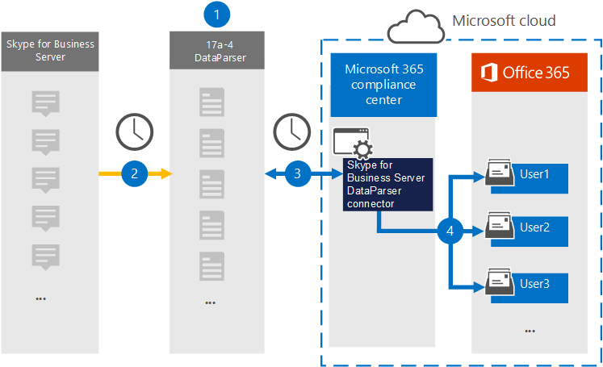

# Configurar un conector para archivar Skype Empresarial Server datos

Use [el Skype Server DataParser](https://www.17a-4.com/skype-server-dataparser/) de 17a-4 LLC para importar y archivar datos de un Skype Empresarial Server a buzones de usuario de su Microsoft 365 organización. DataParser incluye un conector Skype Empresarial que está configurado para capturar elementos de un origen de datos de terceros e importar esos elementos a Microsoft 365. El Skype Empresarial Server DataParser convierte los datos Skype Empresarial Server a un formato de mensaje de correo electrónico y, a continuación, importa esos elementos a buzones de usuario en Microsoft 365.

Después Skype Empresarial Server datos se almacenan en buzones de usuario, puede aplicar Microsoft 365 características de cumplimiento como retención por juicio, exhibición de documentos electrónicos, directivas de retención y etiquetas de retención y cumplimiento de comunicaciones. El uso de un Skype Empresarial Server para importar y archivar datos en Microsoft 365 puede ayudar a su organización a cumplir con las directivas gubernamentales y reglamentarias.

## Información general sobre el archivado Skype Empresarial Server datos

En la siguiente introducción se explica el proceso de uso de un conector de datos para archivar Skype Empresarial Server datos en Microsoft 365.

1. Su organización funciona con 17a-4 para configurar y configurar el Skype Empresarial Server DataParser.

2. El DataParser recopila Skype Empresarial Server elementos de forma regular. DataParser también convierte el contenido de un mensaje en un formato de mensaje de correo electrónico.

3. El Skype Empresarial Server DataParser que cree en el Centro de cumplimiento de Microsoft 365 se conecta a DataParser y transfiere los mensajes a una ubicación de Azure Storage segura en la nube de Microsoft.

4. Una subcarpeta de la carpeta Bandeja de entrada denominada **Skype Empresarial Server DataParser** se crea en los buzones de usuario y los elementos Skype Empresarial Server se importan a esa carpeta. El conector determina a qué buzón se importarán los elementos mediante el valor de la *propiedad Email.* Cada Skype Empresarial Server contiene esta propiedad, que se rellena con la dirección de correo electrónico de cada participante.

## Antes de configurar un conector

- Crear una cuenta dataParser para conectores de Microsoft. Para ello, póngase en [contacto con 17a-4 LLC](https://www.17a-4.com/contact/). Debe iniciar sesión en esta cuenta al crear el conector en el paso 1.

- El usuario que crea el conector dataParser de Skype Empresarial Server en el paso 1 (y lo completa en el paso 3) debe estar asignado al rol De importación de buzones de Exchange Online. Este rol es necesario para agregar conectores en la **página Conectores de datos** de la Centro de cumplimiento de Microsoft 365. De forma predeterminada, este rol no se asigna a un grupo de roles en Exchange Online. Puede agregar el rol Exportación de importación de buzones al grupo de roles Administración de la organización en Exchange Online. O bien, puede crear un grupo de roles, asignar el rol Importación de buzones de correo Exportar y, a continuación, agregar los usuarios adecuados como miembros. Para obtener más información, vea  las secciones [Crear](/Exchange/permissions-exo/role-groups#create-role-groups) grupos de roles o Modificar grupos de roles en el artículo "Administrar grupos de roles en Exchange Online".

- Este conector de datos está disponible en GCC entornos en la Microsoft 365 us government cloud. Las aplicaciones y servicios de terceros pueden implicar almacenar, transmitir y procesar los datos de clientes de su organización en sistemas de terceros que están fuera de la infraestructura de Microsoft 365 y, por lo tanto, no están cubiertos por los compromisos de cumplimiento y protección de datos de Microsoft 365. Microsoft no hace ninguna representación de que el uso de este producto para conectarse a aplicaciones de terceros implica que esas aplicaciones de terceros son compatibles con FEDRAMP.

## Paso 1: Configurar un conector Skype Empresarial Server DataParser

El primer paso es obtener acceso a la página Conectores de datos de la Centro de cumplimiento de Microsoft 365 y crear un conector de 17a-4 para Skype Empresarial Server datos.

1. Vaya a y, a continuación, haga clic <https://compliance.microsoft.com> en   >  **Conectores Skype Empresarial Server DataParser**.

2. En la página Skype Empresarial Server descripción del producto **DataParser,** haga clic **en Agregar conector**.

3. En la **página Términos de** servicio, haga clic **en Aceptar**.

4. Escriba un nombre único que identifique el conector y, a continuación, haga clic en **Siguiente**.

5. Inicie sesión en su cuenta de 17a-4 y complete los pasos del Asistente para la conexión Skype Empresarial Server DataParser.

## Paso 2: Configurar el conector Skype Empresarial Server DataParser

Trabaje con la compatibilidad de 17a-4 para configurar el Skype Empresarial Server DataParser.

## Paso 3: Asignar usuarios

El Skype Empresarial Server DataParser asignará automáticamente a los usuarios a sus Microsoft 365 de correo electrónico antes de importar datos a Microsoft 365.

## Paso 4: Supervisar el conector Skype Empresarial Server DataParser

Después de crear un Skype Empresarial Server DataParser, puede ver el estado del conector en el Centro de cumplimiento de Microsoft 365.

1. Vaya a <https://compliance.microsoft.com> y haga clic en **Conectores de datos** en la navegación izquierda.

2. Haga clic en la pestaña **Conectores** y, a continuación, seleccione el Skype Empresarial Server DataParser que creó para mostrar la página desplegable, que contiene las propiedades y la información sobre el conector.

3. En **Estado del conector con origen,** haga clic en el vínculo Descargar **registro** para abrir (o guardar) el registro de estado del conector. Este registro contiene datos que se han importado a la nube de Microsoft.

## Problemas conocidos

En este momento, no se admite la importación de datos adjuntos o elementos de más de 10 MB. La compatibilidad con elementos más grandes estará disponible en una fecha posterior.
