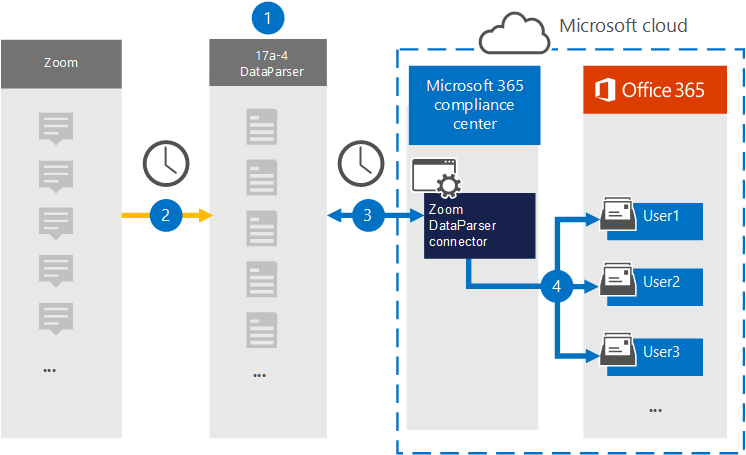

# Configurar un conector para archivar datos de Zoom (versión preliminar)

Use [Zoom DataParser](https://www.17a-4.com/dataparser/) de 17a-4 LLC para importar y archivar datos desde la plataforma Zoom a los buzones de usuario de su Microsoft 365 organización. DataParser incluye un conector de Zoom configurado para capturar elementos de un origen de datos de terceros e importar esos elementos a Microsoft 365. El conector DataParser de Zoom convierte los datos de Zoom a un formato de mensaje de correo electrónico y, a continuación, importa esos elementos a buzones de usuario en Microsoft 365.

Una vez que los datos de Zoom se almacenan en buzones de usuario, puede aplicar Microsoft 365 características de cumplimiento como retención por juicio, exhibición de documentos electrónicos, directivas de retención y etiquetas de retención y cumplimiento de comunicaciones. El uso de un conector de Zoom para importar y archivar datos en Microsoft 365 puede ayudar a su organización a cumplir con las directivas gubernamentales y reglamentarias.

## Información general sobre el archivado de datos de Zoom

En la siguiente introducción se explica el proceso de uso de un conector de datos para archivar datos de Zoom en Microsoft 365.

1. Su organización funciona con 17a-4 para configurar y configurar el DataParser de Zoom.

2. De forma regular, el DataParser recopila los elementos de Zoom. DataParser también convierte el contenido de un mensaje en un formato de mensaje de correo electrónico.

3. El conector Zoom DataParser que crea en el Centro de cumplimiento de Microsoft 365 se conecta a DataParser y transfiere los mensajes a una ubicación Azure Storage segura en la nube de Microsoft.

4. Se crea una subcarpeta en la carpeta Bandeja de entrada denominada **Zoom DataParser** en los buzones de usuario y los elementos de Zoom se importan a esa carpeta. El conector determina a qué buzón se importarán los elementos mediante el valor de la *propiedad Email.* Cada elemento de Zoom contiene esta propiedad, que se rellena con la dirección de correo electrónico de cada participante.

## Antes de configurar un conector

- Crear una cuenta dataParser para conectores de Microsoft. Para ello, póngase en [contacto con 17a-4 LLC](https://www.17a-4.com/contact/). Debe iniciar sesión en esta cuenta al crear el conector en el paso 1.

- El usuario que crea el conector DataParser de Zoom en el paso 1 (y lo completa en el paso 3) debe estar asignado al rol De exportación de importación de buzones en Exchange Online. Este rol es necesario para agregar conectores en la **página Conectores de datos** de la Centro de cumplimiento de Microsoft 365. De forma predeterminada, este rol no se asigna a un grupo de roles en Exchange Online. Puede agregar el rol Exportación de importación de buzones al grupo de roles Administración de la organización en Exchange Online. O bien, puede crear un grupo de roles, asignar el rol Importación de buzones de correo Exportar y, a continuación, agregar los usuarios adecuados como miembros. Para obtener más información, vea  las secciones [Crear](/Exchange/permissions-exo/role-groups#create-role-groups) grupos de roles o Modificar grupos de roles en el artículo "Administrar grupos de roles en Exchange Online".

## Paso 1: Configurar un conector de DataParser de Zoom

El primer paso es obtener acceso a la página Conectores de datos de la Centro de cumplimiento de Microsoft 365 y crear un conector de 17a-4 para datos de Zoom.

1. Vaya a <https://compliance.microsoft.com> y, a continuación, haga clic **en Conectores de datos** Zoom  >  **DataParser**.

2. En la página Descripción del producto **Zoom DataParser,** haga clic **en Agregar conector**.

3. En la **página Términos de** servicio, haga clic **en Aceptar**.

4. Escriba un nombre único que identifique el conector y, a continuación, haga clic en **Siguiente**.

5. Inicie sesión en su cuenta de 17a-4 y complete los pasos del Asistente para la conexión de Zoom DataParser.

## Paso 2: Configurar el conector DataParser de Zoom

Trabaje con la compatibilidad de 17a-4 para configurar el conector Zoom DataParser.

## Paso 3: Asignar usuarios

El conector Zoom DataParser asignará automáticamente a los usuarios a sus Microsoft 365 de correo electrónico antes de importar datos a Microsoft 365.

## Paso 4: Supervisar el conector Zoom DataParser

Después de crear un conector DataParser de Zoom, puede ver el estado del conector en el Centro de cumplimiento de Microsoft 365.

1. Vaya a <https://compliance.microsoft.com> y haga clic en **Conectores de datos** en la navegación izquierda.

2. Haga clic en la pestaña **Conectores** y, a continuación, seleccione el conector Zoom DataParser que creó para mostrar la página desplegable, que contiene las propiedades y la información sobre el conector.

3. En **Estado del conector con origen,** haga clic en el vínculo Descargar **registro** para abrir (o guardar) el registro de estado del conector. Este registro contiene datos que se han importado a la nube de Microsoft.

## Problemas conocidos

En este momento, no se admite la importación de datos adjuntos o elementos de más de 10 MB. La compatibilidad con elementos más grandes estará disponible en una fecha posterior.
