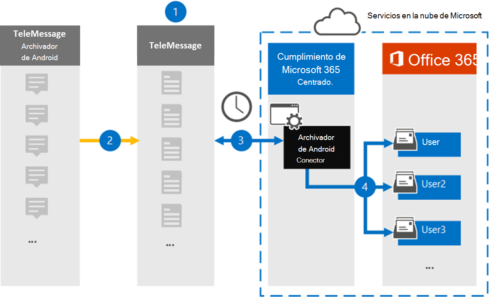

# Configurar un conector para archivar datos móviles de AndroidSet up a connector to archive Android mobile data

Use un conector de TeleMessage en el centro de cumplimiento de Microsoft 365 para importar y archivar archivos de SMS, MMS, llamadas de voz y registros de llamadas desde teléfonos móviles Android.Use a TeleMessage connector in the Microsoft 365 compliance center to import and archive SMS, MMS, voice calls, and call logs from Android mobile phones. Después de configurar y configurar un conector, se conecta a la cuenta de TeleMessage de la organización una vez al día e importa la comunicación móvil de los empleados con el Archivador Android de TeleMessage a los buzones de correo de Microsoft 365.After you set up and configure a connector, it connects to your organization's TeleMessage account once every day, and imports the mobile communication of employees using the TeleMessage Android Archiver to mailboxes in Microsoft 365.

Una vez que los datos de los teléfonos móviles Android se almacenan en buzones de usuario, puede aplicar Microsoft 365 características de cumplimiento como retención por juicio, búsqueda de contenido y directivas de retención Microsoft 365 a los datos del archivador android.After data from Android mobile phones is stored in user mailboxes, you can apply Microsoft 365 compliance features such as Litigation Hold, Content Search, and Microsoft 365 retention policies to Android Archiver data. Por ejemplo, puede buscar en la comunicación móvil de Archiver android mediante la búsqueda de contenido o asociar el buzón que contiene los datos del conector del archivador android con un custodio en Advanced eDiscovery caso.For example, you can search Android Archiver mobile communication using Content Search or associate the mailbox that contains the Android Archiver connector data with a custodian in an Advanced eDiscovery case. El uso de un conector de archivador de Android para importar y archivar datos en Microsoft 365 puede ayudar a su organización a cumplir con las directivas gubernamentales y reglamentarias.Using an Android Archiver connector to import and archive data in Microsoft 365 can help your organization stay compliant with government and regulatory policies.

## Información general sobre el archivado de datos móviles de AndroidOverview of archiving Android mobile data

En la siguiente introducción se explica el proceso de uso de un conector para archivar datos móviles de Android en Microsoft 365.The following overview explains the process of using a connector to archive Android mobile data in Microsoft 365.

1. Su organización trabaja con TeleMessage para configurar un conector de archivador de Android.Your organization works with TeleMessage to set up an Android Archiver connector. Para obtener más información, consulta [Archivador de Android](https://www.telemessage.com/office365-activation-for-android-archiver/).For more information, see [Android Archiver](https://www.telemessage.com/office365-activation-for-android-archiver/).

2. En tiempo real, SMS, MMS, llamadas de voz y registros de llamadas desde los teléfonos móviles Android de la organización se copian en el sitio de TeleMessage.In real time, SMS, MMS, voice calls, and call logs from your organization's Android mobile phones are copied to the TeleMessage site.

3. El conector de Archivador de Android que crea en el centro de cumplimiento de Microsoft 365 se conecta al sitio de TeleMessage todos los días y transfiere los datos de Android de las 24 horas anteriores a una ubicación Azure Storage segura en la nube de Microsoft.The Android Archiver connector that you create in the Microsoft 365 compliance center connects to the TeleMessage site every day and transfers the Android data from the previous 24 hours to a secure Azure Storage location in the Microsoft cloud. El conector también convierte los datos de Android a un formato de mensaje de correo electrónico.The connector also converts the Android data to an email message format.

4. El conector importa los elementos de comunicación móvil al buzón de un usuario específico.The connector imports the mobile communication items to the mailbox of a specific user. Se crea una nueva carpeta denominada Archivador de Android en el buzón del usuario específico y los elementos se importan a él.A new folder named Android Archiver is created in the specific user's mailbox and the items are imported to it. El conector realiza la asignación mediante el valor de la *propiedad Dirección de correo* electrónico del usuario.The connector does mapping by using the value of the *User's Email address* property. Cada mensaje de correo electrónico contiene esta propiedad, que se rellena con la dirección de correo electrónico de cada participante del mensaje de correo electrónico.Every email message contains this property, which is populated with the email address of every participant of the email message. Además de la asignación automática  de usuarios mediante el valor de la propiedad Dirección de correo electrónico del usuario, también puede definir una asignación personalizada cargando un archivo de asignación CSV.In addition to automatic user mapping using the value of the *User's Email address* property, you can also define a custom mapping by uploading a CSV mapping file. Este archivo de asignación debe contener el número de teléfono móvil y la dirección Microsoft 365 buzón de correo correspondiente para cada usuario.This mapping file should contain the mobile number and corresponding Microsoft 365 mailbox address for each user. Si habilita la asignación automática de usuarios y proporciona una asignación personalizada, por cada elemento de correo electrónico, el conector primero buscará el archivo de asignación personalizado.If you enable automatic user mapping and provide a custom mapping, for every email item the connector will first look at custom mapping file. Si no encuentra un usuario Microsoft 365 válido que corresponda al número de móvil de un usuario, el conector usará la propiedad de dirección de correo electrónico del usuario del elemento de correo electrónico.If it doesn't find a valid Microsoft 365 user that corresponds to a user's mobile number, the connector will use the user's email address property of the email item. Si el conector no encuentra un usuario Microsoft 365 válido en el archivo de asignación personalizado o en la propiedad *de* dirección de correo electrónico del usuario del elemento de correo electrónico, el elemento no se importará.If the connector doesn't find a valid Microsoft 365 user in either the custom mapping file or the *User's email address* property of the email item, the item won't be imported.

## Antes de configurar un conectorBefore you set up a connector

Algunos de los pasos de implementación necesarios para archivar datos de comunicación de Android son externos a Microsoft 365 y deben completarse antes de poder crear el conector en el centro de cumplimiento.Some of the implementation steps required to archive Android communication data are external to Microsoft 365 and must be completed before you can create the connector in the compliance center.

- Ordene [el servicio Archiver de Android desde TeleMessage](https://www.telemessage.com/mobile-archiver/order-mobile-archiver-for-o365) y obtenga una cuenta de administración válida para su organización.Order the [Android Archiver service from TeleMessage](https://www.telemessage.com/mobile-archiver/order-mobile-archiver-for-o365) and get a valid administration account for your organization. Tendrás que iniciar sesión en esta cuenta al crear el conector.You'll need to sign into this account when you create the connector.

- Registra todos los usuarios que requieren el servicio Archiver de Android en la cuenta de TeleMessage.Register all users that require the Android Archiver service in the TeleMessage account. Al registrar usuarios, asegúrese de usar la misma dirección de correo electrónico que se usa para su Microsoft 365 usuario.When registering users, be sure to use the same email address that's used for their Microsoft 365 account.

- Instala y activa la aplicación Archiver Android de TeleMessage en los teléfonos móviles de tus empleados.Install and activate the TeleMessage Android Archiver app on the mobile phones of your employees.

- Al usuario que crea un conector de archivador de Android se le debe asignar el rol De importación de buzones de Exchange Online.The user who creates a Android Archiver connector must be assigned the Mailbox Import Export role in Exchange Online. Esto es necesario para agregar conectores en la **página Conectores de datos** del centro de Microsoft 365 cumplimiento.This is required to add connectors in the **Data connectors** page in the Microsoft 365 compliance center. Este rol no está asignado a ningún grupo de roles de Exchange Online de forma predeterminada.By default, this role isn't assigned to any role group in Exchange Online. Puede agregar el rol Exportación de importación de buzones al grupo de roles Administración de la organización en Exchange Online.You can add the Mailbox Import Export role to the Organization Management role group in Exchange Online. O bien, puede crear un grupo de roles, asignar el rol Importación de buzones de correo Exportar y, a continuación, agregar los usuarios adecuados como miembros.Or you can create a role group, assign the Mailbox Import Export role, and then add the appropriate users as members. Para obtener más información, vea  las secciones [Crear](/Exchange/permissions-exo/role-groups#create-role-groups) grupos de roles o Modificar grupos de roles en el artículo "Administrar grupos de roles en Exchange Online".For more information, see the [Create role groups](/Exchange/permissions-exo/role-groups#create-role-groups) or [Modify role groups](/Exchange/permissions-exo/role-groups#modify-role-groups) sections in the article "Manage role groups in Exchange Online".

- Este conector de datos está disponible en GCC entornos en la Microsoft 365 us government cloud.This data connector is available in GCC environments in the Microsoft 365 US Government cloud. Las aplicaciones y servicios de terceros pueden implicar almacenar, transmitir y procesar los datos de clientes de su organización en sistemas de terceros que están fuera de la infraestructura de Microsoft 365 y, por lo tanto, no están cubiertos por los compromisos de cumplimiento y protección de datos de Microsoft 365.Third-party applications and services might involve storing, transmitting, and processing your organization's customer data on third-party systems that are outside of the Microsoft 365 infrastructure and therefore are not covered by the Microsoft 365 compliance and data protection commitments. Microsoft no hace ninguna representación de que el uso de este producto para conectarse a aplicaciones de terceros implica que esas aplicaciones de terceros son compatibles con FEDRAMP.Microsoft makes no representation that use of this product to connect to third-party applications implies that those third-party applications are FEDRAMP compliant.

## Crear un conector de archivador de AndroidCreate an Android Archiver connector

El último paso es crear un conector de Archivador de Android en el centro de Microsoft 365 cumplimiento.The last step is to create an Android Archiver connector in the Microsoft 365 compliance center. El conector usa la información que proporciona para conectarse al sitio de TeleMessage y transferir la comunicación de Android a los cuadros de buzón de usuario correspondientes en Microsoft 365.The connector uses the information you provide to connect to the TeleMessage site and transfer Android communication to the corresponding user mailbox boxes in Microsoft 365.

1. Vaya a [https://compliance.microsoft.com](https://compliance.microsoft.com) y haga clic en **Conectores de datos** archivo  >  **android**.Go to [https://compliance.microsoft.com](https://compliance.microsoft.com) and click **Data connectors** > **Android Archiver**.

2. En la página **descripción del producto Archiver** de Android, haga clic en Agregar **conector**.On the **Android Archiver** product description page, click **Add connector**.

3. En la **página Términos de** servicio, haga clic **en Aceptar**.On the **Terms of service** page, click **Accept**.

4. En la **página Iniciar sesión en TeleMessage,** en el paso 3, escriba la información necesaria en los cuadros siguientes y, a continuación, haga clic en **Siguiente**.On the **Login to TeleMessage** page, under Step 3, enter the required information in the following boxes and then click **Next**.

   - **Nombre de usuario:** Su nombre de usuario de TeleMessage.**Username:** Your TeleMessage username.

   - **Contraseña:** Su contraseña de TeleMessage.**Password:** Your TeleMessage password.

5. Después de crear el conector, cierre la ventana emergente y haga clic en **Siguiente**.After the connector is created, close the pop-up window and click **Next**.

6. En la **página Asignación de** usuarios, habilite la asignación automática de usuarios y haga clic **en Siguiente**.On the **User mapping** page, enable automatic user mapping and click **Next**. En caso de que necesite una asignación personalizada, cargue un archivo CSV y haga clic en **Siguiente**.In case you need custom mapping upload a CSV file, and click **Next**.

7. Revise la configuración y, a continuación, haga clic **en Finalizar** para crear el conector.Review your settings, and then click **Finish** to create the connector.

8. Vaya a la pestaña Conectores de la **página Conectores de** datos para ver el progreso del proceso de importación del nuevo conector.Go to the Connectors tab in **Data connectors** page to see the progress of the import process for the new connector.

## Problemas conocidosKnown issues

- En este momento, no se admite la importación de datos adjuntos o elementos de más de 10 MB.At this time, we don't support importing attachments or items that are larger than 10 MB. La compatibilidad con elementos más grandes estará disponible en una fecha posterior.Support for larger items will be available at a later date.
