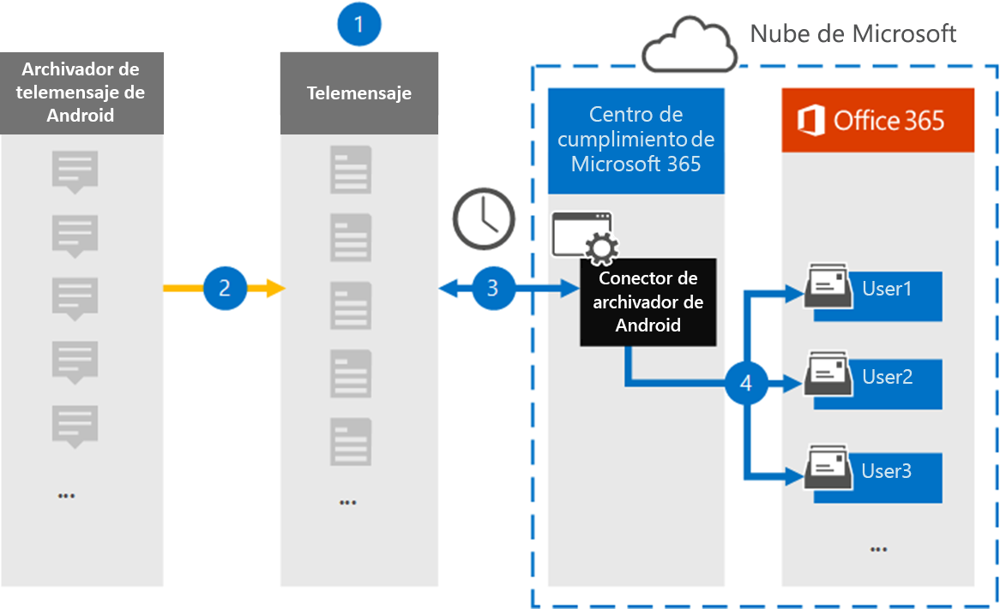

# Configuración de un conector para archivar datos móviles Android

Use un conector de TeleMessage en el portal de cumplimiento de Microsoft Purview para importar y archivar SMS, MMS, llamadas de voz y registros de llamadas desde teléfonos móviles Android. Después de configurar y configurar un conector, se conecta a la cuenta de TeleMessage de su organización una vez al día e importa la comunicación móvil de los empleados que usan El archivador de Android de TeleMessage a buzones de Microsoft 365.

Una vez que los datos de teléfonos móviles Android se almacenan en buzones de usuario, puede aplicar las características de Microsoft Purview, como la suspensión por juicio, la búsqueda de contenido y las directivas de retención de Microsoft 365 a los datos de Android Archiver. Por ejemplo, puede buscar la comunicación móvil de Android Archiver mediante búsqueda de contenido o asociar el buzón que contiene los datos del conector de Android Archiver con un custodio en un caso de exhibición de documentos electrónicos (Premium). El uso de un conector de Android Archiver para importar y archivar datos en Microsoft 365 puede ayudar a su organización a cumplir las directivas gubernamentales y normativas.

## Información general sobre el archivado de datos móviles Android

En la información general siguiente se explica el proceso de uso de un conector para archivar datos móviles Android en Microsoft 365.

1. Su organización funciona con TeleMessage para configurar un conector de Android Archiver. Para obtener más información, vea [Android Archiver](https://www.telemessage.com/office365-activation-for-android-archiver/).

2. En tiempo real, los SMS, MMS, las llamadas de voz y los registros de llamadas de los teléfonos móviles Android de su organización se copian en el sitio de TeleMessage.

3. El conector de Android Archiver que crea en el portal de cumplimiento se conecta al sitio TeleMessage todos los días y transfiere los datos de Android de las 24 horas anteriores a una ubicación de Azure Storage segura en la nube de Microsoft. El conector también convierte los datos de Android en un formato de mensaje de correo electrónico.

4. El conector importa los elementos de comunicación móviles al buzón de un usuario específico. Se crea una nueva carpeta denominada Android Archiver en el buzón de correo del usuario específico y los elementos se importan a ella. El conector realiza la asignación mediante el valor de la propiedad Dirección *de correo electrónico del usuario* . Cada mensaje de correo electrónico contiene esta propiedad, que se rellena con la dirección de correo electrónico de cada participante del mensaje de correo electrónico. Además de la asignación automática de usuarios mediante el valor de la propiedad Dirección *de correo electrónico del usuario* , también puede definir una asignación personalizada mediante la carga de un archivo de asignación CSV. Este archivo de asignación debe contener el número de móvil y la dirección de buzón de Microsoft 365 correspondiente para cada usuario. Si habilita la asignación automática de usuarios y proporciona una asignación personalizada, para cada elemento de correo electrónico, el conector examinará primero el archivo de asignación personalizado. Si no encuentra un usuario de Microsoft 365 válido que se corresponda con el número de móvil de un usuario, el conector usará la propiedad de dirección de correo electrónico del usuario del elemento de correo electrónico. Si el conector no encuentra un usuario Microsoft 365 válido en el archivo de asignación personalizado o en la propiedad *de dirección de correo electrónico del usuario* del elemento de correo electrónico, el elemento no se importará.

## Antes de configurar un conector

Algunos de los pasos de implementación necesarios para archivar los datos de comunicación de Android son externos a Microsoft 365 y deben completarse para poder crear el conector en el centro de cumplimiento.

- Solicite el [servicio Android Archiver de TeleMessage](https://www.telemessage.com/mobile-archiver/order-mobile-archiver-for-o365) y obtenga una cuenta de administración válida para su organización. Tendrá que iniciar sesión en esta cuenta al crear el conector.

- Registre todos los usuarios que requieran el servicio Android Archiver en la cuenta de TeleMessage. Al registrar usuarios, asegúrese de usar la misma dirección de correo electrónico que se usa para su cuenta de Microsoft 365.

- Instala y activa la aplicación TeleMessage Android Archiver en los teléfonos móviles de tus empleados.

- Al usuario que crea un conector de Android Archiver se le debe asignar el rol Administrador del conector de datos. Este rol es necesario para agregar conectores en la página **Conectores de datos** del portal de cumplimiento. Este rol se agrega de forma predeterminada a varios grupos de roles. Para obtener una lista de estos grupos de roles, consulte la sección "Roles en los centros de seguridad y cumplimiento" de [Permisos en el Centro de cumplimiento de & seguridad](../security/office-365-security/permissions-in-the-security-and-compliance-center.md#roles-in-the-security--compliance-center). Como alternativa, un administrador de su organización puede crear un grupo de roles personalizado, asignar el rol Administrador del conector de datos y, a continuación, agregar los usuarios adecuados como miembros. Para obtener instrucciones, consulte la sección "Crear un grupo de roles personalizado" en [Permisos en el portal de cumplimiento de Microsoft Purview](microsoft-365-compliance-center-permissions.md#create-a-custom-role-group).

- Este conector de datos de TeleMessage está disponible en entornos de GCC en la nube Microsoft 365 administración pública de EE. UU. Las aplicaciones y servicios de terceros pueden implicar almacenar, transmitir y procesar los datos de clientes de su organización en sistemas de terceros que están fuera de la infraestructura de Microsoft 365 y, por tanto, no están cubiertos por los compromisos de protección de datos y Microsoft Purview. Microsoft no hace ninguna representación de que el uso de este producto para conectarse a aplicaciones de terceros implica que esas aplicaciones de terceros son compatibles con FEDRAMP.

## Creación de un conector de Android Archiver

El último paso es crear un conector de Android Archiver en el portal de cumplimiento. El conector usa la información que proporciona para conectarse al sitio TeleMessage y transferir la comunicación de Android a los cuadros de buzón de usuario correspondientes en Microsoft 365.

1. Vaya a [https://compliance.microsoft.com](https://compliance.microsoft.com) y haga clic en **Conectores de** >  **datosAndroid Archiver**.

2. En la página de descripción del producto **Android Archiver** , haga clic en **Agregar conector**.

3. En la página **Términos de servicio** , haga clic en **Aceptar**.

4. En la página **Iniciar sesión en TeleMessage** , en el paso 3, escriba la información necesaria en los cuadros siguientes y, a continuación, haga clic en **Siguiente**.

   - **Nombre de usuario:** Nombre de usuario de TeleMessage.

   - **Contraseña:** La contraseña de TeleMessage.

5. Una vez creado el conector, cierre la ventana emergente y haga clic en **Siguiente**.

6. En la página **Asignación de** usuarios, habilite la asignación automática de usuarios y haga clic en **Siguiente**. En caso de que necesite una asignación personalizada, cargue un archivo CSV y haga clic en **Siguiente**.

7. Revise la configuración y, a continuación, haga clic en **Finalizar** para crear el conector.

8. Vaya a la pestaña Conectores de la página **Conectores de datos** para ver el progreso del proceso de importación del nuevo conector.

## Problemas conocidos

- En este momento, no se admiten la importación de datos adjuntos o elementos que superen los 10 MB. La compatibilidad con elementos más grandes estará disponible en una fecha posterior.
