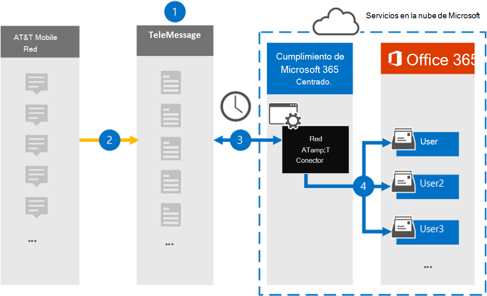

# Configurar un conector para archivar AT&datos SMS/MMS

Use un conector de TeleMessage en el centro de Microsoft 365 de cumplimiento para importar y archivar datos SMS MMS y de AT&T Mobile Network. Después de configurar y configurar un conector, se conecta a la red T at&de la organización una vez al día e importa datos de SMS y MMS a buzones de correo de Microsoft 365.

Después de SMS y mms mensajes se almacenan en buzones de usuario, puede aplicar características de cumplimiento de Microsoft 365, como retención por juicio, búsqueda de contenido y directivas de retención de Microsoft 365&datos de red T de AT. Por ejemplo, puede buscar datos de la red de AT&T mediante búsqueda de contenido o asociar el buzón que contiene los datos del conector de red de AT&T con un administrador en un caso Advanced eDiscovery. El uso de un conector&T Network de AT para importar y archivar datos en Microsoft 365 puede ayudar a su organización a cumplir con las directivas gubernamentales y reglamentarias.

## Información general sobre el archivado de&de red T

En la siguiente introducción se explica el proceso de uso de un conector para archivar datos de red de AT&T en Microsoft 365.

1. Su organización trabaja con TeleMessage para configurar un conector de red&T. Para obtener información, [vea AT&T Network Archiver](https://www.telemessage.com/office365-activation-for-atnt-network-archiver/).

2. En tiempo real, los SMS mms y los mensajes de mms de la red T de&de la organización se copian en el sitio de TeleMessage.

3. El conector de red T de AT&que cree en el centro de cumplimiento de Microsoft 365 se conecta al sitio de TeleMessage todos los días y transfiere los mensajes de SMS y MMS de las 24 horas anteriores a una ubicación de Azure Storage segura en la nube de Microsoft. El conector también convierte el contenido de los mensajes SMS MMS a un formato de mensaje de correo electrónico.

4. El conector importa los elementos de comunicación móvil al buzón de usuarios específicos. Se crea una nueva carpeta denominada **AT&T SMS/MMS Network Archiver** en el buzón del usuario y los elementos se importan a él. El conector realiza esta asignación mediante el valor de la *propiedad Dirección de correo* electrónico del usuario. Cada SMS y mms contiene esta propiedad, que se rellena con la dirección de correo electrónico de cada participante del mensaje.
 
   Además de la asignación automática  de usuarios mediante el valor de la propiedad Dirección de correo electrónico del usuario, también puede definir una asignación personalizada cargando un archivo de asignación CSV. Este archivo de asignación contiene el número de teléfono móvil y la dirección Microsoft 365 de correo electrónico correspondiente para los usuarios de la organización. Si habilita la asignación automática de usuarios y la asignación personalizada, para cada elemento de correo electrónico, el conector primero examina el archivo de asignación personalizado. Si no encuentra un usuario Microsoft 365 válido que corresponda a un número de teléfono móvil, el conector usa los valores de la propiedad de dirección de correo electrónico del elemento que está intentando importar. Si el conector no encuentra un usuario Microsoft 365 válido en el archivo de asignación personalizado o en la propiedad de dirección de correo electrónico del elemento de correo electrónico, el elemento no se importará.

## Antes de empezar

Algunos de los pasos de implementación necesarios para archivar los datos de la red de AT&T son externos a Microsoft 365 y deben completarse antes de poder crear el conector en el centro de cumplimiento.

- Ordene [el servicio de archivador móvil desde TeleMessage](https://www.telemessage.com/mobile-archiver/order-mobile-archiver-for-o365/) y obtenga una cuenta de administración válida para su organización. Deberá iniciar sesión en esta cuenta al crear el conector en el centro de cumplimiento.

- Obtenga los detalles de contacto de facturación y cuenta de AT&T para que pueda rellenar los formularios de incorporación de TeleMessage y solicitar el servicio de archivado de mensajes de AT&T.

- Registre todos los usuarios que requieren AT&T SMS/MMS Network archiving en la cuenta De TeleMessage. Al registrar usuarios, asegúrese de usar la misma dirección de correo electrónico que se usa para su Microsoft 365 usuario.

- Los empleados deben tener teléfonos móviles corporativos y de responsabilidad corporativa en la red&móvil T de AT. Los mensajes de archivado Microsoft 365 no están disponibles para dispositivos de propiedad de los empleados o "Traer sus propios dispositivos (BYOD).

- El usuario que crea un conector de red&T de AT debe tener asignado el rol De importación de buzones de Exchange Online. Esto es necesario para agregar conectores en la **página Conectores de datos** del centro de Microsoft 365 cumplimiento. Este rol no está asignado a ningún grupo de roles de Exchange Online de forma predeterminada. Puede agregar el rol Exportación de importación de buzones al grupo de roles Administración de la organización en Exchange Online. O bien, puede crear un grupo de roles, asignar el rol Importación de buzones de correo Exportar y, a continuación, agregar los usuarios adecuados como miembros. Para obtener más información, vea  las secciones [Crear](/Exchange/permissions-exo/role-groups#create-role-groups) grupos de roles o Modificar grupos de roles en el artículo "Administrar grupos de roles en Exchange Online".

## Crear un conector de&T de AT

Después de completar los requisitos previos descritos en la sección anterior, puede crear un conector de red de AT&T en el centro de Microsoft 365 cumplimiento. El conector usa la información que proporciona para conectarse al sitio de TeleMessage y transferir mensajes de SMS MMS a los cuadros de buzón de usuario correspondientes en Microsoft 365.

1. Vaya a [https://compliance.microsoft.com](https://compliance.microsoft.com/) y, a continuación, haga clic en **Conectores** de  \  **datos EN&T Network**.

2. En la página de descripción&de producto de la red T de **AT,** haga clic **en Agregar conector**

3. En la **página Términos de** servicio, haga clic **en Aceptar**.

4. En la **página Iniciar sesión en TeleMessage,** en el paso 3, escriba la información necesaria en los cuadros siguientes y, a continuación, haga clic en **Siguiente**.

   - **Nombre de usuario:** Su nombre de usuario de TeleMessage.

   - **Contraseña:** Su contraseña de TeleMessage.

5. Después de crear el conector, puede cerrar la ventana emergente y pasar a la página siguiente.

6. En la **página Asignación de** usuarios, habilite la asignación automática de usuarios. Para habilitar la asignación personalizada, cargue un archivo CSV que contenga la información de asignación de usuarios y, a continuación, haga clic **en Siguiente**.

7. Revise la configuración y, a continuación, haga clic **en Finalizar** para crear el conector.

8. Vaya a la **pestaña Conectores** de la página **Conectores** de datos del Centro de cumplimiento para ver el progreso del proceso de importación del nuevo conector.

## Problemas conocidos

- En este momento, no se admite la importación de datos adjuntos o elementos de más de 10 MB. La compatibilidad con elementos más grandes estará disponible en una fecha posterior.
