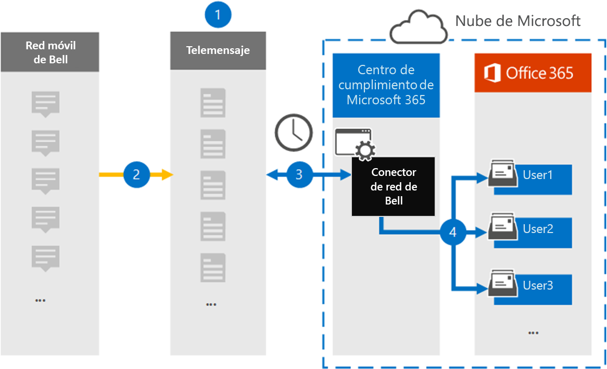

# Configurar un conector para archivar datos de la red de Campana

Use un conector TeleMessage en el Centro de cumplimiento de Microsoft 365 para importar y archivar mensajes del Servicio de mensajería corta (SMS) y el Servicio de mensajería multimedia (MMS) desde la red Descampo. Después de configurar y configurar un conector, se conecta a la red de Campana de su organización una vez al día e importa mensajes SMS y MMS a los buzones de Microsoft 365.

Una vez almacenados los mensajes SMS y MMS en los buzones de usuario, puede aplicar las características de cumplimiento de Microsoft 365, como la retención por juicio, la búsqueda de contenido y las directivas de retención de Microsoft 365 a los datos de la red de Bell. Por ejemplo, puede buscar SMS/MMS de Bell Network mediante búsqueda de contenido o asociar el buzón que contiene los datos del conector de La red de Campana con un administrador en un caso de eDiscovery avanzado. El uso de un conector de red de Bell para importar y archivar datos en Microsoft 365 puede ayudar a su organización a cumplir con las directivas gubernamentales y reglamentarias.

## Información general sobre el archivado de datos de La red de Campana

En la siguiente introducción se explica el proceso de uso de un conector para archivar datos de La red de Bell en Microsoft 365.

1. Su organización trabaja con TeleMessage y Bell para configurar un conector de red de Campana. Para obtener más información, consulte [Archivador de red de Campana.](https://www.telemessage.com/office365-activation-for-bell-network-archiver)

2. Una vez cada 24 horas, los mensajes SMS y MMS de la red Bell de su organización se copian en el sitio de TeleMessage.

3. El conector de red de Campana que cree en el Centro de cumplimiento de Microsoft 365 se conecta al sitio de TeleMessage todos los días y transfiere los mensajes SMS y MMS de las 24 horas anteriores a una ubicación segura de Azure Storage en Microsoft Cloud. El conector también convierte el contenido de los mensajes SMS y MMS en un formato de mensaje de correo electrónico.

4. El conector importa los elementos de comunicación móviles al buzón de usuarios específicos. Se crea una nueva carpeta denominada **Bell SMS/MMS Network Archiver** en el buzón de un usuario específico y los elementos se importan a él. El conector realiza esta asignación mediante el valor de la *propiedad de dirección de correo electrónico del* usuario. Cada mensaje SMS y MMS contiene esta propiedad, que se rellena con la dirección de correo electrónico de todos los participantes del mensaje.

   Además de la asignación automática  de usuarios mediante el valor de la propiedad de dirección de correo electrónico del usuario, también puede definir una asignación personalizada cargando un archivo de asignación CSV. Este archivo de asignación contiene el número de teléfono móvil y la dirección de correo electrónico de Microsoft 365 correspondiente para los usuarios de su organización. Si habilita la asignación automática de usuarios y la asignación personalizada, para cada elemento de red de Campana, el conector primero examina el archivo de asignación personalizado. Si no encuentra un usuario válido de Microsoft 365 que corresponda al número de teléfono móvil de un usuario, el conector usará los valores de la propiedad de dirección de correo electrónico del elemento que está intentando importar. Si el conector no encuentra un usuario válido de Microsoft 365 en el archivo de asignación personalizado o en la propiedad de dirección de correo electrónico del elemento de red de Bell, el elemento no se importará.

## Antes de empezar

Algunos de los pasos de implementación necesarios para archivar datos de La Red de Campana son externos a Microsoft 365 y deben completarse antes de poder crear un conector en el centro de cumplimiento.

- Ordene [el servicio de Archivador de](https://www.telemessage.com/mobile-archiver/order-mobile-archiver-for-o365/) red de Bell desde TeleMessage y obtenga una cuenta de administración válida para su organización. Deberá iniciar sesión en esta cuenta cuando cree el conector en el centro de cumplimiento.

- Obtenga los detalles de contacto de facturación y la cuenta de Red de Campana para que pueda rellenar los formularios de incorporación de TeleMessage y solicitar el servicio de archivado de mensajes desde Bell.

- Registra todos los usuarios que requieran el archivado de la red SMS/MMS de Bell en la cuenta TeleMessage. Al registrar usuarios, asegúrese de usar la misma dirección de correo electrónico que se usa para su cuenta de Microsoft 365.

- Los empleados deben tener teléfonos móviles corporativos y responsables corporativos en la red móvil de Bell. El archivado de mensajes en Microsoft 365 no está disponible para dispositivos propiedad de los empleados o "Bring Your Own Devices (BYOD).

- El usuario que crea un conector de red de Campana debe tener asignado el rol de importación y exportación de buzones en Exchange Online. Esto es necesario para agregar conectores en la **página Conectores de** datos en el Centro de cumplimiento de Microsoft 365. Este rol no está asignado a ningún grupo de roles de Exchange Online de forma predeterminada. Puede agregar el rol De importación y exportación de buzones al grupo de roles Administración de la organización en Exchange Online. O bien, puede crear un grupo de roles, asignar el rol de importación y exportación de buzones de correo y, a continuación, agregar los usuarios adecuados como miembros. Para obtener más información, vea  las secciones Crear grupos de [roles](https://docs.microsoft.com/Exchange/permissions-exo/role-groups#create-role-groups) o Modificar grupos de roles en el artículo "Administrar grupos de roles en Exchange Online".

## Crear un conector de red de Campana

El último paso es crear un conector de red de Campana en el Centro de cumplimiento de Microsoft 365. El conector usa la información que proporciona para conectarse al sitio de TeleMessage y transferir mensajes SMS/MMS a los cuadros de buzón de usuario correspondientes en Microsoft 365.

1. Vaya a [https://compliance.microsoft.com](https://compliance.microsoft.com) y, a continuación, haga clic **en Conectores de datos**  >  **Sms/MMS Network Archiver**.

2. En la página descripción del producto de La red de **Campana,** haga clic **en Agregar conector**

3. En la **página Términos de** servicio, haga clic **en Aceptar.**

4. En la **página Iniciar sesión en TeleMessage,** en el paso 3, escriba la información necesaria en los siguientes cuadros y, a continuación, haga clic en **Siguiente**.

   - **Nombre de usuario:** Su nombre de usuario de TeleMessage.

   - **Contraseña:** La contraseña de TeleMessage.

5. Después de crear el conector, puede cerrar la ventana emergente y ir a la página siguiente.

6. En la **página Asignación de** usuarios, habilite la asignación automática de usuarios. Para habilitar la asignación personalizada, cargue un archivo CSV que contenga la información de asignación de usuarios y, a continuación, haga clic en **Siguiente**.

7. Revise la configuración y, a continuación, haga clic **en Finalizar** para crear el conector.

8. Vaya a la **pestaña Conectores** en la página **Conectores** de datos del Centro de cumplimiento para ver el progreso del proceso de importación para el nuevo conector.

## Problemas conocidos

- En este momento, no se admite la importación de datos adjuntos o elementos de más de 10 MB. La compatibilidad con elementos más grandes estará disponible en una fecha posterior.
