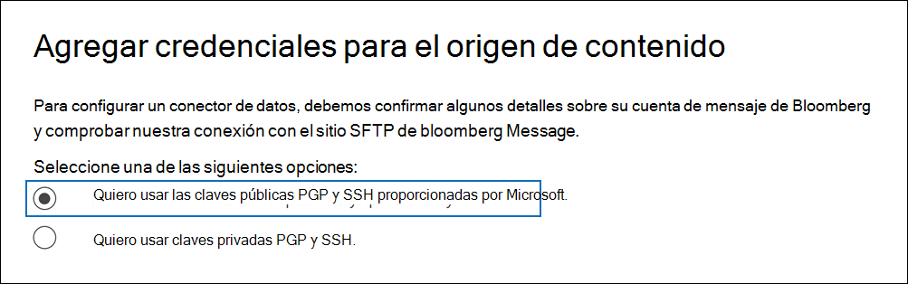
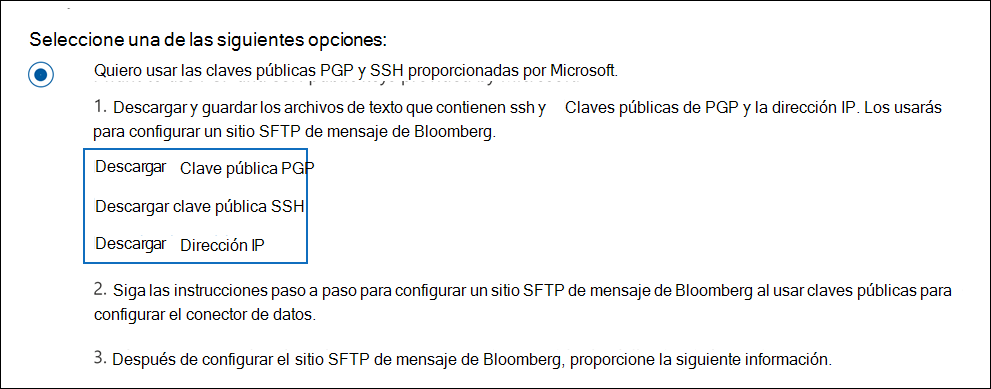
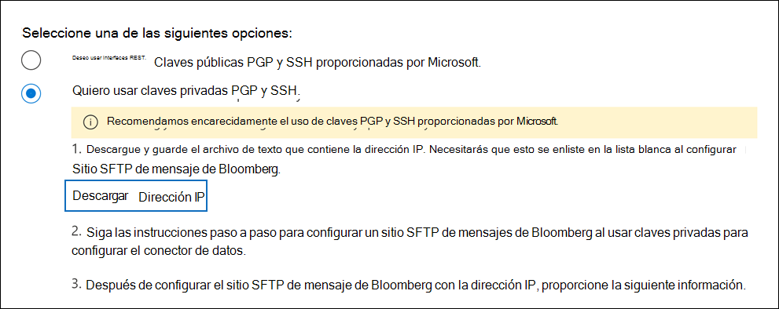

# Configurar un conector para archivar datos de mensajes de Bloomberg

Use un conector de datos en el centro de Microsoft 365 de cumplimiento para importar y archivar datos de correo electrónico de servicios financieros desde la herramienta de colaboración [Bloomberg Message.](https://www.bloomberg.com/professional/product/collaboration/) Después de configurar y configurar un conector, se conecta al sitio ftp seguro (SFTP) de Bloomberg de la organización una vez al día e importa elementos de correo electrónico a buzones de correo en Microsoft 365.

Después de almacenar los datos del mensaje de Bloomberg en buzones de usuario, puede aplicar Microsoft 365 las características de cumplimiento como retención por juicio, búsqueda de contenido, archivado local, auditoría, cumplimiento de comunicaciones y directivas de retención de Microsoft 365 a los datos de mensajes de Bloomberg. Por ejemplo, puede buscar correos electrónicos de mensajes de Bloomberg con la herramienta de búsqueda de contenido o asociar el buzón que contiene los datos del mensaje de Bloomberg con un custodio en un Advanced eDiscovery caso. El uso de un conector de mensajes de Bloomberg para importar y archivar datos en Microsoft 365 puede ayudar a su organización a cumplir con las directivas gubernamentales y reglamentarias.

## Información general sobre el archivado de datos de mensajes de Bloomberg

En la siguiente introducción se explica el proceso de uso de un conector para archivar los datos del mensaje de Bloomberg en Microsoft 365.

1. Su organización trabaja con Bloomberg para configurar un sitio SFTP de Bloomberg. También trabajarás con Bloomberg para configurar El mensaje de Bloomberg para copiar mensajes de correo electrónico en el sitio SFTP de Bloomberg.

2. Una vez cada 24 horas, los mensajes de correo electrónico de Bloomberg Message se copian en el sitio sftp de Bloomberg.

3. El conector de mensajes de Bloomberg que cree en el centro de cumplimiento de Microsoft 365 se conecta al sitio SFTP de Bloomberg todos los días y transfiere los mensajes de correo electrónico de las 24 horas anteriores a un área de Azure Storage segura en Microsoft Cloud.

4. El conector importa los elementos del mensaje de correo electrónico al buzón de un usuario específico. Se crea una nueva carpeta denominada BloombergMessage en el buzón del usuario específico y los elementos se importarán a él.

   El conector hace esto mediante el valor de la propiedad CorporateEmailAddress. Cada mensaje de correo electrónico contiene esta propiedad, que se rellena con la dirección de correo electrónico de cada participante del mensaje de correo electrónico. Además de la asignación automática de usuarios mediante el valor de la propiedad *CorporateEmailAddress,* también puede definir una asignación personalizada cargando un archivo de asignación CSV. Este archivo de asignación contiene un UUID de Bloomberg y la dirección Microsoft 365 buzón de correo correspondiente para cada usuario de la organización. Si habilita la asignación automática de usuarios y proporciona una asignación personalizada, por cada elemento de correo electrónico, el conector primero verá el archivo de asignación personalizada. Si no encuentra un usuario Microsoft 365 válido que corresponda al UUID de Bloomberg de un usuario, el conector usa la propiedad *CorporateEmailAddress* del elemento de correo electrónico. Si el conector no encuentra un usuario Microsoft 365 válido en el archivo de asignación personalizada o en la propiedad *CorporateEmailAddress* del elemento de correo electrónico, el elemento no se importará.

## Antes de configurar un conector

Algunos de los pasos de implementación necesarios para archivar los datos del mensaje de Bloomberg son externos a Microsoft 365 y deben completarse antes de poder crear el conector en el centro de cumplimiento.

- Para configurar un conector de mensajes de Bloomberg, debe usar claves y contraseñas clave para Pretty Good Privacy (PGP) y Secure Shell (SSH). Estas claves se usan para configurar el sitio SFTP de Bloomberg y las usa el conector para conectarse al sitio SFTP de Bloomberg para importar datos a Microsoft 365. La clave PGP se usa para configurar el cifrado de los datos que se transfieren desde el sitio SFTP de Bloomberg a Microsoft 365. La clave SSH se usa para configurar el shell seguro para habilitar un inicio de sesión remoto seguro cuando el conector se conecta al sitio SFTP de Bloomberg.

  Al configurar un conector, tiene la opción de usar claves públicas y contraseñas de clave proporcionadas por Microsoft o puede usar sus propias claves privadas y contraseñas. Se recomienda usar las claves públicas proporcionadas por Microsoft. Sin embargo, si su organización ya ha configurado un sitio SFTP de Bloomberg con claves privadas, puede crear un conector con estas mismas claves privadas.

- Suscribirse [a Bloomberg Anywhere](https://www.bloomberg.com/professional/product/remote-access/?bbgsum-page=DG-WS-PROF-PROD-BBA). Esto es necesario para que pueda iniciar sesión en Bloomberg Anywhere para tener acceso al sitio SFTP de Bloomberg que debe configurar y configurar.

- Configurar un sitio sftp de Bloomberg (protocolo de transferencia segura de archivos). Después de trabajar con Bloomberg para configurar el sitio SFTP, los datos del mensaje de Bloomberg se cargan en el sitio SFTP todos los días. El conector que cree en el paso 2 se conecta a este sitio SFTP y transfiere los datos de correo electrónico a Microsoft 365 buzones de correo. SFTP también cifra los datos del mensaje de Bloomberg que se envían a los buzones durante el proceso de transferencia.

  Para obtener información sobre Bloomberg SFTP (también denominada *BB-SFTP):*

  - Consulte el documento "Estándares de conectividad SFTP" en [Soporte de Bloomberg](https://www.bloomberg.com/professional/support/documentation/).

  - Póngase en [contacto con el servicio de soporte al cliente de Bloomberg](https://service.bloomberg.com/portal/sessions/new?utm_source=bloomberg-menu&utm_medium=csc).

- Después de trabajar con Bloomberg para configurar un sitio SFTP, Bloomberg le proporcionará información después de responder al mensaje de correo electrónico de implementación de Bloomberg. Guarde una copia de la siguiente información. Se usa para configurar un conector en el paso 3.

  - Código firme, que es un identificador de su organización y se usa para iniciar sesión en el sitio SFTP de Bloomberg.

  - Contraseña para el sitio SFTP de Bloomberg

  - Dirección URL del sitio SFTP de Bloomberg (por ejemplo, sftp.bloomberg.com). Además, Bloomberg también puede proporcionar una dirección IP correspondiente para el sitio SFTP de Bloomberg, que también se puede usar para configurar el conector.

  - Número de puerto para el sitio SFTP de Bloomberg

- El conector de mensajes de Bloomberg puede importar un total de 200 000 elementos en un solo día. Si hay más de 200 000 elementos en el sitio SFTP, ninguno de estos elementos se importará a Microsoft 365.

- El usuario que crea un conector de mensajes de Bloomberg en el paso 3 (y que descarga las claves públicas y la dirección IP en el paso 1) debe tener asignado el rol De importación de buzones de Exchange Online. Esto es necesario para agregar conectores en la **página Conectores de datos** del centro de Microsoft 365 cumplimiento. Este rol no está asignado a ningún grupo de roles de Exchange Online de forma predeterminada. Puede agregar el rol Exportación de importación de buzones al grupo de roles Administración de la organización en Exchange Online. O bien, puede crear un grupo de roles, asignar el rol Importación de buzones de correo Exportar y, a continuación, agregar los usuarios adecuados como miembros. Para obtener más información, vea  las secciones [Crear](/Exchange/permissions-exo/role-groups#create-role-groups) grupos de roles o Modificar grupos de roles en el artículo "Administrar grupos de roles en Exchange Online".

## Configurar un conector con claves públicas

Los pasos de esta sección muestran cómo configurar un conector de mensajes de Bloomberg con las claves públicas de Pretty Good Privacy (PGP) y Secure Shell (SSH).

### Paso 1: Obtener claves públicas de PGP y SSH

El primer paso es obtener una copia de las claves públicas PGP y SSH. Estas claves se usan en el paso 2 para configurar el sitio SFTP de Bloomberg para permitir que el conector (que crea en el paso 3) se conecte al sitio SFTP y transfiera los datos de correo electrónico del mensaje de Bloomberg Microsoft 365 buzones de correo. También se obtiene una dirección IP en este paso, que se usa al configurar el sitio SFTP de Bloomberg.

1. Vaya a <https://compliance.microsoft.com> y haga clic en **Conectores de datos** en la navegación izquierda.

2. En la **página Conectores de datos** en Mensaje de **Bloomberg,** haga clic en **Ver**.

3. En la página **Descripción del producto Mensaje de Bloomberg,** haga clic en Agregar **conector**

4. En la **página Términos de** servicio, haga clic **en Aceptar**.

5. En la **página Agregar credenciales para origen de** contenido, haga clic en Deseo usar claves públicas PGP y SSH **proporcionadas por Microsoft**.

   

6. En el paso 1, haga clic en los vínculos Descargar clave **SSH**, **Descargar clave PGP** y Descargar dirección **IP** para guardar una copia de cada archivo en el equipo local.

   

   Estos archivos contienen los siguientes elementos que se usan para configurar el sitio SFTP de Bloomberg en el paso 2:

   - Clave pública PGP: esta clave se usa para configurar el cifrado de los datos que se transfieren desde el sitio SFTP de Bloomberg a Microsoft 365.

   - Clave pública SSH: esta clave se usa para configurar el shell seguro para habilitar un inicio de sesión remoto seguro cuando el conector se conecta al sitio SFTP de Bloomberg.

   - Dirección IP: el sitio SFTP de Bloomberg está configurado para aceptar solicitudes de conexión desde esta dirección IP. El conector de mensajes de Bloomberg usa la misma dirección IP para conectarse al sitio SFTP y transferir los datos del mensaje de Bloomberg a Microsoft 365.

7. Haga **clic en** Cancelar para cerrar el asistente. Vuelve a este asistente en el paso 3 para crear el conector.

### Paso 2: Configurar el sitio SFTP de Bloomberg

> [!NOTE]
> Si su organización ha configurado previamente un sitio SFTP de Bloomberg para archivar datos de Instant Bloomberg con claves públicas de PGP y SSH, no tiene que configurar otro. Puede especificar el mismo sitio SFTP al crear el conector en el paso 3.

El siguiente paso es usar las claves públicas PGP y SSH y la dirección IP que obtuvo en el paso 1 para configurar el cifrado PGP y la autenticación SSH para el sitio SFTP de Bloomberg. Esto permite que el conector de mensajes de Bloomberg que cree en el paso 3 se conecte al sitio SFTP de Bloomberg y transfiera los datos del mensaje de Bloomberg a Microsoft 365. Debe trabajar con el servicio de soporte al cliente de Bloomberg para configurar el sitio sftp de Bloomberg. Póngase [en contacto con el servicio de soporte al cliente de Bloomberg](https://service.bloomberg.com/portal/sessions/new?utm_source=bloomberg-menu&utm_medium=csc) para obtener ayuda.

> [!IMPORTANT]
> Bloomberg recomienda adjuntar los tres archivos que descargó en el paso 1 a un mensaje de correo electrónico y enviarlos a su equipo de soporte al cliente cuando trabaje con ellos para configurar el sitio SFTP de Bloomberg.

### Paso 3: Crear un conector de mensajes de Bloomberg

El último paso es crear un conector de mensajes de Bloomberg en el centro de Microsoft 365 cumplimiento. El conector usa la información que proporciona para conectarse al sitio SFTP de Bloomberg y transferir mensajes de correo electrónico a los cuadros de buzón de usuario correspondientes en Microsoft 365.

1. Vaya a <https://compliance.microsoft.com> y haga clic en **Conectores de datos** en la navegación izquierda.

2. En la **página Conectores de datos** en Mensaje de **Bloomberg,** haga clic en **Ver**.

3. En la página **Descripción del producto Mensaje de Bloomberg,** haga clic en Agregar **conector**

4. En la **página Términos de** servicio, haga clic **en Aceptar**.

5. En la **página Agregar credenciales para origen de** contenido, haga clic en Deseo usar claves públicas PGP y SSH **proporcionadas por Microsoft**.

6. En el paso 3, escriba la información necesaria en los cuadros siguientes y, a continuación, haga clic **en Validar conexión**.

      - **Nombre:** El nombre del conector. Debe ser único en la organización.

      - **Código de firma:** El identificador de la organización que se usa como nombre de usuario para el sitio SFTP de Bloomberg.

      - **Contraseña:** La contraseña del sitio SFTP de Bloomberg de su organización.

      - **DIRECCIÓN URL DE SFTP:** La dirección URL del sitio SFTP de Bloomberg (por ejemplo, `sftp.bloomberg.com` ). También puede usar una dirección IP para este valor.

      - **Puerto SFTP:** Número de puerto del sitio SFTP de Bloomberg. El conector usa este puerto para conectarse al sitio SFTP.

7. Después de validar correctamente la conexión, haga clic en **Siguiente**.

8. En la **página Asignar mensajes de Bloomberg Microsoft 365** usuarios, habilite la asignación automática de usuarios y proporcione una asignación de usuario personalizada según sea necesario.

   > [!NOTE]
   > El conector importa elementos de mensaje al buzón de un usuario específico. Se crea una nueva carpeta denominada **BloombergMessage** en el buzón del usuario específico y los elementos se importarán a él. El conector lo hace mediante el valor de la *propiedad CorporateEmailAddress.* Cada mensaje de chat contiene esta propiedad y la propiedad se rellena con la dirección de correo electrónico de cada participante del mensaje de chat. Además de la asignación automática de usuarios mediante el valor de la *propiedad CorporateEmailAddress,* también puede definir la asignación personalizada cargando un archivo de asignación CSV. El archivo de asignación debe contener el UUID de Bloomberg y la dirección Microsoft 365 buzón correspondiente para cada usuario. Si habilita la asignación automática de usuarios y proporciona una asignación personalizada, por cada elemento de mensaje, el conector primero verá el archivo de asignación personalizado. Si no encuentra un usuario Microsoft 365 válido que corresponda al UUID de Bloomberg de un usuario, el conector usará la propiedad *CorporateEmailAddress* del elemento de chat. Si el conector no encuentra un usuario Microsoft 365 válido en el archivo de asignación personalizado o en la propiedad *CorporateEmailAddress* del elemento de mensaje, el elemento no se importará.

9. Haga **clic en Siguiente,** revise la configuración y, a continuación, haga clic **en Finalizar** para crear el conector.

10. Vaya a la **página Conectores de datos** para ver el progreso del proceso de importación del nuevo conector. Haga clic en el conector para mostrar la página desplegable, que contiene información sobre el conector.

## Configurar un conector con claves privadas

Los pasos de esta sección muestran cómo configurar un conector de mensajes de Bloomberg con claves privadas PGP y SSH. Esta opción de configuración del conector está diseñada para organizaciones que ya han configurado un sitio SFTP de Bloomberg con claves privadas.

### Paso 1: Obtener una dirección IP para configurar el sitio SFTP de Bloomberg

> [!NOTE]
> Si su organización ha configurado previamente un sitio SFTP de Bloomberg para archivar datos de Instant Bloomberg con claves privadas PGP y SSH, no tiene que configurar otro. Puede especificar el mismo sitio SFTP al crear el conector en el paso 2.

Si su organización ha usado claves privadas PGP y SSH para configurar un sitio SFTP de Bloomberg, debe obtener una dirección IP y proporcionarla al servicio de soporte al cliente de Bloomberg. El sitio SFTP de Bloomberg debe configurarse para aceptar solicitudes de conexión desde esta dirección IP. El conector de mensajes de Bloomberg usa la misma dirección IP para conectarse al sitio SFTP y transferir los datos del mensaje de Bloomberg a Microsoft 365.

Para obtener la dirección IP:

1. Vaya a <https://compliance.microsoft.com> y haga clic en **Conectores de datos** en la navegación izquierda.

2. En la **página Conectores de datos** en Mensaje de **Bloomberg,** haga clic en **Ver**.

3. En la página **Descripción del producto Mensaje de Bloomberg,** haga clic en Agregar **conector**

4. En la **página Términos de** servicio, haga clic **en Aceptar**.

5. En la **página Agregar credenciales para origen de contenido,** haga clic en Deseo usar claves privadas **PGP y SSH.**

6. En el paso 1, haga clic **en Descargar dirección IP** para guardar una copia del archivo de dirección IP en el equipo local.

   

7. Haga **clic en** Cancelar para cerrar el asistente. Vuelve a este asistente en el paso 2 para crear el conector.

Debe trabajar con el servicio de soporte al cliente de Bloomberg para configurar el sitio SFTP de Bloomberg para aceptar solicitudes de conexión desde esta dirección IP. Póngase [en contacto con el servicio de soporte al cliente de Bloomberg](https://service.bloomberg.com/portal/sessions/new?utm_source=bloomberg-menu&utm_medium=csc) para obtener ayuda.

### Paso 2: Crear un conector de mensajes de Bloomberg

Una vez configurado el sitio SFTP de Bloomberg, el siguiente paso es crear un conector de mensajes de Bloomberg en el centro de Microsoft 365 cumplimiento. El conector usa la información que proporciona para conectarse al sitio SFTP de Bloomberg y transferir mensajes de correo electrónico a los cuadros de buzón de usuario correspondientes en Microsoft 365. Para completar este paso, asegúrese de tener copias de las mismas claves privadas y contraseñas clave que usó para configurar el sitio SFTP de Bloomberg.

1. Vaya a <https://compliance.microsoft.com> y haga clic en **Conectores de datos** en la navegación izquierda.

2. En la **página Conectores de datos** en Mensaje de **Bloomberg,** haga clic en **Ver**.

3. En la página **Descripción del producto Mensaje de Bloomberg,** haga clic en Agregar **conector**

4. En la **página Términos de** servicio, haga clic **en Aceptar**.

5. En la **página Agregar credenciales para origen de contenido,** haga clic en Deseo usar claves privadas **PGP y SSH.**

   

6. En el paso 3, escriba la información necesaria en los cuadros siguientes y, a continuación, haga clic **en Validar conexión**.

      - **Nombre:** El nombre del conector. Debe ser único en la organización.

      - **Código de firma:** El identificador de la organización que se usa como nombre de usuario para el sitio SFTP de Bloomberg.

      - **Contraseña:** La contraseña del sitio SFTP de Bloomberg de su organización.

      - **DIRECCIÓN URL DE SFTP:** La dirección URL del sitio SFTP de Bloomberg (por ejemplo, `sftp.bloomberg.com` ). También puede usar una dirección IP para este valor.

      - **Puerto SFTP:** Número de puerto del sitio SFTP de Bloomberg. El conector usa este puerto para conectarse al sitio SFTP.

      - **Clave privada PGP:** La clave privada PGP para el sitio SFTP de Bloomberg. Asegúrese de incluir todo el valor de clave privada, incluidas las líneas inicial y final del bloque de teclas.

      - Frase de contraseña de clave **PGP:** Frase de contraseña para la clave privada PGP.

      - **Clave privada SSH:** La clave privada SSH para el sitio SFTP de Bloomberg. Asegúrese de incluir todo el valor de clave privada, incluidas las líneas inicial y final del bloque de teclas.

      - **Frase de contraseña de clave SSH:** Frase de contraseña para la clave privada SSH.

7. Después de validar correctamente la conexión, haga clic en **Siguiente**.

8. En la **página Asignar mensajes de Bloomberg Microsoft 365** usuarios, habilite la asignación automática de usuarios y proporcione una asignación de usuario personalizada según sea necesario.

   > [!NOTE]
   > El conector importa elementos de mensaje al buzón de un usuario específico. Se crea una nueva carpeta denominada **BloombergMessage** en el buzón del usuario específico y los elementos se importarán a él. El conector lo hace mediante el valor de la *propiedad CorporateEmailAddress.* Cada mensaje de chat contiene esta propiedad y la propiedad se rellena con la dirección de correo electrónico de cada participante del mensaje de chat. Además de la asignación automática de usuarios mediante el valor de la *propiedad CorporateEmailAddress,* también puede definir la asignación personalizada cargando un archivo de asignación CSV. El archivo de asignación debe contener el UUID de Bloomberg y la dirección Microsoft 365 buzón correspondiente para cada usuario. Si habilita la asignación automática de usuarios y proporciona una asignación personalizada, por cada elemento de mensaje, el conector primero verá el archivo de asignación personalizado. Si no encuentra un usuario Microsoft 365 válido que corresponda al UUID de Bloomberg de un usuario, el conector usará la propiedad *CorporateEmailAddress* del elemento de chat. Si el conector no encuentra un usuario Microsoft 365 válido en el archivo de asignación personalizado o en la propiedad *CorporateEmailAddress* del elemento de mensaje, el elemento no se importará.

9. Haga **clic en Siguiente,** revise la configuración y, a continuación, haga clic **en Finalizar** para crear el conector.

10. Vaya a la **página Conectores de datos** para ver el progreso del proceso de importación del nuevo conector. Haga clic en el conector para mostrar la página desplegable, que contiene información sobre el conector.

## Problemas conocidos

- No se admite el subproceso del correo electrónico de mensaje de Bloomberg importado Microsoft 365 de correo electrónico. Los mensajes individuales enviados a una persona se importan, pero no se presentan en una conversación en subproceso. Microsoft está trabajando para admitir el subproceso en versiones posteriores del conector de datos de mensajes de Bloomberg.
