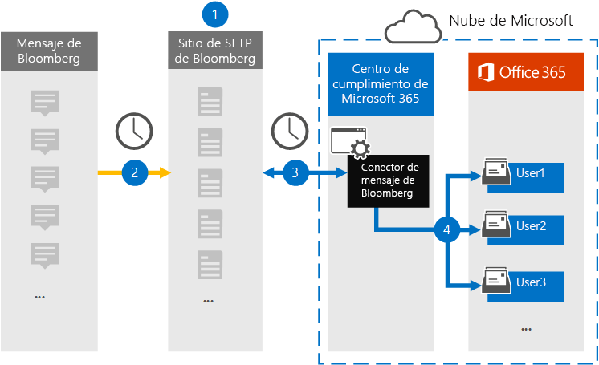

# Configurar un conector para archivar datos de mensajes de BloombergSet up a connector to archive Bloomberg Message data

Use un conector de datos en el Centro de cumplimiento de Microsoft 365 para importar y archivar datos de correo electrónico de servicios financieros desde la herramienta de colaboración [de mensajes Bloomberg.](https://www.bloomberg.com/professional/product/collaboration/)Use a data connector in the Microsoft 365 compliance center to import and archive financial services email data from the [Bloomberg Message](https://www.bloomberg.com/professional/product/collaboration/) collaboration tool. Después de configurar y configurar un conector, se conecta al sitio ftp seguro (SFTP) de Bloomberg de su organización una vez al día e importa elementos de correo electrónico a buzones de Microsoft 365.After you set up and configure a connector, it connects to your organization's Bloomberg secure FTP (SFTP) site once every day, and imports email items to mailboxes in Microsoft 365.

Después de almacenar los datos de mensajes de Bloomberg en buzones de usuario, puede aplicar características de cumplimiento de Microsoft 365 como retención por juicio, búsqueda de contenido, archivado local, auditoría, cumplimiento de comunicaciones y directivas de retención de Microsoft 365 a los datos de mensajes de Bloomberg.After Bloomberg Message data is stored in user mailboxes, you can apply Microsoft 365 compliance features such as Litigation hold, content search, In-place archiving, auditing, Communication compliance, and Microsoft 365 retention policies to Bloomberg Message data. Por ejemplo, puede buscar mensajes de correo electrónico de Bloomberg Message con la herramienta de búsqueda de contenido o asociar el buzón que contiene los datos del mensaje de Bloomberg con un administrador en un caso de eDiscovery avanzado.For example, you can search Bloomberg Message emails using the content search tool or associate the mailbox that contains the Bloomberg Message data with a custodian in an Advanced eDiscovery case. El uso de un conector de mensajes de Bloomberg para importar y archivar datos en Microsoft 365 puede ayudar a su organización a cumplir con las directivas gubernamentales y reglamentarias.Using a Bloomberg Message connector to import and archive data in Microsoft 365 can help your organization stay compliant with government and regulatory policies.

## Información general sobre el archivado de datos de mensajes de BloombergOverview of archiving Bloomberg Message data

En la siguiente introducción se explica el proceso de uso de un conector para archivar datos de mensajes de Bloomberg en Microsoft 365.The following overview explains the process of using a connector to archive Bloomberg Message data in Microsoft 365.

1. Su organización trabaja con Bloomberg para configurar un sitio sftp de Bloomberg.Your organization works with Bloomberg to set up a Bloomberg SFTP site. También trabajará con Bloomberg para configurar El mensaje de Bloomberg para copiar mensajes de correo electrónico en el sitio SFTP de Bloomberg.You'll also work with Bloomberg to configure Bloomberg Message to copy email messages to the Bloomberg SFTP site.

2. Una vez cada 24 horas, los mensajes de correo electrónico de Bloomberg Message se copian en el sitio sftp de Bloomberg.Once every 24 hours, email messages from Bloomberg Message are copied to the Bloomberg SFTP site.

3. El conector de mensajes de Bloomberg que cree en el Centro de cumplimiento de Microsoft 365 se conecta al sitio SFTP de Bloomberg todos los días y transfiere los mensajes de correo electrónico de las 24 horas anteriores a un área segura de Azure Storage en Microsoft Cloud.The Bloomberg Message connector that you create in the Microsoft 365 compliance center connects to the Bloomberg SFTP site every day and transfers the email messages from the previous 24 hours to a secure Azure Storage area in the Microsoft Cloud.

4. El conector importa los elementos de mensaje de correo electrónico al buzón de un usuario específico.The connector imports the email message items to the mailbox of a specific user. Se crea una nueva carpeta denominada BloombergMessage en el buzón del usuario específico y los elementos se importarán a ella.A new folder named BloombergMessage is created in the specific user's mailbox and the items will be imported to it. 

   El conector hace esto mediante el valor de la propiedad CorporateEmailAddress .The connector does this by using the value of the CorporateEmailAddress property. Cada mensaje de correo electrónico contiene esta propiedad, que se rellena con la dirección de correo electrónico de todos los participantes del mensaje de correo electrónico.Every email message contains this property, which is populated with the email address of every participant of the email message. Además de la asignación automática de usuarios mediante el valor de la propiedad *CorporateEmailAddress,* también puede definir una asignación personalizada cargando un archivo de asignación CSV.In addition to automatic user mapping using the value of the *CorporateEmailAddress* property, you can also define a custom mapping by uploading a CSV mapping file. Este archivo de asignación contiene un UUID de Bloomberg y la dirección de buzón de Microsoft 365 correspondiente para cada usuario de la organización.This mapping file contains a Bloomberg UUID and the corresponding Microsoft 365 mailbox address for each user in your organization. Si habilita la asignación automática de usuarios y proporciona una asignación personalizada, por cada elemento de correo electrónico, el conector primero buscará el archivo de asignación personalizada.If you enable automatic user mapping and provide a custom mapping, for every email item the connector will first look at the custom-mapping file. Si no encuentra un usuario válido de Microsoft 365 que se corresponda con el UUID de Bloomberg de un usuario, el conector usa la propiedad *CorporateEmailAddress* del elemento de correo electrónico.If it doesn't find a valid Microsoft 365 user that corresponds to a user's Bloomberg UUID, the connector uses the *CorporateEmailAddress* property of the email item. Si el conector no encuentra un usuario válido de Microsoft 365 en el archivo de asignación personalizada o en la propiedad *CorporateEmailAddress* del elemento de correo electrónico, el elemento no se importará.If the connector doesn't find a valid Microsoft 365 user in either the custom-mapping file or the *CorporateEmailAddress* property of the email item, the item won't be imported.

## Antes de empezarBefore you begin

Algunos de los pasos de implementación necesarios para archivar datos de mensajes de Bloomberg son externos a Microsoft 365 y deben completarse para poder crear el conector en el centro de cumplimiento.Some of the implementation steps required to archive Bloomberg Message data are external to Microsoft 365 and must be completed before you can create the connector in the compliance center.

- Suscríbase [a Bloomberg anywhere](https://www.bloomberg.com/professional/product/remote-access/?bbgsum-page=DG-WS-PROF-PROD-BBA).Subscribe to [Bloomberg Anywhere](https://www.bloomberg.com/professional/product/remote-access/?bbgsum-page=DG-WS-PROF-PROD-BBA). Esto es necesario para que pueda iniciar sesión en Bloomberg anywhere para obtener acceso al sitio SFTP de Bloomberg que tiene que configurar y configurar.This is required so that you can log in to Bloomberg Anywhere to access the Bloomberg SFTP site that you have to set up and configure.

- Configurar un sitio sftp de Bloomberg (protocolo de transferencia segura de archivos).Set up a Bloomberg SFTP (Secure file transfer protocol) site. Después de trabajar con Bloomberg para configurar el sitio SFTP, los datos de Bloomberg Message se cargan en el sitio SFTP todos los días.After working with Bloomberg to set up the SFTP site, data from Bloomberg Message is uploaded to the SFTP site every day. El conector que cree en el paso 2 se conecta a este sitio SFTP y transfiere los datos de correo electrónico a los buzones de Microsoft 365.The connector you create in Step 2 connects to this SFTP site and transfers the email data to Microsoft 365 mailboxes. SFTP también cifra los datos del mensaje de Bloomberg que se envían a los buzones durante el proceso de transferencia.SFTP also encrypts the Bloomberg Message data that is sent to mailboxes during the transfer process.

  Para obtener información sobre Bloomberg SFTP (también denominado *BB-SFTP):*For information about Bloomberg SFTP (also called *BB-SFTP*):

  - Consulte el documento "Estándares de conectividad SFTP" en [el soporte técnico de Bloomberg.](https://www.bloomberg.com/professional/support/documentation/)See the "SFTP Connectivity Standards" document at [Bloomberg Support](https://www.bloomberg.com/professional/support/documentation/).

  - Póngase en [contacto con el soporte al cliente de Bloomberg.](https://service.bloomberg.com/portal/sessions/new?utm_source=bloomberg-menu&utm_medium=csc)Contact [Bloomberg customer support](https://service.bloomberg.com/portal/sessions/new?utm_source=bloomberg-menu&utm_medium=csc).

   > [!NOTE]
   > Si su organización ya implementó un conector para archivar datos de Instant Bloomberg, no es necesario configurar otro sitio SFTP.If your organization already deployed a connector to archive Instant Bloomberg data, you don't need to set up another SFTP site. Puede usar el mismo sitio SFTP para el conector de mensajes Bloomberg.You can use the same SFTP site for the Bloomberg Message connector.

- Después de trabajar con Bloomberg para configurar un sitio SFTP, Bloomberg le proporcionará información después de responder al mensaje de correo electrónico de implementación de Bloomberg.After you work with Bloomberg to set up an SFTP site, Bloomberg will provide some information to you after you respond to the Bloomberg implementation email message. Guarde una copia de la siguiente información.Save a copy of the following information. Se usa para configurar un conector en el paso 3.You use it to set up a connector in Step 3.

  - Código firme, que es un identificador de su organización y se usa para iniciar sesión en el sitio sftp de Bloomberg.Firm code, which is an ID for your organization and is used to log in to the Bloomberg SFTP site.

  - Contraseña para el sitio sftp de BloombergPassword for your Bloomberg SFTP site

  - Dirección URL del sitio SFTP de Bloomberg (por ejemplo, sftp.bloomberg.com).URL for Bloomberg SFTP site (for example, sftp.bloomberg.com). Además, Bloomberg también puede proporcionar una dirección IP correspondiente para el sitio SFTP de Bloomberg, que también se puede usar para configurar el conector.In addition, Bloomberg may also provide a corresponding IP address for the Bloomberg SFTP site, which also can be used to set up the connector.

  - Número de puerto para el sitio SFTP de BloombergPort number for Bloomberg SFTP site

- El conector de mensajes de Bloomberg puede importar un total de 200 000 elementos en un solo día.The Bloomberg Message connector can import a total of 200,000 items in a single day. Si hay más de 200 000 elementos en el sitio SFTP, ninguno de esos elementos se importará a Microsoft 365.If there are more than 200,000 items on the SFTP site, none of those items will be imported to Microsoft 365.

- El usuario que crea un conector de mensajes Bloomberg en el paso 3 (y que descarga las claves públicas y la dirección IP en el paso 1) debe tener asignado el rol de importación y exportación de buzones en Exchange Online.The user who creates a Bloomberg Message connector in Step 3 (and who downloads the public keys and IP address in Step 1) must be assigned the Mailbox Import Export role in Exchange Online. Esto es necesario para agregar conectores en la **página Conectores de** datos en el Centro de cumplimiento de Microsoft 365.This is required to add connectors in the **Data connectors** page in the Microsoft 365 compliance center. Este rol no está asignado a ningún grupo de roles de Exchange Online de forma predeterminada.By default, this role isn't assigned to any role group in Exchange Online. Puede agregar el rol De importación y exportación de buzones al grupo de roles Administración de la organización en Exchange Online.You can add the Mailbox Import Export role to the Organization Management role group in Exchange Online. O bien, puede crear un grupo de roles, asignar el rol de importación y exportación de buzones de correo y, a continuación, agregar los usuarios adecuados como miembros.Or you can create a role group, assign the Mailbox Import Export role, and then add the appropriate users as members. Para obtener más información, vea  las secciones Crear grupos de [roles](https://docs.microsoft.com/Exchange/permissions-exo/role-groups#create-role-groups) o Modificar grupos de roles en el artículo "Administrar grupos de roles en Exchange Online".For more information, see the [Create role groups](https://docs.microsoft.com/Exchange/permissions-exo/role-groups#create-role-groups) or [Modify role groups](https://docs.microsoft.com/Exchange/permissions-exo/role-groups#modify-role-groups) sections in the article "Manage role groups in Exchange Online".

## Paso 1: Obtener claves públicas SSH y PGPStep 1: Obtain SSH and PGP public keys

El primer paso es obtener una copia de las claves públicas del Shell seguro (SSH) y la Privacidad bastante buena (PGP).The first step is to obtain a copy of the public keys for Secure Shell (SSH) and Pretty Good Privacy (PGP). Estas claves se usan en el paso 2 para configurar el sitio SFTP de Bloomberg para permitir que el conector (que crea en el paso 3) se conecte al sitio SFTP y transfiera los datos de correo electrónico del mensaje de Bloomberg a los buzones de Microsoft 365.You use these keys in Step 2 to configure the Bloomberg SFTP site to allow the connector (that you create in Step 3) to connect to the SFTP site and transfer the Bloomberg Message email data to Microsoft 365 mailboxes. También obtendrá una dirección IP en este paso, que usará al configurar el sitio SFTP de Bloomberg.You also obtain an IP address in this step, which you use when configuring the Bloomberg SFTP site.

1. Vaya a [ https://compliance.microsoft.com\ ]( https://compliance.microsoft.com) y haga clic **en Conectores de datos** en el panel de navegación izquierdo.Go to [https://compliance.microsoft.com\](https://compliance.microsoft.com) and click **Data connectors** in the left nav.

2. En la **página Conectores de datos** en Mensaje de **Bloomberg**, haga clic **en Ver**.On the **Data connectors** page under **Bloomberg Message**, click **View**.

3. En la página **de descripción del producto De bloomberg Message,** haga clic en Agregar **conector**On the **Bloomberg Message** product description page, click **Add connector**

4. En la **página Términos de** servicio, haga clic **en Aceptar.**On the **Terms of service** page, click **Accept**.

5. En el sitio Agregar credenciales para **Bloomberg SFTP** en el paso 1, haga clic en la tecla **SSH** de descarga, descargue la clave **PGP** y descargue los vínculos de dirección **IP** para guardar una copia de cada archivo en el equipo local.On the **Add credentials for Bloomberg SFTP site** under step 1, click the **Download SSH key**, **Download PGP key**, and **Download IP address** links to save a copy of each file to your local computer. Estos archivos contienen los siguientes elementos que se usan para configurar el sitio SFTP de Bloomberg en el paso 2:These files contain the following items that are used to configure the Bloomberg SFTP site in Step 2:

   - Clave pública SSH: esta clave se usa para configurar el Shell seguro (SSH) para habilitar un inicio de sesión remoto seguro cuando el conector se conecta al sitio SFTP de Bloomberg.SSH public key: This key is used to configure Secure Shell (SSH) to enable a secure remote login when the connector connects to the Bloomberg SFTP site.

   - Clave pública PGP: esta clave se usa para configurar el cifrado de datos que se transfieren desde el sitio SFTP de Bloomberg a Microsoft 365.PGP public key: This key is used to configure the encryption of data that's transferred from the Bloomberg SFTP site to Microsoft 365.

   - Dirección IP: el sitio SFTP de Bloomberg está configurado para aceptar una solicitud de conexión solo desde esta dirección IP, que usa el conector de mensajes de Bloomberg que crea en el paso 3.IP address: The Bloomberg SFTP site is configured to accept a connection request only from this IP address, which is used by the Bloomberg Message connector that you create in Step 3.

6. Haga **clic en** Cancelar para cerrar el asistente.Click **Cancel** to close the wizard. Volverá a este asistente en el paso 3 para crear el conector.You come back to this wizard in Step 3 to create the connector.

## Paso 2: Configurar el sitio sftp de BloombergStep 2: Configure the Bloomberg SFTP site

> [!NOTE]
> Como se ha indicado anteriormente, si su organización ha configurado previamente un sitio SFTP de Bloomberg para archivar datos de Instant Bloomberg, no tiene que configurar otro.As previously stated, if you're organization has previously set up a Bloomberg SFTP site to archive Instant Bloomberg data, you don't have to set up another one. Puede especificar el mismo sitio SFTP al crear el conector en el paso 3.You can specify the same SFTP site when you create the connector in Step 3.

El siguiente paso es usar las claves públicas SSH y PGP y la dirección IP que obtuvo en el paso 1 para configurar la autenticación SSH y el cifrado PGP para el sitio SFTP de Bloomberg.The next step is to use the SSH and PGP public keys and the IP address that you obtained in Step 1 to configure SSH authentication and PGP encryption for the Bloomberg SFTP site. Esto permite que el conector de mensaje Bloomberg que cree en el paso 3 se conecte al sitio SFTP de Bloomberg y transfiera los datos del mensaje de Bloomberg a Microsoft 365.This lets the Bloomberg Message connector that you create in Step 3 connect to the Bloomberg SFTP site and transfer Bloomberg Message data to Microsoft 365. Debe trabajar con el soporte al cliente de Bloomberg para configurar su sitio sftp de Bloomberg.You need to work with Bloomberg customer support to set up your Bloomberg SFTP site. Póngase [en contacto con el soporte técnico de Bloomberg](https://service.bloomberg.com/portal/sessions/new?utm_source=bloomberg-menu&utm_medium=csc) para obtener ayuda.Contact [Bloomberg customer support](https://service.bloomberg.com/portal/sessions/new?utm_source=bloomberg-menu&utm_medium=csc) for assistance.

> [!IMPORTANT]
> Bloomberg recomienda adjuntar los tres archivos que descargó en el paso 1 a un mensaje de correo electrónico y enviarlos a su equipo de soporte técnico al trabajar con ellos para configurar el sitio SFTP de Bloomberg.Bloomberg recommends that you attach the three files that you downloaded in Step 1 to an email message and send it to their customer support team when working with them to set up your Bloomberg SFTP site.

## Paso 3: Crear un conector de mensajes de BloombergStep 3: Create a Bloomberg Message connector

El último paso es crear un conector de mensajes de Bloomberg en el Centro de cumplimiento de Microsoft 365.The last step is to create a Bloomberg Message connector in the Microsoft 365 compliance center. El conector usa la información que proporciona para conectarse al sitio SFTP de Bloomberg y transferir mensajes de correo electrónico a los cuadros de buzón de usuario correspondientes en Microsoft 365.The connector uses the information you provide to connect to the Bloomberg SFTP site and transfer email messages to the corresponding user mailbox boxes in Microsoft 365.

1. Vaya a [https://compliance.microsoft.com](https://compliance.microsoft.com) conectores de **datos y haga clic en** conectores de datos en el panel de navegación izquierdo.Go to [https://compliance.microsoft.com](https://compliance.microsoft.com) and click **Data connectors** in the left nav.

2. En la **página Conectores de datos** en Mensaje de **Bloomberg**, haga clic **en Ver**.On the **Data connectors** page under **Bloomberg Message**, click **View**.

3. En la página **de descripción del producto De bloomberg Message,** haga clic en Agregar **conector**On the **Bloomberg Message** product description page, click **Add connector**

4. En la **página Términos de** servicio, haga clic **en Aceptar.**On the **Terms of service** page, click **Accept**.

5. En la página Agregar credenciales para el sitio SFTP de **Bloomberg,** en el paso 3, escriba la información necesaria en los siguientes cuadros y, a continuación, haga clic en **Siguiente**.On the **Add credentials for Bloomberg SFTP site** page, under Step 3, enter the required information in the following boxes and then click **Next**.

      - **Código firme:** El identificador de su organización que se usa como nombre de usuario para el sitio SFTP de Bloomberg.**Firm code:** The ID for your organization that is used as the username for the Bloomberg SFTP site.

      - **Contraseña:** La contraseña del sitio SFTP de Bloomberg de su organización.**Password:** The password for your organization's Bloomberg SFTP site.

      - **DIRECCIÓN URL de SFTP:** La dirección URL del sitio SFTP de Bloomberg (por ejemplo, sftp.bloomberg.com).**SFTP URL:** The URL for the Bloomberg SFTP site (for example, sftp.bloomberg.com).

      - **Puerto SFTP:** Número de puerto del sitio sftp de Bloomberg.**SFTP port:** The port number for the Bloomberg SFTP site. El conector usa este puerto para conectarse al sitio SFTP.The connector uses this port to connect to the SFTP site.

6. En la **página Asignación de** usuarios, habilite la asignación automática de usuarios y proporcione la asignación de usuarios personalizada según sea necesario.On the **User-mapping** page, enable automatic user mapping and provide custom user mapping as required

7. Haga **clic en Siguiente,** revise la configuración y, a continuación, haga clic en Preparar para crear el conector.Click **Next**, review your settings, and then click prepare to create the connector.

8. Vaya a la **página Conectores de** datos para ver el progreso del proceso de importación para el nuevo conector.Go to the **Data connectors** page to see the progress of the import process for the new connector.

## Problemas conocidosKnown issues

- No se admiten subprocesos de correo electrónico de mensajes de Bloomberg importados a Microsoft 365.Threading of Bloomberg Message email imported to Microsoft 365 isn't supported. Los mensajes individuales enviados a una persona se importan, pero no se presentan en una conversación en secuencia.Individual messages sent to a person are imported, but they aren't presented in a threaded conversation. Microsoft está trabajando para admitir los subprocesos en versiones posteriores del conector de datos De mensajes de Bloomberg.Microsoft is working to support threading in later versions of the Bloomberg Message data connector.
