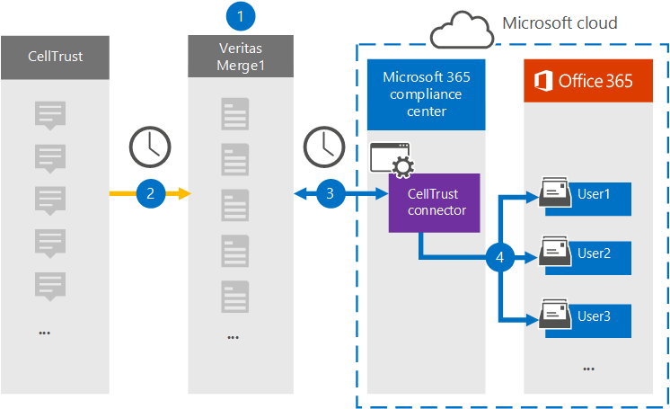

# Configurar un conector para archivar datos de CellTrustSet up a connector to archive CellTrust data

Use un conector de Globanet en el centro de cumplimiento de Microsoft 365 para importar y archivar datos desde la plataforma CellTrust a los buzones de usuario de la organización 365 de Microsoft.Use a Globanet connector in the Microsoft 365 compliance center to import and archive data from the CellTrust platform to user mailboxes in your Microsoft 365 organization. Globanet proporciona un conector [CellTrust](https://globanet.com/celltrust/) que está configurado para capturar elementos del origen de datos de terceros (de forma regular) e importar los elementos a Microsoft 365.Globanet provides a [CellTrust](https://globanet.com/celltrust/) connector that's configured to capture items from the third-party data source (on a regular basis) and import those items to Microsoft 365. El conector convierte el contenido de los mensajes SMS de las cuentas de CellTrust en un formato de mensaje de correo electrónico y, a continuación, importa dichos elementos en el buzón del usuario en Microsoft 365.The connector converts the content of SMS messages from CellTrust accounts to an email message format and then imports those items to the user's mailbox in Microsoft 365.

Una vez que los datos de CellTrust se almacenan en buzones de usuario, puede aplicar características de cumplimiento de Microsoft 365 como retención por juicio, eDiscovery, directivas de retención y etiquetas de retención, y cumplimiento de la comunicación.After CellTrust data is stored in user mailboxes, you can apply Microsoft 365 compliance features such as Litigation Hold, eDiscovery, retention policies and retention labels, and communication compliance. El uso de un conector de CellTrust para importar y archivar datos en Microsoft 365 puede ayudar a su organización a cumplir las directivas gubernamentales y regulatorias.Using a CellTrust connector to import and archive data in Microsoft 365 can help your organization stay compliant with government and regulatory policies.

## Información general sobre el archivado de datos de CellTrustOverview of archiving CellTrust data

En la siguiente introducción se explica el proceso de uso de un conector para archivar datos de CellTrust en Microsoft 365.The following overview explains the process of using a connector to archive CellTrust data in Microsoft 365.

1. Su organización trabaja con CellTrust para instalar y configurar un sitio de CellTrust.Your organization works with CellTrust to set up and configure a CellTrust site.

2. Una vez cada 24 horas, los elementos de CellTrust se copian en el sitio Merge1 de Globanet.Once every 24 hours, CellTrust items are copied to the Globanet Merge1 site. El conector también convierte el contenido de un mensaje en un formato de mensaje de correo electrónico.The connector also converts the content of a message to an email message format.

3. El conector CellTrust que se crea en el centro de cumplimiento de Microsoft 365 se conecta al sitio de Globanet Merge1 todos los días y transfiere los mensajes a una ubicación de almacenamiento seguro de Azure en la nube de Microsoft.The CellTrust connector that you create in the Microsoft 365 compliance center connects to the Globanet Merge1 site every day and transfers the messages to a secure Azure Storage location in the Microsoft cloud.

4. La asignación automática de usuarios como conector importa elementos a los buzones de usuarios específicos mediante el valor de la propiedad *email* del que se describe en el [paso 3](#step-3-map-users-and-complete-the-connector-setup).The automatic user mapping as connector imports items to the mailboxes of specific users by using the value of the *Email* property of the described in [Step 3](#step-3-map-users-and-complete-the-connector-setup). Se crea una subcarpeta en la carpeta Bandeja de entrada denominada **CellTrust** en los buzones de usuario y los elementos de mensaje se importan a esa carpeta.A subfolder in the Inbox folder named **CellTrust** is created in the user mailboxes, and the message items are imported to that folder. El conector determina a qué buzón se importarán los elementos mediante el valor de la propiedad *email* .The connector determines which mailbox to import items to by using the value of the *Email* property. Cada elemento CellTrust contiene esta propiedad, que se rellena con la dirección de correo electrónico de cada participante.Every CellTrust item contains this property, which is populated with the email address of every participant.

## Antes de empezarBefore you begin

- Cree una cuenta de Merge1 para Microsoft Connectors.Create a Merge1 account for Microsoft connectors. Para crear una cuenta, póngase en contacto [con el soporte técnico de Globanet](https://globanet.com/contact-us/).To create an account, contact [Globanet Customer Support](https://globanet.com/contact-us/). Debe iniciar sesión en esta cuenta cuando cree el conector en el paso 1.You need to sign into this account when you create the connector in Step 1.

- El usuario que crea el conector CellTrust en el paso 1 (y lo completa en el paso 3) debe estar asignado a la función importación y exportación de buzones de correo en Exchange Online.The user who creates the CellTrust connector in Step 1 (and completes it in Step 3) must be assigned to the Mailbox Import Export role in Exchange Online. Este rol es necesario para agregar conectores en la página **conectores de datos** del centro de cumplimiento de Microsoft 365.This role is required to add connectors on the **Data connectors** page in the Microsoft 365 compliance center. De forma predeterminada, este rol no está asignado a ningún grupo de roles en Exchange Online.By default, this role is not assigned to any role group in Exchange Online. Puede Agregar el rol importación y exportación de buzones al grupo de funciones de administración de la organización en Exchange Online.You can add the Mailbox Import Export role to the Organization Management role group in Exchange Online. O bien, puede crear un grupo de roles, asignar el rol de importación y exportación de buzones de correo y, a continuación, agregar los usuarios adecuados como miembros.Or you can create a role group, assign the Mailbox Import Export role, and then add the appropriate users as members. Para obtener más información, vea las secciones [crear grupos](https://docs.microsoft.com/Exchange/permissions-exo/role-groups#create-role-groups) de roles o [modificar grupos de roles](https://docs.microsoft.com/Exchange/permissions-exo/role-groups#modify-role-groups) en el artículo sobre la administración de grupos de roles en Exchange Online.For more information, see the [Create role groups](https://docs.microsoft.com/Exchange/permissions-exo/role-groups#create-role-groups) or [Modify role groups](https://docs.microsoft.com/Exchange/permissions-exo/role-groups#modify-role-groups) sections in the article "Manage role groups in Exchange Online".

## Paso 1: configurar el conector de CellTrustStep 1: Set up the CellTrust connector

El primer paso es obtener acceso a los **conectores de datos** en el centro de cumplimiento de Microsoft 365 y crear un conector para los datos de CellTrust.The first step is to access to the **Data Connectors** in the Microsoft 365 compliance center and create a connector for CellTrust data.

1. Vaya a [https://compliance.microsoft.com](https://compliance.microsoft.com/) y haga clic en **conectores de datos** \> **CellTrust**.Go to [https://compliance.microsoft.com](https://compliance.microsoft.com/) and then click **Data connectors** \> **CellTrust**.

2. En la página Descripción del producto de **CellTrust** , haga clic en **Agregar conector**.On the **CellTrust** product description page, click **Add connector**.

3. En la página **condiciones de servicio** , haga clic en **Aceptar**.On the **Terms of service** page, click **Accept**.

4. Escriba un nombre único que identifique el conector y, a continuación, haga clic en **siguiente**.Enter a unique name that identifies the connector and then click **Next**.

5. Inicie sesión en su cuenta de Merge1 para configurar el conector.Sign in to your Merge1 account to configure the connector.

## Paso 2: configurar el conector de CellTrust en el sitio de Merge1 de GlobanetStep 2: Configure the CellTrust connector on the Globanet Merge1 site

El segundo paso consiste en configurar el conector de CellTrust en el sitio de Merge1 de Globanet.The second step is to configure the CellTrust connector on the Globanet Merge1 site. Para obtener información acerca de cómo configurar el conector de CellTrust, consulte [Merge1 guía del usuario de conectores de terceros](https://docs.ms.merge1.globanetportal.com/Merge1%20Third-Party%20Connectors%20CellTrust%20User%20Guide%20.pdf).For information about how to configure the CellTrust connector, see [Merge1 Third-Party Connectors User Guide](https://docs.ms.merge1.globanetportal.com/Merge1%20Third-Party%20Connectors%20CellTrust%20User%20Guide%20.pdf).

Después de hacer clic en **guardar & finalizar**, se muestra la página **asignación de usuarios** en el Asistente para conectores del centro de cumplimiento de Microsoft 365.After you click **Save & Finish**, the **User mapping** page in the connector wizard in the Microsoft 365 compliance center is displayed.

## Paso 3: asignar usuarios y completar la configuración del conectorStep 3: Map users and complete the connector setup

Para asignar usuarios y completar el conector configurado en el centro de cumplimiento de Microsoft 365, siga estos pasos:To map users and complete the connector set up in the Microsoft 365 compliance center, follow these steps:

1. En la página **asignar CellTrust usuarios a Microsoft 365 usuarios** , habilite la asignación automática de usuarios.On the **Map CellTrust users to Microsoft 365 users** page, enable automatic user mapping. Los elementos CellTrust incluyen una propiedad denominada *email*, que contiene las direcciones de correo electrónico de los usuarios de la organización.The CellTrust items include a property called *Email*, which contains email addresses for users in your organization. Si el conector puede asociar esta dirección con un usuario de Microsoft 365, los elementos se importan al buzón de correo del usuario.If the connector can associate this address with a Microsoft 365 user, the items are imported to that user’s mailbox.

2. Haga clic en **siguiente**, revise la configuración y vaya a la página **conectores de datos** para ver el progreso del proceso de importación del nuevo conector.Click **Next**, review your settings, and go to the **Data connectors** page to see the progress of the import process for the new connector.

## Paso 4: supervisar el conector de CellTrustStep 4: Monitor the CellTrust connector

Después de crear el conector de CellTrust, puede ver el estado del conector en el centro de cumplimiento de Microsoft 365.After you create the CellTrust connector, you can view the connector status in the Microsoft 365 compliance center.

1. Vaya a [https://compliance.microsoft.com](https://compliance.microsoft.com/) y haga clic en **conectores de datos** en el panel de navegación izquierdo.Go to [https://compliance.microsoft.com](https://compliance.microsoft.com/) and click **Data connectors** in the left nav.

2. Haga clic en la pestaña **conectores** y, a continuación, seleccione el conector de **CellTrust** para mostrar la página de flotante, que contiene las propiedades y la información sobre el conector.Click the **Connectors** tab and then select the **CellTrust** connector to display the flyout page, which contains the properties and information about the connector.

3. En **Estado del conector con origen**, haga clic en el vínculo **Descargar registro** para abrir (o guardar) el registro de estado del conector.Under **Connector status with source**, click the **Download log** link to open (or save) the status log for the connector. Este registro contiene datos que se han importado a la nube de Microsoft.This log contains data that has been imported to the Microsoft cloud.

## Problemas conocidosKnown issues

- En este momento, no se admite la importación de datos adjuntos o elementos de más de 10 MB.At this time, we don't support importing attachments or items that are larger than 10 MB. La compatibilidad con elementos más grandes estará disponible en una fecha posterior.Support for larger items will be available at a later date.
