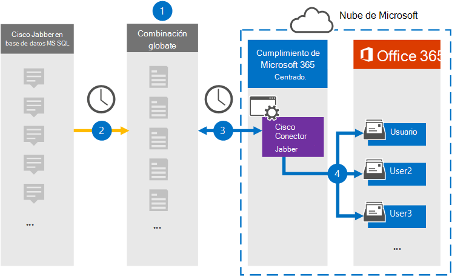

# Configurar un conector para archivar datos de Cisco JabberSet up a connector to archive Cisco Jabber data

Use un conector de Globanet en el Centro de cumplimiento de Microsoft 365 para importar y archivar datos desde la plataforma Cisco Jabber a los buzones de usuario de su organización de Microsoft 365.Use a Globanet connector in the Microsoft 365 compliance center to import and archive data from the Cisco Jabber platform to user mailboxes in your Microsoft 365 organization. Globanet le proporciona un conector [de Cisco Jabber](https://globanet.com/jabber/) que está configurado para capturar elementos de la base de datos MS SQL de Jabber, como mensajes de chat 1:1 y chats de grupo y, a continuación, importar esos elementos a Microsoft 365.Globanet provides you with a [Cisco Jabber](https://globanet.com/jabber/) connector that is configured to capture items from the Jabber’s MS SQL Database, such as 1:1 chat messages and group chats and then import those items to Microsoft 365. El conector recupera datos de la base de datos MS SQL de Cisco Jabber, los procesa y convierte el contenido de la cuenta de Cisco Jabber de un usuario a un formato de mensaje de correo electrónico y, a continuación, importa esos elementos al buzón del usuario en Microsoft 365.The connector retrieves data from the Cisco Jabber’s MS SQL Database, processes it, and the converts the content from a user's Cisco Jabber account to an email message format and then imports those items to the user's mailbox in Microsoft 365.

Una vez que los datos de Cisco Jabber se almacenan en buzones de usuario, puede aplicar características de cumplimiento de Microsoft 365 como retención por juicio, exhibición de documentos electrónicos, directivas de retención y etiquetas de retención y cumplimiento de comunicaciones.After Cisco Jabber data is stored in user mailboxes, you can apply Microsoft 365 compliance features such as Litigation Hold, eDiscovery, retention policies and retention labels, and communication compliance. El uso de un conector de Cisco Jabber para importar y archivar datos en Microsoft 365 puede ayudar a su organización a cumplir con las directivas gubernamentales y reglamentarias.Using a Cisco Jabber connector to import and archive data in Microsoft 365 can help your organization stay compliant with government and regulatory policies.

## Información general sobre el archivado de datos de Cisco JabberOverview of archiving Cisco Jabber data

En la siguiente introducción se explica el proceso de uso de un conector para archivar datos de Cisco Jabber en Microsoft 365.The following overview explains the process of using a connector to archive Cisco Jabber data in Microsoft 365.

1. Su organización trabaja con Cisco para configurar y configurar un Cisco Jabber en MS SQL base de datos.Your organization works with Cisco to set up and configure a Cisco Jabber on MS SQL Database.

2. Una vez cada 24 horas, los elementos de Cisco Jabber se copian de la base de datos SQL MS al sitio de Globanet Merge1.Once every 24 hours, Cisco Jabber items are copied from the MS SQL Database to the Globanet Merge1 site. El conector también convierte el contenido de los mensajes de chat a un formato de mensaje de correo electrónico.The connector also converts the content of chat messages to an email message format.

3. El conector de Cisco Jabber que crea en el centro de cumplimiento de Microsoft 365 se conecta al sitio de Globanet Merge1 todos los días y transfiere los elementos a una ubicación segura de Azure Storage en la nube de Microsoft.The Cisco Jabber connector that you create in the Microsoft 365 compliance center connects to the Globanet Merge1 site every day and transfers the items to a secure Azure Storage location in the Microsoft cloud.

4. La asignación automática de usuarios como conector importa elementos a los buzones de usuarios específicos mediante el valor de la propiedad *Email* del descrito en [el paso 3](#step-3-map-users-and-complete-the-connector-setup).The automatic user mapping as connector imports items to the mailboxes of specific users by using the value of the *Email* property of the described in [Step 3](#step-3-map-users-and-complete-the-connector-setup). Se crea una subcarpeta en la carpeta Bandeja de entrada denominada **Cisco Jabber en MS SQL** en los buzones de usuario y los elementos del mensaje se importan a esa carpeta.A subfolder in the Inbox folder named **Cisco Jabber on MS SQL** is created in the user mailboxes, and the message items are imported to that folder. El conector determina a qué buzón se importarán los elementos mediante el valor de la *propiedad Email.*The connector determines which mailbox to import items to by using the value of the *Email* property. Cada elemento de Cisco Jabber contiene esta propiedad, que se rellena con la dirección de correo electrónico de cada participante.Every Cisco Jabber item contains this property, which is populated with the email address of every participant.

## Antes de empezarBefore you begin

- Crear una cuenta de Globanet Merge1 para conectores de Microsoft.Create a Globanet Merge1 account for Microsoft connectors. Para crear esta cuenta, póngase en contacto [con el servicio de soporte al cliente de Globanet](https://globanet.com/ms-connectors-contact/).To create this account, contact [Globanet Customer Support](https://globanet.com/ms-connectors-contact/). Iniciará sesión en esta cuenta al crear el conector en el paso 1.You will sign into this account when you create the connector in Step 1.

- Configure una base de datos de SQL MS para recuperar elementos de Jabber de antes de crear el conector en el paso 1.Set up an MS SQL Database to retrieve Jabber items from before creating the connector in Step 1. Especificará la configuración de conexión de la base de datos de SQL MS al configurar el conector de Cisco Jabber en el paso 2.You will specify the connection settings for the MS SQL Database when configuring the Cisco Jabber connector in Step 2. Para obtener más información, vea la Guía del usuario de [Merge1 Third-Party Connectors](https://docs.ms.merge1.globanetportal.com/Merge1%20Third-Party%20Connectors%20Cisco%20Jabber%20on%20MS%20SQL%20User%20Guide%20.pdf).For more information, see the [Merge1 Third-Party Connectors User Guide](https://docs.ms.merge1.globanetportal.com/Merge1%20Third-Party%20Connectors%20Cisco%20Jabber%20on%20MS%20SQL%20User%20Guide%20.pdf).

- El usuario que crea el conector de Cisco Jabber en el paso 1 (y lo completa en el paso 3) debe estar asignado al rol de exportación de importación de buzones en Exchange Online.The user who creates the Cisco Jabber connector in Step 1 (and completes it in Step 3) must be assigned to the Mailbox Import Export role in Exchange Online. Este rol es necesario para agregar conectores en la página **Conectores de datos** del Centro de cumplimiento de Microsoft 365.This role is required to add connectors on the **Data connectors** page in the Microsoft 365 compliance center. De forma predeterminada, este rol no se asigna a un grupo de roles en Exchange Online.By default, this role is not assigned to a role group in Exchange Online. Puede agregar el rol Exportación de importación de buzones al grupo de roles Administración de la organización en Exchange Online.You can add the Mailbox Import Export role to the Organization Management role group in Exchange Online. O bien, puede crear un grupo de roles, asignar el rol Importación de buzones de correo Exportar y, a continuación, agregar los usuarios adecuados como miembros.Or you can create a role group, assign the Mailbox Import Export role, and then add the appropriate users as members. Para obtener más información, vea  las secciones [Crear](/Exchange/permissions-exo/role-groups#create-role-groups) grupos de roles o Modificar grupos de roles en el artículo "Administrar grupos de roles en Exchange Online".For more information, see the [Create role groups](/Exchange/permissions-exo/role-groups#create-role-groups) or [Modify role groups](/Exchange/permissions-exo/role-groups#modify-role-groups) sections in the article "Manage role groups in Exchange Online".

## Paso 1: Configurar el conector de Cisco JabberStep 1: Set up the Cisco Jabber connector

El primer paso es acceder a **los** conectores de datos en el centro de cumplimiento de Microsoft 365 y crear un conector para Cisco Jabber en MS SQL datos.The first step is to access to the **Data Connectors** in the Microsoft 365 compliance center and create a connector for Cisco Jabber on MS SQL data.

1. Vaya a [https://compliance.microsoft.com](https://compliance.microsoft.com/) y, a continuación, haga clic **en Conectores de datos** Cisco  >  **Jabber en MS SQL**.Go to [https://compliance.microsoft.com](https://compliance.microsoft.com/)and then click **Data connectors** > **Cisco Jabber on MS SQL**.

2. En la página Descripción del producto de **Cisco Jabber on MS SQL,** haga clic **en Agregar conector**.On the **Cisco Jabber on MS SQL** product description page, click **Add connector**.

3. En la **página Términos de** servicio, haga clic **en Aceptar**.On the **Terms of service** page, click **Accept**.

4. Escriba un nombre único que identifique el conector y, a continuación, haga clic en **Siguiente**.Enter a unique name that identifies the connector and then click **Next**.

5. Inicie sesión en su cuenta merge1 para configurar el conector.Sign in to your Merge1 account to configure the connector.

## Paso 2: Configurar el conector de Cisco Jabber en el sitio de Globanet Merge1Step 2: Configure the Cisco Jabber connector on the Globanet Merge1 site

El segundo paso consiste en configurar cisco Jabber en el conector SQL MS en el sitio de Globanet Merge1.The second step is to configure the Cisco Jabber on MS SQL connector on the Globanet Merge1 site. Para obtener información acerca de cómo configurar cisco Jabber en el conector SQL MS, vea [Merge1 Third-Party Connectors User Guide](https://docs.ms.merge1.globanetportal.com/Merge1%20Third-Party%20Connectors%20Cisco%20Jabber%20on%20MS%20SQL%20User%20Guide%20.pdf).For information about how to configure the Cisco Jabber on MS SQL connector, see [Merge1 Third-Party Connectors User Guide](https://docs.ms.merge1.globanetportal.com/Merge1%20Third-Party%20Connectors%20Cisco%20Jabber%20on%20MS%20SQL%20User%20Guide%20.pdf).

Después de hacer clic en Guardar  & **finalizar**, se muestra la página Asignación de usuario en el asistente para conectores en el Centro de cumplimiento de Microsoft 365.After you click **Save & Finish**, the **User mapping** page in the connector wizard in the Microsoft 365 compliance center is displayed.

## Paso 3: Asignar usuarios y completar la configuración del conectorStep 3: Map users and complete the connector setup

Para asignar usuarios y completar la configuración del conector en el Centro de cumplimiento de Microsoft 365, siga estos pasos:To map users and complete the connector set up in the Microsoft 365 compliance center, follow these steps:

1. En la **página Asignar Cisco Jabber en MS SQL usuarios a usuarios de Microsoft 365,** habilite la asignación automática de usuarios.On the **Map Cisco Jabber on MS SQL users to Microsoft 365 users** page, enable automatic user mapping. El Jabber de Cisco en MS SQL elementos incluyen una propiedad denominada *Correo* electrónico , que contiene direcciones de correo electrónico para los usuarios de su organización.The Cisco Jabber on MS SQL items include a property called *Email*, which contains email addresses for users in your organization. Si el conector puede asociar esta dirección con un usuario de Microsoft 365, los elementos se importan al buzón de ese usuario.If the connector can associate this address with a Microsoft 365 user, the items are imported to that user’s mailbox.

2. Haga **clic en** Siguiente, revise la configuración y vaya a la página **Conectores** de datos para ver el progreso del proceso de importación del nuevo conector.Click **Next**, review your settings, and go to the **Data connectors** page to see the progress of the import process for the new connector.

## Paso 4: Supervisar el conector de Cisco JabberStep 4: Monitor the Cisco Jabber connector

Después de crear cisco Jabber en el conector de SQL MS, puede ver el estado del conector en el Centro de cumplimiento de Microsoft 365.After you create the Cisco Jabber on MS SQL connector, you can view the connector status in the Microsoft 365 compliance center.

1. Vaya a [https://compliance.microsoft.com](https://compliance.microsoft.com) y haga clic en **Conectores de datos** en la navegación izquierda.Go to [https://compliance.microsoft.com](https://compliance.microsoft.com) and click **Data connectors** in the left nav.

2. Haga clic **en la pestaña Conectores** y, a continuación, seleccione cisco **Jabber en MS SQL** conector para mostrar la página desplegable.Click the **Connectors** tab and then select the **Cisco Jabber on MS SQL** connector to display the flyout page. Esta página contiene las propiedades y la información sobre el conector.This page contains the properties and information about the connector.

3. En **Estado del conector con origen,** haga clic en el vínculo Descargar **registro** para abrir (o guardar) el registro de estado del conector.Under **Connector status with source**, click the **Download log** link to open (or save) the status log for the connector. Este registro contiene datos que se han importado a la nube de Microsoft.This log contains data that has been imported to the Microsoft cloud.

## Problemas conocidosKnown issues

- En este momento, no se admite la importación de datos adjuntos o elementos de más de 10 MB.At this time, we don't support importing attachments or items that are larger than 10 MB. La compatibilidad con elementos más grandes estará disponible en una fecha posterior.Support for larger items will be available at a later date.