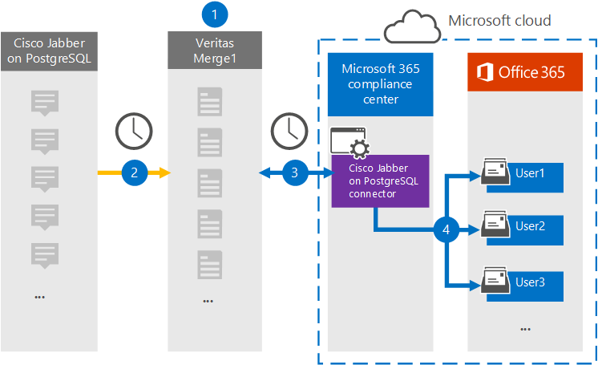

# Configuración de un conector para archivar cisco jabber en datos de PostgreSQL

Use un conector Veritas en el portal de cumplimiento Microsoft Purview para importar y archivar datos de la plataforma Cisco Jabber a buzones de usuario de su organización de Microsoft 365. Veritas proporciona un conector [Cisco Jabber en PostgreSQL](https://www.veritas.com/insights/merge1/jabber) que está configurado para capturar elementos del origen de datos de terceros (de forma regular) e importar esos elementos a Microsoft 365. El conector convierte el contenido como mensajes, chats y contenido compartido de Cisco Jabber en PostgreSQL en un formato de mensaje de correo electrónico y, a continuación, importa esos elementos al buzón del usuario en Microsoft 365.

Después de que los datos de Cisco Jabber en PostgreSQL se almacenan en buzones de usuario, puede aplicar características de Microsoft Purview como suspensión por juicio, exhibición de documentos electrónicos, directivas de retención y etiquetas de retención. El uso de un conector Cisco Jabber en PostgreSQL para importar y archivar datos en Microsoft 365 puede ayudar a su organización a cumplir las directivas gubernamentales y normativas.

[!INCLUDE [purview-preview](../includes/purview-preview.md)]

## Introducción al archivado de Cisco Jabber en datos de PostgreSQL

En la información general siguiente se explica el proceso de uso de un conector para archivar los datos de Cisco Jabber en PostgreSQL en Microsoft 365.

1. Su organización trabaja con Cisco Jabber en PostgreSQL para configurar un Cisco Jabber en el sitio de PostgreSQL.

2. Una vez cada 24 horas, los elementos del Cisco Jabber en PostgreSQL se copian en el sitio de Veritas Merge1. El conector también convierte Cisco Jabber en elementos de PostgreSQL a un formato de mensaje de correo electrónico.

3. El conector Cisco Jabber on PostgreSQL que se crea en el portal de cumplimiento, se conecta al sitio de Veritas Merge1 todos los días y transfiere el contenido del Jabber a una ubicación segura de Azure Storage en la nube de Microsoft.

4. El conector importa los elementos convertidos a los buzones de usuarios específicos mediante el valor de la propiedad *Email* de la asignación automática de usuarios, tal como se describe en [el paso 3](#step-3-map-users-and-complete-the-connector-setup). Se crea una subcarpeta en la carpeta Bandeja de entrada denominada **Cisco Jabber en PostgreSQL** en los buzones de usuario, y los elementos se importan a esa carpeta. Para ello, el conector usa el valor de la propiedad *Email*. Cada elemento jabber contiene esta propiedad, que se rellena con la dirección de correo electrónico de cada participante del elemento.

## Antes de empezar

- Cree una cuenta de Merge1 para los conectores de Microsoft. Para ello, póngase en contacto con [el servicio de atención al cliente de Veritas](https://www.veritas.com/content/support/en_US). Debe iniciar sesión en esta cuenta al crear el conector en el paso 1.

- El usuario que crea el Cisco Jabber en el conector de PostgreSQL en el paso 1 (y lo completa en el paso 3) debe ser asignado el rol Administración del conector de datos. Este rol es necesario para agregar conectores en la página **Conectores de datos** del portal de cumplimiento. Este rol se agrega de forma predeterminada a varios grupos de roles. Para obtener una lista de estos grupos de roles, consulte la sección "Roles en los centros de seguridad y cumplimiento" de [Permisos en el Centro de cumplimiento de & seguridad](../security/office-365-security/permissions-in-the-security-and-compliance-center.md#roles-in-the-security--compliance-center). Como alternativa, un administrador de su organización puede crear un grupo de roles personalizado, asignar el rol Administración conector de datos y, a continuación, agregar los usuarios adecuados como miembros. Para obtener instrucciones, consulte la sección "Crear un grupo de roles personalizado" en [Permisos en el portal de cumplimiento Microsoft Purview](microsoft-365-compliance-center-permissions.md#create-a-custom-role-group).

- Este conector de datos de Veritas está en versión preliminar pública en entornos GCC en la nube de Microsoft 365 US Government. Las aplicaciones y servicios de terceros pueden implicar almacenar, transmitir y procesar los datos de clientes de su organización en sistemas de terceros que están fuera de la infraestructura de Microsoft 365 y, por lo tanto, no están cubiertos por los compromisos de protección de datos y Microsoft Purview. Microsoft no hace ninguna representación de que el uso de este producto para conectarse a aplicaciones de terceros implica que esas aplicaciones de terceros son compatibles con FEDRAMP.

## Paso 1: Configurar cisco jabber en el conector de PostgreSQL

El primer paso es acceder a la página **Conectores de datos** en el portal de cumplimiento y crear un conector para los datos del Jabber.

1. Vaya a <https://compliance.microsoft.com> y después seleccione **el Cisco Jabber** **de los conectores** &gt; de datos en PostgreSQL.

2. En la página de descripción del producto **Del Jabber de Cisco en PostgreSQL** , seleccione **Agregar conector**.

3. En la página **Términos de servicio** , seleccione **Aceptar**.

4. Escriba un nombre único que identifique el conector y, a continuación, seleccione **Siguiente**.

5. Inicie sesión en su cuenta de Merge1 para configurar el conector.

## Paso 2: Configurar el Cisco Jabber en PostgreSQL en el sitio de Veritas Merge1

El segundo paso es configurar el conector Cisco Jabber en PostgreSQL en el sitio de Veritas Merge1. Para obtener información sobre cómo configurar el conector Cisco Jabber en PostgreSQL, consulte [la Guía del usuario de los conectores de terceros Merge1](https://docs.ms.merge1.globanetportal.com/Merge1%20Third-Party%20Connectors%20Cisco%20Jabber%20on%20PostgreSQL%20User%20Guide.pdf).

Después de seleccionar **Guardar & Finalizar**, se muestra la página **Asignación** de usuarios en el Asistente para conectores en el portal de cumplimiento.

## Paso 3: Asignar usuarios y completar la configuración del conector

Para asignar usuarios y completar la configuración del conector en el portal de cumplimiento, siga estos pasos:

1. En la página **Map Cisco Jabber on PostgreSQL users to Microsoft 365 users (Asignar usuarios de Cisco Jabber en PostgreSQL a usuarios de Microsoft 365** ), habilite la asignación automática de usuarios. Los elementos del Jabber de Cisco en PostgreSQL incluyen una propiedad denominada *Email*, que contiene direcciones de correo electrónico para los usuarios de su organización. Si el conector puede asociar esta dirección a un usuario de Microsoft 365, los elementos se importan al buzón de ese usuario.

2. Seleccione **Siguiente**, revise la configuración y, a continuación, vaya a la página **Conectores de datos** para ver el progreso del proceso de importación del nuevo conector.

## Paso 4: Supervisar el Cisco Jabber en el conector de PostgreSQL

Después de crear cisco jabber en el conector de PostgreSQL, usted puede ver el estado del conector en el portal de cumplimiento.

1. Vaya a <https://compliance.microsoft.com/> y seleccione **Conectores de datos** en el panel de navegación izquierdo.

2. Seleccione la pestaña **Conectores** y, después, seleccione el conector **Cisco Jabber on PostgreSQL** para mostrar la página de control flotante, que contiene las propiedades y la información sobre el conector.

3. En **Estado del conector con origen**, seleccione el vínculo **Descargar registro** para abrir (o guardar) el registro de estado del conector. Este registro contiene información sobre los datos que se han importado a la nube de Microsoft. Para obtener más información, consulte [Visualización de registros de administración para conectores de datos](data-connector-admin-logs.md).

## Problemas conocidos

- En este momento, no se admiten la importación de datos adjuntos o elementos que superen los 10 MB. La compatibilidad con elementos más grandes estará disponible en una fecha posterior.
