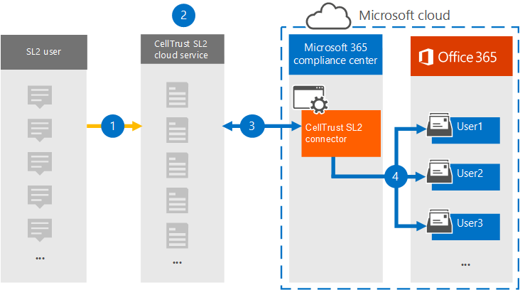

# Archivar datos de CellTrust SL2 a Microsoft 365 (versión preliminar)Archive data from CellTrust SL2 to Microsoft 365 (preview)

CellTrust SL2 captura datos de comunicaciones móviles e se integra con las tecnologías de archivado líderes para cumplir los requisitos de detección electrónica de normativas como FINRA, HIPAA, FOIA y TCPA.CellTrust SL2 captures mobile communications data and integrates with the leading archiving technologies to meet the electronic discovery requirements for regulations such as FINRA, HIPAA, FOIA, and TCPA. SL2 Data Connector importa elementos de comunicación móvil a Microsoft 365.The SL2 Data Connector imports mobile communication items to Microsoft 365. En este artículo se describe el proceso de integración de SL2 con Microsoft 365 mediante cellTrust SL2 Data Connector para el archivado.This article describes the process for integrating SL2 with Microsoft 365 by using the CellTrust SL2 Data Connector for archiving. Al completar este proceso se supone que se ha suscrito al servicio CellTrust SL2 y que está familiarizado con la arquitectura SL2.Completing this process assumes that you have subscribed to CellTrust SL2 service and are familiar with the SL2 architecture. Para obtener información acerca de SL2, vea <www.celltrust.com>.For information about SL2, see <www.celltrust.com>.

Después de importar datos a buzones de usuario en Microsoft 365, puede aplicar características de cumplimiento de Microsoft 365 como retención por juicio, exhibición de documentos electrónicos, directivas de retención de Microsoft 365 y cumplimiento de comunicaciones.After data is imported to user mailboxes in Microsoft 365, you can apply Microsoft 365 compliance features such as Litigation Hold, eDiscovery, Microsoft 365 retention policies, and communication compliance. El uso de CellTrust SL2 Data Connector para importar y archivar datos en Microsoft 365 puede ayudar a su organización a cumplir con las directivas gubernamentales y reglamentarias.Using the CellTrust SL2 Data Connector to import and archive data in Microsoft 365 can help your organization stay compliant with government and regulatory policies.

## Información general sobre el archivado con CellTrust SL2 Data ConnectorOverview of archiving with the CellTrust SL2 Data Connector

La plataforma SL2 de CellTrust captura datos de comunicación de varios orígenes.CellTrust's SL2 platform captures communication data from multiple sources. Los orígenes de datos sl2 son de persona a persona (P2P) o de aplicación a persona (A2P).SL2 data sources are either Person-to-Person (P2P) or Application-to-Person (A2P). El proceso descrito en este artículo solo pertenece a orígenes de datos P2P.The process described in this article pertains only to P2P data sources. Para todos los orígenes de datos P2P, al menos una parte de la colaboración es un usuario sl2 que está suscrito al servicio SL2.For all P2P data sources, at least one party in the collaboration is an SL2 user who is subscribed to the SL2 service. En la siguiente introducción se explica el proceso de uso de CellTrust SL2 Data Connector en Microsoft 365.The following overview explains the process of using the CellTrust SL2 Data Connector in Microsoft 365.

1. Los usuarios de SL2 envían y reciben datos desde y hacia los servicios SL2 en la Microsoft Azure nube.SL2 users send and receive data to and from SL2 services in the Microsoft Azure cloud.

2. Su organización tiene un dominio SL2 en el entorno de servicio en la nube sl2 de CellTrust.Your organization has an SL2 domain in CellTrust's SL2 Cloud Service environment. El dominio puede tener una o más unidades organizativas (UNIDADES organizativas).Your domain may have one or more organizational units (OUs). El servicio en la nube SL2 transfiere los datos a un área altamente segura en la plataforma Microsoft Azure, de modo que los datos no abandone nunca el Microsoft Azure web.The SL2 Cloud Service transfers your data to a highly secure area in the Microsoft Azure platform, so that your data never leaves the Microsoft Azure environment. Según el plan SL2 (Enterprise, SMB o Government), el dominio se hospeda en Microsoft Azure Global o Microsoft Azure Government.Depending on your SL2 plan (Enterprise, SMB, or Government), your domain is either hosted on Microsoft Azure Global or Microsoft Azure Government.

3. Después de crear CellTrust SL2 Data Connector, el dominio y las US (independientemente del plan SL2), comiencen a enviar datos a Microsoft 365.After you create the CellTrust SL2 Data Connector, your domain and OUs (regardless of your SL2 plan), begin sending data to Microsoft 365. La fuente de datos está estructurada para admitir informes basados en orígenes de datos, US o el dominio por sí mismo.The data feed is structured to support reporting based on data sources, OUs, or the domain by itself. Como resultado, la organización solo necesita un conector para alimentar todos los orígenes de datos para Microsoft 365.As a result, your organization needs only one connector to feed all your data sources to Microsoft 365.

4. El conector crea una carpeta debajo de cada usuario asignado con una licencia Office 365 adecuada titulada **CellTrust SL2**.The connector creates a folder under each mapped user with an appropriate Office 365 license titled **CellTrust SL2**. Esta asignación conecta un usuario de CellTrust SL2 a un buzón Office 365 mediante una dirección de correo electrónico.This mapping connects a CellTrust SL2 user to an Office 365 mailbox by using an email address. Si un identificador de usuario en CellTrust SL2 no coincide en Office 365, los datos del usuario no se archivarán.If a user ID in CellTrust SL2 has no match in Office 365, the user's data will not be archived.

## Antes de configurar un conectorBefore you set up a connector

- Compruebe que tiene un dominio en el entorno de servicio en la nube de CellTrust SL2.Verify that you have a domain in the CellTrust SL2 cloud service environment. Para obtener información adicional sobre cómo obtener un dominio SL2 de producción o prueba, [póngase en contacto con CellTrust](https://www.celltrust.com/contact-us/#form).For additional information on obtaining a production or trial SL2 domain, [Contact CellTrust](https://www.celltrust.com/contact-us/#form).

- Obtenga las credenciales para obtener acceso a la cuenta de administrador del dominio SL2.Obtain the credentials to access the administrator account for your SL2 domain.

- El usuario que crea el conector de datos de CellTrust SL2 en el paso 1 (y lo completa en el paso 3) debe estar asignado al rol De exportación de importación de buzones en Exchange Online.The user who creates the CellTrust SL2 data connector in Step 1 (and completes it in Step 3) must be assigned to the Mailbox Import Export role in Exchange Online. Este rol es necesario para agregar conectores en la **página Conectores de datos** de la Centro de cumplimiento de Microsoft 365.This role is required to add connectors on the **Data connectors** page in the Microsoft 365 compliance center. De forma predeterminada, este rol no se asigna a un grupo de roles en Exchange Online.By default, this role is not assigned to a role group in Exchange Online. Puede agregar el rol Exportación de importación de buzones al grupo de roles Administración de la organización en Exchange Online.You can add the Mailbox Import Export role to the Organization Management role group in Exchange Online. O bien, puede crear un grupo de roles, asignar el rol Importación de buzones de correo Exportar y, a continuación, agregar los usuarios adecuados como miembros.Or you can create a role group, assign the Mailbox Import Export role, and then add the appropriate users as members. Para obtener más información, vea  las secciones [Crear](/Exchange/permissions-exo/role-groups#create-role-groups) grupos de roles o Modificar grupos de roles en el artículo "Administrar grupos de roles en Exchange Online".For more information, see the [Create role groups](/Exchange/permissions-exo/role-groups#create-role-groups) or [Modify role groups](/Exchange/permissions-exo/role-groups#modify-role-groups) sections in the article "Manage role groups in Exchange Online".

## Paso 1: Crear un conector CellTrust SL2Step 1: Create a CellTrust SL2 connector

El primer paso es crear un conector de datos en el Centro de cumplimiento de Microsoft 365.The first step is to create a data connector in the Microsoft 365 compliance center.

1. Vaya a <https://compliance.microsoft.com> y haga clic en **Conectores de datos** en el panel de navegación izquierdo.Go to <https://compliance.microsoft.com> and click **Data connectors** on the left navigation pane.

2. En la **pestaña Información** general, haga clic **en Filtrar** y seleccione **Por CellTrust** y, a continuación, aplique el filtro.On the **Overview** tab, click **Filter** and select **By CellTrust**, and then apply the filter.

   

3. Haga **clic en CellTrust SL2 (versión preliminar).**Click **CellTrust SL2 (preview**).

4. En la **página de descripción del producto CellTrust SL2 (versión preliminar),** haga clic en Agregar **conector**.On the **CellTrust SL2 (preview**) product description page, click **Add connector**.

5. En la **página Términos de** servicio, haga clic **en Aceptar**.On the **Terms of service** page, click **Accept**.

6. Escriba un nombre único que identifique el conector y, a continuación, haga clic en **Siguiente**.Enter a unique name that identifies the connector and then click **Next**. El nombre que escriba identificará el conector en la **página Conectores de** datos después de crearlo.The name you enter will identify the connector on the **Data connectors** page after you create it.

7. En la página **Iniciar sesión en su cuenta de CellTrust,** haga clic en Iniciar sesión en **CellTrust**.On the **Sign in to your CellTrust account** page, click **Sign into CellTrust**. Se le redirigirá a **CellTrust Portal para Microsoft 365** en una nueva ventana del explorador.You'll be redirected to the **CellTrust Portal for Microsoft 365** in a new browser window.

## Paso 2: Seleccionar los dominios o US que se archivaránStep 2: Select the domains or OUs to archive

El siguiente paso es iniciar sesión en una cuenta de administrador para su dominio cellTrust SL2 y seleccionar los dominios y las US que se archivarán en Microsoft 365.The next step is to sign into an administrator account for your CellTrust SL2 domain and select the domains and OUs to archive in Microsoft 365.

1. En la página CellTrust **Microsoft 365 Connector,** seleccione el entorno en el servicio en la nube sl2 para mostrar una página de inicio de sesión.On the CellTrust **Microsoft 365 Connector** page, select your environment in the SL2 cloud service to display a sign-in page.

   Normalmente, debería ver una opción que represente el entorno.Typically, you should see one option representing your environment. Sin embargo, si tiene dominios en más de un entorno, verá opciones para cada entorno.However, if you have domains in more than one environment, you will see options for each environment. Después de realizar una selección, se le redirigirá a la página de inicio de sesión de SL2.After you make a selection, you'll be redirected to the SL2 login page.

2. Inicie sesión con las credenciales de la cuenta de administrador de dominio o ou.Sign in with your Domain or OU Administrator account credentials.

   Si inicia sesión como administrador de dominio SL2, verá el nombre de su dominio y las us en ese dominio.If you sign in as an SL2 domain administrator, you will see the name of your domain and the OUs in that domain. Si no tiene us, solo verá el nombre de su dominio.If you do not have OUs, you only see the name of your domain. Si inicia sesión como administrador de unidad organizativa, solo verá el nombre de la unidad organizativa.If you log in as OU Administrator, you only see the name of your OU.

3. Habilite las unidades de negocio que desea archivar.Enable the business units you wish to archive. Al seleccionar el dominio no se seleccionarán automáticamente las us.Selecting the domain will not automatically select the OUs. Debe habilitar cada unidad organizativa por separado para archivarla.You must enable each OU separately to archive it.

   

4. Cuando haya terminado con las selecciones, cierre la ventana del explorador y vuelva a la página del asistente en Centro de cumplimiento de Microsoft 365.When you're finished with your selections, close the browser window and return to the wizard page in Microsoft 365 compliance center. Después de unos segundos, el asistente avanza automáticamente al siguiente paso de asignación de usuarios.After a few seconds, the wizard automatically advances to the next step of mapping users.

## Paso 3: Asignar usuarios y completar la configuración del conectorStep 3: Map users and complete the connector setup

El último paso es asignar usuarios y completar la configuración del conector en el Centro de cumplimiento de Microsoft 365.The last step is to map users and complete the connector setup in the Microsoft 365 compliance center.

1. En la **página Asignación de** usuario, seleccione Habilitar la asignación automática de usuarios si la dirección de correo electrónico de los usuarios es la misma en SL2 y Microsoft 365. On the **User mapping** page, select **Enable automatic user mapping** if the email address for users is the same in both SL2 and  Microsoft 365. De lo contrario, debe cargar manualmente las direcciones de correo electrónico del usuario cargando un archivo CSV que asigna la dirección SL2 de los usuarios a su Microsoft 365 usuario.Otherwise, you should manually user email addresses by uploading a CSV file that maps users' SL2 address to their Microsoft 365 address.

2. Haga **clic en Siguiente,** revise la configuración y, a continuación, haga clic **en Finalizar** para crear el conector.Click **Next**, review your settings, and then click **Finish** to create the connector.

   El nuevo conector se agrega a la lista de la **página Conectores de** datos.The new connector is added to the list on the **Data connectors** page.

## Obtener ayuda de CellTrustGet help from CellTrust

Consulte la página de soporte al cliente de [CellTrust](https://www.celltrust.com/contact-us/#support) para obtener más información sobre cómo ponerse en contacto con CellTrust para obtener ayuda con la configuración de un conector de datos de CellTrust SL2.See the [CellTrust Customer Support page](https://www.celltrust.com/contact-us/#support) for details about contacting CellTrust for help with setting up a CellTrust SL2 data connector.

## Más informaciónMore information

- Un administrador de dominio puede configurar un conector para el dominio o cualquier UO de ese dominio.A domain administrator can set up a connector for the domain or any OUs in that domain. Si usa la cuenta de administrador de unidad organizativa, solo puede configurar un conector para esa OU específica.If you use the OU Administrator account, you can only set up a connector for that specific OU.

- Para completar correctamente los pasos anteriores, se le debe asignar una Microsoft 365 E5 licencia y tener los derechos Microsoft Office administradores adecuados.To successfully complete the steps above, you must be assigned a Microsoft 365 E5 license and have the proper Microsoft Office admin rights.

- Para probar el nuevo conector, envíe un mensaje de texto con la aplicación móvil SL2 o desde el portal sl2.To test the new connector, send a text message using your SL2 mobile app or from your SL2 portal. Vaya a su buzón Microsoft 365 y abra la **carpeta CellTrust SL2** en la Bandeja de entrada.Go to your Microsoft 365 mailbox and open the **CellTrust SL2** folder in your Inbox. Los mensajes de texto pueden tardar unos minutos en aparecer en el buzón.It may take a few minutes for the text messages to show up in your mailbox.

- Muchas leyes y reglamentos requieren que la comunicación electrónica se conserve de forma que, cuando se solicite, se pueda producir como prueba.Many laws and regulations require electronic communication to be preserved in such a way that, when requested, it can be produced as evidence. La detección electrónica (eDiscovery) se usa para cumplir con la producción de comunicaciones electrónicas.Electronic Discovery (eDiscovery) is used to comply with the production of electronic communication. Enterprise Las soluciones de archivado de información (EIA) están diseñadas para realizar exhibición de documentos electrónicos y proporcionan características como la administración de directivas de retención, la clasificación de datos y la supervisión de contenido.Enterprise Information Archiving (EIA) solutions are designed to perform eDiscovery, and provide features such as retention policy management, data classification, and content supervision. Microsoft 365 ofrece una solución de retención a largo plazo para el cumplimiento de los reglamentos y estándares que afectan a su organización.Microsoft 365 offers a long-term retention solution for compliance with the regulations and standards that affect your organization.

- El término *archivado tal* como se usa en este documento hace referencia al archivado en el contexto de uso dentro de una Enterprise de archivado de información (EIA).The term *archiving* as used in this document refers to archiving in the context of use within an Enterprise Information Archiving (EIA) solution. Las soluciones EIA tienen características de exhibición de documentos electrónicos que producen documentos para procedimientos legales, litigios, auditorías e investigaciones.EIA solutions have eDiscovery features that produce documents for legal proceedings, litigation, audits, and investigations. El archivado en el contexto de copia de seguridad y restauración que se usa para la recuperación ante desastres y la continuidad empresarial no es el uso previsto del término dentro de este documento.Archiving in the context of backup and restore used for disaster recovery and business continuity isn't the intended use of the term within this document.
