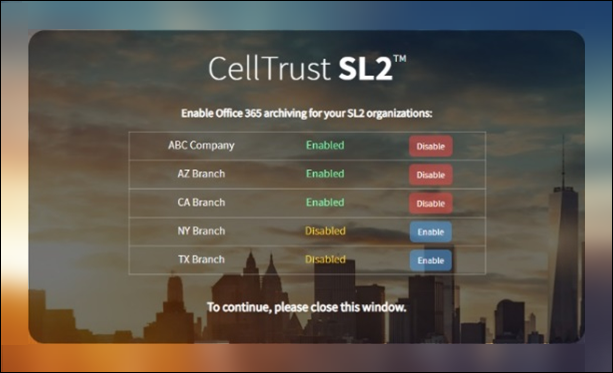

# Archivar datos de CellTrust SL2 en Microsoft 365

[!include[Purview banner](../includes/purview-rebrand-banner.md)]

CellTrust SL2 captura datos de comunicaciones móviles e se integra con las tecnologías de archivado líderes para cumplir los requisitos de detección electrónica de normativas como FINRA, HIPAA, FOIA y TCPA. El conector de datos SL2 importa elementos de comunicación móviles a Microsoft 365. En este artículo se describe el proceso de integración de SL2 con Microsoft 365 mediante CellTrust SL2 Data Connector para el archivado. Al completar este proceso, se supone que se ha suscrito al servicio CellTrust SL2 y que está familiarizado con la arquitectura SL2. Para obtener información sobre CellTrust SL2, vea <https://www.celltrust.com>.

Después de importar datos a buzones de usuario en Microsoft 365, puede aplicar características de Microsoft Purview como suspensión por juicio, exhibición de documentos electrónicos, directivas de retención de Microsoft 365 y cumplimiento de comunicaciones. El uso de CellTrust SL2 Data Connector para importar y archivar datos en Microsoft 365 puede ayudar a su organización a cumplir las directivas gubernamentales y normativas.

## Introducción al archivado con CellTrust SL2 Data Connector

La plataforma SL2 de CellTrust captura datos de comunicación de varios orígenes. Los orígenes de datos SL2 son de persona a persona (P2P) o de aplicación a persona (A2P). El proceso descrito en este artículo solo pertenece a orígenes de datos P2P. Para todos los orígenes de datos P2P, al menos una parte de la colaboración es un usuario de SL2 que está suscrito al servicio SL2. En la información general siguiente se explica el proceso de uso del conector de datos CellTrust SL2 en Microsoft 365.

1. Los usuarios de SL2 envían y reciben datos hacia y desde los servicios SL2 en Microsoft Azure.

2. Su organización tiene un dominio SL2 en el entorno de Servicio en la nube SL2 de CellTrust. El dominio puede tener una o varias unidades organizativas (OU). El servicio en la nube SL2 transfiere los datos a un área altamente segura en la plataforma de Microsoft Azure, de modo que los datos nunca salgan del entorno de Microsoft Azure. Según el plan SL2 (Enterprise, SMB o Government), el dominio se hospeda en Microsoft Azure Global o Microsoft Azure Government.

3. Después de crear CellTrust SL2 Data Connector, el dominio y las unidades organizativas (independientemente de su plan SL2), empiecen a enviar datos a Microsoft 365. La fuente de distribución de datos está estructurada para admitir informes basados en orígenes de datos, unidades organizativas o el dominio por sí mismo. Como resultado, la organización solo necesita un conector para alimentar todos los orígenes de datos para Microsoft 365.

4. El conector crea una carpeta bajo cada usuario asignado con una licencia de Office 365 adecuada titulada **CellTrust SL2**. Esta asignación conecta un usuario de CellTrust SL2 a un buzón de Office 365 mediante una dirección de correo electrónico. Si un identificador de usuario de CellTrust SL2 no tiene ninguna coincidencia en Office 365, los datos del usuario no se archivarán.

## Antes de configurar un conector

- Compruebe que tiene un dominio en el entorno de servicio en la nube CellTrust SL2. Para obtener información adicional sobre la obtención de un dominio SL2 de producción o prueba, [póngase en contacto con CellTrust](https://www.celltrust.com/contact-us/#form).

- Obtenga las credenciales para acceder a la cuenta de administrador del dominio SL2.

- Al usuario que crea el conector de datos CellTrust SL2 en el paso 1 (y lo completa en el paso 3) se le debe asignar el rol administrador del conector de datos. Este rol es necesario para agregar conectores en la página **Conectores de datos** del portal de cumplimiento de Microsoft Purview. Este rol se agrega de forma predeterminada a varios grupos de roles. Para obtener una lista de estos grupos de roles, consulte la sección "Roles en los centros de seguridad y cumplimiento" de [Permisos en el Centro de cumplimiento de & seguridad](../security/office-365-security/permissions-in-the-security-and-compliance-center.md#roles-in-the-security--compliance-center). Como alternativa, un administrador de su organización puede crear un grupo de roles personalizado, asignar el rol Administrador del conector de datos y, a continuación, agregar los usuarios adecuados como miembros. Para obtener instrucciones, consulte la sección "Crear un grupo de roles personalizado" en [Permisos en el portal de cumplimiento de Microsoft Purview](microsoft-365-compliance-center-permissions.md#create-a-custom-role-group).

- Este conector de datos CellTrust está disponible en entornos de GCC en la nube de Microsoft 365 administración pública de EE. UU. Las aplicaciones y servicios de terceros pueden implicar almacenar, transmitir y procesar los datos de clientes de su organización en sistemas de terceros que están fuera de la infraestructura de Microsoft 365 y, por tanto, no están cubiertos por los compromisos de protección de datos y Microsoft Purview. Microsoft no hace ninguna representación de que el uso de este producto para conectarse a aplicaciones de terceros implica que esas aplicaciones de terceros son compatibles con FEDRAMP.

## Paso 1: Crear un conector CellTrust SL2

El primer paso consiste en crear un conector de datos en el portal de cumplimiento.

1. Vaya a <https://compliance.microsoft.com> y haga clic en **Conectores de datos** en el panel de navegación izquierdo.

2. En la pestaña **Información general** , haga clic en **Filtrar** y seleccione **Por CellTrust** y, a continuación, aplique el filtro.

   

3. Haga clic en **CellTrust SL2 (versión preliminar).**

4. En la página de descripción del producto **CellTrust SL2 (versión preliminar),** haga clic en **Agregar conector**.

5. En la página **Términos de servicio** , haga clic en **Aceptar**.

6. Escriba un nombre único que identifique el conector y, a continuación, haga clic en **Siguiente**. El nombre que escriba identificará el conector en la página **Conectores de datos** después de crearlo.

7. En la página **Iniciar sesión en su cuenta de CellTrust** , haga clic **en Iniciar sesión en CellTrust**. Se le redirigirá a **CellTrust Portal para Microsoft 365** en una nueva ventana del explorador.

## Paso 2: Seleccionar los dominios o unidades organizativas que se van a archivar

El siguiente paso consiste en iniciar sesión en una cuenta de administrador para el dominio CellTrust SL2 y seleccionar los dominios y las unidades organizativas que se van a archivar en Microsoft 365.

1. En la página CellTrust **Microsoft 365 Connector**, seleccione su entorno en el servicio en la nube SL2 para mostrar una página de inicio de sesión.

   Normalmente, debería ver una opción que represente el entorno. Sin embargo, si tiene dominios en más de un entorno, verá opciones para cada entorno. Después de realizar una selección, se le redirigirá a la página de inicio de sesión de SL2.

2. Inicie sesión con las credenciales de su cuenta de administrador de dominio o unidad organizativa.

   Si inicia sesión como administrador de dominio SL2, verá el nombre del dominio y las unidades organizativas en ese dominio. Si no tiene unidades organizativas, solo verá el nombre del dominio. Si inicia sesión como administrador de la unidad organizativa, solo verá el nombre de la unidad organizativa.

3. Habilite las unidades de negocio que desea archivar. Al seleccionar el dominio, no se seleccionarán automáticamente las unidades organizativas. Debe habilitar cada unidad organizativa por separado para archivarla.

   

4. Cuando haya terminado con las selecciones, cierre la ventana del explorador y vuelva a la página del asistente en el portal de cumplimiento. Después de unos segundos, el asistente avanza automáticamente al siguiente paso de asignación de usuarios.

## Paso 3: Asignar usuarios y completar la configuración del conector

El último paso es asignar usuarios y completar la configuración del conector en el portal de cumplimiento.

1. En la página **Asignación de** usuarios, seleccione **Habilitar asignación automática de usuarios** si la dirección de correo electrónico de los usuarios es la misma en SL2 y Microsoft 365. De lo contrario, debe cargar manualmente las direcciones de correo electrónico del usuario mediante la carga de un archivo CSV que asigne la dirección SL2 de los usuarios a su dirección de Microsoft 365.

2. Haga clic en **Siguiente**, revise la configuración y, a continuación, haga clic en **Finalizar** para crear el conector.

   El nuevo conector se agrega a la lista de la página **Conectores de datos** .

## Obtener ayuda de CellTrust

Consulte la [página de soporte al cliente de CellTrust](https://www.celltrust.com/contact-us/#support) para obtener más información sobre cómo ponerse en contacto con CellTrust para obtener ayuda con la configuración de un conector de datos CellTrust SL2.

## Más información

- Un administrador de dominio puede configurar un conector para el dominio o cualquier unidades organizativas de ese dominio. Si usa la cuenta de administrador de unidad organizativa, solo puede configurar un conector para esa unidad organizativa específica.

- Para completar correctamente los pasos anteriores, se le debe asignar una licencia de Microsoft 365 E5 y tener los derechos de administrador de Microsoft Office adecuados.

- Para probar el nuevo conector, envíe un mensaje de texto mediante la aplicación móvil SL2 o desde el portal de SL2. Vaya al buzón de Microsoft 365 y abra la carpeta **CellTrust SL2** en la Bandeja de entrada. Los mensajes de texto pueden tardar unos minutos en aparecer en el buzón.

- Muchas leyes y reglamentos requieren que la comunicación electrónica se conserve de forma que, cuando se solicite, se pueda producir como evidencia. La detección electrónica (eDiscovery) se usa para cumplir con la producción de comunicaciones electrónicas. Enterprise soluciones de archivado de información (EIA) están diseñadas para realizar eDiscovery y proporcionar características como la administración de directivas de retención, la clasificación de datos y la supervisión de contenido. Microsoft 365 ofrece una solución de retención a largo plazo para cumplir con las regulaciones y estándares que afectan a su organización.

- El término *archivado* tal como se usa en este documento hace referencia al archivado en el contexto de uso dentro de una solución de archivado de información de Enterprise (EIA). Las soluciones de EIA tienen características de exhibición de documentos electrónicos que generan documentos para procedimientos legales, litigios, auditorías e investigaciones. El archivado en el contexto de la copia de seguridad y restauración que se usa para la recuperación ante desastres y la continuidad empresarial no es el uso previsto del término en este documento.
