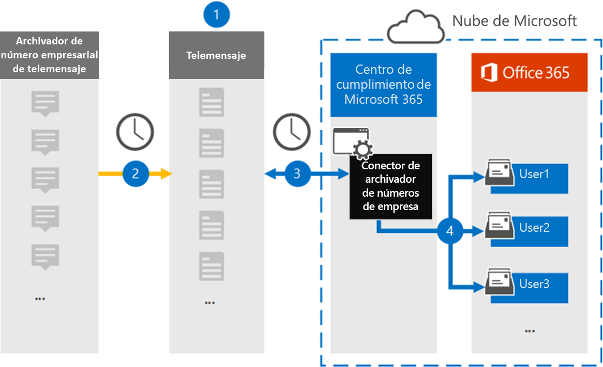

# Configurar un conector para archivar datos de número de empresa

Use un conector de teleservicio en el centro de cumplimiento de Microsoft 365 para importar y archivar mensajes de servicio de mensajería breve (SMS) y servicio de mensajería multimedia (MMS), mensajes de chat, grabaciones de llamadas de voz y registros de llamadas de voz del Archiver número de empresa. Una vez que haya instalado y configurado un conector, se conectará a la cuenta de los mensajes de correo de su organización una vez al día y importará los datos de comunicación móvil de los empleados mediante el Archiver de números empresariales de Telemensaje a los buzones de Microsoft 365.

Una vez que se almacenan los datos del conector del número de empresa de Telemensaje en los buzones de usuario, puede aplicar características de cumplimiento de Microsoft 365, como la retención por juicio, la búsqueda de contenido, el archivado In-Place, la auditoría, el cumplimiento de comunicaciones y las directivas de retención de Microsoft 365 a datos de número de la empresa. Por ejemplo, puede buscar el SMS, MMS y la llamada de voz del Archiver de número empresarial de Telemensaje mediante la búsqueda de contenido o asociar el buzón que contiene los datos del conector de Archiver de número empresarial con un custodio en un caso de eDiscovery avanzado. El uso de un conector de Archiver de número empresarial para importar y archivar datos en Microsoft 365 puede ayudar a su organización a cumplir las directivas gubernamentales y regulatorias.

## Información general sobre el archivado de datos de número de empresa

En la siguiente introducción se explica el proceso de uso de un conector para archivar datos de la red empresarial en Microsoft 365.

1. La organización trabaja con Telemensaje para configurar un conector de Archiver de número empresarial. Para obtener más información, consulte [aquí](https://www.telemessage.com/office365-activation-for-enterprise-number-archiver/).

2. El conector de Archiver de número empresarial que se crea en el centro de cumplimiento de Microsoft 365 se conecta al sitio de Telemensaje cada día y transfiere los mensajes de correo electrónico de las 24 horas anteriores a un área de almacenamiento seguro de Azure en la nube de Microsoft.

3. El conector importa los elementos de comunicación móvil al buzón de un usuario específico. Se crea una nueva carpeta llamada "número de empresa" en el buzón de correo del usuario específico y los elementos se importan a ella. El conector se asigna mediante el valor de la propiedad de la *dirección de correo electrónico del usuario* . Cada mensaje de correo electrónico contiene esta propiedad, que se rellena con la dirección de correo electrónico de cada participante del mensaje de correo electrónico. Además de la asignación automática de usuarios mediante el valor de la propiedad de la *dirección de correo electrónico del usuario* , también puede definir una asignación personalizada mediante la carga de un archivo de asignación CSV. Este archivo de asignación debe contener el número de teléfono móvil del usuario y la dirección de buzón de correo de Microsoft 365 correspondiente a cada usuario. Si habilita la asignación automática de usuarios y proporciona una asignación personalizada, para cada elemento de correo electrónico el conector examinará primero el archivo de asignación personalizado. Si no encuentra un usuario válido de Microsoft 365 que corresponda a un número de móvil de un usuario, el conector usará la propiedad de dirección de correo electrónico del usuario del elemento de correo electrónico. Si el conector no encuentra un usuario válido de Microsoft 365 en el archivo de asignación personalizado o en la propiedad de *dirección de correo electrónico del usuario* del elemento de correo electrónico, no se importará el elemento.

## Antes de empezar

Algunos de los pasos de implementación necesarios para archivar datos de número de empresa son externos a Microsoft 365 y deben completarse antes de poder crear el conector en el centro de cumplimiento.

- Solicite el [servicio de número de empresa de Telemensaje](https://www.telemessage.com/mobile-archiver/order-mobile-archiver-for-o365) y obtenga una cuenta de administración válida para su organización. Tendrá que iniciar sesión en esta cuenta cuando cree el conector en el centro de cumplimiento.

- Registre todos los usuarios que requieran el archivado de red SMS/MMS número Enterprise en la cuenta de Telemensaje. Al registrar usuarios, asegúrese de usar la misma dirección de correo electrónico que se usa para su cuenta de Microsoft 365.

- Instale y active la aplicación de Archiver de número de Telemensaje en los teléfonos móviles de sus empleados.

- El usuario que crea un conector de Archiver de número empresarial debe tener asignado el rol importación y exportación de buzones de correo en Exchange Online. Esto es necesario para agregar conectores en la página **conectores de datos** en el centro de cumplimiento de Microsoft 365. Este rol no está asignado a ningún grupo de roles de Exchange Online de forma predeterminada. Puede Agregar el rol importación y exportación de buzones al grupo de funciones de administración de la organización en Exchange Online. O bien, puede crear un grupo de roles, asignar el rol de importación y exportación de buzones de correo y, a continuación, agregar los usuarios adecuados como miembros. Para obtener más información, vea las secciones [crear grupos](https://docs.microsoft.com/Exchange/permissions-exo/role-groups#create-role-groups) de roles o [modificar grupos de roles](https://docs.microsoft.com/Exchange/permissions-exo/role-groups#modify-role-groups) en el artículo sobre la administración de grupos de roles en Exchange Online.

## Crear un conector de Archiver de número empresarial

Una vez que haya completado los requisitos previos descritos en la sección anterior, puede crear un conector de Enterprise Numbers Connector en el centro de cumplimiento de Microsoft 365. El conector usa la información que proporciona para conectarse al sitio de los mensajes de Telemensaje y transferir los mensajes SMS, MMS y de llamada de voz a los correspondientes cuadros de buzón de usuario de Microsoft 365.

1. Vaya a [https://compliance.microsoft.com](https://compliance.microsoft.com/) y, a continuación, haga clic en **Data Connectors** \> **Enterprise Number Archiver**.

2. En la página Descripción de producto de **Enterprise Number Archiver** , haga clic en **Agregar conector** .

3. En la página **condiciones de servicio** , haga clic en **Aceptar**.

4. En la página **iniciar sesión en Telemensaje** , en el paso 3, escriba la información necesaria en los siguientes cuadros y, a continuación, haga clic en **siguiente**.

   - **Nombre de usuario:** El nombre de usuario de Telemensaje.

   - **Contraseña:** La contraseña de Telemensaje.

5. Una vez creado el conector, puede cerrar la ventana emergente y pasar a la página siguiente.

6. En la página **asignación de usuarios** , habilite la asignación automática de usuarios. Para habilitar la asignación personalizada, cargue un archivo CSV que contenga la información de asignación de usuarios y, a continuación, haga clic en **siguiente**.

7. Revise la configuración y, a continuación, haga clic en **Finalizar** para crear el conector.

8. Vaya a la ficha conectores en la página **conectores de datos** para ver el progreso del proceso de importación del nuevo conector.

## Problemas conocidos

- En este momento, no se admite la importación de datos adjuntos o elementos de más de 10 MB. La compatibilidad con elementos más grandes estará disponible en una fecha posterior.
