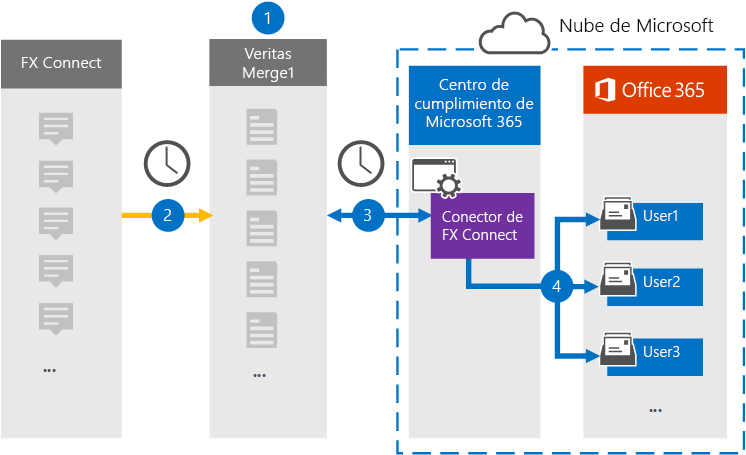

# Configurar un conector para archivar datos de Connect FX (versión preliminar)Set up a connector to archive FX Connect data (preview)

Use un conector de Globanet en el centro de cumplimiento de Microsoft 365 para importar y archivar datos desde la plataforma de colaboración de FX Connect a los buzones de usuario de la organización 365 de Microsoft.Use a Globanet connector in the Microsoft 365 compliance center to import and archive data from the FX Connect collaboration platform to user mailboxes in your Microsoft 365 organization. Globanet proporciona un conector [FX Connect](https://globanet.com/fx-connect/) que está configurado para capturar los elementos de Connect de FX e importar dichos elementos a Microsoft 365.Globanet provides an [FX Connect](https://globanet.com/fx-connect/) connector that is configured to capture FX Connect items and import those items to Microsoft 365. El conector convierte el contenido de FX Connect, como transacciones, mensajes y otros detalles de la cuenta de conexión de FX de su organización, a un formato de mensaje de correo electrónico y, a continuación, importa esos elementos al buzón del usuario en Microsoft 365.The connector converts the content from FX Connect, such as  trades, messages, and other details from your organization's FX Connect account, to an email message format and then imports those items to the user's mailbox in Microsoft 365.

Después de que los datos de FX Connect se almacenan en buzones de usuario, puede aplicar características de cumplimiento de Microsoft 365, como retención por juicio, eDiscovery, directivas de retención y etiquetas de retención y cumplimiento de la comunicación.After FX Connect data is stored in user mailboxes, you can apply Microsoft 365 compliance features such as Litigation Hold, eDiscovery, retention policies and retention labels, and communication compliance. El uso de un conector FX Connect para importar y archivar datos en Microsoft 365 puede ayudar a su organización a cumplir las directivas gubernamentales y regulatorias.Using a FX Connect connector to import and archive data in Microsoft 365 can help your organization stay compliant with government and regulatory policies.

## Información general sobre el archivado de datos de FX ConnectOverview of archiving FX Connect data

En la siguiente introducción se explica el proceso de uso de un conector para archivar la información de conexión de FX en Microsoft 365.The following overview explains the process of using a connector to archive the FX Connect information in Microsoft 365.

1. La organización trabaja con FX Connect para configurar y configurar un sitio FX Connect.Your organization works with FX Connect to set up and configure an FX Connect site.

2. Una vez cada 24 horas, los elementos de las cuentas de FX Connect se copian en el sitio de Merge1 de Globanet.Once every 24 hours, items from FX Connect accounts are copied to the Globanet Merge1 site. El conector también convierte los elementos de conexión FX a un formato de mensaje de correo electrónico.The connector also converts the FX Connect items to an email message format.

3. El conector de FX Connect que crea en el centro de cumplimiento de Microsoft 365, se conecta al sitio de Globanet Merge1 todos los días y transfiere los elementos de Connect de FX a una ubicación de almacenamiento seguro de Azure en la nube de Microsoft.The FX Connect connector that you create in the Microsoft 365 compliance center, connects to the Globanet Merge1 site every day and transfers the FX Connect items to a secure Azure Storage location in the Microsoft cloud.

4. El conector importa elementos a los buzones de usuarios específicos mediante el valor de la propiedad *email* de la asignación automática de usuarios, como se describe en el [paso 3](#step-3-map-users-and-complete-the-connector-setup).The connector imports items to the mailboxes of specific users by using the value of the *Email* property of the automatic user mapping as described in [Step 3](#step-3-map-users-and-complete-the-connector-setup). Se crea una subcarpeta en la carpeta Bandeja de entrada llamada **FX Connect** en los buzones de usuario y los elementos se importan a esa carpeta.A subfolder in the Inbox folder named **FX Connect** is created in the user mailboxes, and the items are imported to that folder. El conector lo hace mediante el valor de la propiedad *email* .The connector does this by using the value of the *Email* property. Cada elemento de FX Connect contiene esta propiedad, que se rellena con la dirección de correo electrónico de cada participante del elemento.Every FX Connect item contains this property, which is populated with the email address of every participant of the item.

## Antes de empezarBefore you begin

- Cree una cuenta de Globanet Merge1 para Microsoft Connectors.Create a Globanet Merge1 account for Microsoft connectors.  Para ello, póngase en contacto con el [soporte técnico de Globanet](https://globanet.com/ms-connectors-contact).To do this, contact [Globanet Customer Support](https://globanet.com/ms-connectors-contact). Debe iniciar sesión en esta cuenta cuando cree el conector en el paso 1.You need to sign into this account when you create the connector in Step 1.

- El usuario que crea el conector de FX Connect en el paso 1 (y lo completa en el paso 3) debe asignarse a la función importación y exportación de buzones de correo en Exchange Online.The user who creates the FX Connect connector in Step 1 (and completes it in Step 3) must be assigned to the Mailbox Import Export role in Exchange Online. Este rol es necesario para agregar conectores en la página **conectores de datos** del centro de cumplimiento de Microsoft 365.This role is required to add connectors on the **Data connectors** page in the Microsoft 365 compliance center. De forma predeterminada, este rol no está asignado a ningún grupo de roles en Exchange Online.By default, this role is not assigned to any role group in Exchange Online. Puede Agregar el rol importación y exportación de buzones al grupo de funciones de administración de la organización en Exchange Online.You can add the Mailbox Import Export role to the Organization Management role group in Exchange Online. O bien, puede crear un grupo de roles, asignar el rol de importación y exportación de buzones de correo y, a continuación, agregar los usuarios adecuados como miembros.Or you can create a role group, assign the Mailbox Import Export role, and then add the appropriate users as members. Para obtener más información, vea las secciones [crear grupos](https://docs.microsoft.com/Exchange/permissions-exo/role-groups#create-role-groups) de roles o [modificar grupos de roles](https://docs.microsoft.com/Exchange/permissions-exo/role-groups#modify-role-groups) en el artículo sobre la administración de grupos de roles en Exchange Online.For more information, see the [Create role groups](https://docs.microsoft.com/Exchange/permissions-exo/role-groups#create-role-groups) or [Modify role groups](https://docs.microsoft.com/Exchange/permissions-exo/role-groups#modify-role-groups) sections in the article "Manage role groups in Exchange Online".

## Paso 1: configurar el conector de Connect FXStep 1: Set up the FX Connect connector

El primer paso es obtener acceso a la página **conectores de datos** en el centro de cumplimiento de Microsoft 365 y crear un conector para los datos de Connect FX.The first step is to access to the **Data Connectors** page in the Microsoft 365 compliance center and create a connector for FX Connect data.

1. Vaya a [https://compliance.microsoft.com](https://compliance.microsoft.com/) y, a continuación, haga clic en **conectores de datos**  >  **FX Connect**.Go to [https://compliance.microsoft.com](https://compliance.microsoft.com/) and then click **Data connectors** > **FX Connect**.

2. En la página de Descripción del producto **FX Connect** , haga clic en **Agregar conector**.On the **FX Connect** product description page, click **Add connector**.

3. En la página **condiciones de servicio** , haga clic en **Aceptar**.On the **Terms of service** page, click **Accept**.

4. Escriba un nombre único que identifique el conector y, a continuación, haga clic en **siguiente**.Enter a unique name that identifies the connector, and then click **Next**.

5. Inicie sesión en su cuenta de Merge1 para configurar el conector.Sign in to your Merge1 account to configure the connector.

## Paso 2: configurar el conector de FX Connect en el sitio de Merge1 de GlobanetStep 2: Configure the FX Connect connector on the Globanet Merge1 site

El segundo paso consiste en configurar el conector de Connect FX en el sitio Merge1.The second step is to configure the FX Connect connector on the Merge1 site. Para obtener información acerca de cómo configurar el conector de Connect FX, consulte la [Guía del usuario de conectores de terceros de Merge1](https://docs.ms.merge1.globanetportal.com/Merge1%20Third-Party%20Connectors%20FX%20Connect%20User%20Guide%20.pdf).For information about how to configure the FX Connect connector, see [Merge1 Third-Party Connectors User Guide](https://docs.ms.merge1.globanetportal.com/Merge1%20Third-Party%20Connectors%20FX%20Connect%20User%20Guide%20.pdf).

Después de hacer clic en **guardar & finalizar**, se le redirigirá al centro de cumplimiento de Microsoft 365, a la página **asignación de usuarios** del Asistente para el conector.After you click **Save & Finish**, you are directed back to the Microsoft 365 compliance center, to the **User mapping** page in the connector wizard.

## Paso 3: asignar usuarios y completar la configuración del conectorStep 3: Map users and complete the connector setup

Para asignar usuarios y completar la configuración del conector en el centro de cumplimiento de Microsoft 365, siga estos pasos:To map users and complete the connector setup in the Microsoft 365 compliance center, follow these steps:

1. En la página **asignar usuarios de FX Connect a usuarios de Microsoft 365** , habilite la asignación automática de usuarios.On the **Map FX Connect users to Microsoft 365 users** page, enable automatic user mapping. Los elementos de conexión FX incluyen una propiedad denominada *email*, que contiene las direcciones de correo electrónico de los usuarios de la organización.The FX Connect items include a property called *Email*, which contains email addresses for users in your organization. Si el conector puede asociar esta dirección con un usuario de Microsoft 365, los elementos se importan al buzón de correo del usuario.If the connector can associate this address with a Microsoft 365 user, the items are imported to that user’s mailbox.

2. En la página **consentimiento del administrador** , haga clic en el botón **proporcionar consentimiento** .On the **Admin Consent** page, click the **Provide Consent** button. Se le redirigirá al sitio de Microsoft.You will be redirected to the Microsoft site. Haga clic en **Aceptar** para proporcionar el consentimiento.Click **Accept** to provide the consent.

   La organización debe permitir que el servicio de importación de Office 365 obtenga acceso a los datos de buzones de la organización.Your organization must consent to allow the Office 365 Import service to access mailbox data in your organization. Para proporcionar el consentimiento del administrador, debe haber iniciado sesión con las credenciales de un administrador global de Microsoft 365 y aceptar la solicitud de consentimiento.To provide admin consent, you must be signed in with the credentials of a Microsoft 365 global admin, and then accept the consent request. Si no ha iniciado sesión como administrador global, puede ir a [esta página](https://login.microsoftonline.com/common/oauth2/authorize?client_id=570d0bec-d001-4c4e-985e-3ab17fdc3073&response_type=code&redirect_uri=https://portal.azure.com/&nonce=1234&prompt=admin_consent) e iniciar sesión con las credenciales de administrador global para aceptar la solicitud.If you aren't signed in as a global admin, you can go to [this page](https://login.microsoftonline.com/common/oauth2/authorize?client_id=570d0bec-d001-4c4e-985e-3ab17fdc3073&response_type=code&redirect_uri=https://portal.azure.com/&nonce=1234&prompt=admin_consent) and sign in using global admin credentials to accept the request.

3. Haga clic en **siguiente**, revise la configuración y, después, vaya a la página **conectores de datos** para ver el progreso del proceso de importación del nuevo conector.Click **Next**, review your settings, and then go to the **Data connectors** page to see the progress of the import process for the new connector.

## Paso 4: supervisar el conector de Connect FXStep 4: Monitor the FX Connect connector

Después de crear el conector de conexión de FX, puede ver el estado del conector en el centro de cumplimiento de Microsoft 365.After you create the FX Connect connector, you can view the connector status in the Microsoft 365 compliance center.

1. Vaya a <https://compliance.microsoft.com/> y haga clic en **conectores de datos** en el panel de navegación izquierdo.Go to <https://compliance.microsoft.com/> and click **Data connectors** in the left nav.

2. Haga clic en la pestaña **conectores** y, a continuación, seleccione el conector de **Connect FX** para mostrar la página de flotante, que contiene las propiedades y la información sobre el conector.Click the **Connectors** tab and then select the **FX Connect** connector to display the flyout page, which contains the properties and information about the connector.

3. En **Estado del conector con origen**, haga clic en el vínculo **Descargar registro** para abrir (o guardar) el registro de estado del conector.Under **Connector status with source**, click the **Download log** link to open (or save) the status log for the connector. Este registro contiene datos que se han importado a la nube de Microsoft.This log contains data that has been imported to the Microsoft cloud.

## Problemas conocidosKnown issues

- En este momento, no se admite la importación de datos adjuntos de más de 10 MB, pero el soporte para elementos de mayor tamaño estará disponible en una fecha posterior.At this time, we don't support importing attachments larger than 10 MB but support for larger items will be available at a later date.
