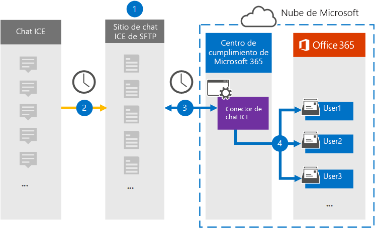

# Configurar un conector para archivar datos de chat de ICE (versión preliminar)Set up a connector to archive ICE Chat data (preview)

Use un conector nativo en el centro de cumplimiento de Microsoft 365 para importar y archivar datos de chat de servicios financieros desde la herramienta de colaboración de chat de ICE.Use a native connector in the Microsoft 365 compliance center to import and archive financial services chat data from the ICE Chat collaboration tool. Después de configurar y configurar un conector, se conecta al sitio de chat de ICE Secure FTP (SFTP) de la organización una vez al día, convierte el contenido de los mensajes de chat a un formato de mensaje de correo electrónico y, a continuación, importa esos elementos a los buzones en Microsoft 365.After you set up and configure a connector, it connects to your organization's ICE Chat secure FTP (SFTP) site once every day, converts the content of chat messages to an email message format, and then import those items to mailboxes in Microsoft 365.

Una vez que se almacenan los datos de los chats de los usuarios, puede aplicar características de cumplimiento de Microsoft 365, como retención por juicio, exhibición de documentos electrónicos, archivado, auditoría, cumplimiento de comunicaciones y directivas de retención de Microsoft 365 a datos de chat de ICE.After ICE chat data is stored in user mailboxes, you can apply Microsoft 365 compliance features such as litigation hold, eDiscovery, archiving, auditing, communication compliance, and Microsoft 365 retention policies to ICE Chat data. Por ejemplo, puede buscar mensajes de chat de ICE mediante la búsqueda de contenido o asociar el buzón de correo que contiene los datos de chats de hielo con un custodio en un caso de exhibición avanzada de documentos electrónicos.For example, you can search ICE Chat messages using content search or associate the mailbox that contains the ICE Chat data with a custodian in an Advanced eDiscovery case. El uso de un conector de chat de ICE para importar y archivar datos en Microsoft 365 puede ayudar a su organización a cumplir con las directivas gubernamentales y regulatorias.Using an ICE Chat connector to import and archive data in Microsoft 365 can help your organization stay compliant with government and regulatory policies.

## Información general sobre el archivado de datos de chat de ICEOverview of archiving ICE Chat data

La siguiente descripción general explica el proceso de uso de un conector para archivar datos de chat de ICE en Microsoft 365.The following overview explains the process of using a connector to archive ICE chat data in Microsoft 365.

1. La organización trabaja con chat de ICE para configurar un sitio de SFTP de chat de ICE.Your organization works with ICE Chat to set up an ICE Chat SFTP site. También trabajará con chat de hielo para configurar el chat de hielo para copiar los mensajes de chat en el sitio de SFTP de chat de ICE.You'll also work with ICE Chat to configure ICE Chat to copy chat messages to your ICE Chat SFTP site.

2. Una vez cada 24 horas, los mensajes de chat de chat por ICE se copian en el sitio de SFTP de chat de ICE.Once every 24 hours, chat messages from ICE Chat are copied to your ICE Chat SFTP site.

3. El conector de chat de hielo que crea en el centro de cumplimiento de Microsoft 365 se conecta al sitio de SFTP chat de ICE todos los días y transfiere los mensajes de chat de las 24 horas anteriores a una ubicación de almacenamiento seguro de Azure en la nube de Microsoft.The ICE Chat connector that you create in the Microsoft 365 compliance center connects to the ICE Chat SFTP site every day and transfers the chat messages from the previous 24 hours to a secure Azure Storage location in the Microsoft Cloud. El conector también convierte el contenido de un chat en un formato de mensaje de correo electrónico.The connector also converts the content of a chat massage to an email message format.

4. El conector importa los elementos de mensajes de chat a los buzones de usuarios específicos.The connector imports chat message items to the mailboxes of specific users. Se creará una nueva carpeta llamada **ICE chat** en los buzones de usuario y los elementos de mensajes de chat se importarán a esa carpeta.A new folder named **ICE Chat** will be created in the user mailboxes and the chat message items will be imported to that folder. El conector usa el valor de las propiedades *SenderEmail* y *RecipientEmail* .The connector does by using the value of the *SenderEmail* and *RecipientEmail* properties. Todos los mensajes de chat contienen estas propiedades, que se rellenan con la dirección de correo electrónico del remitente y de todos los destinatarios o participantes del mensaje de chat.Every chat message contains these properties, which are populated with email address of the sender and every recipient/participant of the chat message.

   Además de la asignación automática de usuarios que usa los valores de la propiedad *SenderEmail* y *RecipientEmail* (lo que significa que el conector importa un mensaje de chat al buzón de correo del remitente y a los buzones de todos los destinatarios), también puede definir la asignación de usuarios personalizada mediante la carga de un archivo de asignación CSV.In addition to automatic user mapping that uses the values of the *SenderEmail* and *RecipientEmail* property (which means that the connector imports a chat message to the sender's mailbox and the mailboxes of every recipient), you can also define custom user mapping by uploading a CSV mapping file. Este archivo de asignación contiene el *ImId* de chat de ICE y la dirección de buzón de correo de Microsoft 365 correspondiente a cada usuario de la organización.This mapping file contains the ICE Chat *ImId* and the corresponding Microsoft 365 mailbox address for every user in your organization. Si habilita la asignación automática de usuarios y proporciona un archivo de asignación personalizada, para cada elemento de chat el conector examinará primero el archivo de asignación personalizada.If you enable automatic user mapping and provide a custom-mapping file, for every chat item the connector will first look at the custom-mapping file. Si no encuentra una cuenta de usuario de Microsoft 365 válida que corresponda a la ImId de chat de ICE de un usuario, el conector usará las propiedades *SenderEmail* y *RecipientEmail* del elemento chat para importar el elemento a los buzones de los participantes del chat.If it doesn't find a valid Microsoft 365 user account that corresponds to a user's ICE Chat ImId, the connector will use the *SenderEmail* and *RecipientEmail* properties of the chat item to import the item to the mailboxes of the chat participants. Si el conector no encuentra un usuario válido de Microsoft 365 en el archivo de asignación personalizada o en las propiedades *SenderEmail* y *RecipientEmail* , no se importará el elemento.If the connector doesn't find a valid Microsoft 365 user in either the custom-mapping file or the *SenderEmail* and *RecipientEmail* properties, the item won't be imported.

## Antes de empezarBefore you begin

Algunos de los pasos de implementación necesarios para archivar los datos de los chats de ICE son externos a Microsoft 365 y deben completarse antes de que pueda crear el conector en el centro de cumplimiento.Some of the implementation steps required to archive ICE Chat data are external to Microsoft 365 and must be completed before you can create the connector in the compliance center.

- La organización debe permitir que el servicio de importación de Office 365 obtenga acceso a los datos de buzones de la organización.Your organization must consent to allow the Office 365 Import service to access mailbox data in your organization. Para dar su consentimiento a esta solicitud, vaya a [esta página](https://login.microsoftonline.com/common/oauth2/authorize?client_id=570d0bec-d001-4c4e-985e-3ab17fdc3073&response_type=code&redirect_uri=https://portal.azure.com/&nonce=1234&prompt=admin_consent), inicie sesión con las credenciales de un administrador global de Office 365 y, a continuación, acepte la solicitud.To consent to this request, go to [this page](https://login.microsoftonline.com/common/oauth2/authorize?client_id=570d0bec-d001-4c4e-985e-3ab17fdc3073&response_type=code&redirect_uri=https://portal.azure.com/&nonce=1234&prompt=admin_consent), sign in with the credentials of an Office 365 global admin, and then accept the request. Debe completar este paso para poder crear correctamente el conector de chat de hielo en el paso 3.You must complete this step before you can successfully create the ICE Chat connector in Step 3.

- El chat de hielo cobra a sus clientes una tarifa por el cumplimiento externo.ICE Chat charges their customers a fee for external compliance. Su organización debe ponerse en contacto con el grupo de ventas de chats de ICE para discutir y firmar el contrato de servicios de datos de chat de ICE, que puede obtener en [https://www.theice.com/publicdocs/agreements/ICE\_Data\_Services\_Agreement.pdf](https://www.theice.com/publicdocs/agreements/ICE\_Data\_Services\_Agreement.pdf) .Your organization should contact the ICE Chat sales group to discuss, and to sign the ICE Chat data services agreement, which you can obtain at [https://www.theice.com/publicdocs/agreements/ICE\_Data\_Services\_Agreement.pdf](https://www.theice.com/publicdocs/agreements/ICE\_Data\_Services\_Agreement.pdf). Este contrato está entre el chat de ICE y su organización, y no implica a Microsoft.This agreement is between ICE Chat and your organization and does not involve Microsoft. Después de configurar un sitio de SFTP de chat de ICE en el paso 2, el chat de ICE proporciona las credenciales FTP directamente a su organización.After you set up an ICE Chat SFTP site in Step 2, ICE Chat provides the FTP credentials directly to your organization. A continuación, le proporcionará esas credenciales a Microsoft cuando configure el conector en el paso 3.Then you who would provide those credentials to Microsoft when setting up the connector in Step 3.

- Debe configurar un sitio de SFTP de chat de ICE antes de crear el conector en el paso 3.You must set up an ICE Chat SFTP site before creating the connector in Step 3. Después de trabajar con chat de ICE para configurar el sitio de SFTP, los datos de chat de hielo se cargan al sitio de SFTP todos los días.After working with ICE Chat to set up the SFTP site, data from ICE Chat is uploaded to the SFTP site every day. El conector que se crea en el paso 3 se conecta a este sitio de SFTP y transfiere los datos de chat a buzones de correo de Microsoft 365.The connector you create in Step 3 connects to this SFTP site and transfers the chat data to Microsoft 365 mailboxes. SFTP también cifra los datos de los chats de hielo que se envían a los buzones durante el proceso de transferencia.SFTP also encrypts the ICE Chat data that's sent to mailboxes during the transfer process.

- El administrador que crea el conector ICE chat en el paso 3 (y en el que se descargan las claves públicas y la dirección IP en el paso 1) debe tener asignado el rol importación y exportación de buzones de correo en Exchange Online.The admin who creates the ICE Chat connector in Step 3 (and who downloads the public keys and IP address in Step 1) must be assigned the Mailbox Import Export role in Exchange Online. Este rol es necesario para agregar conectores en la página **conectores de datos** del centro de cumplimiento de Microsoft 365.This role is required to add connectors on the **Data connectors** page in the Microsoft 365 compliance center. Este rol no está asignado a ningún grupo de roles de Exchange Online de forma predeterminada.By default, this role isn't assigned to any role group in Exchange Online. Puede Agregar el rol importación y exportación de buzones al grupo de funciones de administración de la organización en Exchange Online.You can add the Mailbox Import Export role to the Organization Management role group in Exchange Online. O bien, puede crear un grupo de roles, asignar el rol de importación y exportación de buzones de correo y, a continuación, agregar los usuarios adecuados como miembros.Or you can create a role group, assign the Mailbox Import Export role, and then add the appropriate users as members. Para obtener más información, vea las secciones [crear grupos](https://docs.microsoft.com/Exchange/permissions-exo/role-groups#create-role-groups) de roles o [modificar grupos de roles](https://docs.microsoft.com/Exchange/permissions-exo/role-groups#modify-role-groups) en el artículo sobre la administración de grupos de roles en Exchange Online.For more information, see the [Create role groups](https://docs.microsoft.com/Exchange/permissions-exo/role-groups#create-role-groups) or [Modify role groups](https://docs.microsoft.com/Exchange/permissions-exo/role-groups#modify-role-groups) sections in the article "Manage role groups in Exchange Online".

## Paso 1: obtener las claves públicas SSH y PGPStep 1: Obtain SSH and PGP public keys

El primer paso es obtener una copia de las claves públicas para el shell seguro (SSH) y Pretty Good Privacy (PGP).The first step is to obtain a copy of the public keys for Secure Shell (SSH) and Pretty Good Privacy (PGP). Use estas claves en el paso 2 para configurar el sitio de SFTP de chat de ICE para permitir que el conector (que ha creado en el paso 3) se conecte al sitio de SFTP y transfiera los datos de chat de hielo a los buzones de Microsoft 365.You use these keys in Step 2 to configure the ICE Chat SFTP site to allow the connector (that you create in Step 3) to connect to the SFTP site and transfer the ICE Chat data to Microsoft 365 mailboxes. También obtendrá una dirección IP en este paso, que se usa al configurar el sitio de SFTP de chat de ICE.You will also obtain an IP address in this step, which you use when configuring the ICE Chat SFTP site.

1. Vaya a [https://compliance.microsoft.com](https://compliance.microsoft.com) y haga clic en **conectores de datos** en el panel de navegación izquierdo.Go to [https://compliance.microsoft.com](https://compliance.microsoft.com) and click **Data connectors** in the left nav.

2. En la página **conectores de datos (vista previa)** , en **chat de ICE**, haga clic en **Ver**.On the **Data connectors (preview)** page under **ICE Chat**, click **View**.

3. En la página de **chat de ICE** , haga clic en **Agregar conector**.On the **ICE Chat** page, click **Add connector**.

4. En la página **condiciones de servicio** , haga clic en **Aceptar**.On the **Terms of service** page, click **Accept**.

5. En la página **agregar credenciales para chat de ICE del sitio de SFTP** , en el paso 1, haga clic en **Descargar clave ssh**, **Descargar clave PGP**y descargar vínculos de **dirección IP** para guardar una copia de cada archivo en el equipo local.On the **Add credentials for ICE Chat SFTP site** page under step 1, click the **Download SSH key**, **Download PGP key**, and **Download IP address** links to save a copy of each file to your local computer. Estos archivos contienen los siguientes elementos que se usan para configurar el sitio de SFTP de chat de ICE en el paso 2:These files contain the following items that are used to configure the ICE Chat SFTP site in Step 2:

   - Clave pública SSH: esta clave se usa para configurar el SSH seguro para habilitar un inicio de sesión remoto seguro cuando el conector se conecta al sitio de SFTP de chat de ICE.SSH public key: This key is used to configure Secure SSH to enable a secure remote login when the connector connects to the ICE Chat SFTP site.

   - Clave pública PGP: esta clave se usa para configurar el cifrado de datos que se transfieren desde el sitio de SFTP de chat de ICE a Microsoft 365.PGP public key: This key is used to configure the encryption of data that's transferred from the ICE Chat SFTP site to Microsoft 365.

   - Dirección IP: el sitio de SFTP de chat de ICE está configurado para aceptar una solicitud de conexión solo desde esta dirección IP, que se usa en el conector de chat de hielo que se crea en el paso 3.IP address: The ICE Chat SFTP site is configured to accept a connection request only from this IP address, which is used by the ICE Chat connector that you create in Step 3.

6. Haga clic en **Cancelar** para cerrar el asistente.Click **Cancel** to close the wizard. Vuelva a este asistente en el paso 3 para crear el conector.You come back to this wizard in Step 3 to create the connector.

## Paso 2: configurar el sitio de SFTP de chat de ICEStep 2: Configure the ICE Chat SFTP site

El paso siguiente es usar las claves públicas SSH y PGP y la dirección IP que obtuvo en el paso 1 para configurar la autenticación SSH y el cifrado PGP para el sitio de SFTP de chat de ICE.The next step is to use the SSH and PGP public keys and the IP address that you obtained in Step 1 to configure SSH authentication and PGP encryption for the ICE Chat SFTP site. Esto permite que el conector de chat de hielo que crea en el paso 3 se conecte al sitio de SFTP chat y transfiera los datos de chat de ICE a Microsoft 365.This lets the ICE Chat connector that you create in Step 3 connect to the ICE Chat SFTP site and transfer ICE Chat data to Microsoft 365. Debe trabajar con el soporte técnico al cliente de chat de ICE para configurar el sitio de SFTP de chat de ICE.You need to work with ICE Chat customer support to set up your ICE Chat SFTP site.

## Paso 3: crear un conector de chat de ICEStep 3: Create an ICE Chat connector

El último paso consiste en crear un conector de chat de ICE en el centro de cumplimiento de Microsoft 365.The last step is to create an ICE Chat connector in the Microsoft 365 compliance center. El conector usa la información que proporciona para conectarse al sitio de correo de chat de ICE y transferir mensajes de chat a los cuadros de buzón de usuario correspondientes en Microsoft 365.The connector uses the information you provide to connect to the ICE Chat SFTP site and transfer chat messages to the corresponding user mailbox boxes in Microsoft 365.

1. Vaya a [https://compliance.microsoft.com](https://compliance.microsoft.com) y haga clic en **conectores de datos** en el panel de navegación izquierdo.Go to [https://compliance.microsoft.com](https://compliance.microsoft.com) and click **Data connectors** in the left nav.

2. En la página **conectores de datos** en chat de **ICE**, haga clic en **Ver**.On the **Data connectors** page under **ICE Chat**, click **View**.

3. En la página de **chat de ICE** , haga clic en **Agregar conector**.On the **ICE Chat** page, click **Add connector**.

4. En la página **condiciones de servicio** , haga clic en **Aceptar**.On the **Terms of service** page, click **Accept**.

5. En la página **agregar credenciales para chat de ICE del sitio de SFTP** , en el paso 3, escriba la información necesaria en los siguientes cuadros y, a continuación, haga clic en **validar conexión**.On the **Add credentials for ICE Chat SFTP site** page, under Step 3, enter the required information in the following boxes and then click **Validate connection**.

   - **Código de empresa:** El identificador de la organización, que se usa como nombre de usuario para el sitio de SFTP de chat de ICE.**Firm code:** The ID for your organization, which is used as the username for the ICE Chat SFTP site.

   - **Contraseña:** La contraseña para el sitio de SFTP de chat de ICE.**Password:** The password for your ICE Chat SFTP site.

   - **dirección URL de SFTP:** La URL del sitio de SFTP de chat de ICE (por ejemplo, sftp.theice.com).**SFTP URL:** The URL for the ICE Chat SFTP site (for example, sftp.theice.com).

   - **Puerto SFTP:** El número de puerto para el sitio de SFTP de chat de ICE.**SFTP port:** The port number for the ICE Chat SFTP site. El conector usa este puerto para conectarse al sitio de SFTP.The connector uses this port to connect to the SFTP site.

6. Una vez validada la conexión, haga clic en **siguiente**.After the connection is validated, click **Next**.

7. En la página **asignar usuarios externos a Microsoft 365 usuarios** , habilite la asignación automática de usuarios y proporcione la asignación de usuarios personalizada según sea necesario.On the **Map external users to Microsoft 365 users** page, enable automatic user mapping and provide custom user mapping as required. Puede descargar una copia del archivo CSV de asignación de usuarios en esta página.You can download a copy of the user-mapping CSV file on this page. Puede Agregar las asignaciones de usuario al archivo y luego cargarlas.You can add the user mappings to the file and then upload it.

   > [!NOTE]
   > Como se explicó anteriormente, el archivo CSV de asignación personalizada contiene el IMiD de chat de hielo y la dirección de buzón de correo de Microsoft 365 correspondiente a cada usuario.As previously explained, custom mapping file CSV file contains the ICE Chat imid and corresponding Microsoft 365 mailbox address for each user. Si habilita la asignación automática de usuarios y proporciona una asignación personalizada, para cada elemento de chat, el conector examinará primero el archivo de asignación personalizado.If you enable automatic user mapping and provide a custom mapping, for every chat item, the connector will first look at custom mapping file. Si no encuentra un usuario válido de Microsoft 365 que corresponda a la IMiD de chat de ICE de un usuario, el conector importará el elemento a los buzones de correo de los usuarios especificados en las propiedades *SenderEmail* y *RecipientEmail* del elemento de chat.If it doesn't find a valid Microsoft 365 user that corresponds to a user's ICE Chat imid, the connector will import the item to the mailboxes for the users specified in the *SenderEmail* and *RecipientEmail* properties of the chat item. Si el conector no encuentra un usuario válido de Microsoft 365 mediante una asignación de usuario automática o personalizada, no se importará el elemento.If the connector doesn't find a valid Microsoft 365 user by either automatic or custom user mapping, the item won't be imported.

8. Haga clic en **siguiente**, revise la configuración y, a continuación, haga clic en **Finalizar** para crear el conector.Click **Next**, review your settings, and then click **Finish** to create the connector.

9. Vaya a la página **conectores de datos** para ver el progreso del proceso de importación del nuevo conector.Go to the **Data connectors** page to see the progress of the import process for the new connector.
