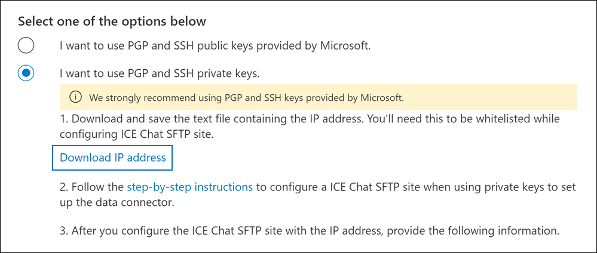

# Configurar un conector para archivar datos de chat ice

Use un conector nativo en el Centro de cumplimiento de Microsoft 365 para importar y archivar datos de chat de servicios financieros desde la herramienta de colaboración de chat ICE. Después de configurar y configurar un conector, se conecta al sitio FTP seguro de chat ICE (SFTP) de su organización una vez al día, convierte el contenido de los mensajes de chat a un formato de mensaje de correo electrónico y, a continuación, importa esos elementos a buzones de Microsoft 365.

Después de almacenar los datos de chat de ICE en buzones de usuario, puede aplicar características de cumplimiento de Microsoft 365 como retención por juicio, exhibición de documentos electrónicos, archivado, auditoría, cumplimiento de comunicaciones y directivas de retención de Microsoft 365 a los datos de chat de ICE. Por ejemplo, puede buscar mensajes de chat ice mediante la búsqueda de contenido o asociar el buzón que contiene los datos de chat de ICE con un custodio en un caso de exhibición de documentos electrónicos avanzada. El uso de un conector de chat ice para importar y archivar datos en Microsoft 365 puede ayudar a su organización a cumplir con las directivas gubernamentales y reglamentarias.

## Información general sobre el archivado de datos de chat de ICE

En la siguiente introducción se explica el proceso de uso de un conector para archivar datos de chat ice en Microsoft 365.

1. Su organización trabaja con ice chat para configurar un sitio SFTP de chat ice. También trabajará con ice chat para configurar el chat ice para copiar mensajes de chat en su sitio SFTP de chat ice.

2. Una vez cada 24 horas, los mensajes de chat de ICE Chat se copian en el sitio SFTP de chat de ICE.

3. El conector de chat ICE que cree en el Centro de cumplimiento de Microsoft 365 se conecta al sitio SFTP de chat ice todos los días y transfiere los mensajes de chat de las 24 horas anteriores a una ubicación segura de Azure Storage en Microsoft Cloud. El conector también convierte el contenido de un masaje de chat a un formato de mensaje de correo electrónico.

4. El conector importa elementos de mensajes de chat a los buzones de usuarios específicos. Se crea una nueva carpeta denominada **Chat ice** en los buzones de usuario y los elementos del mensaje de chat se importan a esa carpeta. El conector lo hace mediante el valor de las *propiedades SenderEmail* y *RecipientEmail.* Cada mensaje de chat contiene estas propiedades, que se rellenan con la dirección de correo electrónico del remitente y todos los destinatarios o participantes del mensaje de chat.

   Además de la asignación automática de usuarios que usa los valores de la propiedad *SenderEmail* y *RecipientEmail* (lo que significa que el conector importa un mensaje de chat al buzón del remitente y los buzones de cada destinatario), también puede definir la asignación de usuario personalizada cargando un archivo de asignación CSV. Este archivo de asignación contiene el *ImId* de chat ice y la dirección de buzón de Microsoft 365 correspondiente para todos los usuarios de la organización. Si habilita la asignación automática de usuarios y proporciona un archivo de asignación personalizada, por cada elemento de chat, el conector primero verá el archivo de asignación personalizada. Si no encuentra una cuenta de usuario válida de Microsoft 365 que corresponda al ImId de chat ice de un usuario, el conector usará las propiedades *SenderEmail* y *RecipientEmail* del elemento de chat para importar el elemento a los buzones de los participantes de chat. Si el conector no encuentra un usuario válido de Microsoft 365 en el archivo de asignación personalizada o en las propiedades *SenderEmail* y *RecipientEmail,* el elemento no se importará.

## Antes de configurar un conector

Algunos de los pasos de implementación necesarios para archivar datos de chat ice son externos a Microsoft 365 y deben completarse antes de poder crear el conector en el centro de cumplimiento.

- Ice Chat cobra a sus clientes una tarifa por cumplimiento externo. Su organización debe ponerse en contacto con el grupo de ventas de chat ice para analizar y firmar el contrato de servicios de datos de chat ice, que puede obtener en [https://www.theice.com/publicdocs/agreements/ICE\_Data\_Services\_Agreement.pdf](https://www.theice.com/publicdocs/agreements/ICE\_Data\_Services\_Agreement.pdf) . Este acuerdo es entre ice chat y su organización y no implica a Microsoft. Después de configurar un sitio SFTP de chat ice en el paso 2, el Chat de ICE proporciona las credenciales FTP directamente a su organización. A continuación, usted que proporcionaría esas credenciales a Microsoft al configurar el conector en el paso 3.

- Debe configurar un sitio SFTP de chat ice antes de crear el conector en el paso 3. Después de trabajar con ice chat para configurar el sitio SFTP, los datos del chat ice se cargan en el sitio SFTP todos los días. El conector que cree en el paso 3 se conecta a este sitio SFTP y transfiere los datos de chat a buzones de Microsoft 365. SFTP también cifra los datos de chat ice que se envían a los buzones durante el proceso de transferencia.

- Para configurar un conector de chat ICE, debe usar claves y contraseñas clave para Pretty Good Privacy (PGP) y Secure Shell (SSH). Estas claves se usan para configurar el sitio SFTP de chat ice y las usa el conector para conectarse al sitio SFTP de chat ice para importar datos a Microsoft 365. La clave PGP se usa para configurar el cifrado de los datos que se transfieren desde el sitio SFTP de chat ice a Microsoft 365. La clave SSH se usa para configurar el shell seguro para habilitar un inicio de sesión remoto seguro cuando el conector se conecta al sitio SFTP de chat ice.

  Al configurar un conector, tiene la opción de usar claves públicas y contraseñas de clave proporcionadas por Microsoft o puede usar sus propias claves privadas y contraseñas. Se recomienda usar las claves públicas proporcionadas por Microsoft. Sin embargo, si su organización ya ha configurado un sitio SFTP de chat ice con claves privadas, puede crear un conector con estas mismas claves privadas.

- El conector de chat ice puede importar un total de 200 000 elementos en un solo día. Si hay más de 200 000 elementos en el sitio SFTP, ninguno de estos elementos se importará a Microsoft 365.

- El administrador que crea el conector de chat ice en el paso 3 (y que descarga las claves públicas y la dirección IP en el paso 1) debe tener asignado el rol De importación de buzones de correo exportar en Exchange Online. Este rol es necesario para agregar conectores en la página **Conectores de datos** del Centro de cumplimiento de Microsoft 365. Este rol no está asignado a ningún grupo de roles de Exchange Online de forma predeterminada. Puede agregar el rol Exportación de importación de buzones al grupo de roles Administración de la organización en Exchange Online. O bien, puede crear un grupo de roles, asignar el rol Importación de buzones de correo Exportar y, a continuación, agregar los usuarios adecuados como miembros. Para obtener más información, vea  las secciones [Crear](/Exchange/permissions-exo/role-groups#create-role-groups) grupos de roles o Modificar grupos de roles en el artículo "Administrar grupos de roles en Exchange Online".

## Configurar un conector con claves públicas

Los pasos de esta sección muestran cómo configurar un conector de chat ICE con las claves públicas de Pretty Good Privacy (PGP) y Secure Shell (SSH).

### Paso 1: Obtener claves públicas de PGP y SSH

El primer paso es obtener una copia de las claves públicas de Pretty Good Privacy (PGP) y Secure Shell (SSH). Estas claves se usan en el paso 2 para configurar el sitio SFTP de chat ice para permitir que el conector (que crea en el paso 3) se conecte al sitio SFTP y transfiera los datos de chat ice a buzones de Microsoft 365. También obtendrá una dirección IP en este paso, que usará al configurar el sitio SFTP de chat ice.

1. Vaya a [https://compliance.microsoft.com](https://compliance.microsoft.com) y haga clic en **Conectores de datos** en la navegación izquierda.

2. En la **página Conectores de datos** en Chat **ice**, haga clic en **Ver**.

3. En la página **Chat de ICE,** haga clic **en Agregar conector**.

4. En la **página Términos de** servicio, haga clic **en Aceptar**.

5. En la **página Agregar credenciales para origen de** contenido, haga clic en Deseo usar claves públicas PGP y SSH **proporcionadas por Microsoft**.

   

6. En el paso 1, haga clic en los vínculos Descargar clave **SSH**, **Descargar clave PGP** y Descargar dirección **IP** para guardar una copia de cada archivo en el equipo local.

   

   Estos archivos contienen los siguientes elementos que se usan para configurar el sitio SFTP de chat ice en el paso 2:

   - Clave pública PGP: esta clave se usa para configurar el cifrado de los datos que se transfieren desde el sitio SFTP de chat ice a Microsoft 365.

   - Clave pública SSH: esta clave se usa para configurar Ssh seguro para habilitar un inicio de sesión remoto seguro cuando el conector se conecta al sitio SFTP de chat ice.

   - Dirección IP: el sitio SFTP de chat ice está configurado para aceptar una solicitud de conexión solo desde esta dirección IP, que usa el conector de chat ICE que cree en el paso 3.

7. Haga **clic en** Cancelar para cerrar el asistente. Vuelve a este asistente en el paso 3 para crear el conector.

### Paso 2: Configurar el sitio SFTP de chat ice

El siguiente paso es usar las claves públicas PGP y SSH y la dirección IP que obtuvo en el paso 1 para configurar el cifrado PGP y la autenticación SSH para el sitio SFTP de chat ice. Esto permite que el conector de chat ice que cree en el paso 3 se conecte al sitio SFTP de chat ice y transfiera datos de chat ice a Microsoft 365. Debe trabajar con el servicio de soporte al cliente de ICE Chat para configurar su sitio SFTP de chat ice.

### Paso 3: Crear un conector de chat ice

El último paso es crear un conector de chat ice en el Centro de cumplimiento de Microsoft 365. El conector usa la información que proporciona para conectarse al sitio SFTP de chat ice y transferir mensajes de chat a los cuadros de buzón de usuario correspondientes en Microsoft 365.

1. Vaya a [https://compliance.microsoft.com](https://compliance.microsoft.com) y haga clic en **Conectores de datos** en la navegación izquierda.

2. En la **página Conectores de datos** en Chat **ice**, haga clic en **Ver**.

3. En la página **Chat de ICE,** haga clic **en Agregar conector**.

4. En la **página Términos de** servicio, haga clic **en Aceptar**.

5. En la **página Agregar credenciales para origen de** contenido, haga clic en Deseo usar claves públicas **PGP y SSH**.

6. En el paso 3, escriba la información necesaria en los cuadros siguientes y, a continuación, haga clic **en Validar conexión**.

   - **Código de firma:** El identificador de su organización, que se usa como nombre de usuario para el sitio SFTP de chat ice.

   - **Contraseña:** La contraseña del sitio SFTP de chat ice.

   - **DIRECCIÓN URL DE SFTP:** La dirección URL del sitio SFTP de chat ice (por ejemplo, `sftp.theice.com` ). También puede usar una dirección IP para este valor.

   - **Puerto SFTP:** El número de puerto del sitio SFTP de chat ice. El conector usa este puerto para conectarse al sitio SFTP.

7. Después de validar correctamente la conexión, haga clic en **Siguiente**.

8. En la página Asignar usuarios externos a usuarios de **Microsoft 365,** habilite la asignación automática de usuarios y proporcione la asignación de usuarios personalizada según sea necesario. Puede descargar una copia del archivo CSV de asignación de usuario en esta página. Puede agregar las asignaciones de usuario al archivo y, a continuación, cargarlo.

   > [!NOTE]
   > Como se explicó anteriormente, el archivo CSV del archivo de asignación personalizado contiene el imid de chat ice y la dirección de buzón de Microsoft 365 correspondiente para cada usuario. Si habilita la asignación automática de usuarios y proporciona una asignación personalizada, para cada elemento de chat, el conector primero verá el archivo de asignación personalizado. Si no encuentra un usuario válido de Microsoft 365 que corresponda al imid de chat ice de un usuario, el conector importará el elemento a los buzones de los usuarios especificados en las propiedades *SenderEmail* y *RecipientEmail* del elemento de chat. Si el conector no encuentra un usuario válido de Microsoft 365 mediante una asignación de usuario automática o personalizada, el elemento no se importará.

9. Haga **clic en Siguiente,** revise la configuración y, a continuación, haga clic **en Finalizar** para crear el conector.

10. Vaya a la **página Conectores de datos** para ver el progreso del proceso de importación del nuevo conector.

## Configurar un conector con claves privadas

Los pasos de esta sección muestran cómo configurar un conector de chat ICE con claves privadas PGP y SSH. Esta opción de configuración del conector está diseñada para organizaciones que ya han configurado un sitio DE CHAT DE ICE SFTP con claves privadas.

### Paso 1: Obtener una dirección IP para configurar el sitio SFTP de chat ice

Si su organización ha usado claves privadas PGP y SSH para configurar un sitio DE SFTP de chat ice, debe obtener una dirección IP y proporcionarla al servicio de soporte al cliente del chat ice. El sitio SFTP de chat ice debe configurarse para aceptar solicitudes de conexión desde esta dirección IP. El conector de chat ice usa la misma dirección IP para conectarse al sitio SFTP y transferir datos de chat ice a Microsoft 365.

Para obtener la dirección IP:

1. Vaya a <https://compliance.microsoft.com> y haga clic en **Conectores de datos** en la navegación izquierda.

2. En la **página Conectores de datos** en Chat **ice**, haga clic en **Ver**.

3. En la página **descripción del producto chat ice,** haga clic en Agregar **conector**

4. En la **página Términos de** servicio, haga clic **en Aceptar**.

5. En la **página Agregar credenciales para origen de contenido,** haga clic en Deseo usar claves privadas **PGP y SSH.**

   

6. En el paso 1, haga clic **en Descargar dirección IP** para guardar una copia del archivo de dirección IP en el equipo local.

   

7. Haga **clic en** Cancelar para cerrar el asistente. Vuelve a este asistente en el paso 2 para crear el conector.

Debe trabajar con el servicio de soporte al cliente de chat ice para configurar su sitio SFTP de chat ice para aceptar solicitudes de conexión desde esta dirección IP.

### Paso 2: Crear un conector de chat ice

Una vez configurado el sitio SFTP de chat ice, el siguiente paso es crear un conector de chat ICE en el Centro de cumplimiento de Microsoft 365. El conector usa la información que proporciona para conectarse al sitio SFTP de chat ice y transferir mensajes de correo electrónico a los cuadros de buzón de usuario correspondientes en Microsoft 365. Para completar este paso, asegúrese de tener copias de las mismas claves privadas y contraseñas clave que usó para configurar el sitio SFTP de chat ice.

1. Vaya a <https://compliance.microsoft.com> y haga clic en **Conectores de datos** en la navegación izquierda.

2. En la **página Conectores de datos** en Chat **ice**, haga clic en **Ver**.

3. En la página **descripción del producto chat ice,** haga clic en Agregar **conector**

4. En la **página Términos de** servicio, haga clic **en Aceptar**.

5. En la **página Agregar credenciales para origen de contenido,** haga clic en Deseo usar claves privadas **PGP y SSH.**

6. En el paso 3, escriba la información necesaria en los cuadros siguientes y, a continuación, haga clic **en Validar conexión**.

      - **Nombre:** El nombre del conector. Debe ser único en la organización.

      - **Código de firma:** El identificador de su organización que se usa como nombre de usuario para el sitio SFTP de chat ice.

      - **Contraseña:** La contraseña del sitio SFTP de chat ICE de su organización.

      - **DIRECCIÓN URL DE SFTP:** La dirección URL del sitio SFTP de chat ice (por ejemplo, `sftp.theice.com` ). También puede usar una dirección IP para este valor.

      - **Puerto SFTP:** El número de puerto del sitio SFTP de chat ice. El conector usa este puerto para conectarse al sitio SFTP.

      - **Clave privada PGP:** La clave privada PGP para el sitio SFTP de chat ice. Asegúrese de incluir todo el valor de clave privada, incluidas las líneas inicial y final del bloque de teclas.

      - Frase de contraseña de clave **PGP:** Frase de contraseña para la clave privada PGP.

      - **Clave privada SSH:** La clave privada SSH para el sitio SFTP de chat ice. Asegúrese de incluir todo el valor de clave privada, incluidas las líneas inicial y final del bloque de teclas.

      - **Frase de contraseña de clave SSH:** Frase de contraseña para la clave privada SSH.

7. Después de validar correctamente la conexión, haga clic en **Siguiente**.

8. En la página Asignar usuarios de chat ICE a usuarios de **Microsoft 365,** habilite la asignación automática de usuarios y proporcione la asignación de usuarios personalizada según sea necesario.

   > [!NOTE]
   > Como se explicó anteriormente, el archivo CSV del archivo de asignación personalizado contiene el imid de chat ice y la dirección de buzón de Microsoft 365 correspondiente para cada usuario. Si habilita la asignación automática de usuarios y proporciona una asignación personalizada, para cada elemento de chat, el conector primero verá el archivo de asignación personalizado. Si no encuentra un usuario válido de Microsoft 365 que corresponda al imid de chat ice de un usuario, el conector importará el elemento a los buzones de los usuarios especificados en las propiedades *SenderEmail* y *RecipientEmail* del elemento de chat. Si el conector no encuentra un usuario válido de Microsoft 365 mediante una asignación de usuario automática o personalizada, el elemento no se importará.

9. Haga **clic en Siguiente,** revise la configuración y, a continuación, haga clic **en Finalizar** para crear el conector.

10. Vaya a la **página Conectores de datos** para ver el progreso del proceso de importación del nuevo conector. Haga clic en el conector para mostrar la página desplegable, que contiene información sobre el conector.
