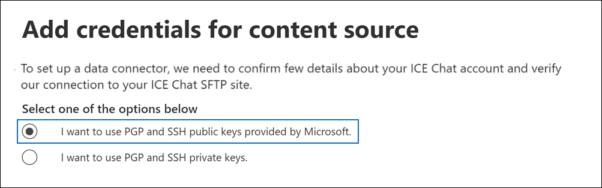

# Configurar un conector para archivar datos de chat iceSet up a connector to archive ICE Chat data

Use un conector nativo en el centro de Microsoft 365 de cumplimiento para importar y archivar datos de chat de servicios financieros desde la herramienta de colaboración de chat ICE.Use a native connector in the Microsoft 365 compliance center to import and archive financial services chat data from the ICE Chat collaboration tool. Después de configurar y configurar un conector, se conecta al sitio FTP seguro de chat ICE (SFTP) de su organización una vez al día, convierte el contenido de los mensajes de chat en un formato de mensaje de correo electrónico y, a continuación, importa esos elementos a buzones de correo en Microsoft 365.After you set up and configure a connector, it connects to your organization's ICE Chat secure FTP (SFTP) site once every day, converts the content of chat messages to an email message format, and then import those items to mailboxes in Microsoft 365.

Después de almacenar los datos de chat de ICE en buzones de usuario, puede aplicar Microsoft 365 características de cumplimiento como retención por juicio, exhibición de documentos electrónicos, archivado, auditoría, cumplimiento de comunicaciones y directivas de retención de Microsoft 365 a los datos de chat de ICE.After ICE chat data is stored in user mailboxes, you can apply Microsoft 365 compliance features such as litigation hold, eDiscovery, archiving, auditing, communication compliance, and Microsoft 365 retention policies to ICE Chat data. Por ejemplo, puede buscar mensajes de chat ice mediante la búsqueda de contenido o asociar el buzón que contiene los datos de chat de ICE con un custodio en un Advanced eDiscovery caso.For example, you can search ICE Chat messages using content search or associate the mailbox that contains the ICE Chat data with a custodian in an Advanced eDiscovery case. El uso de un conector de chat ice para importar y archivar datos en Microsoft 365 puede ayudar a su organización a cumplir con las directivas gubernamentales y reglamentarias.Using an ICE Chat connector to import and archive data in Microsoft 365 can help your organization stay compliant with government and regulatory policies.

## Información general sobre el archivado de datos de chat de ICEOverview of archiving ICE Chat data

En la siguiente introducción se explica el proceso de uso de un conector para archivar datos de chat ice en Microsoft 365.The following overview explains the process of using a connector to archive ICE chat data in Microsoft 365.

1. Su organización trabaja con ice chat para configurar un sitio SFTP de chat ice.Your organization works with ICE Chat to set up an ICE Chat SFTP site. También trabajará con ice chat para configurar el chat ice para copiar mensajes de chat en su sitio SFTP de chat ice.You'll also work with ICE Chat to configure ICE Chat to copy chat messages to your ICE Chat SFTP site.

2. Una vez cada 24 horas, los mensajes de chat de ICE Chat se copian en el sitio SFTP de chat de ICE.Once every 24 hours, chat messages from ICE Chat are copied to your ICE Chat SFTP site.

3. El conector de chat ICE que cree en el centro de cumplimiento de Microsoft 365 se conecta al sitio SFTP de chat ice todos los días y transfiere los mensajes de chat de las 24 horas anteriores a una ubicación Azure Storage segura en la nube de Microsoft.The ICE Chat connector that you create in the Microsoft 365 compliance center connects to the ICE Chat SFTP site every day and transfers the chat messages from the previous 24 hours to a secure Azure Storage location in the Microsoft cloud. El conector también convierte el contenido de un masaje de chat a un formato de mensaje de correo electrónico.The connector also converts the content of a chat massage to an email message format.

4. El conector importa elementos de mensajes de chat a los buzones de usuarios específicos.The connector imports chat message items to the mailboxes of specific users. Se crea una nueva carpeta denominada **Chat ice** en los buzones de usuario y los elementos del mensaje de chat se importan a esa carpeta.A new folder named **ICE Chat** is created in the user mailboxes and the chat message items are imported to that folder. El conector lo hace mediante el valor de las *propiedades SenderEmail* y *RecipientEmail.*The connector does by using the value of the *SenderEmail* and *RecipientEmail* properties. Cada mensaje de chat contiene estas propiedades, que se rellenan con la dirección de correo electrónico del remitente y todos los destinatarios o participantes del mensaje de chat.Every chat message contains these properties, which are populated with email address of the sender and every recipient/participant of the chat message.

   Además de la asignación automática de usuarios que usa los valores de la propiedad *SenderEmail* y *RecipientEmail* (lo que significa que el conector importa un mensaje de chat al buzón del remitente y los buzones de cada destinatario), también puede definir la asignación de usuario personalizada cargando un archivo de asignación CSV.In addition to automatic user mapping that uses the values of the *SenderEmail* and *RecipientEmail* property (which means that the connector imports a chat message to the sender's mailbox and the mailboxes of every recipient), you can also define custom user mapping by uploading a CSV mapping file. Este archivo de asignación contiene el *ImId* de chat ice y la dirección Microsoft 365 buzón de correo correspondiente para todos los usuarios de la organización.This mapping file contains the ICE Chat *ImId* and the corresponding Microsoft 365 mailbox address for every user in your organization. Si habilita la asignación automática de usuarios y proporciona un archivo de asignación personalizada, por cada elemento de chat, el conector primero verá el archivo de asignación personalizada.If you enable automatic user mapping and provide a custom-mapping file, for every chat item the connector will first look at the custom-mapping file. Si no encuentra una cuenta de usuario de Microsoft 365 válida que corresponda al ImId de chat ICE de un usuario, el conector usará las propiedades *SenderEmail* y *RecipientEmail* del elemento de chat para importar el elemento a los buzones de los participantes de chat.If it doesn't find a valid Microsoft 365 user account that corresponds to a user's ICE Chat ImId, the connector will use the *SenderEmail* and *RecipientEmail* properties of the chat item to import the item to the mailboxes of the chat participants. Si el conector no encuentra un usuario Microsoft 365 válido en el archivo de asignación personalizada o en las propiedades *SenderEmail* y *RecipientEmail,* el elemento no se importará.If the connector doesn't find a valid Microsoft 365 user in either the custom-mapping file or the *SenderEmail* and *RecipientEmail* properties, the item won't be imported.

## Antes de configurar un conectorBefore you set up a connector

Algunos de los pasos de implementación necesarios para archivar datos de chat ice son externos a Microsoft 365 y deben completarse antes de poder crear el conector en el centro de cumplimiento.Some of the implementation steps required to archive ICE Chat data are external to Microsoft 365 and must be completed before you can create the connector in the compliance center.

- Ice Chat cobra a sus clientes una tarifa por cumplimiento externo.ICE Chat charges their customers a fee for external compliance. Su organización debe ponerse en contacto con el grupo de ventas de chat ice para analizar y firmar el contrato de servicios de datos de chat ice, que puede obtener en [https://www.theice.com/publicdocs/agreements/ICE\_Data\_Services\_Agreement.pdf](https://www.theice.com/publicdocs/agreements/ICE\_Data\_Services\_Agreement.pdf) .Your organization should contact the ICE Chat sales group to discuss, and to sign the ICE Chat data services agreement, which you can obtain at [https://www.theice.com/publicdocs/agreements/ICE\_Data\_Services\_Agreement.pdf](https://www.theice.com/publicdocs/agreements/ICE\_Data\_Services\_Agreement.pdf). Este acuerdo es entre ice chat y su organización y no implica a Microsoft.This agreement is between ICE Chat and your organization and does not involve Microsoft. Después de configurar un sitio SFTP de chat ice en el paso 2, el Chat de ICE proporciona las credenciales FTP directamente a su organización.After you set up an ICE Chat SFTP site in Step 2, ICE Chat provides the FTP credentials directly to your organization. A continuación, usted que proporcionaría esas credenciales a Microsoft al configurar el conector en el paso 3.Then you who would provide those credentials to Microsoft when setting up the connector in Step 3.

- Debe configurar un sitio SFTP de chat ice antes de crear el conector en el paso 3.You must set up an ICE Chat SFTP site before creating the connector in Step 3. Después de trabajar con ice chat para configurar el sitio SFTP, los datos del chat ice se cargan en el sitio SFTP todos los días.After working with ICE Chat to set up the SFTP site, data from ICE Chat is uploaded to the SFTP site every day. El conector que cree en el paso 3 se conecta a este sitio SFTP y transfiere los datos de chat a Microsoft 365 buzones de correo.The connector you create in Step 3 connects to this SFTP site and transfers the chat data to Microsoft 365 mailboxes. SFTP también cifra los datos de chat ice que se envían a los buzones durante el proceso de transferencia.SFTP also encrypts the ICE Chat data that's sent to mailboxes during the transfer process.

- Para configurar un conector de chat ICE, debe usar claves y contraseñas clave para Pretty Good Privacy (PGP) y Secure Shell (SSH).To set up an ICE Chat connector, you have to use keys and key passphrases for Pretty Good Privacy (PGP) and Secure Shell (SSH). Estas claves se usan para configurar el sitio SFTP de chat ice y las usa el conector para conectarse al sitio SFTP de chat ice para importar datos a Microsoft 365.These keys are used to configure the ICE Chat SFTP site and used by the connector to connect to the ICE Chat SFTP site to import data to Microsoft 365. La clave PGP se usa para configurar el cifrado de los datos que se transfieren desde el sitio SFTP de chat ice a Microsoft 365.The PGP key is used to configure the encryption of data that's transferred from the ICE Chat SFTP site to Microsoft 365. La clave SSH se usa para configurar el shell seguro para habilitar un inicio de sesión remoto seguro cuando el conector se conecta al sitio SFTP de chat ice.The SSH key is used to configure secure shell to enable a secure remote login when the connector connects to the ICE Chat SFTP site.

  Al configurar un conector, tiene la opción de usar claves públicas y contraseñas de clave proporcionadas por Microsoft o puede usar sus propias claves privadas y contraseñas.When setting up a connector, you have the option to use public keys and key passphrases provided by Microsoft or you can use your own private keys and passphrases. Se recomienda usar las claves públicas proporcionadas por Microsoft.We recommend that you use the public keys provided by Microsoft. Sin embargo, si su organización ya ha configurado un sitio SFTP de chat ice con claves privadas, puede crear un conector con estas mismas claves privadas.However, if your organization has already configured an ICE Chat SFTP site using private keys, then you can create a connector using these same private keys.

- El conector de chat ice puede importar un total de 200 000 elementos en un solo día.The ICE Chat connector can import a total of 200,000 items in a single day. Si hay más de 200 000 elementos en el sitio SFTP, ninguno de estos elementos se importará a Microsoft 365.If there are more than 200,000 items on the SFTP site, none of those items will be imported to Microsoft 365.

- El administrador que crea el conector de chat ice en el paso 3 (y que descarga las claves públicas y la dirección IP en el paso 1) debe tener asignado el rol De importación de buzones de correo exportar en Exchange Online.The admin who creates the ICE Chat connector in Step 3 (and who downloads the public keys and IP address in Step 1) must be assigned the Mailbox Import Export role in Exchange Online. Este rol es necesario para agregar conectores en la página **Conectores** de datos del centro de Microsoft 365 cumplimiento.This role is required to add connectors on the **Data connectors** page in the Microsoft 365 compliance center. Este rol no está asignado a ningún grupo de roles de Exchange Online de forma predeterminada.By default, this role isn't assigned to any role group in Exchange Online. Puede agregar el rol Exportación de importación de buzones al grupo de roles Administración de la organización en Exchange Online.You can add the Mailbox Import Export role to the Organization Management role group in Exchange Online. O bien, puede crear un grupo de roles, asignar el rol Importación de buzones de correo Exportar y, a continuación, agregar los usuarios adecuados como miembros.Or you can create a role group, assign the Mailbox Import Export role, and then add the appropriate users as members. Para obtener más información, vea  las secciones [Crear](/Exchange/permissions-exo/role-groups#create-role-groups) grupos de roles o Modificar grupos de roles en el artículo "Administrar grupos de roles en Exchange Online".For more information, see the [Create role groups](/Exchange/permissions-exo/role-groups#create-role-groups) or [Modify role groups](/Exchange/permissions-exo/role-groups#modify-role-groups) sections in the article "Manage role groups in Exchange Online".

## Configurar un conector con claves públicasSet up a connector using public keys

Los pasos de esta sección muestran cómo configurar un conector de chat ICE con las claves públicas de Pretty Good Privacy (PGP) y Secure Shell (SSH).The steps in this section show you how to set up an ICE Chat connector using the public keys for Pretty Good Privacy (PGP) and Secure Shell (SSH).

### Paso 1: Obtener claves públicas de PGP y SSHStep 1: Obtain PGP and SSH public keys

El primer paso es obtener una copia de las claves públicas de Pretty Good Privacy (PGP) y Secure Shell (SSH).The first step is to obtain a copy of the public keys for Pretty Good Privacy (PGP) and Secure Shell (SSH). Estas claves se usan en el paso 2 para configurar el sitio SFTP de chat ice para permitir que el conector (que crea en el paso 3) se conecte al sitio SFTP y transfiera los datos del chat ice a Microsoft 365 buzones de correo.You use these keys in Step 2 to configure the ICE Chat SFTP site to allow the connector (that you create in Step 3) to connect to the SFTP site and transfer the ICE Chat data to Microsoft 365 mailboxes. También obtendrá una dirección IP en este paso, que usará al configurar el sitio SFTP de chat ice.You will also obtain an IP address in this step, which you use when configuring the ICE Chat SFTP site.

1. Vaya a [https://compliance.microsoft.com](https://compliance.microsoft.com) y haga clic en **Conectores de datos** en la navegación izquierda.Go to [https://compliance.microsoft.com](https://compliance.microsoft.com) and click **Data connectors** in the left nav.

2. En la **página Conectores de datos** en Chat **ice**, haga clic en **Ver**.On the **Data connectors** page under **ICE Chat**, click **View**.

3. En la página **Chat de ICE,** haga clic **en Agregar conector**.On the **ICE Chat** page, click **Add connector**.

4. En la **página Términos de** servicio, haga clic **en Aceptar**.On the **Terms of service** page, click **Accept**.

5. En la **página Agregar credenciales para origen de** contenido, haga clic en Deseo usar claves públicas PGP y SSH **proporcionadas por Microsoft**.On the **Add credentials for content source** page, click **I want to use PGP and SSH public keys provided by Microsoft**.

   

6. En el paso 1, haga clic en los vínculos Descargar clave **SSH**, **Descargar clave PGP** y Descargar dirección **IP** para guardar una copia de cada archivo en el equipo local.Under step 1, click the **Download SSH key**, **Download PGP key**, and **Download IP address** links to save a copy of each file to your local computer.

   

   Estos archivos contienen los siguientes elementos que se usan para configurar el sitio SFTP de chat ice en el paso 2:These files contain the following items that are used to configure the ICE Chat SFTP site in Step 2:

   - Clave pública PGP: esta clave se usa para configurar el cifrado de los datos que se transfieren desde el sitio SFTP de chat ice a Microsoft 365.PGP public key: This key is used to configure the encryption of data that's transferred from the ICE Chat SFTP site to Microsoft 365.

   - Clave pública SSH: esta clave se usa para configurar Ssh seguro para habilitar un inicio de sesión remoto seguro cuando el conector se conecta al sitio SFTP de chat ice.SSH public key: This key is used to configure Secure SSH to enable a secure remote login when the connector connects to the ICE Chat SFTP site.

   - Dirección IP: el sitio SFTP de chat ice está configurado para aceptar una solicitud de conexión solo desde esta dirección IP, que usa el conector de chat ICE que cree en el paso 3.IP address: The ICE Chat SFTP site is configured to accept a connection request only from this IP address, which is used by the ICE Chat connector that you create in Step 3.

7. Haga **clic en** Cancelar para cerrar el asistente.Click **Cancel** to close the wizard. Vuelve a este asistente en el paso 3 para crear el conector.You come back to this wizard in Step 3 to create the connector.

### Paso 2: Configurar el sitio SFTP de chat iceStep 2: Configure the ICE Chat SFTP site

El siguiente paso es usar las claves públicas PGP y SSH y la dirección IP que obtuvo en el paso 1 para configurar el cifrado PGP y la autenticación SSH para el sitio SFTP de chat ice.The next step is to use the PGP and SSH public keys and the IP address that you obtained in Step 1 to configure PGP encryption and SSH authentication for the ICE Chat SFTP site. Esto permite que el conector de chat ice que cree en el paso 3 se conecte al sitio SFTP de chat ice y transfiera los datos del chat ice a Microsoft 365.This lets the ICE Chat connector that you create in Step 3 connect to the ICE Chat SFTP site and transfer ICE Chat data to Microsoft 365. Debe trabajar con el servicio de soporte al cliente de ICE Chat para configurar su sitio SFTP de chat ice.You need to work with ICE Chat customer support to set up your ICE Chat SFTP site.

### Paso 3: Crear un conector de chat iceStep 3: Create an ICE Chat connector

El último paso es crear un conector de chat ice en el centro de Microsoft 365 cumplimiento.The last step is to create an ICE Chat connector in the Microsoft 365 compliance center. El conector usa la información que proporciona para conectarse al sitio SFTP de chat ice y transferir mensajes de chat a los cuadros de buzón de usuario correspondientes en Microsoft 365.The connector uses the information you provide to connect to the ICE Chat SFTP site and transfer chat messages to the corresponding user mailbox boxes in Microsoft 365.

1. Vaya a [https://compliance.microsoft.com](https://compliance.microsoft.com) y haga clic en **Conectores de datos** en la navegación izquierda.Go to [https://compliance.microsoft.com](https://compliance.microsoft.com) and click **Data connectors** in the left nav.

2. En la **página Conectores de datos** en Chat **ice**, haga clic en **Ver**.On the **Data connectors** page under **ICE Chat**, click **View**.

3. En la página **Chat de ICE,** haga clic **en Agregar conector**.On the **ICE Chat** page, click **Add connector**.

4. En la **página Términos de** servicio, haga clic **en Aceptar**.On the **Terms of service** page, click **Accept**.

5. En la **página Agregar credenciales para origen de** contenido, haga clic en Deseo usar claves públicas **PGP y SSH**.On the **Add credentials for content source** page, click **I want to use PGP and SSH public keys**.

6. En el paso 3, escriba la información necesaria en los cuadros siguientes y, a continuación, haga clic **en Validar conexión**.Under Step 3, enter the required information in the following boxes and then click **Validate connection**.

   - **Código de firma:** El identificador de su organización, que se usa como nombre de usuario para el sitio SFTP de chat ice.**Firm code:** The ID for your organization, which is used as the username for the ICE Chat SFTP site.

   - **Contraseña:** La contraseña del sitio SFTP de chat ice.**Password:** The password for your ICE Chat SFTP site.

   - **DIRECCIÓN URL DE SFTP:** La dirección URL del sitio SFTP de chat ice (por ejemplo, `sftp.theice.com` ).**SFTP URL:** The URL for the ICE Chat SFTP site (for example, `sftp.theice.com`). También puede usar una dirección IP para este valor.You can also use an IP address for this value.

   - **Puerto SFTP:** El número de puerto del sitio SFTP de chat ice.**SFTP port:** The port number for the ICE Chat SFTP site. El conector usa este puerto para conectarse al sitio SFTP.The connector uses this port to connect to the SFTP site.

7. Después de validar correctamente la conexión, haga clic en **Siguiente**.After the connection is successfully validated, click **Next**.

8. En la página Asignar **usuarios externos Microsoft 365 usuarios,** habilite la asignación automática de usuarios y proporcione una asignación de usuario personalizada según sea necesario.On the **Map external users to Microsoft 365 users** page, enable automatic user mapping and provide custom user mapping as required. Puede descargar una copia del archivo CSV de asignación de usuario en esta página.You can download a copy of the user-mapping CSV file on this page. Puede agregar las asignaciones de usuario al archivo y, a continuación, cargarlo.You can add the user mappings to the file and then upload it.

   > [!NOTE]
   > Como se explicó anteriormente, el archivo CSV del archivo de asignación personalizado contiene el imid de chat ice y la dirección Microsoft 365 buzón de correo correspondiente para cada usuario.As previously explained, custom mapping file CSV file contains the ICE Chat imid and corresponding Microsoft 365 mailbox address for each user. Si habilita la asignación automática de usuarios y proporciona una asignación personalizada, para cada elemento de chat, el conector primero verá el archivo de asignación personalizado.If you enable automatic user mapping and provide a custom mapping, for every chat item, the connector will first look at custom mapping file. Si no encuentra un usuario de Microsoft 365 válido que corresponda al imid de chat ICE de un usuario, el conector importará el elemento a los buzones de los usuarios especificados en las propiedades *SenderEmail* y *RecipientEmail* del elemento de chat.If it doesn't find a valid Microsoft 365 user that corresponds to a user's ICE Chat imid, the connector will import the item to the mailboxes for the users specified in the *SenderEmail* and *RecipientEmail* properties of the chat item. Si el conector no encuentra un usuario de Microsoft 365 válido mediante una asignación de usuario automática o personalizada, el elemento no se importará.If the connector doesn't find a valid Microsoft 365 user by either automatic or custom user mapping, the item won't be imported.

9. Haga **clic en Siguiente,** revise la configuración y, a continuación, haga clic **en Finalizar** para crear el conector.Click **Next**, review your settings, and then click **Finish** to create the connector.

10. Vaya a la **página Conectores de datos** para ver el progreso del proceso de importación del nuevo conector.Go to the **Data connectors** page to see the progress of the import process for the new connector.

## Configurar un conector con claves privadasSet up a connector using private keys

Los pasos de esta sección muestran cómo configurar un conector de chat ICE con claves privadas PGP y SSH.The steps in this section show you how to set up an ICE Chat connector using PGP and SSH private keys. Esta opción de configuración del conector está diseñada para organizaciones que ya han configurado un sitio DE CHAT DE ICE SFTP con claves privadas.This connector setup option is intended for organizations that have already configured an ICE Chat SFTP site using private keys.

### Paso 1: Obtener una dirección IP para configurar el sitio SFTP de chat iceStep 1: Obtain an IP address to configure the ICE Chat SFTP site

Si su organización ha usado claves privadas PGP y SSH para configurar un sitio DE SFTP de chat ice, debe obtener una dirección IP y proporcionarla al servicio de soporte al cliente del chat ice.If your organization has used PGP and SSH private keys to set up an ICE Chat SFTP site, then you have to obtain an IP address and provide it to ICE Chat customer support. El sitio SFTP de chat ice debe configurarse para aceptar solicitudes de conexión desde esta dirección IP.The ICE Chat SFTP site must be configured to accept  connection requests from this IP address. El conector de chat ice usa la misma dirección IP para conectarse al sitio SFTP y transferir datos de chat ice a Microsoft 365.The same IP address is used by the ICE Chat connector to connect to the SFTP site and transfer ICE Chat data to Microsoft 365.

Para obtener la dirección IP:To obtain the IP address:

1. Vaya a <https://compliance.microsoft.com> y haga clic en **Conectores de datos** en la navegación izquierda.Go to <https://compliance.microsoft.com> and click **Data connectors** in the left nav.

2. En la **página Conectores de datos** en Chat **ice**, haga clic en **Ver**.On the **Data connectors** page under **ICE Chat**, click **View**.

3. En la página **descripción del producto chat ice,** haga clic en Agregar **conector**On the **ICE Chat** product description page, click **Add connector**

4. En la **página Términos de** servicio, haga clic **en Aceptar**.On the **Terms of service** page, click **Accept**.

5. En la **página Agregar credenciales para origen de contenido,** haga clic en Deseo usar claves privadas **PGP y SSH.**On the **Add credentials for content source** page, click **I want to use PGP and SSH private keys**.

   

6. En el paso 1, haga clic **en Descargar dirección IP** para guardar una copia del archivo de dirección IP en el equipo local.Under step 1, click **Download IP address** to save a copy of the IP address file to your local computer.

   

7. Haga **clic en** Cancelar para cerrar el asistente.Click **Cancel** to close the wizard. Vuelve a este asistente en el paso 2 para crear el conector.You come back to this wizard in Step 2 to create the connector.

Debe trabajar con el servicio de soporte al cliente de chat ice para configurar su sitio SFTP de chat ice para aceptar solicitudes de conexión desde esta dirección IP.You need to work with ICE Chat customer support to configure your ICE Chat SFTP site to accept connection requests from this IP address.

### Paso 2: Crear un conector de chat iceStep 2: Create an ICE Chat connector

Una vez configurado el sitio SFTP de chat ice, el siguiente paso es crear un conector de chat ice en el centro de Microsoft 365 cumplimiento.After your ICE Chat SFTP site is configured, the next step is to create an ICE Chat connector in the Microsoft 365 compliance center. El conector usa la información que proporciona para conectarse al sitio SFTP de chat ice y transferir mensajes de correo electrónico a los cuadros de buzón de usuario correspondientes en Microsoft 365.The connector uses the information you provide to connect to the ICE Chat SFTP site and transfer email messages to the corresponding user mailbox boxes in Microsoft 365. Para completar este paso, asegúrese de tener copias de las mismas claves privadas y contraseñas clave que usó para configurar el sitio SFTP de chat ice.To complete this step, be sure to have copies of the same private keys and key passphrases that you used to set up your ICE Chat SFTP site.

1. Vaya a <https://compliance.microsoft.com> y haga clic en **Conectores de datos** en la navegación izquierda.Go to <https://compliance.microsoft.com> and click **Data connectors** in the left nav.

2. En la **página Conectores de datos** en Chat **ice**, haga clic en **Ver**.On the **Data connectors** page under **ICE Chat**, click **View**.

3. En la página **descripción del producto chat ice,** haga clic en Agregar **conector**On the **ICE Chat** product description page, click **Add connector**

4. En la **página Términos de** servicio, haga clic **en Aceptar**.On the **Terms of service** page, click **Accept**.

5. En la **página Agregar credenciales para origen de contenido,** haga clic en Deseo usar claves privadas **PGP y SSH.**On the **Add credentials for content source** page, click **I want to use PGP and SSH private keys**.

6. En el paso 3, escriba la información necesaria en los cuadros siguientes y, a continuación, haga clic **en Validar conexión**.Under Step 3, enter the required information in the following boxes and then click **Validate connection**.

      - **Nombre:** El nombre del conector.**Name:** The name for the connector. Debe ser único en la organización.It must be unique in your organization.

      - **Código de firma:** El identificador de su organización que se usa como nombre de usuario para el sitio SFTP de chat ice.**Firm code:** The ID for your organization that is used as the username for the ICE Chat SFTP site.

      - **Contraseña:** La contraseña del sitio SFTP de chat ICE de su organización.**Password:** The password for your organization's ICE Chat SFTP site.

      - **DIRECCIÓN URL DE SFTP:** La dirección URL del sitio SFTP de chat ice (por ejemplo, `sftp.theice.com` ).**SFTP URL:** The URL for the ICE Chat SFTP site (for example, `sftp.theice.com`). También puede usar una dirección IP para este valor.You can also use an IP address for this value.

      - **Puerto SFTP:** El número de puerto del sitio SFTP de chat ice.**SFTP port:** The port number for the ICE Chat SFTP site. El conector usa este puerto para conectarse al sitio SFTP.The connector uses this port to connect to the SFTP site.

      - **Clave privada PGP:** La clave privada PGP para el sitio SFTP de chat ice.**PGP private key:** The PGP private key for the ICE Chat SFTP site. Asegúrese de incluir todo el valor de clave privada, incluidas las líneas inicial y final del bloque de teclas.Be sure to include the entire private key value, including the beginning and ending lines of the key block.

      - Frase de contraseña de clave **PGP:** Frase de contraseña para la clave privada PGP.**PGP key passphrase:** The passphrase for the PGP private key.

      - **Clave privada SSH:** La clave privada SSH para el sitio SFTP de chat ice.**SSH private key:** The SSH private key for the ICE Chat SFTP site. Asegúrese de incluir todo el valor de clave privada, incluidas las líneas inicial y final del bloque de teclas.Be sure to include the entire private key value, including the beginning and ending lines of the key block.

      - **Frase de contraseña de clave SSH:** Frase de contraseña para la clave privada SSH.**SSH key passphrase:** The passphrase for the SSH private key.

7. Después de validar correctamente la conexión, haga clic en **Siguiente**.After the connection is successfully validated, click **Next**.

8. En la **página Asignar usuarios de chat ICE Microsoft 365 usuarios,** habilite la asignación automática de usuarios y proporcione una asignación de usuario personalizada según sea necesario.On the **Map ICE Chat users to Microsoft 365 users** page, enable automatic user mapping and provide custom user mapping as required.

   > [!NOTE]
   > Como se explicó anteriormente, el archivo CSV del archivo de asignación personalizado contiene el imid de chat ice y la dirección Microsoft 365 buzón de correo correspondiente para cada usuario.As previously explained, custom mapping file CSV file contains the ICE Chat imid and corresponding Microsoft 365 mailbox address for each user. Si habilita la asignación automática de usuarios y proporciona una asignación personalizada, para cada elemento de chat, el conector primero verá el archivo de asignación personalizado.If you enable automatic user mapping and provide a custom mapping, for every chat item, the connector will first look at custom mapping file. Si no encuentra un usuario de Microsoft 365 válido que corresponda al imid de chat ICE de un usuario, el conector importará el elemento a los buzones de los usuarios especificados en las propiedades *SenderEmail* y *RecipientEmail* del elemento de chat.If it doesn't find a valid Microsoft 365 user that corresponds to a user's ICE Chat imid, the connector will import the item to the mailboxes for the users specified in the *SenderEmail* and *RecipientEmail* properties of the chat item. Si el conector no encuentra un usuario de Microsoft 365 válido mediante una asignación de usuario automática o personalizada, el elemento no se importará.If the connector doesn't find a valid Microsoft 365 user by either automatic or custom user mapping, the item won't be imported.

9. Haga **clic en Siguiente,** revise la configuración y, a continuación, haga clic **en Finalizar** para crear el conector.Click **Next**, review your settings, and then click **Finish** to create the connector.

10. Vaya a la **página Conectores de datos** para ver el progreso del proceso de importación del nuevo conector.Go to the **Data connectors** page to see the progress of the import process for the new connector. Haga clic en el conector para mostrar la página desplegable, que contiene información sobre el conector.Click the connector to display the flyout page, which contains information about the connector.
