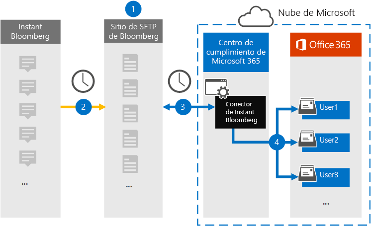

# Configurar un conector para archivar datos de Instant Bloomberg

Use un conector nativo en el centro de cumplimiento de Microsoft 365 para importar y archivar datos de chat de servicios financieros desde la herramienta de colaboración de [Bloomberg](https://www.bloomberg.com/professional/product/collaboration/) . Después de configurar y configurar un conector, se conecta al sitio FTP seguro (SFTP) de su organización una vez al día, convierte el contenido de los mensajes de chat en un formato de mensaje de correo electrónico y, a continuación, importa esos elementos a los buzones en Microsoft 365.

Una vez que se almacenan los datos instantáneos de Bloomberg en los buzones de usuario, puede aplicar las características de cumplimiento de Microsoft 365, como retención por juicio, búsqueda de contenido, archivado local, auditoría, cumplimiento de comunicación y directivas de retención de Microsoft 365 a los datos instantáneos de Bloomberg. Por ejemplo, puede buscar mensajes instantáneos de chat mediante la búsqueda de contenido o asociar el buzón de correo que contiene los datos de Bloomberg instantáneo con un custodio en un caso de eDiscovery avanzado. El uso de un conector de Bloomberg instantáneo para importar y archivar datos en Microsoft 365 puede ayudar a su organización a cumplir con las directivas gubernamentales y regulatorias.

## Información general sobre el archivado de datos de Bloomberg Instant

En la siguiente introducción se explica el proceso de uso de un conector para archivar datos de los chats instantáneos de Bloomberg en Microsoft 365. 

1. Su organización trabaja con Bloomberg para configurar un sitio de SFTP de Bloomberg. También trabajará con Bloomberg para configurar el sitio web Bloomberg para copiar los mensajes de chat en su sitio de SFTP de Bloomberg.

2. Una vez cada 24 horas, los mensajes de chat de Bloomberg instantáneo se copian en el sitio de SFTP de Bloomberg.
    
3. El conector de Bloomberg instantáneo que se crea en el centro de cumplimiento de Microsoft 365 se conecta al sitio de SFTP de Bloomberg todos los días y transfiere los mensajes de chat de las 24 horas anteriores a un área de almacenamiento seguro de Azure en la nube de Microsoft. El conector también convierte el contenido de un chat en un formato de mensaje de correo electrónico.
    
4. El conector importa los elementos de mensaje de chat al buzón de un usuario específico. Se creará una nueva carpeta llamada InstantBloomberg en el buzón de correo del usuario específico y se importarán los elementos en ella. El conector lo hace mediante el valor de la propiedad *CorporateEmailAddress* . Todos los mensajes de chat contienen esta propiedad, que se rellena con la dirección de correo electrónico de cada participante del mensaje de chat. Además de la asignación automática de usuarios mediante el valor de la propiedad *CorporateEmailAddress* , también puede definir una asignación personalizada mediante la carga de un archivo de asignación CSV. Este archivo de asignación debe contener un UUID de Bloomberg y la dirección de buzón de correo de Microsoft 365 correspondiente a cada usuario. Si habilita la asignación automática de usuarios y proporciona una asignación personalizada, para cada elemento de chat el conector examinará primero el archivo de asignación personalizado. Si no encuentra un usuario válido de Microsoft 365 que se corresponda con el UUID del usuario, el conector usará la propiedad *CorporateEmailAddress* del elemento de chat. Si el conector no encuentra un usuario válido de Microsoft 365 en el archivo de asignación personalizado o en la propiedad *CorporateEmailAddress* del elemento de chat, no se importará el elemento.

## Antes de empezar

Muchos de los pasos de implementación necesarios para archivar datos instantáneos de Bloomberg son externos a Microsoft 365 y deben completarse antes de poder crear el conector en el centro de cumplimiento.

- La organización debe permitir que el servicio de importación de Office 365 obtenga acceso a los datos de buzones de la organización. Para dar su consentimiento a esta solicitud, vaya a [esta página](https://login.microsoftonline.com/common/oauth2/authorize?client_id=570d0bec-d001-4c4e-985e-3ab17fdc3073&response_type=code&redirect_uri=https://portal.azure.com/&nonce=1234&prompt=admin_consent), inicie sesión con las credenciales de un administrador global y, después, acepte la solicitud. Debe completar este paso antes de poder crear correctamente el conector Bloomberg instantáneo en el paso 3.

- Suscríbase a [Bloomberg Anywhere](https://www.bloomberg.com/professional/product/remote-access/?bbgsum-page=DG-WS-PROF-PROD-BBA). Esto es necesario para que pueda iniciar sesión en Bloomberg Anywhere para acceder al sitio Bloomberg SFTP que debe configurar y configurar.

- Configure un sitio Bloomberg SFTP (protocolo seguro de transferencia de archivos). Después de trabajar con Bloomberg para configurar el sitio de SFTP, los datos de Bloomberg instantáneo se cargan al sitio de SFTP todos los días. El conector que se crea en el paso 2 se conecta a este sitio de SFTP y transfiere los datos de chat a buzones de correo de Microsoft 365. SFTP también cifra los datos de los chats de Bloomberg instantáneos que se envían a los buzones durante el proceso de transferencia.

    Para obtener información sobre Bloomberg SFTP (también denominado *BB-SFTP*):

    - Consulte el documento "estándares de conectividad de SFTP" en el [soporte de Bloomberg](https://www.bloomberg.com/professional/support/documentation/).
    
    - Póngase en contacto con el [soporte al cliente de Bloomberg](https://service.bloomberg.com/portal/sessions/new?utm_source=bloomberg-menu&utm_medium=csc).

    Después de trabajar con Bloomberg para configurar un sitio de SFTP, Bloomberg le proporcionará cierta información después de que responda al mensaje de correo electrónico de implementación de Bloomberg. Guarde una copia de la siguiente información. Se usa para configurar un conector en el paso 3.

    - Código de empresa, que es un identificador de su organización y se usa para iniciar sesión en el sitio de SFTP de Bloomberg.

    - Contraseña para el sitio de SFTP de Bloomberg

    - Dirección URL para el sitio de SFTP de Bloomberg (por ejemplo, sftp.bloomberg.com)

    - Número de puerto para el sitio de SFTP de Bloomberg

- El usuario que crea un conector para Bloomberg instantáneo en el paso 3 (y que descarga las claves públicas y la dirección IP en el paso 1) debe tener asignado el rol importación y exportación de buzones de correo en Exchange Online. Esto es necesario para agregar conectores en la página **conectores de datos** en el centro de cumplimiento de Microsoft 365. Este rol no está asignado a ningún grupo de roles de Exchange Online de forma predeterminada. Puede Agregar el rol importación y exportación de buzones al grupo de funciones de administración de la organización en Exchange Online. O bien, puede crear un grupo de roles, asignar el rol de importación y exportación de buzones de correo y, a continuación, agregar los usuarios adecuados como miembros. Para obtener más información, vea las secciones [crear grupos](https://docs.microsoft.com/Exchange/permissions-exo/role-groups#create-role-groups) de roles o [modificar grupos de roles](https://docs.microsoft.com/Exchange/permissions-exo/role-groups#modify-role-groups) en el artículo sobre la administración de grupos de roles en Exchange Online.

## Paso 1: obtener las claves públicas SSH y PGP

El primer paso es obtener una copia de las claves públicas para el shell seguro (SSH) y Pretty Good Privacy (PGP). Use estas claves en el paso 2 para configurar el sitio de SFTP de Bloomberg para permitir que el conector (creado en el paso 3) se conecte al sitio de SFTP y transfiera los datos instantáneos de Bloomberg chat a buzones de correo de Microsoft 365. También puede obtener una dirección IP en este paso, que se usa al configurar el sitio Bloomberg de SFTP.

1. Vaya a <https://compliance.microsoft.com> y haga clic en **conectores** > de datos, de**inmediato, Bloomberg**.

2. En la página Descripción del producto **Bloomberg instantáneo** , haga clic en **Agregar conector** .

3. En la página **condiciones de servicio** , haga clic en **Aceptar**.

4. En el paso 1 del **sitio de agregar credenciales para Bloomberg SFTP** , haga clic en **Descargar clave ssh**, **Descargar clave PGP**y descargar vínculos de **dirección IP** para guardar una copia de cada archivo en el equipo local. Estos archivos contienen los siguientes elementos que se usan para configurar el sitio Bloomberg de SFTP en el paso 2:

   - Clave pública SSH: esta clave se usa para configurar Secure Shell (SSH) para habilitar un inicio de sesión remoto seguro cuando el conector se conecta al sitio Bloomberg de SFTP.

   - Clave pública PGP: esta clave se usa para configurar el cifrado de datos que se transfieren desde el sitio de SFTP de Bloomberg a Microsoft 365.

   - Dirección IP: el sitio Bloomberg de SFTP está configurado para aceptar una solicitud de conexión solo desde esta dirección IP, que se usa en el conector para Bloomberg instantáneo que se crea en el paso 3. 

5. Haga clic en **Cancelar** para cerrar el asistente. Vuelva a este asistente en el paso 3 para crear el conector.

## Paso 2: configurar el sitio de SFTP de Bloomberg

El siguiente paso es usar las claves públicas SSH y PGP y la dirección IP que obtuvo en el paso 1 para configurar la autenticación SSH y el cifrado PGP para el sitio de SFTP de Bloomberg. Esto permite que el conector de Bloomberg instantáneo que crea en el paso 3 se conecte al sitio Bloomberg de SFTP y transfiera datos instantáneos de Bloomberg a Microsoft 365. Debe trabajar con el servicio de soporte al cliente de Bloomberg para configurar su sitio de SFTP. Póngase en contacto con el [soporte al cliente de Bloomberg](https://service.bloomberg.com/portal/sessions/new?utm_source=bloomberg-menu&utm_medium=csc) para obtener ayuda. 

> [!IMPORTANT]
> Bloomberg recomienda adjuntar los tres archivos que descargó en el paso 1 a un mensaje de correo electrónico y enviarlo a su equipo de atención al cliente cuando trabaja con ellos para configurar el sitio de SFTP de Bloomberg.

## Paso 3: crear un conector de Bloomberg instantáneo

El último paso es crear un conector de Bloomberg instantáneo en el centro de cumplimiento de Microsoft 365. El conector usa la información que proporciona para conectarse al sitio Bloomberg de SFTP y transferir los mensajes de chat a los cuadros de buzón de usuario correspondientes en Microsoft 365. 

1. Vaya a <https://compliance.microsoft.com> y haga clic en **conectores** > de datos, de**inmediato, Bloomberg**.

2. En la página Descripción del producto **Bloomberg instantáneo** , haga clic en **Agregar conector** .

3. En la página **condiciones de servicio** , haga clic en **Aceptar**.

4. En la página **agregar credenciales para Bloomberg SFTP** , en el paso 3, escriba la información necesaria en los siguientes cuadros y, a continuación, haga clic en **siguiente**.

    - **Código de empresa:** El identificador de la organización que se usa como nombre de usuario para el sitio de SFTP de Bloomberg.

    - **Contraseña:** Contraseña para un sitio de SFTP de Bloomberg.

    - **dirección URL de SFTP:** La URL para el sitio de SFTP de Bloomberg (por ejemplo, sftp.bloomberg.com).

    - **Puerto SFTP:** El número de puerto para el sitio de SFTP de Bloomberg. El conector usa este puerto para conectarse al sitio de SFTP.

5. En la página **asignación de usuarios** , habilite la asignación automática de usuarios y proporcione una asignación de usuario personalizada según sea necesario.

   > [!NOTE]
   > El conector importa los elementos de mensaje de chat al buzón de un usuario específico. Se creará una nueva carpeta llamada **InstantBloomberg** en el buzón de correo del usuario específico y se importarán los elementos en ella. El conector usa el valor de la propiedad *CorporateEmailAddress* . Todos los mensajes de chat contienen esta propiedad y la propiedad se rellena con la dirección de correo electrónico de cada participante del mensaje de chat. Además de la asignación automática de usuarios mediante el valor de la propiedad *CorporateEmailAddress* , también puede definir una asignación personalizada mediante la carga de un archivo de asignación CSV. El archivo de asignación debe contener el UUID de Bloomberg y la dirección de buzón de correo de Microsoft 365 correspondiente a cada usuario. Si habilita la asignación automática de usuarios y proporciona una asignación de asignación personalizada, para cada elemento de chat el conector examinará primero el archivo de asignación personalizado. Si no encuentra un usuario válido de Microsoft 365 que se corresponda con el UUID del usuario, el conector usará la propiedad *CorporateEmailAddress* del elemento de chat. Si el conector no encuentra un usuario válido de Microsoft 365 en el archivo de asignación personalizado o en la propiedad *CorporateEmailAddress* del elemento de chat, no se importará el elemento.

6. Haga clic en **siguiente**, revise la configuración y, a continuación, haga clic en **preparar** para crear el conector.

7. Vaya a la página **conectores de datos** para ver el progreso del proceso de importación del nuevo conector.
