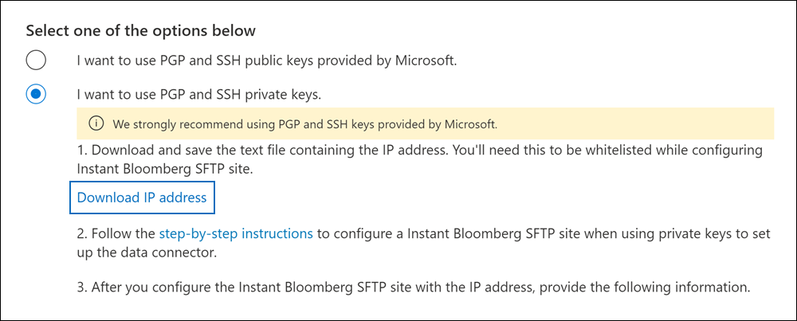

# Configurar un conector para archivar datos de Instant Bloomberg

Use un conector nativo en el portal de cumplimiento de Microsoft Purview para importar y archivar datos de chat de servicios financieros desde la herramienta de colaboración [Instant Bloomberg](https://www.bloomberg.com/professional/product/collaboration/) . Después de configurar y configurar un conector, se conecta al sitio FTP seguro (SFTP) de Bloomberg de su organización una vez al día, convierte el contenido de los mensajes de chat a un formato de mensaje de correo electrónico y, a continuación, importa esos elementos a buzones de correo en Microsoft 365.

Una vez que los datos de Instant Bloomberg se almacenan en buzones de usuario, puede aplicar características de Microsoft Purview como suspensión por juicio, búsqueda de contenido, archivado de In-Place, auditoría, cumplimiento de comunicaciones y directivas de retención de Microsoft 365 a datos de Bloomberg instantáneos. Por ejemplo, puede buscar mensajes de chat de Instant Bloomberg mediante Búsqueda de contenido o asociar el buzón que contiene los datos de Instant Bloomberg con un custodio en un caso de exhibición de documentos electrónicos de Microsoft Purview (Premium). El uso de un conector de Bloomberg instantáneo para importar y archivar datos en Microsoft 365 puede ayudar a su organización a cumplir las directivas gubernamentales y normativas.

## Información general sobre el archivado de datos de Instant Bloomberg

En la información general siguiente se explica el proceso de uso de un conector para archivar los datos de chat de Instant Bloomberg en Microsoft 365. 

1. Su organización trabaja con Bloomberg para configurar un sitio de Bloomberg SFTP. También trabajará con Bloomberg para configurar Instant Bloomberg para copiar mensajes de chat en su sitio de Bloomberg SFTP.

2. Una vez cada 24 horas, los mensajes de chat de Instant Bloomberg se copian en el sitio de Bloomberg SFTP.

3. El conector de Instant Bloomberg que se crea en el portal de cumplimiento se conecta al sitio de Bloomberg SFTP todos los días y transfiere los mensajes de chat de las 24 horas anteriores a un área de Azure Storage segura en Microsoft Cloud. El conector también convierte el contenido de un masaje de chat en un formato de mensaje de correo electrónico.

4. El conector importa los elementos de mensaje de chat al buzón de un usuario específico. Se crea una nueva carpeta denominada InstantBloomberg en el buzón de correo del usuario específico y los elementos se importarán a ella. Para ello, el conector usa el valor de la propiedad *CorporateEmailAddress* . Cada mensaje de chat contiene esta propiedad, que se rellena con la dirección de correo electrónico de cada participante del mensaje de chat. Además de la asignación automática de usuarios mediante el valor de la propiedad *CorporateEmailAddress* , también puede definir una asignación personalizada mediante la carga de un archivo de asignación CSV. Este archivo de asignación debe contener un UUID de Bloomberg y la dirección de buzón Microsoft 365 correspondiente para cada usuario. Si habilita la asignación automática de usuarios y proporciona una asignación personalizada, para cada elemento de chat, el conector examinará primero el archivo de asignación personalizada. Si no encuentra un usuario Microsoft 365 válido que corresponda al UUID de Bloomberg de un usuario, el conector usará la propiedad *CorporateEmailAddress* del elemento de chat. Si el conector no encuentra un usuario Microsoft 365 válido en el archivo de asignación personalizada o en la propiedad *CorporateEmailAddress* del elemento de chat, el elemento no se importará.

## Antes de configurar un conector

Algunos de los pasos de implementación necesarios para archivar los datos de Instant Bloomberg son externos a Microsoft 365 y deben completarse para poder crear el conector en el centro de cumplimiento.

- Para configurar un conector de Instant Bloomberg, debe usar claves y frases de contraseña para Pretty Good Privacy (PGP) y Secure Shell (SSH). Estas claves se usan para configurar el sitio DE SFTP de Bloomberg y las usa el conector para conectarse al sitio de Bloomberg SFTP con el fin de importar datos a Microsoft 365. La clave PGP se usa para configurar el cifrado de datos que se transfieren desde el sitio de Bloomberg SFTP a Microsoft 365. La clave SSH se usa para configurar el shell seguro para habilitar un inicio de sesión remoto seguro cuando el conector se conecta al sitio de Bloomberg SFTP.

  Al configurar un conector, tiene la opción de usar claves públicas y contraseñas de clave proporcionadas por Microsoft o puede usar sus propias claves privadas y frases de contraseña. Se recomienda usar las claves públicas proporcionadas por Microsoft. Sin embargo, si su organización ya ha configurado un sitio de Bloomberg SFTP mediante claves privadas, puede crear un conector con estas mismas claves privadas.

- Suscríbase a [Bloomberg Anywhere](https://www.bloomberg.com/professional/product/remote-access/?bbgsum-page=DG-WS-PROF-PROD-BBA). Esto es necesario para que pueda iniciar sesión en Bloomberg Anywhere para acceder al sitio de Bloomberg SFTP que tiene que configurar.

- Configure un sitio de Bloomberg SFTP (protocolo seguro de transferencia de archivos). Después de trabajar con Bloomberg para configurar el sitio SFTP, los datos de Instant Bloomberg se cargan en el sitio SFTP todos los días. El conector que cree en el paso 2 se conecta a este sitio SFTP y transfiere los datos de chat a Microsoft 365 buzones. SFTP también cifra los datos de chat de Instant Bloomberg que se envían a los buzones durante el proceso de transferencia.

  Para obtener información sobre Bloomberg SFTP (también llamado *BB-SFTP*):

  - Consulte el documento "Estándares de conectividad SFTP" en [Soporte técnico de Bloomberg](https://www.bloomberg.com/professional/support/documentation/).

  - Póngase en contacto con [el servicio de atención al cliente de Bloomberg](https://service.bloomberg.com/portal/sessions/new?utm_source=bloomberg-menu&utm_medium=csc).

  Después de trabajar con Bloomberg para configurar un sitio SFTP, Bloomberg le proporcionará información después de responder al mensaje de correo electrónico de implementación de Bloomberg. Guarde una copia de la siguiente información. Se usa para configurar un conector en el paso 3.

  - Código firme, que es un identificador para su organización y se usa para iniciar sesión en el sitio de Bloomberg SFTP.

  - Contraseña para el sitio de Bloomberg SFTP

  - Dirección URL del sitio SFTP de Bloomberg (por ejemplo, sftp.bloomberg.com)

  - Número de puerto para el sitio de Bloomberg SFTP

- El conector Instant Bloomberg puede importar un total de 200 000 elementos en un solo día. Si hay más de 200 000 elementos en el sitio SFTP, ninguno de esos elementos se importará a Microsoft 365.

- Al usuario que crea un conector de Instant Bloomberg en el paso 3 (y que descarga las claves públicas y la dirección IP en el paso 1) se le debe asignar el rol Administrador del conector de datos. Este rol es necesario para agregar conectores en la página **Conectores de datos** del portal de cumplimiento. Este rol se agrega de forma predeterminada a varios grupos de roles. Para obtener una lista de estos grupos de roles, consulte la sección "Roles en los centros de seguridad y cumplimiento" de [Permisos en el Centro de cumplimiento de & seguridad](../security/office-365-security/permissions-in-the-security-and-compliance-center.md#roles-in-the-security--compliance-center). Como alternativa, un administrador de su organización puede crear un grupo de roles personalizado, asignar el rol Administrador del conector de datos y, a continuación, agregar los usuarios adecuados como miembros. Para obtener instrucciones, consulte la sección "Crear un grupo de roles personalizado" en [Permisos en el portal de cumplimiento de Microsoft Purview](microsoft-365-compliance-center-permissions.md#create-a-custom-role-group).

## Configuración de un conector mediante claves públicas

Los pasos de esta sección muestran cómo configurar un conector de Bloomberg instantáneo mediante las claves públicas para Pretty Good Privacy (PGP) y Secure Shell (SSH).

### Paso 1: Obtener PGP y SSH y claves públicas

El primer paso es obtener una copia de las claves públicas para Pretty Good Privacy (PGP) y Secure Shell (SSH). Estas claves se usan en el paso 2 para configurar el sitio de Bloomberg SFTP para permitir que el conector (que se crea en el paso 3) se conecte al sitio SFTP y transfiera los datos de chat de Bloomberg instantáneos a Microsoft 365 buzones. También obtendrá una dirección IP en este paso, que usará al configurar el sitio de Bloomberg SFTP.

1. Vaya a <https://compliance.microsoft.com> y haga clic en **Conectores de datos** en el panel de navegación izquierdo.

2. En la página **Conectores de datos** en **Instant Bloomberg**, haga clic en **Ver**.

3. En la página de descripción del producto **Instant Bloomberg** , haga clic en **Agregar conector.**

4. En la página **Términos de servicio** , haga clic en **Aceptar**.

5. En la página **Agregar credenciales para el origen de contenido** , haga clic en **Quiero usar las claves públicas PGP y SSH proporcionadas por Microsoft**.

   

6. En el paso 1, haga clic en los vínculos **Descargar clave SSH**, **Descargar clave PGP** y **Descargar dirección IP** para guardar una copia de cada archivo en el equipo local.

   

   Estos archivos contienen los siguientes elementos que se usan para configurar el sitio de Bloomberg SFTP en el paso 2:

   - Clave pública PGP: esta clave se usa para configurar el cifrado de datos que se transfieren desde el sitio de Bloomberg SFTP a Microsoft 365.

   - Clave pública SSH: esta clave se usa para configurar el shell seguro para habilitar un inicio de sesión remoto seguro cuando el conector se conecta al sitio de Bloomberg SFTP.

   - Dirección IP: el sitio de Bloomberg SFTP está configurado para aceptar solicitudes de conexión de esta dirección IP. El conector Instant Bloomberg usa la misma dirección IP para conectarse al sitio SFTP y transferir datos de Instant Bloomberg a Microsoft 365.

7. Haga clic en **Cancelar** para cerrar el asistente. Vuelva a este asistente en el paso 3 para crear el conector.

### Paso 2: Configuración del sitio de Bloomberg SFTP

El siguiente paso es usar las claves públicas PGP y SSH y la dirección IP que obtuvo en el paso 1 para configurar el cifrado PGP y la autenticación SSH para el sitio SFTP de Bloomberg. Esto permite que el conector De Bloomberg instantáneo que se crea en el paso 3 se conecte al sitio de Bloomberg SFTP y transfiera los datos de Instant Bloomberg a Microsoft 365. Debe trabajar con el servicio de atención al cliente de Bloomberg para configurar su sitio de Bloomberg SFTP. Póngase en contacto con [el servicio de atención al cliente de Bloomberg](https://service.bloomberg.com/portal/sessions/new?utm_source=bloomberg-menu&utm_medium=csc) para obtener ayuda. 

> [!IMPORTANT]
> Bloomberg recomienda adjuntar los tres archivos que descargó en el paso 1 a un mensaje de correo electrónico y enviarlo a su equipo de soporte al cliente cuando trabaje con ellos para configurar su sitio de Bloomberg SFTP.

### Paso 3: Crear un conector de Bloomberg instantáneo

El último paso es crear un conector de Instant Bloomberg en el portal de cumplimiento. El conector usa la información que proporciona para conectarse al sitio de Bloomberg SFTP y transferir mensajes de chat a los cuadros de buzón de usuario correspondientes en Microsoft 365.

1. Vaya a y, a <https://compliance.microsoft.com> continuación, haga clic en **Conectores de** >  **datosInstant Bloomberg**.

2. En la página de descripción del producto **Instant Bloomberg** , haga clic en **Agregar conector.**

3. En la página **Términos de servicio** , haga clic en **Aceptar**.

4. En la página **Add credentials for Bloomberg SFTP site (Agregar credenciales para Bloomberg SFTP** ), en el paso 3, escriba la información necesaria en los cuadros siguientes y, a continuación, haga clic en **Siguiente**.

    - **Código firme:** Identificador de la organización que se usa como nombre de usuario para el sitio de Bloomberg SFTP.

    - **Contraseña:** Contraseña para el sitio de Bloomberg SFTP.

    - **DIRECCIÓN URL de SFTP:** Dirección URL del sitio SFTP de Bloomberg (por ejemplo, `sftp.bloomberg.com`). También puede usar una dirección IP para este valor.

    - **Puerto SFTP:** Número de puerto del sitio SFTP de Bloomberg. El conector usa este puerto para conectarse al sitio SFTP.

5. En la página **Definir usuario** , seleccione una de las siguientes opciones para especificar los usuarios cuyos datos desea importar.

    - **Todos los usuarios de la organización**. Seleccione esta opción para importar datos para todos los usuarios.

    - **Solo usuarios en suspensión por juicio**. Seleccione esta opción para importar datos solo para los usuarios cuyos buzones están en suspensión por juicio. Esta opción importa datos a buzones de usuario que tienen la propiedad LitigationHoldEnabled establecida en True. Para obtener más información, consulte [Creación de una suspensión por litigio](create-a-litigation-hold.md).

6. En la página **Seleccionar tipos de datos que se van a importar**, seleccione los tipos de datos necesarios que se van a importar aparte de **Mensajes**.

7. En la página **Asignar usuarios de Bloomberg instantáneos a Microsoft 365 usuarios**, habilite la asignación automática de usuarios y proporcione la asignación de usuarios personalizada según sea necesario.

   > [!NOTE]
   > El conector importa los elementos de mensaje de chat al buzón de un usuario específico. Se crea una nueva carpeta denominada **InstantBloomberg** en el buzón de correo del usuario específico y los elementos se importarán a ella. El conector lo hace mediante el valor de la propiedad *CorporateEmailAddress* . Cada mensaje de chat contiene esta propiedad y la propiedad se rellena con la dirección de correo electrónico de cada participante del mensaje de chat. Además de la asignación automática de usuarios mediante el valor de la propiedad *CorporateEmailAddress* , también puede definir la asignación personalizada mediante la carga de un archivo de asignación CSV. El archivo de asignación debe contener el UUID de Bloomberg y la dirección de buzón de Microsoft 365 correspondiente para cada usuario. Si habilita la asignación automática de usuarios y proporciona una asignación personalizada, para cada elemento de chat, el conector examinará primero el archivo de asignación personalizado. Si no encuentra un usuario Microsoft 365 válido que corresponda al UUID de Bloomberg de un usuario, el conector usará la propiedad *CorporateEmailAddress* del elemento de chat. Si el conector no encuentra un usuario Microsoft 365 válido en el archivo de asignación personalizado o en la propiedad *CorporateEmailAddress* del elemento de chat, el elemento no se importará.

7. Haga clic en **Siguiente**, revise la configuración y, a continuación, haga clic en **Finalizar** para crear el conector.

8. Vaya a la página **Conectores de datos** para ver el progreso del proceso de importación del nuevo conector. Haga clic en el conector para mostrar la página de control flotante, que contiene información sobre el conector.

## Configuración de un conector mediante claves privadas

En los pasos de esta sección se muestra cómo configurar un conector de Bloomberg instantáneo mediante claves privadas PGP y SSH. Esta opción de configuración del conector está pensada para organizaciones que ya han configurado un sitio de Bloomberg SFTP mediante claves privadas.

### Paso 1: Obtener una dirección IP para configurar el sitio de Bloomberg SFTP

> [!NOTE]
> Si su organización ha configurado previamente un sitio SFTP de Bloomberg para archivar los datos de mensajes de Bloomberg mediante claves privadas PGP y SSH, no es necesario configurar otro. Puede especificar el mismo sitio SFTP al crear el conector en el paso 2.

Si su organización ha usado claves privadas PGP y SSH para configurar un sitio de Bloomberg SFTP, tendrá que obtener una dirección IP y proporcionarla al servicio de atención al cliente de Bloomberg. El sitio DE SFTP de Bloomberg debe configurarse para aceptar solicitudes de conexión de esta dirección IP. El conector Instant Bloomberg usa la misma dirección IP para conectarse al sitio SFTP y transferir datos de Instant Bloomberg a Microsoft 365.

Para obtener la dirección IP:

1. Vaya a <https://compliance.microsoft.com> y haga clic en **Conectores de datos** en el panel de navegación izquierdo.

2. En la página **Conectores de datos** en **Instant Bloomberg**, haga clic en **Ver**.

3. En la página de descripción del producto **Instant Bloomberg** , haga clic en **Agregar conector.**

4. En la página **Términos de servicio** , haga clic en **Aceptar**.

5. En la página **Agregar credenciales para el origen de contenido** , haga clic en **Quiero usar claves privadas PGP y SSH**.

6. En el paso 1, haga clic en **Descargar dirección IP** para guardar una copia del archivo de dirección IP en el equipo local.

   

7. Haga clic en **Cancelar** para cerrar el asistente. Vuelva a este asistente en el paso 2 para crear el conector.

Debe trabajar con el servicio de atención al cliente de Bloomberg para configurar su sitio de Bloomberg SFTP para aceptar solicitudes de conexión desde esta dirección IP. Póngase en contacto con [el servicio de atención al cliente de Bloomberg](https://service.bloomberg.com/portal/sessions/new?utm_source=bloomberg-menu&utm_medium=csc) para obtener ayuda.

### Paso 2: Crear un conector de Bloomberg instantáneo

Una vez configurado el sitio de Bloomberg SFTP, el siguiente paso es crear un conector de Bloomberg instantáneo en el portal de cumplimiento. El conector usa la información que proporciona para conectarse al sitio de Bloomberg SFTP y transferir mensajes de correo electrónico a los cuadros de buzón de usuario correspondientes en Microsoft 365. Para completar este paso, asegúrese de tener copias de las mismas claves privadas y contraseñas de clave que usó para configurar el sitio de Bloomberg SFTP.

1. Vaya a <https://compliance.microsoft.com> y haga clic en **Conectores de datos** en el panel de navegación izquierdo.

2. En la página **Conectores de datos** en **Instant Bloomberg**, haga clic en **Ver**.

3. En la página de descripción del producto **Instant Bloomberg** , haga clic en **Agregar conector.**

4. En la página **Términos de servicio** , haga clic en **Aceptar**.

5. En la página **Agregar credenciales para el origen de contenido** , haga clic en **Quiero usar claves privadas PGP y SSH**.

   

6. En el paso 3, escriba la información necesaria en los cuadros siguientes y, a continuación, haga clic en **Validar conexión**.

      - **Nombre:** Nombre del conector. Debe ser único en su organización.

      - **Código firme:** Identificador de la organización que se usa como nombre de usuario para el sitio de Bloomberg SFTP.

      - **Contraseña:** La contraseña del sitio SFTP de Bloomberg de la organización.

      - **DIRECCIÓN URL de SFTP:** Dirección URL del sitio DE SFTP de Bloomberg (por ejemplo, `sftp.bloomberg.com`). También puede usar una dirección IP para este valor.

      - **Puerto SFTP:** Número de puerto del sitio de Bloomberg SFTP. El conector usa este puerto para conectarse al sitio SFTP.

      - **Clave privada PGP:** Clave privada PGP para el sitio de Bloomberg SFTP. Asegúrese de incluir todo el valor de clave privada, incluidas las líneas inicial y final del bloque de claves.

      - **Frase de contraseña de clave PGP:** Frase de contraseña de la clave privada PGP.

      - **Clave privada SSH:** Clave privada SSH para el sitio de Bloomberg SFTP. Asegúrese de incluir todo el valor de clave privada, incluidas las líneas inicial y final del bloque de claves.

      - **Frase de contraseña de clave SSH:** Frase de contraseña de la clave privada SSH.

7. Una vez validada correctamente la conexión, haga clic en **Siguiente**.

8. En la página **Definir usuario** , seleccione una de las siguientes opciones para especificar los usuarios cuyos datos desea importar.

    - **Todos los usuarios de la organización**. Seleccione esta opción para importar datos para todos los usuarios.

    - **Solo usuarios en suspensión por juicio**. Seleccione esta opción para importar datos solo para los usuarios cuyos buzones están en suspensión por juicio. Esta opción importa datos a buzones de usuario que tienen la propiedad LitigationHoldEnabled establecida en True. Para obtener más información, consulte [Creación de una suspensión por litigio](create-a-litigation-hold.md).

9. En la página **Map Instant Bloomberg users to Microsoft 365 users (Asignar usuarios instantáneos de Bloomberg para Microsoft 365 usuarios**), habilite la asignación automática de usuarios y proporcione la asignación de usuarios personalizada según sea necesario.

   > [!NOTE]
   > El conector importa los elementos de mensaje de chat al buzón de un usuario específico. Se crea una nueva carpeta denominada **InstantBloomberg** en el buzón de correo del usuario específico y los elementos se importarán a ella. El conector lo hace mediante el valor de la propiedad *CorporateEmailAddress* . Cada mensaje de chat contiene esta propiedad y la propiedad se rellena con la dirección de correo electrónico de cada participante del mensaje de chat. Además de la asignación automática de usuarios mediante el valor de la propiedad *CorporateEmailAddress* , también puede definir la asignación personalizada mediante la carga de un archivo de asignación CSV. El archivo de asignación debe contener el UUID de Bloomberg y la dirección de buzón de Microsoft 365 correspondiente para cada usuario. Si habilita la asignación automática de usuarios y proporciona una asignación personalizada, para cada elemento de chat, el conector examinará primero el archivo de asignación personalizado. Si no encuentra un usuario Microsoft 365 válido que corresponda al UUID de Bloomberg de un usuario, el conector usará la propiedad *CorporateEmailAddress* del elemento de chat. Si el conector no encuentra un usuario Microsoft 365 válido en el archivo de asignación personalizado o en la propiedad *CorporateEmailAddress* del elemento de chat, el elemento no se importará.

10. Haga clic en **Siguiente**, revise la configuración y, a continuación, haga clic en **Finalizar** para crear el conector.

11. Vaya a la página **Conectores de datos** para ver el progreso del proceso de importación del nuevo conector. Haga clic en el conector para mostrar la página de control flotante, que contiene información sobre el conector.
