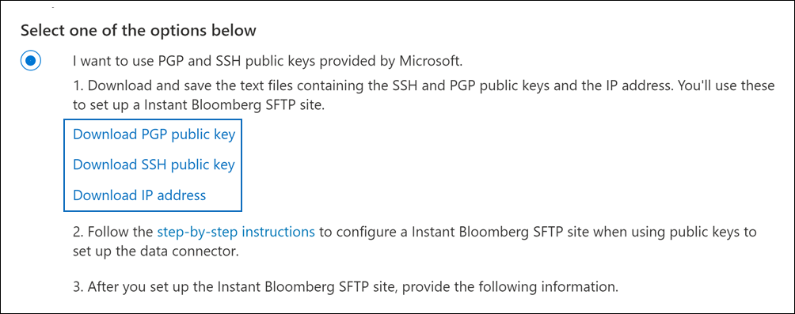

# Configurar un conector para archivar datos de Instant BloombergSet up a connector to archive Instant Bloomberg data

Use un conector nativo en el Centro de cumplimiento de Microsoft 365 para importar y archivar datos de chat de servicios financieros desde la herramienta de colaboración [Instant Bloomberg.](https://www.bloomberg.com/professional/product/collaboration/)Use a native connector in the Microsoft 365 compliance center to import and archive financial services chat data from the [Instant Bloomberg](https://www.bloomberg.com/professional/product/collaboration/) collaboration tool. Después de configurar y configurar un conector, se conecta al sitio FTP seguro (SFTP) de Bloomberg de su organización una vez al día, convierte el contenido de los mensajes de chat en un formato de mensaje de correo electrónico y, a continuación, importa esos elementos a buzones de Microsoft 365.After you set up and configure a connector, it connects to your organization's Bloomberg secure FTP site (SFTP) once every day, converts the content of chat messages to an email message format, and then imports those items to mailboxes in Microsoft 365.

Después de almacenar los datos de Instant Bloomberg en buzones de usuario, puede aplicar características de cumplimiento de Microsoft 365 como retención por juicio, búsqueda de contenido, archivado de In-Place, auditoría, cumplimiento de comunicaciones y directivas de retención de Microsoft 365 a los datos de Instant Bloomberg.After Instant Bloomberg data is stored in user mailboxes, you can apply Microsoft 365 compliance features such as Litigation Hold, Content Search, In-Place Archiving, Auditing, Communication compliance, and Microsoft 365 retention policies to Instant Bloomberg data. Por ejemplo, puede buscar mensajes de chat de Instant Bloomberg con búsqueda de contenido o asociar el buzón que contiene los datos de Instant Bloomberg con un custodio en un caso de exhibición de documentos electrónicos avanzado.For example, you can search Instant Bloomberg chat messages using Content Search or associate the mailbox that contains the Instant Bloomberg data with a custodian in an Advanced eDiscovery case. El uso de un conector de Instant Bloomberg para importar y archivar datos en Microsoft 365 puede ayudar a su organización a cumplir con las directivas gubernamentales y reglamentarias.Using an Instant Bloomberg connector to import and archive data in Microsoft 365 can help your organization stay compliant with government and regulatory policies.

## Información general sobre el archivado de datos de Instant BloombergOverview of archiving Instant Bloomberg data

En la siguiente introducción se explica el proceso de uso de un conector para archivar datos de chat de Instant Bloomberg en Microsoft 365.The following overview explains the process of using a connector to archive Instant Bloomberg chat data in Microsoft 365. 

1. Su organización trabaja con Bloomberg para configurar un sitio SFTP de Bloomberg.Your organization works with Bloomberg to set up a Bloomberg SFTP site. También trabajarás con Bloomberg para configurar Instant Bloomberg para copiar mensajes de chat en tu sitio sftp de Bloomberg.You'll also work with Bloomberg to configure Instant Bloomberg to copy chat messages to your Bloomberg SFTP site.

2. Una vez cada 24 horas, los mensajes de chat de Instant Bloomberg se copian en el sitio SFTP de Bloomberg.Once every 24 hours, chat messages from Instant Bloomberg are copied to the Bloomberg SFTP site.

3. El conector Instant Bloomberg que crea en el Centro de cumplimiento de Microsoft 365 se conecta al sitio SFTP de Bloomberg todos los días y transfiere los mensajes de chat de las 24 horas anteriores a un área segura de Azure Storage en Microsoft Cloud.The Instant Bloomberg connector that you create in the Microsoft 365 compliance center connects to the Bloomberg SFTP site every day and transfers the chat messages from the previous 24 hours to a secure Azure Storage area in the Microsoft Cloud. El conector también convierte el contenido de un masaje de chat a un formato de mensaje de correo electrónico.The connector also converts the content of a chat massage to an email message format.

4. El conector importa los elementos del mensaje de chat al buzón de un usuario específico.The connector imports the chat message items to the mailbox of a specific user. Se crea una nueva carpeta denominada InstantBloomberg en el buzón del usuario específico y los elementos se importarán a él.A new folder named InstantBloomberg is created in the specific user's mailbox and the items will be imported to it. El conector hace esto mediante el valor de la *propiedad CorporateEmailAddress.*The connector does this by using the value of the *CorporateEmailAddress* property. Cada mensaje de chat contiene esta propiedad, que se rellena con la dirección de correo electrónico de cada participante del mensaje de chat.Every chat message contains this property, which is populated with the email address of every participant of the chat message. Además de la asignación automática de usuarios mediante el valor de la propiedad *CorporateEmailAddress,* también puede definir una asignación personalizada cargando un archivo de asignación CSV.In addition to automatic user mapping using the value of the *CorporateEmailAddress* property, you can also define a custom mapping by uploading a CSV mapping file. Este archivo de asignación debe contener un UUID de Bloomberg y la dirección de buzón de Microsoft 365 correspondiente para cada usuario.This mapping file should contain a Bloomberg UUID and the corresponding Microsoft 365 mailbox address for each user. Si habilita la asignación automática de usuarios y proporciona una asignación personalizada, para cada elemento de chat, el conector primero verá el archivo de asignación personalizada.If you enable automatic user mapping and provide a custom mapping, for every chat item the connector will first look at custom-mapping file. Si no encuentra un usuario válido de Microsoft 365 que corresponda al UUID de Bloomberg de un usuario, el conector usará la propiedad *CorporateEmailAddress* del elemento de chat.If it doesn't find a valid Microsoft 365 user that corresponds to a user's Bloomberg UUID, the connector will use the *CorporateEmailAddress* property of the chat item. Si el conector no encuentra un usuario válido de Microsoft 365 en el archivo de asignación personalizada o en la propiedad *CorporateEmailAddress* del elemento de chat, el elemento no se importará.If the connector doesn't find a valid Microsoft 365 user in either the custom-mapping file or the *CorporateEmailAddress* property of the chat item, the item won't be imported.

## Antes de configurar un conectorBefore you set up a connector

Algunos de los pasos de implementación necesarios para archivar datos de Instant Bloomberg son externos a Microsoft 365 y deben completarse antes de poder crear el conector en el centro de cumplimiento.Some of the implementation steps required to archive Instant Bloomberg data are external to Microsoft 365 and must be completed before you can create the connector in the compliance center.

- Para configurar un conector Instant Bloomberg, debe usar claves y contraseñas clave para Pretty Good Privacy (PGP) y Secure Shell (SSH).To set up an Instant Bloomberg connector, you have to use keys and key passphrases for Pretty Good Privacy (PGP) and Secure Shell (SSH). Estas claves se usan para configurar el sitio SFTP de Bloomberg y las usa el conector para conectarse al sitio SFTP de Bloomberg para importar datos a Microsoft 365.These keys are used to configure the Bloomberg SFTP site and used by the connector to connect to the Bloomberg SFTP site to import data to Microsoft 365. La clave PGP se usa para configurar el cifrado de los datos que se transfieren desde el sitio SFTP de Bloomberg a Microsoft 365.The PGP key is used to configure the encryption of data that's transferred from the Bloomberg SFTP site to Microsoft 365. La clave SSH se usa para configurar el shell seguro para habilitar un inicio de sesión remoto seguro cuando el conector se conecta al sitio SFTP de Bloomberg.The SSH key is used to configure secure shell to enable a secure remote login when the connector connects to the Bloomberg SFTP site.

  Al configurar un conector, tiene la opción de usar claves públicas y contraseñas de clave proporcionadas por Microsoft o puede usar sus propias claves privadas y contraseñas.When setting up a connector, you have the option to use public keys and key passphrases provided by Microsoft or you can use your own private keys and passphrases. Se recomienda usar las claves públicas proporcionadas por Microsoft.We recommend that you use the public keys provided by Microsoft. Sin embargo, si su organización ya ha configurado un sitio SFTP de Bloomberg con claves privadas, puede crear un conector con estas mismas claves privadas.However, if your organization has already configured a Bloomberg SFTP site using private keys, then you can create a connector using these same private keys.

- Suscribirse [a Bloomberg Anywhere](https://www.bloomberg.com/professional/product/remote-access/?bbgsum-page=DG-WS-PROF-PROD-BBA).Subscribe to [Bloomberg Anywhere](https://www.bloomberg.com/professional/product/remote-access/?bbgsum-page=DG-WS-PROF-PROD-BBA). Esto es necesario para que pueda iniciar sesión en Bloomberg Anywhere para tener acceso al sitio SFTP de Bloomberg que debe configurar y configurar.This is required so that you can log in to Bloomberg Anywhere to access the Bloomberg SFTP site that you have to set up and configure.

- Configurar un sitio sftp de Bloomberg (protocolo de transferencia segura de archivos).Set up a Bloomberg SFTP (Secure file transfer protocol) site. Después de trabajar con Bloomberg para configurar el sitio SFTP, los datos de Instant Bloomberg se cargan en el sitio SFTP todos los días.After working with Bloomberg to set up the SFTP site, data from Instant Bloomberg is uploaded to the SFTP site every day. El conector que cree en el paso 2 se conecta a este sitio SFTP y transfiere los datos de chat a buzones de Microsoft 365.The connector you create in Step 2 connects to this SFTP site and transfers the chat data to Microsoft 365 mailboxes. SFTP también cifra los datos de chat de Instant Bloomberg que se envían a los buzones durante el proceso de transferencia.SFTP also encrypts the Instant Bloomberg chat data that is sent to mailboxes during the transfer process.

  Para obtener información sobre Bloomberg SFTP (también denominada *BB-SFTP):*For information about Bloomberg SFTP (also called *BB-SFTP*):

  - Consulte el documento "Estándares de conectividad SFTP" en [Soporte de Bloomberg](https://www.bloomberg.com/professional/support/documentation/).See the "SFTP Connectivity Standards" document at [Bloomberg Support](https://www.bloomberg.com/professional/support/documentation/).

  - Póngase en [contacto con el servicio de soporte al cliente de Bloomberg](https://service.bloomberg.com/portal/sessions/new?utm_source=bloomberg-menu&utm_medium=csc).Contact [Bloomberg customer support](https://service.bloomberg.com/portal/sessions/new?utm_source=bloomberg-menu&utm_medium=csc).

  Después de trabajar con Bloomberg para configurar un sitio SFTP, Bloomberg le proporcionará información después de responder al mensaje de correo electrónico de implementación de Bloomberg.After you work with Bloomberg to set up an SFTP site, Bloomberg will provide some information to you after you respond to the Bloomberg implementation email message. Guarde una copia de la siguiente información.Save a copy of the following information. Se usa para configurar un conector en el paso 3.You use it to set up a connector in Step 3.

  - Código firme, que es un identificador de su organización y se usa para iniciar sesión en el sitio SFTP de Bloomberg.Firm code, which is an ID for your organization and is used to log in to the Bloomberg SFTP site.

  - Contraseña para el sitio SFTP de BloombergPassword for your Bloomberg SFTP site

  - Dirección URL del sitio SFTP de Bloomberg (por ejemplo, sftp.bloomberg.com)URL for Bloomberg SFTP site (for example, sftp.bloomberg.com)

  - Número de puerto para el sitio SFTP de BloombergPort number for Bloomberg SFTP site

- El conector Instant Bloomberg puede importar un total de 200 000 elementos en un solo día.The Instant Bloomberg connector can import a total of 200,000 items in a single day. Si hay más de 200 000 elementos en el sitio SFTP, ninguno de estos elementos se importará a Microsoft 365.If there are more than 200,000 items on the SFTP site, none of those items will be imported to Microsoft 365.

- Al usuario que crea un conector Instant Bloomberg en el paso 3 (y que descarga las claves públicas y la dirección IP en el paso 1) se le debe asignar el rol De exportación de importación de buzones en Exchange Online.The user who creates an Instant Bloomberg connector in Step 3 (and who downloads the public keys and IP address in Step 1) must be assigned the Mailbox Import Export role in Exchange Online. Esto es necesario para agregar conectores en la **página Conectores de datos** del Centro de cumplimiento de Microsoft 365.This is required to add connectors in the **Data connectors** page in the Microsoft 365 compliance center. Este rol no está asignado a ningún grupo de roles de Exchange Online de forma predeterminada.By default, this role isn't assigned to any role group in Exchange Online. Puede agregar el rol Exportación de importación de buzones al grupo de roles Administración de la organización en Exchange Online.You can add the Mailbox Import Export role to the Organization Management role group in Exchange Online. O bien, puede crear un grupo de roles, asignar el rol Importación de buzones de correo Exportar y, a continuación, agregar los usuarios adecuados como miembros.Or you can create a role group, assign the Mailbox Import Export role, and then add the appropriate users as members. Para obtener más información, vea  las secciones [Crear](/Exchange/permissions-exo/role-groups#create-role-groups) grupos de roles o Modificar grupos de roles en el artículo "Administrar grupos de roles en Exchange Online".For more information, see the [Create role groups](/Exchange/permissions-exo/role-groups#create-role-groups) or [Modify role groups](/Exchange/permissions-exo/role-groups#modify-role-groups) sections in the article "Manage role groups in Exchange Online".

## Configurar un conector con claves públicasSet up a connector using public keys

Los pasos de esta sección muestran cómo configurar un conector Instant Bloomberg con las claves públicas de Pretty Good Privacy (PGP) y Secure Shell (SSH).The steps in this section show you how to set up an Instant Bloomberg connector using the public keys for Pretty Good Privacy (PGP) and Secure Shell (SSH).

### Paso 1: Obtener PGP y SSH y claves públicasStep 1: Obtain PGP and SSH and public keys

El primer paso es obtener una copia de las claves públicas de Pretty Good Privacy (PGP) y Secure Shell (SSH).The first step is to obtain a copy of the public keys for Pretty Good Privacy (PGP) and Secure Shell (SSH). Estas claves se usan en el paso 2 para configurar el sitio sftp de Bloomberg para permitir que el conector (que cree en el paso 3) se conecte al sitio SFTP y transfiera los datos de chat de Instant Bloomberg a los buzones de Microsoft 365.You use these keys in Step 2 to configure the Bloomberg SFTP site to allow the connector (that you create in Step 3) to connect to the SFTP site and transfer the Instant Bloomberg chat data to Microsoft 365 mailboxes. También se obtiene una dirección IP en este paso, que se usa al configurar el sitio SFTP de Bloomberg.You also obtain an IP address in this step, which you use when configuring the Bloomberg SFTP site.

1. Vaya a <https://compliance.microsoft.com> y haga clic en **Conectores de datos** en la navegación izquierda.Go to <https://compliance.microsoft.com> and click **Data connectors** in the left nav.

2. En la **página Conectores de datos** de Instant **Bloomberg,** haga clic en **Ver**.On the **Data connectors** page under **Instant Bloomberg**, click **View**.

3. En la **página Descripción del producto Instant Bloomberg,** haga clic en Agregar **conector**On the **Instant Bloomberg** product description page, click **Add connector**

4. En la **página Términos de** servicio, haga clic **en Aceptar**.On the **Terms of service** page, click **Accept**.

5. En la **página Agregar credenciales para origen de** contenido, haga clic en Deseo usar claves públicas PGP y SSH **proporcionadas por Microsoft**.On the **Add credentials for content source** page, click **I want to use PGP and SSH public keys provided by Microsoft**.

   

6. En el paso 1, haga clic en los vínculos Descargar clave **SSH**, **Descargar clave PGP** y Descargar dirección **IP** para guardar una copia de cada archivo en el equipo local.Under step 1, click the **Download SSH key**, **Download PGP key**, and **Download IP address** links to save a copy of each file to your local computer.

   

   Estos archivos contienen los siguientes elementos que se usan para configurar el sitio SFTP de Bloomberg en el paso 2:These files contain the following items that are used to configure the Bloomberg SFTP site in Step 2:

   - Clave pública PGP: esta clave se usa para configurar el cifrado de los datos que se transfieren desde el sitio SFTP de Bloomberg a Microsoft 365.PGP public key: This key is used to configure the encryption of data that's transferred from the Bloomberg SFTP site to Microsoft 365.

   - Clave pública SSH: esta clave se usa para configurar el shell seguro para habilitar un inicio de sesión remoto seguro cuando el conector se conecta al sitio SFTP de Bloomberg.SSH public key: This key is used to configure secure shell to enable a secure remote login when the connector connects to the Bloomberg SFTP site.

   - Dirección IP: el sitio SFTP de Bloomberg está configurado para aceptar solicitudes de conexión desde esta dirección IP.IP address: The Bloomberg SFTP site is configured to accept connection requests from this IP address. El conector Instant Bloomberg usa la misma dirección IP para conectarse al sitio SFTP y transferir datos de Instant Bloomberg a Microsoft 365.The same IP address is used by the Instant Bloomberg connector to connect to the SFTP site and transfer Instant Bloomberg data to Microsoft 365.

7. Haga **clic en** Cancelar para cerrar el asistente.Click **Cancel** to close the wizard. Vuelve a este asistente en el paso 3 para crear el conector.You come back to this wizard in Step 3 to create the connector.

### Paso 2: Configurar el sitio SFTP de BloombergStep 2: Configure the Bloomberg SFTP site

El siguiente paso es usar las claves públicas PGP y SSH y la dirección IP que obtuvo en el paso 1 para configurar el cifrado PGP y la autenticación SSH para el sitio SFTP de Bloomberg.The next step is to use the PGP and SSH public keys and the IP address that you obtained in Step 1 to configure PGP encryption and SSH authentication for the Bloomberg SFTP site. Esto permite que el conector de Instant Bloomberg que cree en el paso 3 se conecte al sitio SFTP de Bloomberg y transfiera los datos de Instant Bloomberg a Microsoft 365.This lets the Instant Bloomberg connector that you create in Step 3 connect to the Bloomberg SFTP site and transfer Instant Bloomberg data to Microsoft 365. Debe trabajar con el servicio de soporte al cliente de Bloomberg para configurar el sitio sftp de Bloomberg.You need to work with Bloomberg customer support to set up your Bloomberg SFTP site. Póngase [en contacto con el servicio de soporte al cliente de Bloomberg](https://service.bloomberg.com/portal/sessions/new?utm_source=bloomberg-menu&utm_medium=csc) para obtener ayuda.Contact [Bloomberg customer support](https://service.bloomberg.com/portal/sessions/new?utm_source=bloomberg-menu&utm_medium=csc) for assistance. 

> [!IMPORTANT]
> Bloomberg recomienda adjuntar los tres archivos que descargó en el paso 1 a un mensaje de correo electrónico y enviarlos a su equipo de soporte al cliente cuando trabaje con ellos para configurar el sitio SFTP de Bloomberg.Bloomberg recommends that you attach the three files that you downloaded in Step 1 to an email message and send it to their customer support team when working with them to set up your Bloomberg SFTP site.

### Paso 3: Crear un conector de Instant BloombergStep 3: Create an Instant Bloomberg connector

El último paso es crear un conector Instant Bloomberg en el Centro de cumplimiento de Microsoft 365.The last step is to create an Instant Bloomberg connector in the Microsoft 365 compliance center. El conector usa la información que proporciona para conectarse al sitio SFTP de Bloomberg y transferir mensajes de chat a los cuadros de buzón de usuario correspondientes en Microsoft 365.The connector uses the information you provide to connect to the Bloomberg SFTP site and transfer chat messages to the corresponding user mailbox boxes in Microsoft 365.

1. Vaya a <https://compliance.microsoft.com> y, a continuación, haga clic **en Conectores de datos** Instant  >  **Bloomberg**.Go to <https://compliance.microsoft.com> and then click **Data connectors** > **Instant Bloomberg**.

2. En la **página Descripción del producto Instant Bloomberg,** haga clic en Agregar **conector**On the **Instant Bloomberg** product description page, click **Add connector**

3. En la **página Términos de** servicio, haga clic **en Aceptar**.On the **Terms of service** page, click **Accept**.

4. En la página Agregar credenciales para el sitio SFTP de **Bloomberg,** en paso 3, escriba la información necesaria en los cuadros siguientes y, a continuación, haga clic en **Siguiente**.On the **Add credentials for Bloomberg SFTP site** page, under Step 3, enter the required information in the following boxes and then click **Next**.

    - **Código de firma:** El identificador de la organización que se usa como nombre de usuario para el sitio SFTP de Bloomberg.**Firm code:** The ID for your organization that is used as the username for the Bloomberg SFTP site.

    - **Contraseña:** Contraseña para el sitio SFTP de Bloomberg.**Password:** Password for Bloomberg SFTP site.

    - **DIRECCIÓN URL DE SFTP:** La dirección URL del sitio SFTP de Bloomberg (por ejemplo, `sftp.bloomberg.com` ).**SFTP URL:** The URL for Bloomberg SFTP site (for example, `sftp.bloomberg.com`). También puede usar una dirección IP para este valor.You can also use an IP address for this value.

    - **Puerto SFTP:** Número de puerto para el sitio SFTP de Bloomberg.**SFTP port:** The port number for Bloomberg SFTP site. El conector usa este puerto para conectarse al sitio SFTP.The connector uses this port to connect to the SFTP site.

5. En la **página Seleccionar tipos de datos para** importar, seleccione los tipos de datos necesarios que se importarán aparte de **Mensajes**On the **Select data types to import** page, select the required data types to be imported apart from **Messages**

6. En la página Asignar usuarios instantáneos de Bloomberg a usuarios de **Microsoft 365,** habilite la asignación automática de usuarios y proporcione una asignación de usuario personalizada según sea necesario.On the **Map Instant Bloomberg users to Microsoft 365 users** page, enable automatic user mapping and provide custom user mapping as required

   > [!NOTE]
   > El conector importa los elementos del mensaje de chat al buzón de un usuario específico.The connector imports the chat message items to the mailbox of a specific user. Se crea una nueva carpeta denominada **InstantBloomberg** en el buzón del usuario específico y los elementos se importarán a él.A new folder named **InstantBloomberg** is created in the specific user's mailbox and the items will be imported to it. El conector lo hace mediante el valor de la *propiedad CorporateEmailAddress.*The connector does by using the value of the *CorporateEmailAddress* property. Cada mensaje de chat contiene esta propiedad y la propiedad se rellena con la dirección de correo electrónico de cada participante del mensaje de chat.Every chat message contains this property, and the property is populated with the email address of every participant of the chat message. Además de la asignación automática de usuarios mediante el valor de la *propiedad CorporateEmailAddress,* también puede definir la asignación personalizada cargando un archivo de asignación CSV.In addition to automatic user mapping using the value of the *CorporateEmailAddress* property, you can also define custom mapping by uploading a CSV mapping file. El archivo de asignación debe contener el UUID de Bloomberg y la dirección de buzón de Microsoft 365 correspondiente para cada usuario.The mapping file should contain the Bloomberg UUID and corresponding Microsoft 365 mailbox address for each user. Si habilita la asignación automática de usuarios y proporciona una asignación personalizada, para cada elemento de chat, el conector primero buscará el archivo de asignación personalizado.If you enable automatic user mapping and provide a custom mapping, for every chat item the connector will first look at custom mapping file. Si no encuentra un usuario válido de Microsoft 365 que corresponda al UUID de Bloomberg de un usuario, el conector usará la propiedad *CorporateEmailAddress* del elemento de chat.If it doesn't find a valid Microsoft 365 user that corresponds to a user's Bloomberg UUID, the connector will use the *CorporateEmailAddress* property of the chat item. Si el conector no encuentra un usuario válido de Microsoft 365 en el archivo de asignación personalizado o en la propiedad *CorporateEmailAddress* del elemento de chat, el elemento no se importará.If the connector doesn't find a valid Microsoft 365 user in either the custom mapping file or the *CorporateEmailAddress* property of the chat item, the item won't be imported.

7. Haga **clic en Siguiente,** revise la configuración y, a continuación, haga clic **en Finalizar** para crear el conector.Click **Next**, review your settings, and then click **Finish** to create the connector.

8. Vaya a la **página Conectores de datos** para ver el progreso del proceso de importación del nuevo conector.Go to the **Data connectors** page to see the progress of the import process for the new connector. Haga clic en el conector para mostrar la página desplegable, que contiene información sobre el conector.Click the connector to display the flyout page, which contains information about the connector.

## Configurar un conector con claves privadasSet up a connector using private keys

En los pasos de esta sección se muestra cómo configurar un conector Instant Bloomberg con claves privadas PGP y SSH.The steps in this section show you how to set up an Instant Bloomberg connector using PGP and SSH private keys. Esta opción de configuración del conector está diseñada para organizaciones que ya han configurado un sitio SFTP de Bloomberg con claves privadas.This connector setup option is intended for organizations that have already configured a Bloomberg SFTP site using private keys.

### Paso 1: Obtener una dirección IP para configurar el sitio SFTP de BloombergStep 1: Obtain an IP address to configure the Bloomberg SFTP site

> [!NOTE]
> Si su organización ha configurado previamente un sitio SFTP de Bloomberg para archivar los datos del mensaje de Bloomberg con claves privadas PGP y SSH, no tiene que configurar otro.If your organization has previously configured a Bloomberg SFTP site to archive Bloomberg Message data using PGP and SSH private keys, you don't have to configure another one. Puede especificar el mismo sitio SFTP al crear el conector en el paso 2.You can specify the same SFTP site when you create the connector in Step 2.

Si su organización ha usado claves privadas PGP y SSH para configurar un sitio SFTP de Bloomberg, debe obtener una dirección IP y proporcionarla al servicio de soporte al cliente de Bloomberg.If your organization has used PGP and SSH private keys to set up a Bloomberg SFTP site, then you have to obtain an IP address and provide it to Bloomberg customer support. El sitio SFTP de Bloomberg debe configurarse para aceptar solicitudes de conexión desde esta dirección IP.The Bloomberg SFTP site must be configured to accept  connection requests from this IP address. El conector Instant Bloomberg usa la misma dirección IP para conectarse al sitio SFTP y transferir datos de Instant Bloomberg a Microsoft 365.The same IP address is used by the Instant Bloomberg connector to connect to the SFTP site and transfer Instant Bloomberg data to Microsoft 365.

Para obtener la dirección IP:To obtain the IP address:

1. Vaya a <https://compliance.microsoft.com> y haga clic en **Conectores de datos** en la navegación izquierda.Go to <https://compliance.microsoft.com> and click **Data connectors** in the left nav.

2. En la **página Conectores de datos** de Instant **Bloomberg,** haga clic en **Ver**.On the **Data connectors** page under **Instant Bloomberg**, click **View**.

3. En la **página Descripción del producto Instant Bloomberg,** haga clic en Agregar **conector**On the **Instant Bloomberg** product description page, click **Add connector**

4. En la **página Términos de** servicio, haga clic **en Aceptar**.On the **Terms of service** page, click **Accept**.

5. En la **página Agregar credenciales para origen de contenido,** haga clic en Deseo usar claves privadas **PGP y SSH.**On the **Add credentials for content source** page, click **I want to use PGP and SSH private keys**.

6. En el paso 1, haga clic **en Descargar dirección IP** para guardar una copia del archivo de dirección IP en el equipo local.Under step 1, click **Download IP address** to save a copy of the IP address file to your local computer.

   

7. Haga **clic en** Cancelar para cerrar el asistente.Click **Cancel** to close the wizard. Vuelve a este asistente en el paso 2 para crear el conector.You come back to this wizard in Step 2 to create the connector.

Debe trabajar con el servicio de soporte al cliente de Bloomberg para configurar el sitio SFTP de Bloomberg para aceptar solicitudes de conexión desde esta dirección IP.You need to work with Bloomberg customer support to configure your Bloomberg SFTP site to accept connection requests from this IP address. Póngase [en contacto con el servicio de soporte al cliente de Bloomberg](https://service.bloomberg.com/portal/sessions/new?utm_source=bloomberg-menu&utm_medium=csc) para obtener ayuda.Contact [Bloomberg customer support](https://service.bloomberg.com/portal/sessions/new?utm_source=bloomberg-menu&utm_medium=csc) for assistance.

### Paso 2: Crear un conector de Instant BloombergStep 2: Create an Instant Bloomberg connector

Una vez configurado el sitio SFTP de Bloomberg, el siguiente paso es crear un conector Instant Bloomberg en el Centro de cumplimiento de Microsoft 365.After your Bloomberg SFTP site is configured, the next step is to create an Instant Bloomberg connector in the Microsoft 365 compliance center. El conector usa la información que proporciona para conectarse al sitio SFTP de Bloomberg y transferir mensajes de correo electrónico a los cuadros de buzón de usuario correspondientes en Microsoft 365.The connector uses the information you provide to connect to the Bloomberg SFTP site and transfer email messages to the corresponding user mailbox boxes in Microsoft 365. Para completar este paso, asegúrese de tener copias de las mismas claves privadas y contraseñas clave que usó para configurar el sitio SFTP de Bloomberg.To complete this step, be sure to have copies of the same private keys and key passphrases that you used to set up your Bloomberg SFTP site.

1. Vaya a <https://compliance.microsoft.com> y haga clic en **Conectores de datos** en la navegación izquierda.Go to <https://compliance.microsoft.com> and click **Data connectors** in the left nav.

2. En la **página Conectores de datos** de Instant **Bloomberg,** haga clic en **Ver**.On the **Data connectors** page under **Instant Bloomberg**, click **View**.

3. En la **página Descripción del producto Instant Bloomberg,** haga clic en Agregar **conector**On the **Instant Bloomberg** product description page, click **Add connector**

4. En la **página Términos de** servicio, haga clic **en Aceptar**.On the **Terms of service** page, click **Accept**.

5. En la **página Agregar credenciales para origen de contenido,** haga clic en Deseo usar claves privadas **PGP y SSH.**On the **Add credentials for content source** page, click **I want to use PGP and SSH private keys**.

   

6. En el paso 3, escriba la información necesaria en los cuadros siguientes y, a continuación, haga clic **en Validar conexión**.Under Step 3, enter the required information in the following boxes and then click **Validate connection**.

      - **Nombre:** El nombre del conector.**Name:** The name for the connector. Debe ser único en la organización.It must be unique in your organization.

      - **Código de firma:** El identificador de la organización que se usa como nombre de usuario para el sitio SFTP de Bloomberg.**Firm code:** The ID for your organization that is used as the username for the Bloomberg SFTP site.

      - **Contraseña:** La contraseña del sitio SFTP de Bloomberg de su organización.**Password:** The password for your organization's Bloomberg SFTP site.

      - **DIRECCIÓN URL DE SFTP:** La dirección URL del sitio SFTP de Bloomberg (por ejemplo, `sftp.bloomberg.com` ).**SFTP URL:** The URL for the Bloomberg SFTP site (for example, `sftp.bloomberg.com`). También puede usar una dirección IP para este valor.You can also use an IP address for this value.

      - **Puerto SFTP:** Número de puerto del sitio SFTP de Bloomberg.**SFTP port:** The port number for the Bloomberg SFTP site. El conector usa este puerto para conectarse al sitio SFTP.The connector uses this port to connect to the SFTP site.

      - **Clave privada PGP:** La clave privada PGP para el sitio SFTP de Bloomberg.**PGP private key:** The PGP private key for the Bloomberg SFTP site. Asegúrese de incluir todo el valor de clave privada, incluidas las líneas inicial y final del bloque de teclas.Be sure to include the entire private key value, including the beginning and ending lines of the key block.

      - Frase de contraseña de clave **PGP:** Frase de contraseña para la clave privada PGP.**PGP key passphrase:** The passphrase for the PGP private key.

      - **Clave privada SSH:** La clave privada SSH para el sitio SFTP de Bloomberg.**SSH private key:** The SSH private key for the Bloomberg SFTP site. Asegúrese de incluir todo el valor de clave privada, incluidas las líneas inicial y final del bloque de teclas.Be sure to include the entire private key value, including the beginning and ending lines of the key block.

      - **Frase de contraseña de clave SSH:** Frase de contraseña para la clave privada SSH.**SSH key passphrase:** The passphrase for the SSH private key.

7. Después de validar correctamente la conexión, haga clic en **Siguiente**.After the connection is successfully validated, click **Next**.

8. En la página Asignar usuarios instantáneos de Bloomberg a usuarios de **Microsoft 365,** habilite la asignación automática de usuarios y proporcione una asignación de usuario personalizada según sea necesario.On the **Map Instant Bloomberg users to Microsoft 365 users** page, enable automatic user mapping and provide custom user mapping as required.

   > [!NOTE]
   > El conector importa los elementos del mensaje de chat al buzón de un usuario específico.The connector imports the chat message items to the mailbox of a specific user. Se crea una nueva carpeta denominada **InstantBloomberg** en el buzón del usuario específico y los elementos se importarán a él.A new folder named **InstantBloomberg** is created in the specific user's mailbox and the items will be imported to it. El conector lo hace mediante el valor de la *propiedad CorporateEmailAddress.*The connector does by using the value of the *CorporateEmailAddress* property. Cada mensaje de chat contiene esta propiedad y la propiedad se rellena con la dirección de correo electrónico de cada participante del mensaje de chat.Every chat message contains this property, and the property is populated with the email address of every participant of the chat message. Además de la asignación automática de usuarios mediante el valor de la *propiedad CorporateEmailAddress,* también puede definir la asignación personalizada cargando un archivo de asignación CSV.In addition to automatic user mapping using the value of the *CorporateEmailAddress* property, you can also define custom mapping by uploading a CSV mapping file. El archivo de asignación debe contener el UUID de Bloomberg y la dirección de buzón de Microsoft 365 correspondiente para cada usuario.The mapping file should contain the Bloomberg UUID and corresponding Microsoft 365 mailbox address for each user. Si habilita la asignación automática de usuarios y proporciona una asignación personalizada, para cada elemento de chat, el conector primero buscará el archivo de asignación personalizado.If you enable automatic user mapping and provide a custom mapping, for every chat item the connector will first look at custom mapping file. Si no encuentra un usuario válido de Microsoft 365 que corresponda al UUID de Bloomberg de un usuario, el conector usará la propiedad *CorporateEmailAddress* del elemento de chat.If it doesn't find a valid Microsoft 365 user that corresponds to a user's Bloomberg UUID, the connector will use the *CorporateEmailAddress* property of the chat item. Si el conector no encuentra un usuario válido de Microsoft 365 en el archivo de asignación personalizado o en la propiedad *CorporateEmailAddress* del elemento de chat, el elemento no se importará.If the connector doesn't find a valid Microsoft 365 user in either the custom mapping file or the *CorporateEmailAddress* property of the chat item, the item won't be imported.

9. Haga **clic en Siguiente,** revise la configuración y, a continuación, haga clic **en Finalizar** para crear el conector.Click **Next**, review your settings, and then click **Finish** to create the connector.

10. Vaya a la **página Conectores de datos** para ver el progreso del proceso de importación del nuevo conector.Go to the **Data connectors** page to see the progress of the import process for the new connector. Haga clic en el conector para mostrar la página desplegable, que contiene información sobre el conector.Click the connector to display the flyout page, which contains information about the connector.
