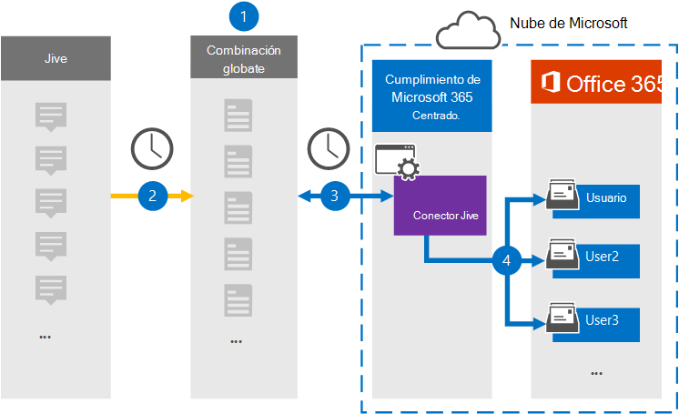

# Configurar un conector para archivar datos JiveSet up a connector to archive Jive data

Use un conector Globanet en el Centro de cumplimiento de Microsoft 365 para importar y archivar datos de la plataforma de colaboración a los buzones de usuario de su organización de Microsoft 365.Use a Globanet connector in the Microsoft 365 compliance center to import and archive data from the collaboration platform to user mailboxes in your Microsoft 365 organization. Globanet proporciona un conector [Jive](https://globanet.com/jive/) que está configurado para capturar elementos del origen de datos de terceros (de forma periódica) y, a continuación, importar esos elementos a Microsoft 365.Globanet provides a [Jive](https://globanet.com/jive/) connector that is configured to capture items from the third-party data source (on a regular basis) and then import those items to Microsoft 365. El conector convierte contenido como mensajes de correo electrónico, chats y datos adjuntos de la cuenta Jive de un usuario a un formato de mensaje de correo electrónico y, a continuación, importa esos elementos al buzón del usuario en Microsoft 365.The connector converts content such as email messages, chats, and attachments from a user's Jive account to an email message format and then imports those items to the user's mailbox in Microsoft 365.

Después de almacenar los datos Jive en buzones de usuario, puede aplicar características de cumplimiento de Microsoft 365, como retención por juicio, exhibición de documentos electrónicos, directivas de retención y etiquetas de retención, y cumplimiento de comunicaciones.After Jive data is stored in user mailboxes, you can apply Microsoft 365 compliance features such as Litigation Hold, eDiscovery, retention policies and retention labels, and communication compliance. El uso de un conector Jive para importar y archivar datos en Microsoft 365 puede ayudar a su organización a cumplir con las directivas gubernamentales y reglamentarias.Using a Jive connector to import and archive data in Microsoft 365 can help your organization stay compliant with government and regulatory policies.

## Información general sobre el archivado de datos JiveOverview of archiving Jive data

En la siguiente introducción se explica el proceso de uso de un conector para archivar los datos Jive en Microsoft 365.The following overview explains the process of using a connector to archive the Jive data in Microsoft 365.

1. Su organización trabaja con Jive para configurar y configurar un sitio Jive.Your organization works with Jive to set up and configure a Jive site.

2. Una vez cada 24 horas, los elementos de Jive se copian en el sitio de Globanet Merge1.Once every 24 hours, items from Jive are copied to the Globanet Merge1 site. El conector también convierte el contenido de los elementos Jive en un formato de mensaje de correo electrónico.The connector also converts the content of Jive items to an email message format.

3. El conector Jive que cree en el Centro de cumplimiento de Microsoft 365 se conecta al sitio de Globanet Merge1 todos los días y transfiere el contenido a una ubicación segura de Azure Storage en la nube de Microsoft.The Jive connector that you create in the Microsoft 365 compliance center connects to the Globanet Merge1 site every day and transfers the content to a secure Azure Storage location in the Microsoft cloud.

4. El conector importa los elementos convertidos a los buzones de usuarios específicos mediante el valor de la propiedad *Email* de la asignación automática de usuarios, tal como se describe en el [paso 3](#step-3-map-users-and-complete-the-connector-setup).The connector imports the converted items to the mailboxes of specific users by using the value of the *Email* property of the automatic user mapping as described in [Step 3](#step-3-map-users-and-complete-the-connector-setup). Se crea una subcarpeta nueva en la carpeta Bandeja de entrada denominada **Jive** en los buzones de usuario y los elementos se importan a esa carpeta.A new subfolder in the Inbox folder named **Jive** is created in the user mailboxes, and the items are imported to that folder. El conector hace esto mediante el valor de la *propiedad Email.*The connector does this by using the value of the *Email* property. Cada elemento Jive contiene esta propiedad, que se rellena con la dirección de correo electrónico de todos los participantes del elemento.Every Jive item contains this property, which is populated with the email address of every participant of the item.

## Antes de empezarBefore you begin

- Cree una cuenta de Globanet Merge1 para los conectores de Microsoft.Create a Globanet Merge1 account for Microsoft connectors. Para crear esta cuenta, póngase en contacto [con el servicio de soporte al cliente de globanet.](https://globanet.com/ms-connectors-contact/)To create this account, contact [globanet customer support](https://globanet.com/ms-connectors-contact/). Inicie sesión en esta cuenta cuando cree el conector en el paso 1.You will sign into this account when you create the connector in Step 1.

- El usuario que crea el conector Jive en el paso 1 (y lo completa en el paso 3) debe estar asignado al rol De importación y exportación de buzones en Exchange Online.The user who creates the Jive connector in Step 1 (and completes it in Step 3) must be assigned to the Mailbox Import Export role in Exchange Online. Este rol es necesario para agregar conectores en la página **Conectores** de datos en el Centro de cumplimiento de Microsoft 365.This role is required to add connectors on the **Data connectors** page in the Microsoft 365 compliance center. De forma predeterminada, este rol no se asigna a un grupo de roles en Exchange Online.By default, this role is not assigned to a role group in Exchange Online. Puede agregar el rol De importación y exportación de buzones al grupo de roles Administración de la organización en Exchange Online.You can add the Mailbox Import Export role to the Organization Management role group in Exchange Online. O bien, puede crear un grupo de roles, asignar el rol de importación y exportación de buzones de correo y, a continuación, agregar los usuarios adecuados como miembros.Or you can create a role group, assign the Mailbox Import Export role, and then add the appropriate users as members. Para obtener más información, vea  las secciones Crear grupos de [roles](https://docs.microsoft.com/Exchange/permissions-exo/role-groups#create-role-groups) o Modificar grupos de roles en el artículo "Administrar grupos de roles en Exchange Online".For more information, see the [Create role groups](https://docs.microsoft.com/Exchange/permissions-exo/role-groups#create-role-groups) or [Modify role groups](https://docs.microsoft.com/Exchange/permissions-exo/role-groups#modify-role-groups) sections in the article "Manage role groups in Exchange Online".

## Paso 1: Configurar el conector JiveStep 1: Set up the Jive connector

El primer paso es acceder a la página **Conectores** de datos en el Centro de cumplimiento de Microsoft 365 y crear un conector para datos Jive.The first step is to access to the **Data Connectors** page in the Microsoft 365 compliance center and create a connector for Jive data.

1. Vaya a [https://compliance.microsoft.com](https://compliance.microsoft.com/) Y, a continuación, **haga clic en Conectores de** datos  >  **Jive**.Go to [https://compliance.microsoft.com](https://compliance.microsoft.com/) and then click **Data connectors** > **Jive**.

2. En la página **Descripción del producto Jive,** haga clic **en Agregar conector.**On the **Jive** product description page, click **Add connector**.

3. En la **página Términos de** servicio, haga clic **en Aceptar.**On the **Terms of service** page, click **Accept**.

4. Escriba un nombre único que identifique el conector y, a continuación, haga clic en **Siguiente**.Enter a unique name that identifies the connector, and then click **Next**.

5. Inicie sesión en su cuenta merge1 para configurar el conector.Sign in to your Merge1 account to configure the connector.

## Paso 2: Configurar el conector JiveStep 2: Configure the Jive connector

El segundo paso es configurar el conector Jive en el sitio Merge1.The second step is to configure the Jive connector on the Merge1 site. Para obtener información acerca de cómo configurar el conector Jive, vea la Guía del usuario de Conectores de [terceros Merge1.](https://docs.ms.merge1.globanetportal.com/Merge1%20Third-Party%20Connectors%20Jive%20User%20Guide.pdf)For information about how to configure the Jive connector, see [Merge1 Third-Party Connectors User Guide](https://docs.ms.merge1.globanetportal.com/Merge1%20Third-Party%20Connectors%20Jive%20User%20Guide.pdf).

Después de hacer clic en &  **finalizar,** se muestra la página Asignación de usuarios en el Asistente para conectores en el Centro de cumplimiento de Microsoft 365.After you click **Save & Finish**, the **User mapping** page in the connector wizard in the Microsoft 365 compliance center is displayed.

## Paso 3: Asignar usuarios y completar la configuración del conectorStep 3: Map users and complete the connector setup

Para asignar usuarios y completar la configuración del conector en el Centro de cumplimiento de Microsoft 365, siga los pasos siguientes:To map users and complete the connector setup in the Microsoft 365 compliance center, follow the steps below:

1. En la página Asignar usuarios de Jive a **usuarios de Microsoft 365,** habilite la asignación automática de usuarios.On the **Map Jive users to Microsoft 365 users** page, enable automatic user mapping. Los elementos Jive incluyen una propiedad denominada *Correo* electrónico, que contiene direcciones de correo electrónico para los usuarios de su organización.The Jive items include a property called *Email*, which contains email addresses for users in your organization. Si el conector puede asociar esta dirección con un usuario de Microsoft 365, los elementos se importan al buzón de ese usuario.If the connector can associate this address with a Microsoft 365 user, the items are imported to that user's mailbox.

2. Haga **clic en** Siguiente, revise  la configuración y vaya a la página Conectores de datos para ver el progreso del proceso de importación para el nuevo conector.Click **Next**, review your settings, and go to the **Data connectors** page to see the progress of the import process for the new connector.

## Paso 4: Supervisar el conector JiveStep 4: Monitor the Jive connector

Después de crear el conector Jive, puede ver el estado del conector en el Centro de cumplimiento de Microsoft 365.After you create the Jive connector, you can view the connector status in the Microsoft 365 compliance center.

1. Vaya a [https://compliance.microsoft.com](https://compliance.microsoft.com) conectores de **datos y haga clic en** conectores de datos en el panel de navegación izquierdo.Go to [https://compliance.microsoft.com](https://compliance.microsoft.com) and click **Data connectors** in the left nav.

2. Haga clic **en la pestaña Conectores** y, a continuación, seleccione el **conector Jive** para mostrar la página desplegable.Click the **Connectors** tab and then select the **Jive** connector to display the flyout page. Esta página contiene las propiedades y la información sobre el conector.This page contains the properties and information about the connector.

3. En Estado del conector  **con origen,** haga clic en el vínculo Descargar registro para abrir (o guardar) el registro de estado del conector.Under **Connector status with source**, click the **Download log** link to open (or save) the status log for the connector. Este registro contiene información sobre los datos que se han importado a la nube de Microsoft.This log contains information about the data that has been imported to the Microsoft cloud.

## Problemas conocidosKnown issues

- En este momento, no se admite la importación de datos adjuntos o elementos de más de 10 MB.At this time, we don't support importing attachments or items that are larger than 10 MB. La compatibilidad con elementos más grandes estará disponible en una fecha posterior.Support for larger items will be available at a later date.
