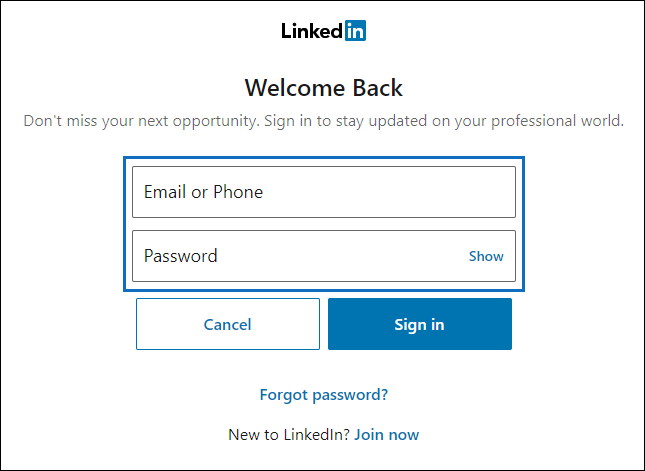

# Configurar un conector para archivar datos de LinkedIn

Use un conector en el centro de cumplimiento de Microsoft 365 para importar y archivar datos de las páginas de la compañía de LinkedIn. Después de configurar y configurar un conector, se conecta a la cuenta de la página específica de la empresa de LinkedIn una vez cada 24 horas. El conector convierte los mensajes enviados a la página de la compañía a un mensaje de correo electrónico y, a continuación, importa esos elementos a un buzón en Microsoft 365.

Una vez que los datos de la página de la compañía de LinkedIn se almacenan en un buzón de correo, puede aplicar las características de cumplimiento de Microsoft 365, como la retención por juicio, la búsqueda de contenido, el archivado local, la auditoría y las directivas de retención de Microsoft 365 a los datos de LinkedIn. Por ejemplo, puede buscar estos elementos mediante la búsqueda de contenido o asociar el buzón de almacenamiento a un custodio en un caso de exhibición avanzada de documentos electrónicos. La creación de un conector para importar y archivar datos de LinkedIn en Microsoft 365 puede ayudar a su organización a cumplir las directivas gubernamentales y regulatorias.

## Antes de empezar

- La organización debe permitir que el servicio de importación de Office 365 obtenga acceso a los datos de buzones de la organización. Para dar su consentimiento a esta solicitud, vaya a [esta página](https://login.microsoftonline.com/common/oauth2/authorize?client_id=570d0bec-d001-4c4e-985e-3ab17fdc3073&response_type=code&redirect_uri=https://portal.azure.com/&nonce=1234&prompt=admin_consent), inicie sesión con las credenciales de un administrador global de Microsoft 365 y, a continuación, acepte la solicitud.

- El usuario que crea un conector de página de la compañía de LinkedIn debe tener asignado el rol importación y exportación de buzones de correo en Exchange Online. Esto es necesario para agregar conectores en la página **conectores de datos** en el centro de cumplimiento de Microsoft 365. Este rol no está asignado a ningún grupo de roles de Exchange Online de forma predeterminada. Puede Agregar el rol importación y exportación de buzones al grupo de funciones de administración de la organización en Exchange Online. O bien, puede crear un grupo de roles, asignar el rol de importación y exportación de buzones de correo y, a continuación, agregar los usuarios adecuados como miembros. Para obtener más información, vea las secciones [crear grupos](https://docs.microsoft.com/Exchange/permissions-exo/role-groups#create-role-groups) de roles o [modificar grupos de roles](https://docs.microsoft.com/Exchange/permissions-exo/role-groups#modify-role-groups) en el artículo sobre la administración de grupos de roles en Exchange Online.

- Debe tener las credenciales de inicio de sesión (dirección de correo electrónico o número de teléfono y contraseña) de una cuenta de usuario de LinkedIn que sea un administrador de la página de la compañía de LinkedIn que desea archivar. Use estas credenciales para iniciar sesión en LinkedIn cuando configure el conector.

## Crear un conector de LinkedIn

1. Vaya a <https://compliance.microsoft.com> y haga clic en **conectores** > de datos páginas de la**compañía LinkedIn**.

2. En la página del producto **páginas de LinkedIn Company** , haga clic en **Agregar conector**.

3. En la página **condiciones de servicio** , seleccione **Aceptar**.

4. En la página **iniciar sesión con LinkedIn** , haga clic en **iniciar sesión con LinkedIn**.

   Se muestra la página de inicio de LinkedIn.

   

5. En la página de inicio de LinkedIn, escriba la dirección de correo electrónico (o el número de teléfono) y la contraseña de la cuenta de LinkedIn asociada a la página de la compañía que desea archivar y, a continuación, haga clic en **iniciar sesión**.

   Se muestra una página del asistente con una lista de todas las páginas de LinkedIn Company asociadas con la cuenta en la que ha iniciado sesión. Un conector solo se puede configurar para una página de la compañía. Si su organización tiene varias páginas de la compañía de LinkedIn, tiene que crear un conector para cada una.

   

6. Seleccione la página de la compañía desde la que desea archivar elementos y, a continuación, haga clic en **siguiente**.

7. En la página **Establecer filtros** , puede aplicar un filtro para importar inicialmente los elementos que tienen una antigüedad determinada. Seleccione una edad y, a continuación, haga clic en **siguiente**.

8. En la página **Elegir ubicación de almacenamiento** , haga clic en el cuadro, seleccione la dirección de correo electrónico de un buzón de correo de Microsoft 365 al que se importarán los elementos de LinkedIn y, a continuación, haga clic en **siguiente**. Los elementos se importan a la carpeta Bandeja de entrada en este buzón.

9. En el **acuerdo proporcionar consentimiento del administrador**, haga clic en **proporcionar consentimiento** y, a continuación, siga los pasos. Debe ser administrador global para dar su consentimiento al servicio de importación de Office 365 para obtener acceso a los datos de su organización.

10. Haga clic en **siguiente** para revisar la configuración del conector y, a continuación, haga clic en **Finalizar** para completar la configuración del conector.

Después de crear el conector, puede volver a la página **conectores de datos** para ver el progreso del proceso de importación del nuevo conector (seleccione **Actualizar** si es necesario para actualizar la lista de conectores). El valor de la columna **Estado** está **a la espera de iniciarse**. El proceso de importación inicial tardará hasta 24 horas en iniciarse. Después de que se ejecute el conector por primera vez y se importen los elementos de LinkedIn, el conector se ejecutará una vez cada 24 horas e importará los elementos nuevos que se creen en la página de la compañía de LinkedIn en las 24 horas anteriores.

Para ver más detalles, seleccione el conector en la lista de la página **conectores de datos** para mostrar la página de control flotante. En **Estado**, el intervalo de fechas que se muestra indica el filtro de antigüedad que se seleccionó cuando se creó el conector. 

## Más información

Los elementos de LinkedIn se importan a la subcarpeta de LinkedIn en la bandeja de entrada del buzón de almacenamiento en Microsoft 365. Aparecen como mensajes de correo electrónico.
