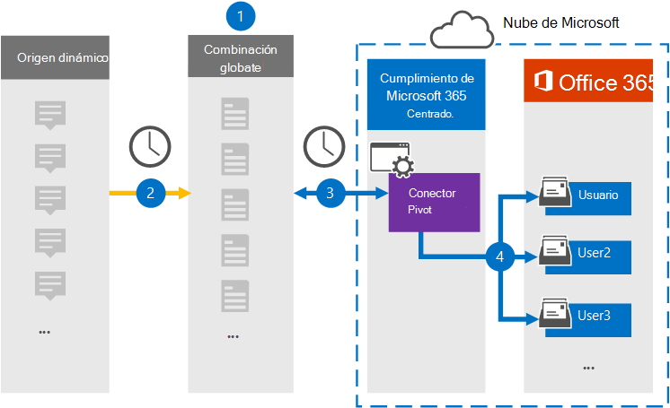

# Configurar un conector para archivar datos dinámicos

Use un conector Veritas en el centro de cumplimiento Microsoft 365 para importar y archivar datos desde la plataforma dinámica a buzones de usuario de la Microsoft 365 organización. Veritas le proporciona un conector dinámico que está configurado para capturar elementos del origen de datos de terceros (de forma regular) y, [a](https://globanet.com/pivot/) continuación, importar esos elementos a Microsoft 365. Pivot es una plataforma de mensajería instantánea que permite la colaboración con los participantes del mercado financiero. El conector convierte elementos como mensajes de chat, de las cuentas dinámicas de un usuario a un formato de mensaje de correo electrónico y, a continuación, importa esos elementos a los buzones de usuario en Microsoft 365.

Una vez que los datos dinámicos se almacenan en buzones de usuario, puede aplicar características de cumplimiento Microsoft 365 como retención por juicio, exhibición de documentos electrónicos, directivas de retención y etiquetas de retención y cumplimiento de comunicaciones. El uso de un conector dinámico para importar y archivar datos en Microsoft 365 puede ayudar a su organización a cumplir con las directivas gubernamentales y reglamentarias.

## Información general sobre el archivado de datos dinámicos

En la siguiente introducción se explica el proceso de uso de un conector para archivar los datos dinámicos en Microsoft 365.

1. Su organización funciona con Pivot para configurar y configurar un sitio de origen dinámico.

2. Una vez cada 24 horas, los elementos dinámicos se copian en el sitio Veritas Merge1. El conector también convierte los elementos dinámicos en un formato de mensaje de correo electrónico.

3. El conector dinámico que cree en el centro de cumplimiento de Microsoft 365, se conecta al sitio Veritas Merge1 todos los días y transfiere los elementos dinámicos a una ubicación Azure Storage segura en la nube de Microsoft.

4. El conector importa los elementos dinámicos a los buzones de usuarios específicos mediante el valor de la propiedad *Email* de la asignación automática de usuarios, tal como se describe en [el paso 3](#step-3-map-users-and-complete-the-connector-setup). Se crea una subcarpeta en la carpeta Bandeja de entrada denominada **Pivot** en los buzones de usuario y los elementos se importan a esa carpeta. El conector hace esto mediante el valor de la *propiedad Email.* Cada elemento dinámico contiene esta propiedad, que se rellena con la dirección de correo electrónico de cada participante del elemento.

## Antes de empezar

- Cree una cuenta de Veritas Merge1 para conectores de Microsoft. Para crear esta cuenta, póngase en contacto con [el servicio de soporte al cliente de Veritas](https://www.veritas.com/content/support/). Iniciará sesión en esta cuenta al crear el conector en el paso 1.

- El usuario que crea el conector dinámico en el paso 1 (y lo completa en el paso 3) debe estar asignado al rol De exportación de importación de buzones en Exchange Online. Este rol es necesario para agregar conectores en la página Conectores de datos del centro de Microsoft 365 cumplimiento. De forma predeterminada, este rol no se asigna a un grupo de roles en Exchange Online. Puede agregar el rol Exportación de importación de buzones al grupo de roles Administración de la organización en Exchange Online. O bien, puede crear un grupo de roles, asignar el rol Importación de buzones de correo Exportar y, a continuación, agregar los usuarios adecuados como miembros. Para obtener más información, vea  las secciones [Crear](/Exchange/permissions-exo/role-groups#create-role-groups) grupos de roles o Modificar grupos de roles en el artículo "Administrar grupos de roles en Exchange Online".

## Paso 1: Configurar el conector dinámico

El primer paso es obtener acceso a la página **Conectores** de datos en el Centro de cumplimiento de Microsoft y crear un conector para datos dinámicos.

1. Vaya a [https://compliance.microsoft.com](https://compliance.microsoft.com/) y, a continuación, haga clic **en Conectores de datos**  >  **Pivot**.

2. En la **página Descripción** del producto dinámico, haga clic en **Agregar conector**.

3. En la **página Términos de** servicio, haga clic **en Aceptar**.

4. Escriba un nombre único que identifique el conector y, a continuación, haga clic en **Siguiente**.

5. Inicie sesión en su cuenta merge1 para configurar el conector.

## Paso 2: Configurar el conector dinámico en el sitio Veritas Merge1

El segundo paso es configurar el conector dinámico en el sitio Merge1. Para obtener información sobre cómo configurar el conector dinámico en el sitio Veritas Merge1, vea [Merge1 Third-Party Connectors User Guide](https://docs.ms.merge1.globanetportal.com/Merge1%20Third-Party%20Connectors%20Pivot%20User%20Guide%20.pdf).

Después de hacer clic en Guardar  & **finalizar**, se muestra la página Asignación de usuario en el asistente para conectores en Microsoft 365 centro de cumplimiento.

## Paso 3: Asignar usuarios y completar la configuración del conector

Para asignar usuarios y completar la configuración del conector en el Centro de cumplimiento de Microsoft 356, siga estos pasos:

1. En la **página Asignar usuarios dinámicos Microsoft 365 usuarios,** habilite la asignación automática de usuarios. Los elementos dinámicos incluyen una propiedad denominada *Email*, que contiene direcciones de correo electrónico para los usuarios de la organización. Si el conector puede asociar esta dirección a un Microsoft 365, los elementos se importan al buzón de ese usuario.

2. Haga **clic en** Siguiente, revise la configuración y vaya a la página **Conectores** de datos para ver el progreso del proceso de importación del nuevo conector.

## Paso 4: Supervisar el conector dinámico

Después de crear el conector dinámico, puede ver el estado del conector en el centro de Microsoft 365 de cumplimiento.

1. Vaya a [https://compliance.microsoft.com](https://compliance.microsoft.com) y haga clic en **Conectores de datos** en la navegación izquierda.

2. Haga clic **en la pestaña Conectores** y, **a** continuación, seleccione el conector dinámico para mostrar la página desplegable. Esta página contiene las propiedades y la información sobre el conector.

3. En **Estado del conector con origen,** haga clic en el vínculo Descargar **registro** para abrir (o guardar) el registro de estado del conector. Este registro contiene datos que se han importado a la nube de Microsoft.

## Problemas conocidos

- En este momento, no se admite la importación de datos adjuntos o elementos de más de 10 MB. La compatibilidad con elementos más grandes estará disponible en una fecha posterior.