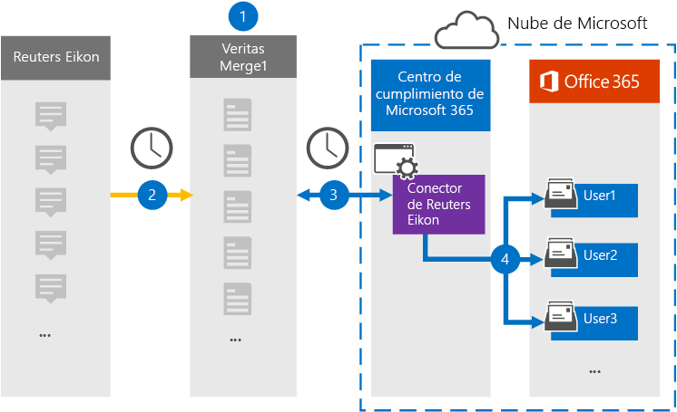

# Configurar un conector para archivar datos de Reuters EikonSet up a connector to archive Reuters Eikon data

Use un conector de Globanet en el Centro de cumplimiento de Microsoft 365 para importar y archivar datos de la plataforma Reuters Eikon a los buzones de usuario de su organización de Microsoft 365.Use a Globanet connector in the Microsoft 365 compliance center to import and archive data from the Reuters Eikon platform to user mailboxes in your Microsoft 365 organization. Globanet proporciona un conector Eikon de [Reuters](https://globanet.com/eikon/) que está configurado para capturar elementos del origen de datos de terceros (de forma regular) e importar esos elementos a Microsoft 365.Globanet provides a [Reuters Eikon](https://globanet.com/eikon/) connector that is configured to capture items from the third-party data source (on a regular basis) and import those items to Microsoft 365. El conector convierte el contenido, como mensajes de persona a persona, chats de grupo, datos adjuntos y declinaciones de responsabilidades de la cuenta eikon de Reuters de un usuario a un formato de mensaje de correo electrónico y, a continuación, importa esos elementos al buzón del usuario en Microsoft 365.The connector converts the content such as person-to-person messages, group chats, attachments, and disclaimers from a user's Reuters Eikon account to an email message format and then imports those items to the user's mailbox in Microsoft 365.

Una vez que los datos de Reuters Eikon se almacenan en buzones de usuario, puede aplicar características de cumplimiento de Microsoft 365 como retención por juicio, exhibición de documentos electrónicos, directivas de retención y etiquetas de retención y cumplimiento de comunicaciones.After Reuters Eikon data is stored in user mailboxes, you can apply Microsoft 365 compliance features such as Litigation Hold, eDiscovery, retention policies and retention labels, and communication compliance. El uso de un conector Eikon de Reuters para importar y archivar datos en Microsoft 365 puede ayudar a su organización a cumplir con las directivas gubernamentales y reglamentarias.Using a Reuters Eikon connector to import and archive data in Microsoft 365 can help your organization stay compliant with government and regulatory policies.

## Información general sobre el archivado de datos de Reuters EikonOverview of archiving Reuters Eikon data

En la siguiente introducción se explica el proceso de uso de un conector para archivar datos de Reuters Eikon en Microsoft 365.The following overview explains the process of using a connector to archive Reuters Eikon data in Microsoft 365.

1. Su organización trabaja con Reuters Eikon para configurar y configurar un sitio de Reuters Eikon.Your organization works with Reuters Eikon to set up and configure a Reuters Eikon site.

2. Una vez cada 24 horas, los elementos de Reuters Eikon se copian en el sitio de Globanet Merge1.Once every 24 hours, Reuters Eikon items are copied to the Globanet Merge1 site. El conector también convierte los elementos de Reuters Eikon a un formato de mensaje de correo electrónico.The connector also converts Reuters Eikon items to an email message format.

3. El conector Eikon de Reuters que cree en el centro de cumplimiento de Microsoft 365 se conecta al sitio de Globanet Merge1 todos los días y transfiere el contenido a una ubicación segura de Azure Storage en la nube de Microsoft.The Reuters Eikon connector that you create in the Microsoft 365 compliance center connects to the Globanet Merge1 site every day and transfers the content to a secure Azure Storage location in the Microsoft cloud.

4. El conector importa elementos a los buzones de usuarios específicos mediante el valor de la propiedad *Email* de la asignación automática de usuarios, tal como se describe en [el paso 3](#step-3-map-users-and-complete-the-connector-setup).The connector imports items to the mailboxes of specific users by using the value of the *Email* property of the automatic user mapping as described in [Step 3](#step-3-map-users-and-complete-the-connector-setup). Se crea una subcarpeta en la carpeta Bandeja de entrada denominada **Reuters Eikon** en los buzones de usuario y los elementos se importan a esa carpeta.A subfolder in the Inbox folder named **Reuters Eikon** is created in the user mailboxes, and the items are imported to that folder. El conector determina a qué buzón se importarán los elementos mediante el valor de la *propiedad Email.*The connector determines which mailbox to import items to by using the value of the *Email* property. Cada elemento de Reuters Eikon contiene esta propiedad, que se rellena con la dirección de correo electrónico de cada participante del elemento.Every Reuters Eikon item contains this property, which is populated with the email address of every participant of the item.

## Antes de empezarBefore you begin

- Crear una cuenta de Globanet Merge1 para conectores de Microsoft.Create a Globanet Merge1 account for Microsoft connectors. Para crear una cuenta, póngase en contacto [con el servicio de soporte al cliente de Globanet](https://globanet.com/ms-connectors-contact).To create an account, contact [Globanet Customer Support](https://globanet.com/ms-connectors-contact). Iniciará sesión en esta cuenta al crear el conector en el paso 1.You will sign into this account when you create the connector in Step 1.

- El usuario que crea el conector Reuters Eikon en el paso 1 (y lo completa en el paso 3) debe estar asignado al rol De exportación de importación de buzones en Exchange Online.The user who creates the Reuters Eikon connector in Step 1 (and completes it in Step 3) must be assigned to the Mailbox Import Export role in Exchange Online. Este rol es necesario para agregar conectores en la página **Conectores de datos** del Centro de cumplimiento de Microsoft 365.This role is required to add connectors on the **Data connectors** page in the Microsoft 365 compliance center. De forma predeterminada, este rol no se asigna a un grupo de roles en Exchange Online.By default, this role is not assigned to a role group in Exchange Online. Puede agregar el rol Exportación de importación de buzones al grupo de roles Administración de la organización en Exchange Online.You can add the Mailbox Import Export role to the Organization Management role group in Exchange Online. O bien, puede crear un grupo de roles, asignar el rol Importación de buzones de correo Exportar y, a continuación, agregar los usuarios adecuados como miembros.Or you can create a role group, assign the Mailbox Import Export role, and then add the appropriate users as members. Para obtener más información, vea  las secciones [Crear](/Exchange/permissions-exo/role-groups#create-role-groups) grupos de roles o Modificar grupos de roles en el artículo "Administrar grupos de roles en Exchange Online".For more information, see the [Create role groups](/Exchange/permissions-exo/role-groups#create-role-groups) or [Modify role groups](/Exchange/permissions-exo/role-groups#modify-role-groups) sections in the article "Manage role groups in Exchange Online".

## Paso 1: Configurar el conector Reuters EikonStep 1: Set up the Reuters Eikon connector

El primer paso es obtener acceso a la página **Conectores** de datos en el Centro de cumplimiento de Microsoft 365 y crear un conector para datos Eikon de Reuters.The first step is to access to the **Data Connectors** page in the Microsoft 365 compliance center and create a connector for Reuters Eikon data.

1. Vaya a [https://compliance.microsoft.com](https://compliance.microsoft.com/) y, a continuación, haga clic en **Conectores de**  >  **datos Reuters Eikon**.Go to [https://compliance.microsoft.com](https://compliance.microsoft.com/) and then click **Data connectors** > **Reuters Eikon**.

2. En la **página Descripción del producto Reuters Eikon,** haga clic en Agregar **conector**.On the **Reuters Eikon** product description page, click **Add connector**.

3. En la **página Términos de** servicio, haga clic **en Aceptar**.On the **Terms of service** page, click **Accept**.

4. Escriba un nombre único que identifique el conector y, a continuación, haga clic en **Siguiente**.Enter a unique name that identifies the connector, and then click **Next**.

5. Inicie sesión en su cuenta merge1 para configurar el conector.Sign in to your Merge1 account to configure the connector.

## Paso 2: Configurar el conector Reuters Eikon en el sitio de Globanet Merge1Step 2: Configure the Reuters Eikon connector on the Globanet Merge1 site

El segundo paso es configurar el conector Reuters Eikon en el sitio Merge1.The second step is to configure the Reuters Eikon connector on the Merge1 site. Para obtener información sobre cómo configurar el conector Reuters Eikon en el sitio de Globanet Merge1, vea [Merge1 Third-Party Connectors User Guide](https://docs.ms.merge1.globanetportal.com/Merge1%20Third-Party%20Connectors%20Reuters%20Eikon%20User%20Guide%20.pdf).For information about how to configure the Reuters Eikon connector on the Globanet Merge1 site, see [Merge1 Third-Party Connectors User Guide](https://docs.ms.merge1.globanetportal.com/Merge1%20Third-Party%20Connectors%20Reuters%20Eikon%20User%20Guide%20.pdf).

Después de hacer clic en Guardar  & **finalizar**, se muestra la página Asignación de usuario en el asistente para conectores en el Centro de cumplimiento de Microsoft 365.After you click **Save & Finish**, the **User mapping** page in the connector wizard in the Microsoft 365 compliance center is displayed.

## Paso 3: Asignar usuarios y completar la configuración del conectorStep 3: Map users and complete the connector setup

Para asignar usuarios y completar la configuración del conector en el Centro de cumplimiento de Microsoft 365, siga estos pasos:To map users and complete the connector setup in the Microsoft 365 compliance center, follow these steps:

1. En la **página Asignar usuarios externos a usuarios de Microsoft 365,** habilite la asignación automática de usuarios.On the **Map external users to Microsoft 365 users** page, enable automatic user mapping. Los elementos Eikon de Reuters incluyen una propiedad denominada *Email*, que contiene direcciones de correo electrónico para los usuarios de la organización.The Reuters Eikon items include a property called *Email*, which contains email addresses for users in your organization. Si el conector puede asociar esta dirección con un usuario de Microsoft 365, los elementos se importan al buzón de ese usuario.If the connector can associate this address with a Microsoft 365 user, the items are imported to that user’s mailbox.

2. Haga **clic en** Siguiente, revise la configuración y, a continuación, vaya a la página **Conectores** de datos para ver el progreso del proceso de importación del nuevo conector.Click **Next**, review your settings, and then go to the **Data connectors** page to see the progress of the import process for the new connector.

## Paso 4: Supervisar el conector Reuters EikonStep 4: Monitor the Reuters Eikon connector

Después de crear el conector Reuters Eikon, puede ver el estado del conector en el Centro de cumplimiento de Microsoft 365.After you create the Reuters Eikon connector, you can view the connector status in the Microsoft 365 compliance center.

1. Vaya a [https://compliance.microsoft.com](https://compliance.microsoft.com) y haga clic en **Conectores de datos** en la navegación izquierda.Go to [https://compliance.microsoft.com](https://compliance.microsoft.com) and click **Data connectors** in the left nav.

2. Haga clic **en la pestaña** Conectores y, a continuación, seleccione el conector **Reuters Eikon** para mostrar la página desplegable.Click the **Connectors** tab and then select the **Reuters Eikon** connector to display the flyout page. Esta página contiene las propiedades y la información sobre el conector.This page contains the properties and information about the connector.

3. En **Estado del conector con origen,** haga clic en el vínculo Descargar **registro** para abrir (o guardar) el registro de estado del conector.Under **Connector status with source**, click the **Download log** link to open (or save) the status log for the connector. Este registro contiene información sobre los datos que se han importado a la nube de Microsoft.This log contains information about the data that has been imported to the Microsoft cloud.

## Problemas conocidosKnown issues

- En este momento, no se admite la importación de datos adjuntos o elementos de más de 10 MB.At this time, we don't support importing attachments or items that are larger than 10 MB. La compatibilidad con elementos más grandes estará disponible en una fecha posterior.Support for larger items will be available at a later date.